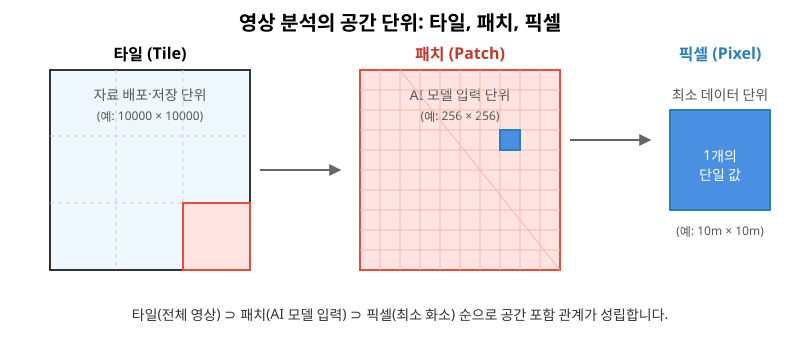
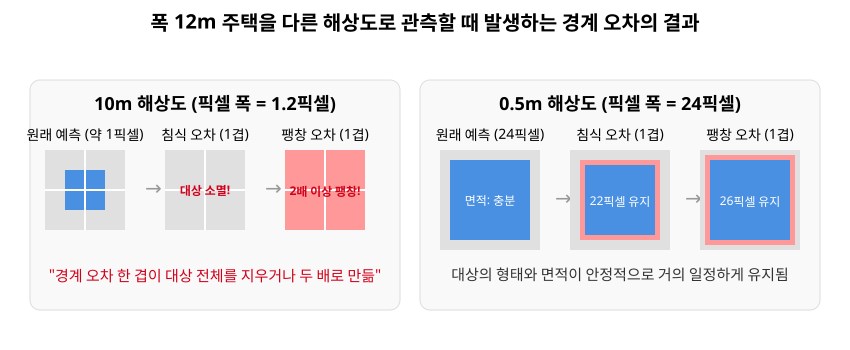
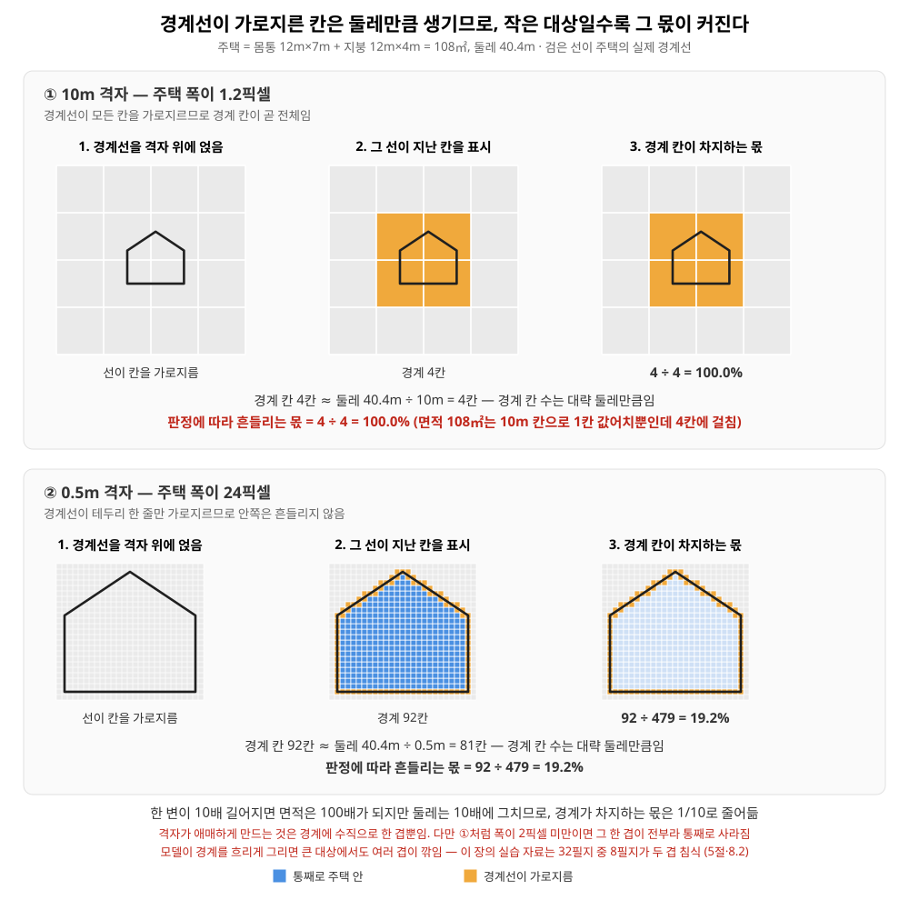
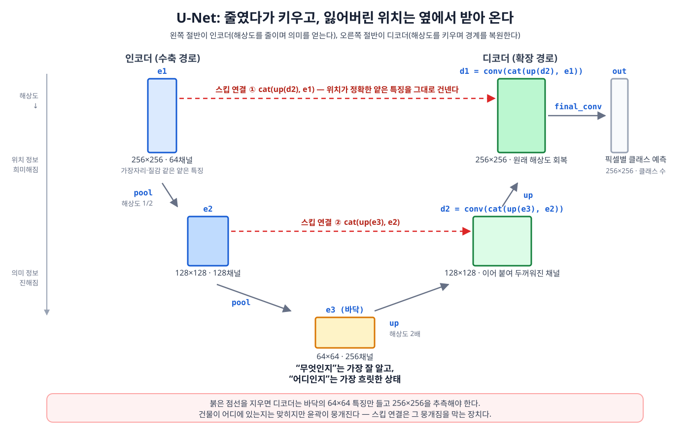
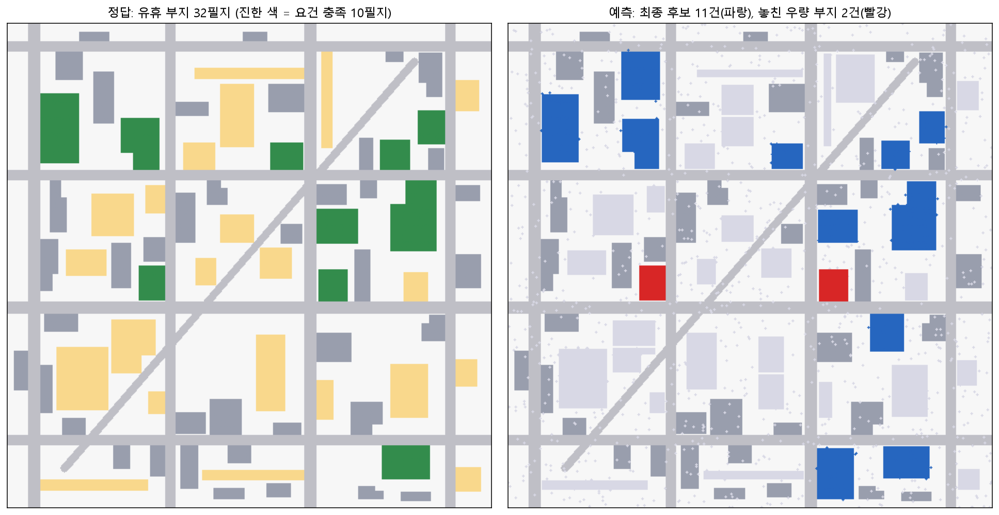

# 6장 영역 추출과 변화 탐지, 마스크에서 결정까지


## 1. 이 장의 핵심 질문

○ 이 장이 끝까지 답하려는 질문은 세 가지임.

1. **픽셀마다 붙인 답(마스크)을 어떻게 채점하는가.** 그리고 뒤에 붙이는 필터는 무엇을 올리고, 무엇을 올리지 못하는가.
2. **마스크를 개체 목록으로 바꿔, 면적·최소폭·접도 요건으로 거르는 계산은 어떤 순서로 하는가.**
3. **마스크의 오차에는 방향이 있다.** 그 한쪽으로 쏠린 오차(편향)가 후보 목록을 어떻게 뒤집으며, 어디까지 되돌릴 수 있는가.

○ 5장에서 다룬 영상 분류는 사진 조각 하나에 답 하나를 냄. “이 패치[^1]는 산림이다”처럼요.

○ 이 장의 세그멘테이션은 다름. 픽셀마다 답을 붙여서 “산림이 몇 헥타르이고, 경계가 어느 픽셀인가”까지 답함.

○ 변화 탐지는 같은 계산을 두 시점에 걸쳐 함. “지난번과 이번 사이에 무엇이 달라졌는가”에 답함.

○ 셋의 결과물은 모두 **마스크**임. 마스크는 대상인 픽셀에 1을, 아닌 픽셀에 0을 채운 격자임. 색칠 공부에서 해당 칸만 칠한 모눈종이라고 보면 됨.

○ 마스크 자체는 아직 행정이나 사업의 결정 단위가 아닙니다. “이 칸이 1이다”만으로는 어느 부서가 나가고, 어느 땅을 보러 갈지 정해지지 않음. 그래서 구역별 면적, 객체 목록, 후보표로 옮기는 계산이 뒤에 붙음.

[^1]: **픽셀, 패치, 타일의 공간적 위계.** 위성영상 분석에서 **타일(Tile)**은 원본 영상을 배포하고 저장하는 큰 단위임. 예는 10000×10000임. **패치(Patch)**는 AI 모델이 한 번에 처리하도록 잘라 낸 조각임. 예는 256×256임. **픽셀(Pixel)**은 영상의 가장 작은 점 하나, 즉 최소 데이터 단위임. 포함 관계는 타일 ⊃ 패치 ⊃ 픽셀임. 큰 상자 안에 중간 조각이 있고, 그 안에 점이 있음.



**그림 6.0** 타일은 원본 영상의 배포·저장 단위이고, 패치는 모델이 한 번에 읽는 입력 단위이며, 픽셀은 영상의 최소 데이터 단위임.

## 2. 도입 사례: 필터 하나가 정밀도를 0.572에서 1.000으로 올린다

○ 상황을 먼저 놓음. 광역지자체가 관내 보호구역의 무단 훼손을 점검함. 아래 숫자는 `6-1-change-detection-policy.log`를 실제로 실행해 얻은 값임.

○ 무대는 128×128 래스터임. 래스터는 픽셀이 바둑판처럼 늘어선 영상임. 픽셀 한 변은 10m이고, 픽셀 하나의 면적은 10m × 10m = 100㎡ = 0.01헥타르임.

○ 진짜로 변한 픽셀은 2,001개임. 모델이 “변했다”고 예측한 픽셀은 3,022개임. 정답보다 51% 많음. 모델이 변화를 넉넉하게, 아니 너무 많이 찍었다는 뜻임.

○ 필터를 걸기 전과 후를 나란히 놓으면 다음과 같음.

| 단계 | IoU | 정밀도 | 재현율 | Dice |
| --- | ---: | ---: | ---: | ---: |
| 필터 전 | 0.525 | 0.572 | 0.865 | 0.689 |
| 필터 후 | 0.865 | 1.000 | 0.865 | 0.927 |

○ 필터는 두 규칙을 적용함.

 ○ 식생지수 차분이 0.25를 넘는 픽셀만 남깁니다. 식생이 크게 줄어야 진짜 개발로 본다는 뜻임.
 ○ 서로 연결된 덩어리가 1헥타르(100픽셀) 미만이면 지움. 작은 얼룩은 잡음으로 본다는 뜻임.

○ 읽는 법은 이와 같음.

 ○ **정밀도**는 “변화라고 판정한 것 중 진짜의 비율”임. 높을수록 헛짚음이 적음.
 ○ **재현율**은 “진짜 변화 중 잡아낸 비율”임. 높을수록 놓침이 적음.

○ 여기서 중요한 비대칭이 있음. **정밀도만 0.572에서 1.000으로 오르고, 재현율은 0.865에서 그대로임.** 필터가 가짜만 지우고, 이미 놓친 변화는 되살리지 못했다는 뜻임. 이 비대칭이 우연이 아니라는 것을 6절에서 계산으로 확인함.

○ 필터를 거친 마스크를 16개 구역(4×4 격자)에 포개면, 15개 구역에서 변화가 잡히고 합계는 17.3헥타르임. 상위 5구역은 다음과 같음.

| 순위 | 구역 | 변화 면적(ha) |
| ---: | ---: | ---: |
| 1 | 구역 9 | 2.93 |
| 2 | 구역 10 | 2.47 |
| 3 | 구역 13 | 2.30 |
| 4 | 구역 6 | 1.78 |
| 5 | 구역 15 | 1.41 |

○ “픽셀 3,022개가 변했다”는 말로는 담당 부서를 정하지 못함. 어느 과가 나갈지 모르기 때문임. “구역 9에서 2.93헥타르가 개발되었고, 관내에서 가장 크다”는 점검반의 방문 순서를 정함.

○ 이 장은 이 두 계산, 즉 **채점해서 걸러 내기**와 **구역별로 모아 순서를 매기기**를 어떤 절차로 하는지 다룸. 그리고 대상이 픽셀이 아니라 개별 필지일 때 무엇이 달라지는지도 다룸.

## 3. 무엇을 만들 것인가 정하기

○ 일을 시작하기 전에 “어떤 답을 낼 것인가”를 정해야 함. 답의 종류가 달라지면 필요한 자료와 뒤 계산이 통째로 달라짐.

### 3.1 과업 유형

○ 주택가 사진 한 장을 놓고도, 묻는 질문에 따라 답의 층위가 갈림.

| 과업 | 한 입력에 대한 답 | 답할 수 있는 질문 |
| --- | --- | --- |
| 시맨틱 세그멘테이션 | 픽셀마다 클래스 1개 | 산림이 몇 헥타르이고 경계가 어디인가 |
| 인스턴스 세그멘테이션 | 개체마다 마스크 1개 | 각 건물의 면적과 형상은 얼마인가 |
| 파놉틱 세그멘테이션 | 픽셀당 클래스 + 개체 식별자 | 개체와 배경을 한 지도에서 같이 다룰 수 있는가 |
| 변화 탐지 | 픽셀당 변화 여부 | 두 시점 사이 어디가 달라졌는가 |

○ 쉽게 나누면 이와 같음.

 ○ 시맨틱은 “이 칸은 숲, 저 칸은 도로”처럼 종류만 붙임. 숲 1과 숲 2를 구분하지 않음.
 ○ 인스턴스는 “건물 A, 건물 B”처럼 개체마다 따로 마스크를 줌.
 ○ 파놉틱은 둘을 합칩니다. 칸의 종류와 개체 번호를 같이 가짐.
 ○ 변화 탐지는 “이 칸이 두 시점 사이에 바뀌었는가”만 답함.

○ 참고 링크: https://rubber-tree.tistory.com/134

□ **변화 탐지는 별도 계열이 아니라, 두 시점을 입력으로 받는 세그멘테이션임.** 계산의 뼈대는 같고, 달라지는 지점이 둘 있음.

1. 두 시점이 같은 좌표 격자에 포개지지 않으면, 경계선을 따라 가짜 변화가 생김. 그래서 정합(두 영상을 같은 격자에 포개는 일)이 0단계가 됨. 4.2에서 다룸.
2. 검증 지표의 우선순위가 반대로 놓일 수 있음. 재난 피해 평가에서는 놓친 피해의 비용이 큽니다. 단속 행정에서는 잘못 잡은 변화의 비용이 큽니다. 6.2에서 다룸.

### 3.2 산출 단위를 착수 시점에 정한다

○ 픽셀 마스크에서 끝낼지, 개체 목록까지 갈지, 구역 집계까지 갈지를 미리 정함.

○ 이유: 필요한 라벨 형식과 이후 계산이 완전히 달라지기 때문임. 끝에 가서 “사실 건물마다 면적이 필요했다”고 하면, 처음부터 다시 준비해야 함.

| 산출 단위 | 필요한 층위 | 주의할 점 |
| --- | --- | --- |
| 픽셀(면적 합계) | 시맨틱만으로 충분 | 픽셀 크기에서 면적으로 환산해야 함 |
| 개체(면적·형상) | 인스턴스, 또는 시맨틱 + 연결요소 | 맞닿은 개체가 하나로 묶임 |
| 구역(집계표·우선순위) | 시맨틱으로 충분 | 구역 경계를 무엇으로 잡느냐가 순위를 바꿈 |

○ 개체가 조밀하게 붙은 도심에서는 “시맨틱 마스크 + 연결요소”로 인스턴스를 대신하는 방법이 성립하지 않음. 맞닿은 두 건물이 한 덩어리로 묶여 버리기 때문임. 담이 붙은 두 집을 하나로 세는 일과 같음.

○ 2절의 사례는 산출 단위가 구역이었음. 그래서 개체 단위 계산이 필요 없었음. 10절의 부지 탐색은 산출 단위가 개체(필지)임. 그래서 7절과 8절의 계산이 전부 필요함.

### 3.3 마스크로 답할 수 없는 질문도 있다

○ 세그멘테이션이 재는 것은 면적과 형상임. “무엇이 거기 있는가”임. “그것이 얼마의 값을 갖는가”는 정보가 아닙니다.

○ 위성영상에서 건물 윤곽을 대량으로 뽑을 수 있게 되자, 그 면적과 형상으로 부동산 가치를 예측하려는 시도가 있었음.

○ 실제 감정에서 가격을 지배하는 신호는 인근의 최근 실거래가임. 같은 면적의 건물도 두 블록 떨어지면 값이 갈림. 그 차이는 학군, 임차인 구성, 권리관계처럼 영상에 기록되지 않는 조건에서 옴. 사진만 봐서는 전세가 끼었는지, 학교가 가까운지 알 수 없음.

○ 그래서 이 장은 영상 피처로 가치를 예측하는 예제를 두지 않음. **마스크에서 바로 계산되는 질문**만 다룸. 그 질문은 “개발할 수 있는 땅이 어디 남았는가”임. 면적, 최소폭, 접도 길이는 모두 마스크에서 직접 나옴. 개발 요건은 이 세 값에 대한 부등식으로 적힙니다. 예를 들면 “면적 ≥ 1,000㎡ AND 접도 ≥ 12m AND 최소폭 ≥ 15m”임.

## 4. 입력 자료가 조건을 통과하는지 확인하기

○ 모델을 돌리기 전에, 이 영상으로 그 대상을 잴 수 있는지부터 확인함. 해상도가 부족하면 끝에서 면적이 틀려도 고칠 수 없음.

### 4.1 대상이 몇 픽셀인가

○ 픽셀 크기 g와 대상의 대표 폭 w에서, 대상의 픽셀 폭은 w/g로 계산함.

○ 폭 12m 주택은 10m 격자에서 12/10 = 1.2픽셀임. 0.5m 항공영상에서는 12/0.5 = 24픽셀임. 같은 집인데 과제가 다름. 1.2픽셀짜리는 점 하나에 가깝고, 24픽셀짜리는 모양을 볼 수 있음.

○ 1.2픽셀 대상은 경계 오차 한 겹이 대상 전체를 지우거나 두 배로 만듦. 칸이 하나뿐인데 그 칸이 밀리면, 집이 사라지거나 옆 칸까지 집이 됨.



□ **면적 오차의 하한도 이 계산에서 나옴.** 경계 한 겹의 오차가 바꾸는 픽셀 수는 대략 둘레만큼임. 그래서 상대 오차는 둘레 ÷ 면적임.

○ 정사각형이면 둘레는 4s, 면적은 s²이므로 4s/s² = 4/s임. **한 변의 길이만으로 정해짐.**

 ○ 한 변 100m면 4/100 = 4%
 ○ 한 변 32m면 4/32 = 12.5%

○ 면적을 5% 이내로 재야 한다면, 4/s ≤ 0.05이므로 s ≥ 80임. 대상의 한 변이 픽셀 크기의 80배 이상이어야 함. 이 계산을 착수 시점에 해 두면, 해상도가 부족한 자료로 시작했다가 끝에 가서 면적 오차를 발견하는 일을 피함.



**그림 6.1-1** 대상의 픽셀 수에 따른 경계 1픽셀 오차의 상대적 영향 비교. 대상이 작을수록 테두리 한 칸이 전체를 더 많이 잡아먹습니다.

| 픽셀 크기 | 대상 | 픽셀 폭 | 판정 |
| --- | --- | ---: | --- |
| 10m | 주택 12m | 1.2 | 개별 계측 불가, 구역 집계만 가능 |
| 10m | 개발 패치 200m | 20 | 구역 면적 집계에 사용 가능 |
| 1m | 필지 34m | 34 | 개별 계측 가능, 면적 편향 보정 필요 |
| 0.5m | 주택 12m | 24 | 개체 검출 가능, 경계 정밀도 확인 필요 |

○ 이 4/s 관계는 8절에서 다시 나옴. 같은 침식 깊이라도 작은 필지가 상대적으로 더 많이 깎이는 이유가 여기 있음. 액자 테두리 폭이 같아도, 작은 그림이 더 많이 가려지는 것과 같음.

### 4.2 두 시점이 같은 격자에 포개져 있는가

○ 위성은 촬영마다 궤도와 자세가 미세하게 달라짐. 기하보정 후에도 두 시점이 몇 픽셀 어긋날 수 있음.

○ 어긋난 채 빼면(차분하면), 건물 가장자리, 도로변, 하천변을 따라 값이 크게 달라지고 이 픽셀들이 변화로 판정됨. 건물은 그대로인데 지붕 경계가 한 픽셀 밀려 변화로 잡히는 형태임.

○ 변화 탐지의 0단계는 두 시점을 같은 좌표 격자에 포개는 **시점 정합**(co-registration)임. 2장에서 다룬 좌표계와 정합 품질이 여기서 판정 기준이 됨. 포개기 전에 빼기를 하면, 뒤에 하는 필터가 가짜 띠를 진짜 변화로 남길 수 있음.

> **주의.** 시점 정합 오차는 지표를 정상으로 보이게 함. 두 시점이 한 픽셀 어긋나면 모든 경계를 따라 가짜 변화 띠가 생깁니다. 이 띠는 면적이 작아 전체 IoU를 크게 떨어뜨리지 않습니다. 변화 마스크가 선형 띠 모양으로 나타나는지 눈으로 확인하고, 어긋남이 의심되면 정합을 다시 한 뒤 지표를 읽습니다.

### 4.3 거짓 변화를 거르는 규칙

○ 정합을 맞춰도, 땅은 그대로인데 값이 달라지는 경우가 남음. 구름과 그림자가 땅을 가리면 밝기가 급변함. 여름 녹음과 겨울 나지는 같은 산림인데 값이 다름. 이런 값 변화를 **거짓 변화**(false change)라고 함.

○ 대응은 순서대로 쌓음. 앞의 규칙이 뒤의 규칙이 다룰 자료를 정리해 주기 때문임. 구름을 안 지우고 식생 차이를 보면, 구름을 개발로 오해함.

| 순서 | 대응 | 제거하는 원인 |
| ---: | --- | --- |
| 1 | 대기보정 영상 사용 | 대기 상태 차이 |
| 2 | 구름·그림자 마스크 | 구름과 그림자 |
| 3 | 지수 차분 임계 | 계절 변동, 관측 잡음 |
| 4 | 최소 면적 필터 | 점점이 흩어진 오탐 |

○ 2절의 실습은 3단계와 4단계만 적용한 결과였음.

○ 두 값은 자료의 성질에서 나옴.

 ○ 식생지수 차분 임계 0.25는, 진짜 개발이 식생지수를 크게 떨어뜨린다는 성질에서 정한 값임.
 ○ 최소 면적 1헥타르는, 개발이 덩어리로 일어나고 잡음은 흩어진다는 성질에서 정한 값임.

○ 두 값을 정한 뒤에는 6.3처럼 필터 전후의 정밀도·재현율로 효과를 측정해 확정함. “이 정도면 되겠지”로 끝내지 않음.

## 5. 마스크는 어디서 오는가

○ 실습에서는 마스크를 미리 만들어 둔 자료에서 불러옴. 그래도 그 마스크가 어떤 계산에서 나오는지 알아야, 8절의 오차 방향을 이해할 수 있음.

□ **문제 상황.** 10m 격자 위성영상에서 관내 산림 면적을 헥타르 단위로 집계해야 함. 5장의 패치 분류는 패치 한 장에 답 하나만 냄. 패치 안에 산림과 나지가 섞여 있으면 비율을 알 수 없음. 경계가 어느 픽셀인지 모르면 면적을 셀 수 없음.

○ 픽셀마다 답을 내려면 출력의 크기가 입력과 같아야 함. 그런데 5장에서 본 합성곱 신경망은 **풀링을 지날 때마다 해상도를 절반으로 줄임.** 그대로 두면 출력이 입력보다 작아짐. 원본의 어느 칸이 숲인지 되돌릴 수 없음.

○ U-Net(Ronneberger 외, 2015)은 이 문제를 인코더-디코더 두 부분으로 나눠 풉니다.

 ○ **인코더**는 해상도를 줄이면서(풀링) 의미를 압축함. “이 구역은 숲스럽다” 같은 큰 뜻을 남기고, 칸의 위치는 점점 흐려짐.
 ○ **디코더**는 해상도를 되돌리면서(업샘플) 클래스 지도를 복원함. 다시 칸 단위 지도로 키웁니다.
 ○ 인코더의 얕은 층 특징을 같은 해상도의 디코더 층에 그대로 이어 붙이는 통로가 **스킵 연결**(skip connection)임. 줄어들기 전의 위치 정보를 옆으로 넘겨 주는 지름길임.

○ 스킵 연결이 왜 필요한지는, 그것을 끊었을 때 남는 값으로 확인함.

 ○ 4단계까지 풀링하면 특징 한 화소가 담당하는 지상 영역이 8×8픽셀임. 2를 네 번 곱하면 16이 아니라, 여기서 말하는 4단계 풀링의 담당 영역은 본문 기준으로 8×8픽셀임.
 ○ 10m 격자에서는 80m×80m이고, **이보다 작은 경계는 위치를 특정할 수 없음.**
 ○ 업샘플은 해상도를 되돌리지만, 줄이는 과정에서 버린 세부를 복원하지는 않음. 흐린 그림을 늘리면 칸 수만 늘 뿐임. 스킵 연결이 얕은 층의 위치 정보를 다시 공급해 이 하한을 끌어내립니다.



**그림 6.1** U-Net의 구조. 왼쪽 아래로 내려가는 인코더는 `pool`을 지날 때마다 해상도가 절반이 됨. 오른쪽 위로 올라가는 디코더는 `up`으로 해상도를 되돌립니다. 아래로 갈수록 상자가 납작하고 두꺼워지는 것은, 공간 해상도가 줄고 채널 수가 느는 상태임. 붉은 점선 두 개가 스킵 연결이며, 같은 해상도였던 인코더 특징을 건너편 디코더에 그대로 이어 붙임.

□ **이 구조가 이 장의 오차와 이어짐.** 해상도를 줄였다 되돌리는 과정에서 경계의 위치 정보가 흐려짐. 그 결과 예측 마스크의 가장자리가 실제보다 안쪽으로 깎임. 이것이 8절에서 다룰 **경계 침식**이며, 이 장에서 가장 큰 영향을 미치는 오차임. 땅의 테두리를 한 겹 안쪽으로 잘못 오려 내는 일임.

○ 6절부터 10절까지는 설명과 실습을 나누지 않음. 각 절 첫머리에 실행할 명령이 나오고, 그 아래에 코드와 실제 실행 결과가 이어짐. 순서대로 따라가면 이 장의 모든 수치를 직접 만들게 됨.

○ 먼저 패키지를 설치함. 기본 실습 코드가 쓰는 것은 NumPy, pandas, SciPy, Matplotlib뿐임. 딥러닝 패키지는 필요 없고, GPU 없이 노트북에서 끝까지 돌아갑니다. GPU가 있으면 선택 실습 `6-0a`에서 작은 U-Net을 직접 학습할 수 있으며, 이 경우에만 PyTorch가 필요함.

```bash
cd geoai_public   # 저장소 루트 — 이 장의 명령은 모두 여기서 실행함
pip install -r lecture_practice/requirements-student.txt
```

○ (선택) GPU U-Net 실습: PyTorch를 설치하고 장치를 확인한 뒤 `6-0a`를 실행함. Apple Silicon Mac은 `cuda`를 `mps`로 바꿉니다. 장치 자동 선택은 `auto`임. GPU가 없으면 `cpu`로 구조만 확인할 수 있음. 지정한 `cuda`나 `mps`를 쓸 수 없으면 CPU로 전환하지 않고 중단함. 기존 마스크와 기본 실습 결과는 덮어쓰지 않음.

```bash
python lecture_practice/setup_torch.py
python lecture_practice/check_env.py
python lecture_practice/chapter6/code/6-0a-unet-change-detection.py --device cuda
```

○ 이 장에서 기본으로 실행할 코드는 두 개이며 순서가 정해져 있음.

| 순서 | 실행할 파일 | 하는 일 | 절 |
| ---: | --- | --- | ---: |
| 1 | `6-1-change-detection-policy.py` | 사전 생성 변화 마스크 채점, 거짓 변화 필터링, 구역 집계 | 6, 9.1 |
| 2 | `6-2-site-sourcing.py` | 객체화, 기하 피처, 요건 필터, 편향 보정, 대조군, 절단선 | 7~10 |

○ 1번은 저장소에 포함된 `change_masks.npz`를 바로 읽음. 2번은 저장소에 포함된 `urban_block.npz`를 입력으로 받음. 분석 1과 분석 2는 서로 독립임.

○ 두 코드 모두 인터넷 없이 돌아가며 GPU도 쓰지 않음. GPU는 선택 실습 `6-0a`에서만 씀.

○ 실제 모델(U-Net 같은)을 학습하는 대신, **그 모델이 냈을 법한 출력(변화 마스크, 부지 마스크)을 미리 만들어 둔 자료에서 불러옴.** 이 장의 계산 대상은 모델 내부가 아니라, 마스크를 채점·필터·집계·보정하는 절차임.

○ 본문에 인용한 출력은 모두 `lecture_practice/chapter6/results/`의 실행 로그에서 그대로 가져온 것임. 어느 파일에서 왔는지를 출력 블록 첫 줄에 적어 두었음. 화면에 나온 값과 그 파일을 한 줄씩 대조하면 됨.

## 6. 마스크를 채점하기

○ 검증은 두 층위로 나눕니다.

 ○ 픽셀 단위 채점: 마스크가 정답과 얼마나 겹치는가.
 ○ 객체 단위 채점: 개체를 몇 개 찾았고, 각 개체의 면적을 얼마나 정확히 쟀는가.

○ 어느 층위를 쓸지는 3.2에서 정한 산출 단위가 정함. 구역 면적 집계가 최종 산출물이면 픽셀 단위로 충분함. 개체 목록이 판단 단위이면 픽셀 지표만으로는 부족함. 이 절은 픽셀 단위를 다루고, 객체 단위는 8절에서 다룸.

○ 저장소에 포함된 두 시점 NDVI 래스터와 변화 마스크를 읽어 채점, 필터, 집계를 함. NDVI는 식생이 얼마나 푸른지 나타내는 지수임. 6절과 9.1의 숫자는 아래 명령의 출력임.

```bash
python lecture_practice/chapter6/code/6-1-change-detection-policy.py
```

### 6.1 혼동행렬과 픽셀 단위 지표

○ 픽셀 단위의 평가는 모든 픽셀을 다음 4가지 상태로 분류하는 **혼동행렬(Confusion Matrix)**에서 출발함. 시험 채점에서 “맞혔다 / 못 봤다가 맞다고 했다 / 맞는데 놓쳤다 / 아닌데 아니라고 했다”로 나누는 일과 같음.

| | 예측: 변화(양성) | 예측: 미변화(음성) |
| --- | --- | --- |
| **실제: 변화(양성)** | 참양성 TP — 잡았다 | 거짓음성 FN — 놓쳤다 |
| **실제: 미변화(음성)** | 거짓양성 FP — 헛짚었다 | 참음성 TN — 맞게 넘겼다 |

```python
# 주석에 붙인 출력의 출처: lecture_practice/chapter6/results/6-1-change-detection-policy.log
def iou_prf(pred, true):
    """예측·진짜 변화 마스크의 IoU·정밀도·재현율·Dice."""
    pred, true = pred.astype(bool), true.astype(bool)
    inter = np.logical_and(pred, true).sum()                # TP (잡았다)
    union = np.logical_or(pred, true).sum()                 # TP + FP + FN
    iou = inter / union if union else 0.0
    prec = inter / pred.sum() if pred.sum() else 0.0        # 정밀도: TP / (TP + FP)
    rec = inter / true.sum() if true.sum() else 0.0         # 재현율: TP / (TP + FN)
    dice = 2 * inter / (pred.sum() + true.sum()) if (pred.sum() + true.sum()) else 0.0
    return iou, prec, rec, dice

# 필터를 걸기 전의 예측 마스크를 그대로 채점함
iou0, p0, r0, d0 = iou_prf(pred, true_change)
# 출력: [6.2 평가] 거짓변화 필터링 전 (예측 vs 진짜)
#         IoU 0.525 | 정밀도 0.572 | 재현율 0.865 | Dice 0.689
#         → 정밀도가 낮다 = 거짓양성(FP, 구름·계절 잡음)이 섞여 있다.
```

○ 화면에 나온 값을 혼동행렬의 관점으로 읽음.

 ○ 재현율 `0.865`는 높은데 정밀도가 `0.572`로 낮음. 진짜 변화는 대부분 잡았으나(FN이 적음), 그 판정에 가짜(FP)가 많이 섞였다는 뜻임.
 ○ IoU `0.525`는 정밀도와 재현율을 함께 반영한 값이라, 둘 중 낮은 쪽에 끌려 내려갑니다.

○ 계산 예: 정답과 예측이 각각 100픽셀이고 50픽셀이 겹치면, 교집합(TP)은 50, 합집합은 150임.

 ○ IoU = 50/150 = 0.333
 ○ Dice = 2×50/200 = 0.5

○ 정답의 절반을 맞혔는데 IoU가 0.5가 아니라 0.33인 이유는, 분모(합집합)가 두 마스크의 어긋난 부분(FP와 FN)을 모두 더하기 때문임. **IoU 0.5는 절반을 맞힌 결과가 아니라, 상당히 겹친 결과임.**

### 6.2 정밀도와 재현율은 오류의 방향을 가른다

○ 두 지표가 재는 것이 다름. 혼동행렬 기준으로 읽음.

 ○ 정밀도가 낮다 = 예측한 것 중 가짜(FP)가 많다. 헛짚음임. 현장에 나갔는데 아무 일도 없음.
 ○ 재현율이 낮다 = 진짜 변화 중 놓친 것(FN)이 많다. 놓침임. 훼손이 진행되는데 점검 대상에 오르지 않음.

○ 어느 쪽을 우선할지는 결정의 성격이 정함.

 ○ 재난 피해 평가에서는 놓친 피해(FN)가 구호로 이어지지 않음. 재현율이 우선임.
 ○ 판정이 제재로 이어지는 단속 행정에서는 잘못 잡은 변화(FP)가 행정력 낭비를 만듦. 정밀도가 우선함.

○ 판정 임계값이 두 값의 균형을 움직이는 손잡이임. 임계를 낮추면 더 많이 변화라고 예측하므로 FP가 늘고 FN이 줄어, 재현율이 오르고 정밀도가 내려갑니다. 그물을 성기게 치면 많이 건지고 쓰레기도 많이 들어옴. 그물을 촘촘히 치면 쓰레기는 줄지만 고기도 빠짐.

### 6.3 필터가 올리는 것과 못 올리는 것

○ 4.3의 마스킹 규칙과 최소 면적 필터는 **예측 안의 가짜(FP)를 깎는 장치**임. 그래서 정밀도만 올리고 재현율은 올리지 못함.

○ 같은 실행이 이어서 3단계와 4단계 필터를 걸고 다시 채점함.

```python
# 주석에 붙인 출력의 출처: lecture_practice/chapter6/results/6-1-change-detection-policy.log
from scipy import ndimage

# [1] NDVI 차분 임계 — 진짜 토지변화는 식생지수를 크게 떨어뜨림
dndvi = np.abs(ndvi_t2 - ndvi_t1)
ndvi_ok = dndvi > 0.25
pred_f1 = np.logical_and(pred, ndvi_ok)

# [2] 최소 변화 면적 — 연결요소로 묶어 1ha(100px) 미만 얼룩을 지움
min_px = int(1.0 / PIXEL_HA)
lbl, n = ndimage.label(pred_f1)
sizes = ndimage.sum(np.ones_like(lbl), lbl, range(1, n + 1))
keep = {i + 1 for i, s in enumerate(sizes) if s >= min_px}
pred_filt = np.isin(lbl, list(keep)) if keep else np.zeros_like(pred_f1)

# [3] 필터를 거친 마스크를 같은 함수로 다시 채점함
iou1, p1, r1, d1 = iou_prf(pred_filt, true_change)
# 출력: [거짓변화 필터] NDVI 차분>0.25 + 최소면적≥1ha(100px)
#         필터 후: IoU 0.865 | 정밀도 1.000 | 재현율 0.865 | Dice 0.927
#         → 정밀도 0.572 → 1.000 (개선 +0.428), IoU 0.525 → 0.865
```

○ 위 출력은 `results/6-1-change-detection-policy.log`에 저장된 실행 기록으로, 지표 해설 문구를 고치기 **전**에 돌린 것임. 지금 코드는 필터 전후 재현율을 함께 찍어 해설 줄의 표현이 로그와 다르고, IoU·정밀도·재현율·Dice 수치는 같음.

○ 화면에 나온 값을 혼동행렬 관점으로 읽음. 아래 표는 실제 변화 픽셀 1,000개 기준으로 역산한 값임. 비율을 보기 쉽게 1,000개로 맞춘 것이지, 원자료의 2,001개를 버린 것이 아닙니다.

| 구분 | TP (잡았다) | FP (헛짚었다) | FN (놓쳤다) | 정밀도 | 재현율 | IoU |
| --- | --- | --- | --- | --- | --- | --- |
| **필터 전** | 865 | 647 | 135 | 0.572 | 0.865 | 0.525 |
| **필터 후** | 865 | **0** | 135 | **1.000** | 0.865 | **0.865** |
| **변화량** | 0 | −647 | 0 | +0.428 | **0.000** | +0.340 |

○ 필터는 **FP(헛짚은 픽셀) 647개를 제거**했을 뿐임. TP와 FN은 그대로이므로, 정밀도 `TP/(TP+FP)`만 오르고 재현율 `TP/(TP+FN)`은 변하지 않음.

○ 이유는 계산 구조에 있음. 모델이 애초에 놓친 픽셀(FN=135)은 예측 안에 존재하지 않음. **예측을 깎는 어떤 연산(FP 제거)으로도 FN을 되살릴 수 없음.** 답안지에서 틀린 답을 지울 수는 있어도, 안 쓴 답을 지우는 행위로 만들어 낼 수는 없음.

○ 재현율을 올리려면 판정 임계를 낮추거나 학습 설정을 바꿔야 함. 후처리 단계에서는 방법이 없음.

○ 필터가 TP를 건드리지 않은 이유, 즉 FP만 걸러진 이유는 이와 같음.

 ○ 사전 생성 데이터의 개발 패치(TP)는 NDVI가 0.65대에서 0.15대로 급락함. ΔNDVI가 임계 `0.25`를 크게 넘음. 반지름 9~14픽셀 원형이라 넓이도 최소면적 `100px`을 여유 있게 넘깁니다. **두 필터 조건을 모두 통과**함.
 ○ 반면 거짓양성(FP)은 계절성 잡음 위에 뿌린 산발 픽셀이라 ΔNDVI가 임계에 못 미쳐 첫 조건에서 걸러짐. **647개 전부 제거**됨.
 ○ 재현율이 `1.000`에 못 미치는 원인(FN=135)은 필터가 아니라, 예측 마스크를 만들 때 준 경계 침식임. 이 손실은 필터를 걸기 전부터 있었음.
 ○ **다른 자료에서는 필터가 TP 경계까지 깎아 FN이 늘고 재현율이 떨어질 수 있음.** 코드가 필터 전후 재현율을 나란히 찍는 이유가, 그것을 눈으로 확인하라는 것임.

### 6.4 정확도 하나만 보면 안 되는 이유

○ 변화 픽셀이 전체의 1% 안팎인 자료를 생각함. **모든 픽셀을 배경이라고만 답하는 예측기의 정확도는 99%임.**

○ 그런데 이 예측기의 재현율은 0임. 변화를 하나도 못 잡았는데, 정확도만 보면 우수한 모델로 보임. 100문제 중 99문제가 “변화 없음”인 시험에서, 전부 “없음”이라고 쓰면 99점인 것과 같음. 우리가 보고 싶은 1문제는 전부 틀렸음.

○ 5장에서 Macro-F1을 함께 본 이유와 같은 구조임. 클래스가 크게 불균형한 자료에서는 정확도가 다수 클래스의 비율을 그대로 보고할 뿐임. 그래서 **IoU, 정밀도, 재현율처럼 관심 클래스만 놓고 세는 지표**를 씀.

○ 학습 단계에서도 같은 문제가 나타나므로, 세그멘테이션에서는 불균형을 다루는 전용 손실함수를 씀. 그 설계는 이 장의 범위 밖임.

## 7. 마스크를 객체로 바꾸기

○ 채점을 통과한 마스크는 아직 픽셀의 집합임. 산출 단위를 객체로 정한 과제에서는 이 집합을 개체 목록으로 바꾸고, 개체마다 면적, 형상, 접도를 재야 결정에 씀.

○ 두 번째 코드가 정답을 포함한 도시 블록 래스터를 읽어, 객체화, 기하 피처, 요건 필터, 편향 보정, 대조군, 절단선을 한 번에 계산함. **7절부터 10절까지의 표와 출력은 모두 이 한 번의 실행에서 나옴.**

```bash
python lecture_practice/chapter6/code/6-2-site-sourcing.py
```

```text
# 출처: lecture_practice/chapter6/results/6-2-site-sourcing.log [1]
무대: 512×512 래스터(픽셀 1m=1㎡, 26.2ha) | 도로 50,005㎡ | 건물 26,877㎡
개발 요건(예시 설정): 면적 ≥ 1,000㎡, 접도 ≥ 12m, 최소폭 ≥ 15m

[1] 정답: 유휴 부지 32필지 중 요건을 모두 채우는 우량 부지 10필지
        탈락 사유 — 면적 미달 9 | 맹지·접도 부족 10 | 최소폭 미달 4 (중복 포함)
```

○ 무대는 한 변이 512픽셀인 도시 블록임. 픽셀 1개가 1m×1m = 1㎡이므로, 전체는 약 26.2헥타르임. 도로는 50,005㎡, 건물은 26,877㎡임.

○ 개발 요건은 예시 설정임. 면적 1,000㎡ 이상, 도로에 닿는 길이(접도) 12m 이상, 가장 좁은 폭 15m 이상임.

○ 정답은 유휴 부지 32필지 중 요건을 모두 채우는 우량 부지 10필지임. 탈락 사유는 면적 미달 9, 맹지·접도 부족 10, 최소폭 미달 4이며 중복이 포함됨. 한 필지가 면적도 부족하고 접도도 부족할 수 있음.

○ `urban_block.npz`에는 정답 필지와 예측 마스크가 함께 들어 있으므로 채점이 가능함. 자료에는 경계 침식, 오탐, 과분할을 넣어 두었음. 8.3의 대조군은 이 셋을 하나씩만 빼서 돌린 결과임.

### 7.1 연결요소 라벨링

○ 서로 맞닿은 픽셀을 하나의 덩어리로 묶고 번호를 매기는 계산이 **연결요소**(connected component)임. 붙어 있는 잉크를 한 방울로 세는 일임.

○ 무엇을 “맞닿았다”고 볼지 두 정의가 있음.

 ○ **4-이웃**은 상하좌우만 이웃으로 셉니다.
 ○ **8-이웃**은 대각선도 이웃으로 셉니다.
 ○ 모서리 하나로만 이어진 두 덩어리는 8-이웃에서 한 개체, 4-이웃에서 두 개체가 됨.

○ 가늘고 긴 대상이 계단 모양으로 이어지는 도로·하천에서는 8-이웃이 끊김을 줄임. 개체가 조밀한 도심 건물에서는 4-이웃이 병합을 줄임. 대각선으로 닿은 두 건물을 한 채로 세지 않기 위해서임.

### 7.2 최소 크기 필터

○ 라벨링 결과에는 잡음이 만든 작은 덩어리가 다수 섞임. 이를 미리 빼지 않으면 이후 통계가 얼룩의 개수에 지배됨. 먼지 900개와 땅 40개를 같이 세면, 평균 면적이 먼지 쪽으로 끌립니다.

```python
# 주석에 붙인 출력의 출처: lecture_practice/chapter6/results/6-2-site-sourcing.log
from scipy import ndimage

# [1] 예측 마스크를 연결요소로 나눔
lab, _ = ndimage.label(pred)

# [2] 50㎡ 미만 얼룩은 후보가 될 수 없으므로 객체 표에서 미리 뺌
tab = object_table(lab, dist_road, min_area=50)
n_speckle = int(lab.max()) - len(tab)
# 출력: [2] 예측 마스크 객체화: 연결요소 949개 중 909개는 50㎡ 미만 얼룩(제외) → 분석 대상 40개
```

○ 화면에 나온 값에서 읽을 점임.

 ○ 연결요소가 **949개** 나왔는데, 그중 **909개가 50㎡ 미만 얼룩**이었고 분석 대상은 **40개**만 남았음.
 ○ 개체 수의 96%가 후처리로 걸러지는 잡음이라는 뜻임. **연결요소의 개수 자체가 대상의 개수를 뜻하지 않음.**

### 7.3 기하 피처 다섯 가지

○ 객체가 되면 다섯 가지를 잽니다. 결정에 쓰는 값은 면적만이 아닙니다.

| 피처 | 계산 | 결정에서의 쓰임 |
| --- | --- | --- |
| 면적 A | 픽셀 수 × 픽셀 면적 | 최소 면적 요건 판정 |
| 둘레 P | **크랙 둘레**(픽셀 사이 경계선 길이) | 조밀도 계산, 면적 편향 보정 |
| **조밀도** | 4πA/P² (원=1, 정사각형≈0.785) | 형상 선별의 참고 지표 |
| 최소폭 | 개체에 들어가는 최대 내접원의 지름 | 최소폭 요건 판정 |
| 접도 길이 | 도로에서 허용오차 안에 있는 경계 픽셀 수 | 접도 요건 판정 |

○ 다섯 값을 개체마다 계산하는 부분이 `object_table`임. 둘레는 픽셀 사이 경계선을 세는 크랙 둘레를 씀. 최소폭은 거리변환의 최댓값을 두 배 한 내접원 지름으로 대신함. “이 땅 안에 들어갈 수 있는 가장 큰 원의 지름”임.

```python
# 코드 출처: lecture_practice/chapter6/code/6-2-site-sourcing.py
edt = ndimage.distance_transform_edt(sub)
boundary = sub & ~ndimage.binary_erosion(sub)
rows.append({
    "obj_id": i,
    "area_m2": area,
    "perim_m": float(perim),
    # 조밀도 4πA/P² : 원=1, 정사각형≈0.785, 길쭉할수록 0에 가깝다
    "compactness": float(4 * np.pi * area / perim ** 2) if perim else np.nan,
    "aspect": float(max(h, w) / min(h, w)),
    # 최소폭 대리값: 내접원 지름(거리변환 최댓값×2). 격자 이산화로 약 1m 과대.
    "min_width_m": float(2 * edt.max()),
    "frontage_m": float((dist_road[big][boundary] <= tol).sum()),
    # 허용오차 없이 '도로에 직접 맞붙은' 경계만 세면 얼마가 되는가
    "frontage_strict_m": float((dist_road[big][boundary] <= 1.0).sum()),
})
```

○ 계산 예 1. 40m×25m 직사각형 필지.

 ○ 면적 1,000㎡
 ○ 크랙 둘레 2×(40+25) = 130m
 ○ 조밀도 4π×1,000/130² ≈ 0.743
 ○ 최소폭은 짧은 변인 25m

○ 계산 예 2. 100m×10m 필지.

 ○ 면적은 같은 1,000㎡
 ○ 둘레 220m
 ○ 조밀도 0.260
 ○ 최소폭 10m

○ **두 필지는 면적이 같지만, 최소폭 15m 요건에서 뒤쪽만 탈락함.** 면적 하나로는 가늘고 긴 자투리땅을 걸러 낼 수 없음. 길이는 충분해도 폭이 10m면 건물을 앉히기 어렵음.

### 7.4 허용오차는 침식 깊이보다 크게 잡는다

○ 도로에 직접 맞닿은 경계만 접면으로 세면 계산은 정확해 보이지만, 결과가 뒤집힙니다.

○ 이유를 단계로 나누면 이와 같음.

1. 경계 침식이 개체 가장자리를 한 겹 깎음.
2. 도로에 붙어 있던 **진짜 개체**가 도로에서 물러난 것으로 보임.
3. 침식되지 않은 **오탐 덩어리**는 원래 자리에 그대로 있어 도로에 붙은 채 남음.
4. 결과적으로 진짜만 탈락하고 가짜만 살아남음.

○ 같은 실행이 두 판정을 나란히 찍음. 허용오차를 둔 `frontage_m`과 두지 않은 `frontage_strict_m`임.

```text
# 출처: lecture_practice/chapter6/results/6-2-site-sourcing.log [3]
[3] 접도 판정 허용오차: 도로에 직접 맞붙은 경계만 세면 분석 대상 40개 중 37개가 접면 부족으로 탈락한다
    남는 3개 중 진짜 필지는 0개 — 침식이 진짜 부지를 도로에서 한 겹 떼어 놓는 사이, 침식되지 않은 오탐만 도로에 붙어 살아남는다.
    → 허용오차는 침식 깊이보다 커야 한다. 여기서는 3m를 쓴다.
```

○ 화면에 나온 값에서 읽을 점임.

 ○ 허용오차를 0으로 두면 분석 대상 40개 중 **37개**가 접면 부족으로 탈락함. 남은 **3개 중 진짜 필지는 0개**임. 위 네 단계가 그대로 숫자로 나타난 결과임.
 ○ 그래서 도로에서 일정 거리 안을 접면으로 인정하는 허용오차를 두고, 그 크기를 마스크의 침식 깊이보다 크게 잡음. 이것은 임계를 느슨하게 하는 타협이 아니라, **오차 구조에 맞춰 판정 규칙을 정의하는 절차**임.
 ○ 이 실습에서 쓴 허용오차는 `FRONT_TOL = 3.0`, 즉 3m임. 한 겹(약 1m)보다 크게 잡아, 침식 때문에 떨어진 진짜 접면을 살립니다.

## 8. 객체 단위로 채점하기

○ 픽셀이 얼마나 겹치는지만 보면, “필지를 몇 개 찾았는가”와 “각 필지 면적이 맞는가”를 알 수 없음. 객체로 나눈 뒤에는 객체끼리 짝을 지어 채점함.

### 8.1 매칭 규칙과 네 가지 지표

○ 개체 단위 채점의 첫 작업은 예측 객체와 정답 객체를 대응시키는 **매칭 규칙**을 정하는 것임. 이 장에서는 어떤 예측 객체가 정답 객체 면적의 절반 이상을 덮으면 그 둘을 대응으로 봄.

○ 매칭이 끝나면 네 가지를 셉니다.

| 지표 | 낮거나 클 때의 뜻 |
| --- | --- |
| 검출률 | 낮으면 개체 자체를 놓쳤다는 뜻 |
| 오탐 객체 수 | 크면 목록에 없는 대상이 섞임 |
| 과분할·병합 | 크면 개체 수와 규모가 함께 틀림 |
| 면적 상대오차 | 부호가 한쪽으로 쏠리면 체계적 편향 |

○ 한 정답 객체와 겹치는 예측이 둘 이상이고, 어느 것도 정답 면적의 절반을 못 넘기면 **과분할**임. 한 필지를 여러 조각으로 쪼갠 경우임.

○ 반대로 예측 하나가 서로 다른 정답 둘 이상을 각각 절반 넘게 덮으면 **병합**임. 옆 필지까지 한 덩어리로 붙인 경우임.

○ 코드에서 이 두 임계가 상수로 적혀 있음.

 ○ `MATCH_OBJ = 0.20`은 객체 면적의 20% 이상이 어느 필지와 겹쳐야 그 필지의 객체로 보는 기준임.
 ○ `MATCH_PARCEL = 0.50`은 필지 면적의 절반 이상이 덮여야 검출로 보는 기준임.

○ 7절에서 실행한 코드가 네 지표를 함께 찍음.

```text
# 출처: lecture_practice/chapter6/results/6-2-site-sourcing.log [2]
    필지 검출률 30/32 (0.938) | 정답 필지와 무관한 오탐 객체 5개
    과분할(한 필지가 여러 객체로 쪼개짐) 3필지 | 병합(한 객체가 두 필지 이상을 덮음) 0객체
```

○ 화면에 나온 값에서 읽을 점임.

 ○ 검출률 `0.938`은 32필지 중 30필지를 찾았다는 뜻임. 여기에 정답과 무관한 오탐 객체가 `5개` 더 얹혀 있음.
 ○ 과분할이 `3필지`, 병합이 `0객체`임. 과분할된 필지는 조각마다 면적이 따로 잡히므로, 규모가 절반 안팎으로 축소되어 보고됨.

### 8.2 오차의 방향: 침식은 평균해도 남는다

○ 면적 상대오차는 중앙값과 사분위수를 함께 봄. 평균만 보면 큰 오탐 하나가 값을 끌고 갑니다. 한 명이 100점을 받아 반 평균이 올라가는 일과 같음. 중앙값은 그 한 명에 덜 흔들립니다.

```text
# 출처: lecture_practice/chapter6/results/6-2-site-sourcing.log [2]
    면적 상대오차(검출 30필지): 중앙값 -0.125 (1사분위 -0.177 / 3사분위 -0.112) — 침식이 면적을 체계적으로 깎는다
    오차는 크기에 따라 다르다 — 큰 절반 -0.112 / 작은 절반 -0.136 (둘레÷면적 비가 작은 필지에서 손실이 작다)
    과분할 필지 1: 참 2,511㎡ → 조각 2개(최대 1,026㎡, 합 2,026㎡)
    과분할 필지 2: 참 2,412㎡ → 조각 2개(최대 1,093㎡, 합 2,152㎡)
    과분할 필지 9: 참 2,394㎡ → 조각 2개(최대 1,216㎡, 합 2,105㎡)
```

○ 화면에 나온 값에서 읽을 점임.

 ○ 중앙값 `-0.125`에 1사분위 `-0.177`, 3사분위 `-0.112`임. **사분위수까지 전부 음수라는 점이 이 출력의 핵심임.** 부호의 쏠림이 무작위 오차와 체계적 편향을 가르는 기준임.
 ○ 무작위 오차라면 표본을 늘리면 사라짐. 어떤 필지는 크게, 어떤 필지는 작게 나와 평균이 0 근처로 모이기 때문임. 경계 침식처럼 항상 면적을 깎는 오차는 평균해도 남음. 자는 항상 짧게만 잽니다.
 ○ 큰 절반 `-0.112`, 작은 절반 `-0.136`으로 편향의 크기가 개체 크기에 달려 있음. 4.1에서 본 대로 경계 한 겹이 지우는 픽셀 수는 대략 둘레만큼임. 정사각형 대상의 상대 손실은 4/한 변의 길이임. **같은 침식 깊이라도 작은 객체가 상대적으로 더 많이 깎임.**
 ○ 과분할된 세 필지는 참 면적 2,394~2,511㎡인데, 가장 큰 조각만 보면 1,026~1,216㎡로 참 면적 대비 0.41~0.51임. 조각 하나만 보고하면 필지 크기를 절반 안팎으로 잘못 세게 됨. 조각 합도 2,026~2,152㎡라 참값에 못 미칩니다. 갈라진 띠와 가장자리 침식이 같이 면적을 먹었음.

> **주의.** 총량이 맞는 것과 개체별로 맞는 것은 다름. 7절 첫머리의 출력에서 예측 마스크의 총 면적이 정답의 1.170배였는데, 여기서는 개별 필지의 면적이 중앙값 12.5% 작게 나옵니다. 오탐이 총량을 부풀리고 침식이 개별 개체를 깎으면, 두 오차가 상쇄되어 총량 비교로는 아무것도 드러나지 않습니다.

### 8.3 원인을 분리하는 대조군

○ 성능표 한 줄로는 잔여 오차가 어디서 왔는지 알 수 없음. 마스크에는 경계 침식, 오탐, 과분할이 동시에 들어 있기 때문임.

○ 원인을 분리하려면 **주장하려는 메커니즘 하나만 제거한 조건**을 만들어 같은 파이프라인을 다시 돌립니다. 과학 실험에서 다른 조건은 그대로 두고 한 가지만 빼는 대조군과 같음.

| 조건 | 제거하는 오차 | 확인하는 주장 |
| --- | --- | --- |
| 본 실험 | 없음 | 기준 |
| C1 | 경계 침식 | 면적 편향이 침식에서 왔는가 |
| C2 | 오탐 | 목록에 섞인 헛후보가 오탐에서 왔는가 |
| C3 | 과분할 | 개체 수·규모 오차가 과분할에서 왔는가 |

○ 대조군 없이 “침식 때문에 후보를 놓쳤다”고 쓰면, 그것은 **해석이지 측정이 아닙니다.** C1에서 오탈락이 0이 되어야 그 주장이 성립함. 10절이 이 세 대조군의 실측을 담고 있음.

## 9. 구역별로 모아 결정으로 바꾸기

○ 채점이 끝나도 아직 결정이 아닙니다. 누가 어디로 나갈지 정하려면, 마스크를 행정이나 사업의 단위로 모아야 함.

### 9.1 집행 단위 집계

○ 픽셀 마스크는 그 자체로 행정·사업의 결정 단위가 아닙니다. “어느 픽셀 몇 개가 변했다”로는 담당 부서도 예산 항목도 정해지지 않음.

○ 세 가지를 순서대로 정함.

1. 단위 경계. 행정구역, 보호구역, 필지 등.
2. 마스크와 경계를 포갠 단위별 픽셀 수.
3. 픽셀 수를 면적으로 환산.

○ 6절에서 실행한 `6-1-change-detection-policy.py`가 이어서 이 계산을 함. 128×128 래스터를 4×4 = 16개 구역으로 나누고, 필터를 거친 마스크를 포갭니다.

```python
# 주석에 붙인 출력의 출처: lecture_practice/chapter6/results/6-1-change-detection-policy.log
# [1] 단위 경계 — 행과 열을 4등분해 구역 번호를 매김
zone = (np.arange(H)[:, None] // (H // N_ADMIN)) * N_ADMIN + (np.arange(W)[None, :] // (W // N_ADMIN))

# [2] 구역별 픽셀 수를 세고 [3] 픽셀 면적을 곱해 헥타르로 환산
for z in range(N_ADMIN * N_ADMIN):
    zmask = zone == z
    changed_px = int(np.logical_and(pred_filt, zmask).sum())
    rows.append({"admin_zone": z, "changed_px": changed_px,
                 "changed_ha": round(changed_px * PIXEL_HA, 2)})
```

```text
# 출처: lecture_practice/chapter6/results/6-1-change-detection-policy.log [6.6 정책]
 admin_zone  changed_px  changed_ha  priority_rank
          9         293        2.93              1
         10         247        2.47              2
         13         230        2.30              3
          6         178        1.78              4
         15         141        1.41              5
          0         134        1.34              6
          7         124        1.24              7
          1          92        0.92              8
          4          92        0.92              9
          5          70        0.70             10
          8          35        0.35             11
         14          32        0.32             12
         11          31        0.31             13
         12          30        0.30             14
          2           1        0.01             15

  탐지된 개발 변화 총 17.3ha, 우선순위 저장 → change_admin_priority.csv
```

○ 화면에 나온 값에서 읽을 점임.

 ○ 16개 구역 중 15개에 변화가 잡히고 합계가 `17.3헥타르`임. 표에 찍히지 않은 구역 3은 변화 픽셀이 0이라 `changed_ha > 0` 조건에서 빠졌음. 저장된 CSV에는 16행이 그대로 들어 있음.
 ○ 상위 세 구역이 `2.93`, `2.47`, `2.30`헥타르로 촘촘함. 구역 8위와 9위는 둘 다 `0.92`헥타르로 같은 값이라, 순위가 정렬 순서에 따라 갈림. **순위표를 읽을 때는 값의 간격을 함께 봄.** 0.01헥타르 차이로 순위가 갈리면, 그 순위는 불안정함.
 ○ **단위 경계를 어떻게 잡느냐가 순위를 바꿉니다.** 여기서는 격자로 나눴지만, 실제 행정경계로 나누면 상위 구역이 달라질 수 있음. 큰 변화가 경계에 걸치면 두 구역으로 나뉘어 둘 다 순위가 내려갈 수 있음.

### 9.2 정렬형과 절단형은 오차에 다르게 반응한다

○ 결정의 형태가 둘임.

 ○ **정렬형**은 위에서부터 자원을 배분함. 면적이 큰 구역부터 점검반을 보내는 방식임.
 ○ **절단형**은 요건을 만족하는 것만 남깁니다. 선을 넘지 못하면 목록에서 빠짐.

○ 정렬형에서 면적 오차는 순위를 흔듭니다. 3순위 구역이 5순위로 내려가도 그 구역은 표에 남아 있고, 다음 회차에 다시 검토됨. 틀린 순위는 나중에 고칠 기회가 있음.

○ 절단형에서는 임계 근처의 대상이 목록에서 **아예 사라짐.** 사라진 대상은 다시 확인되지 않음. **오탈락이 발생했다는 사실 자체가 산출물에 남지 않음.** 실제 1,050㎡인데 침식으로 960㎡가 되면, 1,000㎡ 선 아래로 떨어져 이름조차 안 남음.

○ 이 차이 때문에 절단형 결정에는 두 계산이 더 필요함.

 ○ 체계적 편향을 되돌리는 보정(9.3)
 ○ 임계 자체를 비용으로 계산하는 절차(9.4)

○ 어느 형태든, 탈락하거나 순위에서 밀린 대상의 목록을 별도 파일로 남깁니다. 이 목록이 없으면 오탈락을 사후에 셀 수 없음. 10절의 실습은 `ch6_site_candidates.csv`와 `ch6_missed_sites.csv` 두 파일로 이를 남깁니다.

### 9.3 체계적 편향의 보정

○ 면적 상대오차의 부호가 쏠린 것을 확인했다면, 소수의 대상을 실측해 그 크기를 되돌립니다. 전체를 다시 재는 대신, 표본으로 보정 계수를 구함. 두 형태를 씀.

 ○ **스칼라 보정**: 표본에서 참 면적을 추정 면적으로 나눈 값의 평균 k를, 모든 대상의 추정 면적에 곱함. 모두에게 같은 배율을 줌.
 ○ **둘레 모형**: 침식이 없애는 픽셀 수가 둘레에 비례한다는 성질(4.1)을 써서, 보정 면적을 A + ĉ·P로 둠. ĉ를 표본에서 추정함. 한 겹 침식이면 이론값 ĉ ≈ 1임. 둘레가 긴 땅이 더 많이 깎였다고 보고 더 많이 되돌립니다.
 ○ 두 보정 모두 **전역 계수 하나**를 쓰므로, 대상마다 다른 침식 깊이를 완전히 되돌리지 못함.

```python
# 주석에 붙인 출력의 출처: lecture_practice/chapter6/results/6-2-site-sourcing.log
# [1] 스칼라 보정 — 표본에서 참/추정 비의 평균
k_cand = float((sdf["true"] / sdf["est"]).mean())

# [2] 둘레 모형 — 침식이 없애는 픽셀 수가 둘레에 비례한다고 보고 ĉ를 최소제곱으로 추정
c_hat = float((sdf["perim"] * (sdf["true"] - sdf["est"])).sum()
              / (sdf["perim"] ** 2).sum())
# 출력: ① 스칼라 보정  k = 평균(참/추정) = 1.128
#       ② 둘레 보정   Â = A + ĉ·P,  ĉ = 0.916 (침식 한 겹이면 ĉ≈1이 이론값)
```

○ 이 출력의 뜻은 이와 같음.

 ○ k = 1.128은 추정 면적이 참값의 약 88.7%라는 뜻임. 추정 1,000㎡는 1,128㎡로 고쳐 읽음.
 ○ ĉ = 0.916은 둘레 1m당 0.916㎡를 더해 준다는 뜻임. 둘레 130m이면 약 119㎡를 더함. 이론값 1에 가까우므로, 심어 둔 오차가 실제로 한 겹 침식이라는 것이 이 값에서 확인됨.

> **주의.** 보정 계수는 표본을 어느 모집단에서 뽑았는지에 달려 있음. 10절의 실습에서 같은 방식으로 계산해도, 실사 검토 풀 표본은 1.128, 검출된 필지 전수는 1.217, 검출된 모든 객체는 1.453이 나옵니다. 표본을 늘려도 고쳐지지 않으므로, 표본의 추출 모집단을 보고서에 적습니다. “누구를 재서 계수를 만들었는가”가 계수 자체만큼 중요함.

### 9.4 절단선을 비용으로 계산한다

○ 요건값을 임계로 그대로 쓸 이유는 없음. 요건은 “우리가 원하는 땅의 기준”이고, 선은 “오차가 있는 추정값으로 그 기준을 거를 때 어디에 긋는가”임. 둘은 같을 필요가 없음.

○ 후보 하나를 현장 확인하는 비용을 Cv, 요건을 만족하는 대상 하나를 놓치는 비용을 Cm이라 하면 총비용은 다음과 같음.

```text
T(τ)/Cv = N(τ) + (Cm/Cv) × M(τ)
```

 ○ N(τ)는 임계 τ에서 남는 후보 수임. 실제로 나가야 하는 횟수임.
 ○ M(τ)는 오탈락 수임. 그 선 때문에 떨어진 우량 부지 수임.
 ○ 왼쪽은 총비용이 실사 몇 건 값인가임.
 ○ 오른쪽 첫 항은 방문 횟수, 둘째 항은 놓친 땅을 실사 횟수로 환산한 값임.

○ **최적 τ는 두 비용의 절대값이 아니라 비 Cm/Cv에만 의존함.** “놓친 대상 하나가 실사 몇 건 값인가”만 답할 수 있으면 임계를 계산할 수 있다는 뜻임. Cv가 100만 원이고 Cm이 300만 원이면, 식에는 3만 들어갑니다.

○ 선을 높이면 갈 곳은 줄지만 놓치는 땅이 늘어남. 선을 낮추면 놓침은 줄지만 헛걸음이 늘어남. 둘을 더한 값이 가장 작은 곳이 최적 선임.

○ 요건이 여러 개면 후보는 깔때기를 차례로 통과함. 한 요건을 느슨하게 했을 때 늘어나는 후보 수는, 그 요건이 단독으로 자르는 양이 아니라 **다른 요건을 통과한 것 중에서** 자르는 양임. 깔때기의 어느 칸이 실제로 좁은지 먼저 확인함.

## 10. 사례 전체: 개발 가능 부지 탐색

○ 도시 안의 유휴 부지를 찾아 현장 실사 대상을 좁히는 상황을 시뮬레이션함. 산출 단위가 개체(필지)이고 결정이 절단형이므로, 7절, 8절, 9절의 계산이 모두 필요함.

○ 이 절의 표와 출력은 전부 7절 첫머리에서 실행한 `6-2-site-sourcing.py` 한 번의 결과임. 로그 `lecture_practice/chapter6/results/6-2-site-sourcing.log`의 `[1]`부터 `[11]`까지 구간에 그대로 찍혀 있음.

○ **자료와 요건**

```text
# 출처: lecture_practice/chapter6/results/6-2-site-sourcing.log [1]
무대: 512×512 래스터(픽셀 1m=1㎡, 26.2ha) | 도로 50,005㎡ | 건물 26,877㎡
개발 요건(예시 설정): 면적 ≥ 1,000㎡, 접도 ≥ 12m, 최소폭 ≥ 15m

[1] 정답: 유휴 부지 32필지 중 요건을 모두 채우는 우량 부지 10필지
    탈락 사유 — 면적 미달 9 | 맹지·접도 부족 10 | 최소폭 미달 4 (중복 포함)
```

○ 개발 요건은 예시로 설정한 사업 요건이며 법정 기준이 아닙니다. 코드에는 `A_MIN`, `L_MIN`, `W_MIN` 세 상수로 적혀 있음.

○ 필지 면적은 최소 432㎡, 중앙값 1,155㎡, 최대 3,685㎡임. 7절 첫머리의 준비 출력임.

○ 심어 둔 오차는 이와 같음.

 ○ 32필지 중 8필지는 두 겹 침식임.
 ○ 3필지(id 1, 2, 9)는 폭 2m 띠로 갈라 과분할했음.
 ○ 산발 얼룩과 큰 오탐 덩어리 5개가 있음.
 ○ 예측 마스크 총 면적은 55,313㎡로 정답의 **1.170배**임. 총량만 보면 커 보이지만, 개별 필지는 침식 때문에 작음.

○ **객체화와 채점**

 ○ 연결요소 949개 중 909개가 50㎡ 미만 얼룩임. 분석 대상은 40개임(7.2).
 ○ 필지 검출률 30/32(0.938), 오탐 객체 5개, 과분할 3필지, 병합 0객체임(8.1).
 ○ 면적 상대오차 중앙값은 **−0.125**이고, 사분위수까지 전부 음수임(8.2).

○ **필터 깔때기와 오탈락**

```text
# 출처: lecture_practice/chapter6/results/6-2-site-sourcing.log [4]
[4] 개발 요건 필터 깔때기 (면적 보정 전)
    객체(얼룩 제외)            40건
    면적 ≥ 1,000㎡          20건
    접도 ≥ 12m              9건
    최소폭 ≥ 15m             8건
    후보 8건 | 우량 부지 오탈락 5건 (필지 [19, 20, 21, 22, 23])
```

○ 화면에 나온 값에서 읽을 점임.

 ○ 접도 판정의 허용오차는 3m를 씀(7.4). 허용오차를 0으로 두면 40개 중 37개가 탈락하고, 남은 3개 중 진짜는 0개임.
 ○ 면적 조건이 40건을 20건으로, 접도 조건이 다시 9건으로 자릅니다. **가장 좁은 칸은 접도임.** 한 요건을 느슨하게 했을 때 늘어나는 후보 수를 따지려면 이 순서를 먼저 봄(9.4).
 ○ 최종 후보 8건 중 우량 부지는 5필지뿐임. **우량 부지 10필지 중 5필지(필지 19, 20, 21, 22, 23)가 목록에 오르지 못했음.** 이들은 모두 침식으로 추정 면적이 임계 아래로 내려간, 임계 근처 필지군임.

○ **면적 편향 보정**

○ 실사 검토 풀 16건 중 무작위 12건을 실측하고, 2건은 부지가 아닌 것으로 판명되어 10건으로 계수를 추정함. 스칼라 보정 k = 1.128, 둘레 모형 ĉ = 0.916임(9.3).

```text
# 출처: lecture_practice/chapter6/results/6-2-site-sourcing.log [6]
[6] 오탈락 분석 (이 예제의 결론표)
      보정  후보 수  우량 부지 오탈락  우량 부지 포착  헛후보(비우량)
   보정 없음     8          5         5         3
스칼라 k 보정    11          2         8         3
둘레 모형 보정    11          2         8         3
    (전체 우량 부지 10필지 기준)
    보정 뒤에도 남은 오탈락 [19, 21] — 그중 두 겹 침식 필지 2건. 전역 보정 계수 하나로는 필지마다 다른 침식 깊이를 되돌리지 못한다.
```

○ 화면에 나온 값에서 읽을 점임.

 ○ 보정이 오탈락을 5건에서 2건으로 줄임. 되돌린 3건은 한 겹 침식으로 임계 바로 아래에 있던 필지임. 남은 필지 19, 21은 두 겹 침식이 걸린 필지임. **전역 계수 하나로는 필지마다 다른 침식 깊이를 되돌리지 못함.** 보통 1cm 잘린 사진은 복원되지만, 2cm 잘린 사진은 여전히 작음.
 ○ 헛후보 3건은 세 조건 모두 동일함. **면적을 보정해도 유휴지가 아닌 대상이 유휴지가 되지는 않음.** 크기를 키워도 주차장이 빈 땅이 되지는 않음.
 ○ 스칼라 보정과 둘레 모형 보정의 결과가 네 열 모두 같음. 두 방법의 차이를 가르려면 후보 수가 아니라 개체별 보정 면적을 봐야 함.

○ **대조군**

```text
# 출처: lecture_practice/chapter6/results/6-2-site-sourcing.log [7]
[7] 대조군 — 심은 오차를 하나씩만 제거하고 같은 파이프라인을 돌린다
         세계  검출 필지  면적오차 중앙값  후보 수  우량 오탈락  헛후보
본 실험(오차 3종)     30    -0.125     8       5    3
   C1 침식 제거     30     0.005    13       0    3
   C2 오탐 제거     30    -0.132     5       5    0
  C3 과분할 제거     32    -0.121     8       5    3
```

○ 화면에 나온 값에서 읽을 점임.

 ○ C1에서 면적오차가 `-0.125`에서 `0.005`로 사실상 사라지고 오탈락이 0이 됨. **우량 부지를 놓친 원인이 경계 침식이라는 주장이 이 조건에서 성립함.**
 ○ C2에서 헛후보가 0이 됨. 목록에 섞인 3건은 전부 오탐 덩어리였음.
 ○ C3에서는 검출 필지가 30에서 32로 회복되지만, 후보 수·오탈락·헛후보는 바뀌지 않음. 과분할된 조각 하나가 이미 임계를 넘어 후보 자리를 지켰기 때문임.

○ **절단선의 계산**

```text
# 출처: lecture_practice/chapter6/results/6-2-site-sourcing.log [8]
[8] 면적 임계를 어디에 둘 것인가 — 후보 수와 오탈락의 맞바꿈
    놓친 우량 부지 1건 = 실사  1건 비용일 때 → 최적 임계   1,450㎡ (후보 7건, 오탈락 5건)
    놓친 우량 부지 1건 = 실사  3건 비용일 때 → 최적 임계     725㎡ (후보 14건, 오탈락 0건)
    놓친 우량 부지 1건 = 실사 10건 비용일 때 → 최적 임계     725㎡ (후보 14건, 오탈락 0건)
    참고: 요건 그대로인 1,000㎡에서는 후보 8건, 오탈락 5건
    참고: 면적 편향(-0.125)만큼 낮춘 875㎡에서는 후보 11건, 오탈락 2건
```

○ 같은 값을 임계 순으로 다시 늘어놓으면 다음과 같음.

| 임계 τ | 후보 수 | 오탈락 | 비고 |
| ---: | ---: | ---: | --- |
| 725㎡ | 14 | 0 | 놓침이 실사 3배·10배 비용일 때 최적 |
| 875㎡ | 11 | 2 | 면적 편향(−0.125)만큼 낮춘 값 |
| 1,000㎡ | 8 | 5 | 요건값 그대로 |
| 1,450㎡ | 7 | 5 | 놓침 1건 = 실사 1건 비용일 때 최적 |

○ 놓친 부지 1건이 실사 1건과 같은 값이면, 최적 임계는 요건값보다 **높은** 1,450㎡임. 어차피 놓칠 대상이라면 방문 횟수를 줄이는 쪽이 총비용을 낮추기 때문임.

○ 놓침이 실사보다 세 배 비싸면 최적 임계는 725㎡로 내려가고 오탈락이 0이 됨. 접도와 최소폭이 이미 대부분을 걸러 낸 뒤라, 면적 임계를 크게 낮춰도 후보가 폭증하지 않음. 8건에서 14건임.

○ 임계별 후보 수, 오탈락, 비용은 `ch6_threshold_cost.csv`에 전 구간이 저장되므로, 다른 비용비를 넣어 직접 다시 계산할 수 있음.

○ **실사 예산 6건일 때 방문 순서**

```text
# 출처: lecture_practice/chapter6/results/6-2-site-sourcing.log [9]
[9] 실사 예산 6건 — 무엇을 먼저 볼 것인가
    후보 11건 중 앞의 6건만 방문할 수 있다.
    면적 큰 순           적중 4/6건(서로 다른 필지 4개) | 확보한 참 면적 10,166㎡
    여유폭 큰 순          적중 4/6건(서로 다른 필지 4개) | 확보한 참 면적 10,166㎡
    (참고) 정답을 아는 순    적중 6/6건(서로 다른 필지 6개) | 확보한 참 면적 11,413㎡
    헛걸음 2건의 정체 — 유휴 부지가 아닌 오탐 2건, 부지이지만 요건 미달 0건
```

○ 화면에 나온 값에서 읽을 점임.

 ○ 면적 큰 순과 여유폭 큰 순(세 요건 중 가장 빠듯한 값이 큰 순)의 성적이 `4/6건`, `10,166㎡`로 완전히 같음. 정답을 아는 순의 `6/6건`, `11,413㎡`가 도달 가능한 상한임.
 ○ 두 순서의 성적이 같은 이유는, 헛걸음 2건이 모두 오탐 덩어리였고 요건 미달 부지는 0건이었기 때문임.
 ○ 오탐 덩어리는 크고 넓고 도로에 붙어 있어 **기하 피처만으로는 우량 부지와 구별되지 않음.** 오탐을 줄이려면 유휴지와 포장 주차장을 가르는 정보(다중스펙트럼 반사 특성, 시계열 변화)를 모델 입력에 넣어야 함. 후처리로는 해결되지 않음.



**그림 6.2** 개발 가능 부지 탐색의 정답과 결과. 왼쪽은 정답임. 회색이 도로와 기존 건물, 옅은 색이 유휴 부지 32필지, 진한 색이 세 요건을 모두 채우는 우량 부지 10필지임. 오른쪽은 예측 마스크에서 뽑은 최종 후보(파랑)와, 우량 부지인데 목록에 오르지 못한 필지(빨강)임. 파란 후보 가운데 왼쪽에 대응하는 유휴 부지가 없는 것이, 유휴지로 오인된 오탐 덩어리임.

○ **이 사례가 뒷받침하는 것과 뒷받침하지 못하는 것**

○ 뒷받침하는 것:

 ○ 면적 임계를 쓰는 후보 선별에서, 세그멘테이션의 체계적 면적 편향이 임계 근처 객체를 통째로 탈락시킨다는 것.
 ○ 소수 실측 표본에 의한 보정이 그 탈락의 일부를 되돌리지만, 침식 깊이가 다른 대상은 되돌리지 못한다는 것.
 ○ 기하 조건의 허용오차가 마스크의 위치 오차보다 작으면 필터가 뒤집힌다는 것.

○ 뒷받침하지 못하는 것:

 ○ 실제 도시에서의 검출률과 면적 오차의 크기. 여기 심은 침식 폭, 오탐률, 과분할 빈도는 설계값임. 12.5%라는 편향 크기를 다른 자료에 그대로 옮길 수 없음.
 ○ **옮길 수 있는 것은 절차 자체임.** 편향의 방향과 크기를 소수 실측으로 재고, 그 크기만큼 임계를 조정하는 절차임.

○ 이 사례가 판정하는 것은 부지의 물리적 가용성뿐임. 용도지역, 건폐율·용적률, 소유관계, 토양오염 이력 같은 법적·행정적 제약은 다루지 않음. 이 목록은 실사 대상을 좁히는 1차 필터이지, 개발 가능 판정이 아닙니다.

## 11. 핵심 요약

 ○ **변화 탐지는 두 시점을 입력으로 받는 세그멘테이션임.** 계산의 뼈대는 같고, 정합이 0단계로 앞에 붙는 것과 정밀도·재현율의 우선순위가 결정 성격에 따라 뒤집히는 것이 다릅니다 (3.1, 4.2).
 ○ **산출 단위를 착수 시점에 정함.** 픽셀에서 끝나면 시맨틱으로 충분하고, 개체가 판단 단위이면 연결요소, 기하 피처, 객체 단위 채점이 모두 따라옵니다 (3.2).
 ○ **대상의 픽셀 폭이 과제의 성패를 정함.** 경계 한 겹의 오차가 만드는 상대 면적 오차는 정사각형에서 4/한 변임. 한 변 32m 대상은 12.5%가 하한임 (4.1).
 □ **후처리 필터는 정밀도만 올립니다.** 예측 안의 가짜를 깎는 장치라서, 모델이 놓친 픽셀은 되살릴 수 없음. 실습에서 정밀도 0.572 → 1.000, 재현율 0.865 고정임 (6.3).
 ○ **불균형 자료에서 정확도는 다수 클래스의 비율을 보고할 뿐임.** 변화 1% 자료에서 전 픽셀을 배경이라 답해도 정확도 99%가 나옴 (6.4).
 ○ **연결요소의 개수는 대상의 개수가 아니고, 면적이 같아도 형상이 다르면 요건에서 갈림.** 실습에서 949개 중 909개가 얼룩이었고, 40×25와 100×10은 둘 다 1,000㎡이지만 최소폭 요건에서 뒤쪽만 탈락함 (7.2, 7.3).
 □ **기하 조건의 허용오차는 마스크의 침식 깊이보다 크게 잡음.** 0으로 두면 침식된 진짜가 탈락하고, 침식되지 않은 오탐만 살아남음 (7.4).
 □ **침식 오차는 방향이 있어 평균해도 남음.** 실습의 면적 상대오차 중앙값은 −0.125이고 부호가 전부 음수였으며, 작은 필지가 더 많이 깎임 (8.2).
 □ **원인 주장에는 대조군이 필요함.** C1에서 오탈락이 5건에서 0건이 되어야 “침식 때문에 놓쳤다”가 측정이 됨 (8.3, 10절).
 □ **절단형 결정에서는 오탈락이 산출물에 남지 않음.** 그래서 편향 보정과 절단선 계산이 추가로 필요하고, 최적 임계는 비용의 절대값이 아니라 비 Cm/Cv가 정함 (9.2, 9.4).

## 12. 과제

```bash
python scripts/submit.py 6 --id 학번 --name 이름
```

○ 실행하면 `submissions/` 폴더에 `제출_6장_학번.md`가 생성되고, `6-2-site-sourcing.py`의 실행 결과가 붙어 있음.

○ **눈여겨볼 곳은 면적 임계별 후보 수와 오탈락 수임.**

○ 빈칸 세 개를 채웁니다.

1. 개발 요건은 면적 1,000㎡ 이상임. 임계를 그대로 1,000㎡에 두겠습니까, 낮추겠습니까? 그 판단을 정하는 것은 무엇인가?
2. 보정 전후 표에서 오탈락이 5건에서 2건으로 줄었지만 0건이 되지는 않았음. 남은 2건에 공통으로 있는 것은 무엇이며, 왜 보정으로 되돌릴 수 없습니까?
3. **실사 예산이 6건에서 12건으로 늘어난다면, 10절의 어느 표를 다시 보고 방문 순서를 정하겠는가? 그 표를 고른 이유를 적으십시오.**

> - **막혀도 제출함.**
> - 실행이 실패하면 오류 메시지가 파일에 담기고, 질문이 “어디서 막혔나”로 바뀝니다.
> - 실행 성공 여부로 점수를 매기지 않습니다.

> - **이 장의 두 실습은 시뮬레이션 자료를 씁니다.**
> - 분석 1은 저장소에 포함된 `change_masks.npz`를 읽고, 분석 2는 저장소에 포함된 `urban_block.npz`를 읽으므로 값이 사람마다 같아야 정상임.
> - `FRONT_TOL` 같은 상수를 바꾸면 당연히 달라집니다.

## 부록. 이 장에서 자주 나오는 말

○ 본문을 읽다 막힐 때 여기로 돌아오면 됨. 본문의 정의를 줄인 것이 아니라, 같은 말을 한 번 더 쉬운 문장으로 적어 둔 것임.

| 말 | 쉬운 뜻 |
| --- | --- |
| 마스크 | 대상 픽셀만 1로 칠한 모눈종이 |
| 픽셀 | 영상의 가장 작은 칸 |
| 패치 | 모델이 한 번에 읽는 조각 |
| 타일 | 영상을 저장·배포하는 큰 단위 |
| 세그멘테이션 | 칸마다 종류나 개체 번호를 붙이는 일 |
| 변화 탐지 | 두 시점 영상을 포개 어디가 바뀌었는지 칸마다 답하는 일 |
| 정합 | 두 영상을 같은 격자에 포개는 일 |
| 거짓 변화 | 땅은 그대로인데 구름, 계절, 어긋남 때문에 변한 것처럼 보이는 값 |
| TP | 진짜 변화를 맞힌 칸 |
| FP | 변화 아닌데 변화라고 한 칸 |
| FN | 진짜 변화인데 놓친 칸 |
| TN | 변화 아닌데 변화 아니라고 한 칸 |
| 정밀도 | 변화라고 한 것 중 진짜 비율. TP / (TP + FP) |
| 재현율 | 진짜 변화 중 잡아낸 비율. TP / (TP + FN) |
| IoU | 교집합 ÷ 합집합. 0.5면 절반을 맞힌 것이 아니라 상당히 겹친 것 |
| Dice | 2 × 교집합 ÷ (예측 칸 수 + 정답 칸 수) |
| 연결요소 | 맞닿은 1 픽셀을 한 덩어리로 묶어 번호를 매기는 일 |
| 4-이웃 / 8-이웃 | 상하좌우만 이웃으로 보느냐, 대각선까지 보느냐 |
| 접도 | 도로에 닿는 경계 길이 |
| 최소폭 | 땅 안에 들어가는 가장 큰 원의 지름으로 대신 잰 폭 |
| 조밀도 | 4πA/P². 원가 1, 길쭉할수록 0에 가까움 |
| 경계 침식 | 마스크 가장자리가 실제보다 안쪽으로 깎이는 오차 |
| 과분할 | 한 필지를 여러 조각으로 쪼개는 오차 |
| 병합 | 여러 필지를 한 덩어리로 붙이는 오차 |
| 오탐 | 대상이 아닌데 대상으로 잡은 덩어리 |
| 정렬형 | 큰 것부터 순서를 매겨 자원을 나누는 결정 |
| 절단형 | 선을 넘겨야 목록에 남는 결정. 떨어진 이름은 표에 안 남음 |
| 스칼라 보정 | 추정 면적에 같은 배율 k를 곱해 키우는 보정 |
| 둘레 모형 | 추정 면적에 ĉ × 둘레를 더하는 보정 |
| 요건 | 사업이 원하는 통과 조건. 예: 면적 1,000㎡ |
| 선(임계 τ) | 오차가 있는 추정값으로 실제로 자르는 숫자. 요건과 다를 수 있음 |
| Cm/Cv | 놓친 대상 1건이 현장 확인 몇 건 값인가 |
