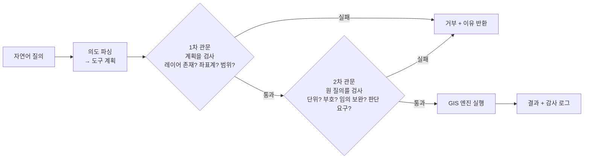
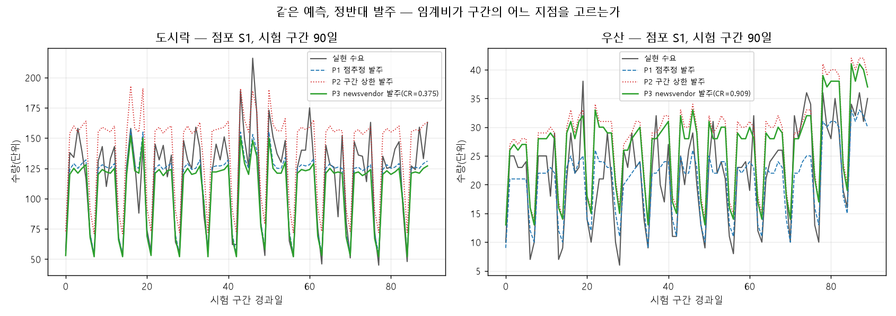

# 7장 자율 GIS와 시공간 예측, 도구를 언제 믿고 언제 사람이 확인할까

## 1. 이 장의 핵심 질문

1. **언어모델에게 "도서관에서 1km 이내 인구는?"이라고 물으면 답은 나온다.** 그 답을 얼마나 믿을 수 있으며, 무엇을 검증해야 하는가
2. **"내일 수요는 90% 확률로 70~130개"라는 구간은 어떻게 만드는가.** 그리고 이 오차는 관측을 늘려서 줄일 수 있는 것인가, 아닌 것인가
3. **구간을 받은 점장은 결국 발주서에 숫자 하나를 적어야 한다.** 그 숫자를 정하는 값은 예측 모델 안에 없는데, 어디에서 오는가

□ 세 질문의 공통점은 **도구가 낸 값을 그대로 결정에 쓰지 않는다**는 것임  
  ○ 언어모델의 답에는 검증 관문이 붙고, 예측값에는 구간이 붙으며, 구간에는 비용 구조가 붙어야 결정이 됨  

## 2. 도입 사례: 질의 4건 중 3건이 거부된 이유

□ `lecture_practice/chapter7/results/7-1-autonomous-gis-query.log`의 실제 실행 결과를 먼저 봄  
  ○ 레이어 카탈로그는 인구격자·도서관(6개소)·학교(12개소), 좌표계 `EPSG:5179`  
  ○ 네 개의 질의를 순서대로 넣었을 때 결과는 다음과 같음  

| 질의 | 처리 결과 |
| --- | --- |
| "도서관에서 1km 이내 인구는?" | ✅ 성공 — 약 `73,713명` |
| "지하철역에서 500m 이내 인구는?" | ❌ 거부 — 존재하지 않는 레이어 '지하철역' |
| "위도 37.5 경도 127.0 학교에서 1km 이내 인구는?" | ❌ 거부 — 좌표계 불일치(질의 EPSG:4326 vs 데이터 EPSG:5179) |
| "그 동네 살기 좋은 곳 알려줘" | ❌ 거부 — 의도를 파싱할 수 없음(모호한 질의) |

□ 요약: 질의 4건 중 성공 1건, 검증 단계가 차단 3건  
  ○ 눈여겨볼 것은 성공 1건이 아니라 **거부된 3건이 왜 거부되었는가**임  
  ○ 검증 단계가 없었다면 세 질의 모두 "그럴듯한 숫자"가 나왔을 것임 — 존재하지 않는 레이어에도 숫자를 만들어 낼 수 있고, 좌표계가 다른 좌표를 그대로 계산에 넣어도 프로그램은 멈추지 않음  

○ 이 장의 앞부분이 다루는 것이 바로 이 지점임. **검증이 없으면 오류가 오류로 보이지 않음**  

## 3. 무엇을 맡기고 무엇을 사람이 하는가

### 3.1 언어모델이 잘하는 것과 못하는 것

□ 언어모델에 공간 질문을 던지면 과제 유형에 따라 결과가 크게 갈림  
  ○ "행정동과 법정동의 차이를 설명하라"에는 정확한 답이 나옴  
  ○ 그런데 좌표 계산·위상 관계(인접·포함·교차)·거리와 방향 추론에서는 **틀린 답이 확정적인 어조로** 나오는 경우가 많음  
  ○ 이 현상을 **환각**(hallucination)이라 함 — 근거 없는 내용을 사실 형태의 문장으로 만들어 내는 것  

□ 원인은 학습 방식에 있음  
  ○ 언어모델은 텍스트의 다음 단어를 맞히도록 학습함  
  ○ 그래서 반복 등장한 지식과 서술 패턴은 잘 재현함  
  ○ 그러나 좌표는 텍스트에서 규칙성 없이 흩어진 숫자열이라 **그 산술적 의미가 학습되지 않음**  

### 3.2 위임 경계를 표로 정한다

○ 그래서 역할을 나눔. 언어모델은 자연어로 의도를 받아 "어떤 계산을 할 것인가"로 옮기는 **인터페이스** 역할만 맡고, 버퍼·교차·좌표 변환 같은 실제 공간 연산은 검증된 GIS 엔진에 맡김  

| 위임 가능 | 위임 불가 |
| --- | --- |
| 공간 용어·개념의 설명 | 좌표·거리·면적의 직접 계산 |
| 분석 절차의 계획 수립("버퍼 → 교차 → 집계 순서로") | "A동과 B동이 인접한가" 같은 위상 판정 |
| 결과 수치를 서술문으로 바꾸기 | 특정 지역 통계값을 언어모델이 직접 인출하는 것 |

□ 2절의 4건 질의로 이 경계를 확인할 수 있음  
  ○ 1번 질의("도서관에서 1km 이내 인구는?")는 **위임 가능** 영역임 — 반경과 대상을 계획으로 옮기는 일까지가 언어모델의 몫이고, 실제 계산은 GIS 엔진이 함  
  ○ 4번 질의("그 동네 살기 좋은 곳 알려줘")는 **위임 불가** 영역임 — "살기 좋다"는 판단은 집계 도구가 답할 수 있는 질문이 아님. 검증 단계가 이를 "의도를 파싱할 수 없음"으로 거부함  
  ○ 2번·3번 질의는 위임 가능 영역의 질문이지만 **입력 자체가 성립하지 않는 경우**임. 다음 절의 관문이 이 둘을 잡음  

### 3.3 이 장의 실습을 시작하기 전에

□ 먼저 패키지를 설치함. 이 장은 7-2·7-3이 PyTorch를 쓰므로 공통 설치에 더해 두 번째 명령을 한 번 실행함  

```bash
cd geoai_public   # 저장소 루트 — 이 장의 명령은 모두 여기서 실행함
pip install -r lecture_practice/requirements-student.txt
python lecture_practice/setup_torch.py
```

□ 7-1·7-2가 쓰는 데이터는 저장소에 포함되어 있음 — `lecture_practice/chapter7/data/` 폴더의 네 파일임  

| 파일 | 내용 | 쓰는 코드 |
| --- | --- | ---: |
| `pop_grid.parquet` | 인구격자 400셀(20×20, 셀 한 변 500m), 좌표계 EPSG:5179 | 7-1 |
| `libraries.parquet` | 도서관 6개소 좌표 | 7-1 |
| `schools.parquet` | 학교 12개소 좌표 | 7-1 |
| `traffic_volume.npy` | 교통량 시계열 1,200시간 | 7-2 |

○ 저장소를 받으면(git clone 또는 ZIP 다운로드) 이 폴더가 함께 내려오므로 따로 만들 것이 없음. `data/` 폴더에 네 파일이 보이지 않으면 저장소를 다시 받음  

□ `pop_grid.parquet`의 앞 5행은 다음과 같음. `x`·`y`는 셀 중심의 미터좌표(EPSG:5179)이고 `pop`은 그 셀의 인구임  

| x | y | pop |
| ---: | ---: | ---: |
| 250 | 250 | 1,322 |
| 750 | 250 | 784 |
| 1,250 | 250 | 1,500 |
| 1,750 | 250 | 1,576 |
| 2,250 | 250 | 420 |

□ 두 데이터의 기술통계는 다음과 같음(아래 값은 `data/` 폴더의 파일에서 직접 계산한 것이며, 파일을 열어 같은 값이 나오는지 확인할 수 있음)  

| 데이터 | 항목 | 값 |
| --- | --- | ---: |
| 인구격자 | 셀 수 | 400 |
| | 인구 합계 | 479,165명 |
| | 셀당 평균 / 표준편차 | 1,197.9 / 381.0 |
| | 최소 / 중앙값 / 최대 | 173 / 1,207 / 2,366 |
| 교통량 | 관측 수 | 1,200시간 |
| | 평균 / 표준편차 | 60.3 / 31.0 대/시간 |
| | 최소 / 최대 | 0.7 / 131.8 대/시간 |

○ 교통량을 시각(0~23시)별로 나눠 평균을 내면 0시가 20.2대로 가장 낮고 12시가 101.5대로 가장 높음 — 새벽 저점·낮 피크의 하루 주기가 있음. 변동 폭도 시간대마다 달라서 시간대별 표준편차가 최소 9.9(5시), 최대 15.2(16시)임. 7-2가 과거 24시간 창으로 학습하는 것이 바로 이 주기와 변동임  

□ 이 장에서 실행할 코드는 세 개이며 순서가 정해져 있음  

| 순서 | 실행할 파일 | 하는 일 | 절 |
| ---: | --- | --- | ---: |
| 1 | `7-1-autonomous-gis-query.py` | 자연어 공간 질의와 검증 관문 | 4 |
| 2 | `7-2-spatiotemporal-uncertainty.py` | LSTM + MC Dropout 예측구간 | 6 |
| 3 | `7-3-demand-newsvendor.py` | 정규화 conformal 구간과 임계비 발주 채점 | 5·7~9 |

○ 세 코드 모두 `data/` 폴더에 포함된 파일을 불러 씀 — 입력을 따로 만들 필요가 없음. 7-3이 쓰는 수요 패널은 5절에서 설명함  
○ 세 코드 모두 인터넷 없이 돌아가고 GPU도 필요 없음  
○ 〔LSTM〕 위 표의 **LSTM**은 순서가 있는 자료(시계열)를 앞에서부터 차례로 읽어 다음 값을 맞히는 신경망의 한 종류임. 딥러닝 용어가 처음이면 6절 앞머리의 용어 정리를 먼저 보면 됨  
○ 2·3번은 실제로 LSTM을 학습시킴. 가속기(CUDA·MPS)를 쓰면 LSTM 커널이 달라져 같은 시드에서도 소수점 아래가 흔들리므로, 코드가 장치를 CPU로 고정해 둠(`7-2`는 `DEVICE = torch.device("cpu")`, `7-3`은 `PIN_CPU = True`)  
○ **`7-1`은 외부 언어모델 API를 호출하지 않음** — 실제 시스템은 GPT류 언어모델로 자연어 질의를 해석하지만, 이 실습은 비용과 재현성을 위해 **결정론적 규칙 기반 파서**로 언어모델의 역할을 대신함. 이 실습의 핵심은 파서 자체의 정교함이 아니라, **검증 단계가 없으면 무엇이 잘못되는가**를 눈으로 보이는 것임  
○ 5·7·8·9절의 표는 전부 `7-3` **한 번의 실행**에서 나옴 — 5절에서 한 번 돌려 두면 뒤 절에서 다시 실행할 필요가 없음. 6절만 `7-2`의 출력임  
○ 본문에 인용한 출력은 모두 `lecture_practice/chapter7/results/`의 실행 로그에서 그대로 가져온 것이며, 어느 파일에서 왔는지를 출력 블록 첫 줄에 적어 두었음 — 화면에 나온 값과 그 파일을 한 줄씩 대조하면 됨  

## 4. 검증 관문: 오류가 오류로 보이게 만들기

### 4.1 질의 처리 순환과 세 가지 확인

□ 첫 번째 코드를 실행함. 2절의 표와 이 절의 결과는 전부 이 명령의 출력임  

```bash
python lecture_practice/chapter7/code/7-1-autonomous-gis-query.py
```

○ 이 코드가 불러 쓰는 것은 3.3절에서 본 레이어 카탈로그임 — 인구격자 400셀(인구 합계 479,165명)·도서관 6개소·학교 12개소, 좌표계 EPSG:5179  

○ 자연어 질의를 GIS 연산으로 옮기는 시스템의 처리 순서는 다섯 단계임  

```
질문 → 의도 파싱(계획 수립) → [검증 관문] → 도구 호출(GIS 엔진 실행) → 결과
```

○ `7-1-autonomous-gis-query.py`가 이 다섯 단계를 그대로 구현함  
○ 파싱은 정규식으로 "○○에서 △△m 이내"라는 패턴을 찾아 계획(`buffer_count`, 대상 레이어, 반경)으로 바꾸는 규칙 기반 함수가 맡음  

□ **검증 관문은 계획을 실행하기 전에 세 가지를 확인함**  

1. **파싱이 됐는가** — 안 되면 "의도를 파싱할 수 없음"으로 거부
2. **참조한 레이어가 카탈로그에 있는가** — 없으면 "존재하지 않는 레이어"로 거부
3. **질의 좌표계가 데이터 좌표계와 같은가** — 다르면 "좌표계 불일치"로 거부

○ 아래는 그 코드에 실제 실행 결과를 주석으로 붙인 것임  

```python
# 주석에 붙인 출력의 출처: lecture_practice/chapter7/results/7-1-autonomous-gis-query.log
import re

DATA_CRS = "EPSG:5179"          # 데이터 좌표계(한국 미터좌표)

# [1] 의도 파싱 — "○○에서 △△m 이내"를 계획(plan)으로 바꿈
def parse_query(q):
    m = re.search(r"(\S+?)(?:에서|로부터)\s*([\d.]+)\s*(km|m)\s*(?:이내|반경)", q)
    if m and ("인구" in q or "사람" in q):
        layer, val, unit = m.group(1), float(m.group(2)), m.group(3)
        radius_m = val * 1000 if unit == "km" else val
        coord_crs = "EPSG:4326" if re.search(r"위도|경도|lat|lon", q) else DATA_CRS
        return {"op": "buffer_count", "layer": layer, "radius_m": radius_m,
                "coord_crs": coord_crs}
    return {"op": None, "error": "의도를 파싱할 수 없음(모호한 질의)"}

# [2] 검증 관문 — 실행 전에 세 가지를 확인함
def verify(plan, catalog):
    if plan["op"] is None:                                 # 확인 1: 파싱 실패
        return False, plan["error"]
    if plan["layer"] not in catalog:                       # 확인 2: 없는 레이어
        avail = ", ".join(catalog.keys())
        return False, f"존재하지 않는 레이어 '{plan['layer']}' (사용가능: {avail})"
    if plan.get("coord_crs") != DATA_CRS:                  # 확인 3: 좌표계 불일치
        return False, (f"좌표계 불일치: 질의 좌표 {plan['coord_crs']} vs "
                       f"데이터 {DATA_CRS} — 변환(transform) 없이 실행 불가")
    return True, "검증 통과"

# [3] 통과한 계획만 GIS 연산(버퍼 안 인구 합산)으로 넘김
# 출력: Q: 도서관에서 1km 이내 인구는?
#          계획: buffer_count(layer=도서관, radius=1000m)
#          ✅ 성공: 약 73,713명
#       Q: 지하철역에서 500m 이내 인구는?
#          ❌ 거부: 존재하지 않는 레이어 '지하철역' (사용가능: 인구격자, 도서관, 학교)
#       Q: 위도 37.5 경도 127.0 학교에서 1km 이내 인구는?
#          ❌ 거부: 좌표계 불일치: 질의 좌표 EPSG:4326 vs 데이터 EPSG:5179
#                  — 변환(transform) 없이 실행 불가
#       Q: 그 동네 살기 좋은 곳 알려줘
#          ❌ 거부: 의도를 파싱할 수 없음(모호한 질의)
#       [요약] 질의 4건 중 성공 1건, 검증 단계가 차단 3건
```

□ 화면에 나온 값에서 읽을 것  
  ○ 거부된 세 질의가 세 확인에 하나씩 나눠 걸림 — 2번 질의는 두 번째 확인에서, 3번 질의는 세 번째 확인에서, 4번 질의는 첫 번째 확인에서 막힘  
  ○ 성공한 1번 질의만 계획이 화면에 함께 찍힘(`buffer_count(layer=도서관, radius=1000m)`) — 거부된 질의는 계획이 실행 단계로 넘어가지 않으므로 숫자가 아예 나오지 않음  
  ○ `73,713명`은 도서관 6개소 각각의 1km 버퍼 안 인구격자 값을 더한 것임. 버퍼가 겹치는 구역은 중복해서 더해지므로 "1km 안에 사는 사람 수"가 아니라 "도서관별 1km 인구의 합"으로 읽음  

### 4.2 관문을 두 층으로 나눈다

□ 관문 하나로는 잡히지 않는 것이 있음. 계획으로 환원되지 않는 정보 — 단위, 부호, 요청의 성격 — 는 계획만 봐서는 확인할 수 없음  
  ○ 그래서 일반 형태에서는 관문을 두 층으로 나눔. **계획 자체를 검사하는 관문**(1차)과 **원 질의를 함께 놓고 검사하는 관문**(2차)임. 4.1절의 세 확인(파싱·레이어·좌표계)은 1차 관문에 해당함  

□ **2차 관문은 원 질의와 계획을 나란히 놓고 대조함.** 계획이 형식상 멀쩡해서 1차 관문을 통과하더라도, 질의와 견주면 어긋난 네 가지 경우를 잡음  
  ○ **단위** — 질의는 "100m 이내"인데 계획에 반경 1,000m가 들어간 환산 오류. 반경 1,000m는 그 자체로는 유효한 값이라 계획만 검사하는 1차 관문은 통과함  
  ○ **부호·방향** — "이내"가 "이상"으로, 상한이 하한으로 뒤집혀 계획에 들어간 경우  
  ○ **임의 보완** — 질의에 없는 반경·레이어를 파서가 임의 값으로 채워 넣은 경우. 원 질의를 보지 않으면 그 값이 사용자가 말한 것인지 파서가 지어낸 것인지 구분할 수 없음  
  ○ **판단 요구** — 질의가 집계가 아니라 가치 판단("살기 좋은 곳")을 요구하는데 계획은 집계 연산으로 만들어진 경우. 숫자는 나오겠지만 질문에 대한 답이 아님  

○ 실습 코드 `7-1`이 구현한 것은 1차 관문까지임 — 2차 관문은 질의·계획 쌍을 함께 검사해야 하므로, 실제 시스템에서는 별도의 검증 단계(또는 두 번째 언어모델 호출)로 붙임  



**그림 7.1** 질의 처리 순환과 두 층의 검증 관문. 1차 관문은 모델이 만든 계획을 검사하고, 2차 관문은 원 질의를 함께 본다. 계획으로 환원되지 않는 정보(단위·부호·요청의 성격)는 2차 관문에서만 잡힌다.

### 4.3 검증이 없으면 무엇이 남는가

○ `7-1-autonomous-gis-query.log`의 마지막 줄이 이 절의 핵심을 그대로 적어 둠 — "검증(self-verifying) 단계가 없었다면 CRS 오류·없는 레이어가 그대로 '그럴듯한 숫자'로 출력됐을 것이다"  

□ 이 문장을 3번 질의로 구체화하면 다음과 같음  

  1. 위도·경도가 섞인 질의를 검증 없이 그대로 실행함
  2. 시스템은 좌표계가 다르다는 사실을 알아채지 못함
  3. 잘못된 위치를 기준으로 인구를 집계함
  4. **결과값은 숫자로 나오고, 그 숫자가 틀렸다는 사실은 프로그램 어디에도 나타나지 않음**

○ 이것이 환각이 실무에서 위험한 이유임. 오류가 오류처럼 보이지 않고 **정상 출력의 형태로** 나감  

### 4.4 관문으로 막을 수 없는 실패도 있다

□ 언어모델이 "도구를 호출하겠습니다"라고 문장으로만 답하고 실제 호출 형식은 비워 두는 실패를 **형식 미준수**(format violation)라 함  
  ○ 내용은 맞는데 실행 형식이 어긋난 경우임. 실제 언어모델 API를 호출하는 환경에서 관측되는 실패 유형이며, 이 장의 규칙 기반 파서로는 재현되지 않음  

□ **이 실패는 검증 관문으로 막을 수 없음.** 관문은 계획을 검사하는데, 형식 미준수에서는 검사할 계획 자체가 만들어지지 않음  
  ○ 그래서 별도로 **처리율**(처리되어야 할 정상 질의 가운데 실제로 실행한 비율)을 재야 발견됨. 환각은 "틀린 값이 나오는" 실패이고 형식 미준수는 "아무 값도 안 나오는" 실패라서, 확인하는 지표가 다름  

### 4.5 감사 로그

□ `7-1`은 처리한 질의마다 질의문·상태·거부 사유·결과값을 `autonomous_gis_query_log.csv`에 저장함  
  ○ 이런 기록을 **감사 로그**(audit log)라 함. 특정 수치가 어느 레이어와 어느 반경에서 나왔는지, 어떤 질의가 왜 거부되었는지를 사후에 재구성할 수 있게 하는 자료임  
  ○ 감사 로그가 없으면 "몇 건이 거부됐다"는 집계는 남지만 **"어떤 유형이 반복해서 거부되는가"는 알 수 없음.** 관문 규칙을 어디에 보강해야 할지도 로그 없이는 판단할 수 없음  

## 5. 기준선과 겨루기

□ 이 절부터 9절까지는 **점포의 품목별 판매 수요를 예측해 다음 날 발주량을 정하는 실습**(`7-3-demand-newsvendor.py`)임 — 6절의 교통량 예측(`7-2`)과는 별개의 자료·별개의 목적임. 6절은 교통량이라는 하나의 시계열에서 불확실성을 분해하는 것이 목적이고, 이 절부터는 점포 6곳 × 품목 2종(도시락·우산)의 수요를 예측해 **발주량이라는 결정**까지 내리는 것이 목적임  

□ 예측 모델을 도입하기 전에 확인할 것이 하나 있음 — **학습이 필요 없는 규칙보다 나은가**  
  ○ 이 확인 없이 모델을 배포하면 가장 기본적인 질문에 답하지 않은 채 도구를 넣는 셈이 됨  

□ 7-3이 쓰는 수요 패널도 저장소에 포함되어 있음 — `lecture_practice/chapter7/data/` 폴더의 두 파일임  

| 파일 | 내용 |
| --- | --- |
| `store_demand.parquet` | 점포 6곳 × 품목 2종 × 1,460일 = 17,520행. 잡음 크기가 점포·수요 수준에 따라 달라지는 **본 데이터**(이분산) |
| `store_demand_homoskedastic.parquet` | 같은 평균 수요에서 잡음 크기 구조만 없앤 **등분산 대조군**(7.3절에서 씀) |

□ `store_demand.parquet`의 앞 5행(점포 S1·도시락)은 다음과 같음. `dow`는 요일(0=월요일)이고 `demand`는 그날의 참(관측 가능한) 수요임  

| store_id | region | item | day | dow | demand |
| --- | --- | --- | ---: | ---: | ---: |
| S1 | 도심 | 도시락 | 0 | 0 | 124 |
| S1 | 도심 | 도시락 | 1 | 1 | 118 |
| S1 | 도심 | 도시락 | 2 | 2 | 109 |
| S1 | 도심 | 도시락 | 3 | 3 | 102 |
| S1 | 도심 | 도시락 | 4 | 4 | 109 |

□ 품목별 기술통계는 다음과 같음 

| 품목 | 관측 수 | 평균 | 표준편차 | 최소 | 중앙값 | 최대 |
| --- | ---: | ---: | ---: | ---: | ---: | ---: |
| 도시락 | 8,760 | 84.5 | 32.7 | 0 | 79.0 | 240 |
| 우산 | 8,760 | 15.8 | 8.7 | 0 | 14.0 | 71 |

○ 점포 6곳은 상권 세 유형(도심·주거·외곽)에 둘씩 배정되어 있고, 상권마다 요일 패턴이 반대로 설계됨. 도심 점포(S1, 도시락)의 요일별 평균 수요는 월~금이 127~134개로 높고 주말에 크게 줄어듦(토 68.4, 일 52.5) — 도심은 평일 근무 수요, 주거·외곽은 반대로 주말 수요가 높음  
○ 점포별 평균·표준편차도 서로 다름(도시락 기준 S1 110.4±36.8 ~ S6 61.0±15.9) — 점포 규모와 잡음 배율이 점포마다 다르게 설정된 결과이며, 7절의 정규화 conformal이 이 차이를 다루는 대상임  

□ 이 장의 대표 실습을 실행함. **5·7·8·9절의 모든 표가 이 한 번의 실행에서 나옴**  

```bash
python lecture_practice/chapter7/code/7-3-demand-newsvendor.py
```

○ 대표 실습의 출력은 다섯 덩어리로 나뉨 — `[1]` 본 데이터의 conformal 구간(7절), `[2]` 등분산 대조군(7.3절), `[3]` 세 발주 정책의 손익(8.2절), `[4]` 임계비 민감도(9절), `[5]` 비용비 오지정 대 예측 개선(5절·9절)  

○ `7-3-demand-newsvendor.py`가 LSTM과 함께 **계절 나이브**(지난주 같은 요일 값을 그대로 쓰는 규칙)를 같은 방식으로 채점함  

```text
# 출처: lecture_practice/chapter7/results/7-3-demand-newsvendor.log [5]
 품목 기준_LSTM_참CR 예측열화_계절나이브 비용비오지정_대칭가정 비용비오지정_뒤바뀜  RMSE_LSTM  RMSE_나이브
도시락  45,666,000 16,632,000   1,031,600 55,312,400      23.45     32.22
 우산  30,012,000 13,231,500  42,333,000 67,516,500       6.48      8.58
```

| 품목 | RMSE(LSTM) | RMSE(계절 나이브) |
| --- | ---: | ---: |
| 도시락 | `23.45` | `32.22` |
| 우산 | `6.48` | `8.58` |

○ 〔RMSE〕 예측이 실제값에서 평균적으로 몇 단위 빗나갔는지를 나타내는 값임(오차를 제곱해 평균한 뒤 제곱근을 취함). 단위가 원자료와 같아서 도시락의 `23.45`는 하루 평균 약 23개를 빗나갔다는 뜻이며, 작을수록 잘 맞힌 것임  

□ 화면에 나온 값에서 읽을 것  
  ○ 두 품목 모두 LSTM이 나이브 기준선보다 오차가 작음(도시락 23.45 대 32.22, 우산 6.48 대 8.58)  
  ○ 같은 출력의 나머지 열은 9절에서 씀 — 금액은 발주 결정까지 내려간 뒤에야 읽을 수 있는 값이므로 여기서는 오른쪽 두 열만 봄  
  ○ 비교할 때는 **같은 자료, 같은 분할, 같은 평가**로 나란히 잼. 서로 다른 자료에서 잰 성능을 비교하면 차이의 원인이 모델인지 자료인지 구분할 수 없음. 위 출력의 나이브도 LSTM과 같은 3분할·같은 conformal 절차를 거쳐 채점된 것임  

○ `7-2-spatiotemporal-uncertainty.py`(교통량 예측)는 LSTM 하나만 학습시키므로 이 절의 비교 대상이 아님. RMSE `12.82`는 다음 절에서 불확실성을 분해하는 데 쓰는 값으로 다시 나옴  

## 6. 점추정을 구간으로 바꾼다

> **읽기 전에 — 학습과 평가의 기본 용어**
>
> - **학습**(training): 모델에 자료를 보여 주며 "입력이 이러면 답은 이렇다"는 규칙을 맞춰 가게 하는 단계. 이 절의 모델은 과거 24시간의 교통량을 입력으로 받아 다음 1시간을 답으로 맞히도록 학습함
> - **검증·시험**(validation·test): 학습에 쓰지 않은 자료로 성적을 재는 단계 — 학습에 쓴 자료로 재면 외운 것을 다시 묻는 셈이라 실제 실력을 알 수 없음. 시계열은 **시간 순서대로** 나눔(뒤 시점을 학습에 넣고 앞 시점으로 재면 미래를 미리 본 셈이 되어 성적이 실제보다 좋게 나옴)
> - **점추정**(point estimate): 예측을 숫자 하나로 내놓은 것("95대"). **구간**은 범위로 내놓은 것("70~130대"). 이 절에서 하는 일이 점추정에 구간을 붙이는 것임

### 6.1 점추정만으로는 왜 부족한가

□ "내일 이 구간 교통량은 95대/시간"이라는 예측을 받았다고 함  
  ○ 실제 값이 90~100 사이에 들어온다면 별다른 대응이 필요 없지만, 45~145 사이에 들어온다면 예비 인력이나 완충 자원이 필요함  
  ○ **같은 점추정에서 정반대 대응이 나올 수 있음.** 점추정 하나만 전달하면 그 값이 얼마나 빗나갈 수 있는지가 전달되지 않음  

### 6.2 두 성분으로 나누어 재기

□ 예측 오차는 원인이 다른 두 성분으로 나뉨  
  ○ **모델 불확실성**(epistemic uncertainty) — 자료가 부족해 모델이 아직 덜 배운 데서 생기는 오차. 관측을 늘리면 줄어듦. 처음 가 본 길의 소요 시간을 잘 못 맞히는 것과 같은 종류이고, 몇 번 다녀 보면 나아지는 오차임  
  ○ **데이터 잡음**(aleatoric uncertainty) — 현상 자체가 날마다 들쭉날쭉한 데서 오는 오차. 자료를 아무리 늘려도 줄어들지 않음. 같은 길을 수백 번 다녀도 신호와 차량 때문에 소요 시간이 날마다 다른 것과 같음  
  ○ **둘을 구분해야 하는 이유는 처방이 갈리기 때문임.** 모델 불확실성이 크면 관측을 늘리는 것이 답이고, 데이터 잡음이 크면 관측을 늘려도 소용없고 완충 자원을 마련하는 것이 답임  

□ 두 번째 코드를 실행함. 3.3절의 교통량 시계열(`traffic_volume.npy`)을 입력으로 받아 두 성분을 각각 잼  

```bash
python lecture_practice/chapter7/code/7-2-spatiotemporal-uncertainty.py
```

  ○ 〔신경망·드롭아웃〕 신경망은 숫자를 받아 여러 층의 계산을 거쳐 답을 내놓는 구조이고, 그 계산 단위를 뉴런이라 함. **드롭아웃**(dropout)은 학습하는 동안 뉴런 일부를 무작위로 꺼서 모델이 특정 뉴런에만 기대지 않게 만드는 기법임. 보통은 학습이 끝나면 꺼 두고 쓰는데, 아래 MC Dropout은 일부러 켠 채로 둠  
  ○ 〔잔차·표준편차〕 **잔차**는 실제값에서 예측값을 뺀 차이, 곧 한 건의 오차임. **표준편차**는 여러 값이 평균에서 평균적으로 얼마나 떨어져 있는지를 나타내고, **분산**은 표준편차를 제곱한 값임  
  ○ **모델 불확실성**은 **MC Dropout**(Gal & Ghahramani, 2016)으로 잼. 학습을 마친 신경망에서 드롭아웃 층을 끄지 않고 그대로 둔 채 같은 입력을 50번(`MC_SAMPLES = 50`) 통과시킴. 매번 다른 뉴런 조합이 비활성화되므로 50개의 서로 다른 예측이 나오고, 그 흩어진 정도(표준편차)를 모델 불확실성으로 씀  
  ○ **데이터 잡음**은 학습 구간에서 실제값과 예측값의 차이(잔차)를 모아 그 분산을 계산함. 학습을 마친 구간에서도 남는 오차이므로 줄어들지 않는 변동의 추정치로 씀  

```python
# 주석에 붙인 출력의 출처: lecture_practice/chapter7/results/7-2-spatiotemporal-uncertainty.log
import numpy as np
import torch

# [1] 시간 순서대로 앞 70%만 학습에 씀 — 미래 정보가 학습에 섞이지 않게 함
n_train = int(len(X) * 0.7)
# 출력: 학습 823 / 검증 353 (앞 70% 학습, 시계열 누수 차단)
#       학습 완료(에폭 15, 최종 train MSE 0.1693)

# [2] 데이터 잡음 — 학습 구간 잔차의 분산
aleatoric_var = float(np.var(tr_actual - tr_pred))

# [3] 모델 불확실성 — dropout을 켠 채 50번 통과시켜 예측의 흩어짐을 봄
model.train()                       # ★ 추론에서도 dropout 유지(MC Dropout 핵심)
samples = np.zeros((MC_SAMPLES, len(Xte)))
with torch.no_grad():
    for s in range(MC_SAMPLES):
        samples[s] = model(Xte_t).squeeze(-1).numpy()
epistemic_var = samples.var(axis=0)

# [4] 두 성분을 결합해 90% 구간을 만듦(정규 근사, ±1.645σ)
total_std = np.sqrt(epistemic_var + aleatoric_var)
pred_lo = pred_mean - 1.645 * total_std
pred_hi = pred_mean + 1.645 * total_std
# 출력: [점추정] RMSE = 12.82 대/시간
#       평균 표준편차 epistemic 7.23 / aleatoric 11.69 (epistemic 비중 28%)
#       90% 구간 포함률(coverage) = 91.5% (목표 90%)
#       평균 구간 폭 = 45.18 대/시간
```

□ 자료: 교통량 1,200시간, 과거 24시간을 보고 다음 1시간을 예측함  
  ○ 앞 70%를 학습(823개 창), 뒤 30%를 검증(353개 창)에 씀 — 시간 순서대로 나눠 미래 정보가 학습에 섞이지 않게 함  
  ○ 〔창·에폭·MSE〕 **창**(window)은 과거 24시간을 한 묶음으로 자른 자료 한 건임 — 시작점을 한 시간씩 밀어 가며 1,176개를 만들고, 그중 823개를 학습에 353개를 검증에 씀. **에폭**은 학습 자료 전체를 한 번 훑는 것이라 15에폭은 열다섯 번 훑었다는 뜻임. **MSE**는 오차를 제곱해 평균한 값으로 RMSE를 제곱한 것과 같음  
  ○ 15에폭 학습 후 최종(정규화된 값 기준) train MSE `0.1693` — 학습 중에 모델을 고치는 기준으로 쓰는 값이라 크기 자체보다 학습이 진행될수록 줄어드는지가 중요함  

### 6.3 실제 분해 결과

○ 위 실행의 결과를 항목별로 정리하면 다음과 같음  

| 항목 | 값 |
| --- | --- |
| 점추정 RMSE | `12.82` 대/시간 |
| 모델 불확실성(epistemic) 평균 표준편차 | `7.23` |
| 데이터 잡음(aleatoric) 표준편차 | `11.69` |
| 모델 불확실성 비중 | `28%` |
| 90% 구간 포함률 | `91.5%` (목표 `90%`) |
| 평균 구간 폭 | `45.18` 대/시간 |

□ 데이터 잡음(11.69)이 모델 불확실성(7.23)보다 큼. **이 자료·이 모델에서는 관측을 늘리는 것보다 변동을 흡수할 완충 자원을 마련하는 쪽이 더 정확한 처방**이라는 뜻임  
  ○ 두 성분은 원인이 달라 독립으로 간주하고, 표준편차는 각각을 제곱해 더한 뒤 제곱근을 취해 결합함(아래 식의 σ는 표준편차를 나타내는 기호임)  

전체 σ = √(모델 불확실성² + 데이터 잡음²)

□ 이 표의 값을 직접 넣어 확인할 수 있음. √(7.23² + 11.69²) = √(52.27 + 136.66) = √188.93 ≈ `13.75`  
  ○ 90% 구간은 좌우로 1.645σ씩 확장하므로 폭은 2 × 1.645 × 13.75 ≈ `45.24`  
  ○ 실제 로그의 평균 구간 폭 `45.18`과 거의 같음. 차이는 모델 불확실성이 관측마다 다른 값을 갖는 데서 오는 반올림 수준의 오차임  

○ 이 계산에서 확인할 성질 하나 — **두 값의 차이가 클수록 작은 쪽의 기여는 급격히 줄어듦.** 두 성분이 3과 4라면 결합값은 7이 아니라 5이고, 1과 10이라면 10.05로 큰 쪽이 사실상 전체를 결정함  

### 6.4 구간을 만든 뒤에는 포함률을 확인한다

□ 구간을 만들었으면 그 구간이 실제로 목표한 비율만큼 정답을 담는지 확인함. 이 값이 **포함률**임  
  ○ 위 표의 90% 구간 포함률은 `91.5%`로 목표 90%에 가까움. 목표보다 크게 낮으면 구간이 좁아 위험을 과소평가한 것이고, 크게 높으면 구간이 넓어 쓸모가 떨어진 것임  

○ 같은 실행이 불확실성이 큰 시점을 구간 폭 순서대로 다섯 개 찍음  

```text
# 출처: lecture_practice/chapter7/results/7-2-spatiotemporal-uncertainty.log
[정책 연계] 예측 불확실성이 큰 상위 5개 시점(추가 관측·보수적 대응 대상)
 test_idx  pred_mean  interval_width     actual
       55       96.8            52.6 105.900002
      135       10.3            50.5   9.100000
       32       93.4            50.4 115.099998
      210        8.6            50.1  40.500000
       80       84.1            50.0  90.400002
```

| 검증 순번 | 예측 평균 | 구간 폭 | 실제값 |
| ---: | ---: | ---: | ---: |
| 55 | 96.8 | 52.6 | 105.9 |
| 135 | 10.3 | 50.5 | 9.1 |
| 32 | 93.4 | 50.4 | 115.1 |
| 210 | 8.6 | 50.1 | 40.5 |
| 80 | 84.1 | 50.0 | 90.4 |

□ 표를 읽는 방법은 다음과 같음. "구간 폭" 열이 클수록 모델이 그 시점을 자신 없어 한다는 뜻이고, "실제값"과 "예측 평균"의 차이가 클수록 실제로 많이 빗나간 것임  
  ○ 210번 시점을 보면 구간 폭이 50.1로 넓었고 실제값(40.5)이 예측 평균(8.6)과 크게 벌어짐 — 넓은 구간이 실제로 큰 오차와 함께 나타난 사례임  

## 7. 단위마다 다른 폭 — 정규화 conformal

### 7.1 하나의 폭으로는 맞지 않는 경우

□ 6절의 방식은 자료 전체에 하나의 잡음 구조를 가정함  
  ○ 그런데 점포처럼 분석 단위가 여럿이고 단위마다 빗나가는 폭이 다르면, **모든 단위에 같은 폭의 구간을 주는 것이 맞지 않음**  

□ `7-3-demand-newsvendor.py`가 이 문제에 쓰는 방법이 **정규화 conformal**임. 발상은 한 문장으로 줄여짐 — **점포마다 평소 오차 크기를 먼저 재 두고, 모든 점포에 공통인 배수를 곱해 구간 폭을 만든다**  

○ 〔분위〕 아래에서 쓰는 **분위**는 값을 작은 것부터 줄 세운 뒤 특정 자리의 값을 골라내는 것임. "90% 구간"은 줄 세운 값에서 아래 5%와 위 5%를 잘라 내고 남긴 범위를 뜻함  

1. **점추정** — 학습 구간으로 LSTM을 학습해 각 관측의 예측값을 얻음
2. **평소 오차 크기 재기(학습 구간)** — 점포마다 "이 수준의 수요를 예측할 때 평균 몇 개를 빗나갔는가"를 학습 구간의 실제 오차에서 잼. 수요가 많은 날일수록 오차도 커지므로 예측값에 비례하는 직선으로 맞춤. 코드에서는 이 값이 `sig_tr`·`sig_te`라는 이름으로 나타남
3. **공통 배수 찾기(보정 구간)** — 학습에 쓰지 않은 보정 구간에서 각 건의 오차를 그 건의 평소 오차 크기로 나눔. 이 배수들을 줄 세워 아래 5%와 위 5% 자리의 값을 고름
4. **폭 되돌리기(시험 구간)** — 고른 두 배수에 각 관측의 평소 오차 크기를 곱해 예측값의 아래위로 붙임. **배수는 모든 관측에 같고 평소 오차 크기는 관측마다 달라서, 구간 폭이 관측마다 달라짐**

□ 3단계에서 "오차를 평소 오차 크기로 나누는" 이유는 보정 구간의 실제 사례로 보면 분명해짐. 같은 날(876일째), 두 점포에서 벌어진 일임  

| 점포 | 예측 | 실제 | 오차 | 평소 오차 크기 | 오차 ÷ 평소 오차 크기 |
| --- | ---: | ---: | ---: | ---: | ---: |
| S5(평소 조용한 점포) | 70.7 | 37 | `-33.7` | `11.2` | `-3.00` |
| S4(평소 변동이 큰 점포) | 70.1 | 48 | `-22.1` | `22.8` | `-0.97` |

○ 원래 오차만 보면 S5(33.7개)가 S4(22.1개)보다 더 많이 틀린 것처럼 보이지만, "평소"를 기준으로 보면 반대임 — S5는 평소 11.2개 빗나가는 점포인데 이번엔 3배(`-3.00`)나 튀어 이례적인 날이고, S4는 평소에도 22.8개쯤 들쭉날쭉해 이번 22.1개는 평소 수준(`-0.97`)인 평범한 날임  
○ 오차를 평소 오차 크기로 나눠 "몇 배 튀었나"로 바꾸면 변동 규모가 다른 점포를 같은 자로 잴 수 있음. 나누지 않으면 변동 큰 점포의 큰 숫자가 목록을 뒤덮어 조용한 점포에 필요한 좁은 폭을 구분하지 못함  

○ 도시락에서 이렇게 고른 두 배수는 간격의 절반이 `2.22`였음 — 곧 반폭이 평소 오차 크기의 2.22배임(아래 출력과 같은 실행에서 계산한 값). 평소 오차 크기가 `11.4`인 점포(S5)는 반폭이 2.22 × 11.4 ≈ `25`로 좁고, `24.7`인 점포(S4)는 2.22 × 24.7 ≈ `55`로 넓음 — 폭으로는 `51` 대 `110`이고, 아래 표의 평균 폭 `69.94`가 이런 값들의 평균임  

○ 자료를 **학습 60% / 보정 20% / 시험 20**%로 시간 순서대로 나눔  
○ 6절의 방식이 학습과 검증 두 구간만 썼던 것과 다른 지점임 — 분포를 가정하지 않는 대신, **학습에 전혀 쓰지 않은 보정 구간을 따로 떼어 둬야 함**  

□ 5절에서 이미 실행한 코드의 출력임. 다시 보려면 같은 명령을 씀  

```bash
python lecture_practice/chapter7/code/7-3-demand-newsvendor.py
```

```text
# 출처: lecture_practice/chapter7/results/7-3-demand-newsvendor.log [1]
  [이분산 · 도시락] 창 8,592개 (학습 5,088 / 보정 1,752 / 시험 1,752)
    시험 RMSE = 23.45 단위/일
    정규화          포함률  89.3% · 평균 폭  69.94 · 폭 변동계수 0.364 · 반폭-실오차 순위상관 +0.343
                 수요 3분위별 포함률 91.3% / 91.1% / 85.6% (편차 5.7%p)
    비정규화(C2)     포함률  88.9% · 평균 폭  72.70 · 폭 변동계수 0.000 · 반폭-실오차 순위상관   정의불가(상수폭)
                 수요 3분위별 포함률 96.2% / 89.2% / 81.3% (편차 14.9%p)

  [이분산 · 우산] 창 8,592개 (학습 5,088 / 보정 1,752 / 시험 1,752)
    시험 RMSE = 6.48 단위/일
    정규화          포함률  89.6% · 평균 폭  19.68 · 폭 변동계수 0.473 · 반폭-실오차 순위상관 +0.385
                 수요 3분위별 포함률 88.5% / 90.1% / 90.1% (편차 1.5%p)
    비정규화(C2)     포함률  89.3% · 평균 폭  19.49 · 폭 변동계수 0.000 · 반폭-실오차 순위상관   정의불가(상수폭)
                 수요 3분위별 포함률 97.4% / 89.4% / 81.0% (편차 16.4%p)
```

○ 이 출력에서 정규화 쪽만 뽑아 정리하면 다음과 같음(도시락·우산, 이분산 자료)  

| 품목 | 시험 창 수 | 시험 RMSE | 90% 구간 포함률 | 평균 구간 폭 | 폭 변동계수 |
| --- | ---: | ---: | ---: | ---: | ---: |
| 도시락 | 1,752 | `23.45` | `89.3%` | `69.94` | `0.364` |
| 우산 | 1,752 | `6.48` | `89.6%` | `19.68` | `0.473` |

○ 두 품목 모두 포함률이 목표 90%에 가깝게 맞음  
○ "폭 변동계수"는 구간 폭이 점포마다 얼마나 달랐는지를 나타냄. 0에 가까우면 모든 점포에 같은 폭을 준 것이고, 클수록 점포별로 다른 폭을 준 것임. `0.364`와 `0.473`은 점포마다 상당히 다른 폭이 주어졌다는 뜻임  

### 7.2 전체 포함률만 보면 문제가 드러나지 않는다

○ 위 출력에서 "수요 3분위별 포함률" 줄만 네 개 뽑아 나란히 놓으면 다음과 같음  

| 품목 | 방식 | 수요 3분위별 포함률 | 편차 |
| --- | --- | --- | ---: |
| 도시락 | 정규화 | `91.3%` / `91.1%` / `85.6%` | `5.7%p` |
| 도시락 | 비정규화(모든 관측에 같은 폭) | `96.2%` / `89.2%` / `81.3%` | `14.9%p` |
| 우산 | 정규화 | `88.5%` / `90.1%` / `90.1%` | `1.5%p` |
| 우산 | 비정규화 | `97.4%` / `89.4%` / `81.0%` | `16.4%p` |

□ 전체 포함률만 보면 정규화와 비정규화의 차이가 크지 않았음(도시락 89.3% 대 88.9%, 우산 89.6% 대 89.3%)  
  ○ 그런데 수요 수준별로 나눠 보면 비정규화 방식은 **수요가 적은 날에는 필요 이상으로 넓고(96~97%) 수요가 많은 날에는 목표에 크게 못 미침(81~89%)**  
  ○ 정규화 방식은 이 편차가 훨씬 작음(5.7%p·1.5%p 대 14.9%p·16.4%p)  

○ **전체 평균만 보고했다면 이 구조적 문제가 드러나지 않았을 것임.** 포함률은 조건을 나눠서도 확인함  

### 7.3 이 방법이 언제 이득을 주는지 확인하기

○ 같은 실행이 잡음의 크기 구조만 상수로 바꾼 대조 자료(`store_demand_homoskedastic.parquet`)에도 같은 절차를 돌려 `[2]` 구간에 함께 찍음  

```text
# 출처: lecture_practice/chapter7/results/7-3-demand-newsvendor.log [2]
[대조군 C1·C2 판정] 정규화의 이득이 정말 이분산에서 오는가
 품목     데이터  폭변동계수  반폭_실오차_순위상관  분위편차_정규화  분위편차_비정규화C2
도시락  이분산(본)  0.364        0.343       5.7         14.9
도시락 등분산(C1)  0.032        0.035       3.8          5.1
 우산  이분산(본)  0.473        0.385       1.5         16.4
 우산 등분산(C1)  0.062        0.070       3.3          2.1
  폭변동계수 = 구간 폭이 관측마다 얼마나 달라지는가(등분산이면 0에 가까워야 한다)
  분위편차 = 수요 3분위별 조건부 포함률의 최대−최소(%p). 작을수록 고른 구간
```

| 품목 | 폭 변동계수(본 자료) | 폭 변동계수(등분산 대조군) |
| --- | ---: | ---: |
| 도시락 | `0.364` | `0.032` |
| 우산 | `0.473` | `0.062` |

□ 등분산 자료에서는 정규화 절차를 동일하게 적용했는데도 폭이 거의 균일해짐(변동계수가 0에 가까워짐)  
  ○ 이는 폭의 차이가 알고리즘이 임의로 만든 것이 아니라 **자료의 이분산**(점포·시간대별로 잡음 크기가 다른 성질)**에서 왔다**는 근거임  
  ○ 잡음 구조가 실제로 다르지 않다면 정규화를 적용해도 결과가 상수 폭과 비슷해짐. 이 대조는 정규화 conformal이 "이분산이 있는 자료에서만 이득을 준다"는 조건을 실측으로 확인한 것임  
  ○ 분위편차 열도 같은 방향을 가리킴 — 본 자료에서는 정규화가 편차를 5.7 대 14.9, 1.5 대 16.4로 크게 줄이지만, 등분산 대조군에서는 도시락 3.8 대 5.1로 차이가 작고 우산은 3.3 대 2.1로 오히려 정규화 쪽이 약간 큼. **이득이 없는 자료에 이 절차를 붙이면 계산만 늘고 결과는 나아지지 않음**  

## 8. 구간을 발주량 하나로 바꾼다

### 8.1 신문팔이 문제와 임계비

□ 두 점포가 동일한 수요 예측구간을 받았다고 함. 하나는 도시락 가게이고 하나는 우산 가게임  
  ○ 도시락은 재고가 남으면 당일 폐기되어 원가 전액이 손실임  
  ○ 우산은 재고가 남으면 다음 강우일에 팔리지만, 품절이면 손님이 다른 가게로 감  
  ○ 전자는 남는 손실(잉여 손실)이 크고 후자는 모자란 손실(결품 손실)이 큼. **같은 구간을 받았어도 전자는 구간의 아래쪽에서, 후자는 위쪽에서 발주해야 함**  

○ 이 판단을 계산으로 옮긴 것이 **신문팔이 문제**(newsvendor problem)임. 결품 1단위의 손실을 Cu, 잉여 1단위의 손실을 Co라 하면 최적 발주량은 수요 분포에서 다음 비율에 해당하는 지점임  

임계비(CR) = Cu / (Cu + Co)

○ `7-3-demand-newsvendor.py`가 쓴 가정값은 실행 첫머리에 그대로 찍힘  

```text
# 출처: lecture_practice/chapter7/results/7-3-demand-newsvendor.log
[비용 가정값] 전부 가정이며, 결론은 금액이 아니라 임계비의 방향에 둔다
 품목    Cu   Co    임계비                     설명
도시락  1200 2000 0.3750    Cu=판매 마진, Co=원가+폐기비
 우산 15000 1500 0.9091 Cu=마진+기회 상실, Co=재고 유지비
```

| 품목 | Cu(결품 1단위) | Co(잉여 1단위) | 임계비 | 설명 |
| --- | ---: | ---: | ---: | --- |
| 도시락 | 1,200 | 2,000 | `0.375` | Cu=판매 마진, Co=원가+폐기비 |
| 우산 | 15,000 | 1,500 | `0.909` | Cu=마진+기회 상실, Co=재고 유지비 |

○ 도시락의 임계비 0.375는 0.5보다 작음 — 구간의 아래쪽에서 발주하라는 뜻  
○ 우산의 임계비 0.909는 0.5보다 훨씬 큼 — 구간의 위쪽 끝 가까이에서 발주하라는 뜻  
○ 두 값은 전부 **가정값**임. 실제 업종의 원가율·폐기율을 확인할 근거가 없어 이 예제를 설명하기 위해 정한 값이며, 어떤 업종의 실제 임계비도 나타내지 않음. 이 계산에서 결론으로 삼는 것은 금액의 절댓값이 아니라 **두 임계비가 0.5의 반대편에 있다는 방향**임  

### 8.2 세 발주 정책의 실현 손익

□ 임계비가 정해지면 7절의 conformal 절차가 산출한 분위 함수에서 그 비율에 해당하는 값을 뽑아 발주량으로 씀  
  ○ 실무에서 자주 보이는 다른 두 규칙과 비교해 봄  

○ **P1 점추정** — 예측값을 그대로 발주함. 이는 결품과 잉여 손실이 같다고 가정한 것과 같음(임계비를 0.5로 고정한 것)  
○ **P2 구간 상한** — 90% 구간의 상한을 그대로 발주함. 이는 임계비를 신뢰수준의 상한 분위(95%)로 고정한 것과 같음  
○ **P3 newsvendor** — 8.1의 임계비 분위로 발주함  

○ 시험 구간(품목당 1,752건)에서 세 정책을 실제 수요로 채점한 결과가 같은 실행의 `[3]` 구간임  

```text
# 출처: lecture_practice/chapter7/results/7-3-demand-newsvendor.log [3]
  도시락 (CR = 0.375, 시험 1,752건)
               정책       결품손실        과잉손실         총손실 실현서비스수준  평균발주       P3대비
           P1 점추정 21,774,000  24,336,000  46,110,000   44.7%  86.8    444,000
    P2 구간 상한(90%)  1,459,200 117,894,000 119,353,200   93.6% 123.1 73,687,200
P3 newsvendor(CR) 28,104,000  17,562,000  45,666,000   34.9%  81.8          0

  우산 (CR = 0.909, 시험 1,752건)
               정책       결품손실       과잉손실        총손실 실현서비스수준  평균발주       P3대비
           P1 점추정 59,850,000  6,390,000 66,240,000   57.6%  17.0 36,228,000
    P2 구간 상한(90%)  4,380,000 26,824,500 31,204,500   95.3%  26.9  1,192,500
P3 newsvendor(CR)  7,560,000 22,452,000 30,012,000   92.8%  25.1          0
```

**도시락 (CR = 0.375)**

| 정책 | 결품손실 | 과잉손실 | 총손실 | 평균발주 | 실현 서비스 수준 |
| --- | ---: | ---: | ---: | ---: | ---: |
| P1 점추정 | 21,774,000 | 24,336,000 | 46,110,000 | 86.8 | 44.7% |
| P2 구간 상한(90%) | 1,459,200 | 117,894,000 | 119,353,200 | 123.1 | 93.6% |
| P3 newsvendor | 28,104,000 | 17,562,000 | 45,666,000 | 81.8 | 34.9% |

○ 표를 읽는 순서는 다음과 같음. 먼저 P3(newsvendor)의 총손실을 기준으로 삼고, P1·P2가 그보다 얼마나 큰지를 봄  

□ **도시락에서는 P2(구간 상한)가 P3보다 훨씬 비쌈** — 총손실이 119,353,200원으로 P3(45,666,000원)의 약 2.6배임  
  ○ 원인은 과잉손실에 있음. 90% 구간의 상한을 매일 발주량으로 쓰면 매일 폐기가 발생함  
  ○ **90% 구간의 신뢰수준과 이 품목의 최적 서비스 수준(임계비 0.375)은 전혀 다른 값인데, 구간 상한 발주는 이 둘을 같다고 착각한 규칙임** 

**우산 (CR = 0.909)**

| 정책 | 결품손실 | 과잉손실 | 총손실 | 평균발주 | 실현 서비스 수준 |
| --- | ---: | ---: | ---: | ---: | ---: |
| P1 점추정 | 59,850,000 | 6,390,000 | 66,240,000 | 17.0 | 57.6% |
| P2 구간 상한(90%) | 4,380,000 | 26,824,500 | 31,204,500 | 26.9 | 95.3% |
| P3 newsvendor | 7,560,000 | 22,452,000 | 30,012,000 | 25.1 | 92.8% |

□ **우산에서는 P2가 P3와 비슷함** — 95.3%와 92.8%로 총손실 차이가 크지 않음. 우산의 임계비(0.909)가 90% 구간의 상한 분위(95%)와 가깝기 때문임  
  ○ **이 우연한 일치가 함정임.** 우산에서 구간 상한 발주가 잘 맞았다고 해서 같은 규칙을 도시락에 그대로 적용하면 2.6배의 손실을 입음. 임계비가 다르면 최적 발주 지점도 완전히 달라짐  

○ 세 정책이 실제로 어디에 선을 긋는지 시험 구간 90일치로 확인함  



**그림 7.2** 점포 S1의 시험 구간 90일. 회색이 실현 수요, 파란 점선이 P1(점추정), 빨간 점선이 P2(구간 상한), 초록 실선이 P3(newsvendor)임. **왼쪽 도시락에서는 초록선이 파란선 아래에 있고, 오른쪽 우산에서는 파란선보다 크게 위로 올라가 빨간선에 근접함.** 같은 파이프라인이 낸 두 그림에서 두 선의 상하 관계가 뒤집힌 원인은 임계비뿐임(도시락 0.375, 우산 0.909)

## 9. 임계비를 조금 틀려도 괜찮은가

□ 임계비 Cu·Co는 가정값이므로 실제로는 어느 정도 오차가 있을 수 있음  
  ○ 이 오차가 결정에 얼마나 영향을 주는지 확인하려면, **같은 예측을 고정한 채 가정 임계비를 여러 값으로 바꿔 가며** 손실을 계산해 보면 됨  
  ○ 5절에서 실행한 코드가 이 계산을 `[4]` 구간에 찍어 둠  

```text
# 출처: lecture_practice/chapter7/results/7-3-demand-newsvendor.log [4]
  도시락 (참 CR = 0.375)
 가정CR  평균발주         총손실      최적대비초과
0.100  62.6  63,916,400 +18,250,400
0.250  74.7  48,825,600  +3,159,600
0.375  81.8  45,666,000          +0
0.500  88.0  46,697,600  +1,031,600
0.750 102.1  64,122,800 +18,456,800
0.909 117.0 100,978,400 +55,312,400
0.950 123.1 119,353,200 +73,687,200

  우산 (참 CR = 0.909)
 가정CR  평균발주         총손실       최적대비초과
0.100   9.0 211,434,000 +181,422,000
0.250  12.6 133,045,500 +103,033,500
0.375  14.6  97,528,500  +67,516,500
0.500  16.5  72,345,000  +42,333,000
0.750  20.8  37,879,500   +7,867,500
0.909  25.1  30,012,000           +0
0.950  26.9  31,204,500   +1,192,500
```

**도시락 (참 CR = 0.375)**

| 가정 CR | 평균발주 | 총손실 | 최적 대비 초과 |
| ---: | ---: | ---: | ---: |
| 0.100 | 62.6 | 63,916,400 | +18,250,400 |
| 0.250 | 74.7 | 48,825,600 | +3,159,600 |
| 0.375 | 81.8 | 45,666,000 | +0 |
| 0.500 | 88.0 | 46,697,600 | +1,031,600 |
| 0.750 | 102.1 | 64,122,800 | +18,456,800 |
| 0.909 | 117.0 | 100,978,400 | +55,312,400 |

□ 참값(0.375) 근처에서는 손실 곡선이 평탄함 — 0.5로 잘못 잡아도 초과 손실은 1,031,600원(최적값의 2%대)에 그치지만, 다른 품목의 임계비(우산 0.909)를 그대로 가져다 쓰면 55,312,400원으로 뛰어오름  
  ○ 즉 담당자가 확인해야 할 것은 임계비를 소수점 몇 자리까지 정밀하게 잡느냐가 아니라, **그 값이 0.5의 어느 쪽에 얼마나 떨어져 있는가**임  

□ 같은 판단을 다른 방식으로 확인함. `7-3`은 "임계비를 얼마나 틀려야 예측 모델을 통째로 계절 나이브로 바꾼 것과 같은 손실이 나는가"도 계산해 `[5]` 구간 끝에 찍음  

```text
# 출처: lecture_practice/chapter7/results/7-3-demand-newsvendor.log [5]
  [등가 오차] 계절 나이브로 떨어뜨린 대가와 같은 손실을 내는 CR 오차 폭
 품목   참CR      나이브대가 등가CR오차_아래 등가CR오차_위
도시락 0.375 16,632,000     0.270    0.355
 우산 0.909 13,231,500     0.214    0.086
  (임계비를 이 폭만큼 틀리면 예측 모델을 계절 나이브로 바꾼 것과 같은 손실이 된다)
```

□ 이 표의 "나이브 대가"만으로는 결론이 안 나옴. 위 표에 이미 있던 CR 오차 두 건과 나란히 놓아야 뜻이 드러남  

| 실수의 종류 | 품목 | CR을 어디로 잘못 잡음 | 참값에서 벗어난 정도 | 추가 손실 | 나이브 대가와 비교 |
| --- | --- | ---: | ---: | ---: | --- |
| CR을 "반반"으로 짐작 | 도시락 | 0.500 | 0.125 | `+1,031,600` | 나이브 대가(1,663만원)보다 훨씬 쌈 |
| 다른 품목(우산)의 CR을 가져다 씀 | 도시락 | 0.909 | 0.534 | `+55,312,400` | 나이브 대가보다 3배 이상 비쌈 |
| CR을 "반반"으로 짐작 | 우산 | 0.500 | 0.409 | `+42,333,000` | 나이브 대가(1,323만원)보다 3배 이상 비쌈 |
| 다른 품목(도시락)의 CR을 가져다 씀 | 우산 | 0.375 | 0.534 | `+67,516,500` | 나이브 대가보다 5배 이상 비쌈 |

○ 등가 CR 오차(도시락 0.270/0.355, 우산 0.214/0.086)는 바로 이 표의 **경계선**임 — "얼마나 벗어나야 나이브 전환과 같은 손실이 되는가"를 계산한 값임  
  ○ 도시락에서 "반반 짐작"(0.125 벗어남)은 경계선(0.270) **안쪽**이라 싸게 끝남. 그런데 "다른 품목 CR"(0.534 벗어남)은 경계선(0.355) **바깥쪽**이라 비싸게 끝남  
  ○ 우산은 경계선이 훨씬 좁음(아래로 0.214, 위로 0.086) — CR이 0.909로 1에 가까워 벗어날 여지가 적기 때문임. 그 결과 "반반 짐작"(0.409 벗어남)조차 경계선을 넘어 버려서, 이 작은 실수 하나만으로도 나이브 전환보다 비싼 손실이 남  

□ 두 계산이 같은 결론을 가리킴 — **예측 모델을 나이브에서 LSTM으로 끌어올리는 투자는 1,000~1,700만원을 아끼지만, CR이 "0.5의 어느 쪽에 있는지"만 틀리게 잡아도 그보다 더 큰 손실이 날 수 있음(특히 우산처럼 CR이 한쪽 끝에 몰린 품목일수록 쉽게 그러함).** CR을 소수점까지 정밀하게 맞출 필요는 없음(도시락의 0.125 오차는 괜찮음) — 중요한 것은 CR이 0.5의 어느 쪽에 있는지와 그 경계선을 넘지 않는 것임  

## 10. 이 장에서 GIS는 어디까지 쓰였는가

□ 이와 같은 수요예측·발주 결정에서 **GIS가 필요하고 유용한 때는 과거 기록이 얼마나 있느냐에 달림**. 아래는 실험으로 확인한 것이 아니라 운영과학·소매업 분석에서 통용되는 일반론임  

| 상황 | 더 정확한 방법 | 이유 |
| --- | --- | --- |
| 점포에 몇 년치 기록이 있음(이 장의 설정) | 기록 기반(GIS 없음) | 그 점포의 실제 패턴을 직접 아는 것이, 이웃 점포로 추정하는 것보다 나음 |
| 신규 점포, 기록이 없음 | GIS 기반(상권분석·중력모형) | 기록이 없어 대신 쓸 정보가 위치·주변 인구·경쟁점포뿐임 |
| 점포 수가 적음(이 장처럼 6곳) | 기록 기반 | 공간 가중을 걸 표본이 모자라 "가까우면 비슷하다"는 가정이 잡음을 패턴으로 오인하기 쉬움 |

○ 이 장은 점포마다 4년치(1,460일) 기록이 있고 점포도 6곳뿐이라 기록 기반이 맞는 선택임. GIS가 필요한 쪽으로 넘어가는 지점은 **아직 열지 않은 신규 점포**처럼 기록이 원천적으로 없어서 위치·주변 인구·경쟁점포 같은 공간 정보가 대신 쓸 수 있는 유일한 정보가 될 때임  

## 11. 과제

```bash
python scripts/submit.py 7 --id 학번 --name 이름
```

□ 이 명령이 대신 처리하는 작업: `7-0b-demand-simdata.py` 실행 → 대표 실습 `7-3-demand-newsvendor.py`를 학번 시드로 실행 → 제출용 파일 생성  
  ○ 학번마다 난수가 다르므로 결과 숫자도 사람마다 다름. 이 장의 실습은 난수를 쓰므로 1장과 달리 옆 사람과 값이 달라도 정상임  

□ 끝나면 `submissions/` 폴더에 `제출_7장_학번.md` 파일이 생김  
  ○ 열어 보면 실행 결과가 이미 붙어 있음  
  ○ **눈여겨볼 곳은 두 품목의 임계비, 그리고 예측값과 실제 발주량의 위아래 관계**  

○ 맨 아래 빈칸 세 개를 채우면 됨  

1. 눈에 띈 숫자 하나를 그대로 옮겨 적고, 왜 눈에 띄었는지 한 문장으로
2. 그 숫자가 왜 그렇게 나왔는가
3. **점장에게 "내일 90% 확률로 70~130개"라고만 전하면 무엇이 남는가? 숫자 하나를 정해 준다면 몇 개이고, 그 근거는 무엇인가?**

○ **3번이 이 과제의 핵심**. 1·2번은 로그를 보면 답이 나오지만 3번은 그렇지 않음  

> - **막혀도 제출함**
> - 실행이 도중에 실패하면 오류 메시지가 자동으로 담기고, 질문이 "어디서 막혔나"로 바뀜
> - 실행 성공 여부로 점수를 매기지 않음
