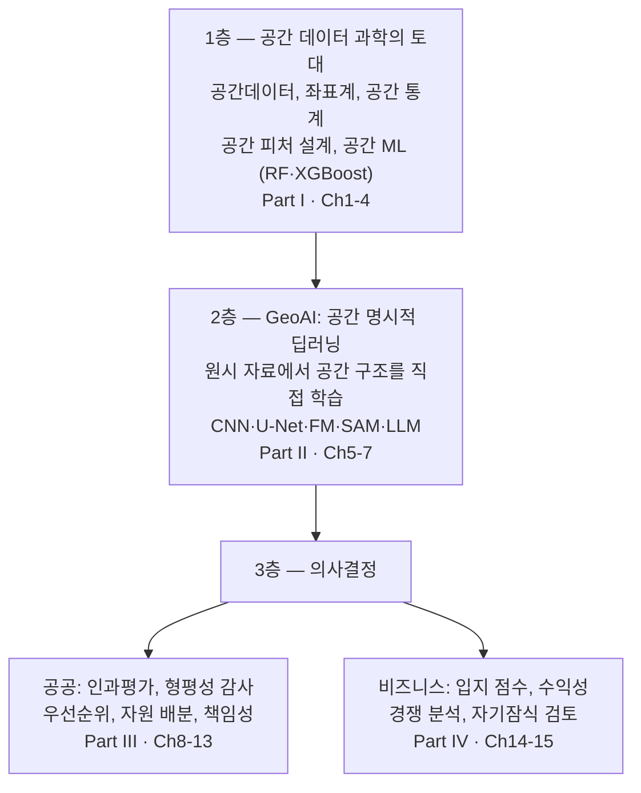

# 1장 공간 데이터 과학과 GeoAI, 무엇이 다르고 어떤 결정으로 이어지나

> - 이 장에 나오는 국가 수, 좌표계, 분석 결과 수치는 모두 `lecture_practice/chapter1/`의 코드를 실제로 실행해 얻은 값
> - 예시를 위해 지어낸 숫자는 없음

## 1. 이 장의 핵심 질문

- 이 장은 세 가지 질문에 답함
- **질문 1** — GIS와 GeoAI는 무엇이 같고 무엇이 다른가? 어떤 분석이면 GeoAI라 부를 수 있는가?
- **질문 2** — 지도 위의 분석 결과는 어떻게 "결정"으로 이어지는가?
- **질문 3** — 같은 지도를 놓고 시청은 "어디가 위험한가"를 묻고 편의점 본사는 "어디에 낼까"를 물음. 두 질문은 어디서 갈라지는가?

- 이 장은 GeoAI를 화려한 최신 기술로 소개하는 장이 아님
- 새 문제를 만났을 때 **어떤 도구가 필요한지, 어디까지 가야 하는지 판정하는 눈**을 만드는 장
- 이 판정을 건너뛰고 방법부터 고르면, 뒤에서 배우는 위성영상·머신러닝·정책 평가·입지 분석이 모두 따로 노는 지식이 됨

## 2. 지도가 결정을 바꾼 첫 사례

- 1854년 런던에 콜레라가 번짐. 당시에는 나쁜 공기가 원인이라는 설이 우세했음
- 의사 John Snow가 한 일은 세 단계로 나눌 수 있음

1. **위치를 찍음** — 사망자가 발생한 집을 지도 위에 점으로 표시
2. **패턴을 봄** — 브로드 스트리트의 수도 펌프 주변에 점이 몰려 있음을 확인
3. **행동을 바꿈** — 그 펌프의 손잡이를 제거하도록 요청

- 이 사례가 공간 분석의 출발점으로 꼽히는 이유는 지도가 예뻐서가 아님
- **지도 위의 패턴이 실제 행동(펌프 폐쇄)으로 이어졌기 때문**
- 2단계에서 멈추었다면 아무것도 바뀌지 않았음. 점이 몰려 있다는 사실만으로는 사망자가 줄지 않음
- 오늘날의 분석도 같음. 모델이 정확도 95%를 기록해도 그 값이 누군가의 결정을 바꾸지 않으면 1854년의 2단계에 머무는 것
- 이 장 전체가 이 세 단계 — 데이터, 패턴, 결정 — 를 오늘의 도구로 다시 밟는 과정임

## 3. GIS: 지도 프로그램이 아니라 공간 의사결정 체계

- **지리정보시스템**(Geographic Information System, GIS)은 공간적으로 참조된 데이터를 수집·저장·관리·분석·시각화하는 통합 체계
- QGIS나 ArcGIS 같은 소프트웨어 이름이 아님. 데이터를 모으고, 정리하고, 분석하고, 결과를 공유하는 **전체 흐름**을 가리킴
- 목적이 지도 출력이 아니라 **공간적 결정 지원**이라는 점이 핵심


**그림 1.1** GIS 작업 흐름

- 흐름의 어느 한 곳이 부실하면 결과를 믿기 어려워짐
- 소프트웨어가 좋아도 데이터 품질이 나쁘면 결과가 나쁨
- 데이터가 좋아도 해석해서 결정으로 옮길 사람이 없으면 2절의 2단계에서 멈춤
- 좌표계를 잘못 고르면 면적과 거리부터 어긋나고 그 오차가 최종 판단까지 옮겨 감. 이 문제는 2장에서 다룸

## 4. 공간 데이터의 세 형식

- 공간 데이터는 표현 방식에 따라 세 형식으로 옴. 형식이 정해지면 쓸 수 있는 연산과 모델이 함께 정해지므로, 새 자료를 받으면 형식부터 확인함

### 4.1 벡터: 경계가 있는 객체

- **벡터 데이터**는 점(Point), 선(LineString), 면(Polygon)의 기하 객체로 공간을 표현함
- 행정경계, 도로망, 건물처럼 **경계가 명확한 대상**에 적합함
- 기하 정보와 속성 테이블(이름·인구·용도 같은 값)이 결합된 형태로 저장됨
- 5절 실습에서 읽는 국가 경계 데이터가 벡터의 전형임. 국가는 경계가 정해진 면이고, 섬이 많은 나라는 여러 면의 묶음이라 `MultiPolygon`이 됨

- 자주 쓰는 연산 네 가지

| 연산 | 무엇을 하는가 | 쓰는 곳 |
| --- | --- | --- |
| **버퍼**(buffer) | 객체 주변에 일정 거리의 영역을 만듦 | 학교 반경 500m 안전구역 |
| **오버레이**(overlay) | 두 레이어의 겹침을 계산 | 침수구역과 건물의 겹침 |
| **공간 조인**(spatial join) | 공간 관계로 두 자료를 결합 | 점포 목록을 행정동에 붙이기 |
| **네트워크 분석** | 최단 경로와 도달권을 계산 | 소방서 5분 도달권 |

### 4.2 래스터: 연속 현상을 픽셀로

- **래스터 데이터**는 균일한 격자의 각 픽셀에 값을 담아 연속 현상을 표현함
- 기온, 고도, 식생, 위성영상처럼 **경계가 뚜렷하지 않고 이어지는 현상**에 적합함
- 픽셀 하나의 크기(공간 해상도)가 표현할 수 있는 최소 단위를 정함

> **주의.** 해상도가 높으면 작은 것을 볼 수 있지만 자료가 커지고 촬영 주기가 길어짐. 해상도가 낮으면 자주 볼 수 있지만 작은 변화를 놓침. 어느 쪽이 옳은지는 목적이 정함 — 건물 단위 피해 판독에는 고해상도가, 전국 식생 변화 추적에는 잦은 재방문이 더 중요함

### 4.3 포인트 클라우드: 3차원 점의 집합

- **포인트 클라우드**는 3차원 좌표 (x, y, z)의 집합으로 지형과 구조물을 표현함
- **라이다**(LiDAR) 센서 자료가 대표적이며, 건물 높이·나무의 수직 구조처럼 벡터·래스터로는 잡히지 않는 것을 봄
- 이 책에서는 벡터와 래스터를 주로 쓰고, 포인트 클라우드는 형식이 존재한다는 것만 알아 두면 됨

## 5. 실습: 첫 공간 데이터 읽기

- 실습 README(실행 방법 및 기대값): [lecture_practice/chapter1/README.md](../lecture_practice/chapter1/README.md)
- 실습 코드: `lecture_practice/chapter1/code/1-1-geoai-tools-preview.py`
- 결과 로그: `lecture_practice/chapter1/results/1-1-geoai-tools-preview.log`

- 이 교재의 실습은 전부 `lecture_practice/` 폴더에 있음
- **GPU 없이 노트북에서 돌아가도록 가볍게 만든 실습**이며, 본문의 실행 수치는 전부 이 폴더의 결과 로그에서 나옴

- 위 코드를 실행하면 GeoPandas로 Natural Earth 국가 경계 데이터를 읽어 다음이 나옴

- 전체 국가 수: `177`
- 좌표계(CRS): `EPSG:4326`
- 기하 유형: `MultiPolygon`, `Polygon`
- 경계 상자: 경도 `-180.00 ~ 180.00`, 위도 `-90.00 ~ 83.65`
- 아시아 국가 수: `47`
- 데이터 형태: `(177, 169)` — 국가 177개가 행, 속성이 169열
- 메모리 사용량: `356.4 KB`

- 이 숫자들이 중요한 이유는 "멋진 결과"라서가 아님
- GIS 작업은 대개 이런 담백한 확인에서 시작함 — 객체가 몇 개인가, 좌표계는 무엇인가, 기하 유형은 점·선·면 중 무엇인가, 자료가 덮는 범위는 어디까지인가
- 이 네 가지를 확인하지 않으면 4.1절의 어떤 연산을 쓸 수 있는지도 정할 수 없음

## 6. GeoAI: GIS 위에 학습이 올라간다

### 6.1 무엇이 다른가

- **GeoAI**는 공간 구조를 모델에 명시적으로 반영해 공간 패턴을 학습·예측하고, 그 산출물을 공간적 결정으로 연결하는 분야
- 핵심은 "공간 데이터에 AI를 썼다"가 아니라 **공간 구조가 모델 안으로 들어갔는가**

- 전통 GIS와의 차이를 대비하면

| 구분 | 전통 GIS | GeoAI |
| --- | --- | --- |
| 규칙 | 사람이 지정 (경사도 15도 이상 = 위험) | 데이터에서 학습 |
| 비선형 관계 | 표현이 어려움 | 자동으로 포착 |
| 다루는 규모 | 수천~수만 객체 | 수억 픽셀 |
| 해석 | 규칙이 명시적이라 쉬움 | 별도 설명 절차가 필요 |

- 마지막 행이 중요함. GeoAI가 항상 나은 것이 아님
- 규칙이 이미 명확하고 데이터가 적으면 전통 GIS가 더 나음 (9.3절에서 다시 다룸)

- 규모의 감각을 위한 실제 사례 하나 — Microsoft Global ML Building Footprints는 위성·항공 영상에서 건물 윤곽을 자동 추출해 약 14억 개의 건물 폴리곤을 공개함
- 사람이 하나씩 그렸다면 불가능한 규모. "AI가 공간 데이터를 읽는다"는 말의 구체적인 뜻이 이것임

### 6.2 판정의 도구: 두 조건

- 어떤 분석이 GeoAI인지는 **두 조건**으로 판정함

1. **공간 명시성**(spatial explicitness) — 공간 구조(위치, 이웃 관계)가 모델 안으로 들어가 예측에 실제로 기여하는가
2. **학습 기반** — 모형의 형태를 분석자가 지정하지 않고 데이터에서 적합하는가

- **두 조건을 함께 충족해야 GeoAI**이며, 하나만 충족하면 다른 이름을 붙임
- 공간 구조가 모델에 들어가는 대표 경로는 둘. 이웃 값의 평균 같은 **공간 피처를 입력 열로 추가**하거나, CNN처럼 **이웃을 함께 보는 모델 구조**를 쓰는 것

> **주의.** 공간 블록 교차검증(가까운 관측이 학습과 평가에 함께 들어가지 않게 나누는 방법)을 썼다는 것만으로는 GeoAI가 되지 않음. 그것은 "제대로 검증했다"는 뜻이지 "공간을 모델에 넣었다"는 뜻이 아님. 검증 방법은 4장에서 배움

## 7. 판정 연습: 이건 GeoAI인가

- 두 조건을 네 사례에 적용해 봄. 이 판정은 이 책 전체에서 반복됨

- **사례 A** — 행정동별 인구·소득 표에 랜덤 포레스트를 적합해 취약지수를 예측함. 좌표는 쓰지 않음
  - 학습 기반 ○, 공간 명시성 ✗ → **GIS + ML** (공간 데이터에서 출발했지만 모델은 공간을 모름)
- **사례 B** — 같은 표에 **이웃 행정동의 평균값을 열로 추가**해 다시 적합함
  - 학습 기반 ○, 공간 명시성 ○ → **GeoAI**
- **사례 C** — 위성영상에 U-Net(6장에서 배움)을 적용해 침수 픽셀을 분류함
  - 학습 기반 ○, 공간 명시성 ○(합성곱이 인접 픽셀을 함께 봄) → **GeoAI**
- **사례 D** — 크리깅(관측 지점 사이의 값을 공간 통계로 보간하는 방법)으로 미관측 지점의 기온을 추정함
  - 학습 기반 ✗, 공간 명시성 ○ → **공간 통계** (전통적 방법이며, 그 자체로 유용함)

- A와 B의 차이가 **열 하나뿐**이라는 점이 이 연습의 핵심임
- 판정은 말로 하지 않고 수치로 함. 이웃 평균 열을 넣기 전과 후의 성능을 같은 검증 설계로 비교해, 그 열이 예측에 실제로 기여했는지 확인함
- 성능 차이가 없으면 열만 추가한 것이지 공간을 모델에 넣은 것이 아님

- 이름을 정확히 붙이는 것은 말장난이 아님
- "GeoAI 사업"이라는 이름이 붙으면 다른 예산 계정과 다른 심사 기준이 적용됨. 학습하는 모델이 없는 대시보드에 그 이름을 붙이면 심사에서 근거를 대지 못함

## 8. 3층 모델: 분석이 결정이 되기까지

- 이 책 전체는 3층 구조를 따라감



**그림 1.2** 이 책의 3층 모델: 공간 데이터 과학 → GeoAI → 의사결정

- 1층이 없으면 2층은 붕 뜸. 좌표계와 데이터 형식을 모르면 딥러닝 입력부터 잘못 만듦
- 2층이 있어도 3층으로 올라가지 못하면 "멋진 분석 결과"에서 멈춤 — 2절의 John Snow가 2단계에서 멈춘 것과 같은 상태
- **1층과 2층은 공공이든 기업이든 거의 같고, 갈라지는 곳은 3층임** (9절)

### 8.1 픽셀에서 결정까지: 다섯 단계

- 2층의 분석 결과가 3층의 결정이 되려면 단위를 바꾸는 과정이 필요함
- 침수 판독을 예로 들면 다섯 단계를 거침

1. 위성영상에서 침수 픽셀을 분류함
2. 오분류가 예상되는 영역(원래 물이었던 곳, 그림자)을 걸러냄
3. 침수 픽셀과 건물 폴리곤을 겹쳐 침수 건물을 셈
4. 건물을 행정동 단위로 집계함
5. 행정동별 우선순위표를 만듦

- 분류 정확도는 1단계의 지표이고, 예산을 배정하는 쪽이 필요로 하는 것은 5단계의 표
- **두 값은 자료 형식도 단위도 다름.** 1단계만 잘해서는 결정에 도달하지 못함

> **주의.** 4단계의 집계 단위를 바꾸면 결과 순위가 달라질 수 있음. 같은 자료를 읍면동으로 묶느냐 시군구로 묶느냐에 따라 어느 지역이 "가장 심각한지"가 바뀜. 그래서 집계 단위는 취향이 아니라 **근거를 적어야 하는 결정**임. 자세한 원리는 4장에서 다룸

## 9. 같은 지도, 다른 결정

### 9.1 홍수 지도 하나를 두 사람이 본다

- 같은 침수 위험 지도를 시청 담당자와 보험사 심사역이 봄
- 시청은 "어디에 배수펌프를 먼저 놓을까"를 묻고, 보험사는 "이 지역 보험료를 얼마로 매길까"를 물음
- 격자를 나누는 법, 넣는 변수, 검증 방법 — 1층과 2층은 같음. **갈라지는 곳은 3층**

### 9.2 무엇이 다른가: 오류 비용의 비대칭

| 구분 | 공공 | 비즈니스 |
| --- | --- | --- |
| 목적 | 위험 저감, 형평 | 손실 관리, 수익 |
| 더 아픈 오류 | 위험을 놓침 (과소예측) | 잘못 투자함 (과대예측) |
| 산출 단위 | 행정동·생활권 | 건물·계약 |
| 책임 | 설명 의무, 감사 | 계약 조건, 규제 준수 |

- 둘째 행이 핵심임
- 공공에서 위험을 낮게 본 지역이 실제로 침수되면 인명 피해가 남. 기업에서 위험을 낮게 보면 손실이 나지만 다음 계약에서 조정할 수 있음
- 그래서 **같은 예측값에도 서로 다른 판정 기준을 씀.** 예측 모델이 같아도 결정은 달라지는 것이 정상임

### 9.3 AI를 쓰지 말아야 할 때

- 세 경우에는 학습 모델을 얹지 않는 편이 나음

1. **규칙이 이미 명확할 때** — 경사도 기준으로 정해지는 판정에 모델을 얹으면 불투명성만 늘어남
2. **데이터가 적을 때** — 관측이 수십 개인 문제에서 딥러닝은 과적합함
3. **근거를 제시해야 하는데 설명 절차가 없을 때** — 예산 배분처럼 이유를 대야 하는 결정에서는 정확도가 높아도 배치하면 안 됨

- "AI를 안 쓴다"는 결론도 정당한 판정 결과임. 7절의 판정을 했는데 전통 GIS로 충분하다면 그것이 답

## 10. 핵심 요약

- **공간 분석의 가치는 결정에서 나옴.** John Snow의 지도가 기억되는 이유는 점의 패턴이 아니라 펌프 폐쇄라는 행동으로 이어졌기 때문. 정확도가 아무리 높아도 결정을 바꾸지 못하면 분석은 2단계에서 멈춘 것 (2절)
- **GIS는 지도 프로그램이 아니라 공간 의사결정 체계.** 수집 → 전처리 → 분석 → 공유의 전체 흐름이며, 어느 한 곳이 부실하면 결과를 믿기 어려움 (3절, 그림 1.1)
- **공간 데이터는 세 형식으로 옴.** 경계가 명확한 대상은 벡터(점·선·면), 이어지는 현상은 래스터(픽셀 격자), 3차원 구조는 포인트 클라우드. 형식이 정해지면 쓸 수 있는 연산과 모델이 함께 정해짐 (4절)
- **새 자료를 받으면 네 가지부터 확인함.** 객체 수, 좌표계, 기하 유형, 덮는 범위. 실습에서 확인한 값 — 국가 177개, EPSG:4326, MultiPolygon (5절)
- **GeoAI 판정은 두 조건.** 공간 명시성(공간 구조가 모델 안에 들어가는가)과 학습 기반(모형을 데이터에서 적합하는가)을 함께 충족해야 GeoAI. 하나만 충족하면 GIS + ML(공간 없는 학습) 또는 공간 통계(학습 없는 공간)라 부름. 판정은 말이 아니라 이웃 피처를 넣기 전후의 성능 차이, 즉 수치로 함 (6~7절)
- **이 책은 3층 구조를 따라감.** 1층 공간 데이터 과학의 토대 → 2층 GeoAI → 3층 의사결정. 2층의 픽셀 분류가 3층의 결정이 되려면 걸러내기·겹치기·집계의 다섯 단계를 거쳐야 하며, 집계 단위는 근거를 적어야 하는 결정임 (8절, 그림 1.2)
- **1·2층은 공공과 기업이 공유하고 3층에서 갈라짐.** 갈라지는 핵심은 오류 비용의 비대칭 — 공공은 위험을 놓치는 쪽(과소예측)이, 기업은 잘못 투자하는 쪽(과대예측)이 더 아픔. 같은 예측값에 서로 다른 판정 기준을 쓰는 이유 (9절)
- **AI를 안 쓴다는 결론도 정당한 판정 결과.** 규칙이 이미 명확하거나, 데이터가 적거나, 설명 절차 없이 근거를 제시해야 하는 결정이면 학습 모델을 얹지 않는 편이 나음 (9.3절)

## 11. 과제

- 이번 장의 과제는 **직접 돌려 보고, 그 결과로 판단하는 것**
- 명령 한 줄이면 제출할 파일이 생성됨

```bash
python scripts/submit.py 1 --id 학번 --name 이름
```

- 이 명령이 대신 처리하는 작업: 실습 데이터 생성, 대표 실습 `1-1-geoai-tools-preview.py` 실행, 제출용 파일 생성
- 저장소를 내려받아도 데이터 파일은 들어 있지 않으므로 첫 단계가 꼭 필요함. 그래서 처음 돌리는 장은 조금 더 걸림

- 끝나면 `submissions/` 폴더에 `제출_1장_학번.md` 파일이 생김
- 열어 보면 실행 결과가 이미 붙어 있음. **눈여겨볼 곳은 국가 수, 좌표계, 기하 유형, 그리고 마지막에 뜨는 경고**

- 맨 아래 빈칸 세 개를 채우면 됨

1. 눈에 띈 숫자 하나를 그대로 옮겨 적고, 왜 눈에 띄었는지 한 문장으로
2. 그 숫자가 왜 그렇게 나왔는가
3. **이 결과는 컴퓨터가 달라도 똑같이 나와야 한다. 왜 그런가? 만약 달랐다면 무엇을 먼저 의심하겠는가?**

- **3번이 이 과제의 핵심.** 1·2번은 결과를 들여다보면 답이 나오지만 3번은 그렇지 않음
- 과제의 핵심은 숫자 산출이 아니라 그 숫자를 근거로 판단하는 능력

- 채운 파일 **하나만** 올리면 제출이 끝남

> - **막혀도 제출함**
> - 실행이 도중에 실패하면 오류 메시지가 그 파일에 자동으로 담기고, 질문이 "어디서 막혔나"로 바뀜
> - 어디서 왜 막혔는지 적은 제출도 온전한 제출. 실행 성공 여부로 점수를 매기지 않음

> - **이 장은 난수를 쓰지 않음**
> - 그래서 교재에 적힌 값이 그대로 나와야 정상이고, 옆 사람 결과와도 같음
> - 다른 결과가 나왔을 때 차이를 찾는 과정까지 과제에 포함
