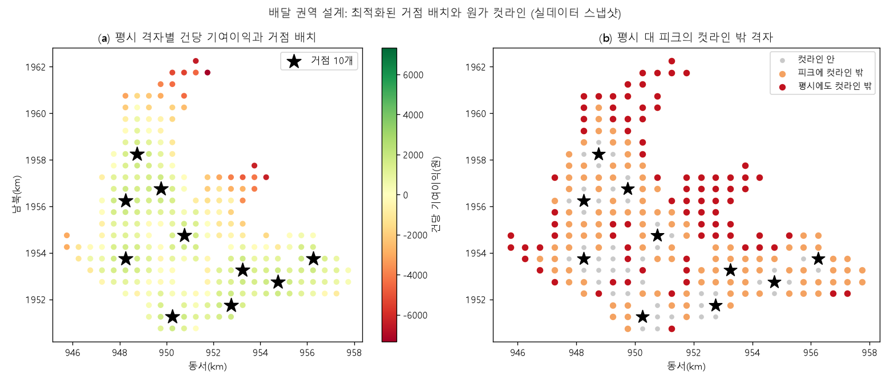
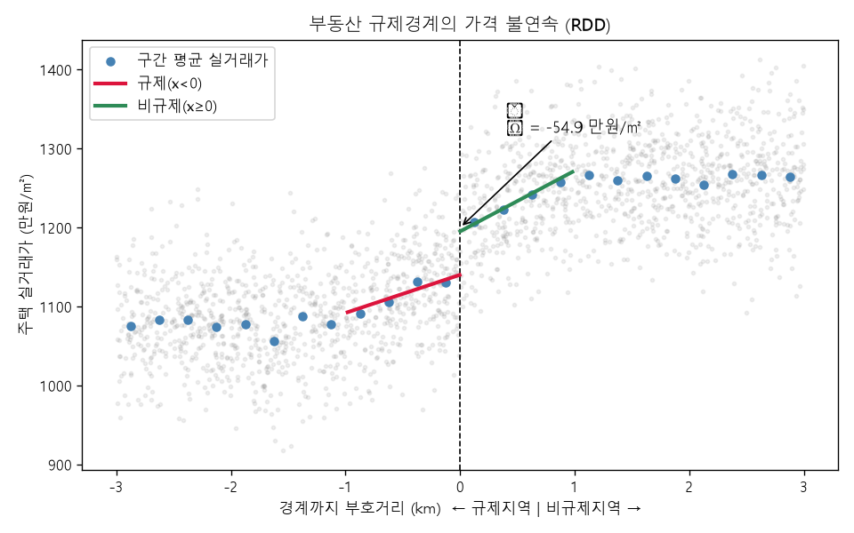

# 10장 도시 서비스 배분, 어디가 부족하고 어디로 몰리고 어디에 둘 것인가

> - 이 장에 나오는 접근성·예측·최적화·회귀불연속 수치는 모두 `lecture_practice/chapter10/`의 코드를 실제로 실행해 얻은 값
> - 예시를 위해 지어낸 숫자는 없음

## 1. 이 장의 핵심 질문

1. **어느 구역이 부족한가.** 접근성과 인구를 어떻게 하나의 우선순위로 만드는가
2. **다음 주 수요는 어디에 몰리는가.** 그 예측을 얼마나 믿을 것인가
3. **어디에 열고 어디까지 담당하는가.** 예측이 정확해도 배치가 정해지지 않는 이유는 무엇인가
4. **집행한 개입이 정말 효과가 있었는가.** 시행 전과 후를 비교하면 되는 것인가

□ 네 질문은 따로 노는 질문이 아님  
  ○ **부족한 곳을 찾고(진단) → 다음에 몰릴 곳을 맞히고(예측) → 어디에 무엇을 둘지 정하고(결정) → 정한 것이 실제로 통했는지 확인함(검증)**  
  ○ 같은 절차가 시청에서는 생활SOC 배치에, 배달업체에서는 배달 권역 설계에 쓰임. **재는 대상과 계산 도구는 같고, 무엇을 최소화·최대화할지가 다름**  

## 2. 도입 사례: 인구가 많은 곳이 1순위가 아닌 이유

□ `10-1-living-soc-accessibility.log`의 실제 실행 결과부터 봄  
  ○ 격자 300개(20×15, 셀 500m), 총 인구 1,870,844명에 도서관 6·돌봄 10·공원 12·체육 8개소를 배치한 자료  

○ 시설 종류별 인구가중 평균 도달시간: 도서관 24.0분, 돌봄 20.2분, 공원 16.5분, 체육 24.9분  
○ 시설 종류별 15분 초과 사각지대 인구 비율: 도서관 67.2%, 돌봄 54.1%, 공원 50.1%, 체육 64.3%  
○ 네 종류를 평균한 종합 접근성: 인구가중 평균 21.4분, 종합 15분 초과 격자 258개(인구의 69.5%)  

○ 여기서 눈에 띄는 것은 **접근성이 가장 나쁜 격자와 인구가 가장 많은 격자가 같지 않다**는 점임  

| 순위 | 격자 | 인구 | 종합 접근성(분) | 임계 초과분(분) | 우선순위 점수 |
| :---: | :---: | ---: | ---: | ---: | ---: |
| 1 | cell 30 | 6,321 | 45.12 | 30.12 | 190,366.86 |
| 2 | cell 22 | 5,476 | 47.51 | 32.51 | 178,014.40 |
| 3 | cell 68 | 9,701 | 30.43 | 15.43 | 149,685.78 |

□ cell 68은 인구가 cell 30보다 1.5배 많지만 순위는 더 낮음. 접근성 초과분이 cell 30의 절반 수준(15.43분 대 30.12분)이기 때문임  
  ○ **"인구가 많은 곳"과 "접근성이 나쁜 곳"이 곱해져야 우선순위가 정해짐** — 이 계산이 4.4의 결손 점수임  

## 3. 질문의 형태와 공간 단위

### 3.1 네 가지 질문 유형

○ 같은 도시 자료를 쓰더라도 질문의 형태에 따라 필요한 계산 방법이 다름  

| 질문 유형 | 물음의 형태 | 필요한 방법 | 이유 |
| --- | --- | --- | --- |
| 현황 | 지금 어디의 서비스 수준이 낮은가 | 결정론적 계산 | 시설 위치와 인구가 주어지면 값이 하나로 정해짐. 학습할 미지의 대상이 없음 |
| 예측 | 다음 회차에 수요가 어디로 몰리는가 | 학습 모델 | 대상이 아직 관측되지 않았고, 이웃 확산과 시간 지속성이 겹쳐 단순 외삽으로 맞지 않음 |
| 인과 | 이 개입이 결과를 바꾸었는가 | 식별 설계 | 처치 여부가 무작위가 아니므로 예측을 아무리 정확히 해도 답이 나오지 않음 |
| 결정 | 어디에 무엇을 두고 어디까지 담당하는가 | 최적화 | 목적함수와 제약이 답을 정함. 예측이 정확해도 배치는 정해지지 않음 |

○ 이 표가 이 장의 네 실습 배치와 그대로 대응함 — 접근성(현황), 민원 예측(예측), 규제 경계(인과), 배달 권역(결정)  
○ **가장 자주 뒤집히는 판정이 첫 행임.** 좌표와 도로망만 있으면 이동시간이 하나로 정해지는데, 이걸 학습 모델로 근사하면 정확한 값을 부정확한 예측으로 바꾸는 셈이 됨  
○ 앞 질문의 답이 뒤 질문의 답을 정하지도 않음. **접근성이 가장 나쁜 격자가 시설 입지의 정답은 아님.** 입지는 후보 집합·개설 개수·목적함수가 함께 주어져야 정해지고, 접근성 진단은 수요 가중치를 만드는 입력 하나를 제공할 뿐임  

### 3.2 공간 단위를 정하지 않으면 지표가 흔들린다

□ 도시에는 크기가 다른 공간 단위가 층을 이루며 공존함 — 격자, 행정동, 블록·필지·건물, 생활권  
  ○ 격자는 크기가 균일해 구역 간 비교의 기준이 되고, **행정동은 예산과 인력이 실제로 배정되는 단위**임  
  ○ 이 어긋남에서 **수정가능면적단위문제**(MAUP)가 생김. 같은 현실을 어떤 크기·모양의 칸으로 집계하느냐에 따라 결론이 달라지는 성질이며, 자료가 바뀐 것이 아니라 집계 칸이 바뀐 것임  
  ○ **격자에서 계산한 값을 행정동으로 단순 평균 내면 구역 안의 최악 격자가 사라짐.** 이 계산은 오류 메시지 없이 통과함  

□ 대응은 두 단계 구조임 — 현상의 단위(격자)에서 계산하고, 집행의 단위(행정동)로 집계함  
  ○ 이때 무엇으로 가중평균할지를 정해야 함  

| 가중치 | 계산 결과의 뜻 | 고르는 조건 |
| --- | --- | --- |
| 면적(모두 동일) | 구역의 평균 물리 조건 | 사람 수와 무관한 결정(토지이용 규제) |
| 인구 | 주민 노출을 반영한 수준 | 이용자 수가 편익을 정하는 결정(시설 공급) |
| 취약인구 | 대응이 필요한 인구 기준 수준 | 특정 집단의 피해가 결정을 좌우하는 경우(폭염·돌봄) |
| 건물 수 | 대상 시설물 기준 수준 | 작업량이 건물 수에 비례하는 결정(정비·점검) |

> **주의.** 집계 결과를 보고할 때 어떤 가중치로 평균했는지 적지 않으면, "구역 평균 접근성 20분"이 무엇을 평균한 값인지 알 수 없음. 평균과 함께 구역 내 최댓값, 임계값 초과 격자 수를 같은 표에 남기면 이 손실을 줄일 수 있음

## 4. 서비스 수준을 하나의 숫자로 만들기

### 4.1 이동시간의 세 계산 방식

□ 접근성을 거리가 아니라 이동시간으로 재는 이유는 **같은 500m가 장소마다 다른 시간이 되기 때문**임  
  ○ 평지의 500m는 도보 7분이지만, 하천을 건너 우회해야 하는 500m는 20분이 될 수 있음  

| 방식 | 계산 | 오차의 성격 |
| --- | --- | --- |
| 직선거리 | 좌표 간 유클리드 거리 ÷ 보행속도 | 실제 이동거리를 항상 과소평가함 |
| 네트워크 거리 | 도로망 그래프의 최단경로 | 정확하지만 계산량이 큼 |
| 우회계수 근사 | 직선거리 × 1.2~1.5 | 지역 평균은 맞지만 개별 격자의 편차를 지움 |

○ 도로망 그래프를 구성하고 최단경로를 계산하는 절차는 2장에서 이미 다룸. 여기서는 세 방식 가운데 무엇을 고를지의 판정만 다룸  
○ 우회계수 근사는 지역 전체의 평균 이동거리는 맞추지만, 하천·급경사·철도가 가로막는 개별 격자를 놓침  

> **주의.** 사각지대 진단처럼 최악의 격자를 찾는 작업에서 우회계수 근사를 쓰면, 정작 찾아야 할 격자가 근사에서 평범한 값으로 나타남. 계수를 두 값(예: 1.20과 1.50)으로 흔들어 판정이 뒤집히는 격자를 따로 목록화하는 것이 안전함

### 4.2 접근성 지표는 하나가 아니다

○ 이동시간 행렬을 얻은 뒤에도 "접근성이 얼마인가"의 답은 하나로 정해지지 않음  

| 지표 | 계산 | 반영하는 것 |
| --- | --- | --- |
| 최근접 | 격자에서 같은 종류 시설까지의 최솟값 | 물리적 근접성 |
| 누적기회 | 임계 시간 안 시설 개수 | 선택지의 개수 |
| 2SFCA(2단계 유동권역법) | 시설 정원을 배후 인구로 나눈 몫을 격자별로 합산 | 규모·거리·이용 경쟁 |

○ 최근접은 계산이 간단하고 "가장 가까운 도서관까지 24분"처럼 설명하기 쉬움. 다만 시설 정원이나 이용 경쟁을 반영하지 못함  
○ 2SFCA는 시설에 정원이 있고 여러 구역이 같은 시설을 나눠 쓸 때 이 경쟁을 지표에 반영함 — **두 격자가 같은 어린이집에서 5분·12분 거리에 있어도, 배후 인구가 다르면 실제 이용 기회는 역전될 수 있음**  
○ 이 장의 실습(10-1)은 최근접 접근성을 산출함. 2SFCA의 정식 계산과 산출 예는 4장이 정의처임  
○ 판정 조건 세 가지: 시설에 정원 같은 용량 제약이 있는가, 여러 구역이 그 시설을 나눠 쓰는가, 계산 과정을 시민에게 설명해야 하는가. 세 조건이 모두 아니오라면 최근접으로 충분하고, 앞의 두 조건이 그렇다면 2SFCA로 넘어감  

### 4.3 임계값과 Gini 계수

□ 접근성 값을 얻은 뒤에는 정책이 쓸 수 있는 형태로 바꿈. 첫 장치는 **임계값**임  
  ○ 15분을 넘으면 사각지대로 표시함. **이 15분은 계산에서 나오지 않고 정책 목표에서 옴** — 정부가 「생활SOC 3개년 계획(2020–2022)」에서 제시한 도보 10분 목표에 여유를 둔 값임(관계부처 합동, 2019)  

□ 두 번째 장치는 **Gini 계수**임. 사각지대 인구 비율은 임계값 하나만 보므로 **임계 안쪽의 격차를 잡지 못함**  
  ○ 계산은 격자를 접근성 오름차순으로 정렬하고, 인구의 누적 비율과 접근성의 누적 비율로 로렌츠 곡선을 그리고, 대각선과 곡선 사이 면적의 두 배를 구하는 순서로 진행함  
  ○ 실행 결과에서 시설 종류별 Gini는 도서관 0.324, 돌봄 0.349, 공원 0.307, 체육 0.362이고, 네 종류를 평균한 종합 Gini는 0.246  
  ○ 종합 Gini가 개별 종류보다 작은 이유는, 한 격자가 도서관에서는 나쁘고 공원에서는 좋을 수 있어 네 종류를 평균하면 **극단값이 서로 상쇄되기 때문**임  
  ○ 체육(0.362)이 가장 불균등하고 공원(0.307)이 가장 고른 분포임 — 공원 12개소가 도서관 6개소보다 촘촘히 배치되어 있다는 뜻으로 읽을 수 있음  

### 4.4 결손 점수

□ 세 번째 장치가 2절에서 본 **결손 점수**임  

Dᵢ = max(0, 접근성ᵢ − 임계값) × 인구ᵢ

○ 초과분을 0에서 자르는 이유는 임계값을 이미 만족한 격자에는 채울 결손이 없기 때문임  
○ 2절의 cell 30(인구 6,321명, 초과분 30.12분, 점수 190,366.86)과 cell 68(인구 9,701명, 초과분 15.43분, 점수 149,685.78)을 다시 보면, 인구가 더 많은 cell 68이 초과분이 절반이라 순위가 더 낮음  

□ **곱셈 결합의 성질은 두 가지임**  
  ○ 어느 한 축이 0이면 전체가 0이 됨(인구가 없는 격자는 접근성이 아무리 나빠도 우선순위에서 빠짐)  
  ○ 두 축의 단위가 다르므로(분 × 명) 점수의 절대값 자체에는 물리적 의미가 없고, **순위를 매기는 용도로만 씀**  

## 5. 실습 안내

□ 실습 코드  
  ○ `lecture_practice/chapter10/code/10-1-living-soc-accessibility.py` — 생활SOC 접근성과 결손 점수  
  ○ `lecture_practice/chapter10/code/10-2-civil-complaint-forecast.py` — 민원 시공간 예측과 신뢰등급  
  ○ `lecture_practice/chapter10/code/10-3-rdd-regulation-boundary.py` — 부동산 규제 경계의 회귀불연속 설계  
  ○ `lecture_practice/chapter10/code/10-4-delivery-zone-optimization.py` — 배달 권역 최적화와 원가 컷라인  
□ 결과 로그: `lecture_practice/chapter10/results/*.log`  

○ `lecture_practice/`는 노트북에서 돌아가도록 가볍게 만든 실습이고, 이 장의 본문 수치는 전부 이 폴더의 결과 로그에서 나옴  
○ 10-1·10-2·10-3은 시뮬레이션 자료를 씀. **10-4만 실제 공개 자료(서울시 상가정보·생활인구)를 가공해 씀**  

## 6. 민원 자료는 문제량이 아니라 신고량을 잰다

### 6.1 세 값의 구분

□ 앞 절의 지표는 시설 위치·인구처럼 측정 오차가 작은 자료로 계산함. 이번 절부터는 자료의 성격이 달라짐  
  ○ 민원 접수 기록은 **주민이 불편을 인지하고 신고 창구에 접근해 내용을 입력하는 과정**을 거쳐 만들어짐. 그래서 기록에 남은 건수와 실제로 존재하는 문제의 양이 같지 않음  
  ○ 이 차이를 표기법으로 구분함 — yᵢ는 실제 문제의 양, yᵢᵒᵇˢ는 접수되어 자료에 남은 양, ŷᵢ는 모형이 산출한 예측값  
  ○ **모형은 yᵢᵒᵇˢ로 학습하고 yᵢᵒᵇˢ를 예측함.** 그래서 예측 성능이 아무리 좋아져도 그 지표가 재는 것은 "신고량을 얼마나 잘 맞혔는가"이지 "문제량을 얼마나 잘 맞혔는가"가 아님  

□ 두 값이 벌어지는 경로는 세 가지임  
  ○ **인지의 차이** — 통행량이 많은 구역에서 더 자주 눈에 띔  
  ○ **신고 수단 접근성의 차이** — 스마트폰 이용률이 낮은 고령 인구 비중이 높은 구역에서 접수가 상대적으로 줄어듦  
  ○ **신고 성향의 차이** — 반복 민원인 소수가 접수의 상당 부분을 차지  

### 6.2 편향이 있는지 확인하는 절차

□ "편향이 있다"는 서술만으로는 다음 단계로 넘어갈 수 없음. 이 자료에서 편향이 실제로 나타나는지 확인해야 함  

1. **접수량을 인구·연령 구성으로 나눈 지표를 만듦** — 격자별 접수 건수를 그대로 비교하지 않고 인구 1,000명당 접수율을 구해 65세 이상 인구 비율과 대조함. 접수율이 고령 비율과 뚜렷한 음의 관계를 보이면 접수량이 문제량보다 신고 성향을 더 많이 반영한다는 신호임
2. **자원 투입량과 접수량의 시차 상관을 확인함** — 특정 구역에 점검·순찰 인력을 늘린 뒤 몇 주 동안 그 구역의 접수량이 오르는지 봄. 오른다면 접수량의 변화 가운데 일부는 문제의 변화가 아니라 관측 강도의 변화임
3. **자원을 늘리지 않은 구역과 비교함** — 투입이 일정했던 구역들의 접수량 추세를 기준선으로 두고, 투입을 늘린 구역의 추세가 그 기준선에서 벗어나는지 봄

> **주의.** 민원 건수는 문제의 양이 아니라 신고의 양을 잼. 접수량으로만 자원을 배분하면 신고가 활발한 구역에 자원이 쏠리고, 그 구역에서 인지·기록이 늘어 다음 회차 접수량이 다시 오름. 접수량을 인구·연령 구성으로 나눈 지표를 함께 보고, 신고가 저조한 구역은 접수 자료와 별개의 점검 대상으로 둠

## 7. 다음 주 수요를 예측한다

### 7.1 단순 외삽으로 안 되는 이유

□ `10-2-civil-complaint-forecast.log`의 결과를 봄  
  ○ 격자 256개 × 40주(분석 12~39주)의 시공간 패널, 총 126,117건, 주 평균 4,504건  
  ○ 권역 8개로 집계한 누적 민원은 권역 0(22,650건)부터 권역 3(10,460건)까지 두 배 넘게 벌어짐  

□ 다음 주 접수 건수를 단순 추세로 맞히기 어려운 이유는 두 성질이 겹치기 때문임  
  ○ **시간 지속성** — 도로 파임이나 무단투기의 원인은 한 주 만에 사라지지 않으므로, 이번 주 접수가 많았던 격자는 다음 주에도 많을 가능성이 높음  
  ○ **공간 확산** — 한 도로구간이 파이면 차량이 옆 구간으로 몰려 그 구간도 곧 손상되고, 소음원 주변은 권역 단위로 접수가 오름  

### 7.2 시공간 피처와 시간 블록 교차검증

□ 입력 피처는 세 묶음임 — 자기 시차(격자 자신의 t, t−1, t−2 시점 값), 공간 시차(이웃 격자들의 t 시점 평균값), 고정 공변량(도로 밀도 등 시간에 안 변하는 값)  
  ○ **예측 시점에 존재하지 않는 값은 피처로 쓸 수 없음** — 다음 주를 예측하는 시점에 다음 주의 이웃 값은 없으므로, 공간 시차는 t 시점까지만 씀  

□ 검증 방식도 예측 방향에 맞춰야 함. 시계열을 무작위로 나눠 학습·검증하면 **미래 자료로 학습해 과거를 맞히는 구성**이 되어 버림  
  ○ **시간 블록 교차검증**은 시점 경계로 자료를 나눔 — 전체 주차의 앞 70%를 학습, 뒤 30%를 평가로 두고, 평가 구간에서만 성능을 계산함  

> **주의.** 시계열을 무작위로 분할하면 코드는 정상 종료하고 성능 지표는 오히려 좋아짐. 학습·평가 구간의 시점 경계를 명시하고, 각 피처가 예측 시점에 실제로 관측 가능한지 한 줄로 확인하는 습관이 필요함

### 7.3 공간 시차가 정말 도움이 되는가

□ "공간 자료를 다룬다"는 이유만으로 공간 시차를 넣으면 근거 없이 복잡도만 올라감  
  ○ 판정 절차는 **같은 검증 설계에서 공간 시차를 뺀 모형과 넣은 모형을 나란히 비교하는 것**임  

| 피처 구성 | R² | MAE |
| --- | :---: | :---: |
| 자기 시차만 | 0.753 | 6.510 |
| 자기 시차 + 공간 시차 | 0.813 | 5.498 |

○ R²는 예측이 실제 변동을 얼마나 설명하는지를 0에서 1 사이로 나타내고, MAE는 예측이 평균적으로 몇 건 빗나가는지를 건수로 잼  

□ 공간 시차를 더하면 R²가 0.059 오르고 MAE가 1.012건 줄어듦. **두 지표가 같은 방향으로 움직였으므로 개선이 우연이 아니라고 판단함**  
  ○ 피처 중요도에서도 이웃의 직전 값(neigh_t 0.364)이 자기 직전 값(self_t 0.589) 다음으로 크고, 나머지 피처는 그 아래임  
  ○ 민원은 인접 구간으로 번지므로 자기 과거만으로는 이 확산을 놓침. **만약 개선 폭이 0에 가까웠다면 더 단순한 모형으로 물러서는 것이 맞는 판단임**  

## 8. 예측을 얼마나 믿을 것인가

### 8.1 정규화 conformal 예측구간

□ 예측값 하나만으로는 자원을 확정할 수 없음. 다음 주 700건으로 예측된 두 권역이 있을 때, **한 권역의 오차 폭이 다른 권역의 세 배라면 같은 방식으로 배치할 근거가 없음**  
  ○ **conformal 예측**은 분포 가정 없이 목표 포함확률을 달성하는 예측구간을 만드는 방법임. 기본형은 모든 예측에 같은 폭의 구간을 씌우는데, 위치마다 예측 난이도가 다른 자료에서는 이 폭이 쉬운 곳에서는 넓고 어려운 곳에서는 좁아짐  
  ○ **정규화** conformal은 위치별 예상 오차 규모로 폭을 조정함. 계산은 여섯 단계임 — 보정표본 구성 → 잔차 계산 → 위치별 예상 오차 규모(σ̂) 적합 → 정규화 점수(잔차 ÷ σ̂) 산정 → 목표 포함확률에 대응하는 분위(q) 산정 → 반폭(q × σ̂) 산출  
  ○ 실행 결과에서 90% 예측구간의 경험적 포함률은 0.901(목표 0.90)이고, 반폭은 중앙값 8.82건, 범위 [5.41, 119.80]건으로 **22배 넘게 벌어짐**  
  ○ 이 예제는 학습·보정·시험을 셋으로 나눈 정식 분할이 아니라 시간 블록 평가 구간의 잔차를 σ̂ 적합과 분위 산정에 함께 쓰는 교육용 근사임. 같은 잔차를 두 번 쓰는 탓에 포함률이 다소 낙관적으로 나올 수 있음  

### 8.2 예측 상위가 저신뢰가 되는 구조

○ 격자별 반폭을 권역 단위로 쓰려면 등급으로 바꿈. 권역 평균 반폭을 구하고, 전체 권역에서 3분위로 나눠 높음·중간·낮음을 매김  

| 권역 | 다음 주 예측(건) | 평균 반폭(건) | 신뢰등급 |
| :---: | :---: | :---: | :---: |
| 0 | 1,311.7 | 16.00 | 낮음 |
| 1 | 1,292.3 | 12.03 | 낮음 |
| 7 | 759.1 | 8.89 | 중간 |
| 4 | 720.7 | 8.96 | 낮음 |
| 6 | 711.6 | 8.85 | 높음 |
| 2 | 675.1 | 8.90 | 중간 |
| 5 | 655.4 | 8.59 | 높음 |
| 3 | 556.4 | 7.86 | 높음 |

□ **예측값이 가장 큰 두 권역(0, 1)이 동시에 신뢰등급 낮음임.** 우연이 아니라 자료 구조에서 나옴  
  ○ 접수량이 많은 권역은 주 단위 변동 폭도 크므로 절대잔차가 크고, σ̂가 크면 반폭도 커짐. 예측 상위 권역이 동시에 불확실 상위가 되는 것은 **값의 크기와 변동이 함께 커지는 자료에서 반복해 나타나는 성질**임  
  ○ 이 성질을 알면 신뢰등급을 예측 순위와 독립된 정보로 읽지 않고, 순위와 등급의 조합으로 조치를 나누게 됨. 그 규칙은 11절에서 정리함  

## 9. 어디에 열고 어디까지 담당하는가

### 9.1 결정 문제의 형태

□ 앞의 두 절이 산출한 것은 현재 서비스 수준과 다음 회차 수요, 그 예측의 오차 폭임. **이 세 값이 있어도 "어디에 시설을 열고 어디까지 담당할 것인가"는 정해지지 않음**  
  ○ 다음 주 수요를 오차 없이 맞히는 예측이 있어도 거점 열 곳의 위치는 무한히 많은 조합 가운데 하나를 골라야 하고, 그 선택을 정하는 것은 자료가 아니라 목적함수와 제약임  

○ 결정 문제를 정식화하려면 네 가지를 적음 — 결정변수(무엇을 정할 수 있는가), 목적함수(어느 해가 더 나은가), 제약(답이 될 수 없는 조합), 파라미터(밖에서 주어지는 값)  

### 9.2 p-median과 최대커버는 다른 답을 낸다

○ **p-median**은 수요지의 수요와 도달시간을 곱해 더한 값(총 도달시간)을 최소화하는 거점을 찾음  
○ **최대커버**는 임계 시간 T 안에 도달하는 수요의 합을 최대화하는 거점을 찾음  

□ 두 문제는 같은 후보 집합에서 다른 답을 냄. p-median의 목적함수에는 도달시간이 값으로 들어가지만, 최대커버의 목적함수에는 **도달시간이 임계 통과 여부로만** 들어감  
  ○ 그래서 최대커버에서는 임계 밖 수요가 6분이든 20분이든 같은 값(0)으로 취급되고, 그 수요를 더 밀어내더라도 다른 수요를 임계 안으로 넣는 교환이 이득이 됨  

○ `10-4-delivery-zone-optimization.log`의 실행 결과가 이 차이를 보여 줌. 후보 40곳 가운데 10곳을 여는 문제에서  

| 목적함수 | 평균 도달시간 | 임계 커버율 | p-median과 공통 거점 |
| --- | :---: | :---: | :---: |
| p-median | 2.96분 | 86.6% | 10/10 |
| 최대커버(T=5분) | 3.13분 | 88.8% | 7/10 |

□ 같은 후보 집합에서 목적함수만 바꿨는데 **열 곳 가운데 세 곳이 다른 자리**가 됨. 평균 도달시간은 나빠지지만(2.96 → 3.13분) 임계 안 커버 수요는 오름(86.6% → 88.8%)  
  ○ **임계 시간 T를 정하는 행위 자체가 이미 정책 판단임.** T를 5분에서 7분으로 바꾸면 같은 후보에서 다른 배치가 나옴  

> **주의.** p-median은 NP-hard 문제라 후보가 많아지면 정확해를 구하는 시간이 급격히 늘어남. 실행 결과에서 정점 치환 휴리스틱은 정확해보다 목적함숫값이 0.738% 나빴음(Teitz & Bart, 1968) — 정확도와 계산 시간을 맞바꾸는 실무적 선택지로 쓸 수 있음

### 9.3 용량 제약이 걸리면 원가가 오른다

□ 앞의 두 문제는 거점이 담당할 수 있는 양에 상한이 없다고 가정함. 실제로는 거점마다 인력 상한이 있고, 상한을 넘는 수요는 원가를 밀어 올림  
  ○ 실행 결과에서 거점당 라이더가 평시 25명일 때 이용률 ρ가 포화에 가까워지면(피크 시나리오 평균 이용률 0.93), 유효 임률이 300원/분에서 453원/분으로 오르고 평균 배차 대기가 15.2분으로 늘어남  
  ○ 이용률이 1에 가까워질수록 대기시간은 급격히 늘어남. 근사식 ρ/(1−ρ)로 보면 ρ = 0.80일 때 4.0, ρ = 0.93일 때 13.3으로 세 배 넘게 벌어짐. **이용률이 0.13 오르는 동안 대기가 세 배 되는 것이 포화 근방의 성질임**  
  ○ 대기시간은 원가에 직접 더하지 않음. 점유시간은 인력이 실제로 작업에 묶인 시간이고 대기시간은 수요가 처리를 기다리는 시간이므로, 둘을 더하면 **같은 인건비를 두 번 세는 셈**임. 원가에는 이용률을 통한 할증만 반영함  

### 9.4 어디까지 배달하면 남는가 — 원가 컷라인

□ 거점 위치가 정해져도 어느 구역까지 받을 것인가는 정해지지 않음. 멀리 있는 구역을 받으면 이동에 시간이 들고, 그 시간만큼 다른 요청을 처리하지 못함  
  ○ 계산은 네 단계임 — 점유시간(고정시간 + 왕복 주행시간 ÷ 묶음계수) → 원가(임률 × 점유시간 + 변동비) → 건당 기여이익(수수료 − 원가) → 구역 기여이익(건당 기여이익 × 요청량)  
  ○ **묶음계수**는 한 번의 출동으로 함께 처리하는 건수임. 요청 밀도가 높을수록 커지되 상한에서 포화함  

○ 기여이익을 0으로 놓고 편도 주행시간에 대해 풀면 손익분기 등시선이 나옴  

수수료 = 임률 × (고정시간 + 2τ/b) + 변동비
4,500 = 300 × (6 + 2τ/b) + 400
2,300 = 600τ/b → τ = 3.83b

□ 묶음계수 b가 1.0이면 손익분기 편도 주행시간 τ는 3.83분, b가 2.0이면 7.67분이 됨. 실행 결과의 3.8분·7.7분과 일치함  
  ○ **이 경계가 원 하나가 아니라 띠가 되는 이유가 여기 있음** — b가 구역마다 다르므로 경계까지의 거리도 구역마다 다름  

□ 실행 결과에서 컷라인 밖은 격자 83개/245(33.9%), 인구 74,047명(6.6%), 주문 6.6%임  
  ○ **같은 계산의 두 표현임에도 격자 비율(33.9%)과 인구 비율(6.6%)이 크게 다름.** 컷라인 밖 격자가 면적은 넓고 인구밀도는 낮기 때문임  
  ○ 컷라인 밖 격자의 특성은 평균 도달 7.9분(안쪽 3.0분), 주문밀도 1.07건/시간(안쪽 7.76건), 묶음계수 1.18(안쪽 1.72) — 멀고 성긴 구역이 밀려남  



**그림 10.1** 평시 격자별 건당 기여이익과 최적 거점 배치(왼쪽), 평시와 피크의 컷라인 밖 격자(오른쪽)

> **주의.** 기여이익이 0보다 작으면 받지 않는다는 규칙은 받아서 손실을 보는 것과 거절해서 못 버는 것을 같은 무게로 둔 것임. 거절로 잃는 것(이탈·평판)을 계산에 넣으면 컷라인은 밖으로 밀림. 이 손실을 추정할 자료가 없으면, 지금 산출한 경계를 가장 안쪽의 보수적 경계로 표기하는 것이 안전함

## 10. 개입이 정말 효과가 있었나

### 10.1 단순 비교가 통하지 않는 이유

□ 배분을 집행한 뒤에는 그 개입이 실제로 결과를 바꿨는지 확인해야 함. 확인하지 않으면 다음 회차 배분이 효과를 검증하지 않은 근거 위에서 반복됨  
  ○ 부동산 규제 지정을 예로 봄. 투기과열지구 같은 규제는 **가격이 이미 오른 지역에 지정되므로**, 규제지역과 비규제지역의 평균 가격을 그대로 비교하면 규제의 효과와 애초의 지역 차이가 뒤섞임  
  ○ 규제지역이 비싼 이유가 규제 때문인지 원래 입지·학군이 좋았기 때문인지, 단순 비교로는 분리되지 않음. 이런 뒤섞임을 선택 편향이라 하며, **표본을 아무리 늘려도 사라지지 않음**  

### 10.2 경계를 자연 실험으로 쓰기

□ 규제 경계선이 지나가는 동네를 생각함. 길 이쪽 집은 규제지역, 건너편 집은 비규제지역임  
  ○ 두 집은 학군도 같고, 지하철역까지 거리도 같고, 주변 상권도 같음. **다른 것은 규제 여부뿐임**  
  ○ 이때 두 집의 가격이 다르다면, 그 차이는 학군이나 상권 때문이 아니라 규제 때문이라고 볼 근거가 생김  

□ **회귀불연속 설계**(RDD)는 이 구조를 식별원으로 씀. 규제가 시군구 단위로 지정되면 경계선을 사이에 두고 규제 여부가 불연속으로 바뀜  

□ 계산은 다섯 단계임  

1. **배정변수를 정의함** — 각 거래 좌표에서 규제 경계까지의 최단거리에 부호를 붙임(규제지역 음수, 비규제지역 양수)
2. **대역폭 안 표본을 선택함** — 대역폭 h를 정하고 경계에서 h 이내인 관측만 씀
3. **커널 가중치를 계산함** — 경계에 가까울수록 큰 가중치를 주고 대역폭 끝에서 0이 되게 함(삼각커널)
4. **좌·우 지역선형을 적합함** — 경계 양쪽에 각각 가중 직선을 맞춤
5. **절편 차이를 구함** — 두 직선의 경계 지점 값의 차이가 국소 효과 추정치

○ 검증에는 참 효과 τ = −60.0만원/㎡를 심은 합성 표본(N = 2,000)을 씀. **참값을 아는 자료를 쓰는 이유는 추정량이 정답을 복원하는지 채점하기 위해서임.** 실제 거래 자료에는 정답이 없으므로 이런 채점을 할 수 없음  

### 10.3 추정치를 믿기 전에 통과해야 하는 네 검문

**① 대역폭 민감도** — 좁게 잡으면 조건이 비슷한 거래만 비교하지만 표본이 적어 흔들리고, 넓게 잡으면 표본이 늘지만 조건이 다른 거래가 섞여 들어옴

| 대역폭 h(km) | τ̂(만원/㎡) | 표준오차 | 참값과의 차 |
| :---: | :---: | :---: | :---: |
| 0.50 | −57.9 | 14.01 | +2.1 |
| 1.00 | −54.9 | 9.91 | +5.1 |
| 1.50 | −58.8 | 7.56 | +1.2 |
| 2.00 | −68.4 | 6.77 | −8.4 |

□ 대역폭을 넓히면 표준오차는 줄어드는데(14.01 → 6.77), **참값과의 차는 h = 2.00에서 오히려 가장 큼**(−8.4)  
  ○ 표준오차만 보면 넓은 대역폭이 나아 보이지만, 그 개선은 경계에서 먼 굴곡을 추정에 끌어들인 대가로 얻은 것임  



**그림 10.2** 규제 경계(x = 0)를 기준으로 한 가격의 불연속. 좌우 추세선이 경계에서 끊기는 낙차가 국소 효과임

**② 전역 다항식과의 대비** — 전역 2·4·6차 다항식을 적합하면 τ̂가 −63.3, −53.6, −60.4로 차수에 따라 9.6만큼 움직임. 어느 차수가 맞는지 사전에 알 수 없으므로 **차수 선택이 결론을 정해 버림**(Gelman & Imbens, 2019). 지역선형은 이 선택을 대역폭 하나로 국소화함

**③ 배정변수 조작 여부(McCrary 검정)** — 경계 근방 배정이 무작위에 가깝다는 전제가 성립하는지 확인함. 정상 표본에서는 z = −1.51로 조작 증거가 없었고, 경계 바깥에 표본을 인위적으로 몰아넣은 표본에서는 z = +8.29로 불연속이 탐지됨

**④ Placebo 검정** — 규제와 무관한 가짜 경계(x = −1.0km, +1.0km)에서는 점프가 없어야 함. 실제로 두 가짜 경계의 추정치(−1.18, +1.36)는 모두 신뢰구간이 0을 포함함. **진짜 경계에서만 효과가 나타난다는 뜻**

> **주의.** 표본을 늘리려고 대역폭을 넓히면 경계에서 먼 굴곡이 추정에 섞여 들어가는데, 표준오차는 오히려 줄어들므로 추정이 좋아진 것처럼 보임. 대역폭을 여러 값으로 흔든 표를 함께 제시하고, 표준오차와 참값·기준값에서의 이탈을 나란히 읽는 습관이 필요함

### 10.4 이 추정치로 무엇을 말할 수 있는가

□ 네 검문을 통과한 추정치 τ̂ ≈ −55만원/㎡(참값 −60.0)는 **경계 근방에서** 규제가 가격을 낮췄다는 인과적 읽기를 지지함  
  ○ 다만 이 읽기가 허용하는 범위는 좁음  

| 무엇을 | 판단 |
| --- | --- |
| 신뢰할 수 있는 것 | 경계 근방 규제의 국소 인과효과의 방향과 크기 |
| 하지 말아야 할 것 | 전국 규제효과로의 외삽, 지정과 처치효과의 등치 |

□ 세 가지 이유가 있음  
  ○ **복합처치** — 시군구 경계에서는 규제만 바뀌는 것이 아니라 학군 배정·재산세·조례도 함께 바뀜  
  ○ **내생적 지정** — 투기과열지구는 애초에 가격상승률이 높은 지역에 지정됨  
  ○ **국소성** — 이 설계가 식별하는 것은 경계 근방의 효과이며, 경계에서 먼 지역의 효과는 이 방법으로 알 수 없음  

○ 10.2에서 "두 집이 조건이 같다"고 한 전제도 경계에서 멀어지면 성립하지 않음. 경계에서 먼 두 집은 학군도 상권도 다를 수 있기 때문임  

## 11. 결과를 행정에 연결한다

### 11.1 순위와 신뢰등급을 함께 읽는다

○ 8.2에서 확인했듯 예측 상위 권역이 동시에 저신뢰가 되는 구조가 있으므로, **순위만으로 조치를 정하면 오차 폭이 큰 곳에 자원을 확정 배치하게 됨**  

| 예측 순위 | 신뢰등급 | 조치 |
| --- | --- | --- |
| 상위 | 높음 | 예측에 따라 인력을 배치함 |
| 상위 | 낮음 | 순위는 유지하되, 확정 배치 전에 현장 확인으로 오차 폭을 줄임 |
| 하위 | 높음 | 정기 점검 주기를 유지함 |
| 하위 | 낮음 | 접수 자료와 별개의 점검 대상으로 둠 |

○ 마지막 행이 6절의 진단과 이어짐. 예측이 낮고 오차 폭도 큰 권역은 **문제가 적은 곳일 수도, 신고가 적은 곳일 수도** 있어 접수 자료만으로는 둘을 구분할 수 없음. 이 칸의 조치는 자원을 줄이는 것이 아니라 다른 경로의 관측을 붙이는 것임  

### 11.2 격자와 행정동, 어느 단위로 보고할까

□ 격자에서 계산한 값을 행정동으로 집계해 보고하면 3.2에서 본 손실이 생김. 9.4의 배달 사례가 그 대비를 보여 줌  
  ○ 컷라인 밖 격자는 245개 가운데 83개(33.9%)지만, 그 격자에 사는 인구는 74,047명(6.6%)임  
  ○ 격자 수로 보고하면 "권역의 3분의 1을 포기한다"는 문장이 되고, 인구로 보고하면 "6.6%가 대상에서 빠진다"는 문장이 됨. **어느 쪽도 틀리지 않았고, 두 값을 함께 적어야 함**  

○ 행정동으로 집계하면 어느 구역인지가 드러남. 실행 결과에서 은평구 진관동은 26개 셀 가운데 22개, 종로구 평창동은 14개 전부가 컷라인 밖임. 격자 단위로는 협의 대상을 특정할 수 없지만 행정동 단위로는 담당 부서와 대응함  

## 12. 핵심 요약

○ **질문의 형태가 방법을 정함.** 현황은 계산, 예측은 학습 모델, 인과는 식별 설계, 결정은 최적화이며, 이동시간처럼 값이 하나로 정해지는 것을 학습 모델로 근사하면 정확한 값을 부정확한 예측으로 바꾸는 셈임 (3.1)  
○ **격자에서 계산하고 행정동으로 집계함.** 단순 평균 내면 구역 안 최악 격자가 사라지므로 최댓값과 초과 격자 수를 함께 남김 (3.2)  
○ **접근성은 거리가 아니라 시간으로 재고, 사각지대를 찾는 작업에서는 우회계수 근사를 쓰지 않음.** 정작 찾아야 할 격자가 근사에서 평범한 값이 됨 (4.1)  
○ **우선순위는 접근성과 인구의 곱임.** 실습에서 인구 1.5배인 격자가 초과분이 절반이라 순위가 더 낮았고, 단위가 다르므로 순위 용도로만 씀 (2절, 4.4)  
○ **민원 건수는 문제량이 아니라 신고량을 잼.** 접수량으로만 자원을 배분하면 신고가 활발한 구역에 쏠리고 다음 회차 접수량이 다시 오르는 되먹임이 생김 (6.1, 6.2)  
○ **시계열을 무작위로 분할하면 미래로 과거를 맞히는 구성이 됨.** 코드는 정상 종료하고 성능 지표는 오히려 좋아짐 (7.2)  
○ **공간 시차는 넣을 근거를 비교로 확인함.** 실습에서 R² 0.753→0.813, MAE 6.510→5.498로 두 지표가 같은 방향으로 움직였음 (7.3)  
○ **예측 상위 권역이 동시에 저신뢰가 되는 것은 자료 구조의 성질임.** 값의 크기와 변동이 함께 커지기 때문이며, 순위와 등급의 조합으로 조치를 나눔 (8.2, 11.1)  
○ **목적함수가 배치를 정함.** 같은 후보 40곳에서 p-median과 최대커버가 열 곳 중 세 곳을 다르게 골랐고, 임계 시간 T를 정하는 행위 자체가 이미 정책 판단임 (9.2)  
○ **RDD는 경계 근방에서만 성립함.** 네 검문(대역폭·다항식 차수·McCrary·placebo)을 통과해도 복합처치·내생적 지정·국소성 때문에 전국으로 외삽할 수 없음 (10.3, 10.4)  

## 13. 과제

```bash
python scripts/submit.py 10 --id 학번 --name 이름
```

□ 이 명령이 대신 처리하는 작업: 실습 데이터 생성, 대표 실습 `10-3-rdd-regulation-boundary.py` 실행, 제출용 파일 생성  
  ○ 끝나면 `submissions/` 폴더에 `제출_10장_학번.md` 파일이 생김  
  ○ **눈여겨볼 곳은 경계에서의 낙차 추정치와 대역폭을 바꿨을 때의 변화**  

○ 맨 아래 빈칸을 채움  

1. 눈에 띈 숫자 하나를 그대로 옮겨 적고, 왜 눈에 띄었는지 한 문장으로
2. 그 숫자가 왜 그렇게 나왔는가
3. **이 낙차를 "규제의 효과"라고 부를 때, 그 말이 적용되는 범위는 어디까지인가? 전국에 일반화할 수 있는가?**

○ **3번이 이 과제의 핵심**. 1·2번은 결과를 들여다보면 답이 나오지만 3번은 10.4의 판단표를 근거로 스스로 답해야 함  

> - **막혀도 제출함**
> - 실행이 도중에 실패하면 오류 메시지가 자동으로 담기고, 질문이 "어디서 막혔나"로 바뀜
> - 실행 성공 여부로 점수를 매기지 않음

> - **이 장의 과제는 학번을 시드로 씀**
> - 1장과 달리 학생마다 τ̂ 값이 조금씩 다르게 나옴
> - 다만 h = 1.0 근방에서 참값 −60.0에 가깝고, h = 2.0에서 흔들리는 패턴 자체는 누구에게나 같아야 함
