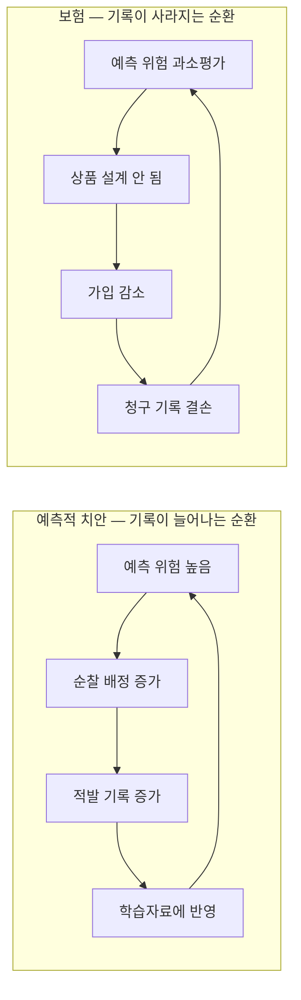

# 11장 공간 위험예측, 관측에서 결정까지

> - 이 장에 나오는 침수심, 우선순위, 편향 지표, 보험료 배수는 모두 `lecture_practice/chapter11/`의 코드를 실제로 실행해 얻은 값
> - 예시를 위해 지어낸 숫자는 없음

## 1. 이 장의 핵심 질문

- 침수 대응, 순찰 배치, 보험료 산정은 모두 같은 질문에서 시작함 — **"어느 위치가 얼마나 위험한가"**
- 세 문제는 입력 자료의 생김새도 비슷하고 쓰는 알고리즘도 겹침. 그런데 같은 절차를 그대로 옮겨 쓸 수 없음

1. **모델이 자료를 정확히 맞히는 것과, 그 자료가 실제 위험을 정확히 담고 있는 것은 같은 말인가**
2. **예측값 하나로 자원을 배분해도 되는가.** 그 예측을 얼마나 믿을지는 무엇으로 아는가
3. **예측이 다음 순찰이나 다음 보험 가입을 바꾸면, 그 예측은 다음번에도 같은 방식으로 맞을 수 있는가**

- 핵심은 다음 한 문장임 — **모델 성능이 좋아 보인다고 해서 그 모델이 실제 위험을 잘 잡아낸다는 뜻은 아님. 자료에 적힌 값과 실제 값이 같은지부터 확인해야 함**
- 중심 사례는 침수 위험이고, 같은 절차를 예측적 치안과 보험 위험모형에 적용해 **어느 단계가 왜 달라지는지**까지 확인함

## 2. 도입 사례: 검증 방식을 바꾸면 성능이 달라진다

- `11-1-flood-risk-priority.log`의 실제 실행 결과부터 봄
- 격자 300개(20×15)에서 표고 하위 25%인 저지대 격자 75개의 평균 침수심은 **25.1cm**, 나머지 225개는 **10.3cm**
- 표고 하나만으로도 두 집단이 두 배 이상 갈림. 다만 표고만으로는 강우와 불투수면이 겹칠 때 침수심이 급증하는 비선형 관계를 놓침

- 같은 자료에서 세 가지 조건으로 성능을 비교하면

| 조건 | 검증 방식 | R² |
| --- | --- | ---: |
| 비공간 피처 | 공간 블록 CV | 0.781 |
| +공간 시차 피처 | 공간 블록 CV | 0.816 |
| +공간 시차 피처 | 랜덤 CV | 0.874 |

- 공간 시차(이웃의 침수심, 상류 흐름의 대리변수)를 추가하면 공간 블록 CV에서 R²가 0.781에서 0.816으로 **+0.034** 올라감
- 같은 피처를 랜덤 CV로 검증하면 R²가 0.874로 더 높게 나오는데, 이 차이(+0.058)는 성능 향상이 아니라 **검증 방식이 인접 지점의 정보를 새어 들어오게 만든 결과**임
- **두 숫자를 나란히 보면 "공간 시차가 정말 도움이 되는 만큼(+0.034)"과 "검증을 잘못 설계해서 부풀려진 만큼(+0.058)"을 구분할 수 있음**

- 어떤 변수가 예측에 크게 기여했는지도 확인함

| 피처 | 중요도 |
| --- | ---: |
| depth_lag(이웃 침수심) | 0.569 |
| elevation(표고) | 0.358 |
| imperv(불투수면) | 0.040 |
| elev_lag(이웃 표고) | 0.013 |
| slope(경사) | 0.011 |
| rainfall(강우) | 0.007 |
| river_dist(하천거리) | 0.001 |

- 이웃 침수심 하나가 전체 기여도의 절반 이상(0.569)을 차지함. 침수는 인접한 저지대로 물이 흘러드는 현상이므로 이웃 값을 아는 것이 예측에 크게 도움이 됨
- **다만 이 값을 실제로 예측 시점에 쓸 수 있는지는 별도로 확인해야 함** — 4.3에서 이 문제(목표값 누수)를 다룸

## 3. 실제 값과 기록된 값을 구분한다

### 3.1 세 값의 구분

- 분석의 첫 작업은 세 값을 구분해 적는 것임
- 실제 위험 또는 피해를 **y**, 자료에 기록된 값을 **yᵒᵇˢ**, 모델이 산출한 예측값을 **ŷ**로 씀
- **모델은 yᵒᵇˢ를 정답으로 학습하지만 의사결정에 필요한 값은 y임**

| 사례 | 실제로 알고 싶은 값 | 관측 라벨 | 주요 결정 |
| --- | --- | --- | --- |
| 침수 | 격자·건물별 침수 여부와 침수심 | 수위계, 현장조사, SAR 침수 관측 | 방재시설·대피 자원 배치 |
| 치안 | 시간·지역별 실제 범죄 발생 | 신고·적발·입건 기록 | 순찰 배치 |
| 보험 | 건물별 실제 피해확률과 기대손실 | 가입자의 청구 여부와 청구액 | 보험료·인수 조건 |

- **침수에서는 y와 yᵒᵇˢ의 거리가 짧음.** 수위계가 없는 곳은 관측되지 않고 SAR는 건물 그림자를 오분류할 수 있지만, 이 오차는 측정오차일 뿐 **관측 행위 자체가 침수를 만들지는 않음**
- **치안과 보험은 거리가 멂.** 순찰을 늘리면 같은 범죄 발생률에서도 적발 기록이 늘고, 보험에 가입하지 않은 건물의 피해는 청구자료에 남지 않음
- 이 거리를 분석 시작 시점에 한 줄로 적어 두면, 나중에 모델을 고르는 기준과 감사 항목이 달라짐. 11·12절이 그 차이를 실측으로 보임

### 3.2 어느 단위로 예측하고 어느 단위로 모을까

- 위험이 발생하는 단위와 정책이 집행되는 단위는 다름. 침수는 유역과 격자에서 발생하지만 복구예산은 행정구역에 배정됨
- **분석 단위를 처음부터 행정구역으로 정하면 구역 내부의 저지대와 고지대가 평균에 섞여 신호가 사라짐**
- 그래서 **현상이 발생하는 단위에서 예측하고, 정책이 집행되는 단위로 집계하는** 두 단계를 둠

ŷₐ = [∑ᵢ∈ₐ ωᵢŷᵢ] / [∑ᵢ∈ₐ ωᵢ]

- 여기서 ωᵢ는 가중치이고, 무엇을 가중치로 쓰느냐에 따라 같은 예측값도 다른 순위표가 됨

| 가중치 ωᵢ | 계산 결과의 뜻 | 적합한 결정 |
| --- | --- | --- |
| 면적(모두 동일) | 구역의 평균 물리 위험 | 방재시설 설계, 토지이용 규제 |
| 인구 | 주민 노출을 반영한 위험 | 대피 계획, 인력 배치 |
| 건물 수 | 피해 대상 건물 기준 위험 | 복구 인력, 응급 지원 |
| 건물가액 | 기대 피해액 기준 위험 | 예산 배분, 보험 손실 추정 |

- 인구가 적은 산업단지는 면적 가중과 건물가액 가중에서 상위로 오르고 인구 가중에서는 하위로 내려감
- 가중치를 밝히지 않은 구역 평균은 "무엇을 평균한 값인지" 알 수 없으므로, 집계 결과를 낼 때 ωᵢ를 표 제목이나 각주에 함께 적음

## 4. 이웃을 정의하고 공간 시차를 만든다

### 4.1 공간가중행렬

- 어떤 위치가 서로 이웃인지 수치로 정의하는 도구가 **공간가중행렬** W = [wᵢⱼ]임
- n개 공간 단위가 있으면 W는 n×n 정방행렬이고, wᵢⱼ는 위치 j가 위치 i에 주는 가중치임. 자기 자신은 이웃으로 세지 않으므로 대각원소 wᵢᵢ는 0

| 방식 | 정의 | 적합한 자료 |
| --- | --- | --- |
| rook 인접 | 변을 맞댄 4칸 | 격자, 정방형 셀 |
| queen 인접 | 모서리를 포함한 8칸 | 격자, 대각으로도 확산하는 현상 |
| 거리 임계 | 반경 d 안의 모든 단위 | 점자료, 관측소망 |
| k-최근접 | 가장 가까운 k개 | 단위 밀도가 고르지 않은 자료 |
| 거리 감쇠 | wᵢⱼ = 1/dᵢⱼ 또는 1/dᵢⱼ² | 영향이 거리에 따라 연속으로 줄어드는 현상 |
| 유향 연결 | 하류 방향 연결 격자만 | 유역, 하천망, 도로망 |

- 유역 분석에서는 방향이 중요함 — **물은 위에서 아래로만 흐르므로** 하류 방향에만 가중치를 주고 반대 방향에는 0을 줌
- 이웃을 정한 뒤에는 **행 표준화**를 적용함(각 행의 합이 1이 되게 나눔)
- 표준화를 안 하면 이웃이 많은 위치일수록 공간 시차 값이 커져서, **주변 조건이 아니라 이웃 개수를 반영하는 변수**가 만들어짐

### 4.2 공간 시차

- 변수 x의 **공간 시차**는 이웃 값의 가중평균임

xᵢˡᵃᵍ = ∑ⱼ wᵢⱼxⱼ

- 실습 코드는 4-이웃 평균으로 이 계산을 함

```python
def spatial_lag(df, col):
    return _neighbor_mean(df["row"].values, df["col"].values, df[col].values)
```

_전체 코드는 lecture_practice/chapter11/code/11-1-flood-risk-priority.py 참고_

- 작은 계산 예 — 중앙 격자의 네 이웃 표고가 12m, 14m, 10m, 8m이면

elevationᵢˡᵃᵍ = 0.25×12 + 0.25×14 + 0.25×10 + 0.25×8 = 11m

- 이 값이 중앙 격자 주변의 지형 수준임
- 중앙 격자의 표고가 9m라면 주변보다 2m 낮은 저지대이고, 15m라면 주변보다 4m 높은 언덕임
- **표고 하나만 입력하면 이 두 경우를 구분할 수 없지만, 공간 시차를 함께 넣으면 상대적 높이를 학습할 수 있음**
- 물이 모이는 위치는 절대 표고가 아니라 주변과의 상대 관계로 정해지므로, 침수 예측에서 이 차이는 실질적임

### 4.3 이 값을 예측 시점에 실제로 쓸 수 있는가

- 공간 시차를 만들 수 있다고 모두 입력변수로 쓸 수 있는 것은 아님
- 판정 기준은 하나임 — **예측을 수행하는 시점에 그 값을 실제로 관측할 수 있는가**

| 피처 | 예측 시점 관측 | 판정 |
| --- | --- | --- |
| 표고, 경사, 하천거리 | 사전 측량 자료로 상시 가용 | 사용 |
| 불투수면 비율 | 최근 토지피복 자료로 가용 | 사용 |
| 강우(예보) | 예보 시점에 가용 | 사용, 실측과 구분해 기록 |
| 강우(사후 누적) | 재난 종료 후에만 확정 | 사전 예측에는 제외 |
| 표고의 공간 시차 | 표고가 상시 가용하므로 계산 가능 | 사용 |
| 이웃의 현재 침수심 | 예측 시점에 관측 불가 | 제외 |
| 이웃의 직전 시점 침수심 | 실시간 수위계망이 있으면 가용 | 조건부 사용 |

- 이웃의 현재 침수심을 입력하면 **목표값 누수**가 생김
- **예측을 하는 이유는 침수심을 모르기 때문인데, 이웃의 침수심은 알고 있다고 가정하는 셈임.** 검증 성능은 높게 나오지만 배치 시점에는 그 값을 받을 곳이 없음

> - **목표값 누수는 오류 메시지 없이 지나감**
> - 코드는 정상 종료하고 성능은 오히려 좋아지며 피처 중요도표에서 그 변수가 1위로 올라옴
> - 2절에서 본 depth_lag의 중요도 0.569도 이 위험을 안고 있는 값 — 실제 배치에서는 실시간 수위계망이 있는 지역에만 조건부로 쓸 수 있음
> - 피처를 만들 때마다 "이 값을 예측 시점에 어디서 받아 오는가"를 한 줄로 적고, 답할 수 없으면 후보에서 뺌

- 공간 흐름을 반영할 대안은 세 가지임
1. **이전 시점의 관측 침수심**을 입력함. 실시간 수위계망이 있는 지역의 단기 예측에 적합
2. **물리적 상류 기여량**을 입력함. 표고에서 유향을 계산해 상류 집수면적과 강우량으로 유입량 대리변수를 만듦. 지형과 강우만 쓰므로 사전 위험지도 작성에 적합
3. **공간자기회귀모형**을 씀. 동시적 공간 시차를 모형 안에 두되 내생성을 처리함. 예측보다 공간 파급효과의 크기를 추정하는 것이 목적일 때 씀

## 5. 실습 안내

- 실습 코드
  - `lecture_practice/chapter11/code/11-0-simdata-prep.py` — 침수·치안·보험 세 자료를 한 번에 준비
  - `lecture_practice/chapter11/code/11-1-flood-risk-priority.py` — 침수위험 예측과 대응 우선순위
  - `lecture_practice/chapter11/code/11-2-predictive-policing-bias.py` — 예측적 치안의 되먹임 시뮬레이션
  - `lecture_practice/chapter11/code/11-3-insurance-risk-grading.py` — 보험 위험등급과 보험료 차등
- 결과 로그: `lecture_practice/chapter11/results/*.log`

- 이 장의 실습은 GPU가 필요 없음. 격자 300개(침수), 256개(치안), 건물 500채(보험) 규모라 노트북에서도 몇 초 안에 끝남
- **세 자료는 모두 시뮬레이션 자료이며 실제 지역이나 실제 시장의 값이 아님.** 본문에서 다루는 숫자는 이 시뮬레이션 설계값이 만든 결과일 뿐, 실제 침수 확률이나 실제 보험 시장 통계로 읽으면 안 됨

## 6. 예측 모델을 고른다

### 6.1 세 계열의 방법

- 침수 위험은 하나의 모델로만 분석하지 않음. 세 계열이 서로 다른 질문과 자료 조건에 대응함

| 방법 | 계산 대상 | 주요 한계 | 적합한 상황 |
| --- | --- | --- | --- |
| 수문·수리모형 | 강우–유출–수위–범람 과정 | 지형·관망·경계조건 자료와 계산비용이 큼 | 설계홍수와 방재시설 검토 |
| 공간통계모형 | 공변량 효과와 잔차의 공간 의존성 | 복잡한 비선형과 고차원 상호작용에 제약 | 위험요인 추론과 설명 |
| 트리 기반 ML | 입력변수와 피해 사이의 비선형 함수 | 외삽과 인과 해석에 취약 | 충분한 관측 라벨이 있는 예측 |

- **물리모형을 쓸 수 있는 상황에서 머신러닝이 이를 자동으로 대체하지는 못함.** 머신러닝은 물리모형의 계산비용을 줄이는 대리모형이거나, 관측자료의 반복 패턴을 학습하는 예측모형으로 씀
- "불투수면이 10% 늘면 침수심이 얼마나 늘어나는가"처럼 원인별 계수가 필요하면 공간회귀나 가법모형이 더 적합함
- **트리 기반 모델의 피처 중요도는 예측 기여도이지 인과효과의 크기가 아님**
- 이 장의 실습은 트리 기반 그래디언트 부스팅 회귀를 씀. 침수심은 저지대와 고강우가 겹칠 때 급증하는 상호작용 구조이고, 격자 300개 규모의 표 형태 자료에서 트리 앙상블이 별도 특성공학 없이 이 상호작용을 학습하기 때문임

### 6.2 선형 기준모형부터 세운다

- 복잡한 모델을 쓰기 전에 해석 가능한 기준모형을 둠. **기준모형은 복잡한 모형의 성능이 실제로 그 선을 넘는지 판정하는 잣대가 됨**

yᵢ = β₀ + β₁·elevationᵢ + β₂·slopeᵢ + β₃·riverdistᵢ + β₄·imperviousᵢ + β₅·rainfallᵢ + εᵢ

- 이 식은 각 변수가 침수심에 독립적으로 더해진다고 가정함. **실제 침수는 이렇게 작동하지 않음**
- 강우가 적으면 저지대여도 물이 고이지 않고, 강우가 많아도 투수면이 충분하면 일부가 흡수됨. 저지대이면서 불투수면 비율이 높고 강우가 집중될 때 침수심이 급증함
- 선형모형에서 이 구조를 표현하려면 곱셈항을 직접 넣어야 함

yᵢ = … + β₆(rainfallᵢ × imperviousᵢ) + β₇(rainfallᵢ × lowlandᵢ) + εᵢ

- **변수를 두 개만 곱해도 항이 늘어남** — 후보 변수가 일곱이면 2차 상호작용만 21개임
- 어느 조합이 실제로 필요한지 사전에 알기 어렵다는 점이 선형모형의 한계이고, 트리 앙상블을 쓰는 실질적 이유가 여기에 있음

### 6.3 그래디언트 부스팅이 작동하는 순서

- **그래디언트 부스팅**은 작은 회귀나무를 순차적으로 더해 예측함수를 만듦(Friedman, 2001)
- 하나의 큰 나무를 키우는 대신, 얕은 나무 수백 개가 각각 앞 단계의 오차를 조금씩 줄임

1. **초기 예측을 정함** — 전체 관측값의 평균을 첫 예측으로 둠
2. **잔차를 계산함** — 각 격자에서 실제값과 현재 예측의 차를 구함. 저지대 격자에서는 이 값이 양수로 크고 고지대에서는 음수임
3. **잔차를 예측하는 나무를 적합함** — 원래 목표값이 아니라 잔차를 목표로 회귀나무를 학습함. **"현재 모형이 어느 조건에서 얼마나 틀리는가"를 학습하는 셈**
4. **학습률을 곱해 더함** — 새 나무의 예측에 학습률 η를 곱해 기존 예측에 더함. η가 0.05면 나무 하나가 잔차의 5%만 메움
5. **2단계로 돌아감** — 나무 수 M에 도달할 때까지 반복함

```python
m = GradientBoostingRegressor(random_state=42, n_estimators=200,
                              max_depth=3, learning_rate=0.05)
m.fit(X[tr], y[tr])
```

_전체 코드는 lecture_practice/chapter11/code/11-1-flood-risk-priority.py 참고_

| 장치 | 작동 방식 | 설정 기준 |
| --- | --- | --- |
| 낮은 학습률 | 나무 하나의 기여를 줄여 점진적으로 학습 | 0.01~0.1, 낮출수록 나무 수를 늘림 |
| 나무 수 제한 | 반복 횟수 상한 | 검증 성능이 개선을 멈추는 지점 |
| 깊이 제한 | 상호작용 차수 상한 | 도메인에서 예상되는 조건 결합 수 |

- 나무 깊이가 1이면 변수 하나만 보고 분기하므로 상호작용을 표현하지 못함
- 깊이가 3이면 **"표고가 낮고, 불투수면이 높고, 강우가 많은" 3중 조건**까지 하나의 잎에 담을 수 있음. 이 장의 실습은 나무 200개, 최대 깊이 3, 학습률 0.05를 씀

> - **하이퍼파라미터는 시험자료 성능을 보고 고르지 않음**
> - 시험자료를 반복해서 들여다보며 설정을 조정하면 그 자료는 더 이상 독립적인 시험대상이 아님
> - 학습자료 안에서 내부 검증 분할을 만들어 정하고, 시험자료는 최종 한 번만 씀

## 7. 공간을 나눠 검증한다

### 7.1 무작위로 나누면 안 되는 이유

- 공간자료에서는 가까운 관측치끼리 값이 비슷함. **무작위로 행을 나누면 검증지점 바로 옆의 관측치가 학습자료에 들어감**
- 이 방식으로는 새로운 지역으로 일반화하는 능력이 아니라 **인접값을 보간하는 능력**을 잼
- 2절에서 확인한 랜덤 CV의 R² 0.874가 공간 블록 CV의 R² 0.816보다 높았던 이유가 이것임

| 검증 설계 | 분할 방법 | 평가하는 상황 | 주의점 |
| --- | --- | --- | --- |
| 무작위 CV | 관측행을 무작위 분할 | 동일 분포의 비공간 표본 | 공간자료에서는 인접 누수 가능 |
| 블록 CV | 좌표를 공간 블록으로 분할 | 인접하지 않은 블록 예측 | 블록 크기·방향에 민감 |
| 버퍼 CV | 검증지 주변 학습표본 제거 | 가까운 이웃 없이 예측 | 표본 수가 감소 |
| 유역·지역외 CV | 유역·행정구역 전체 제외 | 학습하지 않은 지역으로 이전 | 지역 수가 적으면 분산 증가 |

- **검증 설계는 모형이 실제로 놓일 상황에 맞춤.** 같은 도시 안에서 관측이 없는 격자를 메우는 용도라면 블록 CV, 학습한 적 없는 다른 시군에 모형을 이전할 계획이라면 지역외 CV가 그 상황에 대응함

```python
def spatial_block_folds(df, n_blocks=5):
    block = (df["col"].values / (GRID_COLS / n_blocks)).astype(int)
    block = np.clip(block, 0, n_blocks - 1)
    for b in range(n_blocks):
        test = block == b
        yield ~test, test
```

_전체 코드는 lecture_practice/chapter11/code/11-1-flood-risk-priority.py 참고_

- 실습은 열 방향으로 도시를 다섯 블록으로 나눔. 이 설계로는 동서 방향 일반화를 평가할 수 있지만, 남북 방향으로 나누면 어떻게 되는지는 이 설계만으로 알 수 없음
- 블록 크기의 기준은 **공간 자기상관이 사라지는 거리**(range)임 — 블록 한 변을 이보다 크게 잡아야 학습 블록과 검증 블록 사이의 상관이 실질적으로 끊어짐

### 7.2 성능을 세 지표로 읽는다

R² = 1 − [∑ᵢ(yᵢ − ŷᵢ)²] / [∑ᵢ(yᵢ − ȳ)²]

- R² = 0이면 검증자료의 평균을 예측하는 것과 같은 수준이고, 음수이면 평균 예측보다도 나쁨
- R²로는 오차의 실제 크기를 cm 단위로 알 수 없으므로 평균절대오차(MAE)를 함께 봄

MAE = (1 / n) × ∑ᵢ|yᵢ − ŷᵢ|

- 두 지표는 오차를 다르게 셈 — R²는 제곱을 쓰므로 큰 오차 하나가 지표를 크게 끌어내리고, MAE는 모든 오차를 같은 비중으로 더함
- **정책 임계값이 정해져 있다면 세 번째 지표가 필요함.** 침수심 30cm가 통행 제한 기준이라면, 실제 32cm를 28cm로 예측한 오차와 실제 12cm를 8cm로 예측한 오차는 크기가 같아도(4cm) 결정에 미치는 영향이 다름. 앞의 오차는 통행 제한 여부를 뒤집고 뒤의 오차는 아무 결정도 바꾸지 않음

### 7.3 잔차가 어디에 몰려 있는지 본다

- 성능지표로는 오차의 크기만 알 수 있고 **오차가 어디에 몰려 있는지는 알 수 없음**
- 예측 후에는 잔차 eᵢ = yᵢ − ŷᵢ를 지도에 표시하고, 뭉침 정도를 Moran I로 수치화함(Moran, 1950)

I = (n / 전체 공간가중치) × (공간 잔차곱 / 잔차제곱합)

- 공간 잔차곱은 이웃한 두 격자의 잔차 편차를 곱해 더한 값임. 두 격자가 모두 과소예측(양의 잔차)이면 곱이 양수가 되고, 한쪽은 과소·다른 쪽은 과대이면 음수가 됨
- I가 유의하게 양수로 나오면 다음 순서로 대응함

1. 잔차지도에서 뭉친 위치를 확인하고 그 지역의 공통 조건을 찾음
2. 그 조건이 배수관망, 토양, 하천 단면처럼 자료로 확보 가능한 요인인지 검토함
3. 확보 가능하면 피처로 추가하고, 불가능하면 공간효과를 명시적으로 모형에 넣는 공간통계모형을 검토함
4. 어느 쪽도 어려우면 해당 지역을 예측 신뢰도가 낮은 구역으로 표시해 결과에 함께 보고함

- 최종 성능표에는 공간 CV의 R², MAE, 임계값 오분류율, 잔차 Moran I를 함께 둠. **네 값이 모두 있어야 "오차가 얼마나 크고, 어느 결정을 뒤집으며, 어디에 몰려 있는가"에 답할 수 있음**

## 8. 예측에 불확실성을 붙인다

### 8.1 정규화 conformal 예측구간

- 점예측 ŷᵢ = 30cm만으로는 모델이 얼마나 틀릴 수 있는지 알 수 없음
- **정규화 conformal 예측**은 분포 가정 없이 예측구간을 만들되, 위치마다 오차 규모가 다를 수 있다는 점을 반영함(Lei et al., 2018; Romano et al., 2019)

1. **학습에 쓰지 않은 보정자료에서 절대잔차**를 계산함 — rᵢ = |yᵢ − ŷᵢ|
2. **입력조건에서 예상되는 오차 규모** σ̂(xᵢ)를 추정함 — 절대잔차를 목표값으로 두고 같은 입력변수로 회귀모형을 하나 더 적합함
3. **절대잔차를 σ̂로 나눈 정규화 부적합 점수**를 만듦 — sᵢ = |yᵢ − ŷᵢ| / σ̂(xᵢ)
4. **보정자료에서 sᵢ의 (1 − α) 분위수**를 구함 — 예측구간은 [ŷ(x) − q(1−α)σ̂(x), ŷ(x) + q(1−α)σ̂(x)]

- 예측 침수심이 30cm, σ̂(x) = 4, q(0.9) = 1.5라면 구간 반폭은 4 × 1.5 = 6cm이고 90% 예측구간은 24–36cm임
- 같은 모형에서 σ̂(x) = 12인 격자라면 반폭이 18cm로 늘어 12–48cm가 됨. **두 격자의 점예측은 같아도 결정에 쓸 수 있는 정보량이 다름**

| 지표 | 값 |
| --- | --- |
| 90% 예측구간 경험적 포함률(OOF) | 0.903(목표 0.90) |
| 구간 반폭 중앙값 | 3.1cm |
| 구간 반폭 범위 | [1.3cm, 18.7cm] |

- 목표 포함률 0.90에 실제 0.903으로 거의 맞아떨어짐
- 다만 **반폭의 범위가 1.3cm에서 18.7cm까지 벌어져 있음** — 어떤 격자는 예측을 꽤 믿을 수 있고 어떤 격자는 그렇지 않다는 뜻임

> - **σ̂를 같은 OOF 잔차로 적합했으므로 이 포함률은 다소 낙관적임**
> - 엄밀한 실무는 학습·보정·시험을 세 부분으로 나누는 split conformal을 씀
> - 자료가 적어 3분할이 어려우면 교차적합 conformal을 쓰고, 그 사실과 함께 포함률을 보고함

### 8.2 적용가능영역

- 예측구간은 **모델이 학습한 범위 안에서 생기는 오차**를 다룸. 새 지점의 입력조건이 학습자료와 크게 다르면 예측구간 자체를 신뢰하기 어려움
- **적용가능영역**(AoA)은 이 외삽 문제를 표시함(Meyer & Pebesma, 2021)

DI(x) = 새 지점 x와 가장 가까운 학습지점의 가중거리 / 학습자료 내부의 평균거리

- 분자는 새 지점이 학습자료에서 떨어진 거리, 분모는 학습자료 자체가 퍼진 정도임
- DI가 1이면 새 지점이 학습표본들 사이의 평균 간격만큼 떨어져 있다는 뜻이고, **값이 커질수록 학습자료가 다루지 않은 조건**임
- 실습 결과 DI 임계값(Q3+1.5·IQR) = **0.24**, 적용가능영역 밖 격자 = **9개**
- **AoA 판정은 예측값을 지우는 데 쓰지 않고 별도 열로 남김** — 적용범위 밖 격자에도 예측값은 나오지만, 그 값을 근거로 자원을 확정 배분하지 않고 추가 관측 대상으로 분류함

### 8.3 불확실성을 반영한 우선순위표

| admin | mean_pred_depth | mean_pi_half | low_conf_cells | aoa_out_cells | priority_rank | confidence |
| --- | ---: | ---: | ---: | ---: | ---: | --- |
| 2 | 23.49 | 5.46 | 32 | 1 | 1 | 낮음 |
| 3 | 22.25 | 3.79 | 12 | 2 | 2 | 중간 |
| 4 | 11.16 | 3.27 | 15 | 1 | 3 | 높음 |
| 1 | 10.87 | 4.12 | 18 | 2 | 4 | 낮음 |
| 5 | 8.19 | 2.96 | 8 | 1 | 5 | 높음 |
| 0 | 8.00 | 3.27 | 15 | 2 | 6 | 높음 |

- 이 표를 읽는 순서 — **예측값이 가장 높은 admin 2가 순위 1위인데 신뢰등급은 '낮음'임**
- 예측 침수심이 높다고 곧바로 우선 집행하지 않고, 신뢰가 낮은 곳은 확정 배분 전에 추가 관측이나 현장확인으로 보완함
- 이 판단 기준을 10절의 조치 매트릭스에서 표로 정리함

## 9. 결과를 표로 만들고 읽는다

### 9.1 격자 단위 예측표

- 앞 단계들을 거치면 격자마다 예측값, 예측구간, 적용가능영역 판정이 붙음
- **입력변수 열을 함께 남기는 이유는 현장 확인 때문임** — 상위 순위 격자를 실무자가 검토할 때 "표고 1.8m, 불투수면 0.64, 강우 102mm"라는 조건을 함께 보면 예측이 지형 조건과 맞는지 즉시 판단할 수 있음. 예측값만 있는 표는 검토가 불가능함

| cell | row | col | elevation | imperv | rainfall | pred_depth | priority_rank |
| ---: | ---: | ---: | ---: | ---: | ---: | ---: | ---: |
| 142 | 9 | 7 | 1.77 | 0.64 | 101.84 | 34.52 | 1 |
| 277 | 18 | 7 | 2.72 | 0.75 | 126.23 | 34.18 | 2 |
| 202 | 13 | 7 | 3.08 | 0.51 | 120.76 | 31.91 | 3 |
| 187 | 12 | 7 | 0.00 | 0.65 | 114.38 | 31.90 | 4 |
| 127 | 8 | 7 | 6.18 | 0.81 | 114.14 | 31.30 | 5 |

- 상위 5개의 예측값이 34.52~31.30cm로 촘촘히 몰려 있음
- **이 정도 촘촘한 순위는 모델의 오차 범위 안에 있을 수 있으므로**, 1위와 5위를 엄밀히 구분하지 않고 상위 그룹으로 묶어 처리하는 편이 안전함

### 9.2 행정구역 집계표

- 격자 예측표를 3.2의 가중치로 행정구역에 모음. 집계표에는 예측값 평균 외에 두 종류의 열을 더함

| 열 | 계산 | 해석 |
| --- | --- | --- |
| mean_pred | 구역 내 격자 예측값의 가중평균 | 구역 전체의 위험 수준 |
| high_risk_cells | 예측값이 전체 상위 25%인 격자 수 | 구역 안의 집중도 |
| low_conf_cells | 신뢰등급 낮음 격자 수 | 추가 관측 필요 규모 |
| aoa_out_cells | 적용범위 밖 격자 수 | 외삽 구간의 규모 |

- **평균만 보면 구역 안의 편차가 사라짐** — 예측 침수심이 상위 25%인 격자가 그 구역에 몇 개 있는지를 함께 실어야, 평균이 같은 두 구역이라도 고위험 격자가 많은 구역과 적은 구역을 구분할 수 있음

### 9.3 결과를 읽는 네 가지 순서

**첫째, 단순 기준과 비교함.** 모델을 쓰지 않고 표고만으로 저지대를 고르면 어떤 결과가 나오는지 먼저 계산함. 2절에서 확인했듯 저지대 75개 격자의 평균 침수심은 25.1cm, 나머지는 10.3cm임. 모델의 기여는 이 기준선을 넘는 부분에서 나오므로, 기준선 자체를 먼저 수치로 확보함

**둘째, 순위의 안정성을 봄.** 9.1에서 확인한 상위 5개 격자의 예측값(34.52~31.30cm)처럼 촘촘하면 1위와 5위의 차이는 모델의 오차 범위 안에 있을 수 있음. 이때는 순위를 그대로 배분 순서로 쓰지 않고 상위 그룹으로 묶어 처리함

**셋째, 임계값 주변을 확인함.** 정책 기준이 30cm라면 예측값이 28~32cm인 격자를 따로 뽑음. 이 격자들은 예측이 조금만 틀려도 조치 대상 여부가 바뀜. 예측구간이 임계값을 걸치는 격자는 현장 확인 대상으로 분류함

**넷째, 예상과 다른 결과를 그대로 기록함.** 고지대인데 상위 순위에 오른 격자가 있다면 불투수면 비율이나 국지 강우가 원인일 수 있음. 원인을 확인해 설명 가능하면 결과를 유지하고, 설명할 수 없으면 자료 오류를 의심해 입력값을 검토함. 결과를 알고 난 뒤 예상을 수정하거나 사후 해석을 덧붙이지 않고 불일치를 그대로 보고함

## 10. 결정 규칙과 감사

### 10.1 조치 매트릭스

- 예측값, 구간 폭, 적용범위 판정은 서로 다른 질문에 대응함 — 예측값은 위험 수준, 구간 폭은 예상 오차의 크기, 적용범위 판정은 그 예측을 신뢰할 근거의 유무임

| 예측 위험 | 구간 폭 | AoA | 조치 |
| --------- | ------- | --- | ------------------------------------- |
| 높음 | 좁음 | 안 | 우선 집행 후보로 확정 |
| 높음 | 넓음 | 안 | 순위는 유지하고 현장확인 후 확정 |
| 높음 | 무관 | 밖 | 추가 관측과 정밀 조사 우선 |
| 낮음 | 넓음 | 안 | 표본 확인 후 낮은 순위 유지 여부 판정 |
| 낮음 | 좁음 | 안 | 일반 모니터링 |

- **8.3에서 본 admin 2가 여기 해당함** — 예측 위험은 1순위이지만 신뢰등급이 '낮음'이므로 둘째 줄에 해당하는 조치(순위 유지 + 현장확인 후 확정)로 다뤄야 함
- "높음"과 "낮음"의 경계는 정책 임계값이 있으면 그 값을 우선하고, "좁음"과 "넓음"의 경계는 구간 반폭의 3분위를 쓰되 절대 기준(예: 5cm 이상은 무조건 넓음)을 함께 두면 해석이 안정됨
- **예측 위험이 높아도 적용범위 밖이면 집행을 미룸.** 이때 자원을 배분하지 않는 것이 아니라 **배분할 자원의 종류를 바꿈** — 시설 공사 예산이 아니라 관측 장비와 현장 조사 인력을 먼저 보냄

### 10.2 감사 항목

- 배치 후에는 예측 성능만 감시하지 않음. **예측이 만든 자원 배분이 실제 필요와 어긋나는지, 특정 지역이나 집단에 치우치는지를 함께 봄**

| 범주 | 지표 | 확인 주기 |
| --- | --- | --- |
| 예측 성능 | 공간 CV R², MAE, 임계값 오분류율 | 자료 갱신 시 |
| 공간 진단 | 잔차 Moran I, 잔차지도 | 자료 갱신 시 |
| 적용범위 | 적용범위 밖 단위 수와 위치 변화 | 자료 갱신 시 |
| 배분 결과 | 지역별 자원 투입량, 집중도(Gini) | 분기 |
| 집단 형평 | 집단별 예측오차, 차별적 영향 | 분기 |
| 되먹임 | 배분이 다음 관측에 미치는 영향 | 반기 |

- **마지막 행이 이 장의 나머지를 정함** — 예측 결과로 자원을 배분하고 그 배분이 다음 시점의 관측자료를 바꾸면, 모형이 자기 결정의 흔적을 학습함
- **침수 예측에서는 이 문제가 약함.** 펌프를 배치해도 그 지역의 강우와 지형은 변하지 않음
- **치안과 보험에서는 이 되먹임이 분석의 중심 문제가 됨** — 11·12절에서 두 사례를 봄

## 11. 예측이 다음 관측을 바꿀 때 ① 예측적 치안

- 예측적 치안은 **관측 행위가 라벨을 바꾸는** 대표 사례임
- 국내 경찰청은 범죄·신고·환경자료로 위험을 예측해 순찰을 지원하는 Pre-CAS를 2021년 전국으로 확대함(경찰청, 2021). 과거 체포기록과 예측 순찰이 특정 지역을 반복 표적화할 수 있다는 문제는 Lum과 Isaac(2016)이 오클랜드 사례와 시뮬레이션으로 제시함

- 지역 i, 시점 t의 실제 범죄를 Cᵢₜ, 순찰량을 Pᵢₜ, 기록된 범죄를 Rᵢₜ로 씀

Rᵢₜ ∼ Detection(Cᵢₜ, Pᵢₜ)

- 같은 Cᵢₜ에서도 Pᵢₜ가 늘면 적발 가능성이 커져 Rᵢₜ가 늘어남
- 모델이 Rᵢₜ를 예측하고 그 값에 비례해 다음 순찰을 배정하면

Pᵢ,ₜ₊₁ ∝ R̂ᵢₜ

- **두 식을 연결하면 순찰이 기록을 늘리고, 늘어난 기록이 다음 순찰을 늘리는 순환이 만들어짐**

- 이 순환의 결과를 확인하는 시뮬레이션 — 16×16 격자 256개에서 8라운드 반복
- **두 집단의 실제 범죄율은 평균 8.4건(A)과 8.5건(B)으로 거의 같게 설정하고, 초기 기록만 집단 A 지역에서 크게 만듦**

1. 누적 기록 Rᵢₜ로 위험모형을 학습함
2. 예측값에 비례해 순찰 Pᵢ,ₜ₊₁을 배정함
3. 순찰량에 따라 적발확률을 바꾸고 새 기록을 만듦
4. 새 기록을 다음 라운드 학습자료에 추가함

| 라운드 | 기록 기준 R² | 순찰–실제 위험 상관 | 순찰 Gini | 차별적 영향 |
| -----: | -----------: | ------------------: | --------: | ----------: |
| 0 | 0.823 | 0.397 | 0.247 | 1.370 |
| 1 | 0.924 | 0.537 | 0.436 | 1.574 |
| 2 | 0.972 | 0.530 | 0.639 | 1.793 |
| 3 | 0.988 | 0.511 | 0.753 | 1.893 |
| 4 | 0.994 | 0.493 | 0.825 | 1.943 |
| 5 | 0.998 | 0.467 | 0.875 | 1.971 |
| 6 | 0.998 | 0.447 | 0.896 | 1.990 |
| 7 | 0.999 | 0.429 | 0.917 | 2.001 |

- **네 열이 서로 다른 방향으로 움직임**
- 기록 기준 R²는 0.823에서 0.999로 올라감 — **성능표만 보면 모형이 계속 좋아진 것으로 읽힘**
- 그러나 순찰과 실제 위험의 상관은 1라운드의 0.537에서 시작해 마지막에 0.429로 떨어짐
- 순찰 Gini는 0.247에서 0.917로 올라 순찰이 소수 지역에 집중되고, 차별적 영향은 1.370에서 2.001로 커짐
- **마지막 라운드에서 집단 A는 실제 위험 비중의 두 배에 해당하는 순찰을 받음.** 실제 범죄율은 두 집단이 8.4 대 8.5로 거의 같았는데도 그러함
- 성능지표 하나로 모형을 판정하면 안 되는 이유가 이 표에 그대로 담겨 있음. 10.2의 감사표에서 배분 결과와 집단 형평을 별도 범주로 둔 근거이기도 함

- 되먹임을 끊는 완화 장치

| 장치 | 바꾸는 계산 단계 | 확인할 지표 |
| --- | --- | --- |
| 단속 노출 보정 | 기록을 순찰량으로 정규화 | 순찰–독립 위험자료 상관 |
| 독립 피해조사 | 순찰과 무관한 라벨 추가 | 기록자료와 독립자료의 격차 |
| 탐색 순찰 | 일부 순찰을 예측값과 무관하게 배정 | Gini와 미관측지역 정보량 |
| 집중 상한 | 지역별 최대 순찰량 제한 | 집단별 차별적 영향 |

- **기록을 순찰량으로 나누는 보정만으로는 편향이 모두 사라지지 않음** — 신고 가능성과 범죄 유형별 적발 가능성도 지역과 집단에 따라 다르기 때문임
- 독립 피해조사나 표본조사처럼 순찰과 관측 과정이 다른 자료를 함께 쓰는 편이 확실함

_전체 코드는 lecture_practice/chapter11/code/11-2-predictive-policing-bias.py 참고_

## 12. 예측이 다음 관측을 바꿀 때 ② 보험

### 12.1 가입이 라벨을 지우는 구조

- 보험은 **표본 선택이 라벨을 지우는** 사례임
- 건물 i의 실제 피해확률을 Yᵢᵗʳᵘᵉ, 보험 가입 여부를 Sᵢ, 피해를 청구하는 과정을 Qᵢ로 씀

Yᵢᵒᵇˢ = Yᵢᵗʳᵘᵉ × Sᵢ × Qᵢ

- Sᵢ = 0이면 실제 피해가 있어도 보험자료에는 라벨이 없음
- Sᵢ = 1이어도 자기부담금보다 작은 피해를 청구하지 않으면 Qᵢ = 0이 되어 관측값이 0으로 남음
- **두 경로 모두 실제 피해가 있는 건물을 "피해 없음"으로 기록함**

- 실습 데이터 — 300개 격자에 건물 500채, 가입률 55.4%, 저소득 비율 28.4%
- 저소득 가입률 42.3%, 고소득 가입률 60.6%. 소액 피해 미신고(가입자 중) 21건(저소득 가입자의 35.0%)
- 이 값은 교육용 시뮬레이션의 설계값이며 실제 보험시장의 추정치가 아님

### 12.2 성능 차이의 원인을 대조군으로 분리한다

- 가입자 모형과 전체 모형의 성능 차이에는 **세 요인이 동시에 들어감**
  1. 가입 여부가 위험과 관련된 선택편향
  2. 학습표본이 500채에서 277채로 줄어든 표본 크기 효과
  3. 실제 피해 대신 청구기록을 쓰는 라벨 왜곡

| 조건 | 표본 | 라벨 | 분리하려는 요인 |
| --- | --- | --- | --- |
| A | 전체 500채 | 실제 피해확률 | 기준 |
| B | 가입자 277채 | 청구기록 | 선택+표본감소+라벨왜곡 |
| C | 무작위 277채 | 청구기록 | 표본감소+라벨왜곡 |

- **B와 C의 차이가 가입 선택 고유의 몫이고, C와 A의 차이는 표본 감소와 라벨 왜곡의 합**임
- C는 무작위 추출이므로 20회 반복해 평균과 표준편차를 함께 냄
- 세 조건의 성능을 같은 채점 대상(전체 500채의 실제 피해확률)으로 비교하면

| 지표 | 완전 모형(A) | 관측 모형(B) | 무작위 동일크기 대조군(C) |
| --- | --: | --: | --: |
| 전체 R² | 0.890 | 0.669 | 0.658(SD 0.030, 20회) |
| 저소득 건물 R² | 0.888 | 0.588 | — |
| 위험 과소평가 비율 | 2.0% | 19.2% | — |

- 관측 모형 0.669와 대조군 0.658의 차이는 **0.011** — 가입 선택만 제거해도 성능이 거의 회복되지 않는다는 뜻임
- 완전 모형 0.890과 대조군 0.658의 차이는 **0.231**로 훨씬 큼 — 이 몫은 표본 감소와 라벨 왜곡에서 옴
- **두 몫을 섞어 "가입자 편중 때문에 성능이 나빠졌다"고 읽으면 틀림**

> - **모형 비교에서는 시험대상을 같게 맞춤**
> - 완전 모형은 교차검증 예측으로 평가하고 관측 모형은 가입자료로 적합한 뒤 전체에 적용하면, 관측 모형의 학습표본 일부가 평가자료에 포함됨
> - 조건을 바꿀 때는 학습자료만 바꾸고 시험자료는 고정함

### 12.3 소득변수를 넣지 않아도 생기는 격차

- 예측값을 4등급으로 나누고 등급별 보험료 배수를 정함. **등급표에는 위험 지표뿐 아니라 집단 구성 비율을 함께 실음**

| 등급 | 등급명 | 건물 수 | 평균 예측 침수확률 | 보험료 배수 | 저소득 비율 | 미가입 비율 |
| ---: | --- | ---: | ---: | ---: | ---: | ---: |
| 1 | 최고위험 | 125 | 0.404 | 3.0배 | 44.8% | 54.4% |
| 2 | 고위험 | 125 | 0.222 | 2.0배 | 26.4% | 40.8% |
| 3 | 중위험 | 125 | 0.145 | 1.5배 | 13.6% | 48.0% |
| 4 | 저위험 | 125 | 0.073 | 1.0배 | 28.8% | 35.2% |

- 최고위험 등급의 저소득 비율 44.8%는 저위험 등급의 28.8%보다 높음
- **소득변수를 모델에 넣지 않아도 이런 격차가 생김** — 표고, 하천거리, 주택유형이 소득분포와 연관되면 소득을 직접 쓰지 않은 모형에서도 집단별 가격 격차가 생길 수 있음(Prince & Schwarcz, 2020)
- 그래서 입력변수 목록만 검사하지 않고 **최종 오차와 가격의 집단별 분포를 감사함**
- 오차의 방향도 봄 — 관측 모형과 완전 모형의 등급이 어긋난 건물은 전체의 38.0%인데, 저소득 건물에서는 과소평가 26건, 과대평가 17건으로 **실제보다 덜 위험하다고 판정한 경우가 많음.** 위험을 낮게 본 건물은 보험료가 싸지지만 재난 시 보장이 부족해짐

### 12.4 자료 공백이 자료 공백을 키운다

- 보험료는 위험등급과 불확실성 로딩을 분리해 계산함 — 위험배수는 기대손실 수준에 대응하고, 불확실성 로딩은 예측오차가 큰 경우의 안전마진임
- **두 값을 모두 예측 위험의 함수로 정하면 위험과 불확실성을 중복 반영하므로**, 불확실성은 별도 자료의 잔차에서 추정함
- 이 분리가 정당한지는 실측으로 확인함 — **구간 폭과 예측값의 순위상관은 0.236**임. 1.0에 가까우면 "위험이 높은 건물이 곧 불확실한 건물"이 되어 로딩이 위험배수와 중복되지만, 0.236은 두 값이 상당 부분 독립이라는 뜻이므로 로딩을 별도로 계산할 근거가 됨

- 마지막으로 확인할 되먹임 — **진짜 고위험 건물 125채 가운데 70채, 즉 56.0%를 미가입으로 설정함**
- 이 건물들은 관측 모형의 학습자료에 들어가지 않으므로 그 지역의 위험이 과소평가됨
- **과소평가된 지역에는 상품이 설계되지 않고, 상품이 없으면 가입이 늘지 않으며, 가입이 없으면 기록이 계속 부족함**
- 11절의 순찰–기록 순환과 같은 구조임 — 위험 기반 가격이 특정 저소득 지역에 집중되면 보험 접근성이 낮아지고, 접근성 저하가 다시 자료 공백을 키움

- 두 순환을 나란히 놓으면 같은 구조가 드러남



**그림 11.1** 관측이 예측을 바꾸고 예측이 다시 관측을 바꾸는 두 순환. **방향이 반대라는 점이 대응의 차이를 만듦** — 왼쪽은 기록이 과잉 생성되어 특정 지역이 계속 표적이 되고, 오른쪽은 기록이 결손되어 특정 지역이 계속 저평가됨. 침수(3.1)에서는 펌프를 배치해도 강우와 지형이 변하지 않으므로 이 순환이 생기지 않음

_전체 코드는 lecture_practice/chapter11/code/11-3-insurance-risk-grading.py 참고_

## 13. 핵심 요약

- **모델이 자료를 잘 맞히는 것과 실제 위험을 잘 잡는 것은 다름.** 침수는 y와 yᵒᵇˢ의 거리가 짧지만 치안·보험은 관측 행위가 라벨을 바꿔 거리가 멂 (3.1)
- **가중치를 밝히지 않은 구역 평균은 무엇을 평균한 값인지 알 수 없음.** 인구가 적은 산업단지는 면적 가중에서 상위, 인구 가중에서 하위로 감 (3.2)
- **공간가중행렬은 행 표준화를 함.** 안 하면 주변 조건이 아니라 이웃 개수를 반영하는 변수가 됨 (4.1)
- **목표값 누수는 오류 메시지 없이 성능만 올림.** 이웃의 현재 침수심을 넣으면 검증 점수가 오르고 중요도 1위가 되지만 배치 시점에는 그 값을 받을 곳이 없음 (4.3)
- **무작위 분할은 새 지역 일반화가 아니라 인접값 보간 능력을 잼.** 실습에서 랜덤 CV 0.874와 블록 CV 0.816의 차이 +0.058이 그 누수의 크기임 (2절, 7.1)
- **성능지표는 오차의 크기만 알려주고 오차가 어디에 몰렸는지는 알려주지 않음.** 잔차 Moran I를 함께 봄 (7.3)
- **예측구간은 학습 범위 안의 오차를 다루고, 적용가능영역은 그 범위 밖을 표시함.** AoA 판정은 예측값을 지우지 않고 별도 열로 남김 (8.1, 8.2)
- **예측 1순위가 저신뢰일 수 있음.** 실습의 admin 2가 그 경우이며, 조치는 즉시 집행이 아니라 현장확인 후 확정임 (8.3, 10.1)
- **성능이 오르는 동안 배분이 나빠질 수 있음.** 치안 시뮬레이션에서 R²는 0.823→0.999로 오르는데 순찰–실제 위험 상관은 0.537→0.429로 떨어졌고, 실제 범죄율이 8.4 대 8.5로 거의 같은 두 집단에서 차별적 영향이 2.0배가 됨 (11절)
- **성능 저하의 원인은 대조군으로 분리함.** 보험에서 가입 선택의 몫은 0.011이고 표본 감소·라벨 왜곡의 몫이 0.231이며, 고위험 건물의 56%가 미가입이라 자료 공백이 스스로를 키움 (12.2, 12.4)

## 14. 과제

```bash
python scripts/submit.py 11 --id 학번 --name 이름
```

- 실행하면 `submissions/` 폴더에 `제출_11장_학번.md`가 생성되고 `11-1-flood-risk-priority.py`의 실행 결과가 붙어 있음
- **눈여겨볼 곳은 상위 순위 격자의 예측값과 그 예측의 신뢰등급**

- 빈칸 세 개를 채움

1. 눈에 띈 숫자 하나를 그대로 옮겨 적고, 왜 눈에 띄었는지 한 문장으로
2. 그 숫자가 왜 그렇게 나왔는가
3. **1순위 지역의 예측이 가장 불확실하게 나왔다면, 그 지역에 대한 처방은 '즉시 집행'인가 다른 무엇인가?**

- **3번이 이 과제의 핵심**. 1·2번은 로그를 보면 답이 나오지만 3번은 10.1의 조치 매트릭스를 근거로 스스로 답해야 함

> - **막혀도 제출함**
> - 실행이 실패하면 오류 메시지가 파일에 담기고, 질문이 "어디서 막혔나"로 바뀜
> - 실행 성공 여부로 점수를 매기지 않음

> - **이 장의 세 시뮬레이션은 모두 시드가 고정된 교육용 자료를 씀**
> - 실제 지역이나 실제 시장의 값이 아니므로, 숫자 자체를 현실의 위험 확률로 인용하지 않음
