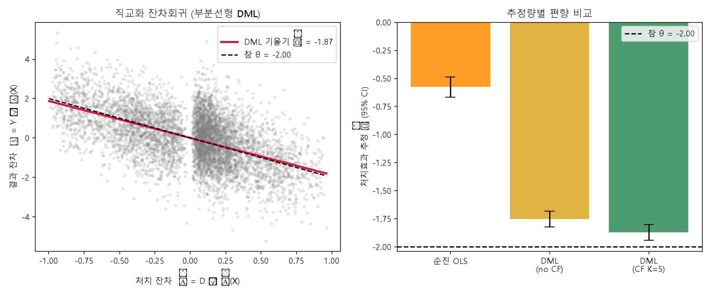

# 12장 복지·보건 수요 분석, 라벨에서 배분까지

> - 이 장에 나오는 예측 위험, 접근성, 검정통계량, 처치효과, 입지 선택 결과는 모두 `lecture_practice/chapter12/`의 코드를 실제로 실행해 얻은 값
> - 예시를 위해 지어낸 숫자는 없음(신호 결합의 조건부확률 계산 하나만 예외이며, 그 자리에서 "예시 계산"이라고 표시함)

## 1. 이 장의 핵심 질문

1. **도움이 필요한데 신청하지 않은 가구는 행정 기록 어디에도 없음.** 그런데도 "그 가구가 어디에 많은가"를 어떻게 추정하는가
2. **예측·탐지·인과는 같은 자료 위에서 무엇이 다른가.** 세 산출물의 수신자와 조치가 왜 다른가
3. **예측이 불확실한 지역을 만나면 "일단 제외한다"와 "먼저 가서 확인한다" 중 어느 쪽인가**
4. **"가장 부족한 곳"과 "먼저 여는 것이 나은 곳"은 왜 다른 목록인가**

- 이 장의 핵심 문장은 다음과 같음
- **관측된 기록과 실제 수요는 다른 값이고, 그 차이를 무시한 채 학습한 모형은 성능이 높아도 무엇을 예측한 것인지 알 수 없음**
- 같은 절차의 앞부분(집계·피처·접근성)은 민간 사업자의 입지 결정에도 그대로 쓰임. 공급이 수요를 못 따라가는 지역은 행정에게는 확충 대상이고 사업자에게는 진입 후보이며, 13절에서 서울 동물병원 자료로 이 겹침을 직접 계산함

## 2. 도입 사례: 다섯 실행의 핵심 결과

- 절차를 하나씩 따라가기 전에, 다섯 실행의 핵심 값만 먼저 봄

| 실행 | 핵심 결과 | 읽는 법 |
| --- | --- | --- |
| 사각지대 위험 예측 | 공간 블록 CV R² 0.681 → 0.737 (+0.056) | 이웃 단위의 위기신호·접근성을 더하면 예측이 좋아짐 |
| 감염병 시공간 예측 | R² 0.694 → 0.776, 이웃 발생 중요도 0.440+0.420 vs 자기 발생 0.074 | 다음 주 발생은 자기 과거보다 이웃의 최근 발생이 더 크게 좌우함 |
| 공간 군집 탐지 | 심어 둔 21개 단위를 recall 1.00·precision 1.00으로 회복, p = 0.0010 | 스캔 통계가 위치와 크기를 지정하지 않고도 설계된 군집을 정확히 찾음 |
| 개입효과 추정 | 순진 비교 θ̂ −0.579 vs DML θ̂ −1.874 (참값 −2.0) | 배정 구조를 다루지 않은 비교는 효과를 3분의 1 이하로 낮춰 봄 |
| 동물병원 입지 선택 | 탐욕적 순차 선택이 미충족 수요 순위표보다 실현 포획 48.5% 많음 | "가장 부족한 곳"과 "먼저 여는 것이 나은 곳"은 다른 목록임 |

- 이 다섯 줄 가운데 가장 눈에 띄는 것은 개입효과 행임. **방법을 바꾸는 것만으로 "효과가 미미한 사업"이 "효과가 확인된 사업"으로 판정이 뒤집힘.** 11절에서 이 계산을 처음부터 다시 따라감
- 동물병원 행도 놓치면 안 됨. "부족한 곳에 낸다"와 "이득이 가장 큰 순서로 연다"가 다른 답을 준다는 것이 이 장 뒷부분의 핵심 논지임

## 3. 무엇을 묻는가 — 예측·탐지·인과의 세 갈래

### 3.1 정책 질문의 네 유형

- 복지·보건 정책이 공간 분석을 요구하는 지점은 네 가지로 정리됨

| 질문 유형 | 정책 질문 | 분석 단위 | 자료 갱신 주기 |
| --- | --- | --- | --- |
| 사각지대 | 도움이 필요하나 제도 밖에 있는 가구는 어디에 많은가 | 읍면동·격자 | 월 1회 |
| 접근성 | 의료·돌봄 서비스에 닿기 어려운 지역은 어디인가 | 생활권·이동시간 | 연 1회 |
| 위험 집중 | 감염병·고독사 위험이 높아지는 지역은 어디인가 | 격자·보건소 권역 | 일 1회~주 1회 |
| 자원 배분 | 한정된 인력·예산을 어디에 먼저 투입할 것인가 | 행정구역·권역 | 예산 주기 |

- 사각지대는 제도가 신청주의로 작동하는 데서 생기는 문제임. 신청하지 않은 가구는 행정 기록에 존재하지 않으므로, **곤궁을 직접 세는 대신 곤궁의 흔적을 세어 추정함**
- 접근성은 제도 안에 있어도 서비스에 물리적으로 닿지 못하는 문제임. 소아과가 차로 한 시간인 군 지역의 아동은 수급 자격과 무관하게 진료를 받기 어려움
- **갱신 주기 열이 중요한 이유는 이 값이 피처의 시점 정합을 규정하기 때문임.** 월 단위 위기정보와 일 단위 신고 자료를 같은 모형에 넣으면, 예측 시점에 아직 존재하지 않는 값이 섞일 수 있음. **갱신 주기가 가장 긴 자료가 전체 분석의 시간 해상도를 정함**

### 3.2 세 갈래는 서로를 대신하지 않는다

- 같은 자료 위에서 세 가지 다른 질문을 물을 수 있음. 앞부분(집계·피처·접근성 계산)은 어느 갈래로 가든 같고, 갈리는 것은 그다음임

| 갈래 | 묻는 것 | 연결되는 조치 | 이 장의 절 |
| --- | --- | --- | --- |
| 예측 | 다음 시점에 어느 단위가 위험한가 | 방문 인력 배치, 대비 물량 산정 | 8·9절 |
| 탐지 | 지금 어디에 발생이 비정상적으로 몰렸는가 | 역학조사 착수, 현장 확인 | 10절 |
| 인과 | 이미 집행한 개입이 결과를 바꾸었는가 | 사업 존속·확대·중단 판단 | 11절 |

- **세 산출물은 수신자와 조치가 다르므로 하나가 다른 하나를 대신하지 않음**
- 예측 모형이 아무리 정확해도 "이 사업을 계속할까"에 답하지 못하고, 인과 추정치가 아무리 정밀해도 "다음 주 어디에 인력을 보낼까"에 답하지 못함

## 4. 관측 라벨을 의심한다

### 4.1 세 값의 구분

- 이 장에서 가장 중요한 구분은 다음 세 값을 헷갈리지 않는 것임
  - **yᵢ** = 실제 수요 또는 위험(우리가 진짜로 알고 싶은 값)
  - **yᵢᵒᵇˢ** = 발굴·신청·수급·진단·신고를 거쳐 기록에 남은 값(관측 라벨)
  - **ŷᵢ** = 모델이 산출한 예측값
- 모델은 yᵢᵒᵇˢ를 정답으로 학습하지만, **정책 결정에 필요한 값은 yᵢ임**

| 대상 | 알고 싶은 값 y | 관측 라벨 yᵒᵇˢ | 라벨을 만드는 행정 행위 |
| --- | --- | --- | --- |
| 복지 사각지대 | 도움이 필요한데 연결되지 않은 가구 수 | 발굴·신청·수급 결정 기록 | 방문·상담·조사 배정 |
| 감염병 발생 | 지역·시점별 실제 감염자 수 | 진단·신고 기록 | 검사 시행과 신고 체계 |
| 개입효과 | 개입이 없었다면 나타났을 위기 수준 | 개입 후 관측한 위기점수 | 개입 대상 배정 |

- 세 라벨 모두 실제 상태와 행정 행위를 함께 반영함. **사각지대 라벨은 곤궁의 신호를 실제로 담고 있으므로 버리면 남는 자료가 없고, 관심 편중도 함께 담겨 있으므로 그대로 실재 수요로 읽으면 판단이 틀림**
- 대응은 라벨을 쓰되 4.2의 절차로 편향을 진단하고, 그 결과를 예측 단계의 해석 범위와 처분 단계의 규칙에 반영하는 것임

> **주의.** 발굴·신청·수급 기록은 실제 곤궁과 행정이 들여다본 정도를 함께 반영함. 방문 인력이 자주 가는 지역에서 위기가구가 더 많이 기록되고, 그 기록으로 학습한 모형은 수요가 아니라 관심의 분포를 재현함. 라벨을 쓰되 행정 관심 프록시(과거 방문·상담 건수)와의 상관을 함께 산출하고, 상관이 높으면 예측값을 실재 수요로 읽지 않음.

- 이 어긋남은 되먹임 구조를 만듦. 관측 기록이 많은 지역에 다음 회차 방문 인력이 더 배정되고, 그 배정이 다시 기록을 늘림
- **이 장에서 되먹임의 방향은 누락 쪽으로 열려 있음.** 방문 인력이 닿지 않아 위기정보조차 수집되지 않는 지역은 예측 위험이 낮게 산출되고, 낮은 예측 위험 때문에 다음 회차에도 인력이 배정되지 않음
- 그래서 이 장의 처방은 예측이 낮게 나온 저정보 지역을 순위에서 빼는 것이 아니라 **별도의 현장확인 대상으로 돌리는 것**임(9.2의 조치표가 이 규칙을 표로 적음)

### 4.2 라벨 편향을 진단한다

- 진단하지 않고 학습하면 성능 지표만 남고, 그 성능이 무엇에 대한 성능인지 알 수 없게 됨

| 절차 | 계산 | 판정 기준 |
| --- | --- | --- |
| 차등 결측 점검 | 결측률을 계층·지역별 교차집계 | 특정 계층·지역의 결측률이 크게 벗어나면 라벨이 그 집단을 체계적으로 누락 |
| 관심 프록시 상관 | 프록시와 라벨·예측의 상관계수 | 상관이 높으면 모형이 수요가 아니라 관심 배분을 학습 |
| 감사 표본 | 전수 조사 대비 라벨 누락률 | 누락률이 지역마다 다르면 라벨을 그대로 비교에 못 씀 |
| 준실험 활용 | 관심이 외생적으로 변한 전후의 발굴 건수 변화 | 이 효과가 크면 지역 간 라벨 차이의 상당 부분이 관심 차이 |

- **차등 결측 점검이 가장 먼저 하는 진단임.** 위기정보는 행정과 접점이 있어야 생기므로, 디지털 접근이 어려운 고령층이나 무연고 가구가 많은 지역에서 결측이 많음
- 결측이 무작위로 흩어져 있으면 표본 크기만 줄지만, **특정 집단에 몰려 있으면 그 집단은 학습에서 아예 사라짐**
- 관심 프록시 상관은 라벨 자체를 의심하는 진단임. 프록시를 통제변수로 넣으면 수요 신호까지 함께 걷어낼 위험이 있으므로, 통제 전후의 예측 순위를 함께 보고하고 순위가 크게 바뀌는 단위를 표시함
- 네 절차 모두 이 장의 실습 자료에는 실행 증거가 없으므로 절차만 다룸

### 4.3 공간 단위와 집계 가중치

- 개인 단위 수요를 공간 단위로 모으는 이유는 둘임 — 개인을 직접 지목하면 개인정보 근거가 좁아지고 낙인 위험이 생기며, 집행 주체가 읍면동·권역 단위로 인력·예산을 배정하기 때문임
- 집계 단위 선택에는 두 조건이 맞섬. 격자가 작을수록 위험 지점을 정밀하게 짚지만 한 칸의 인구가 줄어 개인 식별 위험이 커지고, 격자가 클수록 식별 위험은 낮아지지만 구역 안 최악 단위가 평균에 섞여 사라짐

| 가중치 | 계산 결과의 뜻 | 적합한 결정 |
| --- | --- | --- |
| 면적(모두 동일) | 구역의 평균 위험 수준 | 시설 배치 계획, 권역 재획정 |
| 인구 | 주민 노출을 반영한 위험 | 방문 인력 배치, 검사 역량 배분 |
| 취약계층 인구 | 대상 집단 기준 위험 | 돌봄 서비스 배치, 안부 확인 인력 |
| 가구 수 | 지원 단위 기준 위험 | 긴급복지 예산, 상담 건수 산정 |

- 고령 인구 비율이 높고 총인구가 적은 농촌 읍면은 취약계층 가중에서 상위로 오르고 인구 가중에서 하위로 내려감. **가중치를 밝히지 않은 구역 평균은 무엇을 평균한 값인지 알 수 없음**

## 5. 실습 안내

- 실습 코드
  - `lecture_practice/chapter12/code/12-0-simdata-prep.py` — 사각지대·감염병·DML·SaTScan 합성자료 생성(실행 전 준비 단계)
  - `lecture_practice/chapter12/code/12-0b-vetcare-data-prep.py` — 서울 동물병원·생활인구 실데이터 준비
  - `lecture_practice/chapter12/code/12-1-welfare-blindspot-priority.py` — 사각지대 위험 예측과 신뢰등급
  - `lecture_practice/chapter12/code/12-2-infectious-spatiotemporal-risk.py` — 감염병 시공간 예측
  - `lecture_practice/chapter12/code/12-3-dml-highdim-confounding.py` — 개입효과 DML 추정
  - `lecture_practice/chapter12/code/12-4-satscan-cluster.py` — 공간 스캔 통계와 순열검정
  - `lecture_practice/chapter12/code/12-5-unmet-demand-siting.py` — 미충족 수요와 제약 하 순차 입지 선택
- 결과 로그: `lecture_practice/chapter12/results/*.log`

- 앞의 네 스크립트(12-1~12-4)는 **합성자료**를 씀. 신호를 미리 설계해 넣은 자료라서 "방법이 설계한 신호를 회복하는가"를 확인하는 용도임
- **실제 복지 사각지대나 감염병의 크기를 알려 주는 자료가 아님.** 이 구분을 놓치면 합성자료의 수치를 실제 정책 결론으로 오해하게 됨
- 12-5(동물병원 입지)만 **국내 공개 실데이터**를 씀. 이 장에서 실제 지명·실제 수치가 등장하는 유일한 절이 13절임
- 이 장의 실습은 GPU가 필요 없음. 일부 계산(공간 블록 교차검증, 999회 순열검정)은 수 분이 걸릴 수 있으므로 여유를 두고 실행함

## 6. 위기 신호를 결합한다

### 6.1 위기정보의 구조

- 곤궁은 신청서에 기록되지 않아도 생활의 흔적에는 남음. 전기요금이 여러 달 밀리고, 건강보험료가 체납되고, 의료비가 소득을 넘어서는 가구는 스스로 도움을 청하지 않았어도 위기 상태일 수 있음
- 이 흔적을 여러 기관에서 모아 결합하는 체계가 복지 사각지대 발굴시스템이며, **21개 기관의 47종 위기정보**를 다루고 입수 주기가 2개월에서 매월로 단축됨(보건복지부)

| 유형 | 신호 예 | 발생 시차 | 해석상 주의 |
| --- | --- | --- | --- |
| 주거·공과금 | 단전, 단수, 요금 체납, 임차료 연체 | 짧다(1~2개월) | 단발 체납은 착오일 수 있어 단독 신호로는 판별력이 낮음 |
| 의료·건강 | 재난적 의료비, 건강보험료 장기 체납 | 중간(1~3개월) | 의료비 지출은 소득과 무관하게 급증할 수 있어 소득 대비 비율로 봄 |
| 금융·부채 | 채무조정 신청, 서민금융 신청 반려 | 중간 | 신청 자체가 접근성을 전제하므로 금융 접점이 없는 가구는 안 잡힘 |
| 고용·소득 | 고용위기 신고, 실업급여 수급 종료 | 길다 | 비공식 고용은 기록에 안 남음 |

- 입수 주기가 짧아진 변화는 피처의 시점 정합을 바꿈. 2개월 주기에서는 급격히 악화된 가구가 다음 갱신까지 잡히지 않고, 매월 주기에서는 그 지연이 절반으로 줄지만 신호의 잡음이 늘어남
- 그래서 **연속 체납 개월 수처럼 지속 기간을 세는 피처**를 함께 만들어 일시적 변동과 지속적 악화를 분리함

### 6.2 신호를 결합하면 판별력이 올라간다

- 신호 하나로는 위기가구를 판별하기 어려움. **이유는 신호의 성능이 아니라 기저율에 있음**
- 전체 가구 가운데 실제 위기가구의 비율이 낮으면, 신호가 위기가구를 잘 잡아도 신호 양성 가구의 대다수는 위기가 아닌 가구가 됨
- 아래는 **예시 계산**이며 실측 자료가 아님
- 기저율 2%, 민감도(위기가구가 신호에 걸릴 확률) 60%, 위양성률(위기가 아닌데 걸릴 확률) 10%를 넣으면

양성예측도 = 0.02 × 0.60 ÷ (0.02 × 0.60 + 0.98 × 0.10) = 0.012 ÷ 0.110 = **0.109**

- **민감도 60%인 신호를 썼는데도 신호 양성 가구 열 곳 가운데 아홉 곳이 위기가 아님**
- 두 번째 신호(민감도 50%, 위양성률 8%)를 조건부 독립으로 더하면

양성예측도 = 0.02 × 0.60 × 0.50 ÷ (0.02×0.60×0.50 + 0.98×0.10×0.08) = 0.006 ÷ 0.01384 = **0.434**

- 신호 하나로 0.109였던 값이 두 신호를 겹치자 0.434로 오름. **신호 하나하나는 약해도 겹칠 때 판별력이 커지는 구조**가 여기에 있고, 발굴시스템이 개별 신호가 아니라 신호의 결합을 쓰는 이유도 여기에 있음
- 다만 **두 신호가 실제로는 독립이 아닐 수 있음.** 공과금 체납과 건강보험료 체납은 같은 지불 능력에서 나오므로, 위기가 아닌 가구에서도 한쪽이 밀리면 다른 쪽도 밀릴 확률이 높음
- 두 번째 신호의 위양성률을 8%가 아니라 30%로 두면 양성예측도는 0.169로 떨어짐. 47종을 정제 없이 그대로 모형에 넣으면 이런 중복이 다수 생기므로, **같은 생활 영역의 신호를 하나의 집단 지표로 묶어 차원을 줄임**

### 6.3 피처가 예측 시점에 존재하는가

- 한 읍면동의 사각지대 위험은 그 단위의 자료만으로 정해지지 않음. 복지관·주민센터·방문 인력은 권역 단위로 배정되므로, 이웃 읍면동에 위기가구가 몰려 전달체계가 과부하되면 자기 단위에 배정되는 발굴 여력이 줄어듦
- 이웃 값을 하나의 수로 요약한 것이 **공간 시차**이며, 이 장의 메커니즘(전달체계 부하 공유)과 가장 가까운 이웃 정의는 같은 복지관·보건소 권역을 이웃으로 두는 권역 정의임
- 만든 피처가 예측 시점에 실제로 존재하는지는 별도로 확인해야 함

| 피처 | 예측 시점 기준 지연 | 가용성 판정 |
| --- | --- | --- |
| 자기 단위 위기신호 집계 | 최대 1개월 | 사용. 직전 입수분만 씀 |
| 이웃 단위 위기신호 공간 시차 | 최대 1개월 | 사용. 자기 단위와 같은 시점 |
| 당해 연도 발굴 건수 | 사후 집계 | 제외. 예측 대상과 같은 과정에서 생성됨 |
| 상담 후 판정 결과 | 사후 집계 | 제외. 방문 이후에만 존재함 |

> **주의.** 위기정보의 입수 주기와 예측 시점이 어긋나면 예측 시점에 존재하지 않는 값이 피처에 섞임. 오류 메시지는 안 나오고 성능만 좋아짐. 피처마다 "이 값을 예측 시점에 어디서 받아 오는가"를 한 줄로 적고, 답을 못 적으면 후보에서 뺌.

## 7. 서비스 접근성을 계산한다

### 7.1 이동시간은 계산으로 확정된다

- 의료·돌봄 접근성의 기본 지표는 시설까지의 이동시간임. 직선거리가 아니라 실제 이동이 일어나는 도로망 위에서 잰 시간이며, 국내 의료취약지 제도가 이 이동시간을 임계로 씀(보건복지부 고시 제2024-261호)

| 취약지 유형 | 기준 |
| --- | --- |
| 응급의료취약지 | 지역응급의료센터 30분 내 접근 불가 인구 27% 이상, 또는 권역센터 60분 내 접근 불가 27% 이상 |
| 소아 취약지 | 소아과 60분 내 입원 의료이용률 30% 미만이면서 접근 불가 인구 30% 이상 |

- **이 계산에는 학습 모델을 쓰지 않음.** 도로망과 시설 위치가 주어지면 이동시간은 계산으로 확정되는 값이라(결정론성), 제3자가 같은 자료로 같은 값을 다시 계산할 수 있어야 하고(재현성), "왜 이 지역이 취약지인가"에 한 문장으로 답할 수 있어야 하기(이의제기 가능성) 때문임

### 7.2 2SFCA로 혼잡까지 반영한다

- 이동시간 하나로는 이용 경쟁을 반영하지 못함. **10분 거리에 병원 하나가 있고 배후 인구 5만 명이 매달린 지역**과 **15분 거리에 병원 셋이 있고 배후 인구가 1만 명인 지역**은 최근접 지표로는 전자가 낫다고 나오지만 실제 대기는 후자가 짧음
- 이 차이를 지표에 넣는 방법이 **2단계 유동권역법(2SFCA)**임(Luo & Wang, 2003)

1. 시설 j의 용량 Sⱼ를 권역 안 배후 수요의 합으로 나눠, 수요 한 단위가 그 시설에서 받을 몫 Rⱼ를 구함
2. 단위 i가 닿는 시설들의 몫 Rⱼ를 더해 그 단위의 접근성 Aᵢ를 구함

```python
def two_sfca(D, d_dc, capacity, radius):
    inside = d_dc <= radius                    # 권역 안인가
    served = inside.T @ D                       # 병원별 권역 안 수요 합
    R = np.where(served > 0, capacity / served, 0.0)  # 1단계: 병원별 몫
    return inside @ R                            # 2단계: 동네별 접근성
```

_전체 코드는 `lecture_practice/chapter12/code/12-5-unmet-demand-siting.py` 참고_

- **산출값 Aᵢ의 단위는 "수요 한 단위가 확보할 수 있는 용량"임.** 값이 크면 그 지역 주민 한 명이 확보 가능한 진료 용량이 크다는 뜻이며, 이동시간처럼 분 단위로 읽으면 해석이 어긋남
- 용량 Sⱼ의 대리변수 선택도 결과를 좌우함. 요양시설은 정원이 명확하지만 의원급 외래는 정원 개념이 없어 진료 건수를 대신 쓰게 되고, 그 대체값이 인구와 대응하지 않으면 해석이 사라짐

### 7.3 미충족 수요

- 접근성 Aᵢ 자체는 순위를 주지만 **부족분의 크기를 주지 않음.** 부족분을 수요 규모로 환산한 값이 **미충족 수요**이며, 기준 접근성 A\*에 못 미치는 비율을 그 단위의 수요에 곱해 정의함

```
Uᵢ = Dᵢ × max(0, 1 − Aᵢ / A*)
```

- Aᵢ가 A\* 이상인 단위는 괄호 안이 음수가 되어 0으로 잘리고, Aᵢ가 A\*의 절반인 단위는 그 단위 수요의 절반이 미충족으로 계산됨
- A\*를 수요가중 평균 접근성으로 두면 A\* = (시설 수 × 지점 용량) ÷ 총수요가 유도되고, 지점 용량을 평균 담당 수요의 κ배로 두면 **A\* = κ**로 정리됨. 13절의 서울 자료에서 용량 배수 1.8을 넣었을 때 A\*가 실제로 1.8000으로 나온 것이 이 관계의 확인임
- **이 성질의 쓸모는 확인 못 한 가정의 영향 범위를 좁히는 데 있음.** 수요 규모를 전부 c배 하면 Aᵢ는 변하지 않고, 용량 배수를 바꾸면 Aᵢ와 A\*가 같은 비율로 움직여 비율 Aᵢ/A\*는 그대로 유지됨
- 다만 이 정의는 총량 부족이 아니라 **분포의 불균형**만 잼. 지역 전체 용량이 절대적으로 모자라도 모든 단위가 똑같이 모자라면 미충족 수요는 0이 됨
- 접근성 하나로 사각지대 위험이 얼마나 설명되는지는 실행 결과로 확인됨. 합성자료 300개 읍면동에서 이동시간 30분을 초과하는 접근성 취약 단위는 15개(5.0%)였고, 이 취약지의 평균 사각지대 위험은 13.56%로 그 외 지역의 10.88%보다 높음. **차이는 2.68%p로 경향은 있지만 크지 않으며**, 나머지를 잡으려면 여러 신호를 결합하는 예측 모델이 필요함

## 8. 위험을 예측하고 공간으로 검증한다

### 8.1 횡단면 위험 예측 — 사각지대

- 첫 형태는 시점 하나의 자료에서 단위별 위험을 예측하는 것임. 합성자료 300개 읍면동에서 취약계층 구성, 위기신호 집계, 의료 접근성과 각각의 공간 시차를 피처로 그래디언트 부스팅으로 예측함
- **검증 설계를 모델 선택보다 먼저 정해야 함.** 이웃한 읍면동은 값이 서로 닮아 있으므로, 검증 자료를 무작위로 나누면 검증 단위의 이웃이 학습 자료에 들어가고 모델이 그 이웃 값을 참고해 검증 단위를 맞힘
- **공간 블록 교차검증**은 이 경로를 막음. 좌표를 기준으로 자료를 덩어리로 나누고, 한 덩어리를 통째로 검증에 쓰는 동안 그 덩어리는 학습에 넣지 않음

| 피처 구성 | R² | 포함 변수 |
| --- | ---: | --- |
| 비공간 피처(자기 단위만) | 0.681 | 자기 단위의 위기정보·접근성·취약계층 구성 |
| + 공간 시차 피처 | 0.737 | 위에 이웃 단위의 위기정보·접근성을 더함 |
| 차이 | **+0.056** | 공간 시차 피처가 설명하는 몫 |

- 합성자료에는 이웃 위기·접근성의 파급 구조를 설계해 넣었으므로, 공간 피처가 그 구조를 회복한 결과임
- **이 비교가 확인하는 것은 "파급 구조가 자료에 있을 때 공간 명시적 피처가 그것을 잡는다"까지이며**, 실제 복지 사각지대에 그런 파급 구조가 있다는 결론은 아님

> **주의.** 이 자료에서는 랜덤 교차검증의 R²도 0.737로 공간 블록 교차검증과 같게 나왔음. 이 값을 "공간 누수가 없다"는 결론으로 옮기면 안 됨. 공간 상관의 원천이 공간 시차 피처로 이미 모형에 들어가면 잔차에 남는 공간 상관이 약해지고, 그 결과 무작위 분할이 얻는 이득도 사라짐. 두 값의 차이는 성능이 아니라 잔차 구조의 진단 정보로 읽음.

### 8.2 시공간 위험 예측 — 감염병

- 두 번째 형태는 시간 축이 있는 자료에서 다음 시점의 발생을 예측하는 것임
- 한 격자의 다음 주 발생은 그 격자의 이번 주 감염자 수에 비례해 늘어나는 데 그치지 않음. **이웃 격자의 감염자가 출퇴근·시장·학교를 오가며 감염압을 더하므로**, 이웃에서 유행이 시작되면 자기 격자의 발생이 자기 추세와 무관하게 오름
- 합성자료는 16×16 격자 256단위 × 40주의 **SIRS 모형**(감수성-감염-회복-재감수성 네 상태의 전이)으로 생성함. 총 발생은 40주 동안 14,345건, 피크 주는 1,279건임
- 피처는 시간 시차(같은 격자의 직전 1~3주)와 공간 시차(이웃 격자의 직전 0~1주)의 두 축으로 만들고, 검증은 앞 기간으로 학습하고 뒤 기간으로 평가하는 **시간 블록** 설계를 씀. **시점을 무작위로 섞으면 미래 정보가 학습에 들어감**

| 피처 구성 | R² | MAE |
| --- | ---: | ---: |
| 시간 시차만(자기 과거) | 0.694 | 1.483 |
| + 공간 시차(이웃 과거) | 0.776 | 1.294 |
| 차이 | **+0.082** | −0.189 |

- 피처 중요도에서는 이웃 발생의 직전 주 값 0.440과 당주 값 0.420이 **자기 발생 0.074를 크게 앞섬**
- 다음 주 발생을 예측하는 데 자기 격자의 과거보다 이웃 격자의 최근 발생이 더 큰 몫을 차지한다는 뜻이며, 시뮬레이터가 이웃 감염압으로 확산을 설계한 것과 대응함. 이 결과도 시뮬레이터의 내부 일관성 확인이므로 실제 감염병 자료의 결론으로 옮기지 않음

## 9. 예측구간과 신뢰등급

### 9.1 단위마다 다른 구간 폭

- 점예측만으로는 자원 배분을 판정할 수 없음. **예측 위험이 같은 16%로 나온 두 단위라도, 한 곳은 예상 오차가 ±0.68%p이고 다른 곳은 ±2.62%p이면 같은 조치를 적용할 근거가 없음**
- **정규화 conformal 예측**은 잔차 크기 모형 σ̂(x)로 단위마다 다른 폭을 줌. 보정표본에서 얻은 분위값 q에 σ̂(xᵢ)를 곱한 값이 반폭임
- 한 단위에 숫자를 넣어 확인함. q = 1.65이고 σ̂(xᵢ) = 1.59%p라면 반폭은 1.65 × 1.59 = 2.62%p이고, 예측 위험이 18.26%인 단위의 90% 예측구간은 [15.64, 20.88]%가 됨. 같은 q라도 σ̂(xᵢ)가 0.41%p인 단위에서는 반폭이 0.68%p로 줄어듦. **단위마다 폭이 달라지는 몫은 전부 σ̂(xᵢ)에서 나옴**
- 합성자료 300개 읍면동에서 90% 예측구간의 경험적 포함률은 0.903으로 목표 0.90에 부합했고, 구간 반폭은 중앙값 1.53%p, 범위 [0.59, 4.19]%p로 단위마다 갈림

> **주의.** 이 구현은 학습·보정·시험을 세 갈래로 분리한 정식 분할이 아니라, 공간 블록 교차검증의 out-of-fold 잔차를 σ̂ 적합과 분위 계산에 함께 쓴 근사임. 같은 잔차를 두 용도로 재사용하므로 포함률이 낙관적으로 나옴.

### 9.2 저신뢰는 "위험 없음"이 아니라 "자료 부족"

- 구간 반폭을 3분위로 나눠 좁은 쪽부터 높음·중간·낮음의 세 등급으로 표기하면 예측값과 조합해 규칙을 만들 수 있음

| 순위 | 단위 ID | 예측 위험(%) | 반폭(%p) | 신뢰등급 |
| :-: | :-: | --: | --: | :-: |
| 1 | 31 | 18.26 | 2.62 | 낮음 |
| 2 | 75 | 17.26 | 1.10 | 높음 |
| 3 | 44 | 16.73 | 2.03 | 낮음 |
| 4 | 104 | 16.68 | 2.31 | 낮음 |
| 5 | 30 | 16.61 | 0.68 | 높음 |
| 6 | 88 | 16.60 | 1.34 | 중간 |
| 7 | 78 | 16.42 | 1.84 | 낮음 |
| 8 | 107 | 15.74 | 0.98 | 높음 |

- 예측 위험이 가장 높은 31번 단위는 반폭이 2.62%p로 상위 8곳 가운데 가장 넓고 신뢰등급이 '낮음'임
- 반폭이 넓어지는 원인을 따라가면 방향이 정해짐. 예측이 불확실한 단위는 대체로 위기정보 자체가 적게 수집된 단위임. 즉 **낮은 신뢰등급은 "위험이 없다"가 아니라 "자료가 적다"를 가리킴**
- 그래서 **저신뢰 단위를 순위에서 제외하는 규칙을 쓰면 안 됨.** 자료가 부족해 소외된 지역이 자료가 부족하다는 이유로 다시 배제되고, 4.1에서 본 되먹임이 여기서 완성됨. 대신 저신뢰 단위를 **현장확인 우선 대상**으로 돌림

| 예측 위험 | 신뢰등급 | 조치 |
| --- | --- | --- |
| 높음 | 높음 | 방문상담 우선 배정으로 확정 |
| 높음 | 낮음 | 순위를 유지하되 방문 목적에 자료 보완을 포함 |
| 낮음 | 낮음 | 현장확인 대상으로 별도 편성. 자료 부족과 위험 부재를 구분 못 하는 구간 |
| 낮음 | 높음 | 일반 모니터링 |

- 표의 1순위 31번과 2순위 75번이 판정이 갈리는 예임. **두 단위 모두 방문 대상이지만 목적이 다름** — 31번은 자료 보완을 함께 하는 방문, 75번은 지원 연계를 목적으로 하는 방문임

## 10. 공간 군집을 탐지한다

### 10.1 탐지는 예측이 아니다

- 이 절은 8절과 같은 자료를 쓰지만 다른 질문에 답함
- **예측 모형은 과거 패턴이 이어진다고 보고 다음 시점의 규모를 추정하고, 스캔 통계는 미래를 추정하지 않는 대신 볼 위치와 크기를 사전에 정하지 않고 현재의 이상 집중을 찾음**
- 미국 뉴욕시 보건부는 2014~2015년 신고감염병에 일일 스캔 통계를 적용해 살모넬라·레지오넬라 군집을 조기 탐지한 운영 사례를 보고했고(Greene et al., 2016), **탐지 결과를 확진이 아니라 조사 착수의 근거로 씀**

### 10.2 스캔 통계의 다섯 단계

- 감염 신고가 어디에 몰렸는지 판정할 때 **절대 건수로는 비교할 수 없음.** 인구가 많은 지역에서 발생이 많은 것은 정상이기 때문임
- **공간 스캔 통계**는 인구비례 기대치를 기준으로 두고, 그 기준을 넘는 정도가 가장 큰 영역을 찾음(Kulldorff, 1997)

1. 각 단위를 중심으로 반경을 넓혀 가며 원형 윈도우를 만듦(이 실행에서는 전체 인구의 50%를 반경 상한으로 씀)
2. 윈도우마다 관측 발생 c와 인구비례 기대 발생 e를 구함
3. 로그우도비를 계산함 — LLR = c·ln(c/e) + (C−c)·ln((C−c)/(C−e))
4. c > e인 윈도우만 후보로 남김(고위험 군집만 찾는 것이 목적)
5. 후보 가운데 LLR이 최대인 윈도우를 가장 가능성 높은 군집(MLC)으로 정함

_전체 코드는 `lecture_practice/chapter12/code/12-4-satscan-cluster.py` 참고_

- **식의 두 항은 각각 윈도우 안과 밖의 설명력임.** 첫 항 c·ln(c/e)는 윈도우 안에서 관측이 기대를 넘는 정도, 둘째 항은 윈도우 밖에서 관측이 기대에 못 미치는 정도임. c = e이면 두 항 모두 0이 되고, 이 값이 "군집 없음"의 기준점임
- 실행값으로 확인함. 합성자료는 300개 격자에 총발생 C = 10,371건, 총인구 443,692명을 두고 중심 (6.0, 4.0)·반경 2.6 안의 21개 단위에 상대위험 3.0을 심음. 탐지된 윈도우의 관측 발생은 c = 2,245건, 기대 발생은 e = 892.6건
- 첫 항 = 2,245 × ln(2,245/892.6) ≈ 2,070.1, 둘째 항 = (10,371−2,245) × ln((10,371−2,245)/(10,371−892.6)) ≈ −1,250.6. **두 항을 더하면 LLR ≈ 819.5로, 실행 로그의 819.57과 일치함**

### 10.3 몬테카를로 순열검정

- LLR 값 하나만으로는 유의성을 판정할 수 없음. **모든 윈도우를 탐색해 최댓값을 골랐으므로 군집이 없는 자료에서도 어느 정도 큰 값이 나오기 때문임**
- 귀무가설은 "위험이 공간적으로 균일하다"임. 이 가설 아래에서 총발생 C를 각 단위의 인구 비율에 따라 무작위로 재분배한 자료를 999개 만들고, 각 자료에서 10.2의 다섯 단계를 그대로 수행해 최대 LLR을 구함
- **최댓값의 분포를 쓰는 것이 핵심임.** 개별 윈도우의 분포를 쓰면 다중비교 보정이 따로 필요하지만, 순열 자료에서도 같은 탐색을 반복해 최댓값을 뽑으면 탐색으로 인한 부풀림이 귀무분포에 이미 들어가므로 별도 보정이 필요 없음

| 항목 | 값 | 읽는 법 |
| --- | ---: | --- |
| MLC 구성단위 | 21개 | 설계한 참 군집의 21개와 같음 |
| 관측/기대 발생 | 2,245 / 892.6 | 관측 상대위험 2.52배 |
| 로그우도비 LLR | 819.57 | 순열 최대 LLR의 95%분위 8.39를 크게 넘음 |
| 몬테카를로 p값 | 0.0010 | 999회 가운데 관측값 이상이 0회 |
| recall / precision | 1.00 / 1.00 | 설계한 21개 단위를 빠짐없이, 그 단위만 찾음 |

- **실데이터에서는 신고 지연·인구 이동·검사 편중이 발생 분포를 바꾸므로, 탐지 결과는 역학조사의 가설로 쓰고 조사에서 확인된 뒤 대응 자원을 확정함**

> **주의.** 관측 상대위험 2.52는 설계값 3.0보다 낮게 나옴. 기대 발생 e를 전체 평균 발생률로 계산하는데 심어 둔 군집 자체가 그 평균을 끌어올리므로, 군집이 클수록 상대위험이 실제보다 낮게 나옴(이 자료에서는 군집이 총발생의 21.6%를 차지). 군집의 위치와 존재는 그대로 쓰고, 상대위험 수치는 하한으로 읽음.

## 11. 개입효과를 인과로 추정한다

### 11.1 통째로 비교하면 안 되는 이유

- 방문상담과 긴급복지 같은 선제 개입은 **위기가 심각한 가구에 우선 배정되므로**, 개입을 받은 가구와 받지 않은 가구의 결과를 그대로 비교하면 배정 규칙이 비교에 섞임
- 통상적인 대응은 회귀식에 위기지표를 선형으로 넣는 것이지만, **실제 위기지표는 선형으로 작동하지 않음.** 체납은 일정 수준을 넘어야 위기 신호가 되고(임계), 어느 지점에서 급격히 나빠지며(꺾임), 아주 심각한 구간에서는 더 나빠질 여지가 없어 평평해짐(포화)
- 이런 굽은 구조가 결과와 처치확률 양쪽에 함께 작동하면, 직선으로 그은 통제선이 그 관계를 다 걷어내지 못하고 교란이 남음
- 검증 자료는 참 처치효과 θ = −2.0을 심어 둔 합성자료임(N = 6,000, 위기지표 20종). **실제 복지 미시데이터에서는 참 θ를 알 수 없어 추정량의 타당성을 직접 검증할 수 없으므로**, 참값을 아는 자료로 추정량의 거동을 먼저 확인함

### 11.2 이중기계학습의 세 장치

- **이중기계학습(DML)**은 세 장치로 이 문제를 다룸(Chernozhukov et al., 2018)

1. **유연한 머신러닝으로 보조 함수를 추정함.** 공변량 X로 결과 Y를 예측하는 ĝ(X)와 처치 D를 예측하는 성향점수 m̂(X)를 랜덤포레스트처럼 유연한 방법으로 학습해 굽은 관계를 근사함
2. **직교화로 교란을 뺀 나머지끼리 비교함.** 결과 잔차 Ỹ = Y − ĝ(X)와 처치 잔차 D̃ = D − m̂(X)를 만들고, 두 잔차의 관계에서 처치효과를 뽑음
3. **교차적합으로 학습 표본과 평가 표본을 분리함.** 같은 자료로 보조 함수를 학습하고 그 자료에서 잔차를 구하면 모형이 과적합해 잔차를 실제보다 작게 만들고, 그 축소가 θ̂에 편향으로 남음

```python
theta = float(resid_d @ resid_y) / (resid_d @ resid_d)   # 잔차끼리 회귀
psi = resid_d * (resid_y - theta * resid_d)               # 강건 표준오차 계산용
```

_전체 코드는 `lecture_practice/chapter12/code/12-3-dml-highdim-confounding.py` 참고_

- 한 표본에 숫자를 넣어 확인함. Y = 3.1, ĝ(X) = 4.0, D = 1, m̂(X) = 0.72인 표본이라면 Ỹ = −0.90, D̃ = 0.28임
- **성향점수가 0.72로 높은 표본(처치가 예상된 표본)은 D̃가 작아 추정에 작은 몫만 더하고, 예상과 어긋나게 처치된 표본일수록 |D̃|가 커져 추정에 더 큰 몫으로 들어감.** 배정 규칙으로 설명되지 않는 변동만 골라 쓰는 구조가 여기에 있음

### 11.3 방법 선택이 사업 존폐 판정을 바꾼다

| 추정량 | θ̂ | 참값 대비 편향 | SE |
| --- | :-: | :-: | :-: |
| 순진 OLS(선형 통제) | −0.579 | +1.421 | 0.047 |
| DML(교차적합 없음) | −1.754 | +0.246 | 0.035 |
| DML(교차적합 K=5) | −1.874 | +0.126 | 0.036 |

- 순진 OLS의 θ̂는 −0.579로 참값 −2.0에서 +1.421만큼 벗어남. **개입 효과의 크기가 실제의 3분의 1 아래로 산출된 것**
- 같은 자료에서 DML 교차적합 K=5의 θ̂는 −1.874로 편향이 순진 OLS의 9% 수준임(95% 신뢰구간 [−1.945, −1.803])
- **교차적합의 몫도 표에서 드러남.** 직교화는 하되 교차적합을 빼면 θ̂가 −1.754로, 교차적합을 넣은 −1.874보다 참값에서 멂
- 이 대비가 정책 판단에 주는 함의는 **방법 선택이 결론을 바꾼다는 점**임. 전자를 근거로 삼으면 효과가 미미한 사업으로 판정되어 예산이 줄고, 후자를 근거로 삼으면 효과가 확인된 사업으로 판정됨



**그림 12.1** 왼쪽은 처치 잔차를 가로축, 결과 잔차를 세로축에 놓고 그린 산점도임. 빨간 직선의 기울기 −1.87이 DML 추정치이고 검은 점선이 참값 −2.00임 — **11.2의 4단계(두 잔차의 관계에서 처치효과를 뽑는다)가 실제로 하는 계산이 이 직선 하나임.** 오른쪽은 세 추정량의 편향 비교로, 순진 OLS만 참값에서 크게 떨어져 있음

### 11.4 DML도 그대로 믿지 않는다

| 진단 | 실행값 | 판정 |
| --- | --- | --- |
| 보조 함수 정확도 | 결과 ĝ RMSE 0.31, 처치 m̂ 0.29 | 보조 함수가 참 구조를 상당 부분 근사함 |
| 중첩(positivity) | 성향점수 0.047~0.953 | 0과 1에서 떨어져 있어 두 군이 함께 관측되는 구간이 유지됨 |
| 표본분할 안정성 | seed 0~4 평균 −1.869, SD 0.003 | 단일 분할의 우연으로 값이 정해지지 않음 |

- **중첩은 극단 구간에서 특히 문제가 됨.** 위기가 가장 심각한 가구가 항상 개입을 받으면 그 구간의 성향점수가 1에 붙고, 비교할 대조가 없으므로 그 영역의 효과는 식별되지 않음
- 95% 신뢰구간 [−1.945, −1.803]은 **참값 −2.0을 포함하지 않음.** 랜덤포레스트 보조 함수에 남은 유한표본 편향 +0.126이 구간을 참값에서 밀어낸 결과이며, DML이 편향을 줄이되 유한표본에서 완전히 없애지는 못한다는 뜻임

> **주의.** DML이 참값을 회복하는 것은 관측 공변량으로 처치배정이 조건부 무작위일 때임. 담당자 재량이나 비공식 정보처럼 자료에 없는 배정 동기가 있으면 성능 지표가 좋아도 추정치는 편향됨. 배정 규칙이 문서화되어 있는지 먼저 확인하고, 확인할 수 없으면 추정치를 효과의 크기가 아니라 방향의 참고값으로 씀.

## 12. 결과를 해석하고 처분과 분리한다

### 12.1 우선순위표와 권역 집계

- 우선순위표를 읽는 순서는 **예측 위험 → 신뢰등급 → 근거 열**임. 예측 위험으로 후보를 좁히고, 신뢰등급으로 그 예측을 배분 근거로 쓸지 확인 대상으로 돌릴지 가르고, 근거 열로 왜 높게 나왔는지 확인함
- 9.2의 31번 단위는 인구 7,509명에 65세 이상 비율 0.284, 1인 가구 비율 0.511, 위기신호 강도 21.508, 의료 접근성 28.367로 확인됨. 고령·1인 가구 비중이 높고 의료시설이 먼 조건이 겹친 지역임
- **순위를 그대로 지원 확정으로 옮기지 않음.** 실제 지원은 방문 확인과 자격 판정을 거치며, 우선순위표는 한정된 방문 인력을 어느 순서로 보낼지 정하는 배정 문서임

- 격자·읍면동 예측은 그대로 예산 배정에 쓰이지 않고 집행 단위로 집계함

| 권역 | 누적 발생(건) | 누적 순위 | 다음 주 예측 발생(건) | 예측 순위 |
| :-: | --: | :-: | --: | :-: |
| 0 | 4,083 | 1 | 255.50 | 2 |
| 1 | 3,613 | 2 | 273.68 | 1 |
| 6 | 3,055 | 3 | 252.62 | 3 |
| 7 | 1,782 | 4 | 150.04 | 4 |

- **누적 발생 순위와 예측 순위가 1·2위에서 어긋남.** 유행이 권역 0에서 꺾이고 권역 1에서 오르는 국면이면 두 순위가 갈릴 수 있음
- 자원 배분은 다음 기간에 필요한 양을 정하는 결정이므로 예측 순위를 따르되, 누적 순위도 함께 표에 남김. 두 순위가 크게 어긋날 때는 모형이 국면 전환을 잡은 것인지 최근 자료의 잡음을 확대한 것인지 확인해야 함

### 12.2 예측과 처분을 분리한다

- 예측 결과를 행정 행위로 연결하는 방식이 이 분야의 위험을 좌우함. 실패는 두 종류임 — 위험을 찾지 못하는 **미발굴**과, 위험이 없는 대상을 지목하는 **오탐**
- **두 실패의 비용은 대칭이 아님.** 미발굴은 신청주의의 한계가 이어진 결과이므로 예측 체계가 없었을 때와 같은 상태에 머묾. 오탐이 불이익 처분으로 직결되면 **예측 체계가 없었으면 발생하지 않았을 피해가 새로 생기고**, 그 피해를 입는 쪽은 대개 이의제기 자원이 가장 적은 집단임(Eubanks, 2018)
- 미국 미시간주의 실업급여 자동판정 체계 MiDAS가 이 구조가 실제로 작동한 사례임. 2013~2015년 이 체계는 알고리즘 판정만으로 다수의 사기 판정을 산출했고, 이후 검토에서 상당수가 오판으로 확인됨. 판정을 받은 사람에게 임금 압류가 집행되었으며, **판정과 처분 사이에 사람의 검토가 없었음**(오판 비율과 피해 규모의 구체 수치는 출처에 따라 차이가 있어 밝히지 않음)

| 실패 지점 | MiDAS에서 일어난 일 | 설계 요건 |
| --- | --- | --- |
| 처분 직결 | 자료 불일치라는 약한 신호가 사기 판정과 압류로 바로 이어짐 | 예측 점수를 불이익 처분의 근거로 쓰지 않음 |
| 설명 부재 | 판정 근거를 당사자가 확인할 수 없었음 | 어떤 요인으로 점수가 높게 산출됐는지 근거 열로 제시함 |
| 구제 부재 | 이의를 제기해도 실효적 시정 절차가 없었음 | 이의제기와 시정 절차를 처분 전에 둠 |

- **국내 사각지대 발굴 체계는 첫 행에서 다른 설계를 택함.** 이 체계의 예측은 수급 중단이나 환수 같은 불이익 처분이 아니라 방문·상담이라는 지원 행위로 연결됨. 오탐이 발생해도 방문해 확인한 결과 위기가 아니었다는 기록으로 끝나며, 예측 점수와 실제 지원 결정 사이에 담당자의 현장 확인이 있어 자동 처분 직결이 구조적으로 차단됨

> **주의.** 예측 점수를 수급 중단·환수 같은 불이익 처분에 직접 연결하면, 잘못 지목된 사람이 곧바로 피해를 입고 그 사람은 대개 이의제기 자원이 가장 적음. 예측과 처분 사이에 현장 확인과 이의제기 절차를 두고, 오류의 방향이 지원 쪽으로만 열리도록 설계 단계에서 고정함.

### 12.3 배치 후에도 확인할 것

| 범주 | 지표 | 확인 주기 |
| --- | --- | --- |
| 실행 연계 | 예측 상위 단위의 방문 실행률, 방문 후 지원 연계율 | 월 |
| 저정보 지역 | 위기정보 결측률 상위 단위의 발굴률 추이 | 분기 |
| 라벨 편향 | 관심 프록시와 라벨·예측의 상관 변화 | 반기 |

- **실행 연계 지표를 가장 먼저 확인함.** 예측 상위 단위에 방문이 실제로 배정되지 않으면 나머지 지표는 모두 무의미해짐
- 저정보 지역 지표와 라벨 편향 지표는 짝을 이룸. 저정보 지역의 발굴률이 계속 낮게 유지되면 4.1의 되먹임이 작동하고 있다는 신호이고, 그 지역의 현장확인 배정을 늘려 자료를 쌓는 개입이 필요함

## 13. 사례 전체: 미충족 수요와 동물병원 입지 선택

- 앞 절들의 결정 주체는 행정이었음. 이 절은 같은 접근성 계산을 **민간 사업자**가 쓰는 경우를 다룸
- 달라지는 것은 목적함수와 뒷단임 — 미충족 해소가 아니라 기여이익 최대화가 목적이 되고, 자기잠식·용량 제약·원가 컷라인이 들어옴. 예측·탐지·인과(8~11절)는 수행하지 않음. **접근성은 계산으로 확정되고 남은 물음이 예측이 아니라 배분이기 때문임**

### 13.1 왜 동물병원인가

- 민간 의료 입지의 예로 약국을 쓰면 결론이 미리 정해짐. 약국 매출의 대부분이 처방 조제이므로 입지의 1순위 변수는 병원과의 근접성이고, 인구 피처로 분석해도 **"병원 옆에 약국이 있다"는 사실을 재발견하는 데 그침**
- 반려동물 의료는 다름. 수요가 처방 연계가 아니라 **사육 가구의 거주지에서 나오고**(인구·가구 피처가 직접 설명변수), 개설 자격은 수의사법 제17조가 수의사·국가·법인으로 제한하지만 입지 자체를 제한하지 않으며, 2SFCA·서비스 권역·이동시간이 사람 의료와 같은 형태로 쓰임
- 다만 건강보험이 없어 진료비가 전액 자기부담이므로, 접근성과 함께 지불 능력이 수요를 가름

### 13.2 자료와 가정을 세 갈래로 나눈다

- 기존 동물병원 위치는 소상공인시장진흥공단 상가정보(2026년 6월판)에서 얻음. 서울 전체 점포 554,092개 가운데 동물병원은 905개이며 좌표 결측률은 0.000%
- 배후 수요는 서울 열린데이터광장 행정동 생활인구 중 **심야 0~5시 평균**을 씀. **동물병원 수요는 낮에 오는 사람이 아니라 그 지역에 사는 사람에게서 나오고**, 심야에 그 지역에 있는 사람은 대체로 거주자이기 때문임. 대표점 매칭(97.2%) 이후 415개 동, 9,617,177명이 분석에 들어감. 후보지는 250m 격자 5,462곳
- 분석에 들어간 값은 출처가 확인된 값과 확인되지 않은 값이 섞여 있음. **섞인 채 두면 가정을 사실처럼 인용하게 되므로 갈라 적음**

| 값 | 설정 | 성격 |
| --- | --- | --- |
| 마리당 월 병원비 | 37,000원 | 검증값 — 농림축산식품부 2025년 반려동물 양육현황조사 |
| 인구 1인당 반려동물 ρ | 0.104 | 산출값 — 전국 사육률 × 서울/전국 양육가구비 |
| 지점 용량 | 서울 평균 담당 마리수 × 1.8 | 가정 — 배수를 1.4·1.0으로도 계산 |
| 거리 저항 β | 2.0 | 가정 — 개인 방문 자료가 없어 1.5·2.5로 민감도를 봄 |
| 기여이익률 | 60% | 가정 — 소매점 값을 업종을 가로질러 쓰지 않음 |

- 거리는 투영좌표(EPSG:5179)의 직선거리를 씀. 도로망 이동시간을 쓰려면 국내 도로의 표준 우회계수가 필요한데 확인하지 못해 적용하지 않았고, 이 근사는 **접근성을 과대평가하는 방향으로 치우침**
- 가정을 금액으로 환산해 실무 감각과 맞는지 먼저 확인함. 서울 동물병원 시장 규모는 월 370억원(연 4,441억원), 병원 한 곳의 평균 월 매출은 4,089만원으로 산출됨. **이 두 값이 실무 감각과 크게 어긋나면 최적화를 정교히 해도 교정되지 않으므로**, 그 경우 사육률·기여이익률 가정을 먼저 고침

### 13.3 현행 접근성과 미충족 수요

- 추정 수요는 서울 전체 1,000,186마리, 병원 한 곳이 담당하는 평균은 1,105마리. 지점 용량을 그 1.8배(1,989마리/월)로 두고 2SFCA 접근성 Aᵢ를 계산하면 최소 0.685, 중앙값 1.717, 최대 3.186으로 갈림
- 기준 접근성 A\*는 7.3의 정의대로 수요가중 평균으로 두었고 실행값은 1.8000으로 용량 배수와 일치함. 접근성 비율 Aᵢ/A\*는 최소 0.381, 중앙값 0.954, 최대 1.770
- 미충족 수요가 있는 행정동은 239개(57.6%)이고 합계는 108,080마리로 전체 수요의 10.8%

| 행정동 | 자치구 | 접근성비 A/A\* | 미충족(마리) |
| --- | --- | --: | --: |
| 진관동 | 은평구 | 0.469 | 3,197 |
| 세곡동 | 강남구 | 0.416 | 3,179 |
| 오류2동 | 구로구 | 0.669 | 1,930 |
| 강일동 | 강동구 | 0.683 | 1,799 |
| 가산동 | 금천구 | 0.545 | 1,766 |
| 대학동 | 관악구 | 0.454 | 1,718 |

- 상위에 오른 행정동은 대규모 택지와 산업단지처럼 **인구가 뒤늦게 들어온 지역**임. 시설 공급이 인구 유입을 따라가는 데 시차가 생기는 구조가 이 목록에 반영됨
- **공공 분석이라면 이 표가 우선순위표가 되고 예산 배분으로 넘어감. 민간의 계산은 여기서 시작됨**

### 13.4 순서대로 고르면 답이 달라진다

- 신규 체인이 서울에 10개 지점을 낸다고 하자. 위 표의 상위 10곳을 그대로 고르는 것이 자연스러워 보이지만 그렇게 되지 않음. **첫 선택이 둘째 선택의 조건을 바꾸기 때문**이며, 두 경로로 그렇게 됨
- **자기잠식** — 이미 낸 지점과 가까운 자리에 새 지점을 내면, 새 지점이 끌어오는 수요의 일부가 자사 기존 지점에서 옮겨 온 몫임. 지점별 매출을 더하면 늘어난 것처럼 보이지만 회사 전체의 증가분은 그보다 작음
- **용량 제약** — 지점이 받을 수 있는 수요에는 상한이 있음. 상한을 넘긴 자리 근처에 남은 수요는 여전히 미충족으로 남음
- 두 경로 모두 **이미 고른 것이 많아질수록 하나 더 고를 때의 이득이 줄어드는 구조**를 만듦. 이런 구조에서는 한계 이득이 가장 큰 후보를 차례로 고르고 이득이 소진되면 멈추는 **탐욕적 순차 선택**을 씀
- 실행 결과 열 지점이 모두 용량 상한 1,989마리에 걸림. 단독 배분(각 자리를 혼자 있다고 가정한 값) 합은 25,168마리였는데 동시 배분은 24,801마리로 줄어듦. **이 차이가 자기잠식이며 손실률은 1.5%**
- 이 낮은 자기잠식률을 "자기잠식이 문제 되지 않는다"는 결론으로 읽으면 안 됨. 탐욕 절차의 선택 결과가 서로 겹치지 않는 자리에 놓였기 때문이며, **순위표를 그대로 따르면 같은 자료에서 자기잠식률이 18.3%로 올라감**

### 13.5 손익분기와 원가 컷라인

- 월 매출은 실현 포획 × 37,000원, 월 기여이익은 매출 × 기여이익률이므로 손익분기 포획은 다음과 같이 역산됨

```
손익분기 포획 = 고정비 ÷ (마리당 월 병원비 × 기여이익률)
             = 1,600만원 ÷ (37,000 × 0.60) = 721마리/월
```

- **컷라인은 그 지점의 자기 매출이 아니라 자기잠식을 뺀 한계 순증에 적용함.** 자기 매출로 판정하면 이미 낸 지점에서 옮겨 온 몫을 새로 생긴 이익으로 세게 되어, 회사 전체로는 손해인 지점을 열게 됨
- 이 기준으로 판정하면 열 지점의 한계 순증이 모두 1,989마리로 손익분기 721마리를 크게 넘어 10곳 전부가 통과함. 고정비를 4,400만원까지 올려도 10곳이 남고, 4,800만원(손익분기 2,162마리)에서는 10곳이 한꺼번에 탈락함 — 열 지점이 모두 같은 용량 상한에 걸려 한계 순증이 같으므로 탈락도 동시에 일어남

### 13.6 네 전략을 같은 채점표로 비교한다

| 전략 | 실현 포획 | 자기잠식률 | 총 월 영업이익(백만원) |
| --- | --: | --: | --: |
| N0 인구 상위 K | 13,003 | 19.7% | 128.7 |
| N1 미충족 수요 상위 K | 13,399 | 18.3% | 137.5 |
| N2 N1 + 이격 1km | 14,051 | 9.0% | 151.9 |
| **G 탐욕 순차** | **19,893** | **1.5%** | **281.6** |

- 탐욕 선택은 미충족 수요 순위 대비 실현 포획이 6,494마리(+48.5%) 많고 월 영업이익도 1억 4,410만원 많음. **선택된 격자는 두 순위표 어느 쪽과도 하나도 겹치지 않음**
- 격차를 세 항으로 분해하면 자리 자체의 포획력 차이가 +8,770마리로 가장 크고, 자기잠식 손실의 차이가 +2,632마리, 용량 손실의 차이가 −4,908마리임
- **격차의 주된 출처는 자기잠식이 아니라 자리 자체의 포획력임.** 미충족 수요는 접근성 비율이 낮은 곳에서 커지는데 그런 지역은 배후 수요 자체가 얇은 경우가 많음. **진단 지표의 상위가 곧 좋은 입지는 아님**
- 다만 자치구 수준에서는 크게 겹침. 탐욕 선택이 고른 곳은 강남·강동·관악·구로·금천·동작·영등포·은평구이고, 13.3의 상위 행정동이 속한 자치구와 상당 부분 같음. **진단은 어느 권역을 볼지 좁히고, 결정은 그 권역 안에서 배분·잠식·용량·원가가 정함**

### 13.7 가정이 흔들려도 결론이 버티는가

- **용량이 빠듯해질수록 탐욕 선택과 순위표 선택의 차이가 줄어듦.** 용량 배수를 1.8 → 1.4 → 1.0으로 낮추면 차이는 +6,494 → +2,300 → +0으로 줄어들고, 배수 1.0에서는 완전히 같아짐. 용량이 낮으면 어지간한 자리는 모두 상한을 채우므로 입지의 우열이 사라지기 때문임
- β(거리 저항)를 1.5로 낮추면 선택 집합이 기준과 크게 달라짐(Jaccard 0.43). β를 추정할 개인 방문 자료가 없으므로 **이 절의 좌표 목록을 확정된 후보지로 쓸 수 없음**
- 다만 결론의 부호는 바뀌지 않음. 탐욕 선택이 순위표를 앞서는 정도는 모든 시나리오에서 0 이상이며 부호가 뒤집힌 적이 없음. **순위표를 그대로 결정으로 쓰면 손해라는 결론은 가정에 견고하고, 손해의 크기만 가정에 달려 있음**
- 확인 못 한 사육률 ρ는 선택 자체를 바꾸지 않음(ρ를 ±30% 바꿔도 Jaccard 1.00). 7.3에서 A\*를 수요가중 평균으로 정의한 덕분에 접근성 비율이 ρ에 불변이기 때문임


**그림 12.2** 서울 동물병원의 미충족 수요와 제약 하 순차 입지 선택. 점 크기는 미충족 수요, 색은 접근성 비율임

> **주의.** 기존 매장이 있는 지역에서만 이용 자료가 생성되므로, 그 자료로 학습한 수요 모형은 미진출 지역을 낮게 추정함. 자료가 없는 지역을 수요가 없는 지역으로 읽지 않고, 인구·가구처럼 매장 유무와 무관하게 관측되는 변수로 배후 수요를 별도 산출해 대조함(이 절이 생활인구를 수요 기준으로 삼은 이유).

## 14. 핵심 요약

- **관측된 기록과 실제 수요는 다른 값임.** 발굴·신청·수급 기록은 곤궁과 행정 관심을 함께 담고 있어, 그 기록으로 학습한 모형은 수요가 아니라 관심의 분포를 재현할 수 있음 (4.1)
- **되먹임이 누락 쪽으로 열려 있음.** 인력이 닿지 않아 위기정보가 수집되지 않은 지역은 예측 위험이 낮게 나오고, 그 때문에 다음 회차에도 인력이 배정되지 않음 (4.1)
- **신호 하나로는 못 씀.** 기저율 2%에서 민감도 60% 신호의 양성예측도는 0.109이고, 두 번째 신호를 겹치면 0.434로 오름. 다만 두 신호가 같은 지불 능력에서 나오면 이 이득이 줄어듦 (6.2)
- **접근성은 계산으로 확정되고 사각지대·감염병은 예측이 필요함.** 이동시간을 학습 모델로 근사하면 확정된 값을 부정확한 예측으로 바꾸는 셈임 (7.1)
- **2SFCA가 재는 값은 "수요 한 단위가 확보할 수 있는 용량"**이고, 미충족 수요는 총량 부족이 아니라 분포의 불균형만 잼 (7.2, 7.3)
- **저신뢰는 "위험 없음"이 아니라 "자료 부족"임.** 저신뢰 단위를 순위에서 빼면 소외된 지역이 자료 부족을 이유로 다시 배제되므로, 현장확인 우선 대상으로 돌림 (9.2)
- **탐지는 예측이 아님.** 스캔 통계는 볼 위치와 크기를 사전에 정하지 않고 현재의 이상 집중을 찾으며, 그 결과는 확진이 아니라 조사 착수의 근거임 (10.1, 10.3)
- **순열검정은 최댓값의 분포를 씀.** 탐색으로 인한 부풀림이 귀무분포에 이미 들어가므로 다중비교 보정이 따로 필요 없음 (10.3)
- **방법 선택이 사업 존폐 판정을 바꿈.** 같은 자료에서 순진 비교는 −0.579, DML은 −1.874를 산출했고 참값은 −2.0이었음 (11.3)
- **예측과 처분 사이에 사람의 검토를 둠.** 오탐이 불이익 처분으로 직결되면 예측 체계가 없었으면 생기지 않았을 피해가 새로 생기고, 그 피해는 이의제기 자원이 가장 적은 집단에 감 (12.2)
- **진단 지표의 상위가 곧 좋은 입지는 아님.** 탐욕 순차 선택이 미충족 수요 순위표보다 실현 포획 48.5% 많았고, 격차의 주된 출처는 자기잠식이 아니라 자리 자체의 포획력이었음 (13.6)

## 15. 과제

```bash
python scripts/submit.py 12 --id 학번 --name 이름
```

- 실행하면 `submissions/` 폴더에 `제출_12장_학번.md`가 생성되고 `12-5-unmet-demand-siting.py`의 실행 결과가 붙어 있음
- **눈여겨볼 곳은 미충족 수요 상위 목록과 탐욕적 순차 선택 결과가 어긋나는 지점**

- 빈칸 세 개를 채움

1. 눈에 띈 숫자 하나를 그대로 옮겨 적고, 왜 눈에 띄었는지 한 문장으로
2. 그 숫자가 왜 그렇게 나왔는가 — 13.6의 격차 분해(자리 포획력·자기잠식·용량)를 근거로 설명하라
3. **"가장 부족한 곳 10군데"와 "순서대로 고른 10군데"가 다르다. 예산을 어느 쪽에 쓰겠는가? 왜 두 목록이 갈리는가?**

- **3번이 이 과제의 핵심.** 1·2번은 로그와 표를 읽으면 나오지만 3번은 판단이 필요함

> - **막혀도 제출함**
> - 실행이 실패하면 오류 메시지가 파일에 담기고, 질문이 "어디서 막혔나"로 바뀜

> - **이 장의 동물병원 실습은 실제 서울 자료를 씀**
> - `12-0b-vetcare-data-prep.py`를 먼저 실행해 원자료를 준비해야 함(`lecture_practice/chapter12/data/raw/README.md` 참고)
> - 사각지대·감염병·DML·SaTScan 네 실습은 합성자료이므로 결과가 항상 같지만, 동물병원 실습은 실데이터 갱신 시점에 따라 값이 달라질 수 있음
