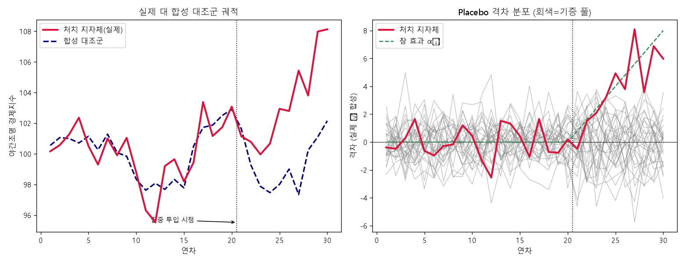
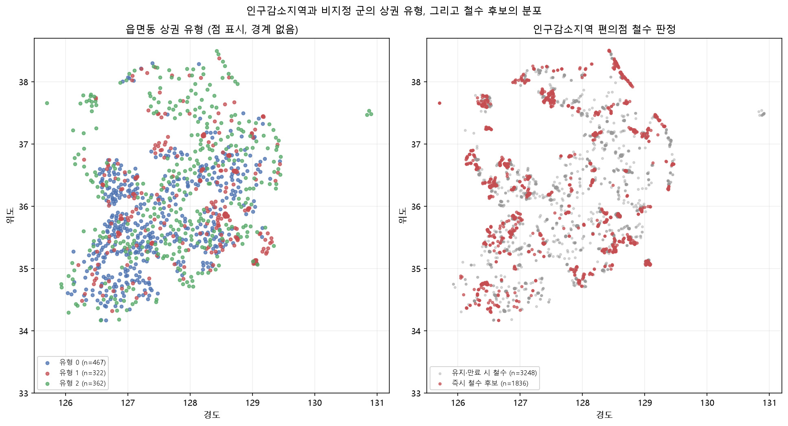

# 13장 지역 쇠퇴 진단과 자원 배분, 지표에서 배분 검증까지

> - 이 장에 나오는 등급 분포, 상관, R², 예측구간, SCM 추정치, 철수 판정 비율은 모두 `lecture_practice/chapter13/`의 코드를 실제로 실행해 얻은 값
> - 예시를 위해 지어낸 숫자는 없음

## 1. 이 장의 핵심 질문

1. **취약성 점수 하나로 지역을 줄 세우면, 그 순위는 가중치를 조금만 바꿔도 흔들리지 않는가**
2. **지금 가장 취약한 지역과 앞으로 가장 더 쇠퇴할 지역은 같은 곳인가**
3. **기금을 넣은 뒤 그 지역이 정말 나아졌는지는 무엇과 비교해서 아는가** — 지원받은 지자체가 하나뿐일 때
4. **같은 지역에서 공공은 지원을 늘리는데 기업은 점포를 정리한다.** 두 결정은 왜 반대 방향인가

- 절차의 순서는 **진단 → 유형화 → 예측 → 배분 → 평가 → 공표**임
- 핵심은 한 문장으로 정리됨 — **취약성 순위 하나만으로는 배분을 결정할 수 없고, 그 순위가 얼마나 흔들리는지와 예측이 얼마나 불확실한지를 함께 봐야 배분 근거가 됨**
- 이 장에는 다른 정책 장에 없는 논점이 하나 더 있음. **"소멸위험지역"이라는 이름을 붙여 발표하는 행위 자체가 그 지역을 더 쇠퇴시킬 수 있음**(11절)

## 2. 도입 사례: 네 실행의 핵심 결과

**① 지표 하나로는 순서를 못 정함** (`13-1-decline-vulnerability-typology.log`)

- 소멸위험지수 등급 분포: 소멸고위험 2곳(0.7%), 위험진입 56곳(18.7%), **주의 169곳(56.3%)**, 보통이상 73곳(24.3%)
- **절반 이상이 애매한 '주의' 구간에 몰려 있어, 이 지표 하나만으로는 그 169곳 안에서 순서를 정할 수 없음.** 복합 지수가 필요한 이유가 이 분포에서 먼저 드러남

**② 프록시를 그대로 쓰면 효과가 눌림** (`13-2-nightlight-economic-decline.log`)

- 야간조명과 (관측되지 않는) 참 경제활동의 상관은 **r = 0.872**
- 야간조명을 그대로 회귀식에 넣으면 표준화 계수가 −0.962에서 −0.838로 **12.9% 0쪽으로 수축**함
- 관측 계수를 상관 r로 나누면 −0.961로 참값에 가깝게 되돌아옴

**③ 처치 단위가 하나여도 반사실을 만들 수 있음** (`13-3-synthetic-control.log`)

- 설계한 참 효과(사후 평균)는 4.40이고 합성통제법이 추정한 사후 평균 격차는 **3.95**(편의 −0.45)
- 31개 단위 중 처치 지자체의 placebo 비율이 1위 → 유사 p값 **0.032**

**④ 적자인데도 버티는 편이 나은 구간이 있음** (`13-4-trade-area-exit-decision.log`)

- 편의점 6,818개 중 즉시 철수 판정 **35.7%**(2,436개), 만료 시 철수 **26.4%**(1,799개), 유지 37.9%
- 두 컷라인 사이의 26.4%는 적자로 갈 것이 뻔한데도 계약 만료까지 버티는 편이 유리함. **되돌릴 수 없는 위약금·원상복구비가 이 간격을 만듦**

## 3. 어느 단위에서, 어떤 인구를 셀 것인가

### 3.1 지정 단위와 진단 단위를 나눈다

- 첫 단계에서 확정할 것이 둘 있음 — 어느 공간 단위에서 계산할지, 어떤 인구를 셀지
- 공간 단위 문제는 **평균이 내부 편차를 지워 버리는 데서 생김**
- 어느 지방 도시의 총인구가 10년째 12만 명 안팎이라면 시 단위 평균으로는 변화율이 거의 0이라 안정 지역으로 분류됨
- 같은 자료를 읍면동으로 내려 보면 달라질 수 있음. 외곽 신도심 동이 3만에서 5만으로 늘어난 만큼 원도심과 농촌 지역이 6만에서 4만으로 줄었다면, **시 평균은 그대로여도 내부 절반은 20년치 쇠퇴를 겪은 셈임**(이 예시는 절차를 보이기 위한 가정값이며 실측이 아님)
- 같은 자료라도 집계 단위를 바꾸면 결론이 달라지는 현상이 **가변적 공간단위 문제**(MAUP)이고, 일반 정의는 4장이 다룸

- 이 상쇄를 막는 장치가 **지정 단위와 진단 단위의 분리**임
- 제도가 자격을 정하는 단위(시군구)와 분석이 위험을 재는 단위(읍면동·격자)를 따로 두고, **진단은 한 단계 아래에서 계산한 뒤 필요할 때만 위로 집계함**
- 집계할 때 무엇으로 가중했는지(면적·인구·사업체) 표에 반드시 적어 둠 — 가중 기준에 따라 순위가 달라짐

### 3.2 주민등록인구인가 생활인구인가

- 주민등록인구는 그 지역에 주소를 둔 사람의 수이고, **생활인구**는 여기에 통근·통학·관광 등으로 그 지역에서 활동하는 인구를 더한 값임
- 「인구감소지역 지원 특별법」(2023년 시행)이 생활인구 개념을 법제화했고, 통계청이 주민등록·외국인등록 자료에 이동통신 위치 자료를 결합해 산정·공표함

| 세는 인구 | 값이 낮게 나오는 지역 | 그 진단에서 나오는 처방 | 놓치는 것 |
| --- | --- | --- | --- |
| 주민등록인구 | 상주인구가 줄어든 모든 지역 | 정주 지원 — 주거·일자리 유치 | 체류·방문이 만드는 경제 활동 |
| 생활인구 | 상주와 체류가 함께 줄어든 지역 | 체류형 경제 — 관광 인프라, 계절 수요 대응 | 야간·주거 기반 생활서비스의 결손 |
| 두 값의 격차 | 상주는 줄고 체류는 유지되는 지역 | 두 인구를 나누어 각각 다른 사업으로 대응 | — |

- **세 번째 행이 진단에서 특히 쓸모가 있음.** 주민등록인구 순위와 생활인구 순위를 함께 산출하고 차이가 큰 지역을 따로 목록으로 남기면, 그 목록이 정주 지원과 체류형 경제 중 무엇을 넣을지 갈리는 지역의 목록이 됨
- 다만 생활인구는 이동통신 기지국 자료를 집계해 산정하므로 **기지국 밀도가 낮은 산간·도서 지역에서는 체류 인구가 과소 집계될 수 있음.** 자료의 공백과 실제 체류의 부재가 값만 보고는 구분되지 않으므로, 결측률이 높은 지역은 주민등록인구 기준 진단을 함께 적어 둠

## 4. 지표를 고르고 대리변수를 확인한다

### 4.1 세 계열의 지표

- 지역 쇠퇴는 하나의 지표로 환원되지 않으므로 성격이 다른 세 계열을 함께 둠

| 계열 | 지표 예시 | 재는 것 | 자료 출처 |
| --- | --- | --- | --- |
| 인구 구조 | 지방소멸위험지수, 생활인구, 고령화율 | 인구 재생산과 유출입의 방향 | 주민등록 인구통계, 생활인구 통계 |
| 경제 기반 | 사업체 밀도, 빈집 수, 야간조명 밝기 | 일자리·유휴 자산·경제활동의 흔적 | 사업체조사, 건축물대장, 위성 야간조명 |
| 생활 여건 | 의료·보육·교통 접근성 | 생활서비스까지의 이동 부담 | 시설 위치 자료 + 도로망 |

- 계열 안에서도 자료의 시간 성질이 갈림. 인구총조사·사업체조사는 조사·집계·공표에 시간이 걸려 **지금 벌어지는 일에 늦게 답함**
- 위성 야간조명은 관측 주기가 짧고 전국을 같은 기준으로 덮어 그 공백을 메움. **두 계열을 같은 지수에 섞을 때는 기준 시점을 반드시 밝힘**

### 4.2 지방소멸위험지수를 뜯어본다

- **지방소멸위험지수**는 한 지역의 20–39세 여성 인구를 65세 이상 인구로 나눈 값임(이상호, 2015)

```
지방소멸위험지수 = (20–39세 여성 인구) / (65세 이상 인구)
```

- **분자와 분모가 다른 시간 방향을 가리킴**
- 분자(20–39세 여성 인구)는 출산의 대부분이 이 연령대에서 일어나므로 **인구 재생산 잠재력의 선행지표**임
- 분모(65세 이상 인구)는 **앞으로 자연감소가 일어날 규모**의 척도임

| 값의 범위 | 등급 | 계산 구조상의 뜻 |
| --- | --- | --- |
| 1.0 이상 | 보통 이상 | 20–39세 여성 인구가 고령 인구와 같거나 많음 |
| 0.5–1.0 | 주의 | 고령 인구가 더 많아지기 시작함 |
| 0.2–0.5 | 소멸위험 진입 | 고령 인구가 젊은 여성 인구의 두 배를 넘음 |
| 0.2 미만 | 소멸 고위험 | 고령 인구가 다섯 배 이상 |

- 지수가 **재지 않는 것이 셋** 있음
  1. 인구 재생산을 20–39세 여성이라는 한 집단의 크기로 환원함 — 출산과 정주의 책임을 특정 성별·연령에 귀속시키는 구성이라는 비판이 있음
  2. 정주 인구의 구성만 세므로 이동과 활동이 빠짐 — 지수가 낮아도 생활인구·관광·통근 기반의 활동이 있을 수 있음
  3. 행정구역 평균이라 3.1의 단위 문제를 그대로 물려받음
- **세 한계 모두 지수를 버릴 이유가 아니라 다른 지표를 함께 둘 이유임** → 6절에서 청년 순이동, 생활서비스 접근성, 사업체 밀도와 결합함

### 4.3 위성 프록시를 그대로 쓰면 효과가 눌린다

- 경제활동은 전기를 씀. 공장이 돌고, 상가 간판이 켜지고, 가로등이 늘고, 주거지가 밝아짐. **야간에 위성이 관측한 불빛의 밝기는 그 지역 경제활동의 물리적 흔적임**(Henderson 외, 2012)
- **위성 경제 프록시**를 x, 관측되지 않는 참값을 x\*라 하면 x = x\* + u로 쓸 수 있음. u가 참값과도 결과와도 무관하면 **고전적 측정오차**라 함
- 이 조건에서 x를 설명변수로 쓴 회귀의 표준화 계수가 참값 회귀의 계수보다 0쪽으로 눌리는 현상을 **측정오차 편의**라 하며, 정확히는 참값 계수에 상관 r을 곱한 값으로 수축함
- **이유는 회귀계수가 공분산을 분산으로 나눈 값인데, 오차 u가 분모의 분산만 키우고 분자의 공분산에는 기여하지 않기 때문임**

- 이 자료에서 실제로 확인된 값
  - 쇠퇴율과 참 경제활동의 표준화 계수는 −0.962
  - 참 경제활동 자리에 야간조명을 대입하면 −0.838로 **12.9%** 0쪽으로 수축함
  - 관측 계수를 상관 r(0.872)로 나누면 −0.961로 참값을 근사 복원함

- 보정을 쓸 때 확인할 항목이 셋임
  - **설명변수로 쓸 때**: 위와 같은 수축이 생김. r로 나누는 보정은 **설명변수가 하나이고 오차가 고전적일 때만** 성립함
  - **결과변수로 쓸 때**: 고전적 오차는 기울기를 눕히지 않고 추정의 분산만 키움. 계수는 그대로이고 신뢰구간이 넓어짐
  - **비고전적 오차**: 오차가 지역 특성과 상관될 때임. 관측 각도, 대기 상태, 조명 규제, 센서 교체가 원인일 수 있음. **이 경우 방향과 크기를 사전에 알 수 없으므로 보정 계수를 쓰지 않고 복수 지표를 병용함**

### 4.4 접근성을 지표로 편입한다

- 접근성 계산 방법 자체는 10장이 다루므로 여기서는 지수에 편입하는 절차만 다룸
- 진단 목적이 **정주 조건의 부담이면 이동시간**을, **공급 총량의 부족이면 2SFCA**를 씀
- **접근성은 집단별로 분해해야 정책에 쓸모가 있음.** 고령자에게는 의료기관과 대중교통이, 아동 가구에는 보육시설과 학교가, 청년에게는 일자리와 여가 시설이 정주의 조건이 됨. 세 집단의 접근성을 하나의 평균으로 합치면 그 평균은 어느 집단의 조건도 대표하지 못함

> **주의.** 같은 "빈집 수"라도 어떤 지자체는 현장 전수조사, 어떤 지자체는 행정대장 추정치임. 지표가 나쁘게 나온 지자체가 실제로 나쁜 것인지 더 꼼꼼히 조사해서 더 많이 기록한 것인지 값만 보고는 구분되지 않음. 지표별로 산출 주체와 조사 방식을 표에 적고, 방식이 섞인 지표는 가중치를 낮추거나 지역 간 비교에서 제외함.

- 방향 정렬도 놓치기 쉬운 지점임. 접근성은 값이 클수록 나쁘고 사업체 밀도는 값이 클수록 좋음. **방향을 맞추지 않고 표준화하면 취약성 점수가 거꾸로 나오는데, 계산은 정상 종료하고 값의 범위도 그럴듯함.** 산출 후 최상위·최하위 지역 서너 곳을 원자료와 대조해 방향이 맞는지 확인함

## 5. 실습 안내

- 실습 코드
  - `lecture_practice/chapter13/code/13-0-simdata-prep.py` — 시군구 취약성 지수용 시뮬레이션 자료 준비
  - `lecture_practice/chapter13/code/13-0b-trade-area-data-prep.py` — 상가(상권)정보 실데이터 정리
  - `lecture_practice/chapter13/code/13-1-decline-vulnerability-typology.py` — 취약성 지수 산정과 유형화
  - `lecture_practice/chapter13/code/13-2-nightlight-economic-decline.py` — 야간조명 프록시·쇠퇴 예측·불확실성
  - `lecture_practice/chapter13/code/13-3-synthetic-control.py` — 기금 집중 투입의 합성통제법 평가
  - `lecture_practice/chapter13/code/13-4-trade-area-exit-decision.py` — 상권 세분화와 점포 철수 판정
- 결과 로그: `lecture_practice/chapter13/results/*.log`

- GPU가 필요 없음 — 표준화·군집·회귀·최적화 규모의 계산이라 CPU로 충분함
- 앞의 세 실습은 교육용 시뮬레이션이고, **13-4만 실데이터(상가정보 2026년 6월 스냅숏)를 씀**

## 6. 복합 취약성 지수를 만든다

### 6.1 지표가 여럿이면 순서가 정해지지 않는다

- 지역 두 곳을 비교함. 첫 지역은 소멸위험지수가 0.44이고 생활서비스까지 37분, 둘째 지역은 지수가 0.57이고 서비스까지 31분임
- 인구 구조로도 생활 여건으로도 첫 지역이 나쁨. 그런데 **첫 지역의 사업체 밀도가 둘째보다 높다면 어느 쪽을 먼저 지원할지 지표 하나로는 정해지지 않음**
- 지표가 넷이면 지역 쌍마다 서로 다른 축에서 서로를 앞서는 상황이 생기고, 지원 순서는 그 상충을 어떻게 처리하는가로 정해짐
- **복합 지수**는 이 상충을 하나의 규칙으로 고정함. **지수가 하는 일은 정보를 늘리는 것이 아니라 줄이는 것임** — 지표 공간을 1차원으로 사영하면 축 사이의 상충 정보가 사라지고 그 자리에 가중치라는 선택이 들어감

### 6.2 다섯 단계 산정

1. **변수 선택** — 세 계열에서 각각 최소 하나씩 고름
2. **방향 정렬** — 값이 커질 때 취약해지는지 확인하고, 반대이면 부호를 뒤집음
3. **표준화** — 단위가 다른 지표를 같은 척도로 옮김
4. **가중치 부여** — 각 지표가 점수에 기여하는 비중 wₖ를 정함(합이 1)
5. **결합** — 표준화값과 가중치를 결합해 점수를 만듦

```
Vᵢ = Σₖ wₖ · zᵢₖ
```

- 표준화 방식은 셋이고 **이상치에 다르게 반응함**

| 방식 | 계산 | 산출 범위 | 이상치의 처리 |
| --- | --- | --- | --- |
| z-점수 | (x − 평균) / 표준편차 | 제한 없음 | 이상치가 큰 값으로 남아 점수를 지배함 |
| min-max | (x − 최솟값) / (최댓값 − 최솟값) | 0~1 | 최댓값 한 지역이 나머지 전체의 척도를 정함 |
| 순위 변환 | 순위를 0~1로 환산 | 0~1 | 간격 정보를 버리고 순서만 남김 |

- **결합 방식도 결과를 바꿈.** 가중합에서는 한 지표의 결손을 다른 지표의 여유가 상쇄함
- 응급의료 접근성이 임계 밖인 지역처럼 **한 축이 무너지면 다른 축으로 메울 수 없는 결정**에서는 상쇄를 제한해야 함. 이때 쓰는 결합이 기하평균이며, 한 항이 0에 가까우면 다른 항의 크기와 무관하게 전체 값이 0에 가까워짐

### 6.3 계산 예

- 절차를 숫자로 한 번 밟아 봄. **예를 들어** 지역 네 곳의 지표가 다음과 같다고 하자(이 값은 절차를 보이기 위한 예시이며 실측값이 아님). 가중치는 이 자료의 실행에서 실제로 쓴 값(소멸위험 0.35, 청년유출 0.20, 서비스접근 0.25, 사업체 0.20)을 그대로 씀

| 지역 | 소멸위험지수 | 청년 순이동률 | 서비스접근(분) | 사업체밀도 | Vᵢ | 순위 |
| :--: | :--: | :--: | :--: | :--: | :--: | :--: |
| 가 | 0.42 | −2.8 | 38 | 22 | 1.00 | 1 |
| 나 | 0.75 | −0.5 | 41 | 30 | 0.33 | 2 |
| 다 | 0.50 | −2.2 | 22 | 55 | 0.11 | 3 |
| 라 | 1.20 | 1.4 | 16 | 70 | −1.44 | 4 |

- **2위와 3위의 간격이 0.22로 좁음.** 지역 나는 생활서비스가 가장 멀고 인구 구조는 중간, 지역 다는 인구 구조가 나쁘고 생활서비스는 가까움
- **두 지역의 순서는 인구 축과 생활 여건 축 중 어디에 더 큰 비중을 두었는가로 정해진 것이지 자료가 정한 것이 아님**

### 6.4 적용 조건

- **지표 간 상관**: 두 지표의 상관이 0.9에 가까우면 같은 것을 두 번 세는 셈이 됨. 상관행렬을 함께 싣고, 상관이 높은 쌍은 하나를 빼거나 가중치를 재배분함
- **지표 수**: 지표가 셋 이하면 가중치 하나의 변화가 순위를 크게 흔듦. 열 개를 넘으면 순위는 안정되지만 어느 축에서 나온 순위인지 해석하기 어려워짐
- **결측**: 결측 지표를 평균으로 채우면 그 지역이 중간 순위로 밀림. 결측 지역은 별도 목록으로 남기거나 나머지 가중치를 재정규화했다는 사실을 표기함

### 6.5 가중치 민감도 검사

- **지수의 순위는 가중치를 바꾸면 뒤집힘.** 기준 가중치 하나로 산출한 순위표에는 이 흔들림이 남지 않으므로, 순위를 배분 근거로 쓰려면 민감도 검사를 함께 보고해야 함

1. **기준 순위 산출** — 확정한 가중치로 점수와 순위를 계산함
2. **가중치 흔들기** — 각 가중치를 ±30% 범위에서 바꾼 조합으로 순위를 다시 산출함. 지표가 다섯을 넘으면 무작위 조합 1,000회로 대체함
3. **일치도 측정** — 기준 순위와 대안 순위의 스피어만 상관, 상위 20위 집합의 Jaccard 지수, 지역별 순위 변동 폭을 계산함
4. **판정** — 상위 집합이 유지되면 순위를 배분 근거로 씀. 유지되지 않으면 순위 대신 유형화(7절) 결과로 배분을 설명함

- **판정 기준은 미리 문장으로 적어 둠.** "상위 20위 집합의 Jaccard가 0.8을 밑돌면 지수 단독 순위를 배분 근거로 쓰지 않는다"는 식임. **결과를 본 뒤에 기준을 정하면 그 기준은 판정이 아니라 사후 해석이 됨**
- **예를 들어** 6.3의 예시에서 인구 구조에 더 큰 비중을 두어 가중치를 소멸위험 0.45, 청년유출 0.20, 서비스접근 0.15, 사업체 0.20으로 바꾸면 지역 나(2위)와 다(3위)가 자리를 바꿈. 1위와 4위는 네 지표 모두에서 같은 방향이므로 가중치와 무관하게 자리를 지킴
- **순위 전체가 흔들리는 게 아니라, 축마다 다른 방향인 중간 구간의 지역이 흔들린다는 것**이 민감도 검사에서 읽어야 할 형태임

> **주의.** 표는 정상적으로 출력되고 값의 범위도 그럴듯하지만, 기준 가중치 하나만 보면 이 흔들림이 전혀 드러나지 않음. 가중치를 흔든 순위와 기준 순위의 스피어만 상관, 상위 20 집합의 Jaccard를 반드시 함께 보고함.

## 7. 지역을 유형으로 묶는다

### 7.1 지수와 유형이 답하는 질문

- 지수가 지역을 한 줄로 세우는 반면 **유형화는 부족한 것이 서로 다른 지역을 서로 다른 묶음으로 나눔**
- **지수는 "누구를 먼저 지원할 것인가"에 답하고, 유형은 "무엇을 줄 것인가"에 답함**
- 6.3의 예시에서 지역 나와 다는 점수가 0.33과 0.11로 가까웠지만 결손의 위치가 달랐음. 나는 생활서비스가 멀고 다는 청년이 빠져나감. **순위표만 보면 두 지역에 같은 패키지를 배정하게 되지만**, 유형을 함께 보면 나에게는 생활서비스 거점이, 다에게는 일자리가 먼저임

### 7.2 알고리즘을 고른다

| 알고리즘 | 군집의 형태 가정 | 군집 수 | 이 조건에서 고른다 |
| --- | --- | --- | --- |
| KMeans | 구형, 크기가 비슷함 | 미리 지정 | 지역 수가 수백 이상이고 유형 수를 정책적으로 미리 정한 경우 |
| 계층적 군집 | 없음 | 사후 결정 | 지역 수가 수십 수준이거나 유형 수를 미리 정할 근거가 없는 경우 |
| 가우시안 혼합 | 타원형 | 미리 지정 | 지표 간 상관이 커서 군집이 축에 기울어져 있고, 소속 확률이 필요한 경우 |
| DBSCAN | 없음(밀도 기반) | 자동 | 대부분이 연속 스펙트럼 위에 있고 소수의 이례 지역만 분리하려는 경우 |

- **표준화가 선택이 아니라 필수임.** 사업체 밀도가 20~70이고 청년 순이동률이 −3~2인 자료를 그대로 넣으면 군집이 사실상 사업체 밀도 하나로 정해짐
- 로그 변환은 변수마다 갈림. 점포 수처럼 값이 몇 자릿수에 걸쳐 분포하는 변수는 로그를 취해야 상위 소수가 거리를 독점하지 않고, 비율이나 지수처럼 이미 유계인 변수에는 취하지 않음

### 7.3 군집 수는 실루엣으로 정한다

- **실루엣 계수**를 후보 범위에서 계산해 최대가 되는 값을 고름. 각 관측이 자기 군집 안의 평균 거리와 가장 가까운 다른 군집까지의 평균 거리를 비교한 값이며, 1에 가까우면 잘 분리된 것이고 0에 가까우면 경계가 모호한 것임
- `13-4-trade-area-exit-decision.log`의 읍면동 상권 자료에서 k = 2부터 8까지의 실루엣은 0.182, **0.212**, 0.195, 0.188, 0.175, 0.167, 0.171로 k = 3에서 최대
- **최댓값의 위치와 크기를 나누어 읽어야 함.** 위치는 k = 3을 가리키지만 크기 0.212는 높은 값이 아님. 읍면동 상권이 뚜렷하게 갈라진 덩어리로 존재하지 않고 **연속 스펙트럼을 세 구간으로 자른 결과에 가깝다는 뜻**임
- 실루엣이 낮을 때는 라벨을 유형별 평균의 차이를 보고하고 정책 패키지를 배정하는 데는 쓰되, **개별 지역의 소속을 확정적 분류로 유통하지 않음**

### 7.4 세 가지 진단

- **라벨이 만들어졌다고 유형이 존재하는 것은 아님.** 세 가지를 계산해 함께 보고함

| 진단 | 계산 | 판정 | 실측값(13-4) |
| --- | --- | --- | --- |
| 안정성 | 시드를 바꿔 재군집한 뒤 라벨 쌍의 **조정 랜드 지수**(ARI) | 값이 낮으면 초기값이 유형을 정한 것이므로 라벨을 쓰지 않음 | 시드 10개 평균 ARI **1.000** |
| 퇴화 | 단일 변수의 분위 라벨과 군집 라벨의 ARI | 1에 가까우면 군집이 그 변수의 구간 구분과 같으므로 군집을 돌릴 이유가 없음 | 점포 수 분위 라벨과 ARI **0.320** |
| 유의성 | 라벨을 무작위로 섞어 유형 간 격차를 재계산하는 순열추론 | 관측 격차가 무작위 분포 안에 들어오면 유형 차이를 보고하지 않음 | 세 지표 모두 **p = 0.001** |

- **두 번째 행이 유형화에서 가장 자주 놓치는 진단임.** 지표 여러 개를 넣어 군집을 돌려도 결과가 규모 변수 하나를 세 구간으로 자른 것과 같을 수 있음
- 이 자료에서 점포 수 분위 라벨과의 ARI는 0.320으로 규모와 상관은 있으나 같지 않음. 업종 구성과 다양성이 라벨에 독립적으로 기여했다는 뜻이며, **이 값이 0.9를 넘었다면 유형이 아니라 규모 구간이라는 이름으로 보고하는 편이 정확함**

### 7.5 유형별 프로필

| 유형 | 지역 수 | 소멸위험지수 | 청년순이동 | 서비스접근(분) | 사업체밀도 | 취약성 |
| :--: | :--: | :--: | :--: | :--: | :--: | :--: |
| 1 | 41 | 0.44 | −2.66 | 37.3 | 24.8 | 1.23 |
| 3 | 89 | 0.57 | −1.36 | 31.3 | 39.6 | 0.59 |
| 2 | 112 | 0.83 | 0.02 | 23.3 | 54.4 | −0.24 |
| 0 | 58 | 1.32 | 1.53 | 15.4 | 68.2 | −1.29 |

- **네 유형이 네 지표에서 모두 같은 순서로 배열됨.** 이 배열은 자료가 도시-농촌 경사를 따라 설계된 결과이며, **실제 자료에서 이런 배열이 나오면 7.4의 퇴화 검사가 필요한 전형적 조건임**
- 유형별 정책 패키지는 각 행에서 전체 평균과 가장 크게 벌어진 지표로 정함. 유형 1은 서비스접근 37.3분과 사업체밀도 24.8이 함께 나쁘므로 생활서비스 거점과 교통이 먼저이고, 유형 3은 청년 순이동 −1.36이 두드러지므로 일자리와 주거가 먼저임

## 8. 쇠퇴를 예측하고 불확실성을 잰다

### 8.1 공간 시차와 블록 교차검증

- 예측 대상은 다음 기간 쇠퇴율이고, 입력은 현재 시점의 행정지표와 위성 프록시에 **이웃 지역의 값을 요약한 열**을 더한 것임
- 근거는 **쇠퇴가 행정구역 경계 안에 갇히지 않는다는 데 있음.** 상권과 통근은 생활권 단위로 묶이므로, 인접 시군구의 상권이 축소되면 그 영향이 통근·소비를 통해 넘어옴
- 무작위로 자료를 나누면 인접 지역이 학습·검증 집합에 나뉘어 들어가고, 두 지역의 값이 닮아 있어 검증 성능이 실제보다 높게 나옴. **공간 블록 교차검증**은 자료를 공간 덩어리 단위로 나누어 이 누출을 막음(설계 절차는 11장이 다룸)
- **공간 시차를 넣을지는 이 검증으로 판정함**

| 피처 구성 | R² |
| --- | :---: |
| 비공간(야간조명 + 행정지표) | 0.830 |
| + 공간 시차 피처 | 0.887 |

- R²가 0.057 올랐으므로 공간 시차 구성을 채택함. **개선이 없거나 음수였다면 공간 시차를 뺐을 것임**
- 피처 중요도는 이웃 쇠퇴율 0.713, 사업체 밀도 0.103, 고령화율 0.099, 야간조명 0.050, 이웃 야간조명 0.035
- 야간조명 두 열의 합(0.085)이 행정지표 각각보다 작다고 해서 프록시가 쓸모없다는 뜻은 아님. **야간조명의 기여는 예측력의 크기가 아니라 가용성에서 나옴** — 행정지표가 갱신되지 않은 지역, 조사 대상에서 빠진 지역에서는 야간조명 열만 채워짐

### 8.2 예측구간과 신뢰등급

- 점예측만으로는 자원 배분을 판정할 수 없음. **같은 예측 쇠퇴율이라도 예측구간이 좁은 값과 넓은 값은 다르게 다뤄야 함**
- **정규화 conformal 예측**은 out-of-fold 잔차로 지역별 예상 오차 규모 σ̂ᵢ를 적합하고, 정규화 잔차의 분위수 q를 곱해 지역마다 다른 폭을 만듦(유도는 11장이 다룸)
- 이 자료의 실행에서 90% 구간의 경험적 포함률은 **0.903**으로 목표에 부합했고, 구간 반폭은 중앙값 **1.21%p**, 범위 **[0.35, 3.61]**임. **같은 90% 구간이라도 지역에 따라 폭이 열 배 가까이 갈림**

| 우선순위 | 시군구 | 예측 쇠퇴율(%p) | 구간 반폭(%p) | 신뢰등급 |
| :--: | :--: | :--: | :--: | :--: |
| 1 | 246 | 10.428 | 3.139 | 낮음 |
| 2 | 204 | 9.600 | 1.018 | 높음 |
| 3 | 188 | 8.539 | 0.725 | 높음 |
| 6 | 219 | 8.457 | 1.474 | 낮음 |

- 1순위 시군구 246의 구간 반폭이 3.139%p로 상위 10곳 중 가장 넓음. **구간 하한(7.289)이 2순위의 점추정(9.600)보다 낮으므로 두 지역의 순서가 예측 오차 범위 안에서 뒤집힐 수 있음**
- 가장 쇠퇴가 심하다고 지목된 지역이 동시에 가장 불확실한 경우이며, **조치는 순위를 내리는 것이 아니라 투자 확정 전에 추가 관측과 현장 확인으로 불확실성을 줄이는 것임**

> **주의.** 같은 out-of-fold 잔차로 σ̂를 적합하고 분위수까지 정하면 포함률이 목표보다 낙관적으로 나옴. 엄밀한 실무는 학습·보정·시험을 3분할함.

## 9. 제도 조건을 반영해 우선순위표를 만든다

### 9.1 제도 문서에서 읽을 네 항목

- 예로 드는 제도는 **지방소멸대응기금**(인구감소지역에 2022년부터 10년간 매년 1조원 규모를 배분하는 재정 지원)과 인구감소지역 지정임

| 제도 조건 | 확인할 내용 | 분석에서의 위치 |
| --- | --- | --- |
| 대상 자격 | 인구감소지역 89곳의 목록, 지정 갱신 주기 | 후보 집합의 정의. 지수를 계산하기 전에 모집단을 자름 |
| 배분 단위 | 시군구로 배분하고 읍면동·생활권 사업으로 집행 | 진단 단위와 집행 단위의 분리, 집계 가중치 선택 |
| 기간과 회계연도 | 2022년부터 10년, 연 단위 배분과 정산 | 예측 시계와 평가 시계를 제도 주기에 맞춤 |
| 성과지표 요구 | 사업별 성과지표의 종류와 보고 주기 | 지표 조작 가능성 점검(11절), 복수 지표 설계 |

- **첫 행의 순서가 특히 중요함.** 후보 집합을 먼저 자르지 않고 전국 지역에 대해 지수를 계산하면, 순위 상위에 배분 대상이 아닌 지역이 섞이고 그 지역을 제외한 뒤의 순위가 원래 순위와 달라짐. **표준화가 모집단에 의존하기 때문임**

### 9.2 우선순위표의 열 구성과 조치

| 열 | 이 열이 답하는 것 |
| --- | --- |
| 취약성 점수 Vᵢ와 순위 | 현재 얼마나 취약하고 후보 집합 안에서 몇 번째인가 |
| 순위 변동 폭 | 가중치를 흔들면 이 순위가 얼마나 움직이는가 |
| 유형 | 무엇이 부족한 지역인가 |
| 예측 쇠퇴율·구간·신뢰등급 | 앞으로 얼마나, 그 예측을 얼마나 믿을 수 있는가 |

- **순위 변동 폭과 신뢰등급이 앞선 순위표와 이 표를 구분함.** 점수와 순위만 실은 표는 그 값이 얼마나 확정적인지를 담지 않으므로, 읽는 사람이 모든 행을 같은 신뢰도로 취급하게 됨

| 순위 | 신뢰등급 | 순위 변동 폭 | 조치 |
| --- | --- | --- | --- |
| 상위 | 높음 | 작음 | 배분 대상으로 확정 |
| 상위 | 낮음 | 작음 | 순위는 유지하고 현장 확인 뒤 확정 |
| 상위 | 무관 | 큼 | 유형별 배분으로 전환 |
| 하위 | 낮음 | 큼 | 표본 확인 후 하위 유지 여부를 판정 |
| 하위 | 높음 | 작음 | 정기 모니터링 |

- 세 번째 행은 6.5의 민감도 검사와 연결됨. **상위 20 집합의 Jaccard가 판정 기준을 밑돌면 그 표의 순위 열은 배분 근거로 쓰지 않고**, 유형 열과 예측 열만 남겨 유형별 패키지 배정으로 전환함

## 10. 정책효과를 합성통제법으로 평가한다

### 10.1 비교할 평균이 없을 때

- 기금이 특정 한 지자체의 거점 조성 사업에 집중 투입되었다고 하자. **이중차분법은 처치 집단과 대조 집단의 평균 변화량을 비교하는데, 처치 집단이 하나뿐이면 평균을 낼 대상이 없음**
- 분석자가 비슷해 보이는 이웃 군 하나를 눈으로 골라 비교하면 **어느 군을 골랐는가가 결론을 정함**
- **합성통제법**(SCM)은 이 선택을 자료 기반 최적화로 대체함(Abadie & Gardeazabal, 2003; Abadie 외, 2010). 입력은 처치 단위 1개와 **기증 풀**(처치받지 않은 통제 단위들의 집합)이고, 출력은 연차별 격차와 사후 평균 효과임

### 10.2 볼록조합 제약

- 합성 대조군은 기증 단위들의 가중조합이며, 가중치에 두 제약을 검

```
Σⱼ wⱼ = 1,   wⱼ ≥ 0
```

- 이 제약은 **합성값을 기증 풀 관측값의 범위 안에 가둠**
- **예를 들어** 기증 단위 셋의 어느 해 값이 90, 110, 105라면, 가중치가 음이 아니고 합이 1일 때 합성값은 반드시 90 이상 110 이하가 됨
- 제약을 풀어 w = (1.5, −0.5, 0)을 허용하면 합성값이 1.5 × 90 − 0.5 × 110 = 80이 되어 **어느 기증 단위도 관측한 적 없는 수준**이 나옴. 이 값을 반사실로 쓰면 자료가 지지하지 않는 외삽 위에서 효과를 재게 됨

### 10.3 절차와 두 진단

1. **기증 풀 구성** — 처치받지 않았고 처치의 영향도 받지 않은 단위를 모음
2. **사전기간 적합** — 처치 전 기간에서 처치 단위의 궤적을 가장 잘 재현하는 가중치를 찾음
3. **반사실 연장** — 찾은 가중치를 처치 후 기간에도 그대로 적용해 처치가 없었을 때의 궤적을 만듦
4. **격차와 진단** — 실제 궤적과 합성 궤적의 사후 격차를 효과로 읽되, 두 진단을 통과할 때만 그렇게 읽음

- **사전 적합도**: 사전기간 RMSPE가 관측 잡음 수준까지 내려왔는지 봄. **사전 적합이 나쁘면 사후 격차를 효과로 읽을 근거가 없음**(Abadie, 2021)
- **placebo 순열추론**: 처치 단위가 하나라서 고전적 신뢰구간을 쓸 수 없으므로, 기증 풀의 각 단위를 차례로 가짜 처치로 두고 같은 계산을 반복함. 사후 RMSPE를 사전 RMSPE로 나눈 비율로 처치 단위의 순위를 봄

- `13-3-synthetic-control.log`의 실행 결과 — 31개 지자체(처치 1 + 기증 풀 30)의 30년 패널, 처치는 20년차에 시작, 참 효과(설계값)는 사후 평균 4.40

| 항목 | 값 | 판정 |
| --- | :---: | --- |
| SCM 가중치 상위 | #3=0.473, #18=0.157, #9=0.138 등(Σ=1.000) | 소수 단위에 가중이 몰림 |
| 사전 RMSPE | 1.090 | 관측 잡음 SD 1.3보다 작음 — 사전 궤적을 잡음 한계까지 재현 |
| 사후 RMSPE | 4.658 | 사전의 4.27배 |
| 사후 평균 격차 | 3.95 | 참값 4.40을 근사 복원(편의 −0.45) |
| placebo 순위·유사 p값 | 1/31 = 0.032 | 31개 단위 중 1위 |

- **두 진단을 통과했으므로 사후 평균 격차 3.95를 그 지자체의 국소 인과효과로 읽음. 읽을 수 있는 범위는 여기까지임**



**그림 13.1** 처치 지역의 실제 궤적과 합성통제 궤적(왼쪽), placebo 격차 분포(오른쪽)

### 10.4 가중치는 하나로 정해지지 않는다

- 자료를 생성할 때 실제로 쓴 기증 단위는 #3·#8·#16·#24인데, **이 넷에 실린 SCM 가중의 합은 0.489로 절반에 못 미치고** 나머지가 다른 단위에 분산됨
- 사전 적합은 잡음 한계까지 좋았으므로, **이 분산은 적합의 실패가 아니라 해가 하나로 정해지지 않는다는 성질에서 나옴**
- **SCM이 식별하는 것은 어느 단위가 비교 대상인가가 아니라 사전 궤적의 재현임**(Abadie, 2021). 보고서에는 가중치를 재현 정보로 싣되, 특정 지역이 비교 대상으로 선정되었다는 해석을 붙이지 않음

- 네 가지 한계
  - **단일 사례성** — SCM이 식별하는 것은 그 지자체 하나의 효과임. 전국에 배분하면 같은 크기의 효과가 난다는 결론으로 늘려 읽을 수 없음
  - **파급과 사전 반응** — 거점 조성이 인접 지자체의 상권·고용까지 움직이면 기증 풀이 처치의 영향을 받음
  - **사전 적합의 과적합** — 사전기간이 짧고 기증 풀이 크면 잡음까지 맞추어 사전 적합이 인위적으로 좋아짐
  - **볼록껍질 밖의 처치 단위** — 처치 단위의 사전 궤적이 기증 풀의 범위 밖에 있으면 사전 적합이 충분한 조합이 아예 존재하지 않음

## 11. 공표 전에 점검한다

### 11.1 공표가 결과를 바꾼다

- 다른 분석에서는 공표가 절차 밖의 보고 행위지만, **지역 쇠퇴 진단에서는 공표가 결과를 바꾸는 계산 단계임**
- Merton(1948)은 처음에는 거짓이던 예측이 공표된 뒤 사람들의 행동을 바꾸어 실제 결과가 되는 과정을 **자기실현적 예언**으로 정리함
- 어느 지역이 소멸위험 명단에 올라 보도되면 금융기관은 담보 대출을 줄이고, 기업은 투자를 보류하며, 이주를 검토하던 가구는 결정을 앞당김. **몇 년 뒤 자료에는 예측과 일치하는 쇠퇴가 기록되지만, 그 일치는 예측의 정확도가 아니라 공표의 효과에서 나온 부분을 포함함**

| 장 | 되먹임의 경로 | 왜곡되는 것 |
| --- | --- | --- |
| 11장 | 예측이 순찰을 보내고, 순찰이 적발을 늘리고, 그 기록이 다시 예측에 들어감 | 데이터의 생산 |
| 12장 | 행정의 접촉이 있는 곳의 곤궁만 기록됨 | 데이터의 관측 |
| 13장 | 공표된 예측이 대출·투자·이주 결정을 바꿈 | 현실의 궤적 |

- **앞의 두 되먹임은 자료가 왜곡되고 세상은 그대로이므로 분석적 보정으로 다룰 수 있음. 이 장의 되먹임은 자료가 정확하고 세상이 바뀌므로 보정할 대상이 없음.** 대응은 분석 단계가 아니라 공표 단계에 놓임

### 11.2 공표 원칙

| 원칙 | 실행 내용 |
| --- | --- |
| 공표 수준의 분리 | 내부 배분에 쓰는 지역별 점수·순위와 대외 공표물을 분리함 |
| 라벨 언어의 설계 | 소멸 예정지 같은 종결형 명명 대신 우선지원 지역처럼 개입을 담은 명명을 씀 |
| 지표와 지원의 동시 발표 | 취약성 순위를 단독으로 내보내지 않고 확정된 투자 패키지와 함께 발표함 |
| 포기 근거로의 사용 금지 | 순위표의 목적을 지원 순서 결정으로 한정하고 하위 지역의 지원 제외 근거로 쓰지 않음 |

- **첫 원칙이 나머지 셋의 전제임.** 지역별 점수와 순위 원자료가 그대로 나가면 언어를 어떻게 설계하든 시장은 순위를 읽음

### 11.3 성과지표는 목표가 되면 지표이기를 멈춘다

- 기금 사업의 성과를 연간 전입자 수로 재기로 했다면, **의도한 경로는 정주 여건이 개선되어 사람들이 실제로 이주해 오는 것**이지만 **왜곡된 경로는 전입 지원금과 주소 이전 캠페인으로 전입 신고만 늘리는 것**임
1. **조작 비용 산정** — 지표 후보마다 "이 값을 올리는 가장 값싼 방법은 무엇인가"를 한 줄로 적음. 정책 목표와 무관하면 지표를 바꾸거나 보조 지표를 붙임
2. **복수 지표 병행** — 신고 기반 지표(전입자 수)와 행동 기반 지표(생활인구 체류시간, 야간조명)를 함께 둠. **서류만 움직이고 사람이 움직이지 않으면 두 계열의 값이 어긋나므로, 그 괴리 자체를 감사 항목으로 삼음**
- 소지역 공표에는 재식별 점검이 붙음. 읍면동 × 성별 × 연령대 × 수급 여부로 교차 집계한 셀에 해당자가 한두 명뿐이면 집계표라는 형식에도 불구하고 그 사람의 정보가 드러나므로, **최소 셀 크기 기준을 정하고 미만 셀은 공표하지 않음**

| 범주 | 지표 | 확인 주기 |
| --- | --- | --- |
| 지수 안정성 | 자료 갱신 후 재산출한 순위와 직전 순위의 스피어만 상관 | 자료 갱신 시 |
| 예측 성능 | 블록 CV R², 예측구간 실제 포함률 | 자료 갱신 시 |
| 유형 안정성 | 재군집 라벨과 직전 라벨의 ARI | 연 |
| 지표 조작 | 신고 기반 지표와 행동 기반 지표의 괴리 | 반기 |
| 공표 되먹임 | 공표 이후 대상 지역의 담보 대출·전입·사업체 등록의 추세 변화 | 연 |

- **마지막 행이 이 장에서 특히 중요함.** 공표 되먹임은 공표 시점을 경계로 한 추세 변화로 나타나므로, **공표 전후 자료를 같은 정의로 이어 두지 않으면 사후에 잴 수 없음**

## 12. 사례 전체: 상권 세분화와 점포 철수 결정

- 앞 절들은 공공의 질문에 답함. 이 절은 같은 지역에서 기업이 푸는 문제를 다룸
- 민간이 출점 후보지를 고를 때는 수익이 가장 큰 입지를 찾음. **공공의 개입 지점은 정확히 그 순위의 반대쪽** — 마지막 마트가 문을 닫은 면 지역, 분만 산부인과가 사라진 군임
- 인구감소지역에서 기업의 질문은 어디에 새로 열지가 아니라 **어느 점포를 닫을지**임. 그리고 폐점 판단은 "이 점포가 적자인가"로 끝나지 않음
- **실제 질문은 닫는 비용과 버티는 비용 중 무엇이 큰가임.** 계약이 2년 남은 점포를 지금 닫으면 손실은 멈추지만 중도해지 위약금과 원상복구비가 듬. 이 두 비용의 합이 남은 손실의 현재가치보다 크면 계약 만료까지 유지하는 편이 나음
- Dixit(1989)는 산출물 가격이 불확실할 때 진입과 철수가 각각 다른 방아쇠 가격에서 일어나며 **철수 방아쇠가 손익분기보다 아래에 놓인다**는 것을 보임. 두 방아쇠 사이의 간격이 **철수 임계**를 만드는 이력현상이고, 인구감소지역의 점포망에서는 **적자이면서 아직 문을 닫지 않은 점포의 무리**로 관측됨

### 12.1 자료와 증명 범위

- 자료는 소상공인시장진흥공단 상가(상권)정보 2026년 6월 기준 스냅숏. 전국 2,772,484개 점포에서 인구감소지역 89곳과 비지정 군 지역의 점포 370,491개(인구감소지역 292,738, 비지정 군 77,753)를 골라 읍면동 1,151개의 상권 지표를 만듦
- **이 자료에 없는 것이 셋이고, 그 셋이 분석의 형태를 정했음**
  - **매출이 없음** — 잔존 수익을 상권 배분 지수로 대리함
  - **읍면동 인구가 없음** — 배후 규모를 점포 구성으로 대리함
  - **시점이 하나뿐임** — 폐업률(흐름)을 셀 수 없어 공백(상태)으로 대체함. **공백은 원래 없었던 곳과 있었는데 사라진 곳을 구분하지 못함**

### 12.2 읍면동 상권 유형화와 생활서비스 실측

- 상권을 등급으로 줄 세우는 대신 구성이 비슷한 상권끼리 묶는 작업을 **상권 세분화**라 함
- 피처 아홉 개(규모, 업종 다양성, 체인 비율, 상위 업종 구성비)로 실루엣 최대(k=3, 0.212), 안정성(ARI 1.000), 퇴화 검사(ARI 0.320)를 통과한 유형을 만듦

| 유형 | 읍면동 수 | 점포 수 중앙값 | 편의점 보유 | 약국 보유 | 의원 보유 |
| :--: | :--: | :--: | :--: | :--: | :--: |
| 0 | 467 | 58 | 55.5% | 29.6% | 12.6% |
| 2 | 362 | 142 | 79.8% | 43.1% | 25.7% |
| 1 | 322 | 652 | 99.7% | 96.0% | 80.7% |

- 오른쪽 세 열을 뒤집으면 공백률이 됨. 편의점 공백은 전체 24.5%, 약국 47.6%, 의원 64.2%
- **편의점은 배후 수요가 가장 작아도 유지되고, 의원은 의료인의 정주와 최소 진료량을 함께 요구해 문턱이 가장 높음.** 유형 라벨을 무작위로 1,000회 섞어 재계산해도 이 격차가 재현되지 않아(세 경우 모두 p = 0.001), 격차가 군집 구조에서 나온 것임을 확인함

- 89곳을 서울 자치구와 비교하면 지정 여부가 아니라 도시-농촌 차이를 재게 되므로 **군 지역끼리만 비교함**(군 지역 823개, 지정 708 / 비지정 115)

| 생활서비스 | 지정 | 비지정 | 차이 |
| :--- | :---: | :---: | :---: |
| 편의점 없음 | 30.4% | 9.6% | +20.8%p |
| 약국 없음 | 54.8% | 29.6% | +25.2%p |
| 의원 없음 | 72.2% | 42.6% | +29.6%p |

- 격차는 크고 세 서비스 모두 같은 방향(순열 p = 0.001)이지만, **남은 비지정 군 13곳은 대도시 배후지이거나 계획적 개발을 받은 군이 많음**
- 대조 가능한 비지정 군이 처치 단위의 특성 범위를 덮지 못하므로 **이 격차를 지정의 효과로 읽을 근거는 없음.** 읽을 수 있는 것은 지정 지역과 남은 비지정 군 사이에 이만한 서비스 격차가 있다는 기술적 사실까지임

### 12.3 철수 판정과 두 컷라인 사이의 간격

- 대상은 편의점 6,818개. 금액을 지어내지 않고 고정비를 1로 두는 무차원 비율로 계산함. 파라미터는 임대료 비중 0.35, 위약금 비율 0.30, 원상복구비(월 임대료의 4배), 월 할인율 0.005, 월 수요 감소율 −0.005, 잔여 계약 24개월(**전부 가정값**)
- 관측되는 값은 **상권 배분 지수** s = (읍면동 총 점포 수) ÷ (읍면동 편의점 수) 하나. 실측값은 중앙값 48.73, 범위 [7.00, 290.50]

| 판정 | 조건(관측 단위) | 점포 수 | 비율 |
| :--- | :--- | :---: | :---: |
| 즉시 철수 | s < 42.79 | 2,436 | 35.7% |
| 만료 시 철수 | 42.79 ≤ s < 54.96 | 1,799 | 26.4% |
| 유지 | s ≥ 54.96 | 2,583 | 37.9% |

- **여기서 읽을 것은 비율이 아니라 두 컷라인 사이의 간격임.** s가 두 컷라인 사이인 점포 1,799개(26.4%)는 적자로 갈 것이 예상되는데도 계약 만료까지 유지하는 편이 나음. **지금 닫으면 위약금과 원상복구비가 앞으로 감수할 손실의 현재가치보다 크기 때문임**
- 철수 시점도 같은 논리로 정해짐. 잔여 계약 24개월 안에 한계 조건이 성립하는 점포는 3,470개(50.9%)이고, 지금 닫아야 하는 점포는 2,498개로 현재가치 규칙의 즉시 철수 2,436개와 거의 겹침

### 12.4 대리변수의 결함이 드러난 지점

- 즉시 철수 후보 2,436개 중 1,651개(67.8%)가 인구감소지역에 있음. **그런데 점포 수로 나누면 방향이 뒤집힘** — 즉시 철수 비율이 인구감소지역 32.5%, 비지정 군 45.3%. 앞선 공백률 대조와 모형의 판정이 반대 방향임
- **원인은 s의 구성에 있음.** 편의점 수는 배후 인구에 붙고 총 점포 수는 상업 집적에 붙음. 대도시에 인접한 주거형 교외 군은 인구가 많아 편의점이 촘촘하지만 상업 집적은 상대적으로 덜해 s가 낮게 나옴. **이 계산에서는 그 조건이 "배후가 얇다"로 잘못 처리됨**(s와 편의점 비중의 상관 −0.768)
- 세 대조군으로 이 결함의 위치를 확인함
  - 동종 경쟁 항을 없애면(N1) 판정이 크게 바뀌어(Jaccard 0.358) **그 항이 핵심 부품임을 확인**
  - 배후 대리를 바꿔도(N1b) 방향이 그대로여서(지정 39.1% 대 비지정 41.3%) **결함이 특정 변수 하나가 아니라 접근 자체에 있음을 확인**
  - 수요 감소 추세를 없애도(N2) 판정 집합이 유지되어(Jaccard 0.894) **간격의 존재가 철수 비용에서 나온다는 것을 확인**
- **사용 범위**: 이 모형은 비교 가능한 집합 안에서 어느 점포가 먼저인가를 정하는 데는 쓸 수 있고, **지역 간 비교에는 쓸 수 없음.** 인구감소지역 안에서만 다시 정규화하면 즉시 철수 36.1%이고, 편의점 전부가 즉시 철수 후보인 읍면동이 765곳 중 230곳(30.1%)임



**그림 13.2** 읍면동 상권 유형(왼쪽)과 인구감소지역 편의점 철수 판정(오른쪽). 행정동 경계 파일을 쓰지 않아 점으로 표시했고, 읍면동 대표점은 그 읍면동 점포 좌표의 중앙값임. 이 근사는 표시에만 쓰였고 계산에는 들어가지 않았음

- **이 사례가 남기는 것은 결론을 뒤집은 것이 더 정교한 모형이 아니라 대조군과 프록시 교체였다는 점임.** 유의성만 확인했다면 즉시 철수 비율의 지역 간 차이를 실측과 반대 방향으로 보고했을 것임
- 공표 원칙(11.2)은 공공에만 요구되지 않음. "이 지역 점포는 정리 대상"이라는 내부 판단이 밖으로 알려지면 가맹 희망자·임대인·주민의 기대가 함께 움직임. **12.3의 판정은 파라미터를 바꾸면 움직이므로 결정이지 예측이 아니며, 사실로 유통되면 가정이 시장의 정보가 됨**

## 13. 핵심 요약

- **지표 하나로는 순서를 못 정함.** 실습에서 소멸위험지수 등급의 56.3%가 '주의' 한 구간에 몰렸고, 그 안의 순서는 이 지표로 정할 수 없음 (2절, 4.2)
- **평균이 내부 편차를 지움.** 시 평균 변화율이 0이어도 내부 절반이 20년치 쇠퇴를 겪을 수 있으므로, 진단은 한 단계 아래에서 계산하고 필요할 때만 위로 집계함 (3.1)
- **주민등록인구와 생활인구는 다른 처방으로 이어짐.** 두 순위의 차이가 큰 지역 목록이 정주 지원과 체류형 경제를 가르는 목록이 됨 (3.2)
- **프록시를 그대로 쓰면 계수가 0쪽으로 눌림.** 실습에서 12.9% 수축했고 상관 r로 나눠 복원했지만, 이 보정은 설명변수가 하나이고 오차가 고전적일 때만 성립함 (4.3)
- **복합 지수는 정보를 늘리는 것이 아니라 줄이는 도구임.** 축 사이의 상충이 사라지고 그 자리에 가중치라는 선택이 들어감 (6.1)
- **순위를 배분 근거로 쓰려면 민감도 검사를 함께 보고함.** 판정 기준은 결과를 보기 전에 문장으로 적어 두고, 흔들리는 것은 순위 전체가 아니라 축마다 방향이 다른 중간 구간임 (6.5)
- **라벨이 만들어졌다고 유형이 존재하는 것은 아님.** 특히 퇴화 검사에서 단일 변수 분위 라벨과의 ARI가 0.9를 넘으면 유형이 아니라 규모 구간이라는 이름으로 보고함 (7.4)
- **가장 쇠퇴가 심하다고 지목된 지역이 동시에 가장 불확실할 수 있음.** 실습에서 1순위의 구간 하한이 2순위 점추정보다 낮았고, 조치는 순위를 내리는 것이 아니라 확정 전에 불확실성을 줄이는 것임 (8.2)
- **처치 단위가 하나여도 반사실을 만들 수 있지만, SCM이 식별하는 것은 사전 궤적의 재현이지 비교 대상의 선정이 아님.** 참 생성 단위의 가중 합이 0.489에 그쳤어도 사전 적합은 잡음 한계까지 좋았음 (10.3, 10.4)
- **공표가 현실의 궤적을 바꿈.** 11장·12장의 되먹임은 자료를 왜곡해 보정할 수 있지만 이 되먹임은 세상이 바뀌므로 대응이 공표 단계에 놓임 (11.1)
- **결론을 뒤집은 것은 정교한 모형이 아니라 대조군과 프록시 교체였음.** 상권 사례에서 즉시 철수 비율의 지역 간 차이가 대리변수의 결함으로 반대 방향이 될 뻔했음 (12.4)

## 14. 과제

```bash
python scripts/submit.py 13 --id 학번 --name 이름
```

- 실행하면 `submissions/` 폴더에 `제출_13장_학번.md`가 생성되고 `13-4-trade-area-exit-decision.py`의 실행 결과가 붙어 있음
- **눈여겨볼 곳은 상권 유형별 단위 경제와 철수 판정이 갈리는 경계**

- 빈칸 세 개를 채움

1. 눈에 띈 숫자 하나를 그대로 옮겨 적고, 왜 눈에 띄었는지 한 문장으로
2. 그 숫자가 왜 그렇게 나왔는가 — 즉시 철수와 만료 시 철수 사이의 구간이라면 되돌릴 수 없는 비용으로 설명하라
3. **철수로 판정된 지역 하나를 골라라. 그 판정을 뒤집으려면 어떤 값이 얼마나 달라져야 하는가?**

- **3번이 이 과제의 핵심.** 1·2번은 표를 읽으면 나오지만 3번은 자기 실행 결과를 다시 열어 판단해야 함

> - **막혀도 제출함**
> - 실행이 실패하면 오류 메시지가 파일에 담기고, 질문이 "어디서 막혔나"로 바뀜
> - 실행 성공 여부로 점수를 매기지 않음

> - **이 장의 상권 실습은 실데이터를 씀**
> - 학번 시드가 바꾸는 것은 표본 추출·초기값 같은 확률적 절차이며, 컷라인의 방향이나 대조군의 결론까지 바뀌지는 않음
> - 값이 조금 달라도 판정의 구조(즉시/만료/유지 세 구간, 대조군의 방향)는 같아야 정상
