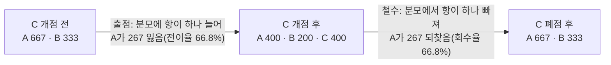

# 14장 입지 분석, 수요에서 자기잠식과 선택까지

> - 이 장에 나오는 점포 수, 인구, 배분 수요, 전이율, 상관계수는 모두 `lecture_practice/chapter14/`의 코드를 실제로 실행해 얻은 값
> - 예시를 위해 지어낸 숫자는 없음(단, 계산 원리를 손으로 확인하는 단락은 "계산 예"로 표시하고 실행 결과와 구분함)

## 1. 이 장의 핵심 질문

□ 카페 프랜차이즈 본사가 "강남구에 매장을 하나 더 낸다"고 정했을 때, 실제로 답해야 하는 질문은 "어디가 좋아 보이는가"가 아님  

1. **이 자리에 매장을 열면 회사 전체 매출이 얼마나 늘어나는가.** 새 매장이 끌어온 손님 중 일부가 원래 자사 매장에 가던 손님이라면, 새 매장의 매출은 늘었어도 회사 전체는 그만큼 늘지 않음. 이 현상이 **자기잠식**(cannibalization)임
2. **한 지역의 수요는 주변 매장들 사이에 어떻게 나뉘는가.** 매장이 하나 늘면 왜 나머지 전부의 몫이 함께 줄어드는가
3. **이 계산의 어디까지를 결정에 쓸 수 있는가.** 절대량과 순위 중 무엇이 가정에 견디는가

○ 임대차 계약은 보통 몇 년 단위로 묶임. **첫 자리를 잘못 고르면 그 손해가 계약 기간 내내 쌓임.** 그래서 "느낌이 좋다"가 아니라 계산으로 답해야 함  

## 2. 도입 사례: 카페 2,123개 사이에 한 자리를 더 끼워 넣기

□ `14-0-data-prep.log`를 열어 보면 다음이 나옴  
  ○ 상가정보 원본: 소상공인시장진흥공단 상가(상권)정보 서울 202606(302MB)  
  ○ **강남구 '카페' 점포: 2,123개**, 행정동 22개  
  ○ 상호명 상위 3곳: 스타벅스 102 / 투썸플레이스 12 / 매머드익스프레스 7  
  ○ 생활인구 원본: 서울 열린데이터광장 행정동 단위 생활인구(179MB), 424개 동, 11~15시 평균  
  ○ 두 자료의 행정동코드 결합률: 99.5%(2,113/2,123)  

□ **이 숫자들만으로도 문제의 크기가 드러남.** 강남구 한 자치구에만 카페가 2,123개 있고 그중 스타벅스가 102개임. 나머지 2,011개는 경쟁 브랜드가 운영함  
  ○ 즉 "카페 하나를 더 연다"는 결정은 **이미 붐비는 시장에 한 자리를 더 끼워 넣는 일**임  

□ `14-1-huff-location-cannibalization.log`를 보면 이 붐빔이 계산에 그대로 반영됨  
  ○ 자사(스타벅스) 매장 점유율: **4.8%**(102 / 2,113)  
  ○ 후보지: 250m 격자 540개, 자사 최근접 거리 중앙값 301m  
  ○ 최선 후보 하나의 예상 배분: **1,228명**, 그중 자기잠식 **80명**(전이율 6.5%), 순증 **1,148명**  

□ 배분받는 1,228명 가운데 자기잠식은 80명뿐이고 나머지는 순증임  
  ○ **왜 자기잠식이 이렇게 작은지는 7절에서 계산으로 확인함.** 결론을 미리 말하면, 자사 점유율(4.8%)이 낮을수록 신규 매장이 가져오는 수요의 대부분이 경쟁사에서 온다는 계산 구조 때문임  

○ 이 결과가 어떻게 나왔는지 감을 잡기 위해 핵심 코드 몇 줄만 먼저 확인함  

```python
def huff_weights(dx, dy, sx, sy, attract, beta):
    """수요 지점 x 매장의 '끌어당기는 점수' A/d^beta."""
    d = np.hypot(dx[:, None] - sx[None, :], dy[:, None] - sy[None, :])
    np.maximum(d, MIN_DIST_M, out=d)
    return attract[None, :] / d ** beta
```

_전체 코드는 `lecture_practice/chapter14/code/14-1-huff-location-cannibalization.py` 참고_

□ 세 가지를 먼저 확인함  
  ○ 함수 이름부터 이 장의 핵심 계산이 **"끌어당기는 점수"(A/d^β)**라는 것을 보여 줌  
  ○ `attract`(매력도)는 분자에, 거리(`d`)는 분모의 지수(`beta`)로 들어감. **거리가 커지면 점수가 빠르게 작아짐**  
  ○ `np.maximum(d, MIN_DIST_M, ...)`은 거리가 0에 가까울 때 나눗셈이 터지는 것을 막는 하한선임. 이 한 줄이 없으면 바로 옆 칸을 후보로 셀 때 계산이 깨짐  

## 3. 어떤 결정인지, 어느 단위에서

### 3.1 결정 유형이 목적함수를 정한다

○ 같은 흡인 모형을 돌려도 **"무엇을 최대화하는가"가 다르면 상위 후보가 뒤바뀜**  

| 결정 유형 | 후보 집합 | 목적함수 |
| --- | --- | --- |
| 신규 출점 | 격자·필지·공실 목록 | 순증 최대화, 전이율 상한 |
| 이전 | 현 위치 + 대체 후보 | 이전 후 순증 − 이전 전 배분 |
| 철수 | 자사 기존점 | 손실 최소화 = 배분 − 회수분 |
| 권역 설계 | 매장 × 수요 지점 배정 | 커버리지 최대 또는 배송 원가 최소 |

○ **신규 출점과 이전은 계산 구조가 같음.** 이전은 기존 매장을 없앤 상태에서 새 위치를 넣고 다시 계산하는 것이므로, 철수와 출점을 한 번씩 이어 붙인 형태임  
○ **철수는 부호만 반대임.** 매장을 빼고 다시 계산하면 남은 자사 매장이 흡수하는 몫이 나오고, 그 몫을 원래 배분에서 빼면 손실이 나옴(11절)  

### 3.2 가장 거친 단위가 해상도를 정한다

○ 입지 분석에는 서로 다른 세 층위의 공간 단위가 동시에 들어감  

| 층위 | 대상 | 흔히 쓰는 단위 | 정하는 것 |
| --- | --- | --- | --- |
| 수요 지점 | 인구가 집계된 위치 | 행정동, 격자 | 배분 계산의 해상도 |
| 후보지 | 신규 매장을 놓을 위치 | 250m 격자, 필지 | 결정의 세밀도 |
| 매장 | 기존 자사·경쟁 매장 | 점(좌표) | 분모에 들어가는 경쟁 집합 |

□ **세 층위 가운데 가장 거친 단위가 분석 전체의 해상도를 정함**  
  ○ 강남구 사례에서 이 관계가 실제로 나타남. 후보지는 250m 격자로 촘촘히 깔았지만 **수요는 행정동(21개) 단위로만 있음.** 그래서 같은 행정동 안의 후보지들은 거리에 따른 차이만 있고, 수요 자체는 거의 같은 값을 나눠 받음  
  ○ 이 한계는 이 사례의 결과를 해석할 때 계속 따라다니는 조건이므로 여기서 미리 적어 둠  

> **주의.** 행정동 단위로 집계된 인구를 250m 격자에 그냥 균등하게 나눠 넣으면 안 됨. 카페가 많은 동일수록 배정되는 격자 수가 늘어 격자당 인구가 오히려 낮아지고, **정말 붐비는 상권이 인구 희박 지역처럼 계산됨.** 실제 분포를 반영할 보조 자료(건물 연면적 등)가 없으면 거친 단위를 그대로 쓰는 편이 나음.

### 3.3 상권을 어떻게 그을까

○ **상권**은 한 매장이 고객을 끌어오는 지리적 범위임. 임의로 정하는 것이 아니라 **누적 고객 비율**로 정의함 — 고객을 거리순으로 세워 누적 비율이 일정 수준(보통 60~70%)에 이르는 지점까지가 1차 상권임  

| 방법 | 필요한 자료 | 경쟁 반영 | 적용 대상 |
| --- | --- | --- | --- |
| 원형 버퍼 | 매장 좌표, 반경 | 없음 | 좌표만 있을 때 |
| 행정 경계 | 매장 좌표, 경계 파일 | 없음 | 통계 자료와 결합할 때 |
| Thiessen 다각형 | 매장 좌표 전체 | 최근접만 | 매장 규모가 비슷할 때 |
| 고객점표법 | 고객 거주지 자료 | 실측에 포함 | 영업 중인 매장 |
| Huff 확률 등고선 | 매장 좌표·매력도, β | 분모에 포함 | 신규 후보지 |

□ **고객점표법**은 실제로 온 손님의 거주지를 지도에 찍어 침투율이 떨어지는 거리를 찾는 방법임(Applebaum, 1966). 정확하지만 **이미 영업 중인 매장에만 쓸 수 있음** — 아직 열지 않은 후보지에는 손님이 없어서 쓸 자료가 없음  
  ○ 그래서 **신규 후보지의 상권은 모형으로 그림**(Huff, 1964). 6절의 흡인 모형으로 각 지역에서 해당 매장을 고를 확률을 계산하고, 확률이 같은 지점을 이으면 확률 등고선이 나옴  

### 3.4 집계 단위를 바꾸면 답이 달라진다

□ 같은 원자료에서 다른 결론이 나올 수 있는 현상을 **MAUP**라 부름(Openshaw, 1984). 두 가지 방식으로 나타남  
  ○ **축척 효과**: 후보지 격자를 100m로 잘게 자르면 이웃 격자끼리 값이 거의 같아져 순위 차이가 흐려짐. 500m로 키우면 격자 안의 좋은 자리와 나쁜 자리가 평균에 섞임  
  ○ **구획 효과**: 같은 지역을 행정동으로 자를 때와 지하철역 중심으로 자를 때, 어느 상권이 유망한지 답이 달라짐  

○ **대응 방법은 하나로 확정하지 않는 것임.** 후보지 격자를 두세 가지 크기로 바꿔 상위 후보를 각각 산출하고, 최선 후보의 위치가 얼마나 이동하는지 재 봄. **이동이 격자 한 칸 이내면 단위 선택이 결론을 바꾸지 않은 것이고, 여러 칸을 넘으면 단위 선택이 결론을 만들고 있다는 뜻임**  

## 4. 자료를 확보하고 점검한다

### 4.1 다섯 항목 점검

○ 자료를 계산에 넣기 전에 다섯 가지를 순서대로 확인함. **하나라도 답을 못 적으면 그 자료를 그대로 쓰지 않음**  

| # | 항목 | 확인할 것 |
| --- | --- | --- |
| 1 | 공간 단위 | 분석 단위와 맞는가(후보지 격자 대 수요 자료의 행정동) |
| 2 | 갱신 주기·시점 | 두 자료의 기준 시점이 얼마나 떨어져 있는가 |
| 3 | 결측 구조 | 빈 칸이 최소 집계 규칙 때문인지, 애초에 수집 안 된 것인지 |
| 4 | 구조적 편향 | 관측값이 지역마다 다른 비율로 실제값을 담고 있지 않은가 |
| 5 | 라이선스 | 분석·결과공개·원자료배포 각각 허용되는가 |

□ 강남구 사례에 적용하면 **세 가지가 걸림**  
  ○ **공간 단위**: 수요가 행정동 단위인데 후보지는 250m 격자임(3.2)  
  ○ **매력도 대리변수 부재**: 상가정보에 매장 면적도 매출도 없어, 매력도는 상수(모두 같다)에서 출발함  
  ○ **방문 자료 부재**: β를 실제 자료로 추정할 방법이 없어, 여러 값(1.5·2.0·2.5)을 비교해 결론이 흔들리는지 봄  

○ 나머지 두 항목(시점·라이선스)은 통과함. 두 자료 모두 2026년 6~7월 기준으로 시점이 맞고, 분석과 결과 공개는 허용하되 원자료 재배포는 허용하지 않음  

### 4.2 정주 인구가 아니라 활동 인구를 쓴다

□ 반경 안에 인구가 많다고 해서 잠재 고객이 그만큼이라고 말할 수 없음. **그 인구가 그 시간에 그곳에 있는지**가 더 중요함  
  ○ **정주 인구**는 그 지역에 주소를 둔 사람의 수, **활동 인구**는 특정 시간에 그 지역에 있는 사람의 수임  
  ○ **오피스가 많은 지역은 정주 인구가 적어도 평일 낮 활동 인구는 매우 많음.** 점심 매출이 중심인 카페 업종에서는 정주 인구만 보면 이런 지역을 놓침  

○ 그래서 강남구 사례는 **평일 낮 11~15시 활동 인구**를 수요로 씀. 이 선택은 업종에 따라 바뀜 — 저녁 술집이면 평일 저녁, 주말 나들이 상권이면 주말 오후를 씀  

### 4.3 배후 수요를 세는 세 가지 방법

□ "후보지 반경 500m 안에 3,000명이 산다"는 사실만으로는 잠재 고객이 3,000명이라고 말할 수 없음  
  ○ **① 원형 버퍼 인구 합산**: 반경 r 안의 인구를 그냥 더함. 계산은 간단하지만 경쟁 매장을 반영하지 않고 하천·철로 같은 장벽도 무시하므로 **항상 과대 계산**됨  
  ○ **② 도로망 이동시간 권역**: 도로를 따라 실제로 몇 분 안에 닿는 범위를 계산함. 장벽이 자동으로 반영되지만 도로망 자료와 통행 속도 자료가 필요함  
  ○ **③ 확률적 배분**: 앞의 두 방법은 "권역 안이면 100%, 밖이면 0%"라는 이분법을 씀. **실제 소비자는 경계선에서 방문 여부를 딱 끊지 않으므로**, 각 지역의 인구를 여러 매장에 확률로 나누는 방법이 세 번째임  

○ 세 방법의 차이는 하나의 질문으로 요약됨 — **"수요 지점 i의 인구가 후보지 c에 배정되는 비율을 어떻게 정하는가?"** 원형 버퍼는 거리 임계로 0 또는 1을 주고, 이동시간 권역은 같은 이분법을 통행 시간으로 바꾸며, 확률적 배분은 연속값으로 두고 경쟁 매장의 존재까지 반영함  
○ 강남구 사례는 카페 밀도가 높은 지역이므로 **확률적 배분(흡인 모형)**을 씀  

## 5. 실습 안내

□ 실습 코드  
  ○ `lecture_practice/chapter14/code/14-0-data-prep.py` — 원자료 두 개를 분석용 파일로 정리  
  ○ `lecture_practice/chapter14/code/14-1-huff-location-cannibalization.py` — 흡인 모형, 배분·자기잠식·순증 계산  
□ 원자료 내려받기 안내: `lecture_practice/chapter14/data/raw/README.md`  
□ 결과 로그: `lecture_practice/chapter14/results/*.log`, 산출 파일: `location_candidates.csv`(후보지 540개)  

○ 이 장의 실습은 GPU가 필요 없음  
○ **원자료가 각각 300MB·180MB로 큰 편이라 14-0 실행에 몇 분이 걸릴 수 있음**  
○ 두 포털 모두 로그인 없이 파일을 받을 수 있지만, 다운로드가 자바스크립트로 처리되어 있어 **자동 내려받기 스크립트로는 못 받음.** 한 번은 직접 페이지에서 눌러 받아야 함  

## 6. 흡인 모형으로 배분을 계산한다

### 6.1 거리와 매력도가 반대로 작용할 때

□ 두 카페 사이 한가운데에 있는 수요 지점을 생각함  
  ○ 가까운 쪽이 좌석 네 개짜리 작은 매장이고 먼 쪽이 넓은 매장이면, **이 지역 수요가 어느 쪽으로 얼마나 가는지는 거리만으로도 매력도만으로도 정해지지 않음**  

□ 두 힘의 상대 크기를 하나의 확률로 바꾸는 계산이 **흡인 모형**(Huff, 1963, 1964)임  

1. **매장별 점수 계산**: 수요 지점 i에서 매장 j로 향하는 점수를 `sᵢⱼ = Aⱼ / dᵢⱼ^β`로 구함
2. **수요 지점별 합산**: 그 지점에서 갈 수 있는 모든 매장의 점수를 더해 `Sᵢ`를 구함
3. **정규화**: 각 매장 점수를 합으로 나눠 확률 `Pᵢⱼ`를 만듦. **이 나눗셈이 경쟁을 계산에 넣는 지점임**
4. **인구 곱**: 지점 i의 인구에 확률을 곱해 모든 지점에 대해 더하면 매장별 배분 수요가 나옴

```
Pᵢⱼ = (Aⱼ / dᵢⱼ^β) / Σₖ (Aₖ / dᵢₖ^β)
```

□ **분모(Σₖ)에 자사 매장과 경쟁사 매장이 함께 들어감.** 이것이 계산 구조의 핵심임  
  ○ 경쟁 매장을 별도 변수로 넣는 것이 아니라 **분모에 항을 하나 더하는 방식**이므로, 매장이 하나 늘면 그 매장의 점수만큼 분모가 커지고 나머지 매장의 확률이 자동으로 줄어듦  

### 6.2 계산 예 — 매장 셋으로 손으로 확인하기

□ 분모가 경쟁을 담는 구조는 작은 숫자로 손을 대 보면 확인됨  
  ○ **계산 예**: 수요 지점 하나에 인구 1,000명이 있고, 매장 A는 매력도 1에 거리 200m, 매장 B는 매력도 2에 거리 400m라고 함. β = 2.0으로 계산함(거리는 100m 단위로 바꿔 각각 2와 4로 둠)  
    – 매장 A 점수: 1 / 2² = 0.250  
    – 매장 B 점수: 2 / 4² = 0.125  
    – 합: 0.375 → 확률은 각각 0.667, 0.333 → 배분은 667명, 333명  
  ○ **매력도가 두 배인 B가 거리도 두 배라서 확률의 절반밖에 못 가져감.** 매력도는 1차로 들어가지만 거리는 β = 2제곱으로 들어가므로, 거리 효과가 매력도 효과보다 세게 작용한 것임  

○ 여기에 매장 C(매력도 1, 거리 200m, A와 조건이 같음)를 추가하면 분모가 0.375에서 0.625로 커짐  

| 매장 | 매력도 | 거리(100m) | 점수 | C 추가 전 배분 | C 추가 후 배분 | 감소분 |
| --- | --: | --: | --: | --: | --: | --: |
| A | 1 | 2 | 0.250 | 667명 | 400명 | 267명 |
| B | 2 | 4 | 0.125 | 333명 | 200명 | 133명 |
| C(신규) | 1 | 2 | 0.250 | — | 400명 | — |

□ **신규 매장 C가 400명을 받고, 그 400명은 정확히 A(267명)와 B(133명)에서 옮겨 옴**  
  ○ 우연이 아님 — **확률의 합이 항상 1이므로, 신규 매장이 받는 몫은 반드시 다른 매장에서 나올 수밖에 없음**  

### 6.3 매력도와 β는 어디서 구할까

○ 매력도(A)는 원칙적으로 매장 면적·좌석수·품목수 같은 자료에서 잼. **그런 자료가 없으면 모든 매장을 같은 값(상수)으로 두고 시작함** — 강남구 사례가 이 경우임  
○ β는 원칙적으로 실제 방문 자료(회원 앱 위치, 카드 결제 기록 등)로 추정함(Nakanishi & Cooper, 1974). 이런 자료가 없으면 업종의 통행 성격에 맞춰 몇 개 값을 정해 비교함  
○ 강남구 사례는 둘 다 자료가 없는 조건임. 그래서 매력도는 상수에서 출발해 집적도로 바꿔 보고, β는 1.5·2.0·2.5 세 값으로 비교함(8.3)  

> **주의.** β와 매력도를 관행값으로 고정한 채 배분 수요의 **절대량**을 그대로 보고하면 안 됨. 8.3에서 확인하듯 β를 1.5에서 2.5로 바꾸면 최선 후보의 순증이 721명에서 1,478명으로 두 배가 됨. 방문 자료로 β를 추정하지 못했다면 **순위만 인용하고 절대량은 결정 근거로 쓰지 않음**.

## 7. 자기잠식과 순증을 가른다

### 7.1 전이율의 정의는 하나가 아니다

□ **전이율**은 자사 기존점에서 옮겨 온 몫을 어떤 기준으로 나눈 비율임. **문제는 그 기준(분모)이 하나로 정해져 있지 않다는 점임**  
  ○ **정의 A(신규점 배분 대비)**: 자사 기존점 감소분 합계 / 신규점 배분 수요. "신규점이 받은 수요 가운데 몇 퍼센트가 자기 것을 옮겨 온 것인가"  
  ○ **정의 B(기존점 개점 전 배분 대비)**: 자사 기존점 감소분 합계 / 자사 기존점의 개점 전 배분 수요. "기존 매장이 원래 받던 수요의 몇 퍼센트를 잃는가"  

□ 6.2의 계산 예로 두 값을 비교함. 매장 A와 C가 자사라고 하면 **정의 A로는 267 / 400 = 66.8%, 정의 B로는 267 / 667 = 40.0%**임  
  ○ **같은 상황을 두고 66.8%와 40.0%라는 서로 다른 숫자가 나옴.** 이 장은 정의 A를 기준으로 씀  

> **주의.** 산출표에 전이율을 적을 때는 반드시 분모가 무엇인지 열 이름에 함께 적어야 함(예: "전이율(신규점 배분 대비)"). 가맹계약 조항이나 회사 내부 기준이 다른 정의를 쓰고 있을 수 있음.

### 7.2 계산 절차 네 단계

1. **개점 전 배분 계산**: 신규점 없이 각 지점의 배분 확률을 계산하고 자사 기존점의 배분 수요를 기록함
2. **개점 후 배분 재계산**: 신규점을 후보지에 놓고 다시 계산함. **분모에 항이 하나 늘어 모든 기존 매장의 확률이 줄어듦**
3. **자사 감소분 합산**: 자사 기존점의 감소분만 더함. **경쟁사가 잃은 몫은 자기잠식이 아니므로 여기 넣지 않음**
4. **전이율과 순증 산출**: 전이율 = 자사 감소분 / 신규점 배분, 순증 = 신규점 배분 − 자사 감소분

□ **순증이 정렬의 기준이 되어야 함.** 두 후보의 신규점 배분이 같아도 자사 매장에 가까운 쪽은 감소분이 커서 순증이 작음  
  ○ 배분 수요로만 순위를 매기면 자사 매장이 몰린 지역의 후보가 상위에 오르는데, **그 지역은 이미 자사가 수요를 받고 있어 회사 전체로는 늘어나는 양이 적음**  

### 7.3 자사 점유율이 낮으면 잠식도 작다

□ 자사 감소분은 수요 지점마다 **"자사 매장의 원래 점유율 × 신규점의 새 점유율"**에 비례하는 값을 모두 더한 것임  
  ○ 자사 매장의 원래 점유율이 낮으면(경쟁이 심하고 자사 매장 수가 적으면) 이 곱도 작아지고, 더할 항의 개수도 적음. **그래서 전체 자기잠식이 작게 계산됨**  
  ○ 이 관계가 강남구 사례에서 실제로 확인됨. **자사(스타벅스) 점유율이 4.8%로 낮으므로 신규 매장이 받는 수요의 대부분이 경쟁 브랜드에서 옴**  

□ 실증 연구도 같은 방향을 보고함. Pancras, Sriram, Kumar(2012)는 한 체인의 출점 이력을 분석해 신규 매장 매출의 86.7%가 순증이고, **매장 사이 거리가 1마일 멀어질 때마다 잠식되는 매출이 28.1%씩 줄어 10마일에서는 거의 사라진다**고 보고함  
  ○ 즉 **자기잠식은 거리가 멀수록, 자사 점유율이 낮을수록 작아짐.** 이 관계 때문에 이격 거리를 제약으로 걸어 잠식을 통제할 수 있음(8.2)  

### 7.4 이 계산이 놓치는 것 — 고정 시장 가정

□ 6.2의 계산 예에서 **신규 매장 배분(400명)과 기존 매장 감소분 합계(400명)가 정확히 일치했음**  
  ○ 이 항등식은 우연이 아니라 모형의 구조에서 나옴 — **확률의 합이 항상 1이므로, 시장 전체 크기가 고정되어 있다는 가정이 계산에 이미 새겨져 있음**  

□ 실제 시장에서는 세 가지가 함께 일어남: 자사 매장 수요를 가져가는 자기잠식, 경쟁사 수요를 가져가는 경쟁사 잠식, 그리고 **매장이 늘어 그 지역을 찾는 사람 자체가 늘어나는 시장 확대**임  
  ○ **이 흡인 모형은 앞의 둘은 계산하지만 셋째는 계산에 담지 못함.** 총수요가 상수로 고정되어 있어서, 매장 수가 늘어도 나눠 가지는 총량이 그대로이기 때문임  
  ○ 셋을 분리하려면 개점을 하나의 처치로 보고 개점 후 관측 자료에서 효과를 식별해야 함. **이 장은 개점 전에 모형이 가정한 재배분을 계산해 후보를 고르는 데까지 다루고, 개점 후 그 재배분이 실제로 일어났는지 확인하는 방법은 15장이 다룸**  

## 8. 점수를 만들고 제약으로 거른다

### 8.1 여러 변수를 하나의 점수로 합치기

□ 실제 출점 검토는 배분·순증 외에 접근성·비용·규제도 함께 봄. 단위가 다른 여러 변수를 하나로 묶는 절차가 **입지 점수** 모형이며 네 단계로 이루어짐  

1. **변수 선정**: 수요·경쟁·접근성·비용·규제 다섯 범주에서 고름. 결정에 실제로 영향을 주는 변수만 넣음
2. **방향 정렬**: 값이 클수록 좋은 변수(활동 인구)와 작을수록 좋은 변수(임대료)가 섞여 있으므로 정규화 전에 모두 "클수록 좋다"로 맞춤
3. **정규화**: 단위가 다른 변수를 같은 척도로 옮김
4. **가중합**: 정규화한 값에 가중치를 곱해 더함(가중치 합은 1)

○ 규제처럼 **"통과냐 아니냐"로만 갈리는 변수는 점수에 넣지 않고 8.2의 제약으로 처리함**  

> **주의.** 상관이 높은 두 변수를 함께 가중합에 넣으면 그 축이 두 번 계산됨. "도보 10분 활동 인구"와 "지하철역까지 거리"가 상관 0.9인데 각각 가중치 0.3을 주면, 사실상 접근성이라는 하나의 축이 0.6의 비중을 갖게 됨. 가중치를 정하기 전에 변수 간 상관을 먼저 확인해야 함.

### 8.2 상한을 낮추면 무엇을 포기하는가

□ 최소 조건이 있는 변수(임대료 상한, 전이율 상한)는 가중합이 아니라 **제약**으로 처리함. 임대료가 예산을 넘으면 다른 조건이 아무리 좋아도 계약할 수 없기 때문임  
  ○ **제약값을 정하는 일은 후보를 거르는 일이면서 동시에 순증을 포기하는 일이기도 함**  

| 상한 | 통과 후보 | 통과율 | 판정 | 대안 순증 |
| --: | --: | --: | --- | --- |
| 30% | 540/540 | 100.0% | 구속하지 않음 | 1,148명(최선 후보 유지) |
| 10% | 540/540 | 100.0% | 구속하지 않음 | 1,148명(최선 후보 유지) |
| 6% | 490/540 | 90.7% | 구속함 | 872명(−24.0%) |
| 5% | 312/540 | 57.8% | 구속함 | 872명(−24.0%) |
| 4% | 36/540 | 6.7% | 구속함 | 872명(−24.0%) |

□ 전이율 분포는 중앙값 4.8%, 최대 6.6%임. **그래서 30%와 10% 상한은 후보를 하나도 못 거름**  
  ○ 6%에서 처음으로 순증 1위 후보가 탈락하고 대안 후보의 순증은 872명으로 24.0% 낮아짐. 상한을 더 낮춰도 통과 후보 수만 줄 뿐 대안 순증은 그대로 872명임  
  ○ **이 표는 "상한을 몇 %로 하라"고 정해 주지 않음.** 상한을 낮추는 일이 순증을 얼마나 포기하는 일인지 숫자로 보여 줄 뿐임. 실제 상한은 자기잠식을 허용했을 때의 비용(가맹점 매출 감소, 계약 분쟁)과 유망한 자리를 포기했을 때의 비용(순증 손실, 경쟁사 선점)을 비교해 정함  

### 8.3 가정을 바꿔도 순위가 유지되는가

○ 강남구 사례에서 자료 없이 정한 값은 두 개, β와 매력도(A)임  

| 구분 | 설정 | 평균 전이율 | 최선 후보 순증 | 기준 대비 위치 이동 |
| --- | --- | --: | --: | --: |
| 거리 저항 β | 1.5 | 4.9% | 721명 | 0m |
| | 2.0(기준) | 4.9% | 1,148명 | 0m |
| | 2.5 | 4.9% | 1,478명 | 0m |
| 매력도 A | 상수(기준) | — | 1,148명 | 0m |
| | 집적도(50m 내 점포수) | — | 1,501명 | 0m |

□ 세 가지를 확인함  
  ○ **순증의 절대량은 가정에 따라 크게 흔들림** — β를 1.5에서 2.5로 바꾸면 721명에서 1,478명으로 두 배가 됨. **이 값을 매출 예측처럼 쓰면 안 됨**  
  ○ **최선 후보의 위치는 다섯 설정 모두에서 같음**(이동 0m). **순위를 만드는 것은 β나 A가 아니라 수요와 경쟁의 공간 배치임**  
  ○ **평균 전이율은 β 세 값에서 모두 4.9%로 같음.** β가 배분의 절대량은 바꾸지만 자사와 경쟁사가 나눠 갖는 비율 구조는 거의 그대로라는 뜻임  

□ 마지막으로 **"이 결과가 그냥 인구 지도를 되풀이하는 것은 아닌가"**도 확인함(퇴화 검사)  
  ○ 총배분과 최근접 행정동 낮 인구의 상관은 **−0.051**, 순증과 낮 인구의 상관은 **−0.052**, 순증과 자사 최근접 거리의 상관은 **−0.046**임. 세 값 모두 0에 가까움  
  ○ **인구가 많은 지역에는 카페도 많아서 큰 수요를 많은 매장이 나눠 가짐.** 그래서 배분 수요가 인구 지도를 그대로 따라가지 않음. 만약 이 상관이 0.9처럼 높게 나왔다면 복잡한 흡인 모형을 계산할 필요 없이 인구 상위 지역을 고르는 것과 결과가 같았을 것임  

## 9. 위치 자료를 써도 되는가

### 9.1 네 물음으로 판정한다

○ 위치 자료는 **이름을 지워도 이동 궤적 자체가 개인을 특정하는 정보로 작동함.** 그래서 "식별 정보를 지웠다"는 사실만으로는 써도 된다는 근거가 되지 않음  

| # | 물음 | "예"일 때 처리 |
| --: | --- | --- |
| 1 | 이 해상도에서 개인의 하루 궤적이 복원되는가 | 시간·공간 해상도를 낮춘 뒤 다시 판정 |
| 2 | 다른 자료와 결합하면 해상도가 실질적으로 올라가는가 | 결합하지 않거나, 결합 후 자료로 1번을 다시 판정 |
| 3 | 산출물이 개인·가구 단위 처우로 내려가는가 | 산출 단위를 집계 단위로 올림 |
| 4 | 라이선스가 이 용도를 허용하는가 | 허용 범위 안으로 한정 |

□ 실제로 얼마나 조심해야 하는지는 정량 근거가 있음. de Montjoye 외(2013)는 150만 명의 이동 자료로 **시공간 지점 네 개만 알면 95%의 개인이 유일하게 특정된다**는 것을 보였음  
  ○ 더 중요한 발견은 **해상도를 낮춰도 유일성이 그에 비례해서는 줄지 않는다**는 점임 — **거칠게 집계한 자료가 곧 안전한 자료라는 뜻은 아님**  
  ○ 강남구 사례의 산출물(후보지 순위표)은 개인이 아니라 격자를 대상으로 하므로 3번 물음은 통과함. **다만 같은 계산 결과가 나중에 지역별 배달 요금 차등 같은 개인 단위 처우로 이어진다면, 그 시점에 판정을 다시 해야 함**  

### 9.2 결과가 나온 뒤에도 감사가 필요하다

○ 계산이 맞았다고 해서 끝이 아님. **각각의 결정이 개별적으로는 합리적이어도, 그 결정들이 쌓이면 특정 지역에 몰릴 수 있음**  

| 범주 | 지표 | 판정 기준 |
| --- | --- | --- |
| 점수 분포 | 지역별 입지 점수의 평균·분산 | 특정 지역이 계속 하위에 고정되는가 |
| 커버리지 | 인구 집단별 서비스 도달 비율 | 집단 간 차이가 벌어지는가 |
| 철수 누적 | 철수 결정이 발생한 지역의 분포 | 같은 지역에 철수가 반복되는가 |
| 자료 되먹임 | 산출물 적용 이후 그 지역 입력 자료의 변화 | 자료 악화가 산출물 때문인가 |

□ **되먹임은 특히 주의할 현상임.** 입지 점수가 낮게 나온 지역에서 상업 서비스가 하나씩 빠져나가면, 유동인구·매출이 줄어든 상태가 다음 분석의 입력 자료가 됨. 그러면 그 지역의 점수가 더 낮아지고 더 많은 서비스가 빠져나가는 순환이 생길 수 있음  
  ○ 순환을 끊는 방법 하나는 **입력 자료의 시점을 이전 회차 결정이 적용되기 전으로 고정하는 것**임  

## 10. 사례 전체: 강남구 카페

○ 앞 절에서 나온 숫자들을 결정의 흐름 순서로 다시 정리함  

**단계별 값**

○ **결정·단위**: 신규 출점. 후보지는 점포 분포 범위에 깐 250m 격자 540개, 수요 지점은 행정동 21개, 매장은 점 단위. 자사 최근접 거리 중앙값 301m  
○ **자료**: 강남구 카페 2,123개, 활동 인구와 결합률 99.5%. 자사 102개, 경쟁 2,011개, 자사 점유율 4.8%. 21개 행정동 낮 활동 인구 합계 993,215명  
○ **수요**: 각 행정동의 대표점은 그 동에 있는 카페 좌표의 중심으로 잡음(상업 밀도 중심점)  
○ **배분·잠식**: β = 2.0, 매력도 상수로 계산  

| 총배분 순위 | 자사 최근접(m) | 예상 배분(명) | 자기잠식(명) | 전이율 | 순증(명) |
| --: | --: | --: | --: | --: | --: |
| 1 | 129 | 1,228 | 80 | 6.5% | 1,148 |
| 2 | 180 | 1,221 | 80 | 6.6% | 1,141 |
| 3 | 338 | 1,214 | 80 | 6.6% | 1,134 |
| 4 | 416 | 1,213 | 80 | 6.6% | 1,134 |
| 5 | 373 | 1,208 | 79 | 6.6% | 1,129 |
| 6 | 144 | 1,203 | 79 | 6.6% | 1,124 |
| 7 | 529 | 1,203 | 79 | 6.6% | 1,123 |
| 8 | 385 | 1,199 | 79 | 6.6% | 1,120 |
| 9 | 334 | 1,088 | 71 | 6.5% | 1,017 |
| 10 | 633 | 1,070 | 71 | 6.6% | 999 |

□ **총배분 순위와 순증 순위가 열 곳 모두에서 일치함.** 자기잠식이 71~80명, 전이율이 6.5~6.6%로 좁은 범위에 머물러 순위를 뒤집을 만큼 크지 않기 때문임  
  ○ 7.3에서 확인한 대로, 자사 점유율(4.8%)이 낮아서 신규 매장이 가져오는 수요의 대부분이 경쟁 브랜드에서 옴  

**거리와 전이율의 관계**

| 거리대(m) | 후보 수 | 평균 전이율 | 평균 순증(명) |
| --- | --: | --: | --: |
| ~300 | 268 | 4.9% | 430 |
| 300~500 | 129 | 5.0% | 410 |
| 500~800 | 68 | 5.3% | 355 |
| 800~1200 | 41 | 4.7% | 335 |
| 1200~2000 | 34 | 3.7% | 476 |

□ 거리와 전이율의 상관은 **−0.333**임. **방향(멀수록 잠식이 작아짐)은 7.3의 이론과 맞지만, 구간별 평균이 단조롭게 줄지는 않음**(500~800m 구간이 앞 두 구간보다 오히려 높음)  
  ○ **이 불일치는 자료의 한계에서 나옴.** 수요가 행정동 단위이므로 같은 동 안의 후보지들이 비슷한 값을 받고, 거리 차이가 행정동 경계에 흡수되기 때문임(3.2)  
  ○ 그래서 이 사례에서는 거리를 제약(이격 거리 조건)으로는 쓰되 **순증의 대리 지표로는 쓰지 않음**  

**이 계산이 지지하는 것과 지지하지 않는 것**

○ **지지하는 것 셋**: 후보 사이의 상대 순위, 이 브랜드의 낮은 점유율 조건에서는 자기잠식 제약의 구속력이 약하다는 판정, 배분 수요가 인구를 그대로 따라가지 않는다는 사실(퇴화 검사)  
○ **지지하지 않는 것 셋**: 배분 수요의 절대량(β에 따라 두 배까지 변함), 예상 매출(매출 자료가 없음), 개점 후 실제로 관측될 자기잠식의 크기(모형이 가정한 재배분일 뿐임)  
○ **이 사례에는 학습 모델이 하나도 쓰이지 않았음.** 학습 모델이 필요한 조건은 셋인데 — 개점 전이라 관측되지 않는 값을 추정해야 할 때, 변수 사이 관계가 심하게 휘어 있을 때, 이웃 지역의 상태가 이 지역 결과를 만들 때 — 이 사례는 어디에도 해당하지 않음. 반경 안 인구를 더하거나 거리를 재는 일은 답이 하나로 정해짐  

## 11. 같은 계산의 다른 방향: 미진출 지역과 철수

| 단계 | 신규 출점 | 미진출 지역 진입 | 철수 |
| --- | --- | --- | --- |
| 대상·단위 | 후보 격자 | 후보 = 진출 대상 도시 목록 | 대상 = 자사 기존점 목록 |
| 배분 | 신규점 포함 재계산 | 좌동 | 대상점 제거 후 재계산 |
| 잠식 | 자사 감소분 | 해당 없음(자사 집합이 공집합) | 남은 자사 매장의 회수분 |
| 선택 | 순증 최대, 전이율 상한 | 배분 최대, 임대료·용량 상한 | 손실 최소 = 배분 − 회수분 |

○ **미진출 지역 진입**: 자사 매장이 아예 없는 지역에 첫 매장을 낼 때는 잠식 계산이 통째로 빔. **계산 코드 자체는 바뀌지 않음** — 자사 매장 목록을 빈 목록으로 두면 같은 계산이 "순증 = 배분"을 만들어 냄. 다만 자사 기존점 실적과 비교할 대상이 없으므로 배분 수요의 절대량을 더욱 조심해서 다뤄야 함  

□ **철수**: 자사 매장 하나를 없애고 배분을 다시 계산하면 분모에서 항이 하나 빠져 남은 모든 매장의 확률이 올라감. 올라간 몫 가운데 자사 매장이 회수하는 부분이 **회수분**이고, 철수 손실 = 제거된 매장의 배분 − 회수분임  
  ○ 6.2의 계산 예를 거꾸로 돌리면 확인됨. 매장 A와 C가 자사일 때 C를 닫으면 분모가 다시 줄어 A는 667명으로 돌아감. **회수분은 667 − 400 = 267명, 회수율 66.8%, 철수 손실은 400 − 267 = 133명임**  
  ○ **이 값이 7.1에서 본 전이율(66.8%)·순증(133명)과 똑같음.** 출점과 철수가 같은 계산의 두 방향이기 때문임 — **자사 점유율이 높을수록 출점 시 전이율이 크고, 철수 시 회수율도 큼**  

○ 6.2의 계산 예를 양방향으로 놓으면 이 대칭이 한눈에 들어옴(A·C가 자사, B가 경쟁사, 인구 1,000명)  



**그림 14.1** 같은 계산의 두 방향. **출점에서 자사가 잃는 267명과 철수에서 자사가 되찾는 267명이 같은 수임** — 확률의 분모에 항이 하나 늘고 주는 차이뿐이기 때문이며, 그래서 출점 시 전이율과 철수 시 회수율이 같은 값(66.8%)으로 나옴  

○ 회수분은 흡인 모형이 계산한 재배분일 뿐이며, **실제로 그만큼 회수되는지는 폐점 후 관측 자료로 확인해야 함.** 폐점한 매장의 손님이 같은 브랜드가 아니라 경쟁사로 옮기면 실제 회수율은 계산보다 낮음. 이 확인은 15장의 영역임  
○ 이 절의 두 사례에는 실행 결과를 붙이지 않음. 이 장의 실습 코드가 강남구 신규 출점 사례만 다루기 때문이며, 위 서술은 계산 구조에서 그대로 도출한 것임  

## 12. 핵심 요약

○ **출점 결정은 배분 수요가 아니라 순증으로 정렬함.** 자사 매장에 가까운 후보는 감소분이 커서, 배분이 같아도 회사 전체로 늘어나는 양이 적음 (7.2)  
○ **매장이 하나 늘면 나머지 전부의 확률이 함께 줄어듦.** 경쟁을 별도 변수로 넣는 것이 아니라 분모에 항을 더하는 구조이기 때문임 (6.1)  
○ **신규 매장이 받는 몫은 반드시 다른 매장에서 옴.** 계산 예에서 신규 400명이 정확히 A 267명 + B 133명이었음 (6.2)  
○ **전이율은 분모를 무엇으로 두느냐로 66.8%와 40.0%가 갈림.** 산출표 열 이름에 분모를 함께 적어야 함 (7.1)  
○ **자사 점유율이 낮으면 자기잠식도 작게 계산됨.** 강남구 사례의 점유율 4.8%가 전이율 6.5%를 만들었고, 실증 연구도 같은 방향을 보고함 (7.3)  
○ **이 모형은 시장 확대를 계산하지 못함.** 확률의 합이 1이라 총수요가 고정되어 있고, 개점 후 실제 재배분의 확인은 15장이 다룸 (7.4)  
○ **가장 거친 단위가 분석 전체의 해상도를 정함.** 후보지를 250m로 촘촘히 깔아도 수요가 행정동 단위면 같은 동 안의 후보는 거의 같은 값을 나눠 받음 (3.2, 10절)  
○ **절대량은 가정에 흔들리지만 순위는 흔들리지 않음.** β를 바꾸면 순증이 721명에서 1,478명으로 두 배가 되는데 최선 후보의 위치는 0m 이동이었음 (8.3)  
○ **퇴화 검사로 모형이 인구 지도의 되풀이가 아님을 확인함.** 배분과 낮 인구의 상관이 −0.051로 0에 가까웠음 (8.3)  
○ **거칠게 집계한 자료가 곧 안전한 자료는 아님.** 시공간 지점 네 개로 95%가 특정되고, 해상도를 낮춰도 유일성이 비례해 줄지 않음 (9.1)  
○ **이 사례에는 학습 모델이 하나도 쓰이지 않았음.** 반경 안 인구를 더하고 거리를 재는 계산은 답이 하나로 정해지며, 학습이 필요한 세 조건 어디에도 해당하지 않았기 때문임 (10절)  

## 13. 과제

```bash
python scripts/submit.py 14 --id 학번 --name 이름
```

□ 이 명령이 대신 처리하는 작업: `14-0-data-prep.py`와 `14-1-huff-location-cannibalization.py` 실행, 제출용 파일 생성  
  ○ **원자료 두 개를 먼저 받아야 하므로** `lecture_practice/chapter14/data/raw/README.md`의 절차를 먼저 밟음  
  ○ 끝나면 `submissions/` 폴더에 `제출_14장_학번.md` 파일이 생김  
  ○ **눈여겨볼 곳은 후보지별 배후 수요와 기존 점포에서 옮겨 오는 몫(전이율)**  

○ 빈칸 세 개를 채움  

1. 눈에 띈 숫자 하나를 그대로 옮겨 적고, 왜 눈에 띄었는지 한 문장으로
2. 그 숫자가 왜 그렇게 나왔는가 — 전이율이나 순증이라면 7.3의 논리로 설명하라
3. **순증이 가장 큰 후보가 곧 최선인가? 이 계산에 학습 모델이 하나도 쓰이지 않았다는 사실은 무엇을 말하는가?**

○ **3번이 이 과제의 핵심.** 1·2번은 로그를 보면 답이 나오지만 3번은 판단이 필요함  

> - **막혀도 제출함**
> - 원자료 내려받기가 막혀 14-0을 못 돌렸다면, 어느 단계에서 막혔는지(포털 접속, 파일 형식, 인코딩 등)를 적은 제출도 온전한 제출임

> - **이 장의 계산은 원자료가 갱신되면 수치가 달라짐**
> - 그래서 옆 사람과 정확히 같은 숫자가 안 나올 수 있음
> - 대신 **구조**(총배분 순위와 순증 순위가 거의 일치하는가, 거리~전이율 상관이 음수인가, β를 바꿔도 최선 후보 위치가 고정되는가)가 같은지 확인함
