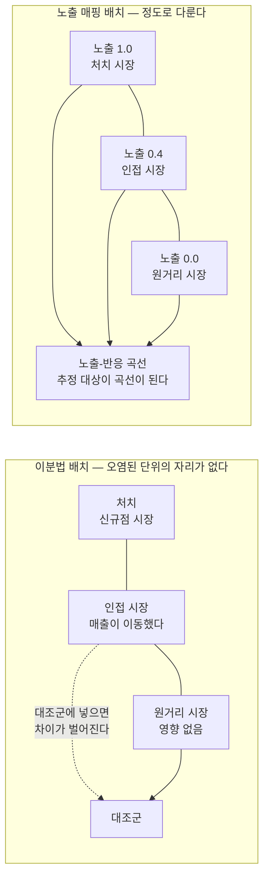
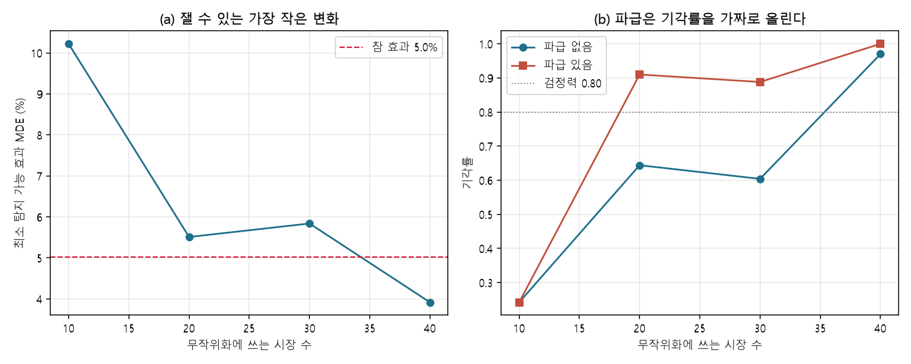
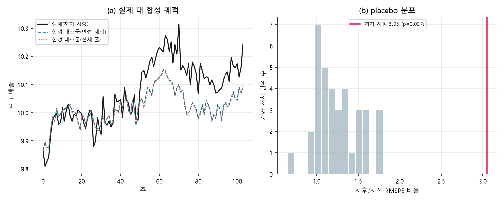
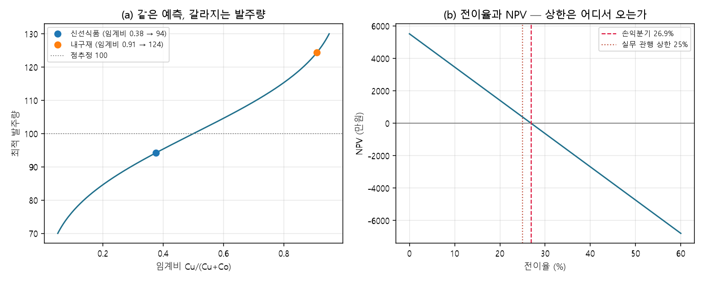

# 15장 공간 실험과 비즈니스 인과추정, 설계에서 결정까지

> - 이 장에 나오는 편향, 검정력, MDE, 발주량, 순현재가치는 모두 `lecture_practice/chapter15/`의 코드를 실제로 실행해 얻은 값
> - 예시를 위해 지어낸 숫자는 없음. 다만 10절의 비용·투자 파라미터는 실행값이 아니라 **가정값**이며, 본문에서 그때마다 표시함

## 1. 이 장의 핵심 질문

1. **매장을 하나 열었더니 그 시장 매출이 5% 늘었다.** 그 5%는 출점이 만든 값인가, 아니면 원래 오를 자리였는가
2. **신규점이 손님을 끌면서 옆 가게 손님이 줄었다면, 그 옆 가게를 대조군에 넣어도 되는가**
3. **통계 진단을 모두 통과한 추정치를 그대로 결정에 넣어도 되는가**

- 이 장은 **기업이 스스로 정하는 처치의 효과를 재고, 그 값을 결정으로 바꾸는 절차**를 다룸
- 8장이 다룬 정책 인과추정과 방법은 같지만 조건이 다름. **정책은 법이 시행일을 정하고, 기업은 잘될 자리와 시점을 스스로 고름**
- 핵심은 다음 한 문장임 — **처치를 스스로 배치하는 기업의 인과추정은, 배치 규칙과 파급 효과를 먼저 다루지 않으면 어떤 정교한 통계로도 편향을 못 없앰**

## 2. 도입 사례: 설계가 정하는 것과 통계가 못 잡는 것

**① 설계만 바꿔 못 잴 것을 잴 수 있게 만듦** (`15-1-geo-experiment-power.log`)

- 시장 40개, 같은 자료에서 실험 설계만 바꿔 봄
- **단순 무작위 배정 + 사후 비교**: 최소 탐지 가능 효과(MDE, 로그) `0.2518`(약 25.18%). **참 효과는 약 5.02%이므로 이 설계로는 실험을 시작할 이유가 없음**
- **짝지음 무작위 배정 + 이중차분**: MDE(로그) `0.0386`(약 3.86%). 참 효과보다 작아 잴 수 있음
- **같은 시장 40개, 같은 참값에서 설계만 바꿔 못 잴 것을 잴 수 있게 만듦.** 계산 없이 시작하면 답이 안 나오는 실험에 예산을 씀

**② 계단을 끝까지 올려도 참값에 안 닿음** (`15-2-market-synthetic-control.log`)

- 실험이 불가능한 상황(출점은 되돌릴 수 없음)에서는 합성통제를 씀
- 처치 시장의 효과를 네 계단으로 올려 봄: 사후 단순 비교 → 이중차분 → 합성통제(전체 기증 풀) → 합성통제(인접 제외 풀)
- 참값은 로그 `+0.0490`인데 네 계단의 참값 대비 편차는 각각 `+0.0394`, `+0.0827`, `+0.0639`, `+0.0602`
- **계단을 끝까지 올려도 참값에 안 닿고, 마지막 계단이 첫 계단보다 나은 것도 아님**
- **통계 진단(사전 적합도, placebo 검정)을 다 통과한 뒤에도 이 편차가 남음.** 9절이 이 문제를 다룸

## 3. 무엇을 재는가, 누가 처치를 정했는가

### 3.1 "출점의 효과"에는 세 값이 들어 있다

- 한 브랜드가 시장에 매장을 하나 더 열었고 효과를 재려 함
- **"출점의 효과"라는 말 하나에 서로 다른 세 값이 들어 있음** — 신규점이 올린 매출, 인근 기존점의 감소를 상쇄한 브랜드 순증, 경쟁사 감소까지 상쇄한 시장 순증
- 잠재적 결과 표기로 정리하면, 처치받은 집단의 평균 처치효과는 ATT = E[Yᵢ(1) − Yᵢ(0) | Dᵢ = 1]임. **Yᵢ(0)은 관측되지 않으므로 실험이나 관측 설계로 이를 대신할 값을 만들어야 함**

- 숫자를 넣어 세 후보를 계산함. 신규점 총매출이 100이고, 인접 자사 기존점의 매출이 25 줄었으며, 경쟁사 매출이 15 줄었다고 하자

| 추정대상 | 계산 | 값 | 이 값을 쓰는 결정 |
| --- | --- | --: | --- |
| ① 신규점 총매출 | 100 | 100 | 점포 손익 판단 |
| ② 브랜드 순증 | 100 − 25 | 75 | 출점 여부 판정, 자기잠식 상한 적용 |
| ③ 시장 순증 | 100 − 25 − 15 | 60 | 시장 확대 주장, 상권 정책 협의 |

- ①과 ②의 차 25가 **자기잠식**이고, ②와 ③의 차 15가 **경쟁 잠식**임
- **출점 여부를 판정하는 자리에서 ①을 쓰면 자기잠식이 없는 것처럼 계산되어 순증을 33% 부풀림**
- 어느 값을 재는지를 정의서 첫 줄에 적고, 결과를 보고할 때 같은 줄을 다시 적음

### 3.2 처치 배정 규칙을 문서로 적을 수 있는가

- 두 문장을 대조하면 확인해야 할 것이 드러남
- **"2024년 3월 1일부터 이 구역에 규제가 적용된다"** — 3월은 그 구역 상인의 매출 전망과 무관하게 정해짐
- **"매출이 오를 것 같아 3월에 저 자리에 매장을 열었다"** — 3월은 기대 매출이 정한 날짜임
- 뒤 문장의 조건에서는 같은 이중차분을 돌려도 **3월 이후의 매출 상승이 처치의 효과인지 원래 오를 자리였는지 갈리지 않음.** 이 상태를 **내생적 처치**라 부름

- 내생성을 확인하는 작업은 세 질문에 답을 적는 일임
1. **배정 규칙을 문서로 적을 수 있는가** — "시장 규모 상위 절반 중 사전 성장률 1위"처럼 적을 수 있으면 그 규칙에 들어간 변수를 통제 대상으로 특정할 수 있음
2. **배정 담당자가 본 자료가 남아 있는가** — 후보지 평가서, 상권 보고서가 남아 있으면 배정 시점의 정보 집합을 재현할 수 있음
3. **배정 시점의 예측값을 재현할 수 있는가** — 재현할 수 있으면 그 예측값을 공변량으로 넣어 조건부 비교가능성을 주장할 여지가 생김

> Blake, Nosko & Tadelis(2015)는 eBay의 유료 검색 광고를 대규모로 끄고 켜는 현장실험에서, 실험으로 잰 수익률이 비실험적 추정값의 일부에 그친다는 것을 보였음. 검색 클릭과 구매 의향이 상관되어 있어 광고가 없어도 살 사람의 매출이 광고 성과로 집계되기 때문임. 이 연구는 온라인 검색 광고를 다루므로 물리적 출점의 직접 선례는 아니고 **구조의 선례로만 인용함** — 내생적 처치가 관측 상관을 부풀린다는 논리, 그리고 그 부풀림이 무시할 수준이 아닐 수 있다는 논리임.

### 3.3 분석 단위와 공공 정책평가와의 차이

- 분석의 한 행을 무엇으로 삼을지 정해야 함. **단위를 키우면 파급이 단위 안에서 끝나 간섭 문제가 줄지만 단위 수가 줄어 검정력이 떨어짐**
- 실측으로 확인됨. 시장 40개를 단위로 삼으면 대조군 노출률이 `0.904`이고 분석 단위가 40개인데, 인접 시장을 2×2로 묶어 군집 10개를 단위로 삼으면 **노출률이 `0.617`로 내려가는 대신 기각률이 `0.358`에서 `0.080`으로 떨어짐**

| 판단 조건 | 공공 정책평가 | 비즈니스 인과추정 |
| --- | --- | --- |
| 처치 시점 | 법률·조례 발효일로 외생적 | 기대 성과가 정하므로 내생적 |
| 처치 경계 | 행정 경계로 선이 명확함 | 상권 경계가 흐림 |
| SUTVA(간섭 없음 가정) | 위반을 인지하되 정책 설계로 통제 | 자기잠식·경쟁 반응으로 위반이 상시 |
| 대조군 | 미지정 지역이 대체로 순수함 | 인접 시장이 곧 파급 대상 |
| 반복 가능성 | 정책은 되돌리기 어려움 | 가격·프로모션은 되돌릴 수 있고 출점은 없음 |
| 결과변수 | 연 단위로 느리게 변함 | 주·일 단위로 계절·프로모션에 크게 변함 |
| 공표 | 결과 공표가 의무이자 설계 대상 | 공표 의무가 없음 |

- **여덟 항목 가운데 새 방법을 요구하는 항목은 없음.** 전부 기존 방법의 가정을 어떻게 충족시킬 것인가의 문제임

### 3.4 실험 경로인가 관측 경로인가

- 4절의 간섭 진단을 끝내면 경로가 갈림. **넷 중 하나라도 성립하지 않으면 실험 경로를 접고 관측 경로로 감**

| 판정 조건 | 실험 경로 | 관측 경로 |
| --- | --- | --- |
| 처치의 가역성 | 가격·프로모션·배차처럼 껐다 켤 수 있음 | 출점·폐점처럼 되돌릴 수 없음 |
| 무작위 배정 가능성 | 배정 권한이 분석 조직 안에 있음 | 배정이 이미 끝났거나 계약이 정함 |
| 단위 수 | MDE가 잴 만한 효과보다 작아지는 시장 수를 확보함 | 처치 단위가 하나이거나 소수임 |
| 동시 차등 운영 | 시장별로 다른 조건을 동시에 운영해도 문제없음 | 동시 차등이 계약·규제로 막힘 |

- 실험 경로는 6·7절, 관측 경로는 8절이 다룸

## 4. 간섭 구조를 진단한다

### 4.1 간섭은 효과가 있다고 말하는 쪽으로 편향시킨다

- 표준 인과추론은 한 단위가 받은 처치가 다른 단위의 결과에 영향을 주지 않는다고 가정함(**SUTVA**)
- 공간 단위에서는 통상 성립하지 않음. 사람이 시장 경계를 넘어 이동하고, 신규점이 인근 기존점의 매출을 가져감. 이 현상을 **공간 간섭**이라 부름
- **간섭이 있을 때 추정치가 어느 방향으로 어긋나는지는 미리 알 수 있음**
  - 처치 집단의 값은 처치효과 τ만큼 올라감
  - 대조 집단의 값은 파급 γ(보통 음수)만큼 내려감
  - 처치−대조 차이는 τ − γ가 되어 **|γ|만큼 부풀려짐**
- 실측: 참 처치효과는 로그 `+0.049`이고 파급은 로그 `−0.015`임. 대조군 노출률이 `0.904`이면 예상 부풀림은 `0.904 × 0.015 ≈ 0.0136`이고 실측 편향은 `0.0167`로 근접함

> **주의.** 오염된 대조군을 "잡음이 늘었으니 보수적으로 읽으면 된다"로 처리하면 안 됨. 파급이 음수이면 처치군은 올라가고 대조군은 내려가므로 차이가 두 이동의 합만큼 벌어지고, **편향의 방향이 효과가 있다고 말하려는 쪽에 유리함.** 대조군 노출률과 파급 상한을 곱해 오염의 상한을 계산하고, 그 값을 추정치와 함께 보고함.

### 4.2 노출을 이분법이 아니라 정도로 다룬다

- **신규점에서 200m 떨어진 매장과 2km 떨어진 매장은 받는 영향의 크기가 다름.** 둘을 처치 또는 대조 하나로 분류하면 그 차이가 사라짐
- 이분법을 버리고 각 단위가 얼마나 노출되었는지를 함수로 정의하면 **중간 노출이라는 자리가 생김.** 이것이 **노출 매핑**임

| 형태 | 함의하는 파급 구조 | 오지정 시 증상 |
| --- | --- | --- |
| 계단(거리 d₀ 안팎으로 이분) | 반경 안은 균일 노출, 밖은 전혀 노출 안 됨 | d₀ 안팎의 링 추정치가 완만하게 이어짐 |
| 지수 감쇠 | 영향이 연속으로 줄고 꼬리가 김 | 원거리 링 추정치가 0과 구분 안 됨 |
| 거리 역수 | 근접 구간에서 영향이 급격히 커짐 | 최근접 링 추정치가 함수 예측보다 작음 |

- 형태를 고른 뒤에는 처치 지점에서 거리 구간을 나눠(200~400m, 400~600m 등) 링별로 효과를 따로 추정해 오지정 여부를 진단함



**그림 15.1** 처치·노출·대조의 공간 배치 — 왼쪽 배치에서는 오염된 인접 시장을 넣을 자리가 없고, 오른쪽 배치에서는 중간 노출이라는 자리가 생김. 도넛 설계는 왼쪽 배치에서 인접 시장을 제외하는 절충임

### 4.3 오염 상한은 관측되는 양만으로 계산된다

- **파급의 참 크기는 관측되지 않지만 오염의 상한은 관측되는 양만으로 계산할 수 있음**
- 실험 경로: 대조군 노출률 × 파급 상한. 노출률이 `0.904`이고 파급 상한이 `0.03`이면 오염 상한은 `0.904 × 0.03 ≈ 0.027`
- 관측 경로(합성통제): 인접 기증 단위 가중치 합 × 파급 상한. 실측에서 인접 가중 합이 `0.276`이므로 오염 상한은 `0.276 × 0.03 ≈ 0.008`
- 이 값의 쓰임은 둘임 — 추정치와 함께 보고해 결론의 여유를 보이는 것, 그리고 배제 규칙 판정의 입력이 되는 것

### 4.4 배제 규칙을 언제 정했는가가 결과를 가른다

- 오염된 단위를 비교에서 빼는 처방을 **도넛 설계**라 부름
- **실험 층위에서 결과를 가르는 것은 규칙의 내용이 아니라 규칙을 언제 정했는가임**
- 배정 결과를 보고 오염된 쌍을 거르면 점추정 편향은 실제로 걷힘. **그런데 이때 남는 표본의 크기가 배정의 함수가 되어 확률변수가 되고, t분포의 자유도 가정이 성립하지 않음**
- 실측: 이 사후 필터의 1종 오류율은 `0.233`으로 **명목 5%의 네 배가 넘음**

> **주의.** 오염된 단위를 대조군에서 빼는 처방은 규칙을 언제 정했는지에 따라 결과가 갈림. 배정 결과를 보고 거르면 점추정 편향은 걷히지만 표본 크기가 배정의 함수가 되어 추론이 깨짐. 배제 규칙은 **배정 이전에 확정할 수 있는 양**(거리, 행정 경계)으로 정의해 문서로 남기거나, 같은 필터를 귀무 재배정에 적용한 순열 검정으로 기준분포를 직접 만듦.

## 5. 실습 안내

- 실습 코드
  - `lecture_practice/chapter15/code/15-0-simdata-prep.py` — 시장 40개 합성 패널 생성
  - `lecture_practice/chapter15/code/15-1-geo-experiment-power.py` — 지역 실험 설계 5종 비교, 검정력 계산
  - `lecture_practice/chapter15/code/15-2-market-synthetic-control.py` — 시장 단위 합성통제, 진단
  - `lecture_practice/chapter15/code/15-3-decision-economics.py` — 임계비·순현재가치·손익분기
- 결과 로그: `lecture_practice/chapter15/results/*.log`

- 이 장의 실습은 GPU가 필요 없음. 시뮬레이션 4개를 합쳐도 실행 시간이 약 10초임
- **합성 자료를 쓴 이유는 참 효과를 알아야 추정량을 채점할 수 있기 때문임.** 실제 자료에는 정답이 없어 "계단을 올려도 참값에 안 닿는다"는 확인 자체가 불가능함
- 10절의 비용·투자 파라미터는 전부 **가정값**이며, 결론은 절대값이 아니라 민감도임

## 6. 실험 설계를 짠다

### 6.1 무작위화 단위를 개인이 아니라 시장으로

- 개인 단위 무작위화가 성립하지 않는 조건은 둘임 — 처치가 물리적 위치에 적용되어 개인별로 켜고 끌 수 없거나, 개인 사이에 파급이 있어 대조 개인이 처치의 영향을 받는 경우임
- 매장 출점, 지오타깃 광고, 지역 단위 가격 정책이 모두 앞의 조건에 해당함
- 이때 대응은 **파급이 대부분 안에서 끝나는 크기의 덩어리를 무작위화 단위로 삼는 것**이며, 상권·시장·도시가 그 덩어리임. 지역을 단위로 무작위 배정하는 실험을 **지역 실험**이라 부름

> Vaver & Koehler(2011)가 Google 광고 효과 측정을 위해 정리한 절차가 이 설계의 대표적 서술임. 겹치지 않는 지리적 권역을 처치·대조로 무작위 배정하고 지오타깃 광고로 그 배정을 실현함. **이 문헌은 학술지 논문이 아니라 기술 문서이므로, 차용하는 것은 정량값이 아니라 무작위화 단위를 지역으로 올린다는 설계 발상임.**

### 6.2 짝지음 무작위화와 그 부작용

- 단위를 시장으로 올리면 단위 수가 수십 개로 줄고, 단순 무작위 배정으로 처치·대조의 사전 조건을 맞추기 어려움
- **사전 궤적이 닮은 시장으로 쌍을 만들고 각 쌍에서 하나씩 처치로 뽑으면** 이 문제가 줄어듦

1. 사전기간의 결과 계열을 시장별로 표준화함
2. 시장 쌍마다 거리를 계산함(유클리드 또는 상관 기반)
3. 거리가 작은 순으로 쌍을 만듦
4. 각 쌍에서 하나를 무작위로 뽑아 처치에 배정함

- 정밀도가 오르는 이유는 분산 분해로 설명됨. **쌍의 두 시장이 같은 전국 공통 충격을 받으므로 쌍 내 차분에서 그 항이 상쇄됨**
- 실측: 단순 무작위 이중차분의 경험 표준편차는 `0.0379`이고 짝지음 이중차분은 `0.0129`로 세 배 가까이 작음

- **부작용이 있음.** 사전 궤적이 닮은 시장을 찾으면 **그 시장이 지리적 이웃인 경우가 많음**
- 이 장의 자료에서 성장률의 공간 자기상관이 `+0.779`이고, **쌍 20개 중 11개가 지리적으로 인접한 시장끼리의 쌍임**
- 결과는 대조군 노출률의 상승임. 단순 무작위에서 `0.904`이던 노출률이 짝지음에서 `0.959`로 오름
- **정밀도를 높이려고 만든 설계에서 오염이 늘어남.** 짝지음 이중차분은 경험 표준편차가 가장 작으면서(`0.0129`) 편향은 단순 무작위 이중차분보다 큼(`+0.0149`)

> **주의.** 사전 궤적이 닮은 시장을 짝지으면 정밀도가 오르지만 대조군 노출률도 함께 오름. **공간 자기상관이 있으면 닮은 시장이 곧 이웃이기 때문임.** 쌍을 만든 뒤 지리적으로 인접한 쌍의 비율을 세고, 그 비율이 높으면 쌍 구성에 최소 이격 제약을 넣거나 무작위화 단위를 블록으로 올림.

### 6.3 군집 무작위화와 설계 점검표

- 인접 시장을 묶어 블록을 만들고 블록 단위로 처치를 배정하면 파급의 상당 부분이 블록 안에서 끝남
- **블록을 키우면 노출률이 내려가는 대신 블록 수가 줄어 분석 단위 수가 내려감.** 실측에서 2×2 블록 10개로 묶으면 노출률이 `0.617`로 내려가는 대신 기각률이 `0.080`까지 떨어짐(1종 오류율은 `0.024`로 보수적)

| 항목 | 확인할 것 | 잘못되면 |
| --- | --- | --- |
| 단위 | 파급이 단위 안에서 대부분 끝나는가 | 대조군이 오염되어 효과가 부풀려짐 |
| 무작위화 방식 | 짝지음을 쓸 사전 자료가 있는가, 인접 쌍 비율은 얼마인가 | 노출률이 오름 |
| 시간 구조 | 자원 경합이 있는가 | 같은 단위 안에서 간섭이 남음 |
| 사전등록 | 결과변수·추정량·배제 규칙·유의수준·표본 크기·분석 시점을 자료 보기 전에 남겼는가 | 유의한 것만 골라 보고하게 됨 |

## 7. 답이 나올 실험인지 먼저 판정한다

### 7.1 최소 탐지 가능 효과

- 실험을 시작하기 전에 답이 나올 실험인지 판정하는 단계임. 기준값은 **최소 탐지 가능 효과**(MDE)이며, **이 값이 잴 만한 효과보다 크면 설계 단계에서 실험을 접음**

  MDE ≈ (z₍₁₋α/2₎ + z₍₁₋β₎) × SE

- 앞의 항은 우연을 배제하기 위해 넘어야 하는 문턱임(양측 5%에서 1.96). 뒤의 항은 그 문턱을 목표 확률로 넘기기 위한 여유임(검정력 80%에서 0.84)
- 둘을 합치면 상수는 2.80이고, **MDE는 표준오차의 2.80배**가 됨
- **이 식이 말하는 것은 표본 크기가 아니라 표준오차임.** 표본을 늘리는 것은 표준오차를 줄이는 여러 방법 가운데 하나일 뿐이며, 6.2의 짝지음처럼 설계를 바꿔 같은 표본에서 표준오차를 줄이는 경로도 있음

### 7.2 표준오차를 두 경로로 얻고 대조한다

- **해석적 경로**: 쌍 내 차분값의 표본표준편차를 쌍 수의 제곱근으로 나눔
- **시뮬레이션 경로**: 처치효과가 0인 귀무 자료에 같은 배정 절차를 여러 번 적용해 추정치들의 경험 표준편차를 SE로 씀
- **두 값이 일치하면 해석적 경로의 가정(독립·등분산)이 자료에서 성립함.** 어긋나면 시뮬레이션 값을 씀
- 실측이 이 판정의 예임. 설계 1·2·3에서는 경험 표준편차와 평균 표준오차가 거의 같음(`0.0881` 대 `0.0875`, `0.0379` 대 `0.0378`, `0.0129` 대 `0.0131`)
- **배정 결과를 보고 오염 쌍을 거른 설계에서만 경험 표준편차 `0.0586`이 평균 표준오차 `0.0414`를 크게 넘음.** 이 괴리가 4.4에서 설명한 표본 크기의 확률성을 드러내는 신호이며, 같은 설계의 1종 오류율이 `0.233`으로 부풀어 있다는 사실과 같은 원인에서 나옴

### 7.3 설계만 바꿔 MDE가 일곱 배 달라진다

| 설계 | 표준오차 | MDE(로그) | MDE(백분율) | 참 효과 5.02%를 잴 수 있는가 |
| --- | --: | --: | --: | --- |
| 단순 무작위 + 사후 비교 | 0.0875 | 0.245 | 약 27.8% | 잴 수 없음 |
| 짝지음 + 이중차분 | 0.0131 | 0.0367 | 약 3.7% | 잴 수 있음 |

- **같은 시장 40개, 같은 자료에서 설계만 바꿔 MDE가 일곱 배 가까이 달라짐**
- 위 표는 표준오차 두 개만으로 손으로 수행한 계산이며, 반복 배정으로 직접 측정한 실측 MDE는 각각 `0.2518`(25.18%)과 `0.0386`(3.86%)임

### 7.4 시장 수를 늘려도 MDE가 단조롭게 줄지 않는다

| 시장 수 | MDE(파급 없음) | 기각률(파급 없음) | 기각률(파급 있음) |
| --: | --: | --: | --: |
| 10 | 10.22% | 0.242 | 0.242 |
| 20 | 5.51% | 0.644 | 0.910 |
| 30 | 5.84% | 0.604 | 0.888 |
| 40 | 3.92% | 0.970 | 1.000 |

- **20개의 5.51%가 30개에서 5.84%로 오름.** 몬테카를로 잡음이 아니라 **어떤 시장을 추가했는지의 문제**임 — 추가되는 시장이 기존 시장과 이질적이면 짝지음의 품질이 떨어져 쌍 내 차분의 분산이 커짐
- 시장을 추가할 때 새 시장의 사전 궤적이 기존 시장들의 거리 분포 안에 들어오는지, 짝지음을 다시 수행한 뒤 쌍 내 거리의 상위 분위수가 나빠지지 않았는지를 확인함

- **파급이 있는 조건에서 기각률만 보면 검정력이 좋아진 것으로 읽힘.** 20개 시장의 기각률은 파급이 없을 때 `0.644`, 있을 때 `0.910`
- 그러나 같은 조건의 MDE는 `5.51%`와 `5.53%`로 거의 같음. **파급은 대조군의 값을 내려 처치−대조 차이를 키우므로 추정치가 위로 이동하는데, 표준오차는 그대로임.** 문턱은 그대로인데 추정치만 커지므로 문턱을 넘는 반복이 늘어남

> **주의.** 기각률이 올라간 것을 효과를 잘 잡았다는 신호로 읽으면 안 됨. **오염이 심한 설계일수록 기각률이 높게 나옴.** 기각률만 보고하지 말고 최소 탐지 가능 효과를 함께 실어야 함.



**그림 15.2** 시장 수와 최소 탐지 가능 효과(왼쪽), 파급이 기각률을 올리는 현상(오른쪽)

- MDE가 잴 만한 효과보다 크면 셋 가운데 하나를 바꿈 — 시장을 늘리거나(비용 증가), 기간을 늘리거나(결정 지연 위험), 처치 강도를 올림(강도가 다른 값의 효과를 재게 됨)
- 세 방법 모두 성립하지 않으면 실험을 접고 관측 경로로 감. **착수를 접는 판정은 분석의 실패가 아니라, 예산을 쓰고 답을 못 얻는 상황을 사전에 막는 정보임**

## 8. 관측 자료로 추정한다

### 8.1 추정을 계단으로 올리는 이유

- 처치 단위가 하나이고 무작위 배정이 없는 조건에서 반사실을 만드는 방법이 **합성통제**임
- 추정을 한 번에 하지 않고 계단으로 올림: 사후 단순 비교 → 이중차분 → 전체 기증 풀 합성통제 → 정제된 기증 풀 합성통제
- **계단을 쓰는 이유는 마지막 칸의 값을 얻기 위해서가 아니라 편향의 출처를 층으로 분해하기 위해서임.** 칸을 올렸는데 값이 크게 움직이면 그 칸이 통제한 요인이 편향의 원인이었다는 뜻이고, 안 움직이면 원인이 아니었다는 뜻임

### 8.2 가중치와 두 제약

1. 사전기간 T₀에 대해 처치 단위의 결과 계열 y₁을 만듦
2. 기증 단위 J개의 계열을 열로 쌓아 행렬 Y₀를 만듦
3. 가중치 벡터 w를 다음 제약 아래 손실 ‖y₁ − Y₀w‖²를 최소화해 구함: **wⱼ ≥ 0(모든 j), Σwⱼ = 1**
4. **비음 제약은 어떤 단위를 반대 방향으로 쓰는 것을 막고, 합 1 제약은 합성 대조가 기증 단위들의 볼록조합 안에 머물게 해 외삽을 막음**
5. 사후기간의 격차를 처치효과 추정치로 읽음

- 작은 예로 확인함. 사전 3기의 처치 계열이 (6, 8, 10)이고 기증 단위가 A=(8,10,12), B=(12,14,16), C=(20,21,22)라 하자
- 제약을 모두 적용하면 최선은 A에 가중치 1을 주는 것이고, 잔차가 매 시점 −2라 손실은 12
- **비음 제약을 풀면 w=(1.5, −0.5, 0)이 가능해져 손실이 0이 되지만, 기증 단위들이 도달할 수 없는 범위 밖 값을 만든 결과임**
- **제약을 걸고도 손실 12가 남는다는 사실 자체가 처치 단위가 기증 풀의 볼록껍질 밖에 있다는 신호가 됨**

### 8.3 사전 적합도는 무엇에 견주는가

- 사전기간의 격차를 제곱해 평균한 뒤 제곱근을 취한 값을 **사전 RMSPE**라 부름
- **문제는 이 값이 작은지 큰지를 그 자체로 판정할 수 없다는 것임.** 견줄 기준이 셋 필요함

| 기준 | 통과의 뜻 | 불통과의 뜻 |
| --- | --- | --- |
| 관측 잡음의 표준편차 | 사전 RMSPE가 잡음 수준까지 내려감 | 아직 설명되지 않은 구조가 남음 |
| 가짜 처치의 사전 RMSPE 분포 | 처치 단위가 분포의 유리한 쪽에 있음 | 처치 단위가 특히 맞추기 어려운 단위임 |
| 사후 격차의 기울기 | 0에 가까움(추세가 맞음) | 추세가 어긋나 추정치가 기간 길이에 따라 달라짐 |

- **실측이 세 기준을 모두 통과한 예임.** 사전 RMSPE `0.0376`은 관측 잡음 표준편차 `0.035`와 거의 같고, 후보 20개의 평균 `0.0454`보다 낮으며, 사후 격차 기울기는 `−0.00009`로 0에 가까움

> **주의.** 사전 적합도가 좋다는 사실은 옳은 반사실을 만들었다는 뜻이 아님. **세 기준을 모두 통과하고 placebo까지 통과한 추정치가 참값의 2배를 넘게 나온 경우가 있음**(8.5). 통계 진단을 다 통과한 뒤에도 추정치를 결정 단위로 환산해 경제적으로 성립하는 값인지 검산해야 함.

### 8.4 볼록껍질과 인접 제외 판정

- 합성 대조는 기증 단위들의 볼록조합이므로 **기증 단위들이 도달할 수 없는 값을 만들 수 없음.** 처치 단위의 사전 특성이 기증 풀의 범위 밖에 있으면 합성 자체가 원리적으로 불가능함
- 실측에서 처치 시장의 사전 추세 기울기는 `+0.002471`이고 기증 풀의 범위는 `[−0.012222, +0.004552]`로 형식적으로는 범위 안에 있음
- **범위 안이어도 안심할 수 없음.** 처치 단위보다 기울기가 큰 기증 단위의 개수(실측 `39개 중 7개`)가 작을수록 처치 단위가 가장자리에 있고, 0이면 볼록껍질 밖임

- 기증 풀에 인접 시장이 들어 있으면 그 시장이 파급으로 눌려 합성 대조가 아래로 내려가고 추정치가 부풀려짐. **그런데 빼면 기증 풀이 작아져 사전 적합도가 나빠짐**
- 실측: 후보 20개를 전수 반복해 재면 **인접 제외의 평균 절대 편향이 `0.0389`로 전체 풀의 `0.0250`보다 크고**, 사전 RMSPE 평균도 `0.0454`에서 `0.0654`로 나빠짐. **이 조건에서는 인접 제외가 평균적으로 손해임**

### 8.5 placebo 순열추론

- 처치 단위가 하나이면 표준오차를 표본 크기로 계산할 수 없음. 대신 **기증 단위를 차례로 가짜 처치로 두고 같은 절차를 반복해 기준분포를 만듦**
1. 기증 단위 j를 처치로 두고 나머지로 합성 대조를 만듦
2. 그 단위의 사후 RMSPE를 사전 RMSPE로 나눈 비율을 기록함
3. 모든 기증 단위에 대해 반복해 비율의 분포를 만듦
4. 실제 처치 단위의 비율이 이 분포에서 차지하는 순위로 유사 p값을 계산함

- 실측: 처치 시장의 비율은 `3.051`이고 기증 36개의 분포는 중앙값 `1.208`, 최대 `1.796`. 처치 시장이 분포 전체를 넘으므로 유사 p값은 `1/(36+1) ≈ 0.027`
- **기증 단위가 J개이면 도달할 수 있는 가장 작은 p값이 1/(J+1)이므로, 기증이 19개 이하이면 아무리 격차가 커도 0.05를 밑돌 수 없음**



**그림 15.3** 실제 궤적과 합성 대조군(왼쪽), placebo 순열추론 분포(오른쪽) — 처치 시장의 격차는 가짜 처치 분포를 넘어서지만 **그 크기는 참값의 2.3배임**

## 9. 진단하고 검산한다

### 9.1 대조군 세계와 1종 오류율

- 추정치가 참값과 어긋났을 때 원인을 지목하려면 **원인 후보를 하나씩 끈 비교 조건**이 필요함

| 세계 | 제거한 메커니즘 | 이 세계에서 재는 것 |
| --- | --- | --- |
| 기준 세계 | 없음 | 실제 조건에서의 편향 |
| 파급 0 세계 | 공간 파급 | 기준 세계와의 차이가 파급의 몫 |
| 효과 0 세계 | 처치효과와 파급 | 효과가 없을 때의 기각 비율(1종 오류율) |

- 효과가 0인 세계에서 검정을 R회 반복하고 기각한 비율이 1종 오류율임. **반복이 유한하므로 몬테카를로 오차를 함께 보고함**
- 실측: p=0.052, R=1,000이면 오차는 ±0.014. [0.038, 0.066]에 명목 5%가 포함되므로 절차가 정상 작동함
- **초과와 미달을 다르게 읽음.** 초과는 효과가 없는데 있다고 말하는 절차이므로 결론을 뒤집는 실패임(사후 필터 설계: `0.233 ± 0.032`). 미달은 있는 효과를 놓쳐 검정력을 깎는 실패임(군집 설계: `0.024 ± 0.010`)
- 실데이터에서는 세계를 만들 수 없으므로 사전기간의 가짜 처치 시점 검정이나 9.2의 항등식 검산으로 대체함

### 9.2 오염량이 계산과 맞는지 검산한다

- 합성통제에서 파급이 만든 오염의 크기는 **인접 기증 단위 가중치 합 s와 파급 크기 γ의 곱**으로 예측됨
- 실측: 전체 기증 풀 합성통제에서 기준 세계 `+0.1129`, 파급 0 세계 `+0.1087`로 차이가 `+0.0041`이고, **예측값 `0.276 × 0.0150`도 `+0.0041`임. 검산이 맞음**
- 검산이 통과하면 오염의 몫이 확정되고, 남은 편향은 다른 원인에서 온 것으로 분리됨
- **이 사례에서 파급의 몫은 전체 편향 `0.0639`의 6%에 그침** — 나머지 94%를 다른 곳에서 찾아야 함

### 9.3 선택 규칙을 층으로 벗겨 원인을 찾는다

- 이 자료의 선택 규칙은 두 층임 — 시장 규모 상위 절반(규모 필터)이 첫 층, 그중 사전 성장률 1위(성장률 규칙)가 둘째 층
- **사후 단순 비교**의 편향은 규모 필터만으로 `+0.0013`에서 `+0.2186`까지 커짐. 규모가 큰 시장을 후보로 삼는 것 자체가 수준 차이를 만들기 때문임
- **이중차분**은 수준 차이를 지우므로 규모 필터에 둔감하지만(`+0.0013 → −0.0925`), 성장률 규칙에서 부호가 바뀌며 부풀려짐(`−0.0925 → +0.0827`)
- **합성통제**는 두 층 모두에 상대적으로 둔감함(`+0.0104`, `+0.0094`). 그런데 **두 층을 모두 적용한 실제 세계에서 `+0.0639`로 뜀**
- **방법 자체는 평균적으로 작동하는데 기업이 실제로 고르는 시장에서 가장 부정확한 것이며**, 원인은 8.4의 볼록껍질에 있음 — 성장률 상위 시장은 기증 풀 범위의 가장자리에 있어 재현할 조합이 적음

### 9.4 경제적 정합성으로 마지막 검산을 한다

- **통계 진단을 모두 통과한 추정치가 틀릴 수 있다면 다른 종류의 검산이 필요함.** 추정치를 결정 단위로 환산했을 때 경제적으로 성립하는 값인지 보는 것임
1. 같은 순증을 두 경로로 씀. 매장 단위: 순증 = 신규점 총매출 × (1 − 전이율). 시장 단위: 순증 = (N × 신규점 총매출) × ATT
2. 두 식을 같게 둠. 신규점 총매출이 약분됨
3. 전이율에 대해 풀면 **전이율 = 1 − N × ATT**
4. N을 넣어 함의된 전이율을 계산하고 **[0, 1] 안에 있는지 확인함.** 범위 밖이면 ATT, N, 전이율 가운데 하나가 틀렸다는 신호임

- 실측 계산: N을 20으로 두면 참값 ATT `5.02%`에서 함의 전이율은 `−0.4%`로 거의 0이며 성립할 수 있는 값임
- 추정 ATT `11.54%`(placebo p값 `0.027`로 유의 판정)를 넣으면 **함의 전이율이 `−130.7%`가 됨**
- **신규점이 자기 매출의 2배가 넘는 크기로 시장 전체를 키웠다는 주장이 되므로 별도 증거 없이 받아들일 수 없음**
- **통계적 유의성이 크기의 정확성을 보증하지 않는다는 것이 이 대조의 내용임.** 순서는 추정 → 유의성 → 경제적 정합성 → 결정이며, **세 번째 칸을 비우면 안 됨**

## 10. 결정으로 바꾼다

### 10.1 비대칭 손실과 임계비

- 내일 수요를 예측했고 점추정 100단위, 90% 예측구간 [70, 130]이라 하자. **구간의 어느 값도 그 자체로 답이 아님**
- 100을 발주하면 절반 확률로 모자라고 절반 확률로 남음. **모자란 손해(결품 손실 Cu)와 남은 손해(잉여 손실 Co)가 다르면, 어느 쪽이 나은지는 예측이 정하지 않음**

| 손실 | 들어가는 항목 | 자주 빠지는 항목 |
| --- | --- | --- |
| 결품 손실 Cu | 잃은 단위 마진 | 다음 방문 기대 마진, 대체 구매처 이탈 |
| 잉여 손실 Co | 매입 원가, 폐기 비용 | 재고 유지비, 진열 공간 기회비용 |

- 한 단위를 더 발주할지를 한계에서 판단함
1. 그 한 단위가 팔릴 확률을 p로 둠
2. 팔리면 결품을 면하므로 기대 이득은 p × Cu
3. 안 팔리면 남으므로 기대 손실은 (1 − p) × Co
4. 두 값이 같아지는 지점까지 발주하는 것이 최적이므로 **p = Cu / (Cu + Co)**

- 이 비율을 **임계비**라 부름. **이 비율은 목표 서비스 수준과 같고, 최적 발주량은 수요 분포의 그 분위수임**
- 실측(90% 구간 [70, 130]을 정규 가정으로 환산하면 σ = `18.24`)

| 구분 | Cu | Co | 임계비 | 최적 발주량 |
| --- | --: | --: | --: | --: |
| 신선식품 | 1,200원 | 2,000원 | 0.375 | 94단위 |
| 내구재 | 15,000원 | 1,500원 | 0.909 | 124단위 |

- **같은 예측구간에서 한쪽은 94단위를, 다른 쪽은 124단위를 발주함.** 30단위 차이를 만든 것은 모형이 아니라 두 손실의 비율임. 임계비 0.5에서만 점추정 100이 답이 됨

### 10.2 순현재가치와 손익분기 전이율

- 출점처럼 한 번 하는 투자는 초기 투자를 회수하는 기간과 자본의 기회비용을 함께 봐야 함
1. 연 hurdle rate를 월 할인율로 환산함(연 12% → 월 0.00949)
2. 계약 기간 M개월의 연금계수를 구함(60개월 → 45.59)
3. 월 기여이익 = 매출 예측 × 기여이익률(3,000만 × 15% = 450만원)
4. **자기잠식 차감**: 월 순기여이익 = 월 기여이익 × (1 − 전이율)
5. 순현재가치 = 월 순기여이익 × 연금계수 − 초기 투자

- 실측(기여이익률 15%, 초기 투자 1.5억원, 60개월, hurdle 연 12% — **전부 가정값**)

| 전이율 | 월 순기여이익 | 순현재가치 | 회수기간 | 판정 |
| --: | --: | --: | --- | --- |
| 0% | 450만원 | +5,515만원 | 41개월 | 통과 |
| 15% | 382만원 | +2,437만원 | 50개월 | 통과 |
| 25% | 338만원 | +386만원 | 58개월 | 통과 |
| 35% | 292만원 | −1,666만원 | 미회수 | 기각 |

- 순현재가치를 0으로 두고 전이율에 대해 풀면 **손익분기 전이율 = 26.9%**가 나옴. 실무 관행 상한 25%는 이 값보다 낮으므로 안전 여유를 둔 값으로 읽힘

| 가정 변경 | 손익분기 전이율 |
| --- | --: |
| 기여이익률 15% → 12% | 8.6% |
| 기여이익률 15% → 20% | 45.2% |
| 초기 투자 1.5억 → 2.0억 | 2.5% |
| 임대차 60개월 → 36개월 | −9.7% |

> **주의.** 자기잠식 상한이나 이격 거리를 브랜드·업종을 가로질러 상수처럼 쓰면 안 됨. **손익분기 전이율은 기여이익률 3%포인트 차이에 26.9%에서 8.6%로 움직이고, 계약 기간이 짧으면 음수가 되어 자기잠식이 전혀 없어도 기각이 됨.** 관행값을 쓰기 전에 자기 원가 구조와 계약 조건으로 손익분기를 역산함.



**그림 15.4** 임계비가 발주량을 옮기는 곡선(왼쪽)과 전이율에 따른 순현재가치(오른쪽)

### 10.3 용량 제약과 결정 문서

- 좌석 수, 주방 처리 능력, 재고 회전이 상한을 만들면 수요가 그 상한을 넘어도 실현 매출은 늘지 않음. **이 구조는 상방만 자르고 하방은 자르지 않음**
- 실측: 상한을 기준 매출의 1.17배로 두면 수요가 40% 늘어도 실현 매출은 16.7% 증가에서 멈추는 반면, 수요가 20% 줄면 매출도 그대로 20% 줄어듦
- 순현재가치로 보면 상방 `+3,419만원` 대 하방 `−4,103만원`. **입지 점수 상위가 곧 최선이 아님** — 용량을 늘리지 않은 채 점수만 높은 자리는 점수만큼의 현금흐름을 내지 못함
- 분석가의 산출물은 예측구간이 아니라 **조건별 결정값**임. "90% 구간은 [70, 130]입니다"로 끝내면 그 선택의 근거가 문서에 남지 않음. 임계비를 매개로 **"이 비용 구조이면 이 값"**의 형태로 제시해야 근거가 남음

## 11. 제도가 잘라내는 해공간

### 11.1 법령 서술의 세 원칙

- **원문 확인을 거친 것만 씀.** 확인하지 못한 것은 단정하지 않고 "확인 필요"로 남김
- **확인 시점을 함께 적음**(이 절의 서술은 2026년 8월 기준). 소관 기관 명칭이 정부조직 개편으로 바뀌는 경우가 있어, 옛 자료를 그대로 인용하면 존재하지 않는 기관에 신고하라고 쓰게 됨
- 법적 판단이 필요한 부분은 **변호사 검토 대상임을 명시**하고 분석가의 판단으로 대체하지 않음

### 11.2 위치정보법과 가맹사업법

- 「위치정보의 보호 및 이용 등에 관한 법률」은 개인정보보호법과 **별개 법률**이며 사업자 진입 체계를 따로 둠
- 개인위치정보는 **위치정보만으로 특정 개인을 알 수 없어도 다른 정보와 결합해 개인을 알 수 있는 것을 포함함.** 식별 정보를 지웠다는 사실이 면제 근거가 되지 못함
- 사업자 체계는 셋임 — 개인위치정보를 대상으로 하는 위치정보사업은 등록 대상(제5조), 개인위치정보를 대상으로 하지 않는 사업은 신고 대상(제5조의2), 위치기반서비스사업도 신고 대상(제9조)
- **실무 함의**: 유동인구 상품을 사서 쓰는 것과 직접 수집하는 것은 법적 지위가 다름. 통신사·카드사 상품 구매는 대체로 서비스 이용이지만, 자체 앱에서 위치를 수집해 상품화하면 사업자 체계 안으로 들어감

- 「가맹사업거래의 공정화에 관한 법률」 제12조의4에서 확인된 내용은 셋임 — 가맹본부는 계약 체결 시 영업지역을 설정해 계약서에 기재해야 함, 갱신 시 변경하려면 가맹점사업자와 합의해야 함, **계약기간 중 정당한 사유 없이 동일 업종의 자기 또는 계열회사 매장을 그 영업지역 안에 설치할 수 없음**
- **실무 함의**: 순증이 가장 큰 후보가 기존 가맹점 영업지역 안이면 **법적으로 실행할 수 없음.** 14장의 출점 최적화 결과가 여기서 잘림
- 보험업법 제176조는 보험요율 산출기관의 설립 근거를 규정함. **확인하지 못한 것은 지역별 요율 차등의 허용 범위**이므로, 위험 기반 지역 차등이 적법하다거나 부적법하다고 쓰지 않음

| 법령·제도 | 분석에 미치는 영향 | 확인 상태 |
| --- | --- | --- |
| 위치정보법 제2조 | 식별 정보를 지운 것이 면제 근거가 안 됨 | 확인 |
| 위치정보법 제5조·제5조의2·제9조 | 데이터를 사서 쓰는가 직접 수집하는가에 따라 지위가 다름 | 확인 |
| 가맹사업법 제12조의4 | 출점 최적화의 해공간이 법으로 잘림 | 확인 |
| 보험업법 제176조 | 요율 산출의 제도적 틀 존재 | 확인 |
| 지역별 요율 차등의 허용 범위 | 등급표의 실제 적용 가능성 | **확인 필요 — 변호사 검토 대상** |

## 12. 핵심 요약

- **"출점의 효과"에는 세 값이 들어 있음.** 출점 여부 판정에 신규점 총매출을 쓰면 자기잠식이 없는 것처럼 계산되어 순증을 33% 부풀림 (3.1)
- **법률 시행일은 매출 전망과 무관하지만 출점 시점은 기대 매출이 정함.** 배정 규칙을 문서로 적을 수 있는지가 식별의 출발점임 (3.2)
- **간섭은 효과가 있다고 말하는 쪽으로 편향시킴.** 처치군은 올라가고 대조군은 내려가 차이가 두 이동의 합만큼 벌어지므로 "보수적으로 읽으면 된다"가 성립하지 않음. 파급의 참값은 몰라도 오염 상한은 노출률 × 파급 상한으로 계산됨 (4.1, 4.3)
- **배제 규칙은 배정 이전에 확정함.** 배정 결과를 보고 거르면 점추정 편향은 걷히지만 1종 오류율이 0.233으로 명목의 네 배가 됨 (4.4)
- **정밀도를 높이려 만든 짝지음이 오염을 늘림.** 닮은 시장이 곧 이웃이라 노출률이 0.904에서 0.959로 오르고, 표준편차는 가장 작은데 편향은 더 큼 (6.2)
- **설계만 바꿔 MDE가 일곱 배 달라짐.** 25.18%로는 못 재는 5.02% 효과를 3.86% 설계로는 잼. 착수를 접는 판정도 정보임 (7.3, 7.4)
- **기각률이 오른 것을 검정력이 좋아진 신호로 읽으면 안 됨.** 파급은 표준오차를 키우지 않고 추정치만 위로 옮김 (7.4)
- **사전 적합도가 좋아도 옳은 반사실이라는 보장이 없음.** 세 기준과 placebo를 모두 통과한 추정치가 참값의 2.3배였음 (8.3, 8.5)
- **방법이 평균적으로 작동해도 기업이 실제로 고르는 시장에서 가장 부정확할 수 있음.** 편향의 94%가 파급이 아니라 선택과 볼록껍질에서 왔음 (9.2, 9.3)
- **통계가 통과시킨 것을 산수가 잡음.** 유의 판정된 추정치를 결정 단위로 환산하니 함의 전이율이 −130.7%로 성립하지 않았음. 순서는 추정 → 유의성 → 경제적 정합성 → 결정임 (9.4)
- **실험이 가능한 처치라면 실험이 나음.** 짝지음 이중차분의 편향은 +0.0149이고 출처가 파급으로 확정되지만, 합성통제의 편향은 +0.0639이고 진단을 전부 통과하고도 틀렸음 (6.2, 9.3)
- **결정을 정하는 것은 모형이 아니라 비용 구조와 제도임.** 같은 예측구간에서 발주량이 94와 124로 갈리고, 순증이 가장 큰 후보가 기존 가맹점 영업지역 안이면 법적으로 실행할 수 없음 (10.1, 11.2)

## 13. 과제

```bash
python scripts/submit.py 15 --id 학번 --name 이름
```

- 실행하면 `submissions/` 폴더에 `제출_15장_학번.md`가 생성되고 `15-2-market-synthetic-control.py`의 실행 결과가 붙어 있음
- **눈여겨볼 곳은 합성통제 추정치와 참값의 격차, 그리고 통계 진단을 통과했는지**

- 빈칸 세 개를 채움

1. 눈에 띈 숫자 하나를 그대로 옮겨 적고, 왜 눈에 띄었는지 한 문장으로
2. 그 숫자가 왜 그렇게 나왔는가 — 추정 계단의 값이라면 9.3의 선택 층 분해로 설명하라
3. **이 추정치는 통계 진단을 통과했다. 그대로 결정에 넣겠는가, 한 칸을 더 두겠는가? 그 한 칸은 무엇인가?**

- **3번이 이 과제의 핵심.** 1·2번은 로그를 보면 답이 나오지만 3번은 9.4를 근거로 스스로 답해야 함

> - **막혀도 제출함**
> - 실행이 실패하면 오류 메시지가 파일에 담기고, 질문이 "어디서 막혔나"로 바뀜
> - 실행 성공 여부로 점수를 매기지 않음

> - **이 장의 실습은 시드를 고정한 시뮬레이션임**
> - 같은 코드를 다시 실행해도 같은 값이 나와야 정상
> - 값이 다르면 코드를 수정했거나 환경이 다른 것임
