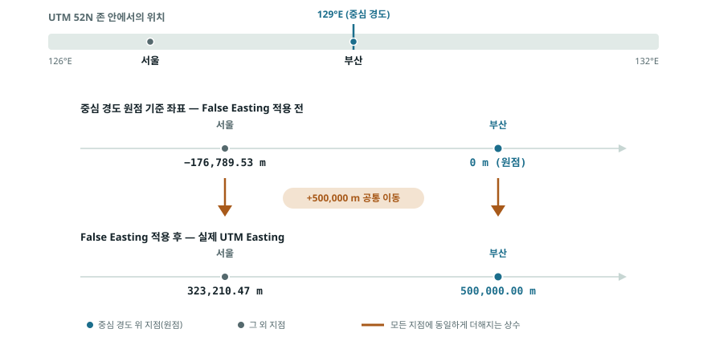
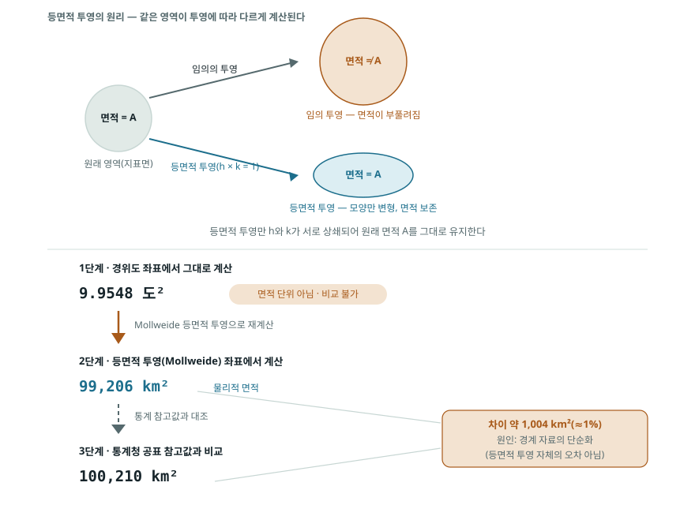
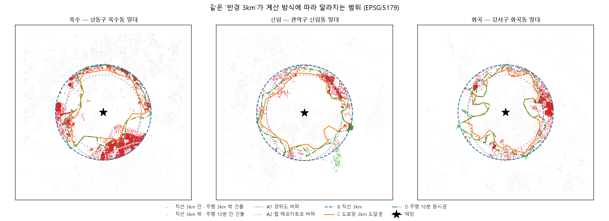
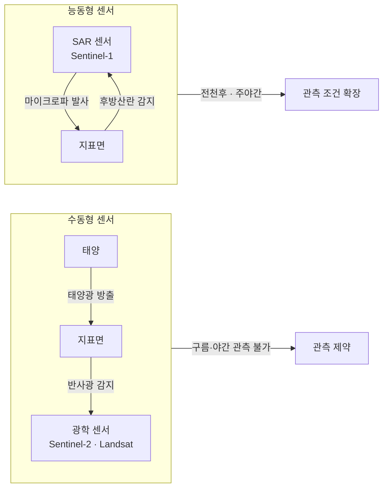

# 2장 공간 데이터 준비, 좌표계에서 분석 준비 데이터까지

> - 이 장에 나오는 좌표값, 거리, 권역 면적, 건물 수는 모두 `lecture_practice/chapter2/`의 코드를 실제로 실행해 얻은 값
> - 예시를 위해 지어낸 숫자는 없음

## 1. 이 장의 핵심 질문

- 건물 위치는 GPS가 준 경위도, 행정경계는 국내 투영 좌표계, 위성영상은 또 다른 좌표계의 픽셀 격자
- 이 셋을 한 지도에 겹치려면 무엇을 먼저 정해야 할까?
- "학교에서 반경 3km"라고 말할 때, 그 3km는 어디서부터 어떻게 재는 3km일까?
- 직선으로 3km와 도로를 따라 3km는 얼마나 다를까?
- 구름이 낀 날 찍힌 위성영상은 그냥 버리면 될까?

- 이 장은 **분석을 시작하기 전에 자료를 한 벌로 맞추는 작업**을 다룸
- 화려하지 않지만 여기서 생긴 오류는 **오류 메시지 없이 통과해** 최종 결과의 숫자로만 남음
- 그래서 각 단계에서 무엇을 확인해야 하는지가 이 장의 절반을 차지함

- 핵심은 다음 한 문장
- **좌표계를 정하지 않으면 거리도 면적도 계산할 수 없고, 계산해도 그 값이 무엇을 뜻하는지 말할 수 없음**

## 2. 직관적 비유

- **좌표계 = 오렌지 껍질을 종이에 펴 붙이는 방법**
- 오렌지 껍질을 찢지 않고 평평하게 펴는 것은 불가능함
- 어딘가는 늘어나고 어딘가는 찌그러짐
- 지구를 지도로 만들 때도 같음
- **어디를 정확하게 남기고 어디를 포기할지 고르는 것이 투영법 선택**
- 각도를 살리면 면적이 틀어지고, 면적을 살리면 모양이 틀어짐

- 대응을 하나씩 짚으면
- 오렌지 껍질 = 지구 표면
- 종이 = 지도 평면
- 찢어지는 자리 = 왜곡이 커지는 지역
- 어느 부위를 손상 없이 남길지 = 투영법이 보존하는 성질(각도·면적·거리 중 하나)

- **분석 준비 데이터 = 요리 전 손질을 마친 재료**
- 껍질 벗기고, 크기 맞춰 썰고, 상한 부분 골라낸 상태
- 여기서 상한 부분을 표시해 둔 것이 **품질 플래그**
- 손질을 건너뛰고 요리부터 하면 중간에 멈추게 됨

- 이 장의 산출물은 하나
- **같은 좌표계에 놓이고, 거리와 면적이 미터로 계산되며, 어느 픽셀을 믿을 수 있는지 표시된 자료 한 벌**

## 3. 핵심 개념 5가지

1. **좌표계에는 두 종류가 있고 쓰임이 다름**
   - **지리 좌표계**는 경도·위도로 위치를 적음. 단위가 도(degree)라 거리·면적 계산에 그대로 쓸 수 없음
   - **투영 좌표계**는 평면에 펴서 미터로 적음. 계산은 여기서 함
2. **버퍼의 "3km"는 좌표계가 정함**
   - 경위도 좌표계에서 `buffer(3000)`을 하면 3,000도가 되어 지구를 벗어남
   - 미터 좌표계로 바꾼 뒤에 해야 3km가 됨
3. **직선거리와 도로망 거리는 다름**
   - 도로를 따라간 거리가 직선보다 짧을 수는 없음
   - 둘의 비율을 **우회비**(circuity)라 하고, 실측 중앙값이 이론값보다 큼
4. **센서마다 볼 수 있는 것과 없는 것이 다름**
   - 광학은 구름을 못 뚫고, SAR는 구름을 뚫지만 판독이 어렵고, 열적외는 온도를 봄
5. **전처리를 직접 할지 받아 쓸지가 하나의 결정**
   - **ARD**(분석 준비 데이터)를 받으면 빠르지만, 그 제품이 남긴 잔차를 확인해야 함

## 4. 실제 자료를 먼저 보기

- 이 장도 정의보다 실제 자료를 먼저 보는 편이 이해가 쉬움

- EPSG 좌표계 데이터베이스 — 좌표계마다 번호가 붙어 있음
  https://epsg.io/
- 국토지리정보원 국가공간정보포털
  https://www.nsdi.go.kr/
- Copernicus Data Space Ecosystem (Sentinel-2 원본)
  https://dataspace.copernicus.eu/
- NASA HLS (Landsat·Sentinel-2 조화화 제품)
  https://hls.gsfc.nasa.gov/

- epsg.io에서 `4326`과 `5179`를 각각 검색해 보면 이 장의 절반이 눈에 들어옴
- **EPSG:4326** — WGS84 경위도. 단위가 도
- **EPSG:5179** — Korea 2000 / Unified CS. 단위가 미터, 한국 전역용
- **EPSG:32652** — WGS84 / UTM zone 52N. 단위가 미터, 한반도가 걸치는 존

- 같은 서울 시청이 좌표계에 따라 전혀 다른 숫자로 적힘
- 어느 숫자가 맞는가가 아니라 **어느 좌표계에서 적은 숫자인가**가 질문

## 실습 안내

- 실습 코드
  - `lecture_practice/chapter2/code/2-1-coordinate-transform.py` — 좌표 변환과 검증
  - `lecture_practice/chapter2/code/2-2-spatial-operations.py` — 버퍼·오버레이·공간 조인
  - `lecture_practice/chapter2/code/2-3-delivery-service-area.py` — 배달 권역 비교
- 결과 로그: `lecture_practice/chapter2/results/*.log`

- 이 장의 실습은 GPU가 필요 없음
- `lecture_practice/`는 노트북에서 돌아가도록 가볍게 만든 실습이고, `docs_practice/`는 연구 규모라 GPU를 씀
- 두 폴더의 숫자가 달라도 오류가 아님

## 5. 실제 사례로 먼저 보기

- `2-1-coordinate-transform.log`의 실제 실행 결과

- 서울 `(127.0°E, 37.5°N)`을 UTM 52N으로 옮기면 `(323,210.47m E, 4,152,220.15m N)`
- 부산 `(129.0°E, 35.1°N)`은 `(500,000.00m E, 3,884,132.78m N)`

- 부산의 동쪽 좌표가 정확히 `500,000.00`인 것이 눈에 띔
- 우연이 아님
- UTM은 각 존의 중심 경도에 **500,000m를 부여**해 존 서쪽 절반의 좌표가 음수가 되지 않게 함
- 이 보정값을 **False Easting**이라 부름
- 부산이 UTM 52존의 중심 경도(129°E)에 거의 정확히 놓여 있어 이런 값이 나옴



**그림 2.1** 중심 경도에 500,000m를 더하는 과정을 그림으로 확인할 수 있다.

- 변환이 제대로 됐는지 확인하는 방법은 **역변환**

- 원본 `(127.0, 37.5)` → UTM → 다시 경위도 → 복원 `(127.0000000000, 37.5000000000)`
- 오차 `0.000000000000014도`

- 이 오차는 사실상 0
- **변환 자체는 정보를 잃지 않음**
- 문제가 생기는 것은 변환을 안 했거나, 잘못된 좌표계로 했을 때

- 거리 계산을 두 방식으로 비교하면

| 구간 | UTM 평면거리 | Haversine(구면거리) | 차이 |
| --- | --- | --- | --- |
| 서울–부산 | 321.13km | 321.45km | 0.10% |
| 서울–제주 | 446.16km | 447.07km | 0.20% |
| 서울–인천 | 27.11km | 27.05km | 0.22% |

- 차이가 0.1~0.2%로 작음
- **한반도 규모에서는 UTM 평면거리를 써도 실무상 문제가 없다는 뜻**
- 다만 대륙 규모로 넘어가면 이 차이가 커짐

## 6. 데이터 준비의 일곱 단계

- 공간 데이터 준비는 순서가 있음
- 앞 단계를 건너뛰면 뒤 단계의 계산이 성립하지 않음

```
[1] 기준 좌표계 확정        → 분석 목적에 맞는 CRS 하나를 정함
        ↓
[2] 좌표 변환과 레이어 정합  → 모든 레이어를 그 좌표계로 옮김
        ↓
[3] 벡터 공간 연산          → 버퍼·오버레이·공간 조인
        ↓
[4] 거리 정의와 권역 설정    → 직선인가 도로망인가 시간인가
        ↓
[5] 관측 자료 선택          → 광학·SAR·열적외 중 무엇인가
        ↓
[6] 래스터 전처리           → 대기보정·구름 마스킹·해상도 정합
        ↓
[7] 분석 준비 데이터 확보    → 직접 만들 것인가 받아 쓸 것인가
```

**그림 2.2** 공간 데이터 준비의 일곱 단계

- 일곱 단계를 벡터와 래스터로 구분할 수는 있지만, 학습은 계열별로 나누어 진행하지 않음
- 좌표계를 설명한 뒤 좌표 변환 결과를 확인하고, 버퍼를 설명한 뒤 권역 비교 결과를 읽는 식으로 개념과 실습을 바로 연결함
- 어느 좌표계를 기준으로 삼을지 정하는 일은 벡터와 래스터 자료 모두에 먼저 적용함

- 각 단계가 이 장의 어느 절에서 다뤄지는지

| 단계 | 이 장의 절 |
| --- | --- |
| 1 기준 좌표계 확정 | 7절 |
| 2 좌표 변환과 정합 | 8절 |
| 3 벡터 공간 연산 | 9절 |
| 4 거리와 권역 | 10절 |
| 5 관측 자료 선택 | 11절 |
| 6 래스터 전처리 | 12절 |
| 7 분석 준비 데이터 | 13절 |

## 7. 기준 좌표계를 먼저 정한다

### 7.1 지리 좌표계와 투영 좌표계

- **좌표참조체계**(Coordinate Reference System, CRS)는 지구 위 위치를 수치로 적는 규칙
- 측지 기준, 투영법, 단위, 적용 범위를 함께 정의함

- **지리 좌표계** — 경도·위도로 적음. 단위가 도
- **투영 좌표계** — 평면에 펴서 적음. 단위가 미터

- 도(degree)를 거리 계산에 그대로 쓰면 안 되는 이유가 셋

1. **경도 1도의 실제 거리가 위도에 따라 달라짐** — 적도에서 약 111km, 서울 위도에서 약 88km
2. **위도 1도와 경도 1도의 길이가 다름** — 정사각형이라 믿고 계산하면 면적이 틀어짐
3. **각도를 더하고 빼는 계산에 물리적 의미가 없음** — "0.02695도 버퍼"가 몇 미터인지 말할 수 없음

- **측지 기준**(Datum)도 좌표를 바꿈
- 지구 형상을 근사한 타원체와 그 중심점의 정의
- 기준이 다르면 같은 지점의 좌표가 달라짐

### 7.2 어느 좌표계를 고를까

- 정답이 하나가 아니고 **분석 목적이 정함**

| 목적 | 고를 것 | 이유 |
| --- | --- | --- |
| 한국 전역 분석 | EPSG:5179 (Korea 2000 / Unified) | 한국 전역을 하나의 평면으로 덮음 |
| 좁은 지역 정밀 분석 | UTM 존 (EPSG:32651·32652) | 존 안에서 왜곡이 작음 |
| 면적 합산·밀도 계산 | 등면적 투영 | 면적 비율이 보존됨 |
| 웹 지도 배경 | EPSG:3857 (웹 메르카토르) | 타일 서비스 표준 |
| 자료 교환·저장 | EPSG:4326 (WGS84) | 국제 표준, 그러나 계산은 여기서 하지 않음 |

- 마지막 행이 자주 오해되는 곳
- 자료를 주고받을 때는 4326이 표준이지만 **계산은 미터 좌표계로 바꾼 뒤에 함**

- **축척계수**를 알아 두면 왜 존을 나누는지 이해됨
- 투영이 거리를 얼마나 늘이거나 줄이는지를 나타내는 비율
- UTM은 존 중심 경도에서 `0.9996`
- 즉 중심선에서는 실제보다 0.04% 짧게 나오고, 존 가장자리로 갈수록 늘어남
- 존을 6도씩 나누는 이유가 이 왜곡을 일정 범위 안에 묶기 위해서

- **면적을 계산할 때는 등면적 투영을 사용함**
- 경위도 좌표의 도²는 실제 면적 단위가 아니므로, 면적 비교 전에 등면적 좌표계로 변환함
- 실행 결과에서 한국 경계의 경위도 면적은 `9.9548도²`였지만, Mollweide로 계산한 면적은 `99,206km²`였음



**그림 2.3** 면적을 보존하는 투영의 원리와 한국 경계 자료의 실제 계산 결과를 함께 보여 줌.

## 8. 좌표를 옮기고 맞춘다

- **재투영**(reprojection)은 한 좌표계의 좌표를 다른 좌표계로 다시 계산하는 연산
- GeoPandas에서는 `to_crs()` 한 줄

- 옮긴 뒤에는 **반드시 검증**함
- 검증 방법 세 가지

1. **역변환 오차** — 다시 원래 좌표계로 되돌려 원본과 비교. 5절에서 본 `0.000000000000014도`가 그 값
2. **축 순서 확인** — 어떤 좌표계는 (경도, 위도) 순이고 어떤 것은 (위도, 경도) 순. 뒤바뀌면 한국이 바다 한가운데로 감
3. **지도 육안 확인** — 옮긴 레이어를 지도에 그려 제자리에 있는지 봄

- 세 번째가 가장 확실함
- 좌표계 오류는 대개 **결과가 어이없이 이상해서** 눈으로 잡힘
- 반대로 눈에 안 띄는 오류가 더 위험함

- 래스터는 하나가 더 있음
- **리샘플링**(resampling) — 픽셀 격자를 다른 해상도·정렬로 다시 계산
- 분류 자료에는 **쌍선형 보간을 쓰면 안 됨**
- 클래스 3과 클래스 5 사이에 클래스 4가 생겨나 원래 없던 범주가 만들어짐
- 분류 자료에는 최근접 이웃(nearest neighbor)을 씀

## 9. 벡터 공간 연산 세 가지

### 9.1 버퍼

- 점·선·면에서 일정 거리 안의 영역을 만드는 연산
- **거리의 단위는 좌표계가 정함**

- 이 한 줄이 이 장에서 가장 자주 사고가 나는 지점
- 경위도 좌표계에서 `buffer(3000)`을 하면 3,000도짜리 버퍼가 만들어짐
- 오류 메시지 없이 통과하고, 결과가 지구 전체를 덮음

### 9.2 오버레이

- 두 폴리곤 레이어를 겹쳐 기하학적 집합 연산을 계산함
- `intersection`(교집합), `union`(합집합), `difference`(차집합)

- 산출물은 원본 두 레이어의 속성을 모두 물려받은 새 폴리곤 집합
- 조각 하나하나가 "A의 어느 폴리곤이면서 B의 어느 폴리곤인가"를 알고 있음
- 침수구역과 건물을 겹치면 "침수구역 안에 있는 건물"만 남길 수 있음

### 9.3 공간 조인

- 속성 값이 아니라 **공간 관계**를 키로 삼아 두 레이어의 속성을 결합함
- `within`(안에 있음), `intersects`(겹침), `contains`(포함함)

- 조인 뒤에 **행 수를 반드시 확인함**
- 점이 두 폴리곤 경계에 걸치면 행이 늘어남
- 어느 폴리곤에도 안 들어가면 행이 줄어듦
- 조인 전후 행 수가 같아야 정상인 경우가 많고, 다르면 이유를 설명할 수 있어야 함

- 자료가 크면 **R-tree** 공간 인덱스를 씀
- 각 도형을 최소 경계 사각형으로 감싸 계층적으로 정리해 두고, 겹칠 가능성이 없는 후보를 먼저 걸러 냄
- 모든 쌍을 다 비교하지 않아도 되므로 계산이 크게 줄어듦

## 10. 직선거리와 도로망 거리는 다르다

- 여기서부터가 이 장의 실무 핵심

### 10.1 세 가지 거리

| 거리 | 정의 | 쓰는 곳 |
| --- | --- | --- |
| **직선 거리** | 두 점을 잇는 최단 직선 | 빠른 1차 선별 |
| **네트워크 거리** | 도로를 따라간 최단 경로 길이 | 실제 이동 |
| **통행시간** | 네트워크 거리 ÷ 속도 | 서비스 약속, 등시권 |

- 네트워크 거리는 직선 거리보다 **짧을 수 없음**
- 둘의 비율이 **우회비**(circuity) = 네트워크 거리 ÷ 직선 거리
- 완전한 직교 격자 도로망의 이론 평균은 `4/π ≈ 1.273`

### 10.2 실측은 이론값보다 크다

- `2-3-delivery-service-area.log`의 실제 실행 결과
- 서울 한 지점을 중심으로 도로망 14,035개 교차점·37,193개 구간·건물 37,717채를 놓고 계산함

- **우회비 중앙값 `1.493`, 90분위 `1.703`**
- 이론값 `1.273`보다 크고, 상위 10%는 1.7배를 넘음
- 실제 도로망이 완전한 격자가 아니기 때문
- 강, 철로, 막다른 길, 일방통행이 경로를 늘림

- 그래서 "직선 3km 안"과 "주행 3km 안"이 크게 갈라짐

### 10.3 권역을 네 방식으로 그려 비교하기

- 같은 중심점에 대해 네 가지 권역을 그림
- **B(투영 좌표계에서 3km 버퍼)를 기준**으로 삼음

| 권역 | 면적 | B 대비 | 건물 수 | B 대비 | 방식 |
| --- | ---: | ---: | ---: | ---: | --- |
| A1 | 22.33 km² | −20.9% | 6,473채 | −37.4% | 경위도에 0.02695° 버퍼 |
| A2 | 17.70 km² | −37.3% | 4,062채 | −60.7% | 웹 메르카토르에 buffer(3000) |
| **B** | **28.23 km²** | **기준** | **10,343채** | **기준** | **EPSG:5179에 buffer(3000)** |
| C | 14.22 km² | −49.6% | 2,418채 | −76.6% | 도로망 3,000m 도달권 |
| D | 17.97 km² | −36.3% | 3,978채 | −61.5% | 주행 10분 등시권(3,333m) |



**그림 2.4** 같은 3km 조건도 좌표계와 거리 정의에 따라 권역 모양과 포함 건물 수가 달라진다. 빨간 점은 직선 3km 안이지만 주행 3km 밖인 건물이고, 초록 점은 직선 3km 밖이지만 주행 10분 안인 건물이다.

- 읽는 순서가 있음

- **A1·A2는 좌표계를 잘못 쓴 결과**
- 경위도에 도 단위로 버퍼를 주거나(A1), 웹 메르카토르에서 미터 버퍼를 주면(A2) 실제보다 작게 나옴
- A2는 건물 수가 기준의 **39%**밖에 안 됨
- 웹 메르카토르는 위도가 올라갈수록 축척이 커지는데 그것을 무시하고 3,000을 넣었기 때문

- **C는 좌표계 문제가 아니라 거리 정의의 차이**
- 도로망으로 재면 건물이 2,418채로 기준의 **23%**
- 직선 3km 안에 있지만 주행 3km로는 못 가는 건물이 **7,925채(76.6%)**
- 이 건물들의 추가 주행거리는 중앙값 **720m**, 최대 **3,644m**

- **D∖B는 반대 경우**
- 직선 3km 밖인데 10분 안에 도달하는 건물이 11채
- 기준 건물 수의 0.1%에 불과함
- 큰길이 뚫린 방향으로만 생기는 현상

### 10.4 그래서 반경을 얼마로 정할까

- 배달 권역을 직선 반경으로 정해야 한다면, 오배정을 얼마나 감수할지가 결정 기준

- **오배정 0%까지 줄이려면 반경 187m**
- **오배정 5% 이하면 반경 1,271m**

- 187m는 사실상 영업이 불가능한 반경
- 즉 **직선 반경으로는 오배정을 완전히 없앨 수 없음**
- 실무에서는 5% 수준을 받아들이고 1,271m를 쓰거나, 아예 도로망 도달권을 씀

- 하나 더 확인할 것
- 반경 3km 원 안에서 **도로가 200m 안에 없는 구역이 14.0%**
- 산, 하천, 대규모 시설이 차지한 공간
- 원으로 그린 권역에는 이 구역이 포함되지만 실제로는 배달할 집이 없음

## 11. 어떤 센서로 관측할까

- 여기서부터 래스터 계열

| 센서 | 원리 | 볼 수 있는 것 | 약점 |
| --- | --- | --- | --- |
| **광학** | 태양광 반사를 측정 | 식생, 토지피복, 도시 구조 | 구름을 못 뚫음, 밤에 못 봄 |
| **SAR** | 마이크로파를 쏘고 되돌아온 세기 측정 | 침수, 지반 변위, 선박 | 판독이 어려움, 잡음이 많음 |
| **열적외** | 지표에서 나오는 열복사 측정 | 지표 온도, 열섬 | 해상도가 낮음 |

- 세 센서는 에너지원 기준으로 두 계열로 나뉨
- 광학·열적외는 태양광 반사와 지표 복사를 받기만 하는 **수동형**, SAR는 마이크로파를 직접 쏘는 **능동형**



**그림 2.5** 수동형 센서와 능동형 센서의 작동 원리

- **후방산란 계수**(σ⁰)는 SAR에서 센서 쪽으로 되돌아온 마이크로파의 세기
- 잔잔한 수면은 전파를 반대 방향으로 반사해 어둡게 나옴
- 건물과 산림은 여러 방향으로 산란해 밝게 나옴
- 이 성질 때문에 홍수 탐지에 SAR를 씀

- 다만 어두운 픽셀이 모두 물은 아님
- 아스팔트, 레이더 그림자, 평탄한 나대지도 어둡게 나옴
- 이 문제는 6장과 11장에서 다시 다룸

- **분광 지수**는 여러 밴드를 조합해 특정 특성을 강조한 값
- NDVI = (근적외선 − 적색) / (근적외선 + 적색)
- 식물의 엽록소가 근적외선은 반사하고 적색광은 흡수하는 성질을 이용함

- 센서 선택 기준 네 가지
1. 그 지역의 **구름 빈도** — 장마철 한국은 광학 관측이 자주 막힘
2. 필요한 **공간 해상도** — 건물 단위인가 행정동 단위인가
3. 필요한 **관측 주기** — 매일인가 계절마다인가
4. **야간 관측** 필요 여부

## 12. 위성영상 전처리

- 위성이 찍은 원본은 그대로 쓸 수 없음
- 대기를 통과하면서 값이 바뀌고, 구름이 가리고, 지형 때문에 위치가 틀어짐

### 12.1 대기보정

- **TOA**(대기 상단 반사도, Level-1C) — 위성이 받은 값 그대로
- **BOA**(지표 반사도, Level-2A) — 대기 영향을 제거한 값
- 둘을 가르는 것이 대기보정

- 왜 필요한가
- 같은 숲을 같은 위성이 찍어도 대기 상태에 따라 값이 달라짐
- 시계열 비교를 하려면 대기 영향을 걷어내야 함

### 12.2 구름 마스킹

- Sentinel-2 Level-2A에는 **SCL**(장면 분류) 밴드가 함께 옴
- 픽셀을 12개 클래스로 나눔 — 구름 높음/중간/낮음, 구름 그림자, 식생, 나대지, 물, 눈 등

- 마스킹 강도를 정하는 것이 결정
- 강하게 걸면 깨끗한 픽셀만 남지만 자료가 적어짐
- 약하게 걸면 자료는 많지만 구름 낀 픽셀이 섞임
- **어느 쪽이 옳은지는 분석 목적이 정함**

### 12.3 시간 합성

- 구름을 걷어내면 픽셀마다 관측 시점이 달라짐
- 여러 시점을 묶어 하나의 영상으로 만드는 것이 시간 합성

- 세 단계로 진행함
1. **합성 구간을 정함** — 짧으면 유효 픽셀이 모자라 결측이 남고, 길면 그 사이의 변화가 섞임
2. **합성 방식을 정함** — 중앙값, 최대 NDVI, 최근접 시점 중 선택
3. **결측을 확인함** — 구간 내내 구름이 낀 지역이 있는지

## 13. 분석 준비 데이터를 받을까 만들까

- **ARD**(Analysis Ready Data, 분석 준비 데이터)는 기하보정·대기보정·품질 플래그·표준 메타데이터가 갖춰져 즉시 분석 가능한 데이터

- 12절의 절차를 직접 할 것인지, 이미 처리된 제품을 받아 쓸 것인지가 이 단계의 첫 결정

| 기준 | 직접 전처리 | ARD 수령 |
| --- | --- | --- |
| 시간 | 오래 걸림 | 즉시 |
| 통제 | 모든 단계를 조정 가능 | 제공자의 선택을 따름 |
| 재현성 | 내 코드로 재현 | 제품 버전으로 재현 |
| 적합한 경우 | 특수한 보정이 필요할 때 | 표준 분석 |

- 주요 제공 플랫폼
- **Microsoft Planetary Computer** — Sentinel-2 L2A와 Landsat C2 L2를 STAC API로 제공함
- **Google Earth Engine** — 클라우드에서 대규모 처리
- **NASA HLS** — Landsat 8/9와 Sentinel-2를 조화화해 30m 해상도, 2~3일 주기의 통합 시계열로 제공함

- HLS 같은 조화화 제품은 편리하지만 **잔차를 확인해야 함**
- 두 위성의 밴드 파장이 완전히 같지 않고, 관측 각도도 다름
- **BRDF**(지표 반사도가 태양·센서 각도에 따라 달라지는 성질)를 보정해도 완전히 같아지지는 않음
- 위성 계열별로 나누어 시계열을 그려 보고, 계열 간 단차가 남았는지 확인함

## 14. 데이터 준비 점검표

- 일곱 단계를 마쳤으면 아래를 확인함
- 채우지 못한 행이 있으면 그 단계를 다시 봐야 함

| 항목 | 확인할 내용 |
| --- | --- |
| 기준 좌표계 | 어느 CRS를 기준으로 정했고 그 이유는 |
| 레이어 정합 | 모든 레이어가 그 좌표계에 있는가. 역변환 오차는 |
| 단위 | 거리·면적이 미터로 계산되는가 |
| 공간 연산 | 조인 전후 행 수가 설명되는가 |
| 거리 정의 | 직선인가 네트워크인가 시간인가. 우회비는 |
| 센서 선택 | 구름 빈도·해상도·주기·야간 조건을 확인했는가 |
| 전처리 수준 | TOA인가 BOA인가. 마스킹 강도는 |
| 품질 플래그 | 믿을 수 없는 픽셀이 표시되어 있는가 |
| 제품 잔차 | 조화화 제품이면 계열 간 단차를 확인했는가 |

## 15. 활동 / 토론

- **활동 1 (15분) — 좌표계를 바꿔 가며 버퍼 그리기**
  - `python lecture_practice/chapter2/code/2-1-coordinate-transform.py`를 실행
  - 서울 좌표가 `(323,210.47m E, 4,152,220.15m N)`으로 나오는지 확인
  - 부산의 동쪽 좌표가 왜 정확히 `500,000.00`인지 한 문장으로 설명

- **활동 2 (20분) — 권역 네 개 비교하기**
  - `python lecture_practice/chapter2/code/2-3-delivery-service-area.py`를 실행
  - 10.3의 표와 대조
  - **A2가 왜 기준의 39%밖에 안 되는지** 웹 메르카토르의 성질로 설명
  - 우회비 중앙값이 이론값 1.273보다 큰 이유를 서울 지형에서 찾아 한 문장으로 작성

- **활동 3 (20분) — 내 동네로 바꿔 보기**
  - 코드의 중심 좌표를 자기가 사는 동네로 바꿔 다시 실행
  - 우회비 중앙값이 서울 중심부와 어떻게 다른가
  - **강이나 산이 있는 동네일수록 우회비가 커지는지** 확인
  - 값이 크게 다르면 그 이유를 지도를 보며 설명

- **활동 4 (15분) — 오배정을 얼마나 받아들일까**
  - 10.4의 반경 컷라인을 다시 봄
  - 오배정 0%면 187m, 5% 이하면 1,271m
  - 배달 사업자라면 어느 쪽을 고를지, 그 선택이 어떤 비용을 감수하는 것인지 적음
  - **오배정된 주문 한 건의 실제 비용**이 무엇인지도 함께 적음

- **토론 1:** 좌표계 오류는 왜 오류 메시지 없이 통과할까? 프로그램이 잡아 주지 못하는 오류를 사람이 잡으려면 무엇을 알아야 할까?
- **토론 2:** 도로망 도달권이 더 정확한데도 실무에서 원형 반경을 계속 쓰는 이유는 무엇일까? 언제 원형으로 충분하고 언제 안 될까?
- **토론 3:** 구름 마스킹을 강하게 걸면 자료가 줄고 약하게 걸면 오염됨. 홍수 피해 판독과 연간 식생 변화 추적에서 각각 어느 쪽을 택할지, 이유와 함께 말해 보라.

## 16. 체크 질문

1. 지리 좌표계와 투영 좌표계는 무엇이 다르며, 거리 계산을 어디서 해야 하는가?
2. UTM에서 False Easting 500,000m는 왜 필요한가?
3. 좌표 변환이 제대로 됐는지 확인하는 세 가지 방법은?
4. 경위도 좌표계에서 `buffer(3000)`을 하면 무슨 일이 일어나는가?
5. 공간 조인 뒤에 행 수를 확인해야 하는 이유는?
6. 우회비란 무엇이며, 실측 중앙값 1.493이 이론값 1.273보다 큰 이유는?
7. 실습에서 A2(웹 메르카토르 버퍼)의 건물 수가 기준의 39%였다. 왜 그런가?
8. 직선 3km 안이지만 주행 3km로 못 가는 건물이 76.6%였다. 이 숫자가 배달 사업에 뜻하는 바는?
9. TOA와 BOA의 차이는 무엇이며, 시계열 비교에 왜 대기보정이 필요한가?
10. 분류 자료를 리샘플링할 때 쌍선형 보간을 쓰면 안 되는 이유는?
11. ARD를 받아 쓸 때 확인해야 하는 잔차는 무엇인가?

## 17. 과제

```bash
python scripts/submit.py 2 --id 학번 --name 이름
```

- 실행하면 `submissions/` 폴더에 `제출_2장_학번.md`가 생성되고 실행 결과가 붙어 있음
- **눈여겨볼 곳은 좌표 변환값, 역변환 오차, 권역 비교표, 우회비**

- 빈칸 네 개를 채움

1. 권역 비교표에서 A2의 건물 수가 기준의 39%로 나왔다. 그 원인을 좌표계 성질로 설명하라
2. 우회비 중앙값과 90분위를 옮겨 적고, 두 값의 차이가 뜻하는 바를 한 문장으로
3. **반경 컷라인 187m와 1,271m 중 하나를 골라 그 근거를 적으라. 고르지 않은 쪽을 버리는 비용도 함께 적으라**
4. **자기 동네 좌표로 다시 실행해 우회비를 비교하고, 차이가 난 이유를 지형으로 설명하라**

- **3번과 4번이 핵심**
- 1·2번은 표를 읽으면 나오지만 3·4번은 판단이 필요함

> - **막혀도 제출함**
> - 실행이 실패하면 오류 메시지가 파일에 담기고, 질문이 "어디서 막혔나"로 바뀜
> - 실행 성공 여부로 점수를 매기지 않음

> - **이 장의 도로망 실습은 미리 저장한 스냅샷을 씀**
> - 인터넷에서 매번 내려받지 않으므로 값이 사람마다 같아야 정상
> - 중심 좌표를 바꾸면 당연히 달라짐

## 18. 더 알아보기

- **좌표계를 손으로 확인해 보기**
  - epsg.io(https://epsg.io/)에서 `5179`, `32652`, `3857`을 각각 열어 단위·적용 범위·왜곡 성질을 비교하면 7절의 표가 손에 잡힘
- **투영법이 무엇을 포기하는지 눈으로 보기**
  - The True Size Of(https://thetruesize.com/)에서 나라를 끌어 옮겨 보면 메르카토르가 고위도를 얼마나 부풀리는지 확인할 수 있음
- **도로망 자료 직접 다뤄 보기**
  - OSMnx 문서(https://osmnx.readthedocs.io/)는 OpenStreetMap 도로망을 내려받아 최단 경로·등시권을 계산하는 방법을 예제로 설명함
- **위성영상 전처리 표준**
  - CEOS Analysis Ready Data(https://ceos.org/ard/)는 ARD가 갖춰야 할 조건을 국제 표준으로 정리해 둠
