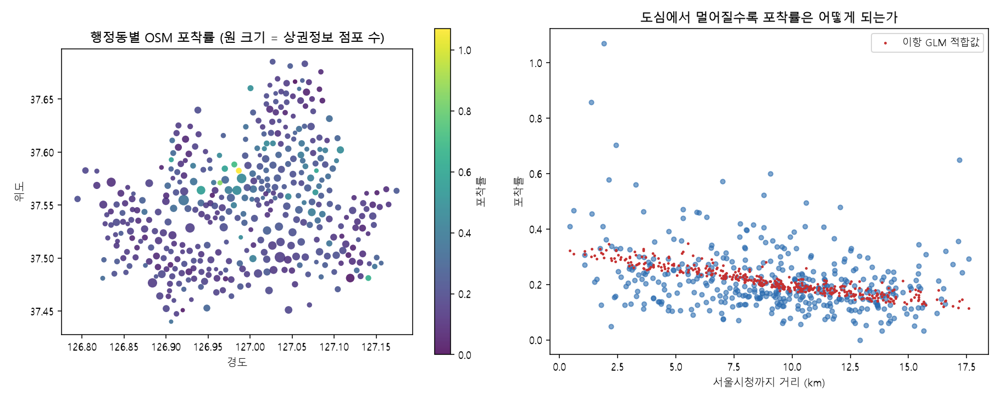

# 3장 공간 데이터 확보, 탐색에서 편향 판정까지

> - 이 장에 나오는 검색 결과 개수, 파일 크기, 읽기 시간, 포착률, 회귀 계수는 모두 `lecture_practice/chapter3/`의 코드를 실제로 실행해 얻은 값
> - 예시를 위해 지어낸 숫자는 없음

## 1. 이 장의 핵심 질문

- 위성영상은 페타바이트 단위로 쌓여 있는데, 그중 내가 쓸 조각만 어떻게 골라낼까?
- "이 지도에 카페가 안 보인다"와 "이 자리에 카페가 없다"는 같은 말일까?
- 공공은 시설이 부족한 동네를 놓치면 손해고, 기업은 이미 포화된 상권에 뛰어들면 손해임 — 같은 실수를 반대 방향에서 저지르는 셈인데, 이 둘을 가르는 계산은 무엇일까?
- 무료 지도 데이터와 유료 지도 데이터를 섞어 써도 될까? 섞은 결과물은 누구에게 공개해도 될까?

- 이 장은 두 부분으로 나뉨
  - 앞부분은 **자료를 손에 넣는 절차** — 어디서 찾고, 어떻게 받고, 얼마나 믿을 수 있는지 점검하고, 써도 되는지 확인하는 네 단계
  - 뒷부분은 **손에 넣은 자료가 현실을 얼마나 고르게 담았는지 판정하는 절차** — 지도에 없는 것이 정말 없는 것인지 재는 두 단계
- 핵심은 다음 한 문장
  - **"자료에 없다"와 "현실에 없다"는 다른 말이며, 이 둘을 구분하지 못하면 공공은 이미 시설이 있는 곳에 예산을 보내고 기업은 꽉 찬 시장을 빈 시장으로 오판함**

## 2. 직관적 비유

- **데이터 확보 절차 = 정품 재료를 필요한 만큼만 사 오는 일**
- 대응을 하나씩 짚으면
  - 소스 선정 = 어느 가게에서 살지 정하기
  - 카탈로그 검색 = 그 가게에서 원하는 물건을 찾기
  - 포맷과 부분 읽기 = 덩어리째 사지 않고 필요한 부위만 잘라 사기
  - 품질 점검 = 상한 부분이 없는지 확인하고 표시해 두기
  - 권한 판정 = 영수증과 원산지 표시를 확인해 되팔아도 되는지 알아 두기
- 한 단계를 건너뛰면 다음 단계에서 계산이 안 맞거나, 나중에 반품하듯 되돌아가야 함
- 이 대응은 절차의 순서와 의존 관계를 그대로 옮긴 것이며, 실제 순서는 6절에서 흐름도로 다시 나옴

- **포착률 = 그물코의 크기**
- 그물코가 크면 큰 물고기만 걸리고 잔챙이는 다 빠져나감
- 그물에 안 걸렸다고 그 물에 잔챙이가 없다는 뜻은 아님 — 그물이 성길 뿐임
- 지도 자료도 같은 구조를 가짐
  - 사람이 등록해야 잡히는 자료(점포 POI, 카드 매출)는 그물코가 큼 → 실제로 있어도 안 잡히는 경우가 생김
  - 위성이 지표를 훑는 자료는 그물코라는 개념 자체가 없음 → 구름만 없으면 다 잡힘
- **포착률은 이 그물코가 얼마나 촘촘한지를 숫자로 잰 것**이며, 12~13절에서 실제로 계산함

## 3. 핵심 개념 6가지

1. **STAC는 위성영상 카탈로그를 검색하는 공통 규격**
   - Catalog(전체) → Collection(같은 유형끼리 묶음) → Item(한 장면) → Asset(실제 파일)의 네 단계로 구성됨
2. **부분 읽기는 파일 전체가 아니라 필요한 조각만 받는 것**
   - HTTP Range Request로 바이트 구간을 지정해 요청하며, COG·Zarr·GeoParquet가 이 구조를 각각 래스터·다차원 배열·벡터 테이블에 맞춰 구현함
3. **포맷은 자료의 차원 구조가 정함**
   - 2차원 영상 한 장이면 COG, 시간 축이 붙으면 Zarr, 점·선·면의 테이블이면 GeoParquet
4. **품질 점검을 거치지 않은 자료는 관측 조건을 지표 상태로 착각하게 만듦**
   - 구름, 정합 오차, 무효 지오메트리를 걸러내지 않으면 모델이 지표 대신 관측 조건을 학습함
5. **사용 권한은 라이선스 하나로 끝나지 않음**
   - 여러 자료를 결합하면 그중 가장 까다로운 조건이 결과물 전체에 적용되고, 결합 결과가 개인을 식별할 위험도 따로 판정해야 함
6. **"0개로 보인다"와 "0개가 맞다"는 다른 확률로 계산됨**
   - 포착률이 낮은 자료일수록 지도의 빈 칸은 진짜 빈 자리가 아니라 그물을 빠져나간 자리일 가능성이 큼

## 4. 실제 자료를 먼저 보기

- 이 장도 정의보다 실제 자료를 먼저 열어 보는 편이 이해가 빠름

- Microsoft Planetary Computer STAC API
  https://planetarycomputer.microsoft.com/api/stac/v1
- STAC 공식 사이트
  https://stacspec.org/
- 공공데이터포털 — 상가(상권)정보
  https://www.data.go.kr/data/15083033/fileData.do
- 서울 열린데이터광장 — 상권분석서비스(추정매출-행정동)
  https://data.seoul.go.kr/dataList/OA-22175/S/1/datasetView.do
- OpenStreetMap Overpass API
  https://wiki.openstreetmap.org/wiki/Overpass_API
- 공공누리(KOGL) — 공공저작물 이용허락 표시기준
  https://www.kogl.or.kr/

- Planetary Computer STAC API 주소를 브라우저에 그대로 붙여 넣으면 JSON 응답이 뜸
- 이 JSON 하나가 이 장 앞부분(카탈로그 검색)이 다루는 전부임 — Catalog가 실제로 무엇을 담고 있는지 눈으로 바로 확인할 수 있음
- 상가(상권)정보와 상권분석서비스 페이지에서는 실제 파일을 내려받을 수 있음 — 이 장 뒷부분(포착률 측정)이 쓰는 원자료가 이것

## 실습 안내

- 실습 코드
  - `lecture_practice/chapter3/code/3-0b-commercial-bias-data-prep.py` — 포착률 분석용 자료 준비(먼저 실행)
  - `lecture_practice/chapter3/code/3-1-stac-search.py` — STAC 카탈로그 검색
  - `lecture_practice/chapter3/code/3-2-cloud-formats.py` — 포맷별 성능 비교
  - `lecture_practice/chapter3/code/3-3-cog-partial-read.py` — COG 부분 읽기
  - `lecture_practice/chapter3/code/3-4-commercial-data-bias.py` — 포착률·편향 진단·등급 판정
- 결과 로그: `lecture_practice/chapter3/results/*.log`

- `3-4`는 `3-0b`가 만든 자료를 입력으로 받으므로 **`3-0b`를 먼저 실행**해야 함
- 이 장의 실습은 GPU가 필요 없음
- 이 장의 실습과 본문 수치는 전부 `lecture_practice/chapter3/`에서 나옴

## 5. 실제 사례로 먼저 보기

- `3-1-stac-search.log`의 실제 실행 결과
  - Planetary Computer에서 Sentinel 관련 컬렉션을 조회하면 `16`개가 잡힘
  - 서울 일대(bbox 126.8~127.2°E, 37.4~37.7°N), 2024년 6~8월, 구름 10% 미만 조건으로 검색하면 Sentinel-2 영상 `5`개가 반환됨
  - 구름 비율은 8.1 / 0.0 / 9.9 / 7.0 / 9.0%(평균 6.8%) — 여름 석 달을 통틀어도 구름 5% 미만은 1개뿐
  - 같은 조건으로 Landsat을 검색하면 `6`개 — Sentinel-2의 재방문 주기(5일)가 Landsat(16일)보다 짧아 더 자주 잡힘
  - 첫 Item(`S2B_MSIL2A_20240829T021539_R003_T52SCG_20240829T043313`)은 Asset을 23개 담고 있음

- `3-3-cog-partial-read.log`의 실제 실행 결과
  - 이 Item의 Red 밴드(B04) 파일 전체 크기는 `268.5MB`, 전체 해상도는 10,980행×10,980열(약 1억 2천만 픽셀)
  - 강남 소구역만 잘라 읽으면 216행×270열(58,320픽셀, 전체의 0.048%)이 `1.44초`에 도착함
  - 268.5MB 파일은 이 과정에서 **한 번도 로컬에 통째로 저장되지 않음**

- `3-2-cloud-formats.log`의 실제 실행 결과
  - 5만 개 포인트를 세 포맷으로 각각 저장하면 GeoJSON 11.89MB, Shapefile 21.05MB, GeoParquet 2.18MB
  - 읽기 시간은 GeoParquet가 0.055초로 GeoJSON(0.723초)보다 13.2배, Shapefile(0.540초)보다 9.8배 빠름
  - 컬럼 6개 중 2개만 골라 읽어도 0.066초로 오히려 전체를 읽는 0.046초보다 느림(0.7배) — 컬럼이 6개뿐이면 건너뛰는 이득보다 처리 비용이 더 큼

- 세 로그가 공통으로 보여 주는 것 하나
  - **필요한 조각만 받는 구조**가 성립하려면 서버가 부분 요청을 지원해야 하고 파일 내부가 조각 단위로 나뉘어 있어야 함
  - 이 조각 구조가 어떻게 만들어지는지는 9절(포맷 결정)에서 다룸

## 6. 데이터 확보의 일곱 단계

- 자료를 확보하는 절차는 순서가 있음
- 앞 단계를 건너뛰면 뒤 단계의 판단 근거가 사라짐 — 포맷을 정하지 않은 채 카탈로그를 검색하면 어떤 Asset을 받을지 정할 수 없음

```
[1] 소스 선정            → 후보 데이터 목록, 해상도·주기·비용 판정
        ↓
[2] 카탈로그 검색        → Item 목록, Asset URL, 검색 조건 기록
        ↓
[3] 포맷 결정·부분 읽기  → 필요한 영역만 담은 로컬 배열·테이블
        ↓
[4] 품질 점검·메타데이터 → 유효 픽셀 마스크, 정합·지오메트리 판정, 메타데이터 레코드
        ↓
[5] 사용 권한 판정       → 라이선스 결합 판정, 개인정보 처리 요건, 공개 가능 범위
        ↓
[6] 포착률 측정          → 업종·단위별 포착률, 편향의 체계성 검정 결과
        ↓
[7] 사용 등급 판정       → 컷라인, 등급별 공간단위 목록, 보정식
```

**그림 3.1** 데이터 확보의 일곱 단계와 단계별 산출물

- 6·7단계는 조건부임
  - 위성 관측처럼 그 자체가 모집단인 자료에는 "빠진 대상"이라는 개념이 성립하지 않아 6·7단계를 적용하지 않음
  - 사람이 등록하거나 결제 수단에 잡히는 자료(POI, 카드 매출, 유동인구)에만 6·7단계가 필요함

- 각 단계가 이 장의 어느 절에서 다뤄지는지

| 단계 | 이 장의 절 |
| --- | --- |
| 1 소스 선정 | 7절 |
| 2 카탈로그 검색 | 8절 |
| 3 포맷·부분 읽기 | 9절 |
| 4 품질·메타데이터 | 10절 |
| 5 권한 판정 | 11절 |
| 6 포착률 측정 | 12절 |
| 7 사용 등급 판정 | 13절 |

## 7. 소스를 고른다

### 7.1 위성영상은 네 축으로 갈린다

- 해상도, 재방문 주기, 밴드 구성, 비용 — 이 네 가지가 위성영상을 고르는 기준
- 해상도 30m에서는 한 픽셀이 가로세로 30m라, 폭 8m인 도로가 다른 지표와 섞여 들어감
- 해상도 10m에서도 개별 건물의 윤곽은 안 잡힘 — 건물 단위 판독에는 1m 이하가 필요함

| 데이터셋 | 운영 | 해상도 | 재방문 주기 | 밴드 수 | 접근 경로 |
| --- | --- | --- | --- | --- | --- |
| Landsat 8/9 | USGS | 30m | 8일(쌍체) | 11 | AWS, GEE, USGS |
| Sentinel-2 | ESA | 10m | 5일(쌍체) | 13 | Copernicus, Planetary Computer |
| MODIS | NASA | 250m~1km | 1~2일 | 36 | LAADS, GEE |
| Planet(Dove) | Planet | 3~5m | 1일 | 8 | 상업 API |
| WorldView | Maxar | 0.3m | 1~3일 | 8~16 | 상업 계약 |

- Landsat은 1972년부터 이어지는 가장 긴 관측 기록을 가짐 — 50년치 아카이브가 토지피복 변화와 장기 환경 추세 분석에 쓰임(Wulder et al., 2022)
- Sentinel-2는 10m·5일 주기를 제공하고, Level-2A 제품은 대기보정과 장면 분류 밴드(SCL)를 함께 담음
- **밴드**는 광학 센서가 파장 구간별로 나누어 기록한 반사광 값
  - 식물 엽록소는 적색을 흡수하고 근적외선을 강하게 반사함 → 두 밴드의 대비로 식생 활력을 계산함
  - 물은 근적외선을 거의 반사하지 않음 → 수역 추출에 씀
  - 밴드가 몇 개인지보다 필요한 파장 구간이 있는지가 선정 기준 — 산불 피해 추정에는 단파적외선 밴드가 있어야 함

### 7.2 벡터·보조 데이터와 국내 인프라

- 래스터 영상만으로는 행정 경계, 도로망, 시설 위치를 알 수 없음 — 벡터 자료를 함께 확보해야 함

| 자료 | 성격 | 확인할 것 |
| --- | --- | --- |
| OpenStreetMap(OSM) | 자원봉사 기여로 만든 전 세계 도로·건물·POI | ODbL, 지역별 완전성 차이가 큼, 업종 태그가 한국 표준산업분류와 안 맞음 |
| Natural Earth | 소·중축척 행정경계·지형 | 퍼블릭 도메인, 배경 레이어용 |
| SRTM/ASTER DEM | 30m 전 지구 수치표고모델 | 경사·유향 계산, 정사보정 |
| WorldPop | 100m 격자 인구밀도 추정 | 재난 노출 인구, 접근성 분석 분모 |
| Overture Maps | 건물·도로·POI GeoParquet 배포 | 레코드 출처별로 라이선스가 갈림 |

- 국내 정책 분석에서는 통계청 **SGIS**의 통계격자(100m·500m·1km)와 집계구를 표준 공간단위로 씀
- 격자를 쓰는 이유는 둘
  1. 행정경계는 통폐합·분동으로 바뀌지만 격자는 경계가 고정돼 시계열 비교에서 경계 변경분이 섞이지 않음
  2. 100m 격자는 행정동보다 미세한 패턴을 담으면서도 개인을 직접 식별하지 않음(격자가 작아질수록 소수 인원 칸이 늘어 마스킹 대상이 많아짐 — 11절에서 다시 다룸)

### 7.3 상업·반공개 데이터의 알려진 편향

- 매장 위치, 방문객 수, 결제액, 부동산 거래가격은 공공 통계로 채워지지 않음

| 데이터 | 제공 기관 | 공개 여부 | 알려진 편향 |
| --- | --- | :---: | --- |
| 상가(상권)정보 | 소상공인시장진흥공단 | 공개 | 폐업 신고 지연분이 남고 무허가 영업은 애초에 없음 |
| 생활인구 | 서울시(KT 제공) | 공개(서울) | 특정 통신사 가입자 구성이 표본을 정함, 소수 인원 칸 마스킹 |
| 실거래가 | 국토교통부 | 공개 | 신고 지연분 누락, 상업업무용은 매매만·지번 일부만 공개 |
| POI | Overture/OSM | 공개 | 기여자가 많은 지역에 편중 |
| 상권분석서비스 추정매출 | 서울신용보증재단 | 공개(서울) | 카드 결제만 잡히고 빠지는 정도가 업종·지역마다 다름 |
| 통신사 유동인구 | SKT·KT·LGU+ | 유료 | 가입자 구성이 연령·지역마다 다름 |
| 카드 매출 | 신한카드·BC카드 등 | 유료 | 해당 카드사 점유율만큼만 담김, 현금 결제는 어디에도 없음 |

- 표의 "알려진 편향" 열은 무엇이 빠지는지를 적은 것이고, **얼마나 빠지는지는 12절의 포착률 측정으로 확인함**
- 소상공인시장진흥공단 상가(상권)정보는 매출 필드가 없음(2026-08 확인) — 매출 변수는 다른 자료에서 구해야 함
- 국토교통부 실거래가는 상업업무용이 매매만 공개되고 지번도 일부만 공개됨(2026-08 확인) — 후보지 단위 좌표에는 결측이 남고 행정동·격자 집계에는 쓸 수 있음
- 유료 자료를 계약하기 전에는 네 가지를 확인함
  1. 수집 방식(앱 SDK 표본인가, 카드 결제 전표인가) — 무엇이 빠지는지가 여기서 정해짐
  2. 표본 구성(어느 통신사·카드사 점유율만큼 담기는가)
  3. 재배포·파생물 공개 조건(11절의 결합 판정으로 이어짐)
  4. 갱신·정의 변경 이력(수집 방식이 중간에 바뀌면 시계열이 끊김)

### 7.4 소스 선정 판정 흐름

```
분석 대상의 최소 식별 크기는 얼마인가?
    ├─ 건물·차량 단위(수 m) → 1m 이하 상업 영상 또는 항공·드론
    ├─ 필지·블록 단위(수십 m) → Sentinel-2(10m) 또는 Planet(3~5m)
    └─ 토지피복·유역 단위(수백 m 이상) → Landsat(30m) 또는 MODIS
                ↓
        필요한 갱신 주기는 얼마인가?
                ├─ 일 단위 → MODIS·Planet, 또는 Sentinel-1 SAR
                └─ 계절·연 단위 → Landsat·Sentinel-2 시간 합성
                        ↓
        공개 자료로 대상 변수를 만들 수 있는가?
                ├─ 예 → 공개 자료로 확정, 8절(카탈로그 검색)로 이동
                └─ 아니오 → 상업 자료 검토(예산·재배포 조건을 11절에서 판정)
```

**그림 3.2** 소스 선정 판정 흐름

- 상업 자료는 공개 자료로 변수를 만들 수 없을 때만 검토함
- 이 순서를 지키는 이유는 비용이 아니라 **재현성**임 — 상업 자료로 만든 결과는 계약이 끝나면 다른 연구자가 재현할 수 없고, 재배포 금지 조항이 붙으면 원자료를 공개 저장소에 둘 수 없음

- 접근 플랫폼도 함께 정함 — Google Earth Engine(서버 연산, 비상업 무료), Microsoft Planetary Computer(STAC 기반, 이 장의 실습이 쓰는 플랫폼), AWS Open Data(데이터 무료·컴퓨팅 유료), Copernicus Data Space(Sentinel 전용)
- STAC 규약으로 코드를 짜면 엔드포인트 URL만 바꿔 플랫폼을 옮길 수 있음 — 장기 과제에서는 플랫폼 고유 API보다 이전 비용이 낮음

## 8. 카탈로그를 검색한다

### 8.1 STAC의 구조

- 위성영상 메타데이터는 센서마다 형식이 달랐음 — Landsat은 MTL 텍스트, Sentinel-2는 XML 매니페스트, MODIS는 HDF 내부 속성
- 센서마다 별도 파싱 코드가 필요했고, 같은 조건("구름 10% 미만, 이 사각형 안, 이 기간")을 세 번 다르게 표현해야 했음
- **STAC**(SpatioTemporal Asset Catalog)는 이 문제를 풀기 위해 2018년 Radiant Earth Foundation 주도로 만든 오픈 표준이며, 2025년 OGC 공식 커뮤니티 표준으로 승인됨(STAC Specification, n.d.)

| 객체 | 역할 | 예시 |
| --- | --- | --- |
| Catalog | 최상위 컨테이너 | Planetary Computer 전체 |
| Collection | 같은 유형 Item의 그룹 | `sentinel-2-l2a` |
| Item | 개별 관측 단위(GeoJSON Feature) | 특정 날짜·타일의 장면 |
| **Asset** | Item이 가리키는 실제 파일 | `B04.tif`, `SCL.tif` |

- Item이 GeoJSON Feature 형식을 따르므로 별도 파서 없이 모든 GIS 도구에서 읽을 수 있음
- Item의 `geometry`는 자산 전체의 공간 범위를 WGS 84 좌표로 나타냄
- `properties`에는 관측 시각인 `datetime`과 검색에 필요한 메타데이터가 들어감
- 도메인별 속성은 Extension으로 규정함 — EO(`eo:cloud_cover`로 구름 필터링), SAR(`sar:polarizations`), Projection(원본 자산의 좌표계), View(태양·관측 각도)

### 8.2 검색 절차 여섯 단계

1. **엔드포인트 접속** — Catalog API를 열고 Collection 목록을 받음(실습 로그에서 Sentinel 관련 16개 확인)
2. **Collection 선택** — 처리 수준을 정함. `sentinel-2-l1c`는 대기 상단 반사율, `sentinel-2-l2a`는 대기보정을 마친 지표 반사율. 지표 상태를 보려면 L2A를 고름
3. **조건 설정** — bbox(공간), datetime(시간), query(품질 조건, 예: 구름 10% 미만)를 지정함

```python
from pystac_client import Client

catalog = Client.open("https://planetarycomputer.microsoft.com/api/stac/v1")
search = catalog.search(
    collections=["sentinel-2-l2a"],
    bbox=[126.8, 37.4, 127.2, 37.7],          # 서울 일대
    datetime="2024-06-01/2024-08-31",
    query={"eo:cloud_cover": {"lt": 10}},     # 구름 10% 미만
)
items = list(search.item_collection())
```

4. **Item 목록 수신** — 5절에서 본 것처럼 조건을 만족하는 Item 5개가 반환됨
5. **Asset URL 획득** — 첫 Item은 Asset 23개를 담음(B01~B09·B11·B12·B8A는 `profile=cloud-optimized`, 나머지는 메타데이터 XML·tilejson·미리보기 PNG). Sentinel-2 L2A에는 권운 밴드 B10이 없어 밴드 구성이 이렇게 됨
6. **검색 조건과 Item ID 기록** — 엔드포인트, Collection, bbox, 기간, 품질 조건, 반환 Item ID를 전부 남김. 이 기록이 10절의 메타데이터 레코드로 이어짐

> - **라이브 카탈로그 조회는 재현되지 않음**
> - 아카이브가 갱신되거나 장면이 재처리되면 같은 조건에서도 반환 개수가 달라짐
> - 검색 시점과 반환 Item ID를 함께 기록하고, "5개가 검색되었다"가 아니라 실제로 쓴 Item ID를 보고서에 실어야 함

### 8.3 검색 결과를 읽는 법

- 세 달 치를 구름 10% 미만으로 검색해도 5개(Sentinel-2), 6개(Landsat)뿐임 — 한국 여름은 장마·태풍 때문에 맑은 장면이 드묾
- 대응 방법은 세 가지
  1. 구름 임계값을 20~30%로 완화하고 픽셀 단위 마스킹으로 걸러냄
  2. 여러 날짜의 구름 없는 픽셀만 골라 한 장으로 합치는 **시간 합성**을 적용함(10절에서 다룸)
  3. 구름을 통과하는 Sentinel-1 SAR로 대체함
- 같은 날짜(2024-08-29)에 Item이 두 개 반환된 것은 서울이 두 Sentinel-2 타일 경계에 걸쳐 있기 때문임 — 관심 영역이 타일 경계에 걸리면 한 시점에도 Item 두 개를 이어 붙여야 함

_전체 코드는 lecture_practice/chapter3/code/3-1-stac-search.py 참고_

## 9. 포맷을 정하고 부분만 읽는다

### 9.1 부분 전송의 원리

- Asset URL은 클라우드에 놓인 파일을 가리킴 — Sentinel-2 한 밴드가 수백 MB, 한 장면의 전 밴드는 GB 단위인데 실제로 필요한 것은 관심 영역의 일부 픽셀뿐임
- 전통 포맷(GeoTIFF·Shapefile·NetCDF)은 파일을 처음부터 순서대로 읽는 방식을 가정함 — 10GB 영상에서 100×100 픽셀만 필요해도 전체를 받아야 했음
- **HTTP Range Request**가 이 전제를 깸 — "이 파일의 몇 번째 바이트부터 몇 번째까지만 보내 달라"고 요청하는 HTTP 기능
- 클라우드 네이티브 포맷은 파일 내부를 구간 단위로 나누고, 각 구간의 바이트 위치를 헤더에 적어 둠

- 부분 읽기는 여섯 단계로 진행함
  1. HTTP HEAD로 파일 전체 크기와 Range 지원 여부를 확인함(본문은 아직 안 옴)
  2. 파일 앞부분 헤더만 Range로 받아 내부 구조(타일 크기, 오프셋, 오버뷰)를 읽음
  3. 관심 영역의 지리좌표를 행·열 인덱스로 바꾸고, 걸치는 내부 타일 번호를 계산함
  4. 해당 타일의 바이트 구간을 `Range: bytes=시작-끝`으로 요청함
  5. 서버는 200 OK가 아니라 206 Partial Content로 응답함
  6. 클라이언트가 타일 압축을 풀어 배열로 조립함


**그림 3.3** 부분 전송의 흐름 — 전체 파일을 내려받지 않고 관심 영역이 걸치는 내부 타일의 바이트 구간만 주고받음. COG·Zarr·GeoParquet가 공통으로 이 구조를 씀

- 이 구조가 성립하려면 서버가 Range 요청을 지원해야 하고, 파일 내부가 독립적으로 압축 해제 가능한 구간으로 나뉘어 있어야 함 — 둘 중 하나라도 없으면 파일 전체를 받아야 함

### 9.2 COG — 2차원 영상 한 장

- **COG**(Cloud Optimized GeoTIFF)는 GeoTIFF의 내부 배치를 부분 읽기에 맞게 정리한 래스터 포맷 — 2023년 OGC 공식 표준 1.0으로 승인됨(Cloud Optimized GeoTIFF Specification, n.d.)
- 일반 GeoTIFF와 다른 점 셋
  1. 픽셀을 행 단위가 아니라 256×256 또는 512×512 픽셀의 **내부 타일** 단위로 저장 — 특정 영역의 바이트 구간을 헤더에서 계산 가능
  2. 원본을 2배·4배·8배 축소한 **오버뷰**를 같은 파일 안에 담아, 넓은 영역의 미리보기를 원본 전체를 읽지 않고 만듦
  3. 타일 단위로 무손실 압축(LZW·DEFLATE·ZSTD)을 적용 — 타일 하나만 받으면 그 타일만 독립적으로 압축을 풀 수 있음

```python
import rasterio
from rasterio.windows import from_bounds

with rasterio.open(href) as src:                      # 헤더만 읽음
    window = from_bounds(x0, y0, x1, y1, src.transform)
    win_data = src.read(1, window=window)             # 이 영역의 타일만 수신
```

- 실측값(5절에서 본 값을 여기서 다시 씀)
  - 전체 268.5MB, 120,560,400픽셀 — HTTP HEAD와 헤더 조회만으로 얻은 값, 이 단계에서 픽셀 본문은 전송되지 않음
  - 실제로 받은 것은 58,320픽셀(0.048%), 1.44초, 픽셀값 범위 1,012~8,976
  - 소구역만 저장하면 91.0KB(`gangnam_b04_window.tif`)
  - 같은 장면에서 B03·B02를 추가로 읽으면 2.45초
- 0.048%라는 픽셀 비율은 정확한 값이지만 **전송 바이트의 비율과 같지 않음** — 서버는 타일 단위로 응답하므로 관심 영역이 타일 경계에 조금이라도 걸치면 그 타일 전체가 전송됨
- 오버뷰는 다른 경로로 쓰임 — 지도 화면에 시 전체를 표시할 때, 원본 전체를 받아 축소하는 대신 표시 배율에 맞는 오버뷰 계층의 타일만 요청함(rasterio의 `out_shape` 인자)

### 9.3 Zarr — 시간 축이 붙은 다차원 배열

- 시계열 자료에서는 COG의 전제가 안 맞음 — 2000~2024년 매일 관측한 기온 격자는 시간·위도·경도 세 축을 가짐
- 시점마다 별도 파일로 저장하면 파일이 수만 개가 돼 목록 조회 자체가 느려지고, 한 파일에 이어 붙이면 특정 지점의 시계열을 뽑을 때 전체를 훑어야 함
- **Zarr**는 다차원 배열을 축마다 잘라 만든 **청크**를 각각 별도 파일로 저장하고, 배열 형상·자료형·청크 크기·압축 방식을 JSON 메타데이터에 적어 둠
- 읽기는 두 단계임 — `xr.open_zarr()`는 메타데이터만 읽어 형상과 좌표축을 구성하고, `.sel()`로 시점·영역을 지정한 뒤 `.compute()`를 호출하는 순간 그 청크만 전송됨(**지연 로딩**)

```python
import xarray as xr

ds = xr.open_zarr("s3://bucket/climate_data.zarr")            # 메타데이터만 읽음
subset = ds.sel(time="2024-07", x=slice(126, 128)).compute()  # 이때 전송
```

- 청크 크기는 읽기 패턴이 정함 — 한 지점의 긴 시계열을 반복해 뽑는다면 시간 축을 길게, 특정 시점의 전국 지도를 그린다면 공간 축을 넓게 자름
- ERA5 재분석 자료와 CMIP6 기후모델 출력이 Zarr로 배포됨

### 9.4 GeoParquet — 점·선·면의 테이블

- 벡터 자료에서는 다른 축으로 잘라야 함 — 점포 100만 개에 속성 80개가 붙은 테이블에서 실제로 쓰는 컬럼이 좌표·업종 두 개뿐이면, 행 단위 저장 파일에서는 나머지 78개도 함께 읽힘
- **GeoParquet**는 컬럼 단위로 값을 모아 저장하는 Apache Parquet 위에 지리공간 타입을 규정한 벡터 포맷임(GeoParquet Specification, n.d.)
- 같은 컬럼의 값이 물리적으로 붙어 있어 필요한 컬럼만 읽는 **컬럼 푸시다운**이 가능하고, 같은 자료형이 이어져 있어 압축률도 높음
- 공간 필터링에는 **bbox covering** 메타데이터를 씀 — 행 그룹마다 덮는 공간 범위를 적어 두면 관심 영역과 안 겹치는 행 그룹은 건너뜀

- 실측값(5절에서 본 값을 여기서 다시 씀, 5만 개 포인트·6개 컬럼)
  - GeoJSON 11.89MB(읽기 0.723초), Shapefile 21.05MB(0.540초), GeoParquet 2.18MB(0.055초)
  - GeoParquet가 GeoJSON보다 13.2배, Shapefile보다 9.8배 빠름 — 좌표를 텍스트가 아니라 이진수로 저장하고 컬럼 단위로 압축하기 때문
  - bbox covering으로 강남 영역만 걸러내면 2,055개(4.1%)가 0.030초에 나옴
  - 컬럼 6개 중 2개만 선택하면 0.066초로, 전체 6개(0.046초)보다 오히려 느림(0.7배) — **컬럼 푸시다운의 이점은 컬럼이 수십~수백 개인 넓은 테이블에서 나타남**

### 9.5 어느 포맷을 고를까

| 포맷 | 자료 유형 | 확장자 | 부분 읽기 단위 | 적합한 자료 |
| --- | --- | --- | --- | --- |
| COG | 래스터(2차원) | `.tif` | 내부 타일 | 단일 시점 위성영상, DEM |
| Zarr | 다차원 배열 | `.zarr` | 청크 | 시계열, 기후모델 출력 |
| GeoParquet | 벡터 테이블 | `.parquet` | 컬럼·행 그룹 | 대용량 POI, 건물, 점포 |

- 판정 순서: ① 벡터인가 래스터인가 → 벡터면 GeoParquet ② 래스터면 축이 2개인가 3개 이상인가 → 3개 이상이면 Zarr, 2개면 COG ③ 시점 수가 적고 독립 분석이면 COG 여러 장도 고려 ④ 배포 대상이 쓰는 도구 확인(QGIS·GDAL은 COG를 그대로 열지만 Zarr는 별도 코드가 필요) ⑤ 배포 형식 확정(Zarr는 디렉터리이므로 파일 하나로 전달하려면 `.zarr.zip`)

> - **확장자만으로 COG 여부를 판정할 수 없음**
> - COG와 일반 GeoTIFF는 둘 다 `.tif`를 쓰고 내부 타일링·오버뷰 구조만 다름 — 일반 GeoTIFF에 부분 읽기를 시도하면 파일 전체가 전송됨
> - `rio cogeo validate`나 `gdalinfo`로 내부 구조를 먼저 확인함
> - 포맷 벤치마크의 배수도 자료 형상에 따라 달라짐 — 위 실측에서 컬럼 선택 읽기가 0.7배로 나온 것처럼, 자기 자료로 직접 측정하고 절대 시간이 아니라 배수 관계로 보고함

_전체 코드는 lecture_practice/chapter3/code/3-2-cloud-formats.py, 3-3-cog-partial-read.py 참고_

## 10. 품질을 점검하고 기록을 남긴다

### 10.1 품질 점검 여섯 단계

- 로컬로 가져온 배열과 테이블에는 분석에 쓸 수 없는 값이 섞여 있음 — 구름·그림자가 지표값 대신 대기 상태를 담고, 대기보정 실패 픽셀은 반사도가 음수이거나 1을 넘음
- 벡터 자료에서는 경계선이 자기 자신과 교차하는 도형이 면적·중첩 연산을 실패시킴
- 이 값을 걸러내지 않고 학습에 넣으면 모델은 지표 상태 대신 관측 조건을 학습함

1. **구름·그림자 마스킹** — Sentinel-2 L2A는 **SCL**(Scene Classification Layer) 밴드에 픽셀별 분류 코드를 담음(구름 그림자, 식생, 나지, 물, 구름 확률 등). 규칙 기반 분류가 얇은 권운과 밝은 나지를 혼동하는 경우가 있어, 더 높은 정확도가 필요하면 s2cloudless·Fmask 같은 학습 기반 알고리즘을 추가함(Zhu & Woodcock, 2012)
2. **유효 픽셀 비율 산정** — 마스킹되지 않고 남은 픽셀의 비율을 계산함. Item 메타데이터의 구름 비율은 장면 전체 기준이고 관심 영역은 그 일부라 값이 크게 다를 수 있음. 부족하면 **시간 합성**(합성 구간 정하기 → 시점마다 마스킹 후 중앙값 취하기 → 몇 개 시점이 합성됐는지 별도 저장)으로 넘어감
3. **위치 정확도 확인** — 지상기준점 대비 오차를 RMSE로 확인하고, 여러 시기 영상 사이의 어긋남은 **상대 정합**(co-registration)으로 따로 잼. 변화탐지는 같은 지상 위치의 픽셀값을 시점 사이에 빼는 계산이라, 두 영상이 반 픽셀만 어긋나도 건물·도로 경계에서 큰 차이값이 나와 가짜 변화로 검출됨 — 상대 정합 오차를 0.5픽셀 이내로 요구하는 근거가 여기 있음
4. **값 범위 이상 확인** — 지표 반사도가 음수이거나 1.0을 넘으면 대기보정 실패. 정상 지표는 대체로 0.0~0.6 구간에 들어감(실습에서 본 픽셀값 1,012~8,976은 Sentinel-2 L2A가 반사도를 10,000배 정수로 저장한 값이며, 실수로 바꾸면 0.101~0.898)
5. **벡터 지오메트리 유효성 검사** — 자기 교차나 중복 정점이 있는 도형을 **무효 지오메트리**라 하며, `shapely`의 `make_valid`로 꼬인 부분을 분리해 고침. 수정 전후 도형 개수와 면적 합을 비교해 기록함
6. **메타데이터 레코드 작성** — 앞 다섯 단계의 판정 결과를 기록함. 없으면 뒤에 나온 결과가 어떤 자료의 어떤 상태에서 나왔는지 되짚을 수 없음

| 지표 | 기준 | 기준을 벗어날 때 |
| --- | --- | --- |
| 관심 영역 유효 픽셀 비율 | 80% 이상 | 결측 보간분이 결과를 좌우함 |
| 절대 위치 정확도(RMSE) | 10m 미만 | 다른 자료와 중첩 시 경계가 어긋남 |
| **상대 정합** 오차 | 0.5픽셀 미만 | 경계선을 따라 가짜 변화 신호가 나타남 |
| 지표 반사도 범위 | 0.0~0.6 | 음수·1.0 초과는 대기보정 실패 |

### 10.2 메타데이터 표준

- 메타데이터의 목적은 둘 — 다른 사람이 찾을 수 있게 하는 **발견성**과, 같은 분석을 다시 할 수 있게 하는 **재현성**
- 정책 분석에서는 재현성이 더 무겁게 작동함 — 예산 배분·규제 근거가 된 분석은 사후 감사 대상이 되기 때문

| 표준 | 대상 | 형식 | 특징 |
| --- | --- | --- | --- |
| ISO 19115 | 지리 데이터 | XML | 국제 표준, 항목이 포괄적 |
| **STAC** | 시공간 자산 | JSON | 검색 API와 직결 |
| Dublin Core | 일반 데이터 | XML/RDF | 15개 핵심 요소로 단순함 |
| DCAT | 데이터 카탈로그 | RDF | 데이터 포털 목록 교환용 |

- 어느 표준을 쓰든 다섯 항목은 반드시 채움 — 좌표계는 EPSG 코드로(한국 중부원점이 아니라 EPSG:5186), 관측 시각은 ISO 8601로 시간대까지, 공간 범위는 bbox 네 좌표와 EPSG, 처리 수준은 Level-1/2와 대기보정 알고리즘, 라이선스는 11절의 판정 결과와 같은 문자열로

_전체 코드는 lecture_practice/chapter3/code/3-1-stac-search.py 참고_

## 11. 쓸 수 있는 범위를 정한다

- 앞 세 단계가 자료를 손에 넣는 작업이라면 이 단계는 그 자료로 무엇을 해도 되는지 정하는 단계
- 판정이 늦으면 되돌리는 비용이 큼 — 분석을 끝낸 뒤 재배포 금지를 알면 검증용 중간 산출물을 공개할 수 없고, 결합한 자료 중 하나가 상업 이용을 막으면 서비스로 못 옮김

### 11.1 라이선스 유형 확인

- 확인 대상 넷: 상업적 이용 허용, 재배포 허용, 파생물 공개 조건, 출처 표기 의무

| 라이선스 | 상업적 이용 | 재배포 | 파생물 | 대표 자료 |
| --- | :---: | :---: | --- | --- |
| CC0 | 가능 | 가능 | 제한 없음 | Natural Earth |
| CC-BY | 가능 | 가능 | 제한 없음 | WorldPop |
| CC-BY-SA | 가능 | 가능 | 동일 라이선스 공개 | 일부 정부 자료 |
| CC-BY-NC | 불가 | 가능 | 제한 없음 | 일부 학술 자료 |
| **ODbL** | 가능 | 가능 | 동일 조건 공개 | OpenStreetMap |

- 국내 공공데이터는 **공공누리**(KOGL)를 씀 — 출처 표시가 4유형 공통 의무

| 유형 | 조건 | 상업적 이용 | 변경(파생물) |
| --- | --- | :---: | :---: |
| 제1유형 | 출처표시 | 가능 | 가능 |
| 제2유형 | 출처표시 + 상업적 이용금지 | 불가 | 가능 |
| 제3유형 | 출처표시 + 변경금지 | 가능 | 불가 |
| 제4유형 | 출처표시 + 상업적 이용금지 + 변경금지 | 불가 | 불가 |

- Sentinel-2는 Copernicus 정책에 따라 "Contains modified Copernicus Sentinel data [연도]" 형식 출처 표기를 요구함

### 11.2 결합 조건과 개인 식별 위험

- **결합 결과물에는 구성 자료 중 가장 제한적인 조건이 적용됨** — ODbL 자료를 하나라도 섞으면 파생 데이터베이스도 ODbL로 공개해야 하고, 공공누리 제2유형을 섞으면 결과물의 상업적 이용이 막힘
- 재배포를 금지하는 상업 계약이 하나 있으면 원자료를 공개 저장소에 둘 수 없음 — 재현성을 확보하려면 자료 자체가 아니라 자료를 가공하는 코드를 공개하는 쪽으로 설계를 바꿔야 함
- 개인 식별 위험은 해상도와 집계 단위가 키움 — 1m 미만 영상은 개별 가구를 구분하고, 100m 격자에 소수 인원만 있는 칸은 특정 가구를 지목함
- 낮추는 조치 셋
  1. 분석 단위를 개인·건물이 아니라 통계격자·집계구로 올림
  2. 소수 인원 칸은 값을 숨기거나 인접 칸과 통합함(임계값을 자료 명세에서 확인해 기록)
  3. 결합 결과물을 다시 평가해 개별 자료에는 없던 식별 가능성이 생기지 않았는지 확인함

> - **한 데이터셋 안에서 레코드마다 라이선스가 갈릴 수 있음**
> - Overture Maps의 places 테마는 Foursquare 출처가 Apache 2.0, 나머지는 CDLA Permissive 2.0으로 이중 라이선스임(Overture 공식 문서 기준, 2026-08 확인)
> - 결합 전에 쓰려는 레코드의 출처 필드를 확인하고, 어떤 출처의 레코드를 썼는지 기록에 남김

### 11.3 반출 규제와 최종 기록

- 국가별로 공간정보 국외 반출과 정밀 측위 정보 제공에 규제가 있음 — 한국에는 측량성과 국외반출 규정이 있음
- 클라우드 플랫폼에 자료를 올려 처리하면 그 저장소가 어느 나라에 있는지가 판정 대상이 됨 — 7절에서 플랫폼을 고를 때 이 조건도 함께 확인함
- 최종 기록에는 자료별 라이선스, 결합 결과물의 적용 조건, 개인정보 처리 방식과 근거, 반출 제약, 공개 가능한 산출물의 형태를 적음
- 정책 결정의 근거로 쓰이는 분석은 적시성(정책 시점에 맞는 갱신 주기), 메타데이터 완전성, 감사 가능성(자료 버전·처리 이력 추적)을 추가로 요구함

## 12. 포착률을 잰다

- 어느 행정동의 카페가 지도에 두 곳으로 집계됨 — 실제로 두 곳뿐이거나, 더 있는데 아무도 등록하지 않았을 수 있음
- 앞쪽으로 읽으면 그 동은 미충족 시장이 돼 출점 후보에 오르고, 뒤쪽이었다면 이미 포화된 상권에 들어가는 결정이 됨
- 공공에서도 같은 오류가 반대 방향으로 발생함 — 자료의 공백을 서비스의 공백으로 읽으면 이미 시설이 있는 지역에 예산이 배정됨
- 두 해석을 가르려면 같은 대상을 다른 방식으로 센 자료가 하나 더 필요하며, 그 대조로 얻는 값이 **포착률**(coverage rate)임

- 이 절과 다음 절은 서울 상업 공간 데이터 세 갈래를 같은 행정동 위에 올려 6·7단계를 실제로 실행함
- 사용 자료: 소상공인시장진흥공단 상가(상권)정보(2026년 6월, 서울 554,092개 점포), Overpass API로 조회한 OSM POI, 서울시 상권분석서비스 추정매출(2025년 4개 분기, 67,113행)
- 경계: 서울 행정동 425개(EPSG:5181, 면적 중앙값 0.97km², 시청 거리 0.4~17.6km)
- 모든 수치는 `lecture_practice/chapter3/results/3-4-commercial-data-bias.log`와 같은 폴더의 준비 로그에서 인용함

### 12.1 기준 자료를 정한다

- 포착률의 분모가 될 자료를 **준모집단 기준**(reference frame)이라 함 — 참값은 아니지만 빠짐이 가장 적어 비교의 기준선으로 삼는 자료
- 기준으로 삼을 조건 셋
  1. 대상의 등재가 자발적 기여가 아니라 제도적 절차를 따름
  2. 공간 좌표와 분류가 개별 대상마다 붙어 같은 공간단위로 집계 가능함
  3. 갱신 주기가 비교 대상 자료와 크게 어긋나지 않음
- 이 사례에서는 상가(상권)정보가 세 조건을 만족함 — 전국 점포가 좌표·상호·업종과 함께 분기마다 공개되고, 사업자 등록에 연동돼 자발적 기여보다 누락이 적을 것으로 기대됨
- 기준 자료도 모집단은 아님 — 폐업 신고가 늦으면 이미 닫은 점포가 남고, 무허가 영업은 처음부터 없음
  - 그래서 계산 결과는 "OSM이 실제의 22%를 담는다"가 아니라 **"OSM이 상가정보 대비 22%를 담는다"**로 읽어야 함
  - 포착률이 1을 넘는 업종군이 나오는 것이 이 한계의 직접 증거임(12.2에서 확인)

> - 크라우드소싱 자료의 완전성을 외부 기준과 대조하는 접근 자체는 선행 연구가 있음
> - Barrington-Leigh와 Millard-Ball(2017)은 위성영상 대조와 기여 누적곡선의 포화 두 방법으로 OSM 도로망의 전 지구 완전성을 80% 이상으로 추정함
> - 다만 그 연구가 잰 대상은 도로이고 이 절이 재는 것은 POI임 — **직접 선례가 아니라 완전성을 외부 기준과 대조해 잰다는 접근을 빌리는 방법론적 참조**이며, 완전성 수준의 수치는 옮겨 쓰지 않음

### 12.2 업종을 대응시키고 포착률을 계산한다

- OSM은 `amenity`·`shop` 같은 자체 태그를 쓰고, 상가정보는 대·중·소 3단계 분류를 씀 — 두 체계는 일대일로 맞지 않음
- 대응 규칙이 분자와 분모를 동시에 바꾸므로, 규칙을 코드에 명시하고 본문에 표로 공개함
- **좁은 대응**은 이름이 정확히 겹치는 항목만, **넓은 대응**은 성격이 가까운 항목을 더 넣음 — 두 판본을 나란히 계산하면 대응 규칙이 결과를 얼마나 흔드는지가 숫자로 나옴

- `3-4-commercial-data-bias.log`의 실제 값 — 업종군별 서울 전체 포착률(좁은 → 넓은 대응)

| 업종군 | 상가정보(좁음) | OSM(좁음) | 포착률(좁음) | 포착률(넓음) |
| --- | ---: | ---: | ---: | ---: |
| 카페 | 22,739 | 4,237 | 0.186 | 0.178 |
| 제과점 | 6,119 | 616 | 0.101 | 0.094 |
| 편의점 | 9,395 | 6,696 | 0.713 | 0.713 |
| 미용·뷰티 | 20,278 | 25,324 | **1.249** | 0.757 |
| 약국 | 5,611 | 698 | 0.124 | 0.129 |
| 안경 | 2,136 | 97 | 0.045 | 0.045 |
| 화장품 | 5,517 | 192 | 0.035 | 0.039 |
| 서점 | 1,524 | 113 | 0.074 | 0.074 |
| 세탁소 | 3,869 | 270 | 0.070 | 0.060 |
| **8개 합계**(미용·뷰티 제외) | 56,910 | 12,919 | **0.227** | 0.217 |

- 미용·뷰티의 좁은 대응 포착률 1.249는 물리적으로 성립하지 않음 — OSM의 `shop=hairdresser` 태그가 미용실만이 아니라 네일숍·피부관리실까지 담기 때문에 분자가 부풀었음. 8개 합계에서 이 업종군을 뺀 이유가 이것
- 나머지 여덟 업종군에서는 편의점만 0.713으로 높고 나머지는 낮음 — 카페 0.178, 약국 0.129, 제과점 0.094, 서점 0.074, 세탁소 0.060, 안경 0.045, 화장품 0.039, 8개 합계 0.227
- 편의점이 높은 것은 브랜드가 몇 개로 정해져 있고 간판이 표준화돼 기여자가 식별해 등록하기 쉽기 때문으로 보임 — 반대로 화장품·안경은 간판만으로 업종을 판정하기 어려움
- **서울에서조차 OSM POI는 상가정보 대비 다섯 곳 중 한 곳 남짓만 담음**

> - **포착률이 1을 넘으면 자료가 이상한 게 아니라 대응이 어긋난 것**
> - 태그 하나에 여러 업종이 담기면 분자가 부풀고, 기준 자료의 분류를 좁게 잡으면 분모가 줄어듦
> - 1 초과가 나오면 계산을 고치지 말고 대응표를 다시 잡고, 좁은·넓은 두 판본을 함께 계산해 그 차이를 결과와 함께 보고함

- 공간단위별로도 계산함 — 행정동마다 8개 업종군을 합쳐 포착률을 구하되, 분모가 30개 미만인 16개 동은 비율이 크게 튀어 제외(409개 동이 분석 대상)
  - 분포: 최소 0.000 / 10분위 0.109 / 1사분위 0.145 / 중앙값 0.190 / 3사분위 0.259 / 90분위 0.346 / 최대 1.069
  - 가장 높은 동: 가회동(1.07), 교남동(0.81), 삼청동(0.70) / 가장 낮은 동: 상계8동(0.00), 문정2동(0.03), 시흥2동(0.03)
- 하한을 두는 이유는 이항 비율의 분산이 분모에 반비례하기 때문 — 분모가 10인 동은 관측 하나로 비율이 0.1씩 움직이지만, 분모가 300인 동은 0.003만 움직임. 하한이 없으면 순위 상단·하단이 분모가 작은 동으로 채워짐

### 12.3 이 빠짐은 무작위인가, 지역을 따라 움직이는가

- 앞 단계는 빠짐의 크기를 쟀음. 이 단계는 그 빠짐이 무작위 잡음인지 지역 특성을 따라 움직이는지를 가름
- 무작위라면 표본을 늘리거나 여러 단위를 합치는 것으로 완화되지만, 지역 특성을 따라 움직인다면 방향과 크기를 모형으로 추정해 보정해야 함

- **이항 GLM**을 씀 — 동마다 분모(점포 수)가 30에서 수백까지 다르므로 비율을 그대로 최소제곱에 넣지 않고, 점포 하나하나가 담겼는지 아닌지를 성공·실패 시행으로 봄
- 성공 확률 p를 로짓 링크 log(p/(1−p))로 선형식에 연결함 — 예측값이 0~1을 벗어나지 않고, 분모가 큰 동의 관측이 자동으로 더 무겁게 반영됨
- 설명변수: 점포밀도(로그), 시청까지 거리(km), 행정동 면적(로그) — 계수는 표준화해 크기를 서로 견줌

| 항 | 계수 | 표준오차 | z | p |
| --- | ---: | ---: | ---: | ---: |
| 절편 | −1.3320 | 0.0332 | −40.13 | 0.00e+00 |
| log 점포밀도 | −0.0591 | 0.0510 | −1.16 | 2.46e−01 |
| **시청거리(km)** | **−0.3075** | 0.0426 | −7.23 | **4.95e−13** |
| log 면적 | +0.0641 | 0.0528 | 1.21 | 2.25e−01 |

- 시청까지의 거리만 뚜렷하게 작동함 — 계수 −0.3075는 거리가 1표준편차 늘 때 포착의 로그오즈가 0.31 내려간다는 뜻이고, p값은 4.95×10⁻¹³으로 매우 작음. 점포밀도·면적은 5% 수준에서 구분되지 않음
- **빠짐은 무작위 잡음이 아니라 도심에서의 거리를 따라 움직임**

- **과대산포** 진단 — 이항 GLM은 관측된 흔들림이 이항 분포가 예측하는 만큼이라고 가정함. 이탈도 3,765를 자유도 405로 나누면 9.3 — 관측된 흔들림이 가정보다 9.3배 넓다는 뜻이며, 세 설명변수로 걸러지지 않은 동 고유의 차이가 있다는 신호임. 방치하면 표준오차가 과소평가돼 유의하지 않은 계수가 유의해 보임(이 사례는 이분산에 견디는 HC1 표준오차로 대응함)
- 잔차의 **Moran's I**(공간 자기상관 지표, −1~+1) = 0.261, 기댓값 −0.002, 순열검정 p = 0.001(이웃 6개 기준) — 잔차가 공간적으로 뭉쳐 있다는 뜻이고, 동을 서로 독립으로 본 추론의 표준오차가 실제보다 좁게 나온다는 신호임
- **대응표 민감도** — 미용·뷰티를 합계에 다시 넣고 같은 회귀를 돌리면 시청거리 계수의 부호가 뒤집히고 유의성이 사라짐(+0.0615, p = 0.209). 개수가 가장 많은 업종군 하나가 합계를 끌고 가기 때문 — 판단 근거를 대응표와 함께 공개하지 않으면 결론을 검증할 수 없음
  - 다만 좁은·넓은 대응으로 각각 잰 행정동 포착률의 **순위상관은 0.994** — 대응을 넓혀도 동 사이의 순서는 거의 그대로임
  - 그래서 이 절의 결론은 "포착률이 몇 %다"가 아니라 **"어느 동이 더 낮다"**로 세움

- 이 결과를 지도와 산점도로 나타내면 다음과 같음



**그림 3.4** 왼쪽은 행정동 중심점에 찍은 OSM 포착률이며 밝을수록 높고 원 크기는 상가정보 점포 수 — 시청과 종로·중구 일대가 밝고 외곽으로 갈수록 어두워짐. 오른쪽은 서울시청까지 거리에 따른 포착률과 이항 GLM 적합값으로, 거리가 늘수록 적합값이 0.30에서 0.12 부근까지 내려감. 같은 거리에서도 점이 위아래로 크게 흩어지는데, 이 흩어짐이 위의 과대산포와 잔차 공간 자기상관에 해당함

_전체 코드는 lecture_practice/chapter3/code/3-4-commercial-data-bias.py 참고_

## 13. 사용 등급을 매긴다

- 12절이 빠짐의 크기와 방향을 쟀다면, 이 절은 그 빠짐이 판단을 바꾸는지 따져 공간단위마다 자료를 그대로 쓸지, 보정해서 쓸지, 쓰지 말아야 할지 정함
- 재료는 셋 — 값이 아예 빈 칸이 어떤 규칙으로 생기는지(결측 메커니즘), 관측된 0이 실제 0일 확률(사후확률), 그 확률이 얼마 이상이어야 결정을 내릴지(컷라인)

### 13.1 빈칸은 왜 생기는가

- 카드 결제 자료로 만든 추정매출은 값이 틀렸을 위험과 아예 없을 위험을 함께 안음
- 셀을 (행정동, 업종군)으로 두고, 상가정보에 점포가 있는 셀만 골라 2025년 네 분기 어디에도 매출 행이 없으면 **결측**으로 봄
- 점포 실재 셀 10,186개 가운데 1,895개(18.6%)가 결측임

| 업종군 | 셀당 평균 점포 | 결측률 |
| --- | ---: | ---: |
| 자전거 | 1.9개 | 0.660 |
| 애완동물 | 4.2개 | 0.593 |
| 가구 | 4.0개 | 0.494 |
| 미곡판매 | 1.7개 | 0.443 |
| ⋮ | ⋮ | ⋮ |
| 편의점 | 22.1개 | 0.040 |
| 분식전문점 | 19.0개 | 0.021 |
| 카페 | 56.7개 | 0.009 |
| 한식음식점 | 116.5개 | 0.005 |

- 규칙이 하나 나옴 — **셀당 평균 점포 수가 적은 업종군일수록 결측률이 높음**. 소수 표본을 가리는 최소 집계 규칙이 작동한 결과로 보임(정확한 임계값은 자료 명세에서 확인 필요)

- **MCAR**(Missing Completely At Random, 완전 무작위 결측) 검정 — 결측 여부를 종속변수로 둔 로지스틱 회귀에서, 설명변수(점포 수·시청거리)를 넣고 뺀 두 모형의 우도비를 비교함
  - 점포 수·시청거리 추가: χ² = 3,830.3(자유도 2), p = 0.000
  - 업종 고정효과 추가: χ² = 380.8(자유도 26), p = 1.044×10⁻⁶⁴
  - 점포 수 계수 −3.016(표준오차 0.086) — 점포가 많은 셀일수록 결측이 적음
  - **두 검정 모두 MCAR을 기각함** — 결측은 관측된 특성(점포 수·업종·위치)을 따라 생김. 이것이 **MAR**(Missing At Random)의 근거임
- MCAR이 아니라는 것과 MAR이라는 것은 다른 진술임 — 위 검정이 보인 것은 점포 수·업종·위치를 알면 결측 확률을 상당 부분 설명할 수 있다는 데까지임. 매출이 작은 셀일수록 가려진다면 결측은 **MNAR**(Missing Not At Random)이 되는데, 그 매출은 정의상 관측되지 않으므로 이 자료만으로 확인할 수도 부정할 수도 없음(Rubin, 1976)

> - **결측이 무작위가 아님을 보인 검정은 MNAR을 배제하지 못함**
> - 가려진 값 자체에 결측이 달려 있는지는 그 값을 보지 못하는 한 확인할 수 없음
> - 이때는 결론을 단정하지 말고, 가려진 값의 범위를 시나리오로 바꿔 넣어 결론이 흔들리는 폭을 보고함(**민감도 분석**)

- 민감도 분석의 실제 예 — 업종별 현금 비중 c(재래 업종 0.30, 일반 0.15, 카드 중심 0.05, **모두 가정값**)를 넣어 매출을 되돌리면 27개 업종군 중 순위가 바뀐 것은 10개, 순위상관은 0.995. 행정동 단위로 옮기면 상위 10개·20개 상권이 그대로였고 상위 50개 중 49개가 겹침(순위상관 0.9991)
- 순위가 거의 안 흔들리는 이유는 c의 크기가 아니라 **c의 분산이 작기 때문** — 모든 업종에서 c가 같으면 모든 값이 같은 배수로 커져 순위가 그대로임

### 13.2 지도의 "0개"는 정말 0개인가

- 포착률이 p인 자료에서 점포 하나가 등록될 확률을 p로 보면, 실제 점포가 N개인 동이 지도에 0개로 보일 확률은 (1−p)ᴺ임
- 여기에 N의 사전분포(상가정보의 행정동별 점포 수 분포)를 붙여 베이즈 규칙을 적용함

```
P(진짜 0개 | 0개로 보임) = P(N=0) ÷ Σₙ P(N=n)·(1−p)ⁿ
```

- **작은 계산 예 — 서점**(실측 포착률 0.074)
  - 실제 점포가 3개인 동이 0개로 보일 확률: (1−0.074)³ = 0.794 — 열 곳 중 여덟 곳에서 세 개가 모두 빠짐
  - 점포가 10개여도 0.926¹⁰ = 0.462 — 절반 가까이가 빈 것처럼 보임
  - 서점의 사전확률 P(N=0) = 0.122, 사후확률 P(진짜 0개 | 0개로 보임) = **0.156**
  - **지도에 서점이 0개로 보이는 동 여섯 곳 가운데 다섯 곳은 서점이 있는데 등록되지 않았을 뿐임**

| 업종군 | 0개인 동 | 실측 포착률 | 사후확률 | 필요 p* | 판정 |
| --- | ---: | ---: | ---: | ---: | --- |
| 서점 | 52 | 0.074 | 0.156 | 0.85 | 판정 불가 |
| 안경 | 36 | 0.045 | 0.104 | 0.83 | 판정 불가 |
| 화장품 | 9 | 0.039 | 0.031 | 0.86 | 판정 불가 |
| 약국 | 8 | 0.129 | 0.068 | 0.79 | 판정 불가 |
| 카페 | 3 | 0.178 | 0.240 | 0.46 | 판정 불가 |
| 편의점 | 3 | 0.713 | 0.842 | 0.67 | 진입 가능 |
| 미용·뷰티 | 3 | 0.757 | 1.000 | 0.28 | 진입 가능 |

- 아홉 업종군 가운데 일곱에서 판정 불가가 나옴 — 실측 포착률이 필요 포착률(p*)보다 낮으면 그 업종군에서는 "0개"로 공백을 판정할 수 없음
- 필요 포착률은 업종군마다 크게 갈림 — 미용·뷰티(0.28)·카페(0.46)처럼 점포가 촘촘한 업종군은 낮고, 서점(0.85)·세탁소(0.90)처럼 성긴 업종군은 높음. 점포가 많은 동은 웬만한 포착률에서도 0개로 안 보이므로 "0개" 관측의 정보량이 큼

### 13.3 컷라인은 오판 비용의 비가 정한다

- 사후확률이 얼마 이상이어야 결정을 내릴 수 있는지는 자료가 정하지 않음 — 두 오판이 각각 얼마의 손실을 내는지가 정함

```
q* = L진입 ÷ (L진입 + L상실)
```

- 매몰 투자(잘못 진입) 1.0, 기회비용(놓친 진입) 0.25로 두면 q* = 1.0 ÷ 1.25 = **0.80**
- 서점에서는 이 컷라인을 만족하는 최소 포착률 p* = 0.85, 실측은 0.074 — 열 배 이상 모자람. **"서점이 한 곳도 없는 동을 미충족 시장으로 읽으면 안 됨"**
- 공공 결정에서는 비용의 방향이 반대임 — 사각지대 방치 1.0, 확인 비용 0.25로 두면 q* = 0.25 ÷ 1.25 = **0.20**, 필요 최소 포착률은 0.16. 판정도 진입 여부가 아니라 "의심되면 현장 확인"으로 바뀜

> - **컷라인은 자료가 아니라 오판 비용의 비가 정함**
> - 같은 포착률에서도 매몰 투자를 피하려는 출점 결정은 0.80, 사각지대를 피하려는 공공 배치 결정은 0.20으로 반대 방향으로 감
> - 판정표를 보고할 때 사용한 두 손실의 비를 반드시 함께 적어야 다른 목적으로 재사용할 수 없다는 점도 함께 밝힘

### 13.4 등급 판정표

- 판정 축 둘 — ① 사후확률(그 동에서 0개 관측을 믿어도 되는가) ② 12.3의 이항 GLM 표준화 잔차 |z|(관측 포착률이 예측에서 얼마나 벗어났는가)

| 등급 | 기준 | 행정동 수 | 포착률 범위 | 중앙값 | 대표 동 |
| --- | --- | ---: | ---: | ---: | --- |
| 그대로 사용 | 사후확률 ≥ 0.80 | 1 | 1.069 | 1.069 | 가회동 |
| 보정 후 사용 | 사후확률 < 0.80, \|z\| ≤ 2 | 249 | 0.070~0.471 | 0.191 | 가산동, 신사동 |
| 사용 금지 | 사후확률 < 0.80, \|z\| > 2 | 159 | 0.000~0.814 | 0.177 | 역삼1동, 서교동 |

- **그대로 사용**은 409개 중 1곳뿐이고, 그마저 포착률이 1.069로 대응표를 다시 확인해야 하는 동임 — 실무적으로는 이 등급이 비어 있다고 봐야 함
- **보정 후 사용**은 포착률이 낮지만 회귀식이 예측하는 만큼만 낮은 동 — 관측 개수를 예측 포착률로 나눠 실제 개수를 되돌린 뒤 씀(예: 예측 포착률 0.20인 동에서 3개가 보이면 3÷0.20 = 15개 안팎으로 놓고 판단)
- **사용 금지**는 낮으면서 예측에서도 크게 벗어나는 동 — POI만으로 공백을 판정하지 않고 다른 자료를 결합하거나 현장을 확인함
- 등급이 포착률의 순서와 일치하지 않는 점에 주의 — 사용 금지 등급의 최대 포착률(0.814)이 보정 후 사용 등급의 최대(0.471)보다 높음. 등급이 포착률 하나가 아니라 두 질문의 조합으로 정해지기 때문임
- 이 판정표를 다른 지역·시점으로 옮길 때는 세 가지를 다시 계산함 — 기준 자료를 새로 정하고, 대응표를 그 지역 분류 체계에 맞추고, 오판 비용의 비를 그 결정의 조건으로 다시 정함. 서울에서 추정한 계수를 다른 지역에 그대로 옮기지 않음

_전체 코드는 lecture_practice/chapter3/code/3-4-commercial-data-bias.py 참고_

## 14. 다른 자료에 적용하기

- 앞의 일곱 단계는 상업 POI를 기준으로 설명함. 같은 절차를 다른 자료에 적용하면 일부 단계가 달라짐

| 사례 | 달라지는 단계 | 무엇이 달라지는가 |
| --- | --- | --- |
| 위성영상 시계열 | 3, 4 | 단일 시점 COG가 아니라 Zarr. 품질 점검이 시점별 마스킹과 시간 합성으로 확장. 6·7단계는 적용 안 함 |
| 생활인구 | 5, 6 | 권한 판정에 최소 집계 단위 규칙 추가. 포착률 대신 마스킹 비율을 측정 |
| 출점 후보 선별 | 6, 7 → 결정 | 판정 결과가 후보지 배정으로 이어짐. 컷라인이 매몰 투자 대 기회비용의 비로 정해짐 |

- **위성영상 시계열** — 소스 선정·카탈로그 검색은 그대로지만(기간을 분석 전체로), 관심 영역만 잘라 (시간, y, x) 배열로 쌓아 Zarr로 저장함. 품질 점검은 시점마다 SCL 마스크를 만든 뒤 유효한 시점만 골라 월별·계절별 대푯값으로 합치고, 각 픽셀이 몇 개 시점에서 유효했는지 별도 배열로 저장함(이게 없으면 대푯값 차이가 실제 변화인지 유효 관측 수 차이인지 구분 못 함). 6·7단계는 적용하지 않음 — 위성 관측은 그 자체가 모집단이라 포착률 개념이 성립하지 않음
- **생활인구** — 1~4단계는 표준 절차. 5단계에서 최소 집계 단위 규칙이 추가됨(서울시 생활인구는 3명 기준을 쓰지만 "미만/이하" 표기가 자료마다 엇갈림, 2026-08 확인 — 자료 명세에서 직접 확인해 기록해야 함). 6단계는 대조할 기준 자료가 없어 포착률 대신 **마스킹 비율**(전체 칸 중 값이 가려진 칸의 비율)을 공간단위·시간대별로 계산하고, 12.3과 같은 방식으로 체계성을 검정함
- **출점 후보 선별** — 12~13절의 판정 결과를 결정으로 이음. 절차는 셋 ① 매몰 투자와 기회비용의 비로 컷라인을 정함(실제 사업 수치로 다시 계산) ② 후보 동마다 사후확률을 계산하고 등급을 붙임 ③ 등급별로 배정함(그대로 사용 → 진입 검토, 보정 후 사용 → 보정값으로 재판단, 사용 금지 → 현장 확인). 13.4의 분포를 그대로 적용하면 409개 동 중 지도만으로 판정 가능한 동은 1개, 249개는 보정, 159개는 다른 자료가 필요함 — **후보를 줄이는 것 자체가 목적이 아니라, 각 후보가 어느 근거로 후보가 됐는지 구분하는 것이 목적**

## 15. 데이터 확보 명세

- 새 과제에서 자료를 확보할 때 아래 표를 먼저 채움 — 채우지 못한 행이 있으면 그 단계의 결정 근거가 아직 없다는 뜻
- 6·7행은 기준으로 삼을 다른 자료가 있을 때만 채우고, 없으면 "해당 없음"과 그 판단 근거를 적음

| 단계 | 항목 | 기록할 내용 |
| --- | --- | --- |
| 1 | 분석 대상 | 무엇을 식별·측정하는가. 대상의 최소 크기는 |
| 1 | 해상도·주기 | 필요한 공간 해상도와 갱신 주기, 만족하는 후보 목록 |
| 1 | 상업 자료 필요 여부 | 공개 자료로 만들 수 없는 변수는 무엇인가 |
| 2 | 카탈로그·검색 조건 | 어느 API의 어느 Collection을, 어떤 bbox·기간·품질 조건으로 |
| 2 | 반환 Item ID | 실제로 쓴 Item ID 목록과 조회 시점 |
| 3 | 저장 포맷 | COG·Zarr·GeoParquet 중 무엇이며 선택 근거는 |
| 3 | 부분 읽기 범위 | 읽은 윈도우·청크·컬럼과 전체 대비 비율 |
| 4 | 마스킹·품질 판정 | 제외한 코드, 유효 픽셀 비율, 상대 정합 오차, 값 범위 |
| 4 | 지오메트리·메타데이터 | 무효 지오메트리 수정 전후, EPSG·시각·라이선스 기록 |
| 5 | 라이선스·결합 조건 | 자료별 유형, 결과물에 적용되는 가장 제한적인 조건 |
| 5 | 개인정보·반출 | 가명·익명 처리 방식과 임계값, 국외 반출 해당 여부 |
| 6 | 기준 자료 | 무엇을 준모집단 기준으로 삼았는가, 그 한계는 |
| 6 | 대응표·포착률 | 좁은·넓은 두 판본의 차이, 전체 값과 공간단위별 분포 |
| 6 | 체계성 검정 | 이항 GLM 계수, 과대산포 비, 잔차 Moran's I |
| 7 | 결측 메커니즘 | MCAR 검정 결과, MNAR 가능성, 민감도 분석 |
| 7 | 오판 비용비·등급 규칙 | 두 손실의 비, 그로부터 나온 컷라인과 등급별 처리 |

- 이 명세를 채우면 자료가 만들어지는 방식이 다른 두 종류를 같은 방식으로 다루는 오류를 줄일 수 있음
- 센서 관측 자료에서는 부분 읽기 효율, 마스킹 규칙, 시점별 유효 픽셀 비율이 기록의 중심
- 사람이 등록하거나 결제 수단에 잡히는 자료에서는 기준 자료 선정, 대응표, 포착률과 체계성, 오판 비용비가 중심

## 16. 활동 / 토론

- **활동 1(15분) — STAC 검색 결과를 눈으로 확인하기**
  - `python lecture_practice/chapter3/code/3-1-stac-search.py`를 실행함
  - Sentinel-2 검색 결과가 5개, 평균 구름 비율이 6.8%로 나오는지 확인함
  - 같은 날짜(2024-08-29)에 Item이 두 개 나온 이유를 한 문장으로 설명함

- **활동 2(15분) — 부분 읽기의 이득을 숫자로 확인하기**
  - `python lecture_practice/chapter3/code/3-3-cog-partial-read.py`를 실행함
  - 268.5MB 파일에서 실제로 받은 픽셀 비율(0.048%)과 소요 시간을 확인함
  - **이 비율이 실제 전송 바이트 비율과 같지 않은 이유**를 타일 구조로 설명함

- **활동 3(25분) — 포착률과 판정표 재현하기**
  - `python lecture_practice/chapter3/code/3-0b-commercial-bias-data-prep.py`를 먼저 실행하고, 이어서 `python lecture_practice/chapter3/code/3-4-commercial-data-bias.py`를 실행함
  - 8개 업종군 합계 포착률(0.227)과 미용·뷰티가 왜 합계에서 빠졌는지 확인함
  - 서점의 사후확률(0.156)과 필요 포착률(0.85)을 옮겨 적고, 이 둘의 관계로 판정("판정 불가")을 설명함

- **활동 4(15분) — 컷라인을 내 상황에 맞춰 바꿔 보기**
  - 13.3의 컷라인 식 q* = L진입 ÷ (L진입 + L상실)에 자신이 생각하는 매몰 투자와 기회비용의 비를 넣어 q*를 다시 계산함
  - 그 q*에서 서점 진입을 판단하려면 포착률이 얼마나 더 높아야 하는지 확인함
  - 자신이 고른 비율의 근거를 한두 문장으로 적음

- **토론 1:** 위성 관측 자료에는 포착률 개념이 성립하지 않는 이유는 무엇일까? 그런데도 위성 자료에도 "빠짐"이 있다면, 그 빠짐은 무엇으로 확인해야 할까?
- **토론 2:** 컷라인은 오판 비용의 비가 정한다. 같은 지도를 보고 창업 희망자는 0.80을, 구청 담당자는 0.20을 쓸 수 있다는 것이 뜻하는 바는 무엇일까?
- **토론 3:** ODbL 자료를 상업 데이터와 결합하면 결과물 전체가 ODbL 조건을 따라야 한다. 이 조건이 실제 분석·서비스 설계를 어떻게 제약할지 구체적인 예를 들어 말해 보라

## 17. 체크 질문

1. STAC의 Catalog·Collection·Item·Asset은 각각 무엇을 가리키는가?
2. HTTP Range Request가 성립하려면 어떤 두 조건이 함께 필요한가?
3. COG·Zarr·GeoParquet는 각각 어떤 자료 구조에 맞는가? 판정 순서는 어떻게 되는가?
4. 확장자가 `.tif`라는 것만으로 COG 여부를 판정할 수 없는 이유는?
5. 무효 지오메트리란 무엇이며, 왜 면적·중첩 연산을 실패시키는가?
6. 공공누리 4유형과 ODbL의 결합 규칙은 각각 무엇인가?
7. 준모집단 기준으로 삼을 자료가 갖춰야 할 조건 세 가지는?
8. 포착률이 1을 넘는 것이 왜 자료가 아니라 대응표의 문제인가?
9. 과대산포란 무엇이며, 이 사례에서 이탈도/자유도 비가 9.3이라는 것은 무슨 뜻인가?
10. MCAR·MAR·MNAR은 각각 무엇이 다르며, 로지스틱 회귀로 확인할 수 있는 것은 어디까지인가?
11. 서점 사례에서 사후확률 0.156이 나온 계산 과정을 (1−p)ᴺ부터 순서대로 설명하라
12. 컷라인 공식 q* = L진입 ÷ (L진입 + L상실)에서, 공공 결정이 비즈니스 결정과 반대 방향으로 가는 이유는?

## 18. 과제

```bash
python scripts/submit.py 3 --id 학번 --name 이름
```

- 이 명령은 `3-0b-commercial-bias-data-prep.py`(준비)를 먼저 돌리고, 이어서 `3-4-commercial-data-bias.py`(대표 실습)를 실행해 제출 파일을 만듦
- `submissions/` 폴더에 `제출_3장_학번.md`가 생기고 실행 결과가 이미 붙어 있음
- **눈여겨볼 곳은 업종별·동별 포착률, 그리고 1을 넘는 값이 있는지**

- 파일 안 빈칸 세 개는 자동으로 만들어짐(눈에 띈 숫자, 그 이유, 그리고 아래 질문)
  - **지도에 점포가 하나도 없는 동네가 있다. "여기는 비어 있으니 창업하자"고 말해도 되는가? 근거를 숫자로 대라.**
- 여기에 네 번째 항목을 손으로 더 채움
  - **15절의 데이터 확보 명세표를 자신이 관심 있는 문제(직접 정한 분석 대상)에 대해 채우고, 채우지 못한 행과 그 이유를 적으라**

- **세 번째와 네 번째가 이 과제의 핵심**
- 앞 항목은 로그를 보면 답이 나오지만, 뒤 항목은 판단이 필요함

> - **막혀도 제출함**
> - 실행이 실패하면 오류 메시지가 파일에 자동으로 담기고, 질문이 "어디서 막혔나"로 바뀜
> - 실행 성공 여부로 점수를 매기지 않음

> - **이 장의 대표 실습은 난수를 쓰지 않음**
> - 실제 다운로드한 자료를 그대로 집계하므로 교재에 적힌 값과 같은 값이 나와야 정상임
> - 다만 STAC 검색(3-1)은 라이브 카탈로그 조회라 시점에 따라 결과 개수가 달라질 수 있음 — 대표 실습(3-4)에는 해당하지 않음

## 19. 더 알아보기

- **STAC를 직접 훑어보기**
  - STAC 공식 사이트(https://stacspec.org/)에서 Catalog·Collection·Item·Asset의 정식 스펙을 확인하면 8절의 구조가 왜 이렇게 설계됐는지 더 깊이 이해할 수 있음
- **클라우드 네이티브 포맷의 표준 문서**
  - Cloud Optimized GeoTIFF 공식 사이트(https://cogeo.org/)와 GeoParquet 공식 사이트(https://geoparquet.org/)는 9절에서 다룬 내부 구조를 표준 문서 원문으로 제공함
- **공공데이터 라이선스를 직접 확인해 보기**
  - 공공누리(https://www.kogl.or.kr/)에서 자신이 쓰려는 공공데이터의 실제 유형을 검색해 보면 11절의 4유형 표가 손에 잡힘
- **크라우드소싱 지도의 완전성 연구**
  - Barrington-Leigh, C., & Millard-Ball, A. (2017). The world's user-generated road map is more than 80% complete. *PLOS ONE*, 12(8), e0180698. — 12절에서 방법론적으로만 참조한 원문. OSM 도로망을 다룬 연구이며 POI 완전성 수치의 근거로 옮겨 쓰지 않음
