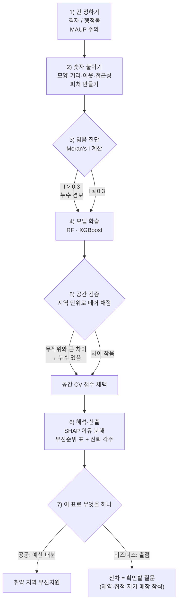
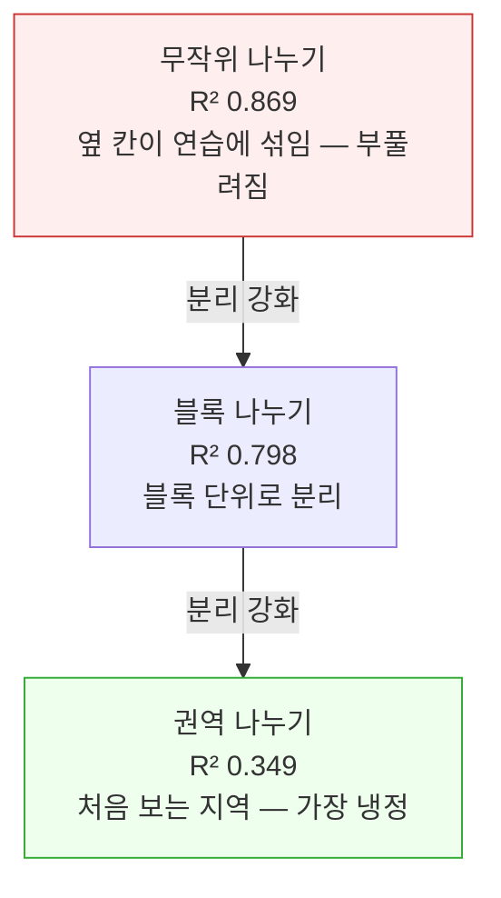

# 4장 어느 지역부터 도와야 할까, 그리고 그 예측을 믿어도 될까 (학부 강의용)

> 이 장에 나오는 예측 성능, Moran's I 값, 군집 점수 같은 숫자는 모두 `practice/chapter4/`의 코드를 실제로 실행해 얻은 값이다. 예시를 위해 지어낸 숫자는 없다.

## 1. 오늘의 큰 질문

- 어느 지역이 취약한지 AI가 지도로 알려 준다는데, 그 지도를 믿어도 될까?
- 검증에서 95점을 받은 모델이 실제 현장에서는 형편없을 수 있다. 어떻게 그런 일이 생길까?
- 같은 도구로 "어디에 가게를 낼까"도 물을 수 있다. 그때 나온 순위표를 그대로 믿고 창업해도 될까?

앞의 장들에서 우리는 공간 데이터가 무엇이고 어디서 구하는지를 배웠다. 이번 장에서는 드디어 그 데이터로 **예측**을 한다. "이 격자의 정책 취약성은 몇 점일까", "어느 동네부터 지원해야 할까" 같은 질문에 머신러닝으로 답을 만들어 본다.

그런데 이 장의 진짜 주인공은 모델이 아니다. 이 장이 끝까지 다루는 질문은 하나다. **그 예측이 맞는지 어떻게 확인하는가.** 공간 데이터에는 "가까운 곳은 서로 닮는다"는 아주 당연해 보이는 성질이 있는데, 이 성질이 성능 평가를 통째로 무너뜨릴 수 있다. 실제로 이 장의 실습에서는 같은 모델의 점수가 검증 방법에 따라 0.869에서 0.349까지 떨어진다. 절반 이하다. 어느 쪽이 진짜 실력일까? 이 장을 읽고 나면 답할 수 있다.

이 질문이 중요한 이유는 단순하다. 취약 지역 예측 지도는 결국 **예산이 어디로 갈지**를 정하는 근거가 된다. 부풀려진 점수를 믿고 만든 우선순위는 잘못된 예산 배분으로 이어진다.

## 2. 직관적 비유

이 장의 개념들은 비유 네 개로 먼저 잡아 두면 훨씬 쉬워진다.

- **데이터 누수 = 연습 문제집에 시험 문제의 "옆 번호 문제"가 섞여 있던 것.** 어떤 학생이 모의고사에서 95점을 받았다. 그런데 알고 보니 그 학생이 풀던 연습 문제집에 실제 시험 문제와 거의 똑같은 문제들이 들어 있었다. 학생이 부정행위를 한 게 아니다. 문제를 나눠 준 사람이 잘못 나눈 것이다. 이 장에서 배우는 데이터 누수가 정확히 이 구조다. 단, 비유가 왜곡하지 않게 한 줄을 붙이자면 — 잘못은 모델(학생)에게 있는 것이 아니라 **검증을 설계한 사람**에게 있다.
- **MAUP = 반 편성에 따라 달라지는 반 평균.** 같은 학생 100명을 어떻게 반으로 나누느냐에 따라 "1반 평균이 제일 높다" 같은 결론이 달라진다. 지도도 같다. 같은 지역을 어떤 칸으로 자르느냐에 따라 "여기가 취약하다"는 결론이 달라질 수 있다.
- **군집 = 라벨 없이 옷장 정리하기.** 옷에 "상의·하의" 같은 정답 라벨이 붙어 있지 않아도, 비슷한 것끼리 묶다 보면 몇 개의 무더기가 생긴다. 어떻게 묶는 것이 "정답"인지는 없다. 정리하는 사람의 기준에 달려 있다.
- **SHAP = 성적표의 과목별 기여 분해.** 총점이 왜 이렇게 나왔는지를 "수학에서 +20점, 영어에서 −5점" 식으로 쪼개 보여 주는 것이다. 다만 이것은 "점수가 왜 이렇게 계산되었나"의 설명이지, "수학 공부를 시키면 총점이 오른다"는 보장이 아니다.

## 3. 핵심 개념 5가지

1. **분석 단위**: 예측은 결국 표 하나에서 시작한다. 그 표의 한 줄을 격자 한 칸으로 할지, 행정동 하나로 할지 정하는 것이 첫 결정이다. 그리고 칸을 바꾸면 결론이 바뀔 수 있다(MAUP).
2. **공간 피처**: 칸 하나에 붙이는 숫자들이다. 모양, 시설까지의 거리, 이웃의 평균값, 접근성 같은 "관계"의 숫자가 특히 힘이 세다.
3. **공간 자기상관**: 가까운 곳은 닮는다. 이 닮음의 정도를 하나의 숫자로 잰 것이 **Moran's I**다. 0이면 무작위, +1에 가까우면 강하게 닮은 것이다.
4. **데이터 누수와 공간 교차검증**: 닮은 이웃이 연습(학습)과 시험(검증)에 나눠 들어가면 점수가 부풀려진다. 그래서 표본 단위가 아니라 **지역 단위로 떼어서** 검증해야 한다.
5. **군집과 SHAP**: 예측 다음에 오는 두 질문이다. "비슷한 동네끼리 묶으면 어떤 유형이 나올까"(군집), "왜 이 동네가 1순위로 예측됐을까"(SHAP).

## 실습 안내

- 실습 README(실행 방법 및 기대값): [practice/chapter4/README.md](practice/chapter4/README.md)
- 실습 코드: practice/chapter4/code/ 아래 `4-0-*`(데이터 준비) → `4-1` ~ `4-6` 순서로 실행
- `4-6`은 서울시 공개 데이터를 쓴다. 원자료 내려받기 절차는 실습 README 참조
- 결과 로그: practice/chapter4/results/*.log

## 4. 실측 숫자로 먼저 보기

이 장의 실습 여섯 개가 만든 핵심 숫자를 먼저 한눈에 보자. 지금은 외울 필요 없다. 아래 절들에서 하나씩 다시 읽는다.

- 건물 200개의 공간 피처: 조밀도 `0.423~0.785`, 지하철역까지 거리 `96~3,415m` — 같은 "건물"이라도 모양과 입지가 크게 다르다.
- 포인트 500개의 닮음 정도: Moran's I `0.866` — 매우 강하게 닮아 있다.
- 같은 모델, 다른 검증: 무작위 나누기 R² `0.869` → 블록 단위 나누기 `0.798` → 권역 단위 나누기 `0.349`. 12번 반복해도 권역 낙폭은 `0.517` 아래로 안 내려간다.
- 토지피복 분류(모델 3종): 무작위 검증 `0.763~0.772` → 공간 검증 `0.753~0.760`. 셋 다 조금씩만 떨어진다.
- 군집: 정답 라벨 없이 묶었더니 실제 토지피복과 일치도(ARI) `0.329`에 그쳤다.
- 취약성 예측: 검증 방법에 따라 `0.639 → 0.535 → 0.373`. 시드를 바꿔 24번 돌려도 낙폭이 `0.165` 아래로는 안 내려간다. 그리고 예측 이유 1위는 고령인구율.
- 서울 카페 입지(진짜 데이터, 행정동 415개): 이웃 정보를 넣어도 `0.656 → 0.660`으로 거의 안 오르고, 부풀려짐도 `+0.025`에 그쳤다. 게다가 시드를 바꾸면 두 차이 모두 부호가 뒤집혀 **있는지 없는지조차 잡히지 않았다.** 앞의 취약성 예측과 정반대다.

이 숫자들이 공통으로 말하는 것은 하나다. **"어떤 모델을 쓰느냐"보다 "어떻게 확인하느냐"가 훨씬 크게 결과를 좌우한다.**

## 5. 무엇을 한 칸으로 볼까: 분석 단위와 MAUP

### 5.1 예측은 표에서 시작한다

머신러닝이라고 하면 복잡한 것을 떠올리기 쉽지만, 입력은 결국 엑셀 같은 표다. 한 줄(행)이 하나의 "대상"이고, 열이 그 대상의 특징들이다. 공간 예측의 첫 결정은 바로 이것이다. **표의 한 줄을 무엇으로 할 것인가.**

- **포인트**: 화재 신고 한 건, 병원 한 곳처럼 사건·시설의 위치 그 자체.
- **격자**: 지역을 같은 크기의 정사각형(예: 500m×500m)으로 자른 칸. 모든 칸의 면적이 같아 비교가 공정하다.
- **행정구역**: 읍·면·동, 시·군·구. 통계가 발표되고 예산이 집행되는 단위.
- **필지·건물**: 건물 한 채, 땅 한 필지. 안전 점검처럼 하나하나 판정해야 할 때.
- **생활권(네트워크 권역)**: "도보 15분 안에 닿는 범위"처럼 이동시간으로 정의되는 단위.

어느 것이 맞고 틀린 것이 아니라, 질문에 따라 맞는 단위가 다르다. "어느 칸이 취약한가"를 공정하게 비교하려면 격자가 좋고, "어느 동에 예산을 줄까"를 논의하려면 행정동이어야 한다.

### 5.2 칸을 바꾸면 결론이 바뀐다: MAUP

여기서 이 장의 첫 함정이 나온다. **MAUP**(수정가능면적단위문제)라고 부르는 현상인데, 이름은 어렵지만 내용은 반 평균 비유 그대로다.

구체적인 상황을 그려 보자. 어느 지역에 고령자가 밀집한 작은 마을이 있다. 500m 격자로 지도를 자르면 그 마을이 진한 "취약 칸"으로 또렷하게 드러난다. 그런데 1km 격자로 자르면? 그 마을이 옆의 젊은 아파트 단지와 한 칸에 묶이면서 평균이 내려가고, 취약 지점이 지도에서 **사라진다**. 데이터는 하나도 바뀌지 않았는데 결론이 바뀌었다.

```
500m 격자로 자른 경우          1km 격자로 자른 경우
┌──────┬──────┬──────┐        ┌─────────────┬─────────────┐
│ 고령 │ 고령 │ 청년 │        │             │             │
│ 38%  │ 35%  │ 12%  │        │  평균 25%   │  평균 14%   │
│ 취약!│ 취약!│      │        │   "보통"    │             │
├──────┼──────┼──────┤   →    │             │             │
│ 청년 │ 청년 │ 청년 │        ├─────────────┼─────────────┤
│ 15%  │ 10%  │ 14%  │        │  평균 13%   │  평균 11%   │
│      │      │      │        │             │             │
└──────┴──────┴──────┘        └─────────────┴─────────────┘
 ← 취약 마을이 보인다 →        ← 취약 마을이 사라졌다 →
```

왼쪽에서는 고령인구율 38%, 35%인 칸이 "취약"으로 또렷하게 드러난다. 오른쪽에서는 같은 사람들이 옆의 청년 인구와 한 칸에 합쳐져 평균 25%가 되면서 "보통"으로 읽힌다. 데이터는 똑같은데 칸의 크기가 달라졌을 뿐이다.

행정 경계도 마찬가지다. 같은 마을이 경계선을 어디에 긋느냐에 따라 "취약한 동"에 속하기도 하고 "평범한 동"에 속하기도 한다. 선거구를 어떻게 긋느냐에 따라 같은 유권자 분포에서 다른 선거 결과가 나오는 것과 같은 구조다.

MAUP는 없앨 수 있는 오류가 아니라 지도를 칸으로 자르는 한 항상 따라오는 성질이다. 그래서 실무의 대응은 두 가지다.

1. 분석은 현상이 잘 보이는 단위(예: 격자)에서 하고, 발표와 집행은 행정 단위로 **다시 모은다**.
2. 결과를 보고할 때 "이 결론은 500m 격자 기준"이라고 **칸의 크기를 명시한다**.

## 6. 칸에 어떤 숫자를 붙일까: 공간 피처와 접근성

### 6.1 힘이 센 숫자는 "관계"에서 나온다

칸 하나를 예측하려면 그 칸을 설명하는 숫자들(피처)이 필요하다. 공간 데이터에서 재미있는 점은, 그 칸 자체의 값보다 **주변과의 관계**가 더 힘이 센 경우가 많다는 것이다. 같은 크기의 건물도 도심 한복판에 있느냐 외곽에 홀로 있느냐에 따라 전혀 다른 의미를 가지기 때문이다.

실습 `practice/chapter4/code/4-1-spatial-features.py`는 건물 200개에서 네 종류의 숫자를 뽑았다.

- **모양(형태)**: 면적, 둘레, 그리고 "얼마나 뭉툭한가"를 재는 조밀도. 조밀도는 원이면 1, 정사각형이면 약 0.785가 되도록 만든 값이다. 실행 결과 건물들의 조밀도는 `0.423~0.785`였다 — 정사각형에 가까운 건물부터 꽤 길쭉한 건물까지 섞여 있다는 뜻이다.
- **거리**: 가장 가까운 지하철역까지의 거리. 실행 결과 `96m~3,415m`. 역 바로 앞 건물과 걸어서는 못 가는 건물이 같은 데이터 안에 있다.
- **이웃**: 50m 안에 이웃 건물이 몇 채 있는가. 실행 결과 `0~2채(평균 0.1채)`로 이 실습의 건물들은 대체로 흩어져 있었다. 실제 도심 데이터라면 이 숫자가 밀집 시가지와 한적한 지역을 가르는 강한 신호가 된다.
- **영상에서 옮겨 온 값**: 위성영상에서 계산한 녹지 지수 같은 값을 칸 단위 평균으로 집계해 붙일 수도 있다. 영상의 정보가 표의 한 칸으로 들어오는 통로다.

이런 숫자들을 격자 칸마다 모으면, 실제 머신러닝에 넣는 입력 표가 만들어진다. 다음은 이 장 마지막 실습(4-5)에서 쓰는 20×20 격자 데이터의 첫 네 칸이다(practice/chapter4/code/4-0-simdata-prep.py로 생성한 교육용 데이터).

| 격자 | 고령인구율 | 1인가구율 | 기초수급율 | 병원거리(m) | 대중교통거리(m) | 평균 NDVI | 취약성 |
|---:|---:|---:|---:|---:|---:|---:|---:|
| 0 | 0.25 | 0.30 | 0.07 | 1,251 | 611 | 0.271 | 35.7 |
| 1 | 0.24 | 0.27 | 0.07 | 1,313 | 438 | 0.432 | 44.6 |
| 2 | 0.28 | 0.36 | 0.10 | 1,508 | 700 | 0.344 | 60.9 |
| 3 | 0.22 | 0.35 | 0.08 | 710 | 597 | 0.291 | 53.2 |

한 줄이 격자 한 칸이다. 왼쪽 열들(고령인구율~기초수급율)은 그 칸에 사는 주민의 사회경제 특성이고, 가운데 열들(병원거리·대중교통거리)은 시설까지 얼마나 먼지, 오른쪽(평균 NDVI)은 위성영상에서 칸 안의 녹지를 집계한 값이다. 마지막 "취약성"이 우리가 예측하고 싶은 값(타깃)이다. 격자 0번은 병원이 1.2km 떨어져 있고 취약성이 35.7으로 낮은 편이지만, 격자 2번은 병원이 1.5km이고 고령인구율·기초수급율도 높아 취약성이 60.9로 높다. 이 표 구조가 이 장 전체의 예측과 해석, 그리고 뒤의 정책 장(8~13장)에서 반복되는 출발점이다.

### 6.2 접근성: "얼마나 가기 쉬운가"를 숫자로

거리 피처를 한 단계 발전시키면 **접근성**이 된다. 접근성은 "이 동네에서 병원·학교·버스에 얼마나 쉽게 닿는가"를 재는 것인데, 재는 방식이 하나가 아니다.

- **가장 가까운 곳까지 몇 분?** — 제일 단순하다. "가장 가까운 응급실까지 25분."
- **15분 안에 몇 곳?** — 선택지의 풍부함을 잰다. "도보 15분 안에 의원 3곳." 흔히 듣는 "10분 생활권" 정책이 바로 이 언어다. 단, 기준을 15분으로 하느냐 20분으로 하느냐에 따라 답이 꽤 달라진다.
- **가까울수록 크게 쳐서 합산** — 모든 시설을 고려하되 먼 곳은 작게 반영한다.
- **붐빔까지 반영** — 가까운 병원이 있어도 그 병원이 수십만 명을 감당해야 한다면 실제 접근성은 낮다. 의료 접근성 분석은 보통 이 방식까지 간다.

한 가지 중요한 실무 감각: 거리는 지도 위의 직선거리가 아니라 **도로를 따라 실제로 이동하는 시간**으로 재야 한다. 직선으로는 가까워 보여도 강을 건너는 다리가 멀리 있으면 실제로는 먼 동네다.

접근성은 이 장의 예측 모델에 들어가는 재료이기도 하고, 그 자체로 "서비스 사각지대가 어디인가"를 보여 주는 결과물이기도 하다. 계산에 학습이 필요 없다는 점도 기억해 두자 — 데이터와 규칙만으로 계산이 끝나는, 말하자면 예측 이전의 기본 분석이다.

## 7. 가까운 것은 닮는다: 공간 자기상관 읽기

### 7.1 당연한 사실을 숫자로 만들기

부동산 이야기를 떠올려 보자. 어떤 동네의 집값이 비싸면 바로 옆 동네도 대체로 비싸다. 소득, 고령화율, 녹지, 기온 — 공간 위의 값들은 대부분 이렇게 **가까울수록 닮아 있다**. 지리학에서는 이를 "모든 것은 서로 관련되어 있지만, 가까운 것이 먼 것보다 더 관련된다"는 문장으로 요약해 왔다.

이 닮음의 정도를 하나의 숫자로 잰 것이 **Moran's I**(모란 지수)다. 읽는 법은 간단하다.

```
  I ≈ +1 (강한 닮음)       I ≈ 0 (무작위)         I < 0 (교차)
  ┌──┬──┬──┬──┐          ┌──┬──┬──┬──┐          ┌──┬──┬──┬──┐
  │■ │■ │□ │□ │          │■ │□ │■ │□ │          │■ │□ │■ │□ │
  ├──┼──┼──┼──┤          ├──┼──┼──┼──┤          ├──┼──┼──┼──┤
  │■ │■ │□ │□ │          │□ │■ │□ │■ │          │□ │■ │□ │■ │
  ├──┼──┼──┼──┤          ├──┼──┼──┼──┤          ├──┼──┼──┼──┤
  │□ │□ │□ │□ │          │■ │□ │□ │■ │          │■ │□ │■ │□ │
  ├──┼──┼──┼──┤          ├──┼──┼──┼──┤          ├──┼──┼──┼──┤
  │□ │□ │□ │□ │          │□ │■ │■ │□ │          │□ │■ │□ │■ │
  └──┴──┴──┴──┘          └──┴──┴──┴──┘          └──┴──┴──┴──┘
  높은 값(■)끼리 뭉침      높낮이가 뒤섞임         체스판처럼 교차
  → 대부분의 공간 데이터    → 드물다                → 매우 드물다
```

- **+1에 가까움**: 가까운 곳끼리 강하게 닮음 (높은 값 옆에 높은 값). 집값, 기온, 고령화율 같은 대부분의 공간 데이터가 여기에 해당한다.
- **0 근처**: 위치와 값이 무관 (무작위)
- **음수**: 체스판처럼 높낮이가 교차. 현실에서는 거의 없다.

실습 `practice/chapter4/code/4-2-spatial-cv.py`는 포인트 500개짜리 데이터에서 Moran's I를 계산했다. 결과는 `0.866`. 거의 +1에 가까운, 매우 강한 닮음이다. "이 값이 우연일 확률"을 따지는 검정에서도 p값 `0.001`로, 우연이라고 보기 어렵다는 판정이 나왔다.

덧붙여 같은 실행에서 "어디가 높은 값끼리 뭉친 곳인가"까지 짚어 주는 국지 분석도 돌렸는데, 500개 포인트 중 `162개`가 높은-값-옆-높은-값 뭉치(핫스팟), `128개`가 낮은-값-옆-낮은-값 뭉치(콜드스팟)로 판별되었다. 전체의 절반 이상이 어떤 "뭉치" 안에 있는 데이터라는 뜻이다.

### 7.2 닮음은 좋은 소식이자 나쁜 소식

닮음이 강하다는 것은 예측에는 좋은 소식이다. 옆 칸의 값을 알면 이 칸의 값을 꽤 잘 맞힐 수 있으니까. 그런데 바로 그 이유 때문에, **성능 평가에는 나쁜 소식**이 된다. 다음 절이 이 장의 핵심이다.

## 8. 시험이 이상하게 쉬웠던 이유: 데이터 누수와 공간 교차검증

### 8.1 모델의 실력은 어떻게 재는가

머신러닝에서 모델의 실력을 재는 표준 방법은 이렇다. 데이터를 **연습용(학습)**과 **시험용(검증)**으로 나누고, 연습용만 보여 주고 학습시킨 뒤 시험용으로 점수를 매긴다. 이를 여러 번 반복하는 것을 교차검증이라고 한다.

문제는 **어떻게 나누느냐**다. 보통은 무작위로 나눈다. 일반적인 데이터라면 그걸로 충분하다. 그런데 공간 데이터에서는 무작위로 나누는 순간 함정이 작동한다.

### 8.2 함정의 구조

방금 확인했듯 이 데이터는 Moran's I `0.866`, 즉 옆 포인트끼리 값이 거의 같다. 무작위로 나누면 어떤 일이 생길까? 시험용으로 빠진 포인트의 **바로 옆 포인트가 연습용에 남는다**. 모델은 문제를 이해하지 못해도 "아, 이 위치 근처는 대체로 값이 30쯤이었지"라고 되뇌는 것만으로 시험을 잘 본다.

```
  무작위로 나눈 경우 (누수 발생)         지역 단위로 떼어 낸 경우 (누수 차단)

  ○ = 연습용    ● = 시험용               ○ = 연습용    ● = 시험용

  ○ ○ ● ○ ○ ○                          ○ ○ ○ ○ ○ ○
  ○ ● ○ ○ ● ○                          ○ ○ ○ ○ ○ ○
  ● ○ ○ ● ○ ○                          ○ ○ ┊● ● ●┊
  ○ ○ ● ○ ○ ●                          ○ ○ ┊● ● ●┊
  ○ ● ○ ○ ○ ○                          ○ ○ ┊● ● ●┊
  ○ ○ ○ ● ○ ○                          ○ ○ ○ ○ ○ ○

  시험용 ●의 바로 옆에                   시험 지역(점선 안)이 통째로 빠져서
  연습용 ○가 남아 있다                   근처에 "닮은 이웃"이 없다
  → "이 근처는 30쯤이었지" 찍기 가능      → 찍을 근거가 사라진다
  → 점수가 부풀려진다 (R² 0.869)         → 진짜 실력이 드러난다 (R² 0.349)
```

연습 문제집에 시험 문제의 옆 번호 문제가 섞여 있던 학생과 같다. 점수는 95점인데, 그 점수는 실력의 증거가 아니다. 이것이 **데이터 누수**다. 그리고 다시 강조하지만, 모델이 반칙을 한 것이 아니라 **나누는 방법이 잘못된 것**이다.

### 8.3 해결: 표본이 아니라 "지역"을 떼어 낸다

해법의 아이디어는 위 오른쪽 그림 그대로다. 포인트 하나하나를 무작위로 빼는 대신, **한 지역을 통째로** 시험용으로 떼어 낸다. 그러면 시험 지역 근처의 "닮은 이웃"이 연습용에 남지 않는다. 떼어 내는 방식에 따라 이름이 붙는다.

- **블록 방식**: 지도를 큰 격자 블록으로 잘라, 블록 단위로 연습/시험을 나눈다.
- **권역(군집) 방식**: 지리적으로 뭉친 권역을 만들어, "이 권역 전체를 한 번도 본 적 없는 상태에서 맞혀 보라"고 시킨다. 가장 엄격하다.

실습의 실제 결과를 보자. 같은 모델, 같은 데이터에서 나누는 방법만 바꿨다.

| 나누는 방법 | 평균 R² | 읽는 법 |
|------------|:------:|---------|
| 무작위 | 0.869 | 옆 포인트가 연습에 남음 — 부풀려진 점수 |
| 블록(5km 격자 36개) | 0.798 | 블록 단위로 분리 — 다소 현실적 |
| 권역(군집 5개) | 0.349 | 처음 보는 권역 — 가장 냉정한 점수 |

R²는 "1이면 완벽, 0이면 그냥 평균값을 찍는 수준"이라고 읽으면 된다. 무작위로 나누면 0.869라는 훌륭한 점수가 나오지만, 처음 보는 권역으로 시험을 바꾸는 순간 0.349로 떨어진다. 심지어 권역 방식의 다섯 번 시험 중 한 번은 `-0.179`, 즉 **평균값을 찍느니만 못한** 점수도 나왔다. 어떤 권역은 그만큼 어렵다는 뜻이다.

그렇다면 이 모델의 "진짜 실력"은 무엇인가? 목적에 따라 답이 다르다. 이미 데이터가 있는 지역 안에서 빈칸을 메우는 용도라면 블록 방식의 점수가, 데이터가 전혀 없는 새 지역까지 일반화해야 한다면 권역 방식의 점수가 진짜에 가깝다. 확실한 것은 하나 — **무작위 방식의 0.869를 그대로 보고서에 쓰면 안 된다.**

#### 이 차이도 검사를 받아야 한다

이 책은 성능 차이를 말할 때마다 같은 절차를 밟는다. **먼저 모델 시드·자료 분할 시드·자료 생성 시드를 바꾸어 같은 실험을 반복하고, 성능 차이의 최솟값·최댓값과 표준편차를 계산한다.** 블록 방식의 다섯 번 시험 점수 표준편차는 `0.143`이었다. 비교하려는 차이(`0.869 − 0.798 = 0.071`)가 이 표준편차의 절반밖에 안 되므로, 두 방법의 우열을 단정하기 어렵다.

그래서 모델 시드·나누기 시드·자료 만들기 시드를 각각 바꿔 12번 다시 돌렸다. 결과는 이렇다.

- **무작위와 블록의 차이는 `+0.031 ~ +0.123`.** 12번 다 양수라 "무작위 쪽이 높다"는 **방향은 믿어도 된다.** 하지만 네 배 폭으로 흩어져서 **크기를 `0.071`이라고 못 박을 수는 없다.**
- **무작위와 권역의 낙폭은 `0.517 ~ 1.747`.** 제일 얌전한 실행조차 `0.517`이 무너졌다. 여기서는 **방향도 크기도 말할 수 있다** — 다만 "0.520이다"가 아니라 "적어도 0.517은 무너진다"로.
- 둘을 가장 크게 흔든 건 **포인트를 다시 뽑는 축**이었다. 자료를 새로 뽑자 권역 점수가 `−0.872`까지 내려간 실행도 나왔다.

**여기서 놓치면 안 되는 게 있다. 같은 표에서 나온 두 비교인데 판정이 갈렸다.** 블록까지만 떼어 냈을 때는 크기를 말할 수 없고, 권역을 통째로 떼어 냈을 때는 말할 수 있다. 그러니 "이 실습의 부풀려짐은 얼마냐"는 질문에는 답이 하나가 아니다. **무엇과 무엇을 비교한 값인지 밝히지 않은 부풀려짐은 반쪽짜리 보고다.**

### 8.4 코드를 단계별로 읽어 보기

이 비교를 만든 코드의 뼈대를 네 단계로 읽어 보자. 문법을 외울 필요는 없다. 각 단계가 "무엇을 하는 행동인가"만 잡으면 된다. 전체 코드는 `practice/chapter4/code/4-2-spatial-cv.py`에 있다.

```python
from libpysal.weights import KNN
from esda.moran import Moran

# 1) 누가 누구의 '이웃'인지 정한다 (가장 가까운 8개)
w = KNN.from_dataframe(gdf, k=8)
mi = Moran(gdf["target"].values, w, permutations=999)
```

첫 단계는 닮음의 측정이다. "이웃"을 정의하고(여기서는 가장 가까운 8개), Moran's I를 계산한다. 여기서 `0.866`이 나왔기 때문에 "무작위로 나누면 위험하다"는 경보가 켜진 것이다.

```python
from sklearn.model_selection import KFold, cross_val_score

# 2) 위험한 방법: 무작위로 5등분해서 검증
random_cv = KFold(n_splits=5, shuffle=True)
random_scores = cross_val_score(model, X, y, cv=random_cv, scoring="r2")
```

두 번째 단계가 보통의 무작위 교차검증이다. `shuffle=True`가 "카드를 섞어서 무작위로 나눈다"는 뜻이다. 여기서 0.869가 나왔다.

```python
# 3) 각 포인트에 '어느 블록 소속인지' 이름표를 붙인다 (5km 격자)
gdf["block_id"] = ((gdf.geometry.x // 5000).astype(int) * 10000
                   + (gdf.geometry.y // 5000).astype(int))
```

세 번째 단계가 공간 교차검증의 핵심 아이디어다. 좌표를 5,000m로 나눈 몫을 이용해, 같은 5km 칸에 있는 포인트들에게 같은 소속 번호를 붙인다. 복잡해 보이지만 하는 일은 "너는 3반, 너는 7반" 하고 반 이름표를 붙이는 것뿐이다.

```python
from sklearn.model_selection import GroupKFold

# 4) 같은 블록은 반드시 같은 편으로 — 블록 단위 검증
block_cv = GroupKFold(n_splits=5)
block_scores = cross_val_score(model, X, y, cv=block_cv,
                               groups=gdf["block_id"], scoring="r2")
```

마지막 단계에서 `GroupKFold`가 그 이름표를 존중하며 나눈다. **같은 블록의 포인트는 절대로 연습과 시험에 갈라져 들어가지 않는다.** 이 한 가지 규칙이 무작위 나누기와의 유일한 차이이고, 점수를 0.869에서 0.798로 끌어내린 원인이다. 권역 방식은 블록 이름표 대신 좌표를 뭉쳐 만든 권역 이름표를 넘기면 된다.

### 8.5 모델을 바꾸면 해결될까? — 안 된다

"더 좋은 모델을 쓰면 되지 않을까?"라는 생각이 들 수 있다. 실습 `practice/chapter4/code/4-3-ensemble-comparison.py`가 그 답을 준다. 실제로 내려받은 Sentinel-2 장면(춘천, 2021년 4월 7일)의 픽셀 7,500개로 토지피복 다섯 가지(산림·초지·경작지·시가지·수역)를 분류하는 문제에, 요즘 널리 쓰이는 모델 세 가지를 모두 투입했다. 랜덤 포레스트는 "결정 나무 수백 그루의 다수결", XGBoost와 LightGBM은 "앞사람의 실수를 뒷사람이 순서대로 보완하는 릴레이"라고만 잡아 두면 지금은 충분하다.

| 모델 | 무작위 검증 | 공간(블록) 검증 | 부풀려진 정도 |
|------|:---:|:---:|:---:|
| 랜덤 포레스트 | 0.763 | 0.753 | +0.010 |
| XGBoost | 0.772 | 0.760 | +0.012 |
| LightGBM | 0.768 | 0.755 | +0.013 |

주목할 것은 두 가지다.

- 모델끼리의 차이는 0.009 이내로 미미하다. **어느 모델을 고르느냐는 생각만큼 중요하지 않다.**
- 부풀려짐이 `+0.010~0.013`으로 작다. 앞의 포인트 실습에서 `+0.071`이나 벌어졌던 것과 대조적이다(반복 범위로 견줘도 `+0.005~+0.022` 대 `+0.031~+0.123`으로 겹치지 않는다).

그런데 이 표에도 앞에서 배운 검사를 걸어야 한다. **`+0.010`이라는 차이가 반복 실행에서도 유지되는지 확인해야 한다.** 같은 실습에서 산출한 조별 점수의 표준편차는 블록 검증에서 `0.015~0.021`이었다. 이 값이 비교하려는 차이 `0.010`보다 크므로, `+0.010`을 일반적인 성능 차이라고 해석할 근거가 부족하다.

어떤 조건을 바꿀지부터 정한다. 부풀려짐은 "블록을 통째로 빼면 점수가 얼마나 떨어지나"이므로, 이 값을 정하는 건 **196개 블록을 다섯 조로 어떻게 묶느냐**다. 그래서 세 가지 조건을 나눠 36번 돌렸다 — ① 모델 시드만 ② 모델 시드 + 블록→조 배정 ③ 픽셀을 아예 다시 뽑기.

결과가 뒤에 나올 카페 실습(10.5절)과 갈린다.

- **36번 전부 양수였다.** 어떤 시드와 블록 배정을 사용해도 무작위 검증이 블록 검증보다 높다는 부등호는 한 번도 안 뒤집혔다. **방향은 재현된다.**
- 하지만 크기는 `+0.005 ~ +0.022`로 네 배 폭이다. **크기는 재현되지 않는다.**

그래서 이 표에서 읽어도 되는 건 "무작위 검증이 더 높다"까지다. "부풀려짐이 0.012다"라고 못 박거나, **"LightGBM이 제일 많이 부풀려진다"**고 읽으면 안 된다. 실제로 모델 순위는 반복마다 바뀌었다 — 모델 시드만 바꾼 경우에는 LightGBM이 늘 1위였지만, 블록을 다시 배정한 경우에는 XGBoost가 1위인 실행도 나왔다. **표를 가로로 읽는 건 되고, 세로로 읽는 건 안 된다.**

이상하지 않은가? 차이가 표준편차보다 작은데 어떻게 36번 내리 같은 부호가 나올까. **같은 자료를 같은 모델로 놓고 나누는 방식만 바꾼 짝지은 비교**이기 때문이다. 각 조의 자료가 두 검증 방식에 함께 들어가므로, 조마다 생긴 오차가 두 방식에서 일부 상쇄된다. 다만 이 상쇄가 늘 통하는 건 아니다. 10.5절 카페 실습에서는 조 배정을 바꾸자 성능 차이의 표준편차가 세 배로 커지면서 부호까지 뒤집혔다.

다시 원래 이야기로. **누수가 얼마나 심한지는 문제마다 다르다.** 여기서는 입력값(분광 반사값)이 정답(토지피복)을 꽤 직접적으로 가리킨다. 물은 어디서 찍어도 물처럼 보이므로, 모델이 이웃을 몰래 참고할 필요가 별로 없다. 반대로 뒤에 나올 취약성 예측(10절)에서는 검증 방법만 바꿔도 `0.639 → 0.535 → 0.373`으로 크게 무너지고, 24번을 반복해도 낙폭이 `0.165` 아래로 내려가지 않는다. 취약성은 눈에 보이는 값이 아니라 주변 여건에 얹혀 있는 값이기 때문이다.

그래서 결론은 "부풀려짐이 항상 크다"가 아니라 이것이다. **부풀려짐의 크기는 반복 측정 전에는 알 수 없다.** 무작위 검증만 돌려 보고 "이 정도면 안전하겠지"라고 넘길 수 없는 이유다.

참고로 "어떤 입력값이 분류에 가장 많이 쓰였나"를 보면 물 지수(NDWI)가 1위(중요도 0.109)였다. 다섯 클래스 중 수역이 가장 뚜렷하게 갈리는 유형이라는 뜻이다. 반대로 경작지는 F1 `0.633`으로 낮았는데, 4월 초 장면이라 경작지 상당수가 아직 흙바닥 상태여서 정답 라벨과 실제 색이 어긋났기 때문이다. **모델이 틀린 것이 아니라 계절이 어긋난 것이다.**

## 9. 비슷한 동네끼리 묶기: 군집

### 9.1 정답 없이 묶는다는 것

지금까지는 "취약성 점수"라는 맞혀야 할 정답이 있었다. 그런데 정책 분석에서는 정답 없이 이런 질문을 할 때도 많다. "우리 지역의 동네들을 성격이 비슷한 몇 가지 유형으로 나눠 볼 수 없을까?" 고령화가 심한 유형, 서비스 접근이 나쁜 유형, 둘 다인 유형 — 유형마다 다른 정책 패키지를 설계하기 위해서다.

이것이 **군집**(클러스터링)이고, 대표 방법이 **KMeans**다. 옷장 정리 비유 그대로, 비슷한 것끼리 k개의 무더기로 묶는다. 여기서 두 가지 상식이 중요하다.

- **몇 무더기로 묶을지(k)는 사람이 정한다.** 도구가 도와줄 뿐이다. 대표 도구가 **실루엣 점수**로, "각 항목이 자기 무더기와는 가깝고 다른 무더기와는 먼가"를 -1~+1로 잰다. 높을수록 잘 나뉜 것이다.
- **묶기 전에 단위를 맞춰야 한다(표준화).** 거리(수천 미터)와 비율(0~1)을 그대로 섞으면, 숫자가 큰 거리 변수 혼자 묶음을 다 정해 버린다.

### 9.2 실측: 정답을 숨겨 놓고 묶어 보기

실습 `practice/chapter4/code/4-4-spatial-clustering.py`는 재미있는 실험을 했다. 실제 Sentinel-2 픽셀 4,000개(클래스별 800개씩)를 KMeans로 묶었는데, 사실 이 데이터에는 진짜 정답이 **숨겨져** 있었다. ESA WorldCover가 매긴 토지피복 라벨이다. 군집이 정답을 모르는 채 어디까지 가는지 보는 실험이다.

- k를 2부터 7까지 바꿔 가며 실루엣 점수를 재 보니 `k=2`에서 `0.587`로 가장 높았다. 이 데이터에서 가장 뚜렷한 갈라짐은 "물이냐 뭍이냐" 정도의 큰 두 덩어리라는 뜻이다.
- 실제 클래스 수에 맞춰 `k=5`로 묶은 뒤 숨겨 둔 정답과 대조하니, 일치도(ARI)가 `0.329`였다. 1.0이 완전 일치, 0이 우연 수준이므로 **절반에도 못 미치는 성적**이다.

왜 이렇게 낮게 나왔을까. 분할표를 뜯어보면 답이 보인다. 수역은 800개 중 `779개`가 한 군집에 깔끔히 모였고, NDVI가 `0.612`로 높은 군집은 산림을 잘 잡아냈다. 반면 초지·경작지·시가지는 하나의 큰 군집에 뒤엉켰다. 4월 초라 경작지는 아직 흙바닥이고 초지의 풀도 덜 자라, 세 유형의 색이 서로 겹쳤기 때문이다.

여기서 얻을 교훈은 "군집이 정답을 재발견한다"가 아니라 그 반대다. **군집은 데이터에 실제로 존재하는 구조만 드러낸다.** 우리가 원하는 라벨 체계를 복원해 주지는 않는다. 이 점은 지역 유형화로 넘어가면 더 중요해진다. "고령화 유형", "쇠퇴 유형" 같은 분류에는 대조해 볼 정답조차 없다. 그때의 군집 결과는 발견이라기보다 **분석가의 선택(어떤 지표를 넣었나, k를 몇으로 했나)이 만든 하나의 정리 방식**이다. 그래서 지역 유형화 결과를 볼 때는 항상 "어떤 지표로, 몇 개 유형으로 묶었는가"를 함께 물어야 한다.

## 10. 왜 이 동네가 1순위일까: 취약성 예측과 SHAP

### 10.1 이 장의 종합 실습

마지막 실습 `practice/chapter4/code/4-5-grid-vulnerability-shap.py`는 이 장 전체를 하나의 정책 시나리오로 묶는다. 가상의 지역을 400개 격자(20×20)로 자르고, 각 격자에 고령인구율, 1인가구율, 기초생활수급율, 병원까지 거리, 대중교통까지 거리, 녹지 지수 등을 붙인 뒤, 격자별 "정책 취약성 점수"를 예측한다.

먼저 진단부터. 취약성의 Moran's I는 `0.817` — 역시 강하게 닮아 있다. 그렇다면 이제 우리는 안다. 무작위 검증 점수는 부풀려질 것이다. 실제로 그랬다.

| 모델 | 무작위 | 블록 | 권역 |
|------|:---:|:---:|:---:|
| 랜덤 포레스트 | 0.639 | 0.535 | 0.373 |
| XGBoost | 0.629 | 0.490 | 0.183 |

무작위 검증만 보면 0.6대의 그럴듯한 모델이지만, 처음 보는 권역에 대해서는 0.373(랜덤 포레스트)까지 내려간다. 랜덤 포레스트 기준으로 **0.266이 무너진 것**이다. 보고서에 어떤 숫자를 쓰느냐에 따라 이 모델에 대한 인상이 완전히 달라진다.

#### 이 낙폭도 검사를 받아야 한다

앞의 8.5절에서 배운 규칙을 여기에도 적용하자. **이 0.266이 실행마다 얼마나 달라지는가?**

변경할 조건부터 고른다. 이 분석은 "재료로 설명 안 되는 숨은 공간 구조를 모델이 좌표로 복원하는가"를 확인하며, 그 숨은 구조는 **자료를 만들 때 심어진다.** 그러니 주된 조건은 자료 생성이고, 모델 시드나 나누기 방식은 보조 조건이다. 세 조건으로 24번(2모델 × 4시드 × 3축) 돌렸다.

| 흔든 축 | 랜덤 포레스트 낙폭 | XGBoost 낙폭 |
|---|:---:|:---:|
| ① 모델 시드만 | `−0.266 ~ −0.253` | `−0.446` (안 움직임) |
| ② 나누기 시드 | `−0.266 ~ −0.197` | `−0.511 ~ −0.446` |
| ③ 자료 만들기 시드 | `−0.269 ~ −0.165` | `−0.484 ~ −0.301` |

세 가지가 보인다.

- **예상대로 자료가 주범이었다.** 랜덤 포레스트 낙폭의 범위는 모델 시드 `0.013`, 나누기 시드 `0.069`, 자료 시드 `0.104`였다. 어떤 자료를 뽑았는지가 가장 큰 영향을 주었다. 8.5절 토지피복에서는 반대로 나누기 조건의 영향이 가장 컸다. **"부풀려짐은 검증 방식이 아니라 정답의 공간 구조에서 온다"**는 이 장의 주장이 여기서 실제로 확인된 셈이다.
- **XGBoost의 ①이 네 번 다 똑같다.** 버그가 아니다. 여기 쓴 XGBoost 설정에는 애초에 난수가 없어서, 시드를 바꿔도 결과가 안 변한다. **"시드를 네 번 바꿨다"가 "네 번 다르게 돌렸다"는 뜻이 아니다.**
- **24번 전부 음수였고, 제일 얌전한 실행조차 `0.165`가 무너졌다.** 8.5절 토지피복(방향만 재현)이나 뒤에 나올 카페 실습(아예 검출 실패)과 달리, **여기서는 방향과 크기를 둘 다 말할 수 있다.**

다만 크기는 점이 아니라 구간이다. 위 표의 `0.266`은 랜덤 포레스트가 낸 12번 중 큰 쪽 끝에 가깝다. 그러니 보수적으로 인용할 값은 `0.266`이 아니라 **"아무리 얌전해도 0.165는 무너진다"**는 하한이다. 그 하한만으로도 토지피복의 상한(`0.022`)의 일곱 배가 넘는다.

한 가지 더. 8.5절에서는 "표를 세로로 읽지 말라"고 했는데, **이 표는 세로로 읽어도 된다.** 권역 검증에서 랜덤 포레스트가 XGBoost보다 높은 관계가 짝지은 12번 실행에서 한 번도 안 뒤집혔다. 처음 보는 지역으로 넘어갈 때 "다수결"(배깅)이 "릴레이"(부스팅)보다 덜 무너진다는 이야기다. **세로로 읽어도 되는지는 표 생김새가 아니라 반복 실험이 정한다.**

### 10.2 SHAP: 예측의 이유를 분해하기

"이 격자가 왜 취약하다고 예측됐나?"에 답하는 도구가 **SHAP**이다. 성적표 비유처럼, 예측 점수를 입력값별 기여로 분해한다. 실행 결과, 전체적으로 기여가 큰 순서는 다음과 같았다.

```
  피처               평균 기여도 (실행 결과)
  고령인구율    ████████████████████  4.003
  병원 거리     ████████████▍         2.476
  좌표 y       ██████████▋           2.126  ← ⚠ 주목
  기초수급율    ██████▊               1.371
  대중교통거리  ██████▋               1.354
  1인가구율    █████                 1.024
  좌표 x       ████                  0.798  ← ⚠ 주목
  녹지(NDVI)   ██▎                   0.452
```

고령인구율과 병원 거리가 상위인 것은 자연스럽다. 그런데 3위를 보라. **"이 격자가 지도의 위쪽에 있는가 아래쪽에 있는가"라는, 아무 실질적 의미가 없는 값**이 기초생활수급율보다 큰 기여를 하고 있다. 이것이 무슨 뜻일까?

모델이 입력값으로 설명이 안 되는 부분을 "위치를 외워서" 메우고 있다는 뜻이다. 사람으로 치면 문제를 풀지 못해 "이 페이지쯤의 답은 대체로 3번이었지"라고 답하는 것과 같다. 실제로 예측이 틀린 정도(잔차)를 지도에 놓고 Moran's I를 재 보니 `0.663` — 오차조차 공간적으로 뭉쳐 있었다. 모델이 포착하지 못한 어떤 지역적 요인이 남아 있다는 신호다.

### 10.3 우선순위 표를 읽는 법

예측 점수로 정렬하면 이런 표가 나온다. 정책 보고서의 마지막 장에 실릴 법한 표다.

| 순위 | 격자 | 고령인구율 | 병원까지 거리 | 예측 취약성 |
|:---:|:---:|:---:|:---:|:---:|
| 1 | 56번 | 32% | 약 1.6km | 59.4 |
| 2 | 16번 | 30% | 약 2.0km | 57.5 |
| 3 | 2번 | 28% | 약 1.5km | 56.7 |
| 4 | 35번 | 26% | 약 1.8km | 56.5 |
| 5 | 41번 | 31% | 약 1.7km | 55.0 |

상위 격자들은 고령인구율이 높고 병원이 멀다는 공통점이 있다 — SHAP이 지목한 상위 요인과 일치한다. 그런데 이 표를 그대로 예산 배분에 써도 될까? 이 장에서 배운 것을 총동원하면, 표에 각주 세 개를 달아야 한다.

1. 이 순위의 신뢰도는 무작위 검증(0.639)이 아니라 공간 검증(0.535, 권역 기준 0.373)이 말해 준다.
2. 모델이 위치를 외운 흔적(좌표 기여 3위, 잔차의 뭉침 0.663)이 있으므로, 일부 격자의 순위는 모델이 놓친 요인 때문에 뒤바뀔 수 있다.
3. SHAP은 "모델이 무엇을 봤는가"의 설명이지 인과가 아니다. "병원 거리 기여가 크니 병원을 지으면 취약성이 내려간다"로 읽으면 안 된다.

이 각주를 달 줄 아는 것이, 모델을 돌릴 줄 아는 것보다 훨씬 중요한 능력이다.

## 10.5 같은 도구, 다른 질문: 어디에 가게를 낼까

지금까지는 "어디가 취약한가"를 물었다. 이번에는 방향을 바꿔 보자. **어느 카페 체인이 서울에서 다음 매장 자리를 찾는다.** 쓰는 도구는 똑같다 — 랜덤 포레스트, 공간 교차검증, SHAP. 데이터만 진짜로 바뀐다. 서울시가 공개한 점포 자료와 생활인구 자료를 결합해 **행정동 415개**를 만들었고, 그 안의 카페는 22,739개다.

### 먼저 함정 하나를 피하고 시작한다

"어느 동이 유망한가"를 예측한다고 하면 자연스럽게 들린다. 그런데 우리가 가진 숫자는 매출이 아니라 **카페 개수**다. 어느 동에 카페가 40개 있다는 건 그 동의 수요를 잰 값이 아니라, 이미 수많은 가게가 열고 닫으며 도달한 **균형 상태**다.

이걸 놓치면 우스운 일이 벌어진다. "사람 많은 곳에 카페가 많다"를 컴퓨터에게 학습시킨 뒤, SHAP을 돌려 "사람이 많은 게 중요하다는 걸 발견했습니다"라고 발표하는 꼴이 된다. 이미 아는 걸 비싸게 다시 확인한 셈이다.

그래서 이 모델이 답하는 질문을 정확한 문장으로 못 박고 간다.

> **"수요 여건이 이만한 동이면, 카페가 몇 개쯤 유지될까?"**

이 값을 **기대 공급량**이라고 부르자. 같은 이유로 "그 동의 다른 업종 가게 수"는 재료에서 뺐다. 넣으면 점수는 오르지만 모델이 배우는 건 "가게 많은 곳에 가게 많다"뿐이다.

### 반전 1: 이웃 정보를 넣었는데 안 올랐다

앞 절들에서 우리는 "이웃의 값을 넣으면 예측이 좋아진다"를 여러 번 봤다. 여기서도 해 봤다.

| 재료 | 점수(R²) |
|---|---:|
| 수요·위치만 | 0.656 |
| + 이웃 동 정보 | 0.660 |

**+0.003.** 사실상 그대로다.

그런데 여기서 한 단계 더 확인해야 한다. **이 +0.003을 "작은 개선"이라고 부르려면, 반복 실행에서 같은 부호와 비슷한 크기가 나오는지 확인해야 한다.**

무슨 뜻인가. 같은 실행에서 다섯 번 시험의 점수는 0.564에서 0.726까지 벌어졌다. 시험 점수의 표준편차가 약 0.06인데, 비교하려는 차이는 0.003이다. **비교하려는 차이가 점수의 표준편차보다 약 20배 작으므로, +0.003을 실제 개선으로 해석하기 어렵다.**

그래서 시드를 바꿔 다시 돌려 봤다. 여기서 헷갈리기 쉬운 게 하나 있다. 랜덤포레스트는 시드를 고정해 두면 몇 번을 돌려도 결과가 **똑같이** 나온다. 그러니 "여러 번 돌려 봤다"고 말하려면 **무엇을 바꿔서 돌렸는지**를 밝혀야 한다. 두 가지로 나눠 해 봤다.

- **모델 시드만 바꾸기** — 나무를 기를 때 뽑는 표본만 달라진다. 채점 조는 그대로 둔다.
- **채점 조 배정까지 바꾸기** — 25개 자치구를 다섯 조로 어떻게 묶을지가 실행마다 달라진다. 남이 이 코드를 다시 돌릴 때 실제로 겪는 상황에 가깝다.

결과는 이랬다. 모델 시드만 바꾸면 개선은 `+0.003 ~ +0.008`. 채점 조까지 바꾸면 `−0.001 ~ +0.018`로, **마이너스와 플러스를 오간다.**

그러니 정확히 말하면 "개선이 작았다"가 아니라 **"개선이 있는지 없는지 잡히지 않았다"**이다. 비슷해 보이지만 다르다. 앞엣말은 크기를 쟀다는 뜻이고, 뒤엣말은 이 방법으로는 크기를 못 잰다는 뜻이다.

실패일까? 아니다. 이것이 이 책이 반복하는 원칙의 반대 방향 사례다. **넣을 자격은 비교로 얻는다.** 넣어 봤더니 오르는 게 잡히지 않았으니, 이 문제에서는 더 단순한 모델로 충분하다는 게 정직한 답이다.

왜 안 올랐을까. 이 모델의 주력 재료인 "낮 생활인구"가 이미 공간적으로 부드럽게 변한다. 옆 동 인구는 우리 동 인구와 거의 겹치니, 따로 넣어도 새 정보가 없다. 반대로 물(침수)은 위에서 아래로 흐르는 방향이 있어서 이웃의 값이 **우리 칸에 대한 별도의 소식**을 갖는다. 이웃 정보가 듣느냐 마느냐는 "닮았느냐"가 아니라 **"이미 가진 재료로 설명 안 되는 걸 갖고 있느냐"**로 갈린다.

### 반전 2: 부풀려짐도 잡히지 않았다

이 장 내내 "무작위로 나누면 점수가 부풀려진다"고 배웠다. 그래서 여기서도 두 방식으로 채점했다. 자치구 25개를 통째로 떼어 내는 방식(처음 보는 구에 통하는가)과 무작위 방식이다.

| 채점 방식 | 점수(R²) |
|---|---:|
| 무작위 나누기 | 0.685 |
| 자치구 단위 나누기 | 0.660 |

차이 **+0.025**. 이 숫자도 방금과 같은 검사를 받아야 한다.

모델 시드만 바꾸면 `+0.019 ~ +0.026`으로 얌전하다. 그런데 **어느 자치구들이 한 조로 묶이는지까지 바꾸면 `−0.006 ~ +0.034`**가 되어 부호가 뒤집힌다.

이 대비를 그냥 지나치면 안 된다. 모델 시드만 바꾸었을 때 값이 일정한 것은 **자료 분할과 블록 배정이 같았다는 뜻이지, 부풀려짐이 실제로 존재한다는 뜻이 아니다.** 이 숫자에 큰 영향을 주는 조건은 자치구를 어떻게 묶느냐이고, 그 조건이 바로 공간 검증이 평가하려던 대상이다. 평가 조건을 바꾸자 결론이 뒤집혔다면, 그 결과는 아직 확정할 수 없다.

그래서 "무작위 나누기가 0.025 더 높다"가 아니라 **"부풀려짐이 잡히지 않았다"**가 맞는 말이다.

그래도 이 장 앞부분과의 대비는 남는다. 오히려 더 선명해진다. 여기서는 여덟 번 어디에서도 차이가 `0.034`를 **넘지** 않았고, 취약성 예측에서는 24번 어디에서도 낙폭이 `0.165` **아래로** 안 내려갔다. 두 구간은 겹치지 않고 네 배 넘게 떨어져 있다. 이 대비는 어느 한 번의 운에 기대지 않는다는 뜻이다. 여기서 말할 수 있는 건 "얼마나 부풀려졌나"가 아니라 "아무리 커도 이보다는 작다"는 상한선이다.

그 상한선이 왜 낮은지는 **정답의 성격**에 있다. 취약성 예측에서는 재료로 설명 안 되는 숨은 공간 구조를 일부러 심어 뒀고, 모델은 그걸 "위치를 외워서" 맞혔다. 반면 카페 개수는 낮 생활인구라는 **눈에 보이는 재료**로 대부분 설명된다. 외울 필요가 없으니 지역을 갈라도 크게 안 무너진다. 다만 이 설명이 받쳐 주는 건 "차이가 0.025다"가 아니라 "차이가 어느 실행에서도 커지지 않는다"까지다.

그렇다고 공간 검증을 건너뛰어도 된다는 말은 절대 아니다. **공간 검증으로 생기는 성능 차이의 크기는 반복 계산하기 전에는 알 수 없다.** 게다가 평균 뒤에 숨은 게 있다. 오히려 이 예제에서 제일 큰 신호는 평균의 차이가 아니라 조별 점수의 범위다. 다섯 번 시험의 점수는 `0.564`에서 `0.726`까지 벌어졌고, 자치구 묶음을 다시 뽑으면 점수 범위가 더 커진다. 전국으로 확장할 계획이라면 평균 0.660이 아니라 **최악의 0.564**를 기준으로 잡는 편이 안전하다.

### 대조군: 이게 진짜 패턴이긴 한가

시뮬레이션과 달리 진짜 데이터에는 정답지가 없다. 그래서 확인 절차를 하나 더 넣었다. **정답만 무작위로 섞어서** 똑같이 20번 돌려 본 것이다. 이러면 재료와 정답의 관계는 끊어지고, 표본 수·모델 복잡도·채점 방식은 그대로 남는다.

결과는 **−0.141**. 0보다도 낮다(관계가 없는데 억지로 맞추면 그냥 평균 찍느니만 못하다). 실제 모델의 0.660과는 확실히 다른 세계다. 모델이 잡은 건 우연이 아니었다.

### 무엇이 카페 수를 정하나

| 재료 | SHAP 기여 |
|---|---:|
| 낮 생활인구 | 18.4 |
| 주야 인구비 | 12.4 |
| 이웃 동 카페 수 | 4.5 |
| 도심 거리 | 1.9 |

앞의 취약성 모델에서는 **좌표가 3위**로 올라와 "모델이 위치를 외웠다"는 경고가 됐다. 여기서는 위치(도심 거리)가 4위로 밀려 있고, 대신 사람과 관련된 두 재료가 압도적이다. 이게 앞에서 부풀려짐이 어느 실행에서도 커지지 않았던 것과 앞뒤가 맞는 이야기다.

2위인 **주야 인구비**도 읽어 볼 만하다. 사람 수 자체보다 **어떤 성격의 사람인가**가 그다음으로 중요하다는 뜻이다. 같은 10만 명이라도 낮에 왔다 저녁에 빠지는 업무지구와, 낮엔 비고 저녁에 차는 주거지는 카페 수가 다르다.

### 결론: 잔차는 기회가 아니라 질문이다

이제 각 동의 **실제 카페 수 − 기대 공급량**을 계산한다. 음수면 "비슷한 조건의 다른 동보다 카페가 적다"는 뜻이다.

| 자치구 | 행정동 | 실제 | 기대 | 차이 |
|---|---|---:|---:|---:|
| 서대문구 | 북아현동 | 16 | 176.0 | −160.0 |
| 강남구 | 삼성1동 | 118 | 202.6 | −84.6 |
| 서대문구 | 충현동 | 78 | 146.8 | −68.8 |

1위 북아현동은 낮에 7.7만 명이 있는데 카페가 16개뿐이다. **"여기다!" 하고 뛰어들면 될까?**

여기서 멈춰야 한다. 음수에는 두 가지 뜻이 있다. 하나는 "아직 아무도 안 채운 자리", 다른 하나는 **"채우지 못하는 이유가 있는 자리"**다. 재개발로 상가가 비었을 수도, 1층 상가 자체가 적을 수도, 임대료가 유별날 수도 있다. 우리 모델은 그런 걸 하나도 모른다. **모르는 걸 전부 "기회"로 계산해 버린다.**

반대쪽을 보면 더 분명해진다. 기대보다 카페가 **많은** 곳 1위는 마포구 서교동(홍대 일대)으로, 실제 535개인데 기대는 238.5개다. `+296.5`. 연남동도 210개 대 31.8개로 `+178.2`다. 모델이 뭘 놓쳤을까? **카페가 모여 있으면 그 자체로 사람을 부른다**는 것이다. 우리 재료에는 "사람이 카페를 만든다"는 방향만 있고 "카페가 사람을 부른다"는 반대 방향이 없다.

> **여기서 배울 것**
> 예측 순위표는 **답이 아니라 확인할 질문의 목록**이다. 잔차가 크다는 건 "여기가 좋다"가 아니라 "여기는 왜 다르지?"라는 뜻이다. 그 물음에 답하는 건 모델이 아니라 사람이다.

### 그리고 아직 안 푼 문제 하나

이 표를 출점 결정으로 옮기려면 적어도 세 가지가 더 필요하다. 첫째, 개수가 아니라 **매출**(임대료와 비교하려면 돈 단위여야 한다). 둘째, 모델에 없는 **제약**(상가 면적, 임대료, 규제). 셋째, 지금까지 한 번도 안 나온 문제다.

**이 체인이 이미 근처에 매장을 갖고 있다면?** 새 매장에 오는 손님 중 일부는 원래 자기네 매장에 가던 사람이다. 회사 전체로 보면 그만큼은 늘어난 게 아니다.

이 문제는 공공 분석에는 아예 없다. 도서관 두 곳의 이용권역이 겹치면 주민에겐 선택지가 늘어난 것이지 손해가 아니다. 하지만 같은 브랜드 매장 둘은 **하나의 지갑을 나눠 갖는다.** 이 현상에 이름을 붙이고 계산하는 방법은 뒤에서 따로 다룬다.

## 11. 전체 흐름을 한눈에

이 장에서 배운 것을 하나의 작업 순서로 이으면 다음과 같다. 실제 분석 프로젝트도 이 순서로 진행된다.



성능 숫자의 관계도 도식 하나로 기억하자. 아래로 갈수록 시험이 엄격해지고, 점수는 정직해진다.



## 12. 수업 활동 / 토론

- **활동 1 (10분):** 지도 앱에서 자기 집(또는 학교) 기준으로 도보 15분 안에 갈 수 있는 편의점과 병원 수를 세어 보자. 기준을 10분으로 줄이면 답이 어떻게 달라지는가? "몇 분 생활권"이라는 정책 언어가 기준 선택에 얼마나 민감한지 한 줄로 적어 보자.
- **활동 2 (10분):** 무작위 0.869 / 블록 0.798 / 권역 0.349. 보고서에 숫자 하나만 쓸 수 있다면 무엇을 쓰겠는가? "이 모델을 어디에 쓸 것인가"와 연결해 이유를 적어 보자.
- **활동 3 (15분):** 10.3의 우선순위 표를 예산 담당 공무원에게 보고한다고 하자. 표의 신뢰 범위를 설명하는 세 문장을 써 보자. (힌트: 검증 방법, 좌표의 기여, SHAP의 한계)
- **활동 4 (15분):** 10.5의 표에서 북아현동은 낮 인구 7.7만인데 카페가 16개뿐이다. 여러분이 이 체인의 개발 담당자라면, 계약서에 서명하기 전에 무엇을 확인하겠는가? 확인 항목 다섯 개를 적고, 그중 우리 모델이 이미 답해 주는 것은 몇 개인지 세어 보자.
- **토론:** "AI가 정한 우선순위이니 그대로 예산에 반영하는 것이 가장 객관적이다"라는 주장에 동의하는가? 이 장에서 본 실측 숫자 중 최소 두 개를 근거로 반박하거나 옹호해 보자.
- **토론 2:** 홍대 일대(서교동)는 기대보다 카페가 296개나 많았다. 모델이 이걸 못 맞힌 게 모델의 잘못일까, 아니면 애초에 맞힐 수 없는 것일까? "카페가 사람을 부른다"를 모델에 넣으려면 무엇이 필요할지 이야기해 보자.

## 13. 체크 질문

1. 500m 격자에서는 보이던 취약 마을이 1km 격자에서는 사라질 수 있다. 왜 그런가?
2. Moran's I가 0.866이라는 것은 데이터의 어떤 성질을 말하며, 그 성질은 왜 무작위 교차검증을 위험하게 만드는가?
3. 토지피복 분류에서는 무작위 검증과 공간 검증의 차이가 36번 반복에서 `+0.005~+0.022`에 머물렀는데, 취약성 예측에서는 24번 반복에서 낙폭이 `0.165` 아래로 안 내려갔다. 같은 "누수"인데 왜 크기가 이렇게 다른가? 그리고 두 경우에 낙폭을 가장 크게 흔든 축이 서로 달랐다(앞은 나누기, 뒤는 자료 만들기). 이 차이는 무엇을 말해 주는가?
4. 군집으로 지역을 세 유형으로 나눴다. 이 결과를 "발견된 사실"이라고 부르기 어려운 이유는 무엇인가?
5. SHAP에서 좌표(y)의 기여가 기초생활수급율보다 컸다. 이것은 모델에 대해 무엇을 경고하는가?
6. 카페 입지 모델에서는 이웃 정보를 넣어도 점수가 `+0.003`밖에 안 올랐고, 시드를 바꾸자 그 차이의 부호마저 뒤집혔다. 이것을 "실패"가 아니라 "정직한 결과"라고 부르는 이유는 무엇인가? 그리고 "개선이 작다"와 "개선이 잡히지 않는다"는 어떻게 다른가?
7. 진짜 데이터에는 정답지가 없는데도 "모델이 우연히 맞힌 게 아니다"를 어떻게 확인했는가? 그 절차가 확인해 주지 **못하는** 것은 무엇인가?

## 14. 과제

이번 장의 과제는 **직접 돌려 보고, 그 결과로 판단하는 것**이다. 명령 한 줄이면 제출할 파일이 만들어진다.

```bash
python scripts/submit.py 4 --id 학번 --name 이름
```

이 명령이 대신 해 준다 — 실습에 필요한 데이터를 먼저 만들고, 대표 실습 `4-2-spatial-cv.py`을 돌리고, 제출용 파일 하나를 만든다. 저장소를 내려받아도 데이터 파일은 들어 있지 않으므로 첫 단계가 꼭 필요하다. 그래서 처음 돌리는 장은 조금 더 걸린다.

끝나면 `submissions/` 폴더에 `제출_4장_학번.md` 파일이 생긴다. 열어 보면 실행 결과가 이미 붙어 있다. **눈여겨볼 곳은 무작위 교차검증 점수와 공간 블록 교차검증 점수의 차이.**

맨 아래 빈칸 세 개만 채우면 된다.

1. 눈에 띈 숫자 하나를 그대로 옮겨 적고, 왜 눈에 띄었는지 한 문장으로
2. 그 숫자가 왜 그렇게 나왔는가
3. **무작위 교차검증 점수를 그대로 보고서에 실었다면, 그 보고서는 무엇을 잘못 말하게 되는가?**

**3번이 이 과제의 핵심이다.** 1·2번은 결과를 들여다보면 답이 나오지만 3번은 그렇지 않다. 이 수업이 묻는 것은 숫자를 뽑는 능력이 아니라 그 숫자로 무엇을 정할지 판단하는 능력이다.

채운 파일 **하나만** 올리면 제출이 끝난다.

> **막혀도 제출한다.** 실행이 도중에 실패하면 오류 메시지가 그 파일에 자동으로 담기고, 질문이 "어디서 막혔나"로 바뀐다. 어디서 왜 막혔는지 적은 제출도 온전한 제출이다. 실행 성공 여부로 점수를 매기지 않는다.

> **난수는 학번에서 계산한다.** 그래서 여러분이 얻는 숫자는 옆 사람과 다르고, 교재 본문에 적힌 값과도 다를 수 있다. 정상이다. 읽는 법은 같고 값만 자기 것이다.

## 15. 더 알아보기

아래는 본문보다 한 단계 깊은 내용으로 가는 공식 자료들이다.

- **PySAL** (https://pysal.org) — 이 장의 Moran's I 계산에 쓰인 파이썬 공간분석 라이브러리 모음의 공식 사이트. 공간 가중치, 자기상관, 불평등 측정까지 문서와 예제가 정리되어 있다.
- **GeoDa** (https://geodacenter.github.io) — 코드를 쓰지 않고 클릭만으로 Moran's I와 핫스팟 분석을 해 볼 수 있는 무료 프로그램. 공간 자기상관을 눈으로 익히기에 가장 좋은 도구다.
- **scikit-learn 교차검증 문서** (https://scikit-learn.org/stable/modules/cross_validation.html) — 이 장에서 쓴 KFold와 GroupKFold의 공식 설명. "그룹이 있는 데이터" 절이 공간 데이터에 바로 해당한다.
- **SHAP 공식 문서** (https://shap.readthedocs.io) — 기여 분해의 다양한 그림(요약 플롯, 개별 예측 분해)을 예제와 함께 볼 수 있다.
- **SGIS 통계지리정보서비스** (https://sgis.kostat.go.kr/) — 이 장에서 가상으로 만든 격자·인구 지표를 실제로 제공하는 통계청 서비스. 실제 격자 인구 데이터로 이 장의 분석을 재현해 볼 출발점이다.

> 이 장의 수치를 직접 재현해 보고 싶다면 `practice/chapter4/code/`의 코드를 실행해 보면 된다.
