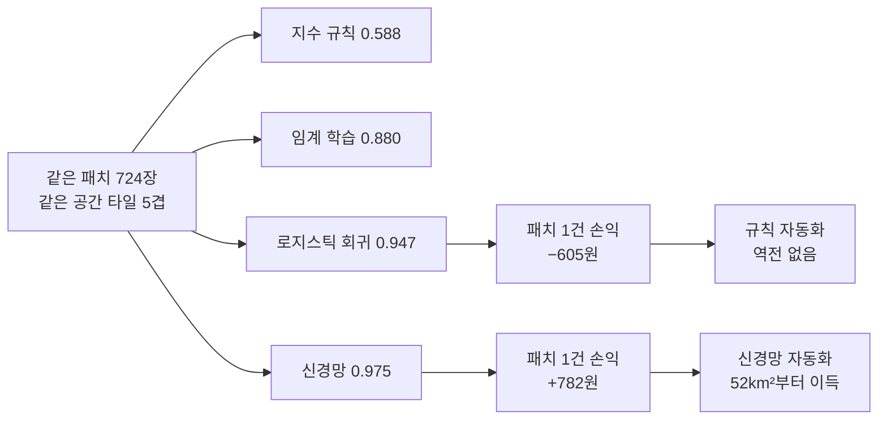

# 5장 위성영상 딥러닝, 픽셀 분류에서 도입 결정까지

> - 이 장에 나오는 정확도·Macro-F1·손익분기 면적·비용은 모두 `lecture_practice/chapter5/`의 코드를 실제로 실행해 얻은 값
> - 예시를 위해 지어낸 숫자는 없음

## 1. 이 장의 핵심 질문

- 위성 사진 한 장은 색이 3개(R·G·B)가 아니라 12개 숫자층으로 되어 있음. 이걸 어떻게 하나의 모델에 넣을까?
- 라벨(정답)이 겨우 724장뿐인데 신경망이 배울 수 있을까?
- 학습·검증을 무작위로 나누면 안 되는 이유는 무엇일까?
- 산림·경작지·시가지·수역을 가르는 정확도 0.028의 차이가 왜 사업의 흑자와 적자를 가를까?
- 정확도 0.975짜리 모델도 놓치는 게 있는데, 그 실수는 지역 통계에서 어떻게 나타날까?

- 이 장은 **위성영상 한 장을 토지피복 라벨로 바꾸고, 그 라벨을 지역 지표로 집계하고, 도입 여부까지 판정하는 여덟 단계**를 다룸
- 여덟 단계는 순서가 있음. 검증 방법(6단계)을 정하지 않고 모델(4단계)부터 고르면, 그 모델이 좋은지 나쁜지 잴 기준이 없음

- 핵심은 다음 한 문장
- **모델의 정확도는 끝이 아니라 중간 결과임. 그 숫자가 지역 지표로 집계될 때 어느 방향으로 치우치는지, 그 격차가 비용으로 얼마인지까지 계산해야 결정이 나옴**

## 2. 직관적 비유

- **가중치 공유 = 같은 도장을 여러 자리에 찍는 것**
- 도장 하나(필터)로 종이(패치) 위 여러 자리를 찍으면, 같은 무늬가 있는 자리마다 같은 표시가 남음
- 대응을 하나씩 짚으면
- 도장의 모양 = 필터의 가중치
- 도장을 찍는 자리 = 입력 위 위치
- 찍힌 표시 = 그 위치의 출력값(특징)
- 도장 하나로 종이 전체를 찍으므로, **도장 개수(파라미터 수)는 종이 크기(패치 크기)와 무관함**
- 이 성질이 **가중치 공유**이고, 위성영상처럼 같은 무늬(도로·건물·논)가 위치와 무관하게 나타나는 자료에서 특히 유리함

- **손익분기 면적 = 저울의 평형점**
- 왼쪽 접시에는 자동화가 아끼는 인건비, 오른쪽 접시에는 자동화가 더 내는 오분류 처리비를 올림
- 접시가 수평이 되는 면적이 **손익분기 면적**
- 오른쪽이 항상 더 무거우면(건당 손해가 나면) 면적을 아무리 늘려도 접시는 수평이 되지 않음. 이 경우가 **역전 없음**
- 왼쪽이 조금이라도 더 무거우면, 면적을 늘릴수록 왼쪽이 계속 쌓여 처음 든 비용(개발비)을 언젠가 넘어섬. 그 지점이 손익분기 면적임

## 3. 핵심 개념 5가지

1. **관측 단위는 픽셀이 아니라 패치임**
   - 이 장의 실습은 32×32 픽셀 패치를 하나의 판정 단위로 씀
   - 해상도 10m를 곱하면 한 변이 320m, 면적은 0.1024km²
   - 이 숫자는 나중에 원가 계산에 그대로 곱해짐(14절)
2. **합성곱은 필터가 이동하며 경계를 찾는 연산임**
   - 필터가 밝기가 갑자기 바뀌는 자리(경계)에서 큰 값을 냄
   - 층을 쌓을수록 한 출력이 보는 입력 범위(**수용영역**)가 넓어짐
3. **전이학습은 남이 배운 것을 빌리는 것임**
   - 라벨 724장으로 파라미터 96,804개를 처음부터 배우면 자료가 모자람
   - 다른 자료(ImageNet 등)로 이미 배운 가중치를 시작점으로 쓰면 이 부족을 메울 수 있음
4. **공간 교차검증은 같은 동네를 두 번 보지 않게 나누는 것임**
   - 이웃한 패치를 학습과 검증에 갈라 넣으면 "새 동네를 맞히는 능력"이 아니라 "이미 본 동네의 옆 칸을 맞히는 능력"을 잼
   - 재실행할 때마다 값이 흔들리는 폭(**잡음 바닥**)보다 작은 차이는 어느 쪽이 낫다고 말할 수 없음
5. **성능 격차는 비용으로 바꿔야 결정이 됨**
   - "정확도가 2.8%p 높다"는 문장만으로는 아무것도 결정할 수 없음
   - 그 격차를 절감 인건비와 오분류 처리비로 바꾸면 "몇 km²부터 이득인가"라는 숫자(**손익분기 면적**)가 나옴

## 4. 실제 자료를 먼저 보기

- 이 장도 정의보다 실제 자료를 먼저 보는 편이 이해가 쉬움

- Copernicus Data Space Ecosystem (Sentinel-2 원본)
  https://dataspace.copernicus.eu/
- ESA WorldCover (전 지구 토지피복 지도, 이 장의 라벨 출처)
  https://esa-worldcover.org/en
- BigEarthNet (59만 장 규모 Sentinel-2 벤치마크)
  https://bigearth.net/
- EuroSAT (2만 7천 장 규모, 10클래스 벤치마크)
  https://github.com/phelber/EuroSAT

- esa-worldcover.org에서 지도를 열어 보면 전 세계가 11개 클래스(산림·초지·경작지·시가지·나지·눈얼음·영구수역 등)로 칠해져 있음
- 이 장의 실습은 이 지도에서 **춘천 의암호 일대**의 조각을 잘라 라벨로 씀
- 지도 색이 "이 자리가 산림"이라고 말해 주지만, 그 색은 2021년 한 해 위성 관측을 다수결로 정리한 값이지 그 자리의 절대 진실이 아님. 이 구분은 7절에서 다시 다룸

## 실습 안내

- 실습 코드
  - `lecture_practice/chapter5/code/5-1-cnn-sentinel2-classification.py` — 패치 추출, CNN 학습, 무작위·공간 분할 비교
  - `lecture_practice/chapter5/code/5-2-baseline-vs-cnn.py` — 저비용 기준선 4종과 CNN의 비교
  - `lecture_practice/chapter5/code/5-3-adoption-cost-breakeven.py` — 손익분기 면적과 민감도 계산
- 결과 로그: `lecture_practice/chapter5/results/*.log`

- 이 장은 아직 `docs`와 같은 폴더(`lecture_practice/chapter5/`)를 씀. 실습 폴더가 두 트랙으로 갈라지는 것은 7장부터임
- 코드는 CPU에서 몇 분 안에 끝나도록 패치 수와 학습 에폭을 줄여 둠
- 실행 전에 4장 실습으로 내려받은 위성영상 클립이 있어야 함. 없으면 먼저 `python lecture_practice/chapter4/code/4-0-data-download.py`를 실행함

## 5. 실제 사례로 먼저 보기

- `5-1-cnn-sentinel2-classification.log`의 실제 실행 결과

- 춘천 의암호 일대 Sentinel-2 L2A 장면(2021년 4월 7일, 구름 0.44%)에서 32×32 패치 **2,318개**를 뽑음
- 클래스별 순수 패치 수: 산림 1,508개, 시가지 380개, 수역 212개, 경작지 181개, 초지 37개
- 초지는 순수 패치가 80개 미만이라 분류 대상에서 뺌
- 남은 네 클래스를 가장 적은 경작지(181개)에 맞춰 균형을 잡아 최종 **724장**을 얻음
- 공간 타일은 36개로 나눔

- SimpleCNN은 파라미터 96,804개, MiniResNet은 1,231,236개

- 검증 방법을 두 가지로 비교한 결과

| 검증 설계 | Accuracy | Macro-F1 |
| --- | ---: | ---: |
| 무작위 5겹 교차검증 | 0.964 ± 0.012 | 0.964 ± 0.013 |
| 공간 타일 교차검증 | 0.971 ± 0.012 | 0.965 ± 0.011 |
| 차이(무작위 − 공간) | −0.007 | −0.001 |

- 무작위 분할이 더 높게 나올 것 같은데 오히려 낮음. 이 값을 그대로 "공간 분할이 더 낫다"로 읽으면 안 되는 이유는 12절에서 다시 다룸(시드를 바꿔 가며 재확인이 필요함)

- 시험표본 143장의 클래스별 성능

| 클래스 | 정밀도 | 재현율 | F1 | 표본 수 |
| --- | ---: | ---: | ---: | ---: |
| 산림 | 0.974 | 1.000 | 0.987 | 38 |
| 경작지 | 1.000 | 0.973 | 0.986 | 37 |
| 시가지 | 1.000 | 0.889 | 0.941 | 18 |
| 수역 | 0.962 | 1.000 | 0.980 | 50 |

- 시가지만 F1이 0.95 아래(0.941)임
- 정밀도는 1.000(시가지라고 부른 건 다 맞음), 재현율은 0.889(실제 시가지 18장 중 2장을 놓침)
- **놓치는 쪽으로만 틀림.** 이 모델로 지역 지표를 만들면 시가지 비율이 실제보다 낮게 나옴. 13절에서 이 오차가 지표로 어떻게 전파되는지 계산함

## 6. 위성영상 딥러닝의 여덟 단계

- 아래 순서를 지켜야 함. 순서를 바꾸면 뒤 단계에서 판단할 근거가 사라짐
- 예를 들어 검증 방법(6단계)을 정하기 전에 모델(4단계)부터 고르면, 어떤 모델이 나은지 잴 기준이 없음

```
[1] 대상·관측 단위 정하기      → 패치 크기, 지상 면적
        ↓
[2] 영상 자료 준비하기         → 입력 텐서 (12, 32, 32)
        ↓
[3] 라벨 만들기                → 클래스 정의, 라벨 배열
        ↓
[4] 모델 고르기                → 기준선 + 후보 모델
        ↓
[5] 학습 전략 정하기           → 초기 가중치, 증강, 억제 장치
        ↓
[6] 공간 교차검증으로 채점하기  → 성능표, 잡음 바닥
        ↓
[7] 지역 지표로 집계하기       → 단위별 지표표
        ↓
[8] 도입 결정으로 바꾸기       → 손익분기 면적
```

**그림 5.1** 위성영상 딥러닝의 여덟 단계와 단계별 산출물

- 각 단계가 이 장의 어느 절에서 다뤄지는지

| 단계 | 이 장의 절 |
| --- | --- |
| 1 대상·관측 단위 | 7절 |
| 2 영상 자료 준비 | 8절 |
| 3 라벨 만들기 | 9절 |
| 4 모델 고르기 | 10절 |
| 5 학습 전략 | 11절 |
| 6 공간 교차검증 | 12절 |
| 7 지역 지표 집계 | 13절 |
| 8 도입 결정 | 14절 |

- 이 장이 다루는 범위도 미리 못 박아 둠
- **개별 건물 하나의 면적**을 재는 일, **두 시점을 비교해 무엇이 바뀌었는지 찾는 일**은 픽셀 단위 예측이 필요해 6장의 몫임
- 이 장은 **패치 한 장에 라벨 하나**를 붙이는 데까지만 다룸

## 7. 대상과 관측 단위를 정한다

### 7.1 실제로 알고 싶은 값과 자료에 적힌 값은 다르다

- 세 가지 값을 구분해야 함
  - y = 실제로 알고 싶은 값(그 자리의 진짜 토지피복)
  - yᵒᵇˢ = 자료에 기록된 값(WorldCover 지도가 다수결로 적은 값)
  - ŷ = 모델이 낸 값(예측)
- 모델은 yᵒᵇˢ를 정답 삼아 배우지만, 결정에 쓰고 싶은 값은 y임
- 두 값이 벌어지는 경로가 셋 있음
  1. 지도를 만든 시점과 위성 촬영 시점이 다르면 그 사이 바뀐 곳이 어긋남
  2. 지도의 클래스 정의가 이 과제의 정의와 다르면 같은 대상을 다른 이름으로 부름
  3. 한 패치 안에 여러 피복이 섞이면 다수결이 소수 피복을 지움

### 7.2 과업의 형태를 먼저 정한다

- 같은 영상이라도 묻는 질문에 따라 출력 형태가 달라짐

| 과업 | 출력 | 질문의 형태 |
| --- | --- | --- |
| 패치 분류 | 클래스 하나 | 이 구역이 시가지인가 |
| 객체 탐지 | 박스 좌표 + 클래스 | 이 항만에 배가 몇 척인가 |
| 세그멘테이션 | 픽셀별 클래스 | 이 동의 불투수면 면적은 몇 ㎡인가 |

- 답이 "예/아니오"면 분류로 충분함
- 답이 "몇 개"면 개별 객체를 세야 하므로 탐지가 필요함
- 답이 "몇 ㎡"면 경계를 픽셀 단위로 그어야 하므로 세그멘테이션이 필요함(6장의 몫)
- 이 장의 실습은 첫 번째, 패치 분류임

### 7.3 관측 단위의 크기를 정하고 지상 면적으로 환산한다

- 패치 한 변의 길이 = 패치 픽셀 수 × 해상도
- 이 장은 32픽셀 × 10m = **320m**
- 면적 = 320m × 320m = **0.1024km²**
- 이 숫자는 지금 정하고 끝나는 게 아니라 14절의 원가 계산에 그대로 곱해짐. 패치 크기를 바꾸면 판독 1건의 단가도, 손익분기 면적도 함께 바뀜

## 8. 영상 자료를 준비한다

### 8.1 위성영상은 사진과 다르다

| 속성 | 보통 사진 | 위성영상 |
| --- | --- | --- |
| 채널 수 | 3(R·G·B) | 12(Sentinel-2 L2A) |
| 값 범위 | 0~255 | 0~10,000 이상 |
| 값의 의미 | 시각적 외형 | 파장대별 반사율 |

- Sentinel-2는 13개 밴드를 관측하지만, 대기 보정을 마친 L2A 산출물에는 지표 정보가 없는 B10이 빠져 **12개 밴드**가 제공됨. 이 장의 입력 채널이 13이 아니라 12인 이유가 이것임
- 값 범위가 넓은 것이 문제가 됨. 사진은 255로 나누면 끝나지만, 반사율은 그렇게 간단하지 않음

### 8.2 어떤 밴드를 쓸지 정한다

- 판정에 쓰는 물리를 담은 밴드를 먼저 넣음
- 식생과 물을 가르려면 근적외선(NIR, B08)이 필요함
- 시가지와 나지를 가르려면 단파적외선(SWIR, B11·B12)이 필요함
- `5-1` 로그의 실측: RGB(3밴드) Macro-F1 0.973, RGB+NIR(4밴드) 0.984, 전체 12밴드도 0.984
- **NIR 하나를 더한 것이 나머지 여덟 밴드를 다 더한 것과 같은 효과를 냄.** 대기 보정용 60m 밴드(B01·B09)는 지표 분류에 기여가 적기 때문임

### 8.3 해상도를 하나로 맞춘다

- Sentinel-2는 밴드마다 해상도가 다름(10m·20m·60m). CNN 입력은 모든 채널의 가로세로가 같아야 함
- 세 방법이 있음

| 전략 | 방법 | 대가 |
| --- | --- | --- |
| 업샘플링 | 20m·60m를 10m로 보간 | 텐서만 커지고 정보는 늘지 않음 |
| 다운샘플링 | 10m를 20m로 축소 | 공간 해상도가 절반으로 줆 |
| 다중 스케일 융합 | 해상도별로 따로 처리 후 결합 | 구현이 복잡함 |

### 8.4 SAR는 다른 전처리가 필요하다

- SAR(합성개구레이더)는 위성이 직접 마이크로파를 쏘고 돌아온 신호를 재는 센서임. 구름을 통과하고 밤에도 관측되므로 광학이 막힌 상황에 씀
- 되돌아온 신호의 세기가 **후방산란계수**(σ⁰)임. 잔잔한 물은 0.001 수준, 건물은 1 근처까지, 표면마다 값이 수천 배 차이 남
- 이 값을 그대로 신경망에 넣으면 오류 메시지 없이 학습이 진행되지만, 큰 값 몇 개가 손실을 지배해 학습이 정체됨
- 변환 순서를 고정함
  1. **dB 변환** — σ⁰(dB) = 10 × log₁₀(σ⁰). 1,000배 차이가 30이라는 덧셈 범위로 압축됨
  2. **클리핑** — 자기 장면의 분위수로 구간을 정함(예: −25~0dB)
  3. **정규화** — 그 구간을 0~1로 옮김

> - **막힘 없이 통과하는 실수 하나**
> - σ⁰를 변환 없이 넣어도 오류가 나지 않고 학습이 정상 종료함. 다만 손실이 초기부터 움직이지 않음
> - dB 변환 → 클리핑 → 정규화 순서를 지키면 해결됨

- SAR에는 광학에 없는 잡음도 있음. 균일한 논을 찍어도 이웃 픽셀 밝기가 무작위로 흔들리는데, 이를 **스페클 노이즈**라 함. 여러 관측을 평균해 줄이는 방법(멀티룩)을 쓰면 잡음은 줄지만 그만큼 해상도가 거칠어짐

## 9. 라벨을 만든다

### 9.1 라벨을 구하는 네 가지 경로

| 경로 | 방법 | 비용 |
| --- | --- | --- |
| 공개 벤치마크 | EuroSAT·BigEarthNet 등 이미 라벨된 자료를 씀 | 낮음(자기 과제와 안 맞을 수 있음) |
| 지도 전용 | 기존 토지피복 지도를 라벨로 씀 | 중간 |
| 직접 라벨링 | 사람이 판독함 | 높음 |
| 약지도 학습 | 소량 라벨 + 대량 비라벨 | 중간(설계가 까다로움) |

- 이 장의 실습은 두 번째, ESA WorldCover 2021 지도를 라벨로 전용함

### 9.2 지도를 라벨로 바꾸는 다섯 단계

1. **정합** — 지도를 영상과 같은 좌표계·격자로 맞춤
2. **패치 격자 생성** — 영상을 32×32로 자름
3. **다수결 판정** — 패치 안 1,024개 픽셀 라벨의 최빈값을 그 패치의 라벨로 삼음
4. **순도 필터** — 최빈 클래스 비율(순도)이 기준(이 실습은 0.6)에 못 미치면 버림
5. **클래스 균형** — 클래스별 개수를 가장 적은 클래스에 맞춤

- 5절에서 본 숫자를 다시 보면 2,318장 중 **724장(31%)만 남음**
- 버려진 69%가 무작위가 아님. 균형 조정으로 잘린 산림도 있지만, 경계·혼합 구역의 패치가 순도 필터에서 함께 빠짐
- 실제 배치에서 판정이 어려운 곳이 바로 이 경계·혼합 구역이므로, **이 성능은 실제 배치 성능의 상한에 가까움**

> - **순도 필터가 만드는 조건**
> - 순도 필터를 걸면 성능이 오르지만, 그 성능은 걸러 낸 자료 위에서만 성립함
> - 필터 기준과 잔존 비율(31%), 제외한 클래스(초지)를 성능표와 함께 적어 둬야 함

### 9.3 사람이 직접 붙이는 경우

- 공개 자료로 덮이지 않는 클래스는 사람이 판독함
- 예산을 아끼려면 **어느 패치를 붙일지**가 중요함
  - **층화 샘플링** — 클래스·지역별로 정해진 수를 뽑음(산림이 65%인 지역에서 무작위로 뽑으면 산림만 뽑힘)
  - **능동 학습** — 모델이 확신 못 하는 패치를 우선 라벨링함
  - **경계 우선 라벨링** — 서로 다른 피복이 맞닿는 자리에 예산을 몰아줌

### 9.4 라벨이 부족할 때

- **약지도 학습**은 소량 라벨로 모델을 만든 뒤, 그 모델이 비라벨 자료에서 확신 있게 예측한 결과를 임시 라벨로 씀
- 공간 자료에서는 두 가지를 조심해야 함
  - 임시 라벨을 학습 라벨 근처에서 만들면 이미 본 곳을 다시 배우는 셈(**공간 누수**)
  - 특정 지역에서만 임시 라벨이 만들어지면 그 지역 특성이 과대 반영됨(**지역 편향**)

## 10. 모델을 고른다

### 10.1 다섯 계열, 그리고 저비용 기준선부터

- 같은 자료로 쓸 수 있는 방법이 다섯 계열 있고, 아래로 갈수록 표현력도 비용도 늘어남

| 계열 | 무엇을 배우는가 | 계산 비용 |
| --- | --- | --- |
| 고정 임계 규칙 | 없음(문헌 값을 그대로 씀) | 0 |
| 학습된 임계 | 자를 위치 | 매우 낮음 |
| 요약 피처 + 선형·트리 | 피처 가중치 | 낮음 |
| 합성곱 신경망(CNN) | 필터 가중치 | 중간 |
| 탐지기 | 위치 + 분류 | 높음 |

- 판정 규칙은 간단함. **아래 계열이 위 계열을 못 이기면 위 계열을 씀**
- 그래서 CNN을 쓰기 전에 먼저 값싼 방법부터 채점해야 함

### 10.2 분광지수 기준선

- **분광지수**는 두 밴드의 차를 합으로 나눈 값임
  - NDVI = (NIR − Red) / (NIR + Red) — 클수록 식생
  - NDWI = (Green − NIR) / (Green + NIR) — 클수록 물
  - NDBI = (SWIR − NIR) / (SWIR + NIR) — 클수록 시가지·나지
- 이 형태를 쓰는 이유는 계산으로 확인됨. 장면 전체 밝기가 배수 c만큼 바뀌어도 (ca−cb)/(ca+cb) = (a−b)/(a+b)로 c가 상쇄됨. 태양각·대기 상태가 바뀌어도 지수 값은 거의 흔들리지 않음
- `5-2-baseline-vs-cnn.log`의 클래스별 지수 평균

| 클래스 | NDVI | NDWI | NDBI |
| --- | ---: | ---: | ---: |
| 산림 | +0.471 | −0.493 | −0.007 |
| 경작지 | +0.245 | −0.309 | +0.080 |
| 시가지 | +0.187 | −0.226 | +0.074 |
| 수역 | −0.088 | +0.282 | −0.111 |

- 수역은 세 지수 모두에서 확실히 갈리지만, **경작지와 시가지는 붙어 있음**(NDVI 0.245 대 0.187). 4월 초 촬영이라 파종 전 경작지가 나지 상태이기 때문임

### 10.3 다섯 방법을 같은 조건에서 채점하기

- 같은 패치 724장, 같은 공간 타일 5겹으로 다섯 방법을 나란히 놓음

| 방법 | Accuracy | Macro-F1 | 학습 | 파라미터 |
| --- | ---: | ---: | ---: | ---: |
| R1 고정 임계 규칙 | 0.588±0.125 | 0.514±0.037 | 0.00초 | 0 |
| R2 학습된 임계(트리) | 0.880±0.060 | 0.857±0.050 | 0.01초 | 노드 ≤15 |
| L 로지스틱 회귀 | 0.947±0.032 | 0.934±0.034 | 0.08초 | 124 |
| RF 랜덤 포레스트 | 0.935±0.044 | 0.926±0.053 | 2.31초 | 트리 300 |
| CNN SimpleCNN | 0.975±0.011 | 0.967±0.012 | 6.12초 | 96,804 |

- 네 가지를 읽어야 함
1. **문헌 임계를 그대로 옮기면 무너짐.** R1은 Macro-F1 0.514로 절반 수준
2. **실패의 대부분은 정보 부족이 아니라 임계 부적합임.** R2는 똑같은 지수 3개를 쓰면서 자를 위치만 학습했을 뿐인데 0.514 → 0.857로 오름
3. **피처를 늘리는 것이 모델을 키우는 것보다 앞섬.** 요약 피처 30개를 쓴 로지스틱 회귀(0.934)가 같은 피처의 랜덤 포레스트(0.926)보다 높음. 표본이 724장뿐이라 트리 앙상블의 유연성이 이득으로 이어지지 않음
4. **CNN이 이기되 격차는 크지 않음.** Macro-F1 +0.032, Accuracy +0.028. 이 격차가 CNN 자신의 실행 간 변동보다 큰지는 12절에서 확인함

### 10.4 CNN은 무엇을 계산하는가

- **문제 상황**: 32×32 패치를 1,024개 숫자로 풀어 헤치면 어느 값이 어느 값 옆에 있었는지가 사라짐. 요약 피처(평균·표준편차)도 같은 문제를 가짐 — 밝은 픽셀과 어두운 픽셀이 규칙적으로 배열됐는지 뭉쳐 있는지 구분하지 못함
- **작동 원리**: 필터 하나가 하는 일은 다섯 단계임
  1. 작은 가중치 배열(필터)을 입력의 한 자리에 겹침
  2. 겹친 자리의 값과 가중치를 위치마다 곱함
  3. 곱한 값을 모두 더함
  4. 편향을 더함
  5. 활성화 함수를 통과시키고, 필터를 옆으로 옮겨 반복함
- **작은 계산 예**: 세로 경계를 찾는 필터 w=[[−1,0,+1],[−1,0,+1],[−1,0,+1]], 편향 b=−0.10을 밭과 지붕이 맞닿은 자리(반사율 [[0.12,0.14,0.38],[0.11,0.15,0.41],[0.13,0.16,0.39]])에 대면 (0.38−0.12)+(0.41−0.11)+(0.39−0.13)=0.82, 편향을 더해 0.72가 남음. 같은 필터를 균질한 밭 한가운데 대면 합이 0.02이고, 편향을 더하면 음수가 되어 ReLU가 0으로 자름. **같은 가중치 아홉 개가 경계에서는 큰 값을, 균질한 자리에서는 0을 냄**
- **정식 개념**: 필터를 몇 칸씩 옮기는지가 **스트라이드**, 가장자리에 0을 몇 겹 두르는지가 **패딩**임. 3×3 필터, 스트라이드 1, 패딩 1을 쓰면 출력 크기가 입력과 같게 유지됨
- **수용영역**: 출력 한 자리가 반영하는 입력 범위임. 3×3 필터 한 층은 입력 3×3을 보고, 두 층이면 5×5, 세 층이면 7×7을 봄. 10m 해상도에서 7×7은 70m×70m로, 건물 블록 하나 정도의 맥락에 해당함
- **한계**: 필터가 위치 정보를 압축하는 대신 세밀한 위치는 버림. 패치 분류는 "이 패턴이 패치 안에 있었는가"만 알면 되므로 문제가 안 되지만, 픽셀마다 답해야 하는 세그멘테이션(6장)에서는 이 손실이 경계 흐림으로 나타남

### 10.5 무엇을 고를지 정하는 순서

```
답이 개수인가?
   예 → 탐지기
   아니오 → 기준선(지수 규칙)부터 채점
             기준선이 충분한가?
                예 → 기준선 채택
                아니오 → 무엇이 부족한가?
                          임계가 안 맞음 → 임계를 학습으로
                          피처가 모자람 → 요약 피처 확장
                          픽셀 배치가 필요함 → CNN
```

**그림 5.2** 결정 형태와 기준선 성능에 따른 모델 선택

> - **성능을 시험 폴드에 맞춰 고르지 않기**
> - 하이퍼파라미터나 임계값을 시험 폴드 성능을 보고 정하면 그 폴드는 더 이상 독립적인 시험이 아님
> - 학습 폴드 안에서 내부 분할로 정하고, 시험 폴드는 마지막에 한 번만 씀

## 11. 학습 전략을 정한다

### 11.1 전이학습 — 남이 배운 것을 빌린다

- 라벨 724장, 파라미터 96,804개. 파라미터 하나당 학습 표본이 0.007장 수준임
- 사전학습 가중치를 가져오면 이 부족을 메울 수 있음. 근거는 층별로 배우는 것이 다르다는 데 있음
  - 얕은 층 — 밝기가 바뀌는 자리, 반복 무늬, 색 경계를 배움. 고양이 사진이든 위성영상이든 같은 모양으로 나타나므로 그대로 재사용 가능함
  - 깊은 층 — 원 과업(개 얼굴, 자동차 바퀴)에 특화됨. 위성영상에서는 쓸모가 적음
- 그래서 얕은 층은 낮은 학습률로 보존하고, 깊은 층·분류 헤드는 높은 학습률로 다시 배움

```python
# ImageNet 사전학습 ResNet-50의 첫 합성곱 층만
# 12채널(L2A) 입력용으로 교체
model = resnet50(weights="IMAGENET1K_V2")
model.conv1 = nn.Conv2d(12, 64, kernel_size=7, stride=2, padding=3, bias=False)
```

_전체 코드는 lecture_practice/chapter5/code/5-1-cnn-sentinel2-classification.py 참고_

- 이 교체가 버리는 몫을 계산해 보면 전이학습이 왜 이득인지 보임. 첫 합성곱 층의 가중치는 원래 3×7×7×64=9,408개인데, 12채널용으로 바꾸면 12×7×7×64=37,632개가 되고 사전학습 값을 물려받는 건 0개임. 그런데 ResNet-50 전체 파라미터는 약 2,500만 개이므로, 새로 배워야 하는 몫은 37,632÷25,000,000 ≈ 0.15%뿐임. **나머지 99.85%는 그대로 재사용됨**

- 원격탐사 자료로 직접 사전학습한 모델(SatMAE, Prithvi, SSL4EO-S12, SeCo)도 있음. 사람 라벨 없이 영상 일부를 가리고 복원하게 하거나, 같은 장소의 다른 계절 영상을 같은 것으로 알아보게 해서 학습함. 이런 도메인 내 표현이 ImageNet 표현보다 위성영상 과업에서 대체로 유리함(Neumann et al., 2019)

### 11.2 증강 — 어떤 변형이 안전한가

- 두 질문으로 판정함
  1. **이 변형이 라벨을 바꾸는가?** 90° 돌린 산림은 여전히 산림임 → 아니오
  2. **이 변형이 밴드 사이 비율을 바꾸는가?** 밴드 비율은 물리 측정값이므로 바뀌면 관측되지 않은 물리 상태를 만듦
- 두 질문 모두 "아니오"면 안전, ②가 "예"면 금지

| 증강 | 라벨 바뀜? | 비율 바뀜? | 판정 |
| --- | --- | --- | --- |
| 회전(90°·180°·270°) | 아니오 | 아니오 | 사용 |
| 뒤집기 | 아니오 | 아니오 | 사용 |
| 스케일(0.8~1.2배) | 아니오 | 아니오 | 조건부(해상도 의미가 바뀜) |
| 색상 변환(밝기·대비·채도) | 아니오 | 예 | 금지 |

- 계산으로 확인해 봄. 건강한 식생은 NIR 0.45, Red 0.05로 NDVI=(0.45−0.05)/(0.45+0.05)=0.80. 장면 전체가 20% 밝아져도 NIR 0.54, Red 0.06이면 NDVI=0.48/0.60=0.80으로 그대로임(분자·분모에 같은 배수가 상쇄됨)
- 그런데 Color Jitter처럼 Red만 0.05→0.20으로 올리면 NDVI=(0.45−0.20)/(0.45+0.20)=0.38로, 식생 기준선 0.80에 있던 패치가 나지 수준으로 옮겨 감. **라벨은 여전히 산림인데 모델은 이 조합을 산림의 한 모습으로 배움**

> - **오류 없이 통과하는 실수**
> - Color Jitter는 학습을 정상 종료시키지만, Red와 NIR 비율이 깨지면 NDVI가 이동해 물리적 의미와 무관한 조합을 학습함
> - 증강 하나를 추가할 때마다 "밴드 비율을 바꾸는가"를 확인하고, "예"면 뺌

### 11.3 과적합을 막는 세 장치

- **드롭아웃** — 학습 중 뉴런 일부를 확률 p로 끔(이 실습은 p=0.3). 판정을 특정 채널 몇 개에 몰아둘 수 없게 함
- **배치 정규화** — 각 층의 출력을 미니배치 안에서 평균 0, 분산 1로 맞춤. 더 큰 학습률을 쓸 수 있게 함
- **조기 종료** — 검증 성능이 일정 에폭 동안 개선되지 않으면 멈추고 가장 좋았던 시점으로 되돌림

## 12. 공간 교차검증으로 채점한다

### 12.1 왜 무작위로 나누면 안 되는가

- 패치를 무작위로 5등분하면 같은 타일에서 잘라 낸 이웃 패치가 학습과 검증에 갈라져 들어감
- 이웃 패치는 촬영 시각·태양각·지역 특성을 공유하므로, 이 방법이 재는 것은 "새 지역을 맞히는 능력"이 아니라 "이미 본 지역의 옆 칸을 맞히는 능력"임
- 대응은 검증 단위를 패치가 아니라 **타일**로 올리는 것

```python
# 공간 분할: 타일 ID를 그룹으로 묶어, 검증 타일은 학습에서 통째로 제외
block_cv = GroupKFold(n_splits=min(5, N_TILES))
block_cv.split(range(len(dataset)), groups=all_tile_ids)
```

_전체 코드는 lecture_practice/chapter5/code/5-1-cnn-sentinel2-classification.py 참고_

- 이 실습은 타일 36개를 5겹으로 나눔. 폴드마다 타일 7~8개가 검증으로 빠짐

### 12.2 Accuracy와 Macro-F1은 다른 것을 잼

- Accuracy = 전체 중 맞힌 비율. 표본이 많은 클래스가 값을 좌우함
- **Macro-F1** = 클래스마다 F1을 구해 클래스 수로 단순 평균. 표본이 적은 클래스도 같은 무게로 반영됨
- 시험표본 143장(산림38·경작지37·시가지18·수역50)에서 시가지 2건만 바로잡으면
  - Accuracy: 140/143=0.979 → 142/143=0.993 (+0.014)
  - Macro-F1: 0.974 → 0.993 (+0.019)
- 같은 오분류 2건인데 Macro-F1이 더 크게 움직임. 시가지는 표본의 12.6%뿐인데 Macro-F1에서는 25%의 무게를 받기 때문임. **표본이 불균형하면 두 지표를 함께 봐야 함**

### 12.3 잡음 바닥 — 재실행하면 흔들리는 폭

- 5절 표에서 확인한 과대추정(무작위−공간)은 Accuracy −0.007, Macro-F1 −0.001임
- 그런데 같은 표에서 폴드 간 표준편차가 ±0.008~0.013임. **재려는 차이가 측정 자체의 흔들림보다 작음**
- 시드를 바꿔 세 번 더 돌린 결과

| 시드 | 무작위 Acc | 공간 Acc | 무작위 F1 | 공간 F1 | 과대추정 Acc | 과대추정 F1 |
| ---: | ---: | ---: | ---: | ---: | ---: | ---: |
| 0 | 0.967 | 0.967 | 0.967 | 0.956 | −0.000 | +0.011 |
| 1 | 0.967 | 0.970 | 0.967 | 0.962 | −0.003 | +0.004 |
| 2 | 0.968 | 0.968 | 0.968 | 0.959 | −0.000 | +0.008 |

- 과대추정 Accuracy는 −0.003~−0.000, Macro-F1은 +0.004~+0.011. **두 지표가 반대 부호를 가리킴**
- 이럴 때는 "공간 분할이 낫다"거나 "무작위가 낫다"고 말하지 않고, **"이 과제에서는 과대추정이 검출되지 않았다"**고 읽음
- 이유는 자료 성격에 있음. 순도 필터로 뚜렷한 패치만 남겼으므로 처음 본 타일에서도 잘 맞음. 그래도 실무 규칙은 바뀌지 않음. 과대추정이 있을지 없을지는 미리 알 수 없으므로 **공간 분할 성능은 항상 함께 보고함**

> - **소수점 셋째 자리는 시드로 뒤집힘**
> - 이 실습의 과대추정 Macro-F1은 네 번의 실행에서 −0.000~+0.011 사이를 오감
> - 방향을 보고하기 전에 시드 3개 이상으로 재실행해 그 폭과 비교하고, 폭보다 작으면 "검출되지 않았다"로 적음

### 12.4 CNN과 기준선의 격차는 진짜인가

- 10.3절에서 CNN Macro-F1 0.967, 최고 기준선(로지스틱 회귀) 0.934, 격차 +0.032였음
- 이 격차가 잡음 바닥보다 큰지 확인함. CNN을 시드 3개로 돌린 Macro-F1 범위는 0.963~0.967(폭 0.004)
- 폴드별 격차는 +0.077, +0.001, +0.029, +0.018, +0.036 — **다섯 폴드 모두 양수**
- 폴드 하나(+0.001)만 보면 잡음 바닥(0.004)보다 작아 보이지만, **다섯 폴드 전부가 같은 방향**이라는 점이 이 차이를 신뢰할 근거가 됨. 5절의 "무작위 대 공간" 비교가 부호를 신뢰할 수 없었던 것과 대비됨

### 12.5 클래스별로 다시 보기

- CNN 대 로지스틱 회귀의 클래스별 F1(out-of-fold)

| 방법 | 산림 | 경작지 | 시가지 | 수역 |
| --- | ---: | ---: | ---: | ---: |
| L 로지스틱 회귀 | 0.967 | 0.916 | 0.926 | 0.981 |
| CNN | 0.980 | 0.959 | 0.967 | 0.995 |

- 수역은 두 방법 모두 0.98 이상이라 얻을 게 없음. 산림도 로지스틱 회귀가 이미 0.967
- CNN이 버는 몫은 **경작지(0.916→0.959)와 시가지(0.926→0.967)에 몰림.** 10.2절에서 지수가 붙어 있던 바로 그 두 클래스임
- 분광 평균이 비슷할 때 남는 단서는 픽셀의 배치(질감)임. 규칙적인 건물 블록과 균질한 밭은 평균 밝기가 비슷해도 무늬가 다른데, 평균·표준편차로 요약하는 순간 그 무늬는 사라짐. CNN의 필터는 이 무늬를 직접 읽음(10.4절)

## 13. 픽셀 라벨을 지역 지표로 바꾼다

### 13.1 집계 절차

- 6단계까지의 산출물은 패치마다 붙은 라벨임. 그런데 도시계획·녹지 정책·침수 위험 평가는 패치가 아니라 행정구역·격자 단위에서 이뤄짐
1. **라벨 확보** — 대상 지역 전체 패치에 클래스를 부여함
2. **분석 단위 확정** — 100m 격자, 500m 격자, 읍면동 경계 등 결정이 집행되는 단위를 정함
3. **단위 내 집계** — 단위 안 패치를 클래스별로 세어 비율을 만듦
4. **설명변수 투입** — 만든 지표를 정책 분석에 넘김

- 계산은 단순함. 단위 a 안의 패치 중 클래스 k인 것의 비율은 rₖ(a) = nₖ(a) / |P(a)|

### 13.2 오류가 지표로 옮겨 가는 방향

- 5절에서 본 시가지 값(정밀도 1.000, 재현율 0.889)을 다시 씀
- 실제 시가지 패치 100장이 있는 단위에서 모델은 약 89장만 시가지로 부름. **그 단위의 불투수면 비율은 실제보다 약 11% 낮게 산출됨**
- 이 값을 침수 위험 평가에 넣으면 위험이 체계적으로 낮게 나옴
- 지도 위에서는 이 오차가 보이지 않음. 89장이 칠해진 지도는 그 자체로 이상해 보이지 않고, 누락된 11장은 이웃 클래스로 자연스럽게 칠해짐. **단위 지표를 보고할 때 클래스별 정밀도·재현율을 함께 실어야 이 편의를 읽을 수 있음**

### 13.3 단위를 바꾸면 순위가 바뀐다 — MAUP

- **MAUP**(가변적 공간단위 문제)는 두 축이 있음
  - **크기 축** — 격자를 100m로 잡을지 500m로 잡을지. 격자가 커지면 여러 피복이 섞여 단위 간 차이가 평평해짐
  - **경계 축** — 같은 크기라도 어디서부터 자르는지. 경계가 한 칸 밀리면 시가지 덩어리가 둘로 쪼개져 양쪽 다 중간 순위로 내려감
- 대응은 세 가지임. 단위를 고른 근거를 적고, 후보 단위 두세 개로 같은 집계를 반복하고, 단위를 바꿔도 순위가 유지되는 구역과 뒤바뀌는 구역을 나눠 보고함

> - **자동 산출은 후보 목록이지 확정 근거가 아님**
> - 시가지 재현율 0.889는 단위별 시가지 비율의 약 11% 하향 편의로 나타남
> - 불법 건축 단속처럼 제재로 이어지는 판정에는 이 결과를 현장 확인 대상의 후보 목록으로만 씀

## 14. 성능 격차를 도입 결정으로 바꾼다

### 14.1 정확도 0.028이 결정할 수 있는 것은 없다

- 6단계가 낸 값은 숫자 하나임. "CNN이 로지스틱 회귀보다 Accuracy를 0.028 더 낸다."
- 이 문장만으로는 아무것도 못 정함. 어느 기관도 "정확도를 2.8%p 올리는 것" 자체를 사업 목표로 삼지 않음
- 필요한 건 컷라인임. **판독 면적이 얼마를 넘으면 CNN이 개발 비용을 갚는가**

### 14.2 세 경로와 비용 파라미터

- 어느 조직이 관할 구역의 토지피복을 주기적으로 판독해 용도 변경 후보를 걸러 낸다고 가정함. 판독 단위는 7.3절에서 정한 0.1024km²
- **경로 A 사람 판독** — 초기 비용 없음, 인건비가 매 주기 그대로 듦
- **경로 B 지수 규칙 자동화** — 개발이 쌈, 대신 오분류가 많아 후속 비용이 듦
- **경로 C CNN 자동화** — 개발·라벨이 비쌈, 대신 오분류가 가장 적음

- 값의 출처를 셋으로 나눠 적음. `[검증값]`은 출처가 있는 수치, `[산출값]`은 검증값에서 계산한 값, `[가정]`은 근거를 못 찾아 정한 값

| 파라미터 | 값 | 등급 |
| --- | ---: | --- |
| 판독 단위 면적 | 0.1024km² | [산출값] |
| IT 인력 일평균임금 | 245,535원 | [검증값] (KOSA 2025 적용 공표, IT지원기술자 직군) |
| 시간당 인건비 | 30,692원 | [산출값] |
| Sentinel-2 영상비 | 0원 | [검증값] (Copernicus 개방) |
| 상업 초고해상도 영상비 | 31,500원/km² | [검증값(범위)]+[가정 환율] |
| 판독 1건 소요 | 2.0분 | [가정] |
| 사람 판독 정확도 | 0.980 | [가정] |
| 오분류 1건 처리비 | 50,000원 | [가정] |
| 라벨 1장 단가 | 1,500원 | [가정] |
| 구축 인일(규칙/CNN) | 3일/15일 | [가정] |

- 인건비는 `[검증값]`이지만 IT 인력 단가를 판독원 직군에 대신 쓴 값임. **출처 있는 값을 다른 직군에 옮겨 쓴 것 자체가 하나의 가정**이므로 뒤에서 함께 흔들어 봄

### 14.3 건당 손익과 손익분기 면적

- 계산의 뼈대는 한 줄임. **자동화는 인건비를 아끼는 대신 오분류 비용을 더 냄**

```python
def cycle_cost(area_km2, acc, per_patch_labor, img_krw_per_km2, cost_err):
    """주기 1회 비용 = 인건비 + 영상비 + 오분류 처리비"""
    n = area_km2 / PATCH_KM2
    return n * per_patch_labor + area_km2 * img_krw_per_km2 + n * (1 - acc) * cost_err
```

_전체 코드는 lecture_practice/chapter5/code/5-3-adoption-cost-breakeven.py 참고_

- 절감 인건비 = (2.0÷60)×30,692 = **1,023원**
- 로그에 남은 값을 그대로 옮기면, 규칙(정확도 0.947)의 추가 오분류비는 **1,628원**, CNN(정확도 0.975)은 **241원**
- 건당 순손익 = 절감 인건비 − 추가 오분류비. 규칙은 1,023−1,628=**−605원**, CNN은 1,023−241=**+782원**
- **부호가 갈림.** 규칙은 건마다 손해, CNN은 건마다 이득임

- 손익분기 면적(연 12회 반복 기준)

| 반복 주기 | 사람→규칙 | 사람→CNN | 규칙→CNN |
| ---: | ---: | ---: | ---: |
| 연 1회 | 역전 없음 | 624.65km² | 297.76km² |
| 연 4회 | 역전 없음 | 156.16km² | 74.44km² |
| 연 12회 | 역전 없음 | 52.05km² | 24.81km² |
| 연 52회 | 역전 없음 | 12.01km² | 5.73km² |

- 규칙 자동화는 어느 주기에서도 사람 판독보다 싸지지 않음(건당 순손익이 음수이므로 해가 없음)
- CNN은 연 12회 기준 **52.05km²부터** 비용을 갚음. 기초자치단체 하나가 대체로 수백km² 규모이므로 월 1회 판독하는 조직 하나면 이 컷라인을 넘음
- **판정을 가른 것은 자동화 여부가 아니라 정확도 0.947과 0.975의 차이임.** 그 0.028이 자동화를 손해에서 이득으로 뒤집음

- 10.3절의 성능 비교가 이 절의 도입 판정으로 이어지는 경로를 정리하면 다음과 같음



**그림 5.3** 성능 비교에서 도입 판정까지 (연 12회 반복, 오분류 처리비 5만원 가정)

### 14.4 유료 영상이 값을 하려면

- 6단계는 무료 Sentinel-2를 씀. 1m 이하 상업 영상을 사면 정확도가 오를 텐데, 얼마나 올라야 본전인가
- 이득(패치 수×Δ정확도×오분류비)과 비용(면적×영상단가)에서 면적이 상쇄되어, 다음 식만 남음
- 필요 Δ정확도 = 영상 단가 × 0.1024 ÷ 50,000

| 영상 단가(원/km²) | 필요 Δ정확도 | 판정 |
| ---: | ---: | --- |
| 21,000 | 0.043 | 달성 불가 |
| 31,500 | 0.065 | 달성 불가 |
| 42,000 | 0.086 | 달성 불가 |
| 70,000 | 0.143 | 달성 불가 |

- 현재 CNN 정확도가 0.975이므로 남은 개선 여지는 이론상 0.025뿐임. 가장 싼 단가에서도 0.043이 필요하므로, **유료 영상의 실제 성능 향상을 재기 전에도 이미 기각됨**

### 14.5 어느 값에서 판정이 뒤집히는가

- `[가정]`이 넷이므로 결론이 그 값에 얼마나 매달려 있는지 확인함

| 파라미터 | 값 | 사람→규칙 | 사람→CNN | 규칙→CNN |
| --- | ---: | ---: | ---: | ---: |
| 기준 | — | 역전 없음 | 52.1km² | 24.8km² |
| 오분류 처리비 | 10,000원 | **9.0km²** | 41.7km² | 124.1km² |
| 오분류 처리비 | 500,000원 | 역전 없음 | **역전 없음** | 2.5km² |
| 판독 1건 소요 | 0.5분 | 역전 없음 | 2,805.9km² | 24.8km² |
| 판독 1건 소요 | 5.0분 | **6.8km²** | 17.6km² | 24.8km² |

- **오분류 처리비가 1만원이면 규칙도 이득으로 돌아섬.** 오류가 싸게 처리되는 업무(통계 집계용 비율처럼 개별 오분류가 평균에 묻히는 경우)라면 규칙으로 충분함
- **처리비가 50만원이면 CNN조차 사람을 못 이김.** 오류 하나가 행정처분·소송으로 이어지는 업무가 여기 해당하고, 그때 답은 더 정확한 모델이 아니라 사람임
- **판독이 0.5분이면 CNN의 손익분기가 2,805.9km²로 밀림.** 판정이 쉬워 사람이 빨리 훑는 업무에서는 자동화 이득이 거의 없음

- 답을 아는 극단값으로 계산이 부호를 잃지 않는지 확인함(퇴화 검사)
  - CNN 정확도를 기준선과 같은 0.947로 두면 → 역전 없음(성능이 같은데 개발비만 더 드는 경로이므로 정상)
  - 오분류 처리비를 0원으로 두면 → 역전 없음(틀려도 비용이 없으면 정확도를 살 이유가 없으므로 정상)
  - 사람 인건비를 0원으로 두면 → 역전 없음(공짜 인력이 더 정확하면 자동화할 이유가 없으므로 정상)

### 14.6 이 계산이 증명하는 것과 못하는 것

- **증명하는 것**: 성능 격차를 비용으로 바꾸는 절차와 그 절차가 만드는 컷라인. 붙어 보이는 두 정확도(0.947과 0.975)가 손익에서는 부호를 가른다는 것
- **못하는 것**: 실제 조직의 도입 비용. 파라미터 넷이 `[가정]`이고 인건비도 대리 직군 단가임. 52.05km²를 특정 사업 예산 근거로 옮기면 안 됨. 절차를 가져가고 값은 자기 조직에서 다시 잼

## 15. 다른 자료에 적용하기

- 지금까지는 패치 분류를 기준으로 설명함. 같은 여덟 단계를 다른 자료에 적용하면 일부 단계가 달라짐

| 단계 | 시설물 재고(탐지) | SAR 재해 관측 | 건설 진행률(회귀) |
| --- | --- | --- | --- |
| 1 대상·단위 | 개별 객체 | 패치 유지 | 공사 현장 |
| 2 자료 준비 | 그대로 | σ⁰ 전처리로 교체 | 그대로 |
| 3 라벨 | 박스+회전각 | 재해 전후 두 시점 | 현장 공정률 기록 |
| 4 모델 | 탐지기 | 그대로 | 회귀 출력 |
| 6 검증 지표 | 그대로 | 그대로 | MAE·순위 상관 |
| 8 결정 | 그대로 | 대응 우선순위 | 지연 경보 임계 |

- **시설물 재고**: 태양광 패널·비닐하우스처럼 개수를 세는 업무임. 라벨이 클래스 하나가 아니라 박스 좌표+회전각이 되므로 라벨 비용이 훨씬 크고, 9.3절의 능동 학습이 중요해짐. 집계도 비율이 아니라 개수·밀도가 되고, 타일 경계에 걸친 객체는 중복 제거가 필요함
- **SAR 재해 관측**: 장마철 침수처럼 광학을 못 쓰는 상황임. 8.4절의 dB 변환·클리핑·정규화가 필요하고, 라벨의 기준이 재해 전후 두 시점이 됨. "어두운 픽셀이 물"이라는 규칙에는 조건이 붙음 — 거친 수면·아스팔트·레이더 그림자·평탄한 나지도 어둡게 나오므로 그대로 쓰면 전부 오분류로 들어옴
- **건설 진행률**: 라벨이 범주가 아니라 0~1 연속값이 되므로 분류가 아니라 회귀가 됨. 성능지표도 F1이 아니라 평균절대오차·순위 상관으로 바뀜. 이 사례는 코드와 실행 증거가 없어 절차만 서술함(수치는 지어내지 않음)

## 16. 방법 점검표

- 새 위성영상 분석 과제를 시작할 때 아래를 먼저 채움. 못 채운 행이 있으면 그 단계의 근거가 아직 없다는 뜻임

| 단계 | 항목 | 확인할 내용 |
| ---: | --- | --- |
| 1 | 관측 단위 | 패치 픽셀 수 × 해상도 = 지상 면적 |
| 2 | 밴드·전처리 | 어떤 밴드를 왜 넣고 뺐는가, 전처리 순서는 |
| 3 | 라벨 | 출처, 선별 기준, 잔존 비율 |
| 4 | 기준선 | 어떤 저비용 방법과 같은 조건에서 비교했는가 |
| 5 | 학습 설정 | 초기 가중치, 증강 목록(밴드 비율을 바꾸지 않는가) |
| 6 | 검증 | 무엇을 그룹으로 묶어 분리했는가, 잡음 바닥은 얼마인가 |
| 7 | 집계 | 집계 단위가 결정 단위와 같은가, 오류가 어느 방향으로 치우치는가 |
| 8 | 컷라인 | 건당 순손익, 손익분기 면적, 판정이 뒤집히는 파라미터 |

## 17. 활동 / 토론

- **활동 1 (20분) — 다섯 방법 직접 비교하기**
  - `python lecture_practice/chapter5/code/5-2-baseline-vs-cnn.py`를 실행
  - 10.3의 표와 대조하고, R1과 R2의 Macro-F1 차이(0.514→0.857)가 무엇 때문인지 한 문장으로 씀
  - **CNN이 이기는 두 클래스(경작지·시가지)가 왜 하필 그 둘인지** 10.2의 분광지수 표에서 근거를 찾음

- **활동 2 (15분) — 잡음 바닥 확인하기**
  - `python lecture_practice/chapter5/code/5-1-cnn-sentinel2-classification.py`를 실행
  - 재현성 점검(9번) 출력에서 과대추정 Accuracy와 Macro-F1의 부호가 일치하는지 확인
  - 일치하지 않으면 12.3의 "검출되지 않았다"는 해석이 왜 맞는지 설명

- **활동 3 (25분) — 손익분기를 내 손으로 계산하기**
  - `python lecture_practice/chapter5/code/5-3-adoption-cost-breakeven.py`를 실행
  - 코드에서 오분류 처리비(`COST_ERR`) 값을 10,000원으로 바꿔 다시 실행
  - 규칙 자동화의 손익분기가 "역전 없음"에서 어떤 값으로 바뀌는지 기록하고, 14.5의 표와 대조

- **활동 4 (15분) — 관측 단위를 바꿔 보기**
  - 패치 크기를 32에서 16으로 바꾸면(`_s2_data.py`의 `extract_patches` 인자) 판독 단위 면적이 어떻게 바뀌는지 계산
  - 그 면적이 14.2의 비용 계산 전체에 어떤 영향을 주는지(패치 수가 늘어나므로 인건비 총액이 어떻게 바뀌는지) 서술

- **토론 1:** 정확도 0.975인 모델도 시가지 재현율은 0.889다. 이 모델을 실제 행정 결정(용도 변경 단속)에 쓴다면, 어떤 안전장치가 있어야 할까?
- **토론 2:** 순도 필터가 성능을 실제보다 좋게 보이게 만든다면, 왜 그 필터를 계속 쓸까? 필터를 없애면 어떤 대가를 치를까?
- **토론 3:** 오분류 처리비가 업무마다 다르다면(통계 집계 대 행정처분), 같은 모델이 어떤 업무에는 쓸 만하고 어떤 업무에는 못 쓸 수 있다. 자신의 관심 분야에서 이런 업무 하나를 찾아 처리비의 크기를 가늠해 보라.

## 18. 체크 질문

1. Sentinel-2 L2A가 13밴드가 아니라 12밴드를 제공하는 이유는?
2. 관측 단위 면적 0.1024km²는 어떻게 계산되며, 어디에 다시 쓰이는가?
3. SAR σ⁰를 변환 없이 신경망에 넣으면 어떤 문제가 생기고, 그 순서는 어떻게 고정하는가?
4. 순도 필터를 걸면 2,318장 중 몇 장이 남았고, 왜 그 성능이 실제 배치 성능의 상한에 가까운가?
5. 분광지수 (a−b)/(a+b) 형태가 장면 전체 밝기 변화에 왜 흔들리지 않는가?
6. R1(고정 임계)에서 R2(학습된 임계)로 바뀔 때 Macro-F1이 0.514에서 0.857로 오른 이유는?
7. 가중치 공유란 무엇이며, 왜 파라미터 수가 패치 크기와 무관한가?
8. 무작위 분할과 공간 분할의 과대추정 차이가 "검출되지 않았다"고 판정된 근거는?
9. 시가지 재현율 0.889는 단위 지표에서 어느 방향으로 편의를 만드는가?
10. 손익분기 면적 식 A* = F×u/(s×T)에서, s가 음수이면 왜 해가 없는가?
11. 오분류 처리비가 50만원이면 왜 CNN조차 사람 판독을 못 이기는가?

## 19. 과제

```bash
python scripts/submit.py 5 --id 학번 --name 이름
```

- 이 명령이 대신 처리하는 작업: 4장 실습 데이터 준비, 대표 실습 `5-2-baseline-vs-cnn.py` 실행, 제출용 파일 생성
- 끝나면 `submissions/` 폴더에 `제출_5장_학번.md` 파일이 생김
- **눈여겨볼 곳은 값싼 기준선과 CNN의 정확도 차이, 그리고 그 차이의 흔들림 폭**

- 맨 아래 빈칸 네 개를 채우면 됨

1. 눈에 띈 숫자 하나를 그대로 옮겨 적고, 왜 눈에 띄었는지 한 문장으로
2. 그 숫자가 왜 그렇게 나왔는가
3. **이 정확도 차이만 보고 딥러닝 도입을 결정할 수 있는가? 결정을 뒤집을 수 있는 값을 하나 들고, 왜 그것이 정확도보다 센지 말하라**
4. **14절의 손익분기 계산에서 자신이 정한 가상의 오분류 처리비를 넣어 규칙→CNN 손익분기 면적을 다시 계산하고, 그 값을 고른 이유를 적으라**

- **3번과 4번이 이 과제의 핵심**
- 1·2번은 로그를 보면 답이 나오지만 3·4번은 판단이 필요함

> - **막혀도 제출함**
> - 실행이 실패하면 오류 메시지가 파일에 자동으로 담기고, 질문이 "어디서 막혔나"로 바뀜
> - 실행 성공 여부로 점수를 매기지 않음

> - **이 장의 CNN 실습은 재실행마다 소수점 셋째 자리가 흔들림**
> - 가중치 초기화와 연산 순서가 완전히 고정되지 않기 때문임. 12.3의 잡음 바닥 절차(시드 여러 개로 재실행)가 바로 이 문제에 대응하는 방법임

## 20. 더 알아보기

- **CNN의 계산을 손으로 다시 따라가 보기**
  - CNN Explainer(https://poloclub.github.io/cnn-explainer/)는 합성곱·풀링·활성화 연산을 시각적으로 한 단계씩 보여 줌
- **원격탐사 사전학습 모델 살펴보기**
  - SSL4EO-S12(https://github.com/zhu-xlab/SSL4EO-S12)는 Sentinel-1/2로 사전학습한 자기지도 모델과 코드를 공개함
- **토지피복 지도를 직접 열어 보기**
  - ESA WorldCover(https://esa-worldcover.org/en)에서 자기 동네를 검색하면 이 장이 쓴 라벨의 원본을 볼 수 있음
- **비용-편익 계산을 다른 분야로 옮겨 보기**
  - 15장(공간 실험과 비즈니스 인과추정)은 이 장의 손익분기 계산과 같은 구조를 처치 효과·정책 비용 결정에 적용함
