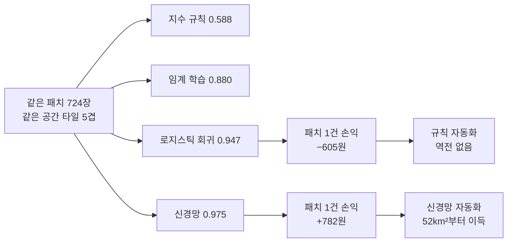

# 5장 위성영상 딥러닝, 픽셀 분류에서 도입 결정까지

> - 이 장에 나오는 정확도·Macro-F1·손익분기 면적·비용은 모두 `lecture_practice/chapter5/`의 코드를 실제로 실행해 얻은 값
> - 예시를 위해 지어낸 숫자는 없음

## 1. 이 장의 핵심 질문

- 이 장은 세 가지 질문에 답함
- **질문 1** — 위성영상 한 장은 어떻게 학습 자료가 되는가? 채널 12개짜리 입력과 라벨 724장은 어디서 나오는가?
- **질문 2** — CNN은 값싼 방법(규칙·회귀·트리)보다 정말 나은가? 그 비교를 공정하게 채점하는 방법은 무엇인가?
- **질문 3** — 정확도 0.028의 차이는 어떻게 "도입한다/안 한다"라는 결정으로 바뀌는가?

- 이 장에서 딥러닝이 처음 등장함. 그러나 이 장의 결론은 "딥러닝을 쓰라"가 아님
- **값싼 방법부터 같은 조건에서 채점하고, 격차를 비용으로 바꾼 뒤에 도입을 판정하는 절차**가 이 장의 내용임
- 핵심은 다음 한 문장 — 모델의 정확도는 끝이 아니라 중간 결과임. 그 격차가 비용으로 얼마인지까지 계산해야 결정이 나옴

## 2. 도입 사례: 토지피복 지도 한 장의 뒷면

- ESA WorldCover(https://esa-worldcover.org/en)에서 지도를 열면 전 세계가 산림·초지·경작지·시가지·수역 등 11개 클래스로 칠해져 있음. 자기 동네를 검색하면 바로 볼 수 있음
- 이 장의 실습은 이 지도에서 **춘천 의암호 일대**의 조각을 잘라 정답(라벨)으로 씀
- 지도의 색은 "이 자리가 산림"이라고 말하지만, 그 색은 2021년 한 해 위성 관측을 **다수결로 정리한 값**이지 그 자리의 절대 진실이 아님
- 실제 값과 지도 값이 벌어지는 경로가 셋 있음
  1. 지도를 만든 시점과 위성 촬영 시점이 다르면 그 사이 바뀐 곳이 어긋남
  2. 지도의 클래스 정의가 내 과제의 정의와 다르면 같은 대상을 다른 이름으로 부름
  3. 한 구역 안에 여러 피복이 섞이면 다수결이 소수 피복을 지움
- 모델은 지도 값을 정답 삼아 배우지만, 결정에 쓰고 싶은 값은 실제 값임. 이 간격은 4절(라벨 만들기)과 9절(오류의 방향)에서 다시 등장함

- 같은 영상이라도 **묻는 질문의 답 형태**에 따라 과업이 갈림
  - 답이 "예/아니오"(이 구역이 시가지인가) → **패치 분류**. 구역 하나에 클래스 하나를 붙임
  - 답이 "몇 개"(이 항만에 배가 몇 척인가) → **객체 탐지**. 개별 객체의 위치를 찾아야 함
  - 답이 "몇 ㎡"(이 동의 불투수면 면적은 얼마인가) → **세그멘테이션**. 픽셀마다 경계를 그어야 하며 6장의 몫
- 이 장은 첫 번째, **패치 한 장에 라벨 하나**를 붙이는 과업만 다룸. 두 시점을 비교해 무엇이 바뀌었는지 찾는 일도 6장의 몫

## 3. 입력 만들기: 위성영상은 12개 숫자층

- 위성영상을 보통 사진처럼 다루면 안 되는 이유부터 확인함

| 속성 | 보통 사진 | 위성영상 |
| --- | --- | --- |
| 채널 수 | 3(R·G·B) | 12(Sentinel-2 L2A) |
| 값 범위 | 0~255 | 0~10,000 이상 |
| 값의 의미 | 시각적 외형 | 파장대별 반사율 |

- Sentinel-2는 13개 밴드를 관측하지만, 대기 보정을 마친 L2A 산출물에는 지표 정보가 없는 B10이 빠져 **12개 밴드**가 제공됨. 이 장의 입력 채널이 13이 아니라 12인 이유가 이것임
- 눈에 안 보이는 밴드가 판정을 가름
  - 식생과 물을 가르려면 근적외선(NIR, B08)이 필요함 — 식생은 근적외선을 강하게 반사하고 물은 흡수함
  - 시가지와 나지를 가르려면 단파적외선(SWIR, B11·B12)이 필요함
- `5-1` 로그의 실측: RGB(3밴드)만 쓰면 Macro-F1 0.973, RGB+NIR(4밴드) 0.984, 전체 12밴드도 0.984
- **NIR 하나를 더한 것이 나머지 여덟 밴드를 다 더한 것과 같은 효과를 냄.** 대기 보정용 60m 밴드(B01·B09)는 지표 분류에 기여가 적기 때문임. 밴드는 많이 넣는 것이 아니라 판정에 쓰는 물리를 담은 것을 넣음

- 관측 단위도 여기서 정함. 이 장은 32×32 픽셀 패치를 하나의 판정 단위로 씀
  - 패치 한 변의 지상 길이 = 32픽셀 × 10m 해상도 = **320m**
  - 면적 = 320m × 320m = **0.1024km²**
- 이 숫자는 지금 정하고 끝나는 값이 아님. 10절의 원가 계산에서 판독 1건의 단가와 손익분기 면적에 그대로 곱해짐. 패치 크기를 바꾸면 성능만 바뀌는 것이 아니라 원가 구조가 함께 바뀜

## 4. 라벨 만들기: 2,318장에서 724장으로

- WorldCover 지도를 라벨로 바꾸는 절차는 다섯 단계임
  1. **정합** — 지도를 영상과 같은 좌표계·격자로 맞춤
  2. **패치 격자 생성** — 영상을 32×32로 자름
  3. **다수결 판정** — 패치 안 1,024개 픽셀 라벨의 최빈값을 그 패치의 라벨로 삼음
  4. **순도 필터** — 최빈 클래스 비율(순도)이 기준(이 실습은 0.6)에 못 미치면 버림
  5. **클래스 균형** — 클래스별 개수를 가장 적은 클래스에 맞춤

- 실측으로 따라가면(`5-1` 로그): 춘천 의암호 일대 Sentinel-2 L2A 장면(2021년 4월 7일, 구름 0.44%)에서 패치 **2,318개**를 뽑음
- 클래스별 순수 패치 수: 산림 1,508개, 시가지 380개, 수역 212개, 경작지 181개, 초지 37개
- 초지는 순수 패치가 80개 미만이라 분류 대상에서 뺌
- 남은 네 클래스를 가장 적은 경작지(181개)에 맞춰 균형을 잡아 최종 **724장**을 얻음. 공간 타일은 36개로 나눔

- 2,318장 중 724장(31%)만 남았고, 버려진 69%가 무작위가 아니라는 점이 중요함
- 균형 조정으로 잘린 산림도 있지만, **경계·혼합 구역의 패치가 순도 필터에서 함께 빠짐**
- 실제 배치에서 판정이 어려운 곳이 바로 그 경계·혼합 구역이므로, 이 자료로 잰 성능은 **실제 배치 성능의 상한에 가까움**

> - **순도 필터가 만드는 조건**
> - 순도 필터를 걸면 성능이 오르지만, 그 성능은 걸러 낸 자료 위에서만 성립함
> - 필터 기준(0.6)과 잔존 비율(31%), 제외한 클래스(초지)를 성능표와 함께 적어 둬야 함

## 5. 실습 안내

- **이 장부터 딥러닝(PyTorch)을 씀.** 실습 전에 아래 명령을 한 번 실행함(`lecture_practice/README.md` 4단계)

```bash
python lecture_practice/setup_torch.py
```

- 이 명령이 내 컴퓨터(그래픽카드 유무·운영체제)를 살펴 맞는 PyTorch 빌드를 골라 설치하고, 실제 계산을 한 번 돌려 확인까지 함. **그래픽카드가 없어도 이 장의 실습은 모두 됨** — 시간이 더 걸릴 뿐임

- 실습 코드
  - `lecture_practice/chapter5/code/5-1-cnn-sentinel2-classification.py` — 패치 추출, CNN 학습, 무작위·공간 분할 비교
  - `lecture_practice/chapter5/code/5-2-baseline-vs-cnn.py` — 저비용 기준선 4종과 CNN의 비교
  - `lecture_practice/chapter5/code/5-3-adoption-cost-breakeven.py` — 손익분기 면적과 민감도 계산
- 결과 로그: `lecture_practice/chapter5/results/*.log`
- 코드는 CPU에서 몇 분 안에 끝나도록 패치 수와 학습 에폭을 줄여 둠
- 실행 전에 4장 실습으로 내려받은 위성영상 클립이 있어야 함. 없으면 먼저 `python lecture_practice/chapter4/code/4-0-data-download.py`를 실행함

## 6. 기준선부터 채점한다

- 같은 자료에 쓸 수 있는 방법이 다섯 계열 있고, 아래로 갈수록 표현력도 비용도 늘어남

| 계열 | 무엇을 배우는가 | 계산 비용 |
| --- | --- | --- |
| 고정 임계 규칙 | 없음(문헌 값을 그대로 씀) | 0 |
| 학습된 임계 | 자를 위치 | 매우 낮음 |
| 요약 피처 + 선형·트리 | 피처 가중치 | 낮음 |
| 합성곱 신경망(CNN) | 필터 가중치 | 중간 |
| 탐지기 | 위치 + 분류 | 높음 |

- 판정 규칙은 하나임. **아래 계열이 위 계열을 못 이기면 위 계열을 씀.** 그래서 CNN을 쓰기 전에 값싼 방법부터 채점함

- 값싼 방법의 재료가 **분광지수**임. 두 밴드의 차를 합으로 나눈 값
  - NDVI = (NIR − Red) / (NIR + Red) — 클수록 식생
  - NDWI = (Green − NIR) / (Green + NIR) — 클수록 물
  - NDBI = (SWIR − NIR) / (SWIR + NIR) — 클수록 시가지·나지
- 이 형태를 쓰는 이유는 계산으로 확인됨. 장면 전체 밝기가 배수 c만큼 바뀌어도 (ca−cb)/(ca+cb) = (a−b)/(a+b)로 c가 상쇄됨. 태양각·대기 상태가 바뀌어도 지수 값은 거의 흔들리지 않음
- `5-2` 로그의 클래스별 지수 평균

| 클래스 | NDVI | NDWI | NDBI |
| --- | ---: | ---: | ---: |
| 산림 | +0.471 | −0.493 | −0.007 |
| 경작지 | +0.245 | −0.309 | +0.080 |
| 시가지 | +0.187 | −0.226 | +0.074 |
| 수역 | −0.088 | +0.282 | −0.111 |

- 수역은 세 지수 모두에서 확실히 갈리지만, **경작지와 시가지는 붙어 있음**(NDVI 0.245 대 0.187). 4월 초 촬영이라 파종 전 경작지가 나지 상태이기 때문임. 이 두 클래스가 뒤에서 계속 문제가 됨

- 같은 패치 724장, 같은 공간 타일 5겹으로 다섯 방법을 나란히 채점한 결과(`5-2` 로그)

| 방법 | Accuracy | Macro-F1 | 학습 | 파라미터 |
| --- | ---: | ---: | ---: | ---: |
| R1 고정 임계 규칙 | 0.588±0.125 | 0.514±0.037 | 0.00초 | 0 |
| R2 학습된 임계(트리) | 0.880±0.060 | 0.857±0.050 | 0.01초 | 노드 ≤15 |
| L 로지스틱 회귀 | 0.947±0.032 | 0.934±0.034 | 0.08초 | 124 |
| RF 랜덤 포레스트 | 0.935±0.044 | 0.926±0.053 | 2.31초 | 트리 300 |
| CNN SimpleCNN | 0.975±0.011 | 0.967±0.012 | 6.12초 | 96,804 |

- 이 표에서 네 가지를 읽어야 함
  1. **문헌 임계를 그대로 옮기면 무너짐.** R1은 Macro-F1 0.514로 절반 수준. 다른 지역·다른 계절에서 정한 임계값이 이 장면에는 맞지 않음
  2. **실패의 대부분은 정보 부족이 아니라 임계 부적합임.** R2는 똑같은 지수 3개를 쓰면서 자를 위치만 학습했을 뿐인데 0.514 → 0.857로 오름
  3. **피처를 늘리는 것이 모델을 키우는 것보다 앞섬.** 요약 피처 30개를 쓴 로지스틱 회귀(0.934)가 같은 피처의 랜덤 포레스트(0.926)보다 높음. 표본이 724장뿐이라 트리 앙상블의 유연성이 이득으로 이어지지 않음
  4. **CNN이 이기되 격차는 크지 않음.** Macro-F1 +0.032, Accuracy +0.028. 이 격차가 우연이 아닌지는 8절에서 확인함

- 무엇을 고를지는 다음 순서로 판정함

```
답이 개수인가?
   예 → 탐지기
   아니오 → 기준선(지수 규칙)부터 채점
             기준선이 충분한가?
                예 → 기준선 채택
                아니오 → 무엇이 부족한가?
                          임계가 안 맞음 → 임계를 학습으로
                          피처가 모자람 → 요약 피처 확장
                          픽셀 배치가 필요함 → CNN
```

**그림 5.1** 결정 형태와 기준선 성능에 따른 모델 선택

> - **성능을 시험 폴드에 맞춰 고르지 않기**
> - 하이퍼파라미터나 임계값을 시험 폴드 성능을 보고 정하면 그 폴드는 더 이상 독립적인 시험이 아님
> - 학습 폴드 안에서 내부 분할로 정하고, 시험 폴드는 마지막에 한 번만 씀

## 7. CNN은 무엇을 다르게 계산하는가

- **문제 상황**: 32×32 패치를 1,024개 숫자로 풀어 헤치면 어느 값이 어느 값 옆에 있었는지가 사라짐. 요약 피처(평균·표준편차)도 같은 문제를 가짐 — 밝은 픽셀과 어두운 픽셀이 규칙적으로 배열됐는지 뭉쳐 있는지 구분하지 못함
- **합성곱**은 이 배열 정보를 직접 읽는 연산임. 필터 하나가 하는 일은 다섯 단계임
  1. 작은 가중치 배열(필터)을 입력의 한 자리에 겹침
  2. 겹친 자리의 값과 가중치를 위치마다 곱함
  3. 곱한 값을 모두 더함
  4. 편향을 더함
  5. 활성화 함수를 통과시키고, 필터를 옆으로 옮겨 반복함
- **작은 계산 예**: 세로 경계를 찾는 필터 w=[[−1,0,+1],[−1,0,+1],[−1,0,+1]], 편향 b=−0.10을 밭과 지붕이 맞닿은 자리(반사율 [[0.12,0.14,0.38],[0.11,0.15,0.41],[0.13,0.16,0.39]])에 대면 (0.38−0.12)+(0.41−0.11)+(0.39−0.13)=0.82, 편향을 더해 0.72가 남음. 같은 필터를 균질한 밭 한가운데 대면 합이 0.02이고, 편향을 더하면 음수가 되어 ReLU가 0으로 자름
- **같은 가중치 아홉 개가 경계에서는 큰 값을, 균질한 자리에서는 0을 냄.** 필터 하나를 패치 전체에 반복해 쓰므로 파라미터 수는 패치 크기와 무관함 — 이 성질이 **가중치 공유**임
- **수용영역**: 출력 한 자리가 반영하는 입력 범위. 3×3 필터 한 층은 입력 3×3을 보고, 두 층이면 5×5, 세 층이면 7×7을 봄. 10m 해상도에서 7×7은 70m×70m로, 건물 블록 하나 정도의 맥락에 해당함. 층을 쌓을수록 더 넓은 무늬를 읽음

- CNN의 이 성질이 실측에서 어디에 나타나는지 확인함. CNN 대 로지스틱 회귀의 클래스별 F1(`5-2` 로그)

| 방법 | 산림 | 경작지 | 시가지 | 수역 |
| --- | ---: | ---: | ---: | ---: |
| L 로지스틱 회귀 | 0.967 | 0.916 | 0.926 | 0.981 |
| CNN | 0.980 | 0.959 | 0.967 | 0.995 |

- 수역은 두 방법 모두 0.98 이상이라 얻을 게 없음. 산림도 로지스틱 회귀가 이미 0.967
- CNN이 버는 몫은 **경작지(0.916→0.959)와 시가지(0.926→0.967)에 몰림.** 6절에서 분광지수가 붙어 있던 바로 그 두 클래스임
- 분광 평균이 비슷할 때 남는 단서는 픽셀의 배치(질감)임. 규칙적인 건물 블록과 균질한 밭은 평균 밝기가 비슷해도 무늬가 다른데, 평균·표준편차로 요약하는 순간 그 무늬는 사라짐. CNN의 필터는 이 무늬를 직접 읽음
- **CNN이 필요한 조건이 여기서 정리됨** — 분광값(색)만으로 갈리는 클래스에는 값싼 방법으로 충분하고, 픽셀 배치까지 봐야 갈리는 클래스가 있을 때 CNN이 값을 함

## 8. 공간 교차검증: 채점을 공정하게

- 패치를 무작위로 5등분하면 같은 타일에서 잘라 낸 이웃 패치가 학습과 검증에 갈라져 들어감
- 이웃 패치는 촬영 시각·태양각·지역 특성을 공유하므로, 이 방법이 재는 것은 "새 지역을 맞히는 능력"이 아니라 "이미 본 지역의 옆 칸을 맞히는 능력"임
- 대응은 검증 단위를 패치가 아니라 **타일**로 올리는 것

```python
# 공간 분할: 타일 ID를 그룹으로 묶어, 검증 타일은 학습에서 통째로 제외
block_cv = GroupKFold(n_splits=min(5, N_TILES))
block_cv.split(range(len(dataset)), groups=all_tile_ids)
```

_전체 코드는 lecture_practice/chapter5/code/5-1-cnn-sentinel2-classification.py 참고_

- 이 실습은 타일 36개를 5겹으로 나눔. 폴드마다 타일 7~8개가 검증으로 통째로 빠짐

- 채점에는 지표 두 개를 함께 씀
  - Accuracy = 전체 중 맞힌 비율. 표본이 많은 클래스가 값을 좌우함
  - **Macro-F1** = 클래스마다 F1을 구해 클래스 수로 단순 평균. 표본이 적은 클래스도 같은 무게로 반영됨
- 시험표본 143장(산림38·경작지37·시가지18·수역50)에서 시가지 2건만 바로잡으면
  - Accuracy: 140/143=0.979 → 142/143=0.993 (+0.014)
  - Macro-F1: 0.974 → 0.993 (+0.019)
- 같은 오분류 2건인데 Macro-F1이 더 크게 움직임. 시가지는 표본의 12.6%뿐인데 Macro-F1에서는 25%의 무게를 받기 때문임. **표본이 불균형하면 두 지표를 함께 봐야 함**

- 무작위 분할과 공간 분할을 실제로 비교한 결과(`5-1` 로그)

| 검증 설계 | Accuracy | Macro-F1 |
| --- | ---: | ---: |
| 무작위 5겹 교차검증 | 0.964 ± 0.012 | 0.964 ± 0.013 |
| 공간 타일 교차검증 | 0.971 ± 0.012 | 0.965 ± 0.011 |
| 차이(무작위 − 공간) | −0.007 | −0.001 |

- 무작위 분할이 더 높게 나올 것으로 예상되는데 오히려 낮음. 이 값을 그대로 "공간 분할이 더 낫다"로 읽으면 안 됨
- 폴드 간 표준편차가 ±0.011~0.013인데 재려는 차이는 −0.007과 −0.001임. **재려는 차이가 측정 자체의 흔들림보다 작음.** 재실행할 때마다 값이 흔들리는 폭을 **잡음 바닥**이라 부름
- 시드를 바꿔 세 번 더 돌린 결과

| 시드 | 무작위 Acc | 공간 Acc | 무작위 F1 | 공간 F1 | 과대추정 Acc | 과대추정 F1 |
| ---: | ---: | ---: | ---: | ---: | ---: | ---: |
| 0 | 0.967 | 0.967 | 0.967 | 0.956 | −0.000 | +0.011 |
| 1 | 0.967 | 0.970 | 0.967 | 0.962 | −0.003 | +0.004 |
| 2 | 0.968 | 0.968 | 0.968 | 0.959 | −0.000 | +0.008 |

- 과대추정 Accuracy는 −0.003~−0.000, Macro-F1은 +0.004~+0.011. **두 지표가 반대 부호를 가리킴**
- 이럴 때는 어느 쪽이 낫다고 말하지 않고 **"이 과제에서는 과대추정이 검출되지 않았다"**고 읽음
- 이유는 자료 성격에 있음. 순도 필터로 뚜렷한 패치만 남겼으므로 처음 본 타일에서도 잘 맞음. 그래도 실무 규칙은 바뀌지 않음 — 과대추정이 있을지 없을지는 미리 알 수 없으므로 **공간 분할 성능을 항상 함께 보고함**

> - **소수점 셋째 자리는 시드로 뒤집힘**
> - 이 실습의 과대추정 Macro-F1은 네 번의 실행에서 −0.000~+0.011 사이를 오감
> - 방향을 보고하기 전에 시드 3개 이상으로 재실행해 그 폭과 비교하고, 폭보다 작으면 "검출되지 않았다"로 적음

- 같은 잣대를 6절의 CNN 대 기준선 격차에도 대야 함. CNN Macro-F1 0.967, 최고 기준선(로지스틱 회귀) 0.934, 격차 +0.032
- CNN을 시드 3개로 돌린 Macro-F1 범위는 0.963~0.967(폭 0.004)이고, 폴드별 격차는 +0.077, +0.001, +0.029, +0.018, +0.036 — **다섯 폴드 모두 양수**
- 폴드 하나(+0.001)만 보면 잡음 바닥(0.004)보다 작아 보이지만, 다섯 폴드 전부가 같은 방향이라는 점이 이 차이를 신뢰할 근거가 됨. 무작위 대 공간 비교가 부호조차 신뢰할 수 없었던 것과 대비됨
- **같은 "작은 차이"라도 하나는 결론이 되고 하나는 안 됨.** 그 판정을 가른 것은 차이의 크기가 아니라 잡음 바닥·부호 일관성과의 비교였음

## 9. 오류의 방향: 재현율 0.889가 만드는 편의

- 시험표본 143장의 클래스별 성능(`5-1` 로그)

| 클래스 | 정밀도 | 재현율 | F1 | 표본 수 |
| --- | ---: | ---: | ---: | ---: |
| 산림 | 0.974 | 1.000 | 0.987 | 38 |
| 경작지 | 1.000 | 0.973 | 0.986 | 37 |
| 시가지 | 1.000 | 0.889 | 0.941 | 18 |
| 수역 | 0.962 | 1.000 | 0.980 | 50 |

- 시가지만 F1이 0.95 아래(0.941)임. 정밀도는 1.000(시가지라고 부른 건 다 맞음), 재현율은 0.889(실제 시가지 18장 중 2장을 놓침)
- **놓치는 쪽으로만 틀림.** 이 방향이 문제가 됨
- 이 모델의 결과를 세어 지역 통계를 만들면 — 실제 시가지 패치 100장이 있는 구역에서 모델은 약 89장만 시가지로 부름. **그 구역의 시가지 비율은 실제보다 약 11% 낮게 산출됨**
- 이 값을 침수 위험 평가에 넣으면 위험이 체계적으로 낮게 나옴. 지도 위에서는 이 오차가 보이지 않음 — 89장이 칠해진 지도는 그 자체로 이상해 보이지 않고, 누락된 11장은 이웃 클래스로 자연스럽게 칠해짐
- **정확도 0.975라는 총점 뒤에 방향이 있는 오류가 숨어 있음.** 결과를 통계로 보고할 때는 클래스별 정밀도·재현율을 함께 실어야 이 편의를 읽을 수 있음

> - **자동 산출은 후보 목록이지 확정 근거가 아님**
> - 불법 건축 단속처럼 제재로 이어지는 판정에는 이 결과를 현장 확인 대상의 후보 목록으로만 씀

## 10. 성능 격차를 손익으로 바꾼다

### 10.1 정확도 0.028이 결정할 수 있는 것은 없다

- 지금까지 얻은 값은 "CNN이 로지스틱 회귀보다 Accuracy를 0.028 더 낸다"임
- 이 문장만으로는 아무것도 못 정함. 어느 기관도 "정확도를 2.8%p 올리는 것" 자체를 사업 목표로 삼지 않음
- 필요한 건 컷라인임. **판독 면적이 얼마를 넘으면 CNN이 개발 비용을 갚는가**

### 10.2 세 경로와 비용 파라미터

- 어느 조직이 관할 구역의 토지피복을 주기적으로 판독해 용도 변경 후보를 걸러 낸다고 가정함. 판독 단위는 3절에서 정한 0.1024km²
- **경로 A 사람 판독** — 초기 비용 없음, 인건비가 매 주기 그대로 듦
- **경로 B 지수 규칙 자동화** — 개발이 쌈, 대신 오분류가 많아 후속 비용이 듦
- **경로 C CNN 자동화** — 개발·라벨이 비쌈, 대신 오분류가 가장 적음

- 값의 출처를 셋으로 나눠 적음. `[검증값]`은 출처가 있는 수치, `[산출값]`은 검증값에서 계산한 값, `[가정]`은 근거를 못 찾아 정한 값

| 파라미터 | 값 | 등급 |
| --- | ---: | --- |
| 판독 단위 면적 | 0.1024km² | [산출값] |
| IT 인력 일평균임금 | 245,535원 | [검증값] (KOSA 2025 적용 공표, IT지원기술자 직군) |
| 시간당 인건비 | 30,692원 | [산출값] |
| Sentinel-2 영상비 | 0원 | [검증값] (Copernicus 개방) |
| 판독 1건 소요 | 2.0분 | [가정] |
| 사람 판독 정확도 | 0.980 | [가정] |
| 오분류 1건 처리비 | 50,000원 | [가정] |
| 라벨 1장 단가 | 1,500원 | [가정] |
| 구축 인일(규칙/CNN) | 3일/15일 | [가정] |

- 인건비는 `[검증값]`이지만 IT 인력 단가를 판독원 직군에 대신 쓴 값임. **출처 있는 값을 다른 직군에 옮겨 쓴 것 자체가 하나의 가정**이므로 뒤에서 함께 흔들어 봄

### 10.3 건당 손익과 손익분기 면적

- 계산의 뼈대는 한 줄임. **자동화는 인건비를 아끼는 대신 오분류 비용을 더 냄**

```python
def cycle_cost(area_km2, acc, per_patch_labor, img_krw_per_km2, cost_err):
    """주기 1회 비용 = 인건비 + 영상비 + 오분류 처리비"""
    n = area_km2 / PATCH_KM2
    return n * per_patch_labor + area_km2 * img_krw_per_km2 + n * (1 - acc) * cost_err
```

_전체 코드는 lecture_practice/chapter5/code/5-3-adoption-cost-breakeven.py 참고_

- 판독 1건을 자동화하면 절감 인건비 = (2.0÷60)×30,692 = **1,023원**
- 대신 사람(정확도 0.980)보다 더 틀리는 만큼 처리비를 냄. 로그의 값: 규칙(정확도 0.947)의 추가 오분류비는 **1,628원**, CNN(정확도 0.975)은 **241원**
- 건당 순손익 = 절감 인건비 − 추가 오분류비. 규칙은 1,023−1,628=**−605원**, CNN은 1,023−241=**+782원**
- **부호가 갈림.** 규칙은 건마다 손해, CNN은 건마다 이득임. 건마다 손해면 면적을 아무리 늘려도 개발비를 갚을 수 없음(역전 없음)

- 손익분기 면적(`5-3` 로그)

| 반복 주기 | 사람→규칙 | 사람→CNN | 규칙→CNN |
| ---: | ---: | ---: | ---: |
| 연 1회 | 역전 없음 | 624.65km² | 297.76km² |
| 연 4회 | 역전 없음 | 156.16km² | 74.44km² |
| 연 12회 | 역전 없음 | 52.05km² | 24.81km² |
| 연 52회 | 역전 없음 | 12.01km² | 5.73km² |

- CNN은 연 12회 기준 **52.05km²부터** 비용을 갚음. 기초자치단체 하나가 대체로 수백km² 규모이므로 월 1회 판독하는 조직 하나면 이 컷라인을 넘음
- **판정을 가른 것은 자동화 여부가 아니라 정확도 0.947과 0.975의 차이임.** 그 0.028이 자동화를 손해에서 이득으로 뒤집음. 6절의 "격차는 크지 않음"이 여기서 "손익의 부호를 가르는 격차"로 바뀜

- 6절의 성능 비교가 이 절의 도입 판정으로 이어지는 경로



**그림 5.2** 성능 비교에서 도입 판정까지 (연 12회 반복, 오분류 처리비 5만원 가정)

### 10.4 어느 값에서 판정이 뒤집히는가

- `[가정]`이 넷이므로 결론이 그 값에 얼마나 매달려 있는지 확인함

| 파라미터 | 값 | 사람→규칙 | 사람→CNN | 규칙→CNN |
| --- | ---: | ---: | ---: | ---: |
| 기준 | — | 역전 없음 | 52.1km² | 24.8km² |
| 오분류 처리비 | 10,000원 | **9.0km²** | 41.7km² | 124.1km² |
| 오분류 처리비 | 500,000원 | 역전 없음 | **역전 없음** | 2.5km² |
| 판독 1건 소요 | 0.5분 | 역전 없음 | 2,805.9km² | 24.8km² |
| 판독 1건 소요 | 5.0분 | **6.8km²** | 17.6km² | 24.8km² |

- **오분류 처리비가 1만원이면 규칙도 이득으로 돌아섬.** 오류가 싸게 처리되는 업무(통계 집계용 비율처럼 개별 오분류가 평균에 묻히는 경우)라면 규칙으로 충분함
- **처리비가 50만원이면 CNN조차 사람을 못 이김.** 오류 하나가 행정처분·소송으로 이어지는 업무가 여기 해당하고, 그때 답은 더 정확한 모델이 아니라 사람임
- **판독이 0.5분이면 CNN의 손익분기가 2,805.9km²로 밀림.** 판정이 쉬워 사람이 빨리 훑는 업무에서는 자동화 이득이 거의 없음
- 같은 모델, 같은 정확도인데 업무의 성격(가정 값)에 따라 도입 판정이 세 방향으로 갈림. **정확도보다 센 값이 존재함**

- 답을 아는 극단값으로 계산이 부호를 잃지 않는지 확인함(퇴화 검사)
  - CNN 정확도를 기준선과 같은 0.947로 두면 → 역전 없음(성능이 같은데 개발비만 더 드는 경로이므로 정상)
  - 오분류 처리비를 0원으로 두면 → 역전 없음(틀려도 비용이 없으면 정확도를 살 이유가 없으므로 정상)
  - 사람 인건비를 0원으로 두면 → 역전 없음(공짜 인력이 더 정확하면 자동화할 이유가 없으므로 정상)

- 이 계산이 증명하는 것과 못하는 것을 구분함
  - **증명하는 것**: 성능 격차를 비용으로 바꾸는 절차와 그 절차가 만드는 컷라인. 붙어 보이는 두 정확도(0.947과 0.975)가 손익에서는 부호를 가른다는 것
  - **못하는 것**: 실제 조직의 도입 비용. 파라미터 넷이 `[가정]`이고 인건비도 대리 직군 단가임. 52.05km²를 특정 사업 예산 근거로 옮기면 안 됨. 절차를 가져가고 값은 자기 조직에서 다시 잼

## 11. 핵심 요약

- **위성영상은 12개 숫자층이고, 밴드는 물리로 고름.** 눈에 안 보이는 NIR 하나를 더하면 Macro-F1이 0.973→0.984로 오르고, 나머지 여덟 밴드는 그만큼의 기여가 없음. 관측 단위(32픽셀×10m=320m, 0.1024km²)는 성능이 아니라 원가 계산까지 이어지는 결정 (3절)
- **라벨은 지도의 다수결이지 진실이 아님.** 순도 필터를 거쳐 2,318장 중 724장(31%)만 남았고, 걸러진 것이 경계·혼합 구역이므로 이 성능은 실제 배치 성능의 상한에 가까움. 필터 기준과 잔존 비율을 성능표와 함께 적음 (4절)
- **CNN 전에 값싼 방법부터 같은 조건에서 채점함.** 고정 임계 0.514 → 임계만 학습 0.857 — 실패의 대부분은 정보 부족이 아니라 임계 부적합. 아래 계열이 위 계열을 못 이기면 위 계열을 씀 (6절, 그림 5.1)
- **CNN은 픽셀의 배치(무늬)를 읽는 모델.** 같은 필터를 모든 자리에 반복해 쓰므로(가중치 공유) 경계에서 큰 값, 균질한 자리에서 0을 냄. 실측에서 CNN의 이득은 분광지수가 붙어 있던 경작지(0.916→0.959)·시가지(0.926→0.967)에 몰림 — 색으로 안 갈리고 무늬로 갈리는 클래스가 있을 때 CNN이 값을 함 (7절)
- **채점은 공간 타일 단위로 나눠서 함.** 무작위 분할은 이웃 패치를 학습·검증 양쪽에 넣어 "본 동네의 옆 칸" 실력을 잼. 이 실습에서는 과대추정이 검출되지 않았지만, 미리 알 수 없으므로 공간 분할 성능을 항상 함께 보고함 (8절)
- **잡음 바닥보다 작은 차이는 결론이 아님.** 시드를 바꾸면 부호가 뒤집히는 차이(무작위 대 공간)는 "검출되지 않음"으로 적고, 다섯 폴드 전부 같은 방향인 차이(CNN 대 기준선 +0.032)는 신뢰함 (8절)
- **총점 뒤에 방향이 있는 오류가 숨음.** 시가지는 정밀도 1.000, 재현율 0.889로 놓치는 쪽으로만 틀리므로, 지역 통계의 시가지 비율이 약 11% 낮게 나옴. 클래스별 정밀도·재현율을 함께 보고해야 이 편의를 읽음 (9절)
- **격차는 비용으로 바꿔야 결정이 됨.** 건당 순손익이 규칙 −605원, CNN +782원으로 부호가 갈리고, CNN은 연 12회 판독 기준 52.05km²부터 개발비를 갚음. 정확도 0.028이 손익의 부호를 가름 (10절, 그림 5.2)
- **결론은 가정 값에 매달려 있음.** 오분류 처리비가 1만원이면 규칙도 이득, 50만원이면 CNN조차 사람을 못 이김. 절차를 가져가고 값은 자기 조직에서 다시 재며, 52.05km²를 예산 근거로 옮기지 않음 (10.4절)

## 12. 과제

- 이번 장의 과제는 **직접 돌려 보고, 그 결과로 판단하는 것**
- 명령 한 줄이면 제출할 파일이 생성됨

```bash
python scripts/submit.py 5 --id 학번 --name 이름
```

- 이 명령이 대신 처리하는 작업: 4장 실습 데이터 준비(`4-0-data-download.py`), 대표 실습 `5-2-baseline-vs-cnn.py` 실행, 제출용 파일 생성
- 끝나면 `submissions/` 폴더에 `제출_5장_학번.md` 파일이 생김
- 열어 보면 실행 결과가 이미 붙어 있음. **눈여겨볼 곳은 값싼 기준선과 CNN의 정확도 차이, 그리고 그 차이의 흔들림 폭**

- 맨 아래 빈칸 세 개를 채우면 됨

1. 눈에 띈 숫자 하나를 그대로 옮겨 적고, 왜 눈에 띄었는지 한 문장으로
2. 그 숫자가 왜 그렇게 나왔는가
3. **이 정확도 차이만 보고 딥러닝 도입을 결정할 수 있는가? 결정을 뒤집을 수 있는 값을 하나 들고, 왜 그것이 정확도보다 센지 말하라**

- **3번이 이 과제의 핵심.** 1·2번은 결과를 들여다보면 답이 나오지만 3번은 10.4절의 판단이 필요함
- 과제의 핵심은 숫자 산출이 아니라 그 숫자를 근거로 판단하는 능력

- 채운 파일 **하나만** 올리면 제출이 끝남

> - **막혀도 제출함**
> - 실행이 도중에 실패하면 오류 메시지가 그 파일에 자동으로 담기고, 질문이 "어디서 막혔나"로 바뀜
> - 어디서 왜 막혔는지 적은 제출도 온전한 제출. 실행 성공 여부로 점수를 매기지 않음

> - **이 장의 CNN 실습은 재실행마다 소수점 셋째 자리가 흔들림**
> - 가중치 초기화와 연산 순서가 완전히 고정되지 않기 때문임. 8절의 잡음 바닥 절차(시드 여러 개로 재실행)가 바로 이 문제에 대응하는 방법임
