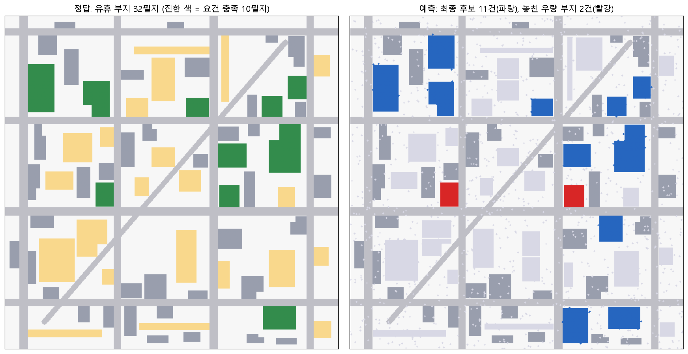

# 6장 영역 추출과 변화 탐지, 마스크에서 결정까지

> - 이 장에 나오는 IoU·정밀도·재현율·면적·필지 수는 모두 `lecture_practice/chapter6/`의 코드를 실제로 실행해 얻은 값
> - 예시를 위해 지어낸 숫자는 없음

## 1. 이 장의 핵심 질문

1. **픽셀마다 붙인 답(마스크)을 어떻게 채점하는가.** 그리고 뒤에 붙이는 필터는 무엇을 올리고 무엇을 못 올리는가
2. **마스크를 개체 목록으로 바꿔 면적·최소폭·접도 요건으로 거르는 계산은 어떤 순서로 하는가**
3. **마스크의 오차에는 방향이 있다.** 그 편향이 후보 목록을 어떻게 뒤집으며, 어디까지 되돌릴 수 있는가

□ 5장에서 다룬 영상 분류는 "이 패치는 산림이다"라는 답 하나를 냄  
  ○ 이 장의 세그멘테이션은 픽셀마다 답을 붙여 "산림이 몇 헥타르이고 경계가 어디인가"에 답함  
  ○ 변화 탐지는 같은 계산을 두 시점에 걸쳐 해서 "무엇이 달라졌는가"에 답함  

○ 셋의 산출물은 모두 **마스크**, 즉 대상 픽셀에 1을 채운 격자임. 마스크 자체는 아직 행정이나 사업의 결정 단위가 아니므로, 구역별 면적·객체 목록·후보표로 옮기는 계산이 뒤따름  

## 2. 도입 사례: 필터 하나가 정밀도를 0.572에서 1.000으로 올린다

□ 광역지자체가 관내 보호구역의 무단 훼손을 점검하는 상황임. `6-1-change-detection-policy.log`의 실제 실행 결과로 시작함  
  ○ 무대: 128×128 래스터, 픽셀 한 변 10m, 픽셀 하나가 0.01헥타르  
  ○ 진짜 변화 픽셀 2,001개, 모델이 예측한 변화 픽셀 3,022개 — 정답보다 51% 많음  

○ 필터를 걸기 전과 후를 나란히 놓으면 다음과 같음  

| 단계 | IoU | 정밀도 | 재현율 | Dice |
| --- | ---: | ---: | ---: | ---: |
| 필터 전 | 0.525 | 0.572 | 0.865 | 0.689 |
| 필터 후 | 0.865 | 1.000 | 0.865 | 0.927 |

□ 필터는 두 규칙임 — 식생지수 차분이 0.25를 넘는 픽셀만 남기고, 연결된 덩어리가 1헥타르(100픽셀) 미만이면 지움  
  ○ 읽는 법: **정밀도**는 "변화라고 판정한 것 중 진짜의 비율", **재현율**은 "진짜 변화 중 잡아낸 비율"임  
  ○ **정밀도만 0.572에서 1.000으로 오르고 재현율은 0.865에서 그대로임.** 이 비대칭이 우연이 아니라는 것을 7절에서 계산으로 확인함  

○ 필터를 거친 마스크를 16개 구역(4×4 격자)에 포개면 15개 구역에서 변화가 잡히고 합계 17.3헥타르가 나옴. 상위 5구역은 다음과 같음  

| 순위 | 구역 | 변화 면적(ha) |
| ---: | ---: | ---: |
| 1 | 구역 9 | 2.93 |
| 2 | 구역 10 | 2.47 |
| 3 | 구역 13 | 2.30 |
| 4 | 구역 6 | 1.78 |
| 5 | 구역 15 | 1.41 |

○ "픽셀 3,022개가 변했다"는 담당 부서를 정하지 못하지만, "구역 9에서 2.93헥타르가 개발되었고 관내 최대"는 점검반의 방문 순서를 정함  
○ 이 장은 이 두 계산 — **채점해서 걸러 내기**, **구역별로 모아 순서를 매기기** — 을 어떤 절차로 하는지, 그리고 대상이 픽셀이 아니라 개별 필지일 때 무엇이 달라지는지를 다룸  

## 3. 무엇을 만들 것인가 정하기

### 3.1 과업 유형

○ 주택가 사진 한 장을 놓고도 답의 층위가 갈림  

| 과업 | 한 입력에 대한 답 | 답할 수 있는 질문 |
| --- | --- | --- |
| 시맨틱 세그멘테이션 | 픽셀마다 클래스 1개 | 산림이 몇 헥타르이고 경계가 어디인가 |
| 인스턴스 세그멘테이션 | 개체마다 마스크 1개 | 각 건물의 면적과 형상은 얼마인가 |
| 파놉틱 세그멘테이션 | 픽셀당 클래스 + 개체 식별자 | 개체와 배경을 한 지도에서 같이 다룰 수 있는가 |
| 변화 탐지 | 픽셀당 변화 여부 | 두 시점 사이 어디가 달라졌는가 |

□ **변화 탐지는 별도 계열이 아니라 두 시점을 입력으로 받는 세그멘테이션**임. 계산의 뼈대는 같고 달라지는 지점이 둘 있음  

  1. 두 시점이 같은 좌표 격자에 포개지지 않으면 경계선을 따라 가짜 변화가 생기므로 정합이 0단계가 됨(4.2)
  2. 검증 지표의 우선순위가 반대로 놓일 수 있음. 재난 피해 평가에서는 놓친 피해가 비용이 크고, 단속 행정에서는 잘못 잡은 변화가 비용이 큼(7.2)

### 3.2 산출 단위를 착수 시점에 정한다

□ 픽셀 마스크에서 끝낼지, 개체 목록까지 갈지, 구역 집계까지 갈지를 미리 정함  
  ○ 이유: 필요한 라벨 형식과 이후 계산이 완전히 달라지기 때문임  

| 산출 단위 | 필요한 층위 | 주의할 점 |
| --- | --- | --- |
| 픽셀(면적 합계) | 시맨틱만으로 충분 | 픽셀 크기에서 면적으로 환산 |
| 개체(면적·형상) | 인스턴스, 또는 시맨틱 + 연결요소 | 맞닿은 개체가 하나로 묶임 |
| 구역(집계표·우선순위) | 시맨틱으로 충분 | 구역 경계를 무엇으로 잡느냐가 순위를 바꿈 |

○ 개체가 조밀하게 붙은 도심에서는 "시맨틱 마스크 + 연결요소"로 인스턴스를 대신하는 방법이 성립하지 않음. 맞닿은 두 건물이 한 덩어리로 묶여 버림  
○ 2절의 사례는 산출 단위가 구역이었으므로 개체 단위 계산이 필요 없었음. 11절의 부지 탐색은 산출 단위가 개체이므로 8·9절의 계산이 전부 필요함  

### 3.3 마스크로 답할 수 없는 질문도 있다

□ 세그멘테이션이 재는 것은 면적과 형상, 즉 "무엇이 거기 있는가"임. "그것이 얼마의 값을 갖는가"의 정보가 아님  
  ○ 위성영상에서 건물 윤곽을 대량으로 뽑을 수 있게 되자 그 면적·형상으로 부동산 가치를 예측하려는 시도가 있었음  
  ○ 실제 감정에서 가격을 지배하는 신호는 인근의 최근 실거래가이며, 같은 면적의 건물도 두 블록 떨어지면 값이 갈림. 그 차이는 학군·임차인 구성·권리관계처럼 영상에 기록되지 않는 조건에서 옴  

○ 그래서 이 장은 영상 피처로 가치를 예측하는 예제를 두지 않고, **마스크에서 바로 계산되는 질문**을 다룸 — 개발할 수 있는 땅이 어디 남았는가. 면적·최소폭·접도 길이는 모두 마스크에서 직접 나오고, 개발 요건은 이 세 값에 대한 부등식으로 적힘  

## 4. 입력 자료가 조건을 통과하는지 확인하기

### 4.1 대상이 몇 픽셀인가

□ 픽셀 크기 g와 대상의 대표 폭 w에서 대상의 픽셀 폭은 w/g로 계산함  
  ○ 폭 12m 주택은 10m 격자에서 1.2픽셀, 0.5m 항공영상에서 24픽셀임. 같은 대상이지만 다른 과제임  
  ○ 1.2픽셀 대상은 경계 오차 한 겹이 대상 전체를 지우거나 두 배로 만듦  

□ **면적 오차의 하한도 이 계산에서 나옴.** 경계 한 겹의 오차가 바꾸는 픽셀 수는 대략 둘레만큼이므로, 상대 오차는 둘레 ÷ 면적임  
  ○ 정사각형이면 4s/s² = 4/s이므로 **한 변의 길이만으로 정해짐**  
  ○ 한 변 100m면 4%, 한 변 32m면 12.5%  

○ 면적을 5% 이내로 재야 한다면 대상의 한 변이 픽셀 크기의 80배 이상이어야 함. 이 계산을 착수 시점에 해 두면 해상도가 부족한 자료로 시작했다가 끝에 가서 면적 오차를 발견하는 일을 피함  

| 픽셀 크기 | 대상 | 픽셀 폭 | 판정 |
| --- | --- | ---: | --- |
| 10m | 주택 12m | 1.2 | 개별 계측 불가, 구역 집계만 가능 |
| 10m | 개발 패치 200m | 20 | 구역 면적 집계에 사용 가능 |
| 1m | 필지 34m | 34 | 개별 계측 가능, 면적 편향 보정 필요 |
| 0.5m | 주택 12m | 24 | 개체 검출 가능, 경계 정밀도 확인 필요 |

○ 이 4/s 관계는 9절에서 다시 나옴. 같은 침식 깊이라도 작은 필지가 상대적으로 더 많이 깎이는 이유가 여기에 있음  

### 4.2 두 시점이 같은 격자에 포개져 있는가

□ 위성은 촬영마다 궤도와 자세가 미세하게 달라, 기하보정 후에도 두 시점이 몇 픽셀 어긋날 수 있음  
  ○ 어긋난 채 차분하면 건물 가장자리·도로변·하천변을 따라 값이 크게 달라지고 이 픽셀들이 변화로 판정됨. 건물은 그대로인데 지붕 경계가 한 픽셀 밀려 변화로 잡히는 형태임  
  ○ 변화 탐지의 0단계는 두 시점을 같은 좌표 격자에 포개는 **시점 정합**(co-registration)이고, 2장에서 다룬 좌표계와 정합 품질이 여기서 판정 기준이 됨  

> **주의.** 시점 정합 오차는 지표를 정상으로 보이게 함. 두 시점이 한 픽셀 어긋나면 모든 경계를 따라 가짜 변화 띠가 생기는데, 이 띠는 면적이 작아 전체 IoU를 크게 떨어뜨리지 않음. 변화 마스크가 선형 띠 모양으로 나타나는지 육안으로 확인하고, 어긋남이 의심되면 정합을 다시 한 뒤 지표를 읽음.

### 4.3 거짓 변화를 거르는 규칙

□ 정합을 맞춰도 지표가 변하지 않았는데 값이 달라지는 경우가 남음. 구름과 그림자가 지표를 가리면 밝기가 급변하고, 여름 녹음과 겨울 나지는 같은 산림인데 값이 다름. 이런 값 변화를 **거짓 변화**(false change)라 함  
  ○ 대응은 순서대로 쌓음. 앞의 규칙이 뒤의 규칙이 다룰 자료를 정리해 주기 때문임  

| 순서 | 대응 | 제거하는 원인 |
| ---: | --- | --- |
| 1 | 대기보정 영상 사용 | 대기 상태 차이 |
| 2 | 구름·그림자 마스크 | 구름과 그림자 |
| 3 | 지수 차분 임계 | 계절 변동, 관측 잡음 |
| 4 | 최소 면적 필터 | 점점이 흩어진 오탐 |

○ 2절의 실습은 3·4단계만 적용한 결과였음  
○ 두 값은 자료의 성질에서 나옴. 식생지수 차분 임계 0.25는 진짜 개발이 식생지수를 크게 떨어뜨린다는 성질에서, 최소 면적 1헥타르는 개발이 덩어리로 일어나고 잡음은 흩어진다는 성질에서 정한 값임  
○ 두 값을 정한 뒤에는 7.3처럼 필터 전후의 정밀도·재현율로 효과를 측정해 확정함  

## 5. 마스크는 어디서 오는가

○ 실습에서는 마스크를 미리 만들어 둔 자료에서 불러오지만, 그 마스크가 어떤 계산에서 나오는지 알아야 오차의 방향(9절)을 이해할 수 있음  

□ **문제 상황.** 10m 격자 위성영상에서 관내 산림 면적을 헥타르 단위로 집계해야 함. 5장의 패치 분류는 패치 한 장에 답 하나만 내므로, 패치 안에 산림과 나지가 섞여 있으면 비율을 알 수 없음. 경계가 어느 픽셀인지 모르면 면적을 셀 수 없음  
  ○ 픽셀마다 답을 내려면 출력의 크기가 입력과 같아야 함. 그런데 5장에서 본 합성곱 신경망은 **풀링을 지날 때마다 해상도를 절반으로 줄임.** 그대로 두면 출력이 입력보다 작아짐  

□ U-Net(Ronneberger 외, 2015)은 이 문제를 인코더-디코더 두 부분으로 나눠 풂  
  ○ **인코더**는 해상도를 줄이면서(풀링) 의미를 압축함  
  ○ **디코더**는 해상도를 되돌리면서(업샘플) 클래스 지도를 복원함  
  ○ 인코더의 얕은 층 특징을 같은 해상도의 디코더 층에 그대로 이어 붙이는 통로가 **스킵 연결**(skip connection)임  

□ 스킵 연결이 왜 필요한지는 그것을 끊었을 때 남는 값으로 확인함  
  ○ 4단계까지 풀링하면 특징 한 화소가 담당하는 지상 영역이 8×8픽셀임  
  ○ 10m 격자에서는 80m×80m이고, **이보다 작은 경계는 위치를 특정할 수 없음**  
  ○ 업샘플은 해상도를 되돌리지만 줄이는 과정에서 버린 세부를 복원하지는 않음. 스킵 연결이 얕은 층의 위치 정보를 다시 공급해 이 하한을 끌어내림  


**그림 6.1** U-Net의 구조. 왼쪽 아래로 내려가는 인코더는 `pool`을 지날 때마다 해상도가 절반이 되고, 오른쪽 위로 올라가는 디코더는 `up`으로 해상도를 되돌림. 아래로 갈수록 상자가 납작하고 두꺼워지는 것은 공간 해상도가 줄고 채널 수가 느는 상태임. 붉은 점선 두 개가 스킵 연결이며, 같은 해상도였던 인코더 특징을 건너편 디코더에 그대로 이어 붙임

○ **이 구조가 이 장의 오차와 이어짐.** 해상도를 줄였다 되돌리는 과정에서 경계의 위치 정보가 흐려지고, 그 결과 예측 마스크의 가장자리가 실제보다 안쪽으로 깎임. 이것이 9절에서 다룰 **경계 침식**이며, 이 장에서 가장 큰 영향을 미치는 오차임  

## 6. 실습 안내

□ 실습 코드  
  ○ `lecture_practice/chapter6/code/6-1-change-detection-policy.py` — 변화 마스크 채점·거짓 변화 필터링·구역 집계  
  ○ `lecture_practice/chapter6/code/6-2-site-sourcing.py` — 개발 가능 부지 탐색, 객체화·기하 피처·편향 보정·절단선 계산  
  ○ 데이터 준비 스크립트(`6-0-simdata-prep.py`, `6-0b-site-simdata-prep.py`)는 시뮬레이션 자료를 만들어 두는 역할이며, 두 실습을 실행하기 전에 한 번 돌려야 함  
□ 결과 로그: `lecture_practice/chapter6/results/*.log`, `*.csv`, `6-2-site-sourcing-map.png`  

○ 이 장의 실습은 GPU가 필요 없음  
○ 실제 모델(U-Net 같은)을 학습하는 대신, **그 모델이 냈을 법한 출력(변화 마스크·부지 마스크)을 미리 만들어 둔 자료에서 불러옴.** 이 장의 계산 대상은 모델 내부가 아니라 마스크를 채점·필터·집계·보정하는 절차임  
○ 두 준비 스크립트는 매번 같은 시드로 자료를 만들므로 값이 사람마다 같아야 정상임  

## 7. 마스크를 채점하기

□ 검증은 두 층위로 나눔 — 픽셀 단위 채점(마스크가 정답과 얼마나 겹치는가)과 객체 단위 채점(개체를 몇 개 찾았고 각 개체의 면적을 얼마나 정확히 쟀는가)  
  ○ 어느 층위를 쓸지는 3.2에서 정한 산출 단위가 정함. 구역 면적 집계가 최종 산출물이면 픽셀 단위로 충분하고, 개체 목록이 판단 단위이면 픽셀 지표만으로는 부족함. 이 절은 픽셀 단위를 다루고, 객체 단위는 9절에서 다룸  

### 7.1 픽셀 단위 지표

```python
def iou_prf(pred, true):
    inter = np.logical_and(pred, true).sum()   # 겹친 픽셀 수
    union = np.logical_or(pred, true).sum()    # 둘을 합친 픽셀 수
    iou  = inter / union
    prec = inter / pred.sum()                  # 판정한 것 중 진짜
    rec  = inter / true.sum()                  # 진짜 중 잡아낸 것
    dice = 2 * inter / (pred.sum() + true.sum())
    return iou, prec, rec, dice
```
_전체 코드는 lecture_practice/chapter6/code/6-1-change-detection-policy.py 참고_

□ 계산 예: 정답과 예측이 각각 100픽셀이고 50픽셀이 겹치면 교집합 50, 합집합 150이므로 **IoU = 50/150 = 0.333**, **Dice = 2×50/200 = 0.5**  
  ○ 정답의 절반을 맞혔는데 IoU가 0.5가 아니라 0.33인 이유는 분모(합집합)가 두 마스크의 어긋난 부분을 모두 더하기 때문임. **IoU 0.5는 절반을 맞힌 결과가 아니라 상당히 겹친 결과임**  

### 7.2 정밀도와 재현율은 오류의 방향을 가른다

□ 두 지표가 재는 것이 다름  
  ○ 정밀도가 낮다 = 변화라고 판정한 것 중 가짜가 많다 → 현장에 나갔는데 아무 일도 없음  
  ○ 재현율이 낮다 = 진짜 변화를 놓쳤다 → 훼손이 진행되는데 점검 대상에 오르지 않음  

○ 어느 쪽을 우선할지는 결정의 성격이 정함. 재난 피해 평가에서는 놓친 피해가 구호로 이어지지 않으므로 재현율이 우선하고, 판정이 제재로 이어지는 단속 행정에서는 잘못 잡은 변화가 행정력 낭비를 만들므로 정밀도가 우선함  
○ 판정 임계값이 두 값의 균형을 움직이는 손잡이임. 임계를 낮추면 재현율이 오르고 정밀도가 내려감  

### 7.3 필터가 올리는 것과 못 올리는 것

□ 4.3의 마스킹 규칙과 최소 면적 필터는 **예측 안의 가짜를 깎는 장치**임. 그래서 정밀도만 올리고 재현율은 올리지 못함  
  ○ 이유는 계산 구조에 있음. 모델이 애초에 놓친 픽셀은 예측 안에 존재하지 않으므로, **예측을 깎는 어떤 연산으로도 되살릴 수 없음.** 2절의 실습에서 정밀도만 0.572에서 1.000으로 오르고 재현율이 0.865에 고정된 이유가 이것임  
  ○ 재현율을 올리려면 판정 임계를 낮추거나 학습 설정을 바꿔야 함. 후처리 단계에서는 방법이 없음  

### 7.4 정확도 하나만 보면 안 되는 이유

□ 변화 픽셀이 전체의 1% 안팎인 자료를 생각함. **모든 픽셀을 배경이라고만 답하는 예측기의 정확도는 99%임**  
  ○ 그런데 이 예측기의 재현율은 0임. 변화를 하나도 못 잡았는데 정확도만 보면 우수한 모델로 보임  

□ 5장에서 Macro-F1을 함께 본 이유와 같은 구조임. 클래스가 크게 불균형한 자료에서는 정확도가 다수 클래스의 비율을 그대로 보고할 뿐이므로, **IoU·정밀도·재현율처럼 관심 클래스만 놓고 세는 지표**를 씀  
  ○ 학습 단계에서도 같은 문제가 나타나므로 세그멘테이션에서는 불균형을 다루는 전용 손실함수를 쓰지만, 그 설계는 이 장의 범위 밖임  

## 8. 마스크를 객체로 바꾸기

○ 채점을 통과한 마스크는 아직 픽셀의 집합임. 산출 단위를 객체로 정한 과제에서는 이 집합을 개체 목록으로 바꾸고 개체마다 면적·형상·접도를 재야 결정에 씀  

### 8.1 연결요소 라벨링

□ 서로 맞닿은 픽셀을 하나의 덩어리로 묶고 번호를 매기는 계산이 **연결요소**(connected component)임  
  ○ 무엇을 "맞닿았다"고 볼지 두 정의가 있음  
    – **4-이웃**은 상하좌우만 이웃으로 셈  
    – **8-이웃**은 대각선도 이웃으로 셈  
    – 모서리 하나로만 이어진 두 덩어리는 8-이웃에서 한 개체, 4-이웃에서 두 개체가 됨  

○ 가늘고 긴 대상이 계단 모양으로 이어지는 도로·하천에서는 8-이웃이 끊김을 줄이고, 개체가 조밀한 도심 건물에서는 4-이웃이 병합을 줄임  

### 8.2 최소 크기 필터

□ 라벨링 결과에는 잡음이 만든 작은 덩어리가 다수 섞임. 이를 미리 빼지 않으면 이후 통계가 얼룩의 개수에 지배됨  
  ○ 11절의 실습에서 연결요소가 **949개** 나왔는데 그중 **909개가 50㎡ 미만 얼룩**이었음  
  ○ 개체 수의 96%가 후처리로 걸러지는 잡음이라는 뜻이며, **연결요소의 개수 자체가 대상의 개수를 뜻하지 않음**  

### 8.3 기하 피처 다섯 가지

| 피처 | 계산 | 결정에서의 쓰임 |
| --- | --- | --- |
| 면적 A | 픽셀 수 × 픽셀 면적 | 최소 면적 요건 판정 |
| 둘레 P | **크랙 둘레**(픽셀 사이 경계선 길이) | 조밀도 계산, 면적 편향 보정 |
| **조밀도** | 4πA/P² (원=1, 정사각형≈0.785) | 형상 선별의 참고 지표 |
| 최소폭 | 개체에 들어가는 최대 내접원의 지름 | 최소폭 요건 판정 |
| 접도 길이 | 도로에서 허용오차 안에 있는 경계 픽셀 수 | 접도 요건 판정 |

○ 계산 예 1 — 40m×25m 직사각형 필지: 면적 1,000㎡, 크랙 둘레 2×(40+25)=130m, 조밀도 4π×1,000/130²≈0.743, 최소폭은 짧은 변인 25m  
○ 계산 예 2 — 100m×10m 필지: 면적은 같은 1,000㎡인데 둘레 220m, 조밀도 0.260, 최소폭 10m  
○ **두 필지는 면적이 같지만 최소폭 15m 요건에서 뒤쪽만 탈락함.** 면적 하나로는 가늘고 긴 자투리땅을 걸러 낼 수 없음  

### 8.4 허용오차는 침식 깊이보다 크게 잡는다

○ 도로에 직접 맞닿은 경계만 접면으로 세면 계산은 정확해 보이지만 결과가 뒤집힘  

□ 이유를 단계로 나누면  

  1. 경계 침식이 개체 가장자리를 한 겹 깎음
  2. 도로에 붙어 있던 **진짜 개체**가 도로에서 물러난 것으로 보임
  3. 침식되지 않은 **오탐 덩어리**는 원래 자리에 그대로 있어 도로에 붙은 채 남음
  4. 결과적으로 진짜만 탈락하고 가짜만 살아남음

○ 그래서 도로에서 일정 거리 안을 접면으로 인정하는 허용오차를 두고, 그 크기를 마스크의 침식 깊이보다 크게 잡음. 이것은 임계를 느슨하게 하는 타협이 아니라 **오차 구조에 맞춰 판정 규칙을 정의하는 절차**임  

> **주의.** 11절의 실습에서 허용오차를 0으로 두면 40개 중 37개가 접면 부족으로 탈락하고, 남은 3개 중 진짜 필지는 없음. 실습에서 쓴 허용오차는 3m임.

## 9. 객체 단위로 채점하기

### 9.1 매칭 규칙과 네 가지 지표

□ 개체 단위 채점의 첫 작업은 예측 객체와 정답 객체를 대응시키는 **매칭 규칙**을 정하는 것임. 이 장에서는 어떤 예측 객체가 정답 객체 면적의 절반 이상을 덮으면 그 둘을 대응으로 봄  
  ○ 매칭이 끝나면 네 가지를 셈  

| 지표 | 낮거나 클 때의 뜻 |
| --- | --- |
| 검출률 | 낮으면 개체 자체를 놓쳤다는 뜻 |
| 오탐 객체 수 | 크면 목록에 없는 대상이 섞임 |
| 과분할·병합 | 크면 개체 수와 규모가 함께 틀림 |
| 면적 상대오차 | 부호가 한쪽으로 쏠리면 체계적 편향 |

○ 한 정답 객체와 겹치는 예측이 둘 이상이고 어느 것도 정답 면적의 절반을 못 넘기면 **과분할**임. 반대로 예측 하나가 서로 다른 정답 둘 이상을 각각 절반 넘게 덮으면 **병합**임  

### 9.2 오차의 방향: 침식은 평균해도 남는다

□ 면적 상대오차는 중앙값과 사분위수를 함께 봄. 평균만 보면 큰 오탐 하나가 값을 끌고 감  
□ **부호의 쏠림이 무작위 오차와 체계적 편향을 가르는 기준임**  
  ○ 무작위 오차라면 표본을 늘리면 사라짐  
  ○ 경계 침식처럼 항상 면적을 깎는 오차는 평균해도 남음  
  ○ 편향의 크기가 개체 크기에 달려 있는 것도 계산으로 확인됨. 4.1에서 본 대로 경계 한 겹이 지우는 픽셀 수는 대략 둘레만큼이므로, 정사각형 대상의 상대 손실은 4/한 변의 길이임. **같은 침식 깊이라도 작은 객체가 상대적으로 더 많이 깎임**  

> **주의.** 총량이 맞는 것과 개체별로 맞는 것은 다름. 11절에서 확인하겠지만 예측 마스크의 총 면적이 정답의 1.170배인데 개별 필지의 면적은 중앙값 12.5% 작게 나옴. 오탐이 총량을 부풀리고 침식이 개별 개체를 깎으면 두 오차가 상쇄되어 총량 비교로는 아무것도 드러나지 않음.

### 9.3 원인을 분리하는 대조군

□ 성능표 한 줄로는 잔여 오차가 어디서 왔는지 알 수 없음. 마스크에는 경계 침식, 오탐, 과분할이 동시에 들어 있기 때문임  
  ○ 원인을 분리하려면 **주장하려는 메커니즘 하나만 제거한 조건**을 만들어 같은 파이프라인을 다시 돌림  

| 조건 | 제거하는 오차 | 확인하는 주장 |
| --- | --- | --- |
| 본 실험 | 없음 | 기준 |
| C1 | 경계 침식 | 면적 편향이 침식에서 왔는가 |
| C2 | 오탐 | 목록에 섞인 헛후보가 오탐에서 왔는가 |
| C3 | 과분할 | 개체 수·규모 오차가 과분할에서 왔는가 |

○ 대조군 없이 "침식 때문에 후보를 놓쳤다"고 쓰면 그것은 **해석이지 측정이 아님**. C1에서 오탈락이 0이 되어야 그 주장이 성립함. 11절이 이 세 대조군의 실측을 담고 있음  

## 10. 구역별로 모아 결정으로 바꾸기

### 10.1 집행 단위 집계

□ 픽셀 마스크는 그 자체로 행정·사업의 결정 단위가 아님. "어느 픽셀 몇 개가 변했다"로는 담당 부서도 예산 항목도 정해지지 않음  
  ○ 세 가지를 순서대로 정함 — 단위 경계(행정구역·보호구역·필지 등), 마스크와 경계를 포갠 단위별 픽셀 수, 픽셀 수를 면적으로 환산  
  ○ **단위 경계를 어떻게 잡느냐가 순위를 바꿈.** 같은 마스크라도 격자로 나눌 때와 실제 행정경계로 나눌 때 상위 구역이 달라질 수 있음  

### 10.2 정렬형과 절단형은 오차에 다르게 반응한다

□ 결정의 형태가 둘임 — 위에서부터 자원을 배분하는 **정렬형**, 요건을 만족하는 것만 남기는 **절단형**  
  ○ 정렬형에서 면적 오차는 순위를 흔듦. 3순위 구역이 5순위로 내려가도 그 구역은 표에 남아 있고 다음 회차에 다시 검토됨  
  ○ 절단형에서는 임계 근처의 대상이 목록에서 **아예 사라짐**. 사라진 대상은 다시 확인되지 않으며, **오탈락이 발생했다는 사실 자체가 산출물에 남지 않음**  

□ 이 차이 때문에 절단형 결정에는 두 계산이 더 필요함 — 체계적 편향을 되돌리는 보정(10.3), 임계 자체를 비용으로 계산하는 절차(10.4)  
  ○ 어느 형태든 탈락하거나 순위에서 밀린 대상의 목록을 별도 파일로 남김. 이 목록이 없으면 오탈락을 사후에 셀 수 없음  

### 10.3 체계적 편향의 보정

□ 면적 상대오차의 부호가 쏠린 것을 확인했다면 소수의 대상을 실측해 그 크기를 되돌림. 두 형태를 씀  
  ○ **스칼라 보정**: 표본에서 참 면적을 추정 면적으로 나눈 값의 평균 k를 모든 대상의 추정 면적에 곱함  
  ○ **둘레 모형**: 침식이 없애는 픽셀 수가 둘레에 비례한다는 성질(4.1)을 써서 보정 면적을 A + ĉ·P로 두고 ĉ를 표본에서 추정함. 한 겹 침식이면 이론값 ĉ≈1임  
  ○ 두 보정 모두 **전역 계수 하나**를 쓰므로 대상마다 다른 침식 깊이를 완전히 되돌리지 못함  

> **주의.** 보정 계수는 표본을 어느 모집단에서 뽑았는지에 달려 있음. 11절의 실습에서 같은 방식으로 계산해도 실사 검토 풀 표본은 1.128, 검출된 필지 전수는 1.217, 검출된 모든 객체는 1.453이 나옴. 표본을 늘려도 고쳐지지 않으므로 표본의 추출 모집단을 보고서에 적음.

### 10.4 절단선을 비용으로 계산한다

□ 요건값을 임계로 그대로 쓸 이유는 없음. 후보 하나를 현장 확인하는 비용을 Cv, 요건을 만족하는 대상 하나를 놓치는 비용을 Cm이라 하면 총비용은 다음과 같음  

```
T(τ)/Cv = N(τ) + (Cm/Cv) × M(τ)
```

○ N(τ)는 임계 τ에서 남는 후보 수, M(τ)는 오탈락 수임  
○ **최적 τ는 두 비용의 절대값이 아니라 비 Cm/Cv에만 의존함.** "놓친 대상 하나가 실사 몇 건 값인가"만 답할 수 있으면 임계를 계산할 수 있다는 뜻임  
○ 요건이 여러 개면 후보는 깔때기를 차례로 통과함. 한 요건을 느슨하게 했을 때 늘어나는 후보 수는 그 요건이 단독으로 자르는 양이 아니라 **다른 요건을 통과한 것 중에서** 자르는 양임. 깔때기의 어느 칸이 실제로 좁은지 먼저 확인함  

## 11. 사례 전체: 개발 가능 부지 탐색

○ 도시 안의 유휴 부지를 찾아 현장 실사 대상을 좁히는 상황을 시뮬레이션함. 산출 단위가 개체(필지)이고 결정이 절단형이므로 8·9·10절의 계산이 모두 필요함  

**자료와 요건**

○ 512×512 래스터, 픽셀 1m(1㎡), 총 26.2헥타르  
○ 도로 50,005㎡, 기존 건물 40동 26,877㎡, 정답인 유휴 부지 32필지 47,294㎡(그중 맹지 5필지)  
○ 필지 면적은 최소 432㎡, 중앙값 1,155㎡, 최대 3,685㎡  
○ 개발 요건(예시로 설정한 사업 요건이며 법정 기준이 아님): **면적 1,000㎡ 이상, 도로 접면 12m 이상, 최소폭 15m 이상.** 이 요건을 모두 채우는 우량 부지는 10필지  
○ 심어 둔 오차: 32필지 중 8필지는 두 겹 침식, 3필지는 폭 2m 띠로 갈라 과분할, 산발 얼룩과 큰 오탐 덩어리 5개. 예측 마스크 총 면적은 55,313㎡로 정답의 **1.170배**  

**객체화와 채점**

○ 연결요소 949개 중 909개가 50㎡ 미만 얼룩 → 분석 대상 40개  
○ 필지 검출률 30/32(0.938), 오탐 객체 5개, 과분할 3필지·병합 0객체  

□ 면적 상대오차 중앙값 **−0.125**(1사분위 −0.177, 3사분위 −0.112). **부호가 전부 음수라는 점이 이 채점의 결론임.** 침식은 항상 면적을 깎으므로 평균해도 남음  
  ○ 크기별로도 다름: 큰 절반 −0.112, 작은 절반 −0.136. 작은 필지에서 상대 손실이 큰 것은 4.1의 둘레÷면적 관계와 일치함  
  ○ 과분할된 세 필지는 참 면적 2,394~2,511㎡인데 가장 큰 조각만 보면 1,026~1,216㎡로, 참 면적 대비 0.41~0.51로 규모가 절반 안팎으로 보고됨. 조각 하나만 보고하면 필지 크기를 완전히 잘못 세게 됨  

**필터 깔때기와 오탈락**

| 단계 | 잔존 |
| --- | ---: |
| 얼룩 제외 객체 | 40 |
| 면적 ≥ 1,000㎡ | 20 |
| 접도 ≥ 12m | 9 |
| 최소폭 ≥ 15m | 8 |

○ 접도 판정의 허용오차는 3m를 씀(8.4). 허용오차를 0으로 두면 40개 중 37개가 탈락하고 남은 3개 중 진짜는 0개임  
○ 최종 후보 8건 중 우량 부지는 5필지뿐. **우량 부지 10필지 중 5필지(필지 19·20·21·22·23)가 목록에 오르지 못했고, 이들은 모두 침식으로 추정 면적이 임계 아래로 내려간 임계 근처 필지군임**  

**면적 편향 보정**

○ 실사 검토 풀 16건 중 무작위 12건을 실측하고 2건은 부지가 아닌 것으로 판명되어 10건으로 계수를 추정함  
○ 스칼라 보정 k = 1.128, 둘레 모형 ĉ = 0.916  

| 보정 | 후보 수 | 우량 부지 포착 | 우량 부지 오탈락 | 헛후보 |
| --- | ---: | ---: | ---: | ---: |
| 보정 없음 | 8 | 5 | 5 | 3 |
| 스칼라 보정 | 11 | 8 | 2 | 3 |
| 둘레 모형 보정 | 11 | 8 | 2 | 3 |

○ 보정이 오탈락을 5건에서 2건으로 줄임. 되돌린 3건은 한 겹 침식으로 임계 바로 아래에 있던 필지이고, 남은 2건은 두 겹 침식이 걸린 필지임. **전역 계수 하나로는 필지마다 다른 침식 깊이를 되돌리지 못함**  
○ 헛후보 3건은 세 조건 모두 동일함. **면적을 보정해도 유휴지가 아닌 대상이 유휴지가 되지는 않음**  

**대조군**

| 조건 | 검출 필지 | 면적오차 중앙값 | 후보 수 | 우량 오탈락 | 헛후보 |
| --- | ---: | ---: | ---: | ---: | ---: |
| 본 실험(오차 3종) | 30 | −0.125 | 8 | 5 | 3 |
| C1 침식 제거 | 30 | +0.005 | 13 | 0 | 3 |
| C2 오탐 제거 | 30 | −0.132 | 5 | 5 | 0 |
| C3 과분할 제거 | 32 | −0.121 | 8 | 5 | 3 |

○ C1에서 면적오차가 사실상 사라지고 오탈락이 0이 됨 — **우량 부지를 놓친 원인이 경계 침식이라는 주장이 이 조건에서 성립함**  
○ C2에서 헛후보가 0이 됨 — 목록에 섞인 3건은 전부 오탐 덩어리였음  
○ C3에서는 검출 필지가 회복되지만 후보 수·오탈락·헛후보는 바뀌지 않음 — 과분할된 조각 하나가 이미 임계를 넘어 후보 자리를 지켰기 때문임  

**절단선의 계산**

| 임계 τ | 후보 수 | 오탈락 | 비고 |
| ---: | ---: | ---: | --- |
| 725㎡ | 14 | 0 | 놓침이 실사 3배·10배 비용일 때 최적 |
| 875㎡ | 11 | 2 | 면적 편향(−0.125)만큼 낮춘 값 |
| 1,000㎡ | 8 | 5 | 요건값 그대로 |
| 1,450㎡ | 7 | 5 | 놓침 1건 = 실사 1건 비용일 때 최적 |

○ 놓친 부지 1건이 실사 1건과 같은 값이면 최적 임계는 요건값보다 **높은** 1,450㎡임. 어차피 놓칠 대상이라면 방문 횟수를 줄이는 쪽이 총비용을 낮추기 때문임  
○ 놓침이 실사보다 세 배 비싸면 최적 임계는 725㎡로 내려가고 오탈락이 0이 됨. 접도·최소폭이 이미 대부분을 걸러 낸 뒤라 면적 임계를 크게 낮춰도 후보가 폭증하지 않음(8건→14건)  

**실사 예산 6건일 때 방문 순서**

○ 면적 큰 순: 적중 4/6건, 확보한 참 면적 10,166㎡  
○ 여유폭 큰 순(세 요건 중 가장 빠듯한 값이 큰 순): 적중 4/6건, 10,166㎡  
○ 정답을 아는 순(참고): 적중 6/6건, 11,413㎡  

□ 두 순서의 성적이 같은 이유는 헛걸음 2건이 모두 오탐 덩어리였고 요건 미달 부지는 0건이었기 때문임  
  ○ 오탐 덩어리는 크고 넓고 도로에 붙어 있어 **기하 피처만으로는 우량 부지와 구별되지 않음.** 오탐을 줄이려면 유휴지와 포장 주차장을 가르는 정보(다중스펙트럼 반사 특성, 시계열 변화)를 모델 입력에 넣어야 하며 후처리로는 해결되지 않음  



**그림 6.2** 개발 가능 부지 탐색의 정답과 결과. 왼쪽은 정답으로, 회색이 도로와 기존 건물, 옅은 색이 유휴 부지 32필지, 진한 색이 세 요건을 모두 채우는 우량 부지 10필지임. 오른쪽은 예측 마스크에서 뽑은 최종 후보(파랑)와 우량 부지인데 목록에 오르지 못한 필지(빨강)임. 파란 후보 가운데 왼쪽에 대응하는 유휴 부지가 없는 것이 유휴지로 오인된 오탐 덩어리임

**이 사례가 뒷받침하는 것과 뒷받침하지 못하는 것**

○ 뒷받침하는 것: 면적 임계를 쓰는 후보 선별에서 세그멘테이션의 체계적 면적 편향이 임계 근처 객체를 통째로 탈락시킨다는 것, 소수 실측 표본에 의한 보정이 그 탈락의 일부를 되돌리지만 침식 깊이가 다른 대상은 되돌리지 못한다는 것, 기하 조건의 허용오차가 마스크의 위치 오차보다 작으면 필터가 뒤집힌다는 것  
○ 뒷받침하지 못하는 것: 실제 도시에서의 검출률과 면적 오차의 크기. 여기 심은 침식 폭·오탐률·과분할 빈도는 설계값이므로 12.5%라는 편향 크기를 다른 자료에 그대로 옮길 수 없음. **옮길 수 있는 것은 절차 자체임** — 편향의 방향과 크기를 소수 실측으로 재고 그 크기만큼 임계를 조정하는 절차  
○ 이 사례가 판정하는 것은 부지의 물리적 가용성뿐임. 용도지역, 건폐율·용적률, 소유관계, 토양오염 이력 같은 법적·행정적 제약은 다루지 않음. 이 목록은 실사 대상을 좁히는 1차 필터이지 개발 가능 판정이 아님  

## 12. 핵심 요약

○ **변화 탐지는 두 시점을 입력으로 받는 세그멘테이션임.** 계산의 뼈대는 같고, 정합이 0단계로 앞에 붙는 것과 정밀도·재현율의 우선순위가 결정 성격에 따라 뒤집히는 것이 다름 (3.1, 4.2)  
○ **산출 단위를 착수 시점에 정함.** 픽셀에서 끝나면 시맨틱으로 충분하고, 개체가 판단 단위이면 연결요소·기하 피처·객체 단위 채점이 모두 따라옴 (3.2)  
○ **대상의 픽셀 폭이 과제의 성패를 정함.** 경계 한 겹의 오차가 만드는 상대 면적 오차는 정사각형에서 4/한 변이므로, 한 변 32m 대상은 12.5%가 하한임 (4.1)  
○ **후처리 필터는 정밀도만 올림.** 예측 안의 가짜를 깎는 장치라서 모델이 놓친 픽셀은 되살릴 수 없음. 실습에서 정밀도 0.572→1.000, 재현율 0.865 고정 (7.3)  
○ **불균형 자료에서 정확도는 다수 클래스의 비율을 보고할 뿐임.** 변화 1% 자료에서 전 픽셀을 배경이라 답해도 정확도 99%가 나옴 (7.4)  
○ **연결요소의 개수는 대상의 개수가 아니고, 면적이 같아도 형상이 다르면 요건에서 갈림.** 실습에서 949개 중 909개가 얼룩이었고, 40×25와 100×10은 둘 다 1,000㎡이지만 최소폭 요건에서 뒤쪽만 탈락함 (8.2, 8.3)  
○ **기하 조건의 허용오차는 마스크의 침식 깊이보다 크게 잡음.** 0으로 두면 침식된 진짜가 탈락하고 침식되지 않은 오탐만 살아남음 (8.4)  
○ **침식 오차는 방향이 있어 평균해도 남음.** 실습의 면적 상대오차 중앙값 −0.125이고 부호가 전부 음수였으며, 작은 필지가 더 많이 깎임 (9.2)  
○ **원인 주장에는 대조군이 필요함.** C1에서 오탈락이 5건에서 0건이 되어야 "침식 때문에 놓쳤다"가 측정이 됨 (9.3, 11절)  
○ **절단형 결정에서는 오탈락이 산출물에 남지 않음.** 그래서 편향 보정과 절단선 계산이 추가로 필요하고, 최적 임계는 비용의 절대값이 아니라 비 Cm/Cv가 정함 (10.2, 10.4)  

## 13. 과제

```bash
python scripts/submit.py 6 --id 학번 --name 이름
```

□ 실행하면 `submissions/` 폴더에 `제출_6장_학번.md`가 생성되고 `6-2-site-sourcing.py`의 실행 결과가 붙어 있음  
  ○ **눈여겨볼 곳은 면적 임계별 후보 수와 오탈락 수**  

○ 빈칸 세 개를 채움  

1. 개발 요건은 면적 1,000㎡ 이상이다. 임계를 그대로 1,000㎡에 두겠는가, 낮추겠는가? 그 판단을 정하는 것은 무엇인가?
2. 보정 전후 표에서 오탈락이 5건에서 2건으로 줄었지만 0건이 되지는 않았다. 남은 2건에 공통으로 있는 것은 무엇이며, 왜 보정으로 되돌릴 수 없는가?
3. **실사 예산이 6건에서 12건으로 늘어난다면, 11절의 어느 표를 다시 보고 방문 순서를 정하겠는가? 그 표를 고른 이유를 적으라**

> - **막혀도 제출함**
> - 실행이 실패하면 오류 메시지가 파일에 담기고, 질문이 "어디서 막혔나"로 바뀜
> - 실행 성공 여부로 점수를 매기지 않음

> - **이 장의 두 실습은 시뮬레이션 자료를 씀**
> - `6-0-simdata-prep.py`와 `6-0b-site-simdata-prep.py`가 매번 같은 시드로 자료를 만들므로 값이 사람마다 같아야 정상
> - `FRONT_TOL` 같은 상수를 바꾸면 당연히 달라짐
