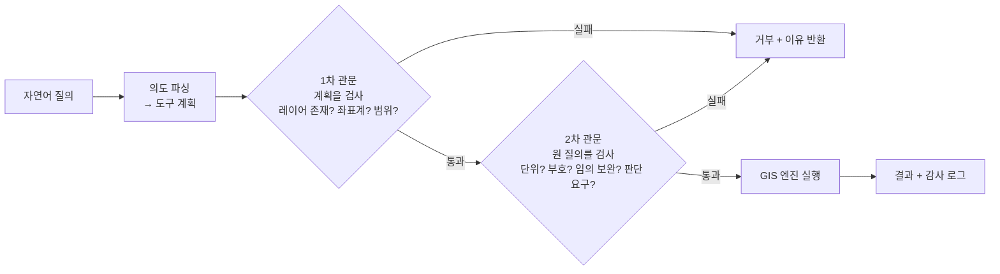
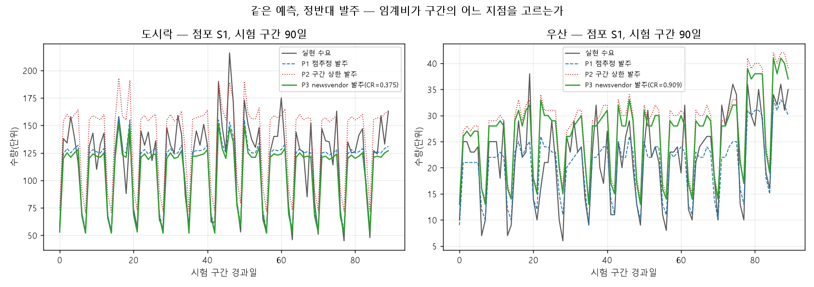

# 7장 자율 GIS와 시공간 예측, 도구를 언제 믿고 언제 사람이 확인할까

> - 이 장에 나오는 질의 처리 결과, RMSE, 불확실성 값, 발주량, 손실 금액은 모두 `lecture_practice/chapter7/`의 코드를 실제로 실행해 얻은 값
> - 예시를 위해 지어낸 숫자는 없음

## 1. 이 장의 핵심 질문

1. **언어모델에게 "도서관에서 1km 이내 인구는?"이라고 물으면 답은 나온다.** 그 답을 얼마나 믿을 수 있으며, 무엇을 검증해야 하는가
2. **"내일 수요는 90% 확률로 70~130개"라는 구간은 어떻게 만드는가.** 그리고 이 오차는 관측을 늘려서 줄일 수 있는 것인가, 아닌 것인가
3. **구간을 받은 점장은 결국 발주서에 숫자 하나를 적어야 한다.** 그 숫자를 정하는 값은 예측 모델 안에 없는데, 어디에서 오는가

- 세 질문의 공통점은 **도구가 낸 값을 그대로 결정에 쓰지 않는다**는 것임
- 언어모델의 답에는 검증 관문이 붙고, 예측값에는 구간이 붙으며, 구간에는 비용 구조가 붙어야 결정이 됨

## 2. 도입 사례: 질의 4건 중 3건이 거부된 이유

- `lecture_practice/chapter7/results/7-1-autonomous-gis-query.log`의 실제 실행 결과를 먼저 봄
- 레이어 카탈로그는 인구격자·도서관(6개소)·학교(12개소), 좌표계 `EPSG:5179`
- 네 개의 질의를 순서대로 넣었을 때 결과는 다음과 같음

| 질의 | 처리 결과 |
| --- | --- |
| "도서관에서 1km 이내 인구는?" | ✅ 성공 — 약 `73,713명` |
| "지하철역에서 500m 이내 인구는?" | ❌ 거부 — 존재하지 않는 레이어 '지하철역' |
| "위도 37.5 경도 127.0 학교에서 1km 이내 인구는?" | ❌ 거부 — 좌표계 불일치(질의 EPSG:4326 vs 데이터 EPSG:5179) |
| "그 동네 살기 좋은 곳 알려줘" | ❌ 거부 — 의도를 파싱할 수 없음(모호한 질의) |

- 요약: 질의 4건 중 성공 1건, 검증 단계가 차단 3건
- 눈여겨볼 것은 성공 1건이 아니라 **거부된 3건이 왜 거부되었는가**임
- 검증 단계가 없었다면 세 질의 모두 "그럴듯한 숫자"가 나왔을 것임 — 존재하지 않는 레이어에도 숫자를 만들어 낼 수 있고, 좌표계가 다른 좌표를 그대로 계산에 넣어도 프로그램은 멈추지 않음
- 이 장의 앞부분이 다루는 것이 바로 이 지점임. **검증이 없으면 오류가 오류로 보이지 않음**

## 3. 무엇을 맡기고 무엇을 사람이 하는가

### 3.1 언어모델이 잘하는 것과 못하는 것

- 언어모델에 공간 질문을 던지면 과제 유형에 따라 결과가 크게 갈림
- "행정동과 법정동의 차이를 설명하라"에는 정확한 답이 나옴
- 그런데 좌표 계산·위상 관계(인접·포함·교차)·거리와 방향 추론에서는 **틀린 답이 확정적인 어조로** 나오는 경우가 많음
- 이 현상을 **환각**(hallucination)이라 함 — 근거 없는 내용을 사실 형태의 문장으로 만들어 내는 것

- 원인은 학습 방식에 있음
  - 언어모델은 텍스트의 다음 단어를 맞히도록 학습함
  - 그래서 반복 등장한 지식과 서술 패턴은 잘 재현함
  - 그러나 좌표는 텍스트에서 규칙성 없이 흩어진 숫자열이라 **그 산술적 의미가 학습되지 않음**

### 3.2 위임 경계를 표로 정한다

- 그래서 역할을 나눔. 언어모델은 자연어로 의도를 받아 "어떤 계산을 할 것인가"로 옮기는 **인터페이스** 역할만 맡고, 버퍼·교차·좌표 변환 같은 실제 공간 연산은 검증된 GIS 엔진에 맡김

| 위임 가능 | 위임 불가 |
| --- | --- |
| 공간 용어·개념의 설명 | 좌표·거리·면적의 직접 계산 |
| 분석 절차의 계획 수립("버퍼 → 교차 → 집계 순서로") | "A동과 B동이 인접한가" 같은 위상 판정 |
| 결과 수치를 서술문으로 바꾸기 | 특정 지역 통계값을 언어모델이 직접 인출하는 것 |

- 2절의 4건 질의로 이 경계를 확인할 수 있음
- 1번 질의("도서관에서 1km 이내 인구는?")는 **위임 가능** 영역임 — 반경과 대상을 계획으로 옮기는 일까지가 언어모델의 몫이고, 실제 계산은 GIS 엔진이 함
- 4번 질의("그 동네 살기 좋은 곳 알려줘")는 **위임 불가** 영역임 — "살기 좋다"는 판단은 집계 도구가 답할 수 있는 질문이 아님. 검증 단계가 이를 "의도를 파싱할 수 없음"으로 거부함
- 2번·3번 질의는 위임 가능 영역의 질문이지만 **입력 자체가 성립하지 않는 경우**임. 다음 절의 관문이 이 둘을 잡음

## 4. 검증 관문: 오류가 오류로 보이게 만들기

### 4.1 질의 처리 순환과 세 가지 확인

- 자연어 질의를 GIS 연산으로 옮기는 시스템의 처리 순서는 다섯 단계임

```
질문 → 의도 파싱(계획 수립) → [검증 관문] → 도구 호출(GIS 엔진 실행) → 결과
```

- `7-1-autonomous-gis-query.py`가 이 다섯 단계를 그대로 구현함
- 파싱은 정규식으로 "○○에서 △△m 이내"라는 패턴을 찾아 계획(`buffer_count`, 대상 레이어, 반경)으로 바꾸는 규칙 기반 함수가 맡음
- **검증 관문은 계획을 실행하기 전에 세 가지를 확인함**

1. **파싱이 됐는가** — 안 되면 "의도를 파싱할 수 없음"으로 거부
2. **참조한 레이어가 카탈로그에 있는가** — 없으면 "존재하지 않는 레이어"로 거부
3. **질의 좌표계가 데이터 좌표계와 같은가** — 다르면 "좌표계 불일치"로 거부

- 2절의 결과가 이 세 확인을 그대로 보여 줌. 2번 질의는 두 번째 확인에서, 3번 질의는 세 번째 확인에서, 4번 질의는 첫 번째 확인에서 걸림

### 4.2 관문을 두 층으로 나눈다

- 관문 하나로는 잡히지 않는 것이 있음. 계획으로 환원되지 않는 정보 — 단위, 부호, 요청의 성격 — 는 계획만 봐서는 확인할 수 없음
- 그래서 일반 형태에서는 관문을 두 층으로 나눔. **계획 자체를 검사하는 관문**과 **원 질의를 함께 놓고 검사하는 관문**임



**그림 7.1** 질의 처리 순환과 두 층의 검증 관문. 1차 관문은 모델이 만든 계획을 검사하고, 2차 관문은 원 질의를 함께 본다. 계획으로 환원되지 않는 정보(단위·부호·요청의 성격)는 2차 관문에서만 잡힌다.

### 4.3 검증이 없으면 무엇이 남는가

- `7-1-autonomous-gis-query.log`의 마지막 줄이 이 절의 핵심을 그대로 적어 둠 — "검증(self-verifying) 단계가 없었다면 CRS 오류·없는 레이어가 그대로 '그럴듯한 숫자'로 출력됐을 것이다"
- 이 문장을 3번 질의로 구체화하면 다음과 같음
  1. 위도·경도가 섞인 질의를 검증 없이 그대로 실행함
  2. 시스템은 좌표계가 다르다는 사실을 알아채지 못함
  3. 잘못된 위치를 기준으로 인구를 집계함
  4. **결과값은 숫자로 나오고, 그 숫자가 틀렸다는 사실은 프로그램 어디에도 나타나지 않음**
- 이것이 환각이 실무에서 위험한 이유임. 오류가 오류처럼 보이지 않고 **정상 출력의 형태로** 나감

### 4.4 관문으로 막을 수 없는 실패도 있다

- 언어모델이 "도구를 호출하겠습니다"라고 문장으로만 답하고 실제 호출 형식은 비워 두는 실패를 **형식 미준수**(format violation)라 함
- 내용은 맞는데 실행 형식이 어긋난 경우임. 실제 언어모델 API를 호출하는 환경에서 관측되는 실패 유형이며, 이 장의 규칙 기반 파서로는 재현되지 않음
- **이 실패는 검증 관문으로 막을 수 없음.** 관문은 계획을 검사하는데, 형식 미준수에서는 검사할 계획 자체가 만들어지지 않음
- 그래서 별도로 **처리율**(처리되어야 할 정상 질의 가운데 실제로 실행한 비율)을 재야 발견됨. 환각은 "틀린 값이 나오는" 실패이고 형식 미준수는 "아무 값도 안 나오는" 실패라서, 확인하는 지표가 다름

### 4.5 감사 로그

- `7-1`은 처리한 질의마다 질의문·상태·거부 사유·결과값을 `autonomous_gis_query_log.csv`에 저장함
- 이런 기록을 **감사 로그**(audit log)라 함. 특정 수치가 어느 레이어와 어느 반경에서 나왔는지, 어떤 질의가 왜 거부되었는지를 사후에 재구성할 수 있게 하는 자료임
- 감사 로그가 없으면 "몇 건이 거부됐다"는 집계는 남지만 **"어떤 유형이 반복해서 거부되는가"는 알 수 없음.** 관문 규칙을 어디에 보강해야 할지도 로그 없이는 판단할 수 없음

## 5. 실습 안내

- 실습 코드
  - `lecture_practice/chapter7/code/7-0-simdata-prep.py` — 자율 GIS 레이어 카탈로그·교통량 시계열 생성 (7-1·7-2용)
  - `lecture_practice/chapter7/code/7-0b-demand-simdata.py` — 점포 6곳 × 품목 2종 × 1,460일 수요 패널 생성 (7-3용)
  - `lecture_practice/chapter7/code/7-1-autonomous-gis-query.py` — 자연어 공간 질의와 검증 관문
  - `lecture_practice/chapter7/code/7-2-spatiotemporal-uncertainty.py` — LSTM + MC Dropout 시공간 예측과 예측구간
  - `lecture_practice/chapter7/code/7-3-demand-newsvendor.py` — LSTM + 3분할 정규화 conformal → 임계비 발주 결정
- 결과 로그: `lecture_practice/chapter7/results/*.log`

- **7-1은 외부 언어모델 API를 호출하지 않음**
- 실제 시스템은 GPT류 언어모델로 자연어 질의를 해석하지만, 이 실습은 비용과 재현성을 위해 **결정론적 규칙 기반 파서**로 언어모델의 역할을 대신함
- 이 실습의 핵심은 파서 자체의 정교함이 아니라, **검증 단계가 없으면 무엇이 잘못되는가**를 눈으로 보이는 것임
- 7-2·7-3은 실제로 LSTM을 학습시키는 신경망 코드이며, 가속기(CUDA·MPS)를 쓰면 소수점 아래가 흔들리므로 본문 수치와 맞추려면 CPU로 고정해 실행함
- `lecture_practice/`는 GPU 없이 노트북에서 돌아가도록 가볍게 만든 실습이며, 이 장의 본문 수치는 전부 이 폴더의 결과 로그에서 나옴

## 6. 기준선과 겨루기

- 예측 모델을 도입하기 전에 확인할 것이 하나 있음 — **학습이 필요 없는 규칙보다 나은가**
- 이 확인 없이 모델을 배포하면 가장 기본적인 질문에 답하지 않은 채 도구를 넣는 셈이 됨
- `7-3-demand-newsvendor.py`가 LSTM과 함께 **계절 나이브**(지난주 같은 요일 값을 그대로 쓰는 규칙)를 같은 방식으로 채점함

| 품목 | RMSE(LSTM) | RMSE(계절 나이브) |
| --- | ---: | ---: |
| 도시락 | `23.45` | `32.22` |
| 우산 | `6.48` | `8.58` |

- 두 품목 모두 LSTM이 나이브 기준선보다 오차가 작음
- 비교할 때는 **같은 자료, 같은 분할, 같은 평가**로 나란히 잼. 서로 다른 자료에서 잰 성능을 비교하면 차이의 원인이 모델인지 자료인지 구분할 수 없음
- `7-2-spatiotemporal-uncertainty.py`(교통량 예측)는 LSTM 하나만 학습시키므로 이 절의 비교 대상이 아님. RMSE `12.82`는 다음 절에서 불확실성을 분해하는 데 쓰는 값으로 다시 나옴

## 7. 점추정을 구간으로 바꾼다

### 7.1 점추정만으로는 왜 부족한가

- "내일 이 구간 교통량은 95대/시간"이라는 예측을 받았다고 함
- 실제 값이 90~100 사이에 들어온다면 별다른 대응이 필요 없지만, 45~145 사이에 들어온다면 예비 인력이나 완충 자원이 필요함
- **같은 점추정에서 정반대 대응이 나올 수 있음.** 점추정 하나만 전달하면 그 값이 얼마나 빗나갈 수 있는지가 전달되지 않음

### 7.2 두 성분으로 나누어 재기

- 예측 오차는 원인이 다른 두 성분으로 나뉨
- **모델 불확실성**(epistemic uncertainty) — 자료가 부족해서 생기는 오차. 관측을 늘리면 줄어듦
- **데이터 잡음**(aleatoric uncertainty) — 현상 자체의 변동에서 오는 오차. 자료를 아무리 늘려도 줄어들지 않음
- **둘을 구분해야 하는 이유는 처방이 갈리기 때문임.** 모델 불확실성이 크면 관측을 늘리는 것이 답이고, 데이터 잡음이 크면 관측을 늘려도 소용없고 완충 자원을 마련하는 것이 답임

- `7-2-spatiotemporal-uncertainty.py`가 이 둘을 각각 재는 방법을 보여 줌
  - **모델 불확실성**은 **MC Dropout**(Gal & Ghahramani, 2016)으로 잼. 학습을 마친 신경망에서 드롭아웃 층을 끄지 않고 그대로 둔 채 같은 입력을 50번(`MC_SAMPLES = 50`) 통과시킴. 매번 다른 뉴런 조합이 비활성화되므로 50개의 서로 다른 예측이 나오고, 그 흩어진 정도(표준편차)를 모델 불확실성으로 씀
  - **데이터 잡음**은 학습 구간에서 실제값과 예측값의 차이(잔차)를 모아 그 분산을 계산함. 학습을 마친 구간에서도 남는 오차이므로 줄어들지 않는 변동의 추정치로 씀

- 자료: 합성 교통량 1,200시간, 과거 24시간을 보고 다음 1시간을 예측함
- 앞 70%를 학습(823개 창), 뒤 30%를 검증(353개 창)에 씀 — 시간 순서대로 나눠 미래 정보가 학습에 섞이지 않게 함
- 15에폭 학습 후 최종(정규화된 값 기준) train MSE `0.1693`

### 7.3 실제 분해 결과

- `7-2-spatiotemporal-uncertainty.log`의 실행 결과는 다음과 같음

| 항목 | 값 |
| --- | --- |
| 점추정 RMSE | `12.82` 대/시간 |
| 모델 불확실성(epistemic) 평균 표준편차 | `7.23` |
| 데이터 잡음(aleatoric) 표준편차 | `11.69` |
| 모델 불확실성 비중 | `28%` |
| 90% 구간 포함률 | `91.5%` (목표 `90%`) |
| 평균 구간 폭 | `45.18` 대/시간 |

- 데이터 잡음(11.69)이 모델 불확실성(7.23)보다 큼. **이 자료·이 모델에서는 관측을 늘리는 것보다 변동을 흡수할 완충 자원을 마련하는 쪽이 더 정확한 처방**이라는 뜻임
- 두 성분은 원인이 달라 독립으로 간주하고, 표준편차는 각각을 제곱해 더한 뒤 제곱근을 취해 결합함

전체 σ = √(모델 불확실성² + 데이터 잡음²)

- 이 표의 값을 직접 넣어 확인할 수 있음. √(7.23² + 11.69²) = √(52.27 + 136.66) = √188.93 ≈ `13.75`
- 90% 구간은 좌우로 1.645σ씩 확장하므로 폭은 2 × 1.645 × 13.75 ≈ `45.24`
- 실제 로그의 평균 구간 폭 `45.18`과 거의 같음. 차이는 모델 불확실성이 관측마다 다른 값을 갖는 데서 오는 반올림 수준의 오차임
- 이 계산에서 확인할 성질 하나 — **두 값의 차이가 클수록 작은 쪽의 기여는 급격히 줄어듦.** 두 성분이 3과 4라면 결합값은 7이 아니라 5이고, 1과 10이라면 10.05로 큰 쪽이 사실상 전체를 결정함

### 7.4 구간을 만든 뒤에는 포함률을 확인한다

- 구간을 만들었으면 그 구간이 실제로 목표한 비율만큼 정답을 담는지 확인함. 이 값이 **포함률**임
- 위 표의 90% 구간 포함률은 `91.5%`로 목표 90%에 가까움. 목표보다 크게 낮으면 구간이 좁아 위험을 과소평가한 것이고, 크게 높으면 구간이 넓어 쓸모가 떨어진 것임
- 불확실성이 큰 시점을 순서대로 뽑으면 다음과 같음

| 검증 순번 | 예측 평균 | 구간 폭 | 실제값 |
| ---: | ---: | ---: | ---: |
| 55 | 96.8 | 52.6 | 105.9 |
| 135 | 10.3 | 50.5 | 9.1 |
| 32 | 93.4 | 50.4 | 115.1 |
| 210 | 8.6 | 50.1 | 40.5 |
| 80 | 84.1 | 50.0 | 90.4 |

- 표를 읽는 방법은 다음과 같음. "구간 폭" 열이 클수록 모델이 그 시점을 자신 없어 한다는 뜻이고, "실제값"과 "예측 평균"의 차이가 클수록 실제로 많이 빗나간 것임
- 210번 시점을 보면 구간 폭이 50.1로 넓었고 실제값(40.5)이 예측 평균(8.6)과 크게 벌어짐 — 넓은 구간이 실제로 큰 오차와 함께 나타난 사례임

## 8. 단위마다 다른 폭 — 정규화 conformal

### 8.1 하나의 폭으로는 맞지 않는 경우

- 7절의 방식은 자료 전체에 하나의 잡음 구조를 가정함
- 그런데 점포처럼 분석 단위가 여럿이고 단위마다 빗나가는 폭이 다르면, **모든 단위에 같은 폭의 구간을 주는 것이 맞지 않음**
- `7-3-demand-newsvendor.py`가 이 문제에 쓰는 방법이 **정규화 conformal**임. 절차는 네 단계임

1. **점추정** — 학습 구간으로 LSTM을 학습해 각 관측의 예측값을 얻음
2. **오차 규모 적합(학습 구간)** — 점포마다 "이 수준의 수요를 예측할 때 평균적으로 얼마나 빗나갔는가"를 학습 구간의 실제 잔차로 회귀함. 이렇게 얻은 값을 σ̂로 씀
3. **분위 보정(보정 구간)** — 학습에 쓰지 않은 별도의 보정 구간에서 (실제값 − 예측값) / σ̂로 정규화한 잔차를 모음. σ̂로 나누었으므로 점포마다 다른 잡음 규모가 하나의 척도로 정리됨
4. **분위 산출(시험 구간)** — 목표한 분위(예: 상하 5%씩 남긴 90% 구간)에 해당하는 정규화 잔차를 보정 구간에서 찾고, 그 값에 시험 구간의 σ̂를 다시 곱해 각 관측의 실제 구간으로 되돌림

- 자료를 **학습 60% / 보정 20% / 시험 20%**로 시간 순서대로 나눔
- 7절의 방식이 학습과 검증 두 구간만 썼던 것과 다른 지점임 — 분포를 가정하지 않는 대신, **학습에 전혀 쓰지 않은 보정 구간을 따로 떼어 둬야 함**

- 실행 결과(도시락·우산, 이분산 자료)는 다음과 같음

| 품목 | 시험 창 수 | 시험 RMSE | 90% 구간 포함률 | 평균 구간 폭 | 폭 변동계수 |
| --- | ---: | ---: | ---: | ---: | ---: |
| 도시락 | 1,752 | `23.45` | `89.3%` | `69.94` | `0.364` |
| 우산 | 1,752 | `6.48` | `89.6%` | `19.68` | `0.473` |

- 두 품목 모두 포함률이 목표 90%에 가깝게 맞음
- "폭 변동계수"는 구간 폭이 점포마다 얼마나 달랐는지를 나타냄. 0에 가까우면 모든 점포에 같은 폭을 준 것이고, 클수록 점포별로 다른 폭을 준 것임. `0.364`와 `0.473`은 점포마다 상당히 다른 폭이 주어졌다는 뜻임

### 8.2 전체 포함률만 보면 문제가 드러나지 않는다

- 시험 자료를 수요 3분위로 나눠 포함률을 따로 재면 다음과 같음

| 품목 | 방식 | 수요 3분위별 포함률 | 편차 |
| --- | --- | --- | ---: |
| 도시락 | 정규화 | `91.3%` / `91.1%` / `85.6%` | `5.7%p` |
| 도시락 | 비정규화(모든 관측에 같은 폭) | `96.2%` / `89.2%` / `81.3%` | `14.9%p` |
| 우산 | 정규화 | `88.5%` / `90.1%` / `90.1%` | `1.5%p` |
| 우산 | 비정규화 | `97.4%` / `89.4%` / `81.0%` | `16.4%p` |

- 전체 포함률만 보면 정규화와 비정규화의 차이가 크지 않았음(도시락 89.3% 대 88.9%, 우산 89.6% 대 89.3%)
- 그런데 수요 수준별로 나눠 보면 비정규화 방식은 **수요가 적은 날에는 필요 이상으로 넓고(96~97%) 수요가 많은 날에는 목표에 크게 못 미침(81~89%)**
- 정규화 방식은 이 편차가 훨씬 작음(5.7%p·1.5%p 대 14.9%p·16.4%p)
- **전체 평균만 보고했다면 이 구조적 문제가 드러나지 않았을 것임.** 포함률은 조건을 나눠서도 확인함

### 8.3 이 방법이 언제 이득을 주는지 확인하기

- 잡음의 크기 구조만 상수로 바꾼 대조 자료(`store_demand_homoskedastic.parquet`)에 같은 절차를 돌리면 다음과 같음

| 품목 | 폭 변동계수(본 자료) | 폭 변동계수(등분산 대조군) |
| --- | ---: | ---: |
| 도시락 | `0.364` | `0.032` |
| 우산 | `0.473` | `0.062` |

- 등분산 자료에서는 정규화 절차를 동일하게 적용했는데도 폭이 거의 균일해짐(변동계수가 0에 가까워짐)
- 이는 폭의 차이가 알고리즘이 임의로 만든 것이 아니라 **자료의 이분산**(점포·시간대별로 잡음 크기가 다른 성질)**에서 왔다**는 근거임
- 잡음 구조가 실제로 다르지 않다면 정규화를 적용해도 결과가 상수 폭과 비슷해짐. 이 대조는 정규화 conformal이 "이분산이 있는 자료에서만 이득을 준다"는 조건을 실측으로 확인한 것임

## 9. 구간을 발주량 하나로 바꾼다

### 9.1 신문팔이 문제와 임계비

- 두 점포가 동일한 수요 예측구간을 받았다고 함. 하나는 도시락 가게이고 하나는 우산 가게임
- 도시락은 재고가 남으면 당일 폐기되어 원가 전액이 손실임
- 우산은 재고가 남으면 다음 강우일에 팔리지만, 품절이면 손님이 다른 가게로 감
- 전자는 남는 손실(잉여 손실)이 크고 후자는 모자란 손실(결품 손실)이 큼. **같은 구간을 받았어도 전자는 구간의 아래쪽에서, 후자는 위쪽에서 발주해야 함**
- 이 판단을 계산으로 옮긴 것이 **신문팔이 문제**(newsvendor problem)임. 결품 1단위의 손실을 Cu, 잉여 1단위의 손실을 Co라 하면 최적 발주량은 수요 분포에서 다음 비율에 해당하는 지점임

임계비(CR) = Cu / (Cu + Co)

- `7-3-demand-newsvendor.py`가 쓴 가정값은 다음과 같음

| 품목 | Cu(결품 1단위) | Co(잉여 1단위) | 임계비 | 설명 |
| --- | ---: | ---: | ---: | --- |
| 도시락 | 1,200 | 2,000 | `0.375` | Cu=판매 마진, Co=원가+폐기비 |
| 우산 | 15,000 | 1,500 | `0.909` | Cu=마진+기회 상실, Co=재고 유지비 |

- 도시락의 임계비 0.375는 0.5보다 작음 — 구간의 아래쪽에서 발주하라는 뜻
- 우산의 임계비 0.909는 0.5보다 훨씬 큼 — 구간의 위쪽 끝 가까이에서 발주하라는 뜻
- 두 값은 전부 **가정값**임. 실제 업종의 원가율·폐기율을 확인할 근거가 없어 이 예제를 설명하기 위해 정한 값이며, 어떤 업종의 실제 임계비도 나타내지 않음. 이 계산에서 결론으로 삼는 것은 금액의 절댓값이 아니라 **두 임계비가 0.5의 반대편에 있다는 방향**임

### 9.2 세 발주 정책의 실현 손익

- 임계비가 정해지면 8절의 conformal 절차가 산출한 분위 함수에서 그 비율에 해당하는 값을 뽑아 발주량으로 씀
- 실무에서 자주 보이는 다른 두 규칙과 비교해 봄

- **P1 점추정** — 예측값을 그대로 발주함. 이는 결품과 잉여 손실이 같다고 가정한 것과 같음(임계비를 0.5로 고정한 것)
- **P2 구간 상한** — 90% 구간의 상한을 그대로 발주함. 이는 임계비를 신뢰수준의 상한 분위(95%)로 고정한 것과 같음
- **P3 newsvendor** — 9.1의 임계비 분위로 발주함

- 시험 구간(품목당 1,752건)에서 세 정책을 실제 수요로 채점한 결과는 다음과 같음

**도시락 (CR = 0.375)**

| 정책 | 결품손실 | 과잉손실 | 총손실 | 평균발주 | 실현 서비스 수준 |
| --- | ---: | ---: | ---: | ---: | ---: |
| P1 점추정 | 21,774,000 | 24,336,000 | 46,110,000 | 86.8 | 44.7% |
| P2 구간 상한(90%) | 1,459,200 | 117,894,000 | 119,353,200 | 123.1 | 93.6% |
| P3 newsvendor | 28,104,000 | 17,562,000 | 45,666,000 | 81.8 | 34.9% |

**우산 (CR = 0.909)**

| 정책 | 결품손실 | 과잉손실 | 총손실 | 평균발주 | 실현 서비스 수준 |
| --- | ---: | ---: | ---: | ---: | ---: |
| P1 점추정 | 59,850,000 | 6,390,000 | 66,240,000 | 17.0 | 57.6% |
| P2 구간 상한(90%) | 4,380,000 | 26,824,500 | 31,204,500 | 26.9 | 95.3% |
| P3 newsvendor | 7,560,000 | 22,452,000 | 30,012,000 | 25.1 | 92.8% |

- 표를 읽는 순서는 다음과 같음. 먼저 P3(newsvendor)의 총손실을 기준으로 삼고, P1·P2가 그보다 얼마나 큰지를 봄
- **도시락에서는 P2(구간 상한)가 P3보다 훨씬 비쌈** — 총손실이 119,353,200원으로 P3(45,666,000원)의 약 2.6배임
  - 원인은 과잉손실에 있음. 90% 구간의 상한을 매일 발주량으로 쓰면 매일 폐기가 발생함
  - **90% 구간의 신뢰수준과 이 품목의 최적 서비스 수준(임계비 0.375)은 전혀 다른 값인데, 구간 상한 발주는 이 둘을 같다고 착각한 규칙임**
- **우산에서는 P2가 P3와 비슷함** — 95.3%와 92.8%로 총손실 차이가 크지 않음. 우산의 임계비(0.909)가 90% 구간의 상한 분위(95%)와 가깝기 때문임
- **이 우연한 일치가 함정임.** 우산에서 구간 상한 발주가 잘 맞았다고 해서 같은 규칙을 도시락에 그대로 적용하면 2.6배의 손실을 입음. 임계비가 다르면 최적 발주 지점도 완전히 달라짐

- 세 정책이 실제로 어디에 선을 긋는지 시험 구간 90일치로 확인함



**그림 7.2** 점포 S1의 시험 구간 90일. 회색이 실현 수요, 파란 점선이 P1(점추정), 빨간 점선이 P2(구간 상한), 초록 실선이 P3(newsvendor)임. **왼쪽 도시락에서는 초록선이 파란선 아래에 있고, 오른쪽 우산에서는 파란선보다 크게 위로 올라가 빨간선에 근접함.** 같은 파이프라인이 낸 두 그림에서 두 선의 상하 관계가 뒤집힌 원인은 임계비뿐임(도시락 0.375, 우산 0.909)

## 10. 임계비를 조금 틀려도 괜찮은가

- 임계비 Cu·Co는 가정값이므로 실제로는 어느 정도 오차가 있을 수 있음
- 이 오차가 결정에 얼마나 영향을 주는지 확인하려면, **같은 예측을 고정한 채 가정 임계비를 여러 값으로 바꿔 가며** 손실을 계산해 보면 됨

**도시락 (참 CR = 0.375)**

| 가정 CR | 평균발주 | 총손실 | 최적 대비 초과 |
| ---: | ---: | ---: | ---: |
| 0.100 | 62.6 | 63,916,400 | +18,250,400 |
| 0.250 | 74.7 | 48,825,600 | +3,159,600 |
| 0.375 | 81.8 | 45,666,000 | +0 |
| 0.500 | 88.0 | 46,697,600 | +1,031,600 |
| 0.750 | 102.1 | 64,122,800 | +18,456,800 |
| 0.909 | 117.0 | 100,978,400 | +55,312,400 |

- 참값(0.375) 근처에서는 손실 곡선이 평탄함. 임계비를 0.375 대신 0.5로 잘못 잡아도 초과 손실은 1,031,600원으로 최적값의 2%대에 그침
- 그러나 다른 품목의 임계비(우산의 0.909)를 그대로 가져다 쓰면 초과 손실이 55,312,400원으로 뛰어오름
- 즉 담당자가 확인해야 할 것은 임계비를 소수점 몇 자리까지 정밀하게 잡느냐가 아니라, **그 값이 0.5의 어느 쪽에 얼마나 떨어져 있는가**임

- 같은 판단을 다른 방식으로도 확인할 수 있음. `7-3`은 "임계비를 얼마나 틀려야 예측 모델을 통째로 계절 나이브로 바꾼 것과 같은 손실이 나는가"도 계산함
- 도시락에서 계절 나이브로 예측을 낮추면 손실이 16,632,000원 늘어남. 이만큼의 손실을 임계비를 잘못 잡아서 내려면 참값(0.375)에서 아래로 0.270, 위로 0.355만큼 벌어져야 함
- 우산에서는 나이브 대가가 13,231,500원이고, 이만큼의 손실을 내려면 참값(0.909)에서 아래로 0.214, 위로 0.086만큼 벌어져야 함
- 두 계산이 같은 결론을 가리킴 — **예측을 조금 개선하는 것과 비용비를 대략이라도 맞게 잡는 것 중, 이 예제에서는 비용비의 방향을 맞추는 쪽이 더 큰 영향을 줌**

## 11. 핵심 요약

- **언어모델은 좌표 계산에 쓰지 않음.** 텍스트의 다음 단어를 맞히도록 학습해 좌표의 산술적 의미가 학습되지 않기 때문이며, 의도를 계획으로 옮기는 인터페이스 역할까지만 맡김 (3.1, 3.2)
- **검증 관문은 실행 전에 세 가지를 확인함** — 파싱 가능 여부, 레이어 존재 여부, 좌표계 일치 여부. 실습에서 질의 4건 중 3건이 이 세 확인에 각각 걸림 (4.1)
- **검증이 없으면 오류가 정상 출력의 형태로 나감.** 좌표계가 다른 좌표를 그대로 계산해도 숫자는 나오고, 그 숫자가 틀렸다는 사실은 프로그램 어디에도 나타나지 않음 (4.3)
- **형식 미준수는 관문으로 못 막음.** 검사할 계획 자체가 만들어지지 않으므로 처리율을 따로 재야 발견됨 (4.4)
- **예측 모델은 학습이 필요 없는 규칙과 먼저 겨룸.** 실습에서 LSTM 23.45 대 계절 나이브 32.22 (6절)
- **예측 오차의 두 성분은 처방이 다름.** 모델 불확실성은 관측을 늘려 줄이고 데이터 잡음은 완충 자원으로 흡수하며, 두 성분은 제곱해 더한 뒤 제곱근을 취해 결합함 (7.2, 7.3)
- **전체 포함률만 보면 구조적 문제가 안 드러남.** 비정규화 방식은 전체로는 88.9%로 멀쩡해 보이지만 수요 3분위별 편차가 14.9%p였음 (7.4, 8.2)
- **단위마다 잡음 규모가 다르면 폭도 달라야 하고, 그 이득은 이분산이 있을 때만 나옴.** 등분산 대조군에서 폭 변동계수가 0.364에서 0.032로 떨어짐 (8.1, 8.3)
- **구간을 수량 하나로 바꾸는 값은 예측 모델 밖에 있음.** 임계비 CR = Cu/(Cu+Co)이며, 도시락 0.375와 우산 0.909가 0.5의 반대편에 놓임 (9.1)
- **구간 상한을 발주량으로 쓰면 안 됨.** 신뢰수준과 최적 서비스 수준은 다른 값이고, 도시락에서 이 혼동의 대가가 2.6배 손실이었음. 임계비는 방향이 중요하고 소수점 정밀도는 덜 중요함 (9.2, 10절)

## 12. 과제

```bash
python scripts/submit.py 7 --id 학번 --name 이름
```

- 이 명령이 대신 처리하는 작업: `7-0b-demand-simdata.py` 실행 → 대표 실습 `7-3-demand-newsvendor.py`를 학번 시드로 실행 → 제출용 파일 생성
- 학번마다 난수가 다르므로 결과 숫자도 사람마다 다름. 이 장의 실습은 난수를 쓰므로 1장과 달리 옆 사람과 값이 달라도 정상임

- 끝나면 `submissions/` 폴더에 `제출_7장_학번.md` 파일이 생김
- 열어 보면 실행 결과가 이미 붙어 있음
- **눈여겨볼 곳은 두 품목의 임계비, 그리고 예측값과 실제 발주량의 위아래 관계**

- 맨 아래 빈칸 세 개를 채우면 됨

1. 눈에 띈 숫자 하나를 그대로 옮겨 적고, 왜 눈에 띄었는지 한 문장으로
2. 그 숫자가 왜 그렇게 나왔는가
3. **점장에게 "내일 90% 확률로 70~130개"라고만 전하면 무엇이 남는가? 숫자 하나를 정해 준다면 몇 개이고, 그 근거는 무엇인가?**

- **3번이 이 과제의 핵심**. 1·2번은 로그를 보면 답이 나오지만 3번은 그렇지 않음

> - **막혀도 제출함**
> - 실행이 도중에 실패하면 오류 메시지가 자동으로 담기고, 질문이 "어디서 막혔나"로 바뀜
> - 실행 성공 여부로 점수를 매기지 않음
