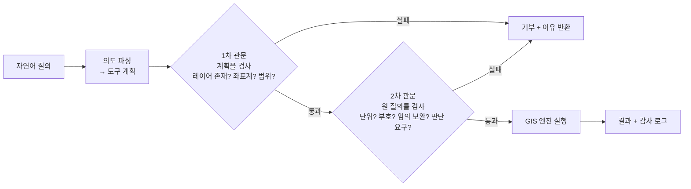

# 7장 자율 GIS와 시공간 예측, 도구를 언제 믿고 언제 사람이 확인할까

> - 이 장에 나오는 질의 처리 결과, RMSE, 불확실성 값, 발주량, 손실 금액은 모두 `lecture_practice/chapter7/`의 코드를 실제로 실행해 얻은 값
> - 예시를 위해 지어낸 숫자는 없음
> - `docs_practice/chapter7/`은 실제 언어모델 API를 호출하고 자료 규모도 훨씬 큼. 이 장은 그 수치를 쓰지 않고 `lecture_practice/chapter7/`의 값만 씀. 두 폴더의 숫자가 서로 달라도 오류가 아님

## 1. 이 장의 핵심 질문

- 언어모델에게 "도서관에서 1km 이내 인구는?"이라고 물으면 답은 나온다. 그런데 그 답을 얼마나 믿을 수 있을까?
- "내일 수요는 90% 확률로 70~130개"라는 예측을 받은 점장은 결국 발주서에 숫자 하나를 적어야 한다. 그 숫자는 어떻게 정할까?
- 같은 예측구간을 받은 도시락 가게와 우산 가게가 정반대 방향으로 발주해야 하는 이유는 무엇일까?
- 모델을 한 번 배포하면 그다음부터는 무엇을 지켜봐야 할까? 몇 주에 한 번씩 다시 학습시키면 되는 걸까?

- 이 장은 위 네 질문에 공통으로 깔린 절차 하나를 다룸
- 언어모델이든 예측 모델이든, 도구 하나를 업무에 넣을지 말지는 **같은 여섯 단계**로 판정함
- 그 여섯 단계를 실제로 돌려 보고, 각 단계에서 무엇이 산출되는지 손으로 확인하는 것이 이 장의 목표

## 2. 직관적 비유

- **도구 도입 판정 = 신입 직원을 수습에서 정식 배치로 올리는 절차**
- 새로 뽑은 직원을 바로 중요한 업무에 앉히지 않듯이, 언어모델이나 예측 모델도 곧바로 의사결정에 연결하지 않음
- 대응 관계를 하나씩 짚으면 다음과 같음

| 수습 평가 절차 | 도구 도입 판정 |
| --- | --- |
| 어떤 업무를 맡겨 볼지 정함 | 과업 정의와 위임 경계를 정함 |
| 수습 기간 동안 어떤 실수를 반복하는지 지켜보고 체크리스트를 만듦 | 도구가 어떤 형태로 실패하는지 확인하고 막을 방법을 둠 |
| 지원자 여러 명(또는 같은 사람의 여러 근무 방식)을 같은 기준으로 겨룸 | 같은 자료·같은 기준으로 후보를 비교함 |
| 어느 업무에서 자신 없어 하는지 확인함 | 예측이 얼마나 빗나갈 수 있는지를 성분별로 재고 구간으로 나타냄 |
| 실수의 대가를 따져 최종 업무를 배정함 | 두 방향 오류의 비용을 따져 수치를 결정으로 바꿈 |
| 배치 후에도 정기적으로 다시 점검함 | 배포 후 자료가 달라졌는지 계속 지켜보고 필요하면 다시 손봄 |

- 이 대응에서 정서적으로 옮기는 것은 없음. 순서와 조건만 옮김
- 수습 평가에서 순서를 건너뛰면(예: 실수 유형을 확인하지 않고 바로 정식 배치) 나중에 문제가 생겨도 원인을 특정하기 어려움
- 도구 도입 판정에서도 마찬가지로, 앞 단계를 건너뛰면 뒤 단계의 근거가 사라짐

## 3. 핵심 개념 5가지

1. **도구 도입 판정은 언어모델이든 예측 모델이든 같은 여섯 단계를 따름**
   - 업무 위임 경계 → 실패 유형 확인 → 후보 비교 → 불확실성 정량화 → 결정 규칙 → 배포 후 운영
2. **도구가 실패하는 방식은 하나가 아니며, 그 형태를 구분해야 막을 방법도 정해짐**
   - 존재하지 않는 것을 참조하는 실패와 좌표계를 혼동하는 실패는 원인이 다르고 막는 방법도 다름
3. **점추정 하나만으로는 결정할 수 없음**
   - 예측이 얼마나 빗나갈 수 있는지를 "자료가 부족해서 생기는 오차"와 "현상 자체의 변동"으로 나눠 재야 처방이 갈림
4. **예측구간을 수량 하나로 바꾸는 값은 예측 모델 안에 없음**
   - 결품(모자람)과 잉여(남음) 중 어느 쪽 손실이 큰가가 구간의 어느 지점에서 발주할지를 정함
5. **배포한 뒤에도 도구는 낡아짐 — 무엇이 낡았는지에 따라 대응이 달라짐**
   - 예측값 자체가 치우쳤으면 다시 학습시켜야 하고, 구간 폭만 어긋났으면 학습 없이 구간만 다시 맞추면 됨

## 4. 실제 도구와 논문을 먼저 보기

- 이 장의 실습은 비용과 재현성 때문에 축소된 시뮬레이션을 씀
- 시뮬레이션에 들어가기 전에, 그 시뮬레이션이 서 있는 실제 자리를 먼저 확인하는 편이 이해에 도움이 됨

- **GeoChat 논문** — 원격탐사 전용 비전-언어모델의 실제 사례
  https://arxiv.org/abs/2311.15826
  - 이 논문에서 확인할 것: 위성영상에 자연어로 질문하는 모델이 실제로 어떻게 구성되는지, 그리고 "grounding"(답변을 영상 내 좌표에 대응시키는 것)이 왜 필요한지
- **MC Dropout 논문(Gal & Ghahramani, 2016)** — 10절에서 쓸 방법의 원 논문
  https://arxiv.org/abs/1506.02142
  - 이 논문에서 확인할 것: 드롭아웃을 추론 시에도 유지하면 왜 예측의 흩어진 정도가 "자료가 부족해서 생기는 불확실성"의 근사가 되는지
- **신문팔이 문제 원 논문(Arrow, Harris & Marschak, 1951)** — 11절에서 쓸 임계비 계산의 출처
  https://doi.org/10.2307/1906813
  - 이 논문에서 확인할 것: 재고를 한 번만 정할 수 있는 상황에서 최적 발주량이 왜 "확률 하나"로 정해지는지

## 실습 안내

- 실습 코드
  - `lecture_practice/chapter7/code/7-0-simdata-prep.py` — 자율 GIS 레이어 카탈로그·교통량 시계열 생성 (7-1·7-2용)
  - `lecture_practice/chapter7/code/7-0b-demand-simdata.py` — 점포 6곳 × 품목 2종 × 1,460일 수요 패널 생성 (7-3용)
  - `lecture_practice/chapter7/code/7-1-autonomous-gis-query.py` — 자연어 공간 질의와 검증 관문
  - `lecture_practice/chapter7/code/7-2-spatiotemporal-uncertainty.py` — LSTM + MC Dropout 시공간 예측과 예측구간
  - `lecture_practice/chapter7/code/7-3-demand-newsvendor.py` — LSTM + 3분할 정규화 conformal → 임계비 발주 결정
- 결과 로그: `lecture_practice/chapter7/results/*.log`

- **7-1은 외부 언어모델 API를 호출하지 않음**
- 실제 시스템은 GPT류 언어모델로 자연어 질의를 해석하지만, 이 실습은 비용과 재현성을 위해 **결정론적 규칙 기반 파서**로 언어모델의 역할을 대신함
- 이 실습의 핵심은 파서 자체의 정교함이 아니라, **검증 단계가 없으면 무엇이 잘못되는가**를 눈으로 보이는 것
- 7-2·7-3은 실제로 LSTM을 학습시키는 신경망 코드이며, 가속기(CUDA·MPS)를 쓰면 소수점 아래가 흔들리므로 본문 수치와 맞추려면 CPU로 고정해 실행함

- `lecture_practice/`는 GPU 없이 노트북에서 돌아가도록 가볍게 만든 실습이며, 이 교재가 쓰는 쪽
- `docs_practice/`는 연구·실무 규모의 무거운 실습이라 실제 API 호출과 훨씬 큰 합성 자료를 씀
- 두 폴더는 같은 개념을 다루지만 데이터 규모와 수치가 다르며, **그것이 정상**임

## 5. 실제 사례로 먼저 보기

- `lecture_practice/chapter7/results/7-1-autonomous-gis-query.log`의 실제 실행 결과를 먼저 봄
- 레이어 카탈로그는 인구격자·도서관(6개소)·학교(12개소), 좌표계 `EPSG:5179`
- 네 개의 질의를 순서대로 넣었을 때 결과는 다음과 같음

| 질의 | 처리 결과 |
| --- | --- |
| "도서관에서 1km 이내 인구는?" | ✅ 성공 — 약 `73,713명` |
| "지하철역에서 500m 이내 인구는?" | ❌ 거부 — 존재하지 않는 레이어 '지하철역' |
| "위도 37.5 경도 127.0 학교에서 1km 이내 인구는?" | ❌ 거부 — 좌표계 불일치(질의 EPSG:4326 vs 데이터 EPSG:5179) |
| "그 동네 살기 좋은 곳 알려줘" | ❌ 거부 — 의도를 파싱할 수 없음(모호한 질의) |

- 요약: 질의 4건 중 성공 1건, 검증 단계가 차단 3건
- 눈여겨볼 것은 성공 1건이 아니라 **거부된 3건이 왜 거부되었는가**
- 검증 단계가 없었다면 세 질의 모두 "그럴듯한 숫자"가 나왔을 것임 — 존재하지 않는 레이어에도 숫자를 만들어 낼 수 있고, 좌표계가 다른 좌표를 그대로 계산에 넣어도 프로그램은 멈추지 않음
- 이 장이 다루는 것은 바로 이 지점, **검증이 없으면 오류가 오류로 보이지 않는다**는 문제

## 6. 도구 도입 판정의 여섯 단계

- 언어모델을 쓰든 예측 모델을 쓰든, 도구를 업무에 넣는 판정은 같은 여섯 단계로 진행함
- 앞 단계의 산출물이 뒤 단계의 입력이 되므로 순서를 바꾸면 뒤 단계의 근거가 사라짐

```
[1] 과업 정의·위임 경계     → 어떤 업무를 맡기고 어떤 업무는 사람이 할지 정함
        ↓
[2] 능력 판정·통제 설계     → 도구가 어떻게 실패하는지 확인하고 막을 방법을 둠
        ↓
[3] 모델 선택               → 같은 기준으로 후보를 겨룸
        ↓
[4] 불확실성 정량화         → 점추정을 구간으로 바꿈
        ↓
[5] 결정 규칙               → 구간을 수량 하나로 바꿈
        ↓
[6] 운영·재발동             → 배포 후에도 계속 지켜봄
```

**그림 7.1** 도구 도입 판정의 여섯 단계

- 각 단계가 이 장의 어느 절, 어느 실습 코드에 대응하는지 정리하면 다음과 같음

| 단계 | 이 장의 절 | 실습 코드 |
| --- | --- | --- |
| 1 과업 정의·위임 경계 | 7절 | 7-1 |
| 2 능력 판정·통제 설계 | 8절 | 7-1 |
| 3 모델 선택 | 9절 | 7-2·7-3 |
| 4 불확실성 정량화 | 10절 | 7-2·7-3 |
| 5 결정 규칙 | 11절 | 7-3 |
| 6 운영·재발동 | 12절 | (이 장의 실습에는 없음 — 개념만 다룸) |

- 6단계만 실습 코드가 없음. 이유는 12절 첫머리에 적어 둠
- 두 계열(언어모델·예측 모델)이 이 표에서 갈리는 지점은 4단계임
- 자연어 질의 시스템(7-1)의 산출물은 GIS 엔진이 결정론적으로 계산한 집계 수치라서 예측구간을 붙일 대상이 없음. 반면 시공간 예측(7-2·7-3)은 미래 시점을 맞히는 문제라 구간이 반드시 필요함

## 7. 무엇을 맡기고 무엇을 사람이 할까

### 7.1 언어모델이 잘하는 것과 못하는 것

- 언어모델에 공간 질문을 던지면 과제 유형에 따라 결과가 크게 갈림
- "행정동과 법정동의 차이를 설명하라"에는 정확한 답이 나오지만, 좌표 계산·위상 관계(인접·포함·교차)·거리와 방향 추론에서는 틀린 답이 확정적인 어조로 나오는 경우가 많음
- 이 현상을 **환각**(hallucination)이라 함 — 근거 없는 내용을 사실 형태의 문장으로 만들어 내는 것
- 원인은 학습 방식에 있음. 언어모델은 텍스트의 다음 단어를 맞히도록 학습하므로, 반복 등장한 지식과 서술 패턴은 잘 재현함. 그러나 좌표는 텍스트에서 규칙성 없이 흩어진 숫자열이라 그 산술적 의미가 학습되지 않음

- 그래서 역할을 나눔. 언어모델은 자연어로 의도를 받아 "어떤 계산을 할 것인가"로 옮기는 **인터페이스** 역할만 맡고, 버퍼·교차·좌표 변환 같은 실제 공간 연산은 검증된 GIS 엔진에 맡김

| 위임 가능 | 위임 불가 |
| --- | --- |
| 공간 용어·개념의 설명 | 좌표·거리·면적의 직접 계산 |
| 분석 절차의 계획 수립("버퍼 → 교차 → 집계 순서로") | "A동과 B동이 인접한가" 같은 위상 판정 |
| 결과 수치를 서술문으로 바꾸기 | 특정 지역 통계값을 언어모델이 직접 인출하는 것 |

- 5절의 4건 질의로 이 경계를 확인할 수 있음
- 1번 질의("도서관에서 1km 이내 인구는?")는 **위임 가능** 영역 — 반경과 대상을 계획으로 옮기는 일까지가 언어모델의 몫이고, 실제 계산은 GIS 엔진이 함
- 4번 질의("그 동네 살기 좋은 곳 알려줘")는 **위임 불가** 영역 — "살기 좋다"는 판단은 집계 도구가 답할 수 있는 질문이 아님. 검증 단계가 이를 "의도를 파싱할 수 없음"으로 거부함

### 7.2 자동화 수준은 오류의 회복 가능성이 정함

- "언어모델을 쓸 것인가 말 것인가"는 잘못 설정된 질문임. 실무에서 정할 것은 질의 유형마다 자동화 수준을 어디에 둘 것인가임
- 배치 기준은 두 가지임

1. **오류가 언제 드러나는가** — 조회 질의의 오류는 바로 확인되지만, 예산 배분 근거로 쓰인 집계의 오류는 예산이 집행된 뒤에야 드러남
2. **되돌릴 수 있는가** — 보고서의 오탈자는 고칠 수 있지만, 잘못된 수치로 확정된 시설 위치는 되돌리기 어려움

| 질의 유형 | 예 | 자동화 수준 |
| --- | --- | --- |
| 조회·탐색 | "이 레이어에 시설이 몇 개 있나" | 자동 응답 |
| 정형 집계 | "시설 반경 r 이내 인구" | 검증 통과 시 자동 |
| 산출물 배포 | 위 집계를 보고서·공표 자료로 내보내기 | 사람 승인 후 배포 |
| 분석 설계·판단 | "어느 지역에 예산을 배분할 것인가" | 자동화하지 않음 |

- 늦게 드러나고 되돌리기 어려운 유형일수록 표의 아래쪽에 둠
- 이 장 3~13절이 다루는 것은 표의 위쪽 두 행(조회·정형 집계)임. 아래 두 행에 해당하는 정책 판단은 8~13장의 정책 분석이 다룸

## 8. 도구가 어떻게 실패하는지 확인하기

### 8.1 질의 처리 순환과 관문

- 자연어 질의를 GIS 연산으로 옮기는 시스템의 처리 순서는 다섯 단계임

```
질문 → 의도 파싱(계획 수립) → [검증 관문] → 도구 호출(GIS 엔진 실행) → 결과
```

- `7-1-autonomous-gis-query.py`가 이 다섯 단계를 그대로 구현함
- 파싱은 정규식으로 "○○에서 △△m 이내"라는 패턴을 찾아 계획(`buffer_count`, 대상 레이어, 반경)으로 바꾸는 규칙 기반 함수가 맡음
- 검증 관문은 계획을 실행하기 전에 세 가지를 확인함

1. **파싱이 됐는가** — 안 되면 "의도를 파싱할 수 없음"으로 거부
2. **참조한 레이어가 카탈로그에 있는가** — 없으면 "존재하지 않는 레이어"로 거부
3. **질의 좌표계가 데이터 좌표계와 같은가** — 다르면 "좌표계 불일치"로 거부

- 5절의 결과가 이 세 확인을 그대로 보여 줌. 2번 질의는 두 번째 확인에서, 3번 질의는 세 번째 확인에서, 4번 질의는 첫 번째 확인에서 걸림
- 관문을 두 층으로 나눈 일반 형태는 다음과 같음. 계획 자체를 검사하는 관문과, 원 질의를 함께 놓고 검사하는 관문임



**그림 7.2** 질의 처리 순환과 두 층의 검증 관문. 1차 관문은 모델이 만든 계획을 검사하고, 2차 관문은 원 질의를 함께 본다. 계획으로 환원되지 않는 정보(단위·부호·요청의 성격)는 2차 관문에서만 잡힌다.

### 8.2 검증이 없으면 무엇이 남는가

- `7-1-autonomous-gis-query.log`의 마지막 줄이 이 절의 핵심을 그대로 적어 둠
- "검증(self-verifying) 단계가 없었다면 CRS 오류·없는 레이어가 그대로 '그럴듯한 숫자'로 출력됐을 것이다"
- 이 문장을 구체적으로 풀면 이렇게 됨. 3번 질의(위도·경도가 섞인 질의)를 검증 없이 그대로 실행했다면, 시스템은 좌표계가 다르다는 사실을 알아채지 못한 채 잘못된 위치를 기준으로 인구를 집계했을 것임. 결과값은 숫자로 나오고, 그 숫자가 틀렸다는 사실은 프로그램 어디에도 나타나지 않음
- 이것이 **환각**이 실무에서 위험한 이유임. 오류가 오류처럼 보이지 않고 정상 출력의 형태로 나감

- 이 실습이 재현하지 않은 실패 유형도 있음. 언어모델이 "도구를 호출하겠습니다"라고 문장으로만 답하고 실제 호출 형식은 비워 두는 실패를 **형식 미준수**(format violation)라 함. 내용은 맞는데 실행 형식이 어긋난 경우로, 실제 언어모델 API를 호출하는 `docs_practice/`에서 관측된 실패 유형이며 이 장의 규칙 기반 파서로는 재현되지 않음. 다만 실무에서 언어모델을 쓴다면 환각과 별개로 반드시 확인해야 하는 항목임 — 아무 값도 나오지 않는 문제이므로 검증 관문으로도 막을 수 없고, 처리율(처리되어야 할 정상 질의 가운데 실제로 실행한 비율)을 따로 재야 발견됨

### 8.3 감사 로그 — 사후에 재구성할 수 있는 기록

- `7-1`은 처리한 질의마다 질의문·상태·거부 사유·결과값을 `autonomous_gis_query_log.csv`에 저장함
- 이런 기록을 **감사 로그**(audit log)라 함. 특정 수치가 어느 레이어와 어느 반경에서 나왔는지, 어떤 질의가 왜 거부되었는지를 사후에 재구성할 수 있게 하는 자료
- 감사 로그가 없으면 "몇 건이 거부됐다"는 집계는 남지만 "어떤 유형이 반복해서 거부되는가"는 알 수 없음. 관문 규칙을 어디에 보강해야 할지도 로그 없이는 판단할 수 없음

## 9. 여러 후보 중 하나를 고르기

- 3단계는 후보를 같은 조건에서 재고 하나를 고르는 단계임. 다섯 규칙이 있음

1. **같은 자료, 같은 분할, 같은 평가로 나란히 잰다** — 서로 다른 자료에서 잰 성능을 비교하면 차이의 원인이 모델인지 자료인지 구분할 수 없음
2. **기준선을 포함시킨다** — 학습이 필요 없는 규칙과 비교해 이득이 실제로 있는지 확인함
3. **이득의 출처를 대조군으로 확인한다** — 성능이 오른 이유가 실제로 주장하는 구조 때문인지, 아니면 다른 이유 때문인지 갈라 봄
4. **한 번 학습시킨 차이를 실재하는 차이로 읽지 않는다** — 초기화 난수만 바꿔도 성능이 흔들리므로 여러 번 반복해 확인함
5. **정확도 외의 값을 같은 표에 놓는다** — 학습 시간, 구간 폭, 비용까지 함께 봐야 결정이 나옴

- 이 장의 실습에서 직접 확인할 수 있는 것은 규칙 2(기준선 포함)임. `7-3-demand-newsvendor.py`가 LSTM과 함께 **계절 나이브**(지난주 같은 요일 값을 그대로 쓰는 규칙)를 같은 방식으로 채점함

| 품목 | RMSE(LSTM) | RMSE(계절 나이브) |
| --- | ---: | ---: |
| 도시락 | `23.45` | `32.22` |
| 우산 | `6.48` | `8.58` |

- 두 품목 모두 LSTM이 나이브 기준선보다 오차가 작음. 이 확인 없이 LSTM을 배포하면 "학습이 필요 없는 규칙보다 나은가"라는 가장 기본적인 질문에 답하지 않은 채 도구를 넣는 셈이 됨
- `7-2-spatiotemporal-uncertainty.py`(교통량 예측)는 LSTM 하나만 학습시키므로 이 절의 비교 대상이 아님. RMSE `12.82`는 10절에서 불확실성을 분해하는 데 쓰는 값으로 다시 나옴
- 나머지 세 규칙(대조군, 시드 반복, 비용 열)은 이 장의 축소 실습에서는 다루지 않음. 후보 여러 모델을 여러 시드로 반복 학습시키고 대조 자료까지 만드는 작업은 계산량이 커서, 그 확인은 연구·실무 규모의 검증에서 수행함

## 10. 예측을 구간으로 바꾸기

### 10.1 점추정만으로는 왜 부족한가

- "내일 이 구간 교통량은 95대/시간"이라는 예측을 받았다고 하자
- 실제 값이 90~100 사이에 들어온다면 별다른 대응이 필요 없지만, 45~145 사이에 들어온다면 예비 인력이나 완충 자원이 필요함
- 같은 점추정에서 정반대 대응이 나올 수 있으므로, 점추정 하나만 전달하면 그 값이 얼마나 빗나갈 수 있는지가 전달되지 않음
- 이 절은 예측을 구간으로 바꾸는 절차와, 만들어진 구간이 실제로 타당한지 확인하는 절차를 다룸

### 10.2 두 성분으로 나누어 재기

- 예측 오차는 원인이 다른 두 성분으로 나뉨
- **모델 불확실성**(epistemic uncertainty) — 자료가 부족해서 생기는 오차. 관측을 늘리면 줄어듦
- **데이터 잡음**(aleatoric uncertainty) — 현상 자체의 변동에서 오는 오차. 자료를 아무리 늘려도 줄어들지 않음
- 둘을 구분해야 하는 이유는 처방이 갈리기 때문임. 모델 불확실성이 크면 관측을 늘리는 것이 답이고, 데이터 잡음이 크면 관측을 늘려도 소용없고 완충 자원을 마련하는 것이 답임

- `7-2-spatiotemporal-uncertainty.py`가 이 둘을 각각 재는 방법을 보여 줌
  - **모델 불확실성**은 **MC Dropout**(Gal & Ghahramani, 2016)으로 잼. 학습을 마친 신경망에서 드롭아웃 층을 끄지 않고 그대로 둔 채 같은 입력을 50번(`MC_SAMPLES = 50`) 통과시킴. 매번 다른 뉴런 조합이 비활성화되므로 50개의 서로 다른 예측이 나오고, 그 흩어진 정도(표준편차)를 모델 불확실성으로 씀
  - **데이터 잡음**은 학습 구간에서 실제값과 예측값의 차이(잔차)를 모아 그 분산을 계산함. 학습을 마친 구간에서도 남는 오차이므로 줄어들지 않는 변동의 추정치로 씀

- 자료: 합성 교통량 1,200시간, 과거 24시간을 보고 다음 1시간을 예측함
- 앞 70%를 학습(823개 창), 뒤 30%를 검증(353개 창)에 씀 — 시간 순서대로 나눠 미래 정보가 학습에 섞이지 않게 함
- 15에폭 학습 후 최종(정규화된 값 기준) train MSE `0.1693`

### 10.3 실제 분해 결과

- `7-2-spatiotemporal-uncertainty.log`의 실행 결과는 다음과 같음

| 항목 | 값 |
| --- | --- |
| 점추정 RMSE | `12.82` 대/시간 |
| 모델 불확실성(epistemic) 평균 표준편차 | `7.23` |
| 데이터 잡음(aleatoric) 표준편차 | `11.69` |
| 모델 불확실성 비중 | `28%` |
| 90% 구간 포함률 | `91.5%` (목표 `90%`) |
| 평균 구간 폭 | `45.18` 대/시간 |

- 데이터 잡음(11.69)이 모델 불확실성(7.23)보다 큼. 이 자료·이 모델에서는 관측을 늘리는 것보다 변동을 흡수할 완충 자원을 마련하는 쪽이 더 정확한 처방이라는 뜻
- 두 성분은 원인이 달라 독립으로 간주하고, 표준편차는 각각을 제곱해 더한 뒤 제곱근을 취해 결합함

전체 σ = √(모델 불확실성² + 데이터 잡음²)

- 이 표의 값을 직접 넣어 확인할 수 있음. √(7.23² + 11.69²) = √(52.27 + 136.66) = √188.93 ≈ `13.75`
- 90% 구간은 좌우로 1.645σ씩 확장하므로 폭은 2 × 1.645 × 13.75 ≈ `45.24`
- 실제 로그의 평균 구간 폭 `45.18`과 거의 같음. 차이는 모델 불확실성이 관측마다 다른 값을 갖는 데서 오는 반올림 수준의 오차
- 이 계산에서 확인할 성질 하나 — 두 값의 차이가 클수록 작은 쪽의 기여는 급격히 줄어듦. 두 성분이 3과 4라면 결합값은 7이 아니라 5이고, 1과 10이라면 10.05로 큰 쪽이 사실상 전체를 결정함

- 불확실성이 큰 시점을 순서대로 뽑으면 다음과 같음

| 검증 순번 | 예측 평균 | 구간 폭 | 실제값 |
| ---: | ---: | ---: | ---: |
| 55 | 96.8 | 52.6 | 105.9 |
| 135 | 10.3 | 50.5 | 9.1 |
| 32 | 93.4 | 50.4 | 115.1 |
| 210 | 8.6 | 50.1 | 40.5 |
| 80 | 84.1 | 50.0 | 90.4 |

- 이 표를 읽는 방법은 다음과 같음. "구간 폭" 열이 클수록 모델이 그 시점을 자신 없어 한다는 뜻이고, "실제값"과 "예측 평균"의 차이가 클수록 실제로 많이 빗나간 것임
- 210번 시점을 보면 구간 폭이 50.1로 넓었고 실제값(40.5)이 예측 평균(8.6)과 크게 벌어짐 — 넓은 구간이 실제로 큰 오차와 함께 나타난 사례임

### 10.4 여러 자료 단위에 걸친 구간 — 정규화 conformal

- 10.2~10.3의 방식은 자료 전체에 하나의 잡음 구조를 가정함. 그런데 점포처럼 분석 단위가 여럿이고 단위마다 빗나가는 폭이 다르면, 모든 단위에 같은 폭의 구간을 주는 것이 맞지 않음
- `7-3-demand-newsvendor.py`가 이 문제에 쓰는 방법이 **정규화 conformal**임. 절차는 네 단계임

1. **점추정** — 학습 구간으로 LSTM을 학습해 각 관측의 예측값을 얻음
2. **오차 규모 적합(학습 구간)** — 점포마다 "이 수준의 수요를 예측할 때 평균적으로 얼마나 빗나갔는가"를 학습 구간의 실제 잔차로 회귀함. 이렇게 얻은 값을 σ̂로 씀
3. **분위 보정(보정 구간)** — 학습에 쓰지 않은 별도의 보정 구간에서 (실제값 − 예측값) / σ̂로 정규화한 잔차를 모음. σ̂로 나누었으므로 점포마다 다른 잡음 규모가 하나의 척도로 정리됨
4. **분위 산출(시험 구간)** — 목표한 분위(예: 상하 5%씩 남긴 90% 구간)에 해당하는 정규화 잔차를 보정 구간에서 찾고, 그 값에 시험 구간의 σ̂를 다시 곱해 각 관측의 실제 구간으로 되돌림

- 자료를 **학습 60% / 보정 20% / 시험 20%**로 시간 순서대로 나눔. 10.2의 방식이 학습과 검증 두 구간만 썼던 것과 다른 지점임 — 분포를 가정하지 않는 대신, 학습에 전혀 쓰지 않은 보정 구간을 따로 떼어 둬야 함

- 실행 결과(도시락·우산, 이분산 자료)는 다음과 같음

| 품목 | 시험 창 수 | 시험 RMSE | 90% 구간 포함률 | 평균 구간 폭 | 폭 변동계수 |
| --- | ---: | ---: | ---: | ---: | ---: |
| 도시락 | 1,752 | `23.45` | `89.3%` | `69.94` | `0.364` |
| 우산 | 1,752 | `6.48` | `89.6%` | `19.68` | `0.473` |

- 두 품목 모두 포함률이 목표 90%에 가깝게 맞음
- "폭 변동계수"는 구간 폭이 점포마다 얼마나 달랐는지를 나타냄. 0에 가까우면 모든 점포에 같은 폭을 준 것이고, 클수록 점포별로 다른 폭을 준 것임. `0.364`와 `0.473`은 점포마다 상당히 다른 폭이 주어졌다는 뜻

### 10.5 정규화가 실제로 이득을 주는지 확인하기

- 정규화 conformal이 정말 이득을 주는지 확인하는 방법은 두 가지임 — 조건을 나눠 포함률을 다시 재는 것과, 잡음 구조가 다른 자료에 같은 절차를 돌려 보는 것

**조건부 포함률.** 시험 자료를 수요 3분위로 나눠 포함률을 따로 재면 다음과 같음

| 품목 | 방식 | 수요 3분위별 포함률 | 편차 |
| --- | --- | --- | ---: |
| 도시락 | 정규화 | `91.3%` / `91.1%` / `85.6%` | `5.7%p` |
| 도시락 | 비정규화(대조군 C2, 모든 관측에 같은 폭) | `96.2%` / `89.2%` / `81.3%` | `14.9%p` |
| 우산 | 정규화 | `88.5%` / `90.1%` / `90.1%` | `1.5%p` |
| 우산 | 비정규화(C2) | `97.4%` / `89.4%` / `81.0%` | `16.4%p` |

- 주변(전체) 포함률만 보면 정규화와 비정규화의 차이가 크지 않았지만(89.3% vs 88.9%, 89.6% vs 89.3%), 수요 수준별로 나눠 보면 비정규화 방식은 수요가 적은 날에는 필요 이상으로 넓고(96~97%) 수요가 많은 날에는 목표에 크게 못 미침(81~89%). 정규화 방식은 이 편차가 훨씬 작음
- 이것이 이 방법을 쓰는 이유임. 전체 평균만 보고했다면 이 구조적 문제가 드러나지 않았을 것

**등분산 대조군.** 잡음의 크기 구조만 상수로 바꾼 대조 자료(`store_demand_homoskedastic.parquet`)에 같은 절차를 돌리면 다음과 같음

| 품목 | 폭 변동계수(본 자료) | 폭 변동계수(등분산 대조군) |
| --- | ---: | ---: |
| 도시락 | `0.364` | `0.032` |
| 우산 | `0.473` | `0.062` |

- 등분산 자료에서는 정규화 절차가 동일하게 적용되었는데도 폭이 거의 균일해짐(변동계수가 0에 가까워짐)
- 이는 폭의 차이가 알고리즘이 임의로 만든 것이 아니라 자료의 이분산(점포·시간대별로 잡음 크기가 다른 성질)에서 왔다는 근거임. 잡음 구조가 실제로 다르지 않다면 정규화를 적용해도 결과가 상수 폭과 비슷해짐
- 이 대조는 10.4의 방법이 "이분산이 있는 자료에서만 이득을 준다"는 조건을 실측으로 확인한 것

## 11. 구간을 발주량 하나로 바꾸기

### 11.1 신문팔이 문제와 임계비

- 두 점포가 동일한 수요 예측구간을 받았다고 하자. 하나는 도시락 가게이고 하나는 우산 가게임
- 도시락은 재고가 남으면 당일 폐기되어 원가 전액이 손실임. 우산은 재고가 남으면 다음 강우일에 팔리지만, 품절이면 손님이 다른 가게로 감
- 전자는 남는 손실(잉여 손실)이 크고 후자는 모자란 손실(결품 손실)이 큼. 같은 구간을 받았어도 전자는 구간의 아래쪽에서, 후자는 위쪽에서 발주해야 함
- 이 판단을 계산으로 옮긴 것이 **신문팔이 문제**(newsvendor problem)임. 결품 1단위의 손실을 Cu, 잉여 1단위의 손실을 Co라 하면 최적 발주량은 수요 분포에서 다음 비율에 해당하는 지점임

임계비(CR) = Cu / (Cu + Co)

- `7-3-demand-newsvendor.py`가 쓴 가정값은 다음과 같음

| 품목 | Cu(결품 1단위) | Co(잉여 1단위) | 임계비 | 설명 |
| --- | ---: | ---: | ---: | --- |
| 도시락 | 1,200 | 2,000 | `0.375` | Cu=판매 마진, Co=원가+폐기비 |
| 우산 | 15,000 | 1,500 | `0.909` | Cu=마진+기회 상실, Co=재고 유지비 |

- 도시락의 임계비 0.375는 0.5보다 작음 — 구간의 아래쪽에서 발주하라는 뜻
- 우산의 임계비 0.909는 0.5보다 훨씬 큼 — 구간의 위쪽 끝 가까이에서 발주하라는 뜻
- 두 값은 전부 **가정값**임. 실제 업종의 원가율·폐기율을 확인할 근거가 없어 이 예제를 설명하기 위해 정한 값이며, 어떤 업종의 실제 임계비도 나타내지 않음. 이 계산에서 결론으로 삼는 것은 금액의 절댓값이 아니라 **두 임계비가 0.5의 반대편에 있다는 방향**

### 11.2 세 발주 정책의 실현 손익

- 임계비가 정해지면 10.4의 conformal 절차가 산출한 분위 함수에서 그 비율에 해당하는 값을 뽑아 발주량으로 씀
- 실무에서 자주 보이는 다른 두 규칙과 비교해 봄

- **P1 점추정** — 예측값을 그대로 발주함. 이는 결품과 잉여 손실이 같다고 가정한 것과 같음(임계비를 0.5로 고정한 것)
- **P2 구간 상한** — 90% 구간의 상한을 그대로 발주함. 이는 임계비를 신뢰수준의 상한 분위(95%)로 고정한 것과 같음
- **P3 newsvendor** — 11.1의 임계비 분위로 발주함

- 시험 구간(품목당 1,752건)에서 세 정책을 실제 수요로 채점한 결과는 다음과 같음

**도시락 (CR = 0.375)**

| 정책 | 결품손실 | 과잉손실 | 총손실 | 평균발주 | 실현 서비스 수준 |
| --- | ---: | ---: | ---: | ---: | ---: |
| P1 점추정 | 21,774,000 | 24,336,000 | 46,110,000 | 86.8 | 44.7% |
| P2 구간 상한(90%) | 1,459,200 | 117,894,000 | 119,353,200 | 123.1 | 93.6% |
| P3 newsvendor | 28,104,000 | 17,562,000 | 45,666,000 | 81.8 | 34.9% |

**우산 (CR = 0.909)**

| 정책 | 결품손실 | 과잉손실 | 총손실 | 평균발주 | 실현 서비스 수준 |
| --- | ---: | ---: | ---: | ---: | ---: |
| P1 점추정 | 59,850,000 | 6,390,000 | 66,240,000 | 17.0 | 57.6% |
| P2 구간 상한(90%) | 4,380,000 | 26,824,500 | 31,204,500 | 26.9 | 95.3% |
| P3 newsvendor | 7,560,000 | 22,452,000 | 30,012,000 | 25.1 | 92.8% |

- 이 표를 읽는 순서는 다음과 같음. 먼저 P3(newsvendor)의 총손실을 기준으로 삼고, P1·P2가 그보다 얼마나 큰지를 봄
- **도시락에서는 P2(구간 상한)가 P3보다 훨씬 비쌈** — 총손실이 119,353,200원으로 P3(45,666,000원)의 약 2.6배임. 원인은 과잉손실에 있음. 90% 구간의 상한을 매일 발주량으로 쓰면 매일 폐기가 발생함. 90% 구간의 신뢰수준과 이 품목의 최적 서비스 수준(임계비 0.375)은 전혀 다른 값인데, 구간 상한 발주는 이 둘을 같다고 착각한 규칙임
- **우산에서는 P2가 P3와 비슷함** — 95.3%와 92.8%로 총손실 차이가 크지 않음. 우산의 임계비(0.909)가 90% 구간의 상한 분위(95%)와 가깝기 때문임
- **이 우연한 일치가 함정임.** 우산에서 구간 상한 발주가 잘 맞았다고 해서 같은 규칙을 도시락에 그대로 적용하면 2.6배의 손실을 입음. 임계비가 다르면 최적 발주 지점도 완전히 달라짐

### 11.3 임계비를 조금 틀려도 괜찮은가

- 임계비 Cu·Co는 가정값이므로 실제로는 어느 정도 오차가 있을 수 있음. 이 오차가 결정에 얼마나 영향을 주는지 확인하려면, 같은 예측을 고정한 채 가정 임계비를 여러 값으로 바꿔 가며 손실을 계산해 보면 됨

**도시락 (참 CR = 0.375)**

| 가정 CR | 평균발주 | 총손실 | 최적 대비 초과 |
| ---: | ---: | ---: | ---: |
| 0.100 | 62.6 | 63,916,400 | +18,250,400 |
| 0.250 | 74.7 | 48,825,600 | +3,159,600 |
| 0.375 | 81.8 | 45,666,000 | +0 |
| 0.500 | 88.0 | 46,697,600 | +1,031,600 |
| 0.750 | 102.1 | 64,122,800 | +18,456,800 |
| 0.909 | 117.0 | 100,978,400 | +55,312,400 |

- 참값(0.375) 근처에서는 손실 곡선이 평탄함. 임계비를 0.375 대신 0.5로 잘못 잡아도 초과 손실은 1,031,600원으로 최적값의 2%대에 그침
- 그러나 다른 품목의 임계비(우산의 0.909)를 그대로 가져다 쓰면 초과 손실이 55,312,400원으로 뛰어오름
- 즉 담당자가 확인해야 할 것은 임계비를 소수점 몇 자리까지 정밀하게 잡느냐가 아니라, **그 값이 0.5의 어느 쪽에 얼마나 떨어져 있는가**임. 대략의 방향만 맞아도 손실은 크게 벌어지지 않지만, 방향 자체를 틀리면(다른 품목의 값을 쓰면) 손실이 크게 벌어짐

- 이 판단을 다른 방식으로도 확인할 수 있음. `7-3`은 "임계비를 얼마나 틀려야 예측 모델을 통째로 계절 나이브로 바꾼 것과 같은 손실이 나는가"도 계산함
- 도시락에서 계절 나이브로 예측을 낮추면 손실이 16,632,000원 늘어남. 이만큼의 손실을 임계비를 잘못 잡아서 내려면 참값(0.375)에서 아래로 0.270, 위로 0.355만큼 벌어져야 함
- 우산에서는 나이브 대가가 13,231,500원이고, 이만큼의 손실을 내려면 참값(0.909)에서 아래로 0.214, 위로 0.086만큼 벌어져야 함
- 두 계산이 같은 결론을 가리킴 — **예측을 조금 개선하는 것과 비용비를 대략이라도 맞게 잡는 것 중, 이 예제에서는 비용비의 방향을 맞추는 쪽이 더 큰 영향을 줌**

## 12. 배포한 뒤에도 계속 지켜보기

- 이 절은 개념만 다룸. `lecture_practice/chapter7/`에는 이 절의 비교를 재현하는 실습 코드가 없음. 재학습 정책 여러 개를 반복해서 비교하려면 같은 자료를 여러 번 학습시켜야 해서 계산량이 크고, 이 장의 CPU 기준 축소 실습 범위를 벗어남. 아래 내용은 결과 수치 없이 개념과 판단 기준만 정리한 것임

- 배포한 예측 시스템이 낡는 방식은 두 가지이고 대응 비용이 다름

1. **모델이 낡는 경우** — 입력과 출력의 관계 자체가 달라져 예측값이 치우침. 대응은 **재학습**이며, 자료를 다시 모으고 계산 자원을 씀
2. **구간이 낡는 경우** — 예측값은 쓸 만한데 오차의 크기가 달라져 구간 폭이 맞지 않음. 대응은 **재보정**이며, 모델은 그대로 두고 최근 구간의 잔차로 폭만 다시 정함. 학습이 없으므로 비용이 사실상 0

- 배포 후 자료의 분포가 학습 시점과 달라지는 것을 **드리프트**(drift)라 함. 신설 도로가 개통해 인근 통행량이 오르거나, 택지 입주가 진행되며 특정 지역 수요가 서서히 상승하는 경우가 그 예임
- 실무에서 자주 보이는 관행은 "분기마다 재학습", "매월 갱신"처럼 달력으로 재학습 시점을 정하는 것임. 그러나 재학습이 이득을 주는지는 달력이 아니라 **자료가 실제로 달라졌는가**에 달려 있음
- 판단 순서는 다음과 같음

1. 블록(예: 1주) 단위로 평균 절대오차와 포함률을 나눠서 추적함
2. 평균 절대오차가 안정 구간 대비 정해진 배수를 넘으면 그때 재학습함
3. 포함률이 목표를 며칠 연속 밑돌면 보정 집합을 최근 구간으로 갱신해 재보정함
4. 재보정으로 포함률이 회복되지 않고 예측값 자체가 치우쳐 있으면 그때가 재학습 시점임

- 이 순서를 지키면 재학습 횟수가 줄어듦. 순서를 뒤집어 매번 재학습부터 하면, 재보정으로 끝날 일에 학습 비용을 씀
- 드리프트가 없는 기간에 재학습을 한 번도 하지 않은 것은 실패가 아니라 그 판단 규칙이 제대로 작동했다는 증거임. 반대로 달력 기반 정책은 드리프트가 없어도 계속 재학습 비용을 씀

## 13. 내 과제의 도구 도입 명세 적어 보기

- 6절의 여섯 단계를 항목으로 옮기면 다음 표가 됨. 새 도구를 도입하는 과제를 시작할 때 먼저 채움
- 채우지 못한 행이 있으면 그 단계의 판단 근거가 아직 없다는 뜻임

| 단계 | 항목 | 적을 내용 |
| --- | --- | --- |
| 1 | 위임 경계 | 언어모델(또는 도구)에 맡기는 일과 사람·엔진이 맡는 일을 나눴는가 |
| 1 | 자동화 수준 | 오류가 언제 드러나고 되돌릴 수 있는지로 자동화 정도를 정했는가 |
| 2 | 실패 유형 | 이 도구는 어떤 형태로 실패하는가. 유형마다 확인 방법이 있는가 |
| 2 | 관문 | 정상 사례와 위험 사례를 각각 준비해서 검증 규칙을 미리 시험했는가 |
| 3 | 기준선 | 학습이 필요 없는 규칙(계절 나이브 등)과 비교했는가 |
| 4 | 성분 분해 | 모델 불확실성과 데이터 잡음 중 어느 쪽이 더 큰지 확인했는가 |
| 4 | 포함률 | 목표 포함률과 실측 포함률이 맞는가. 조건별로도 확인했는가 |
| 5 | 비용 | 두 방향 오류(결품·잉여, 누락·오검출 등)의 손실을 적었는가. 가정값이면 그 사실을 밝혔는가 |
| 5 | 민감도 | 비용 값을 조금 바꿨을 때 결정이 얼마나 흔들리는지 확인했는가 |
| 6 | 재판정 조건 | 무엇이 달라지면 이 판정을 처음부터 다시 해야 하는지 적어 두었는가 |

## 14. 활동 / 토론

- **활동 1 (15분) — 자율 GIS 질의 관문 실행하기**
  - `python lecture_practice/chapter7/code/7-0-simdata-prep.py`를 실행해 실습 데이터를 준비함
  - `python lecture_practice/chapter7/code/7-1-autonomous-gis-query.py`를 실행함
  - 화면의 결과를 5절의 표와 대조함 — 성공 1건(약 73,713명), 거부 3건이 나오는지 확인
  - **거부된 세 질의를 각각 8.1절의 세 확인 항목(파싱·레이어 존재·좌표계) 중 어디에 대응시킬 수 있는지 한 줄씩 적음**

- **활동 2 (20분) — 불확실성 분해 관찰하기**
  - `python lecture_practice/chapter7/code/7-2-spatiotemporal-uncertainty.py`를 실행함
  - RMSE, epistemic·aleatoric 표준편차, 포함률, 평균 구간 폭이 10.3절의 표와 거의 같은지 확인함(신경망 학습이라 소폭 흔들릴 수 있음)
  - 직접 계산: √(epistemic² + aleatoric²) × 2 × 1.645를 손으로 계산해 로그의 평균 구간 폭과 비교함
  - **두 값이 거의 같다는 사실이 무엇을 확인해 주는지 한 문장으로 씀**

- **활동 3 (25분) — 발주 결정 실행하고 세 정책 비교하기**
  - `python lecture_practice/chapter7/code/7-0b-demand-simdata.py`와 `7-3-demand-newsvendor.py`를 차례로 실행함
  - 도시락과 우산의 임계비를 확인하고, 어느 쪽이 0.5보다 크고 어느 쪽이 작은지 확인함
  - P1·P2·P3의 총손실을 비교함 — **도시락에서 P2가 P3보다 비싼 이유를, 이 장에서 배운 용어(결품손실·과잉손실·임계비)를 써서 설명함**

- **활동 4 (15분) — 내 사례에 임계비 적용해 보기**
  - 주변에서 재고를 정하는 사례 하나를 떠올림(편의점 삼각김밥, 카페 원두, 행사 굿즈 등)
  - 그 상품이 남았을 때의 손실(Co)과 모자랐을 때의 손실(Cu) 중 어느 쪽이 큰지 방향만 판단함
  - **그 방향에 따라 "예측값보다 많이 발주해야 하는가, 적게 발주해야 하는가"를 결론으로 적음**(금액을 정확히 몰라도 방향은 판단할 수 있음)

- **토론 1:** 8절의 검증 관문은 이미 확인된 세 가지 실패 유형(모호한 질의·없는 레이어·좌표계 불일치)에 맞춰 만들어짐. 지금까지 본 적 없는 새로운 유형의 질의가 들어오면 이 관문은 무엇을 놓칠 수 있을까? 실무에서 이 위험을 어떻게 관리해야 할까?
- **토론 2:** 11.2절에서 우산은 구간 상한 발주가 newsvendor 발주와 비슷한 결과를 냈다. 이 우연한 일치를 "구간 상한을 쓰면 된다"는 근거로 받아들이면 안 되는 이유는 무엇일까?
- **토론 3:** 12절에서 재학습과 재보정을 구분했다. 이 장의 언어모델 질의 시스템(7-1)에는 재학습·재보정에 해당하는 것이 없다. 언어모델 질의 시스템이 낡아 가는 것은 무엇으로 알아챌 수 있을까? (8.3절의 감사 로그와 연결해 생각해 볼 것)

## 15. 체크 질문

1. 환각과 형식 미준수는 어떻게 다른가? 각각 어떤 방법으로 막는가?
2. 5절의 질의 4건 중 3건이 거부되었다. 각각 어떤 실패 유형에 해당하며, 검증 단계의 어느 항목이 잡았는가?
3. 모델 불확실성(epistemic)과 데이터 잡음(aleatoric)은 무엇이 다른가? 각각 어떻게 줄일 수 있는가?
4. 두 성분을 결합해 전체 표준편차를 구하는 공식은 무엇인가? 두 값의 크기 차이가 클 때 결합값에는 어떤 성질이 나타나는가?
5. 정규화 conformal은 왜 학습·보정·시험 3분할이 필요한가? 10.2절의 정규 근사 방식과 무엇이 다른가?
6. 신문팔이 문제에서 임계비 CR은 무엇의 함수인가? 도시락과 우산의 CR이 정반대인 이유는 무엇인가?
7. 예측구간의 상한을 그대로 발주량으로 쓰면 안 되는 이유는? 도시락 사례에서 어떤 수치로 확인되는가?
8. 정규화 conformal의 이득이 등분산 대조군에서는 왜 사라지는가?
9. 조건부 포함률과 주변(전체) 포함률은 어떻게 다른가? 왜 둘 다 확인해야 하는가?
10. 재학습과 재보정은 각각 무엇에 대응하는가? 순서를 뒤집으면(재보정보다 재학습을 먼저 하면) 무엇이 낭비되는가?

## 16. 과제

```bash
python scripts/submit.py 7 --id 학번 --name 이름
```

- 이 명령이 대신 처리하는 작업: `7-0b-demand-simdata.py` 실행 → 대표 실습 `7-3-demand-newsvendor.py`를 학번 시드로 실행 → 제출용 파일 생성
- 학번마다 난수가 다르므로 결과 숫자도 사람마다 다름. 이 장의 실습은 난수를 쓰므로 1장과 달리 옆 사람과 값이 달라도 정상임

- 끝나면 `submissions/` 폴더에 `제출_7장_학번.md` 파일이 생김
- 열어 보면 실행 결과가 이미 붙어 있음
- **눈여겨볼 곳은 두 품목의 임계비, 그리고 예측값과 실제 발주량의 위아래 관계**

- 맨 아래 빈칸 세 개를 채우면 됨

1. 눈에 띈 숫자 하나를 그대로 옮겨 적고, 왜 눈에 띄었는지 한 문장으로
2. 그 숫자가 왜 그렇게 나왔는가
3. **점장에게 "내일 90% 확률로 70~130개"라고만 전하면 무엇이 남는가? 숫자 하나를 정해 준다면 몇 개이고, 그 근거는 무엇인가?**

- **3번이 이 과제의 핵심**. 1·2번은 로그를 보면 답이 나오지만 3번은 그렇지 않음

> - **막혀도 제출함**
> - 실행이 도중에 실패하면 오류 메시지가 자동으로 담기고, 질문이 "어디서 막혔나"로 바뀜
> - 실행 성공 여부로 점수를 매기지 않음

## 17. 더 알아보기

- **정규화 conformal의 이론적 근거**
  - Romano, Y., Patterson, E., & Candès, E. J. (2019). Conformalized quantile regression. *Advances in Neural Information Processing Systems 32*. https://arxiv.org/abs/1905.03222
  - 10.4절에서 쓴 방법의 통계적 배경을 다룸
- **분포를 가정하지 않는 예측구간의 일반 이론**
  - Lei, J., G'Sell, M., Rinaldo, A., Tibshirani, R. J., & Wasserman, L. (2018). Distribution-free predictive inference for regression. *Journal of the American Statistical Association*, 113(523), 1094–1111. https://doi.org/10.1080/01621459.2017.1307116
- **자율 GIS의 원 논문**
  - Li, Z., & Ning, H. (2023). Autonomous GIS: the next-generation AI-powered GIS. *International Journal of Digital Earth*, 16(2). https://arxiv.org/abs/2305.06453
  - 7절에서 다룬 "자기검증"을 포함해 자율 GIS의 다섯 목표를 제시한 논문
- **시계열 위성영상을 다루는 비전-언어모델**
  - Irvin, J., Liu, E., et al. (2024). TEOChat: A large vision-language assistant for temporal earth observation data. *arXiv:2410.06234*. https://arxiv.org/abs/2410.06234
  - 4절의 GeoChat이 단일 시점 영상을 다루는 데 비해, 이 모델은 "무엇이 달라졌는가"를 시계열로 다룸
