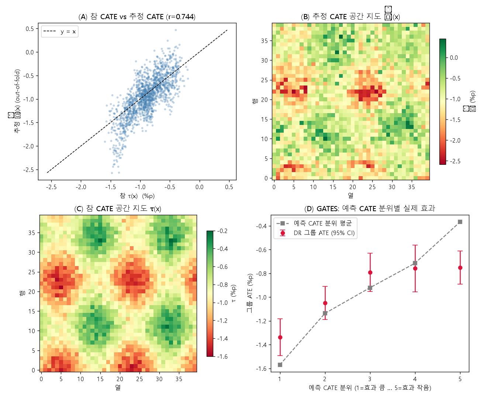
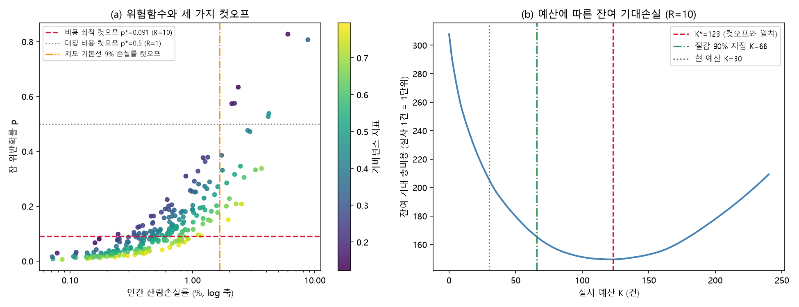

# 9장 환경·기후 정책평가, 위성 관측을 정책 결정으로 바꾸기

> - 이 장에 나오는 손실률, 추정치, 표준오차, 컷오프, 비용은 모두 `lecture_practice/chapter9/`의 코드를 실제로 실행해 얻은 값
> - 예시를 위해 지어낸 숫자는 없음(계산 구조를 보이려고 임의로 넣은 값은 문장 안에서 "임의 입력"이라고 밝힘)

## 1. 이 장의 핵심 질문

1. **보호구역 안의 숲이 덜 훼손된 것은 정책 때문인가**, 아니면 원래 덜 훼손될 곳을 골라 지정했기 때문인가
2. **다음 해에 신규 보호구역 100곳을 지정한다면 어디를 골라야 하는가.** 평균효과로는 왜 이 질문에 답할 수 없는가
3. **실사 인력이 한 해 30건만 움직일 수 있다면 어디를 점검하는가.** 자료도 예측도 그대로인데 대상 수를 움직이는 것은 무엇인가

- 세 질문의 공통점은 **관측이 늘어난다고 답이 저절로 나오지 않는다**는 것임
- 위성이 매일 지구를 관측해도, 그 관측을 지표로 만들고 오차를 진단하고 효과를 추정하고 비용을 세는 단계를 거쳐야 결정이 나옴
- 한 단계를 건너뛰면 다음 단계의 결과를 믿을 근거가 사라짐. 관측 오차를 점검하지 않고 효과부터 추정하면, 그 추정치가 정책 때문에 움직였는지 분류 오차 때문에 움직였는지 구분할 수 없음

## 2. 도입 사례: 사후 비교가 참값의 1.6배가 되는 이유

- 절차를 설명하기 전에, 정책효과를 잘못 재면 무슨 일이 벌어지는지 실제 실행 결과로 먼저 봄
- `9-1-protected-area-forest-loss.log`에서 가져온 보호구역 안팎의 평균 연간 산림손실률(%)

| 집단 | 사전(2001–2010) | 사후(2011–2020) |
| --- | ---: | ---: |
| 보호구역 밖 | 4.781 | 5.264 |
| 보호구역 안 | 4.298 | 3.958 |

- 이 표를 왼쪽부터 읽지 말고 **위아래부터** 읽음
- **사전 기간에 이미 안쪽(4.298)이 밖쪽(4.781)보다 낮음.** 정책이 시행되기도 전에 생긴 차이이므로 정책 효과일 수 없음. 보호구역이 원래 압력이 낮은 곳에 지정됐다는 신호임
- 이 상태에서 "사후 기간 안-밖 차이"만 계산하면 3.958 − 5.264 = **−1.306%p**가 나옴
- 이 장의 합성 자료에는 참 정책효과가 **−0.80%p**로 심겨 있음. 방금 계산한 −1.306%p는 참값보다 1.6배 넘게 큼
- **이 격차를 만든 것은 나쁜 모형이 아니라 비교 방식임.** 정책이 없었어도 원래 낮았던 손실률을 정책의 몫으로 잘못 셌기 때문임
- 결론을 먼저 밝히면, 7절의 이중차분으로 다시 계산한 값은 **−0.822%p**로 참값에 훨씬 가까워짐

## 3. 무엇을 재는가

### 3.1 실제 상태, 관측값, 예측값

- 분석의 첫 작업은 세 값을 구분해 적는 것임
  - **y** = 정책이 실제로 바꾸려는 환경 상태
  - **yᵒᵇˢ** = 센서·분류·행정 기록을 거쳐 자료에 남은 값
  - **ŷ** = 모델이 공변량으로 계산한 예측값

- **산림손실은 y와 yᵒᵇˢ의 거리가 짧음.** 위성 분류가 틀릴 수는 있어도 관측 행위 자체가 벌채를 만들지 않기 때문임. 이 오차는 측정오차로 다루고 5절에서 보정함
- **규제 위반 적발 건수는 거리가 멂.** 단속 자료가 곧 yᵒᵇˢ이므로, **단속을 늘리면 실제 위반율이 그대로여도 yᵒᵇˢ가 늘어남.** 이 지표는 y와 yᵒᵇˢ의 관계 자체를 의심해야 함
- 이 거리를 짧다·멀다로 미리 적어 두면 뒤 단계에서 어떤 진단이 필요한지 정해짐

### 3.2 공간 단위와 집계 가중치

- 환경 현상이 일어나는 단위(픽셀, 격자)와 정책이 집행되는 단위(행정구역, 시설)는 다름
- 격자 단위로 계산한 값을 행정구역으로 모을 때 **무엇으로 가중평균할지가 결과를 바꿈**
- 인구가 적은 산간 구역은 면적 가중에서는 상위로 오르고 인구 가중에서는 하위로 내려감
- "구역 평균 손실률"이라는 말만으로는 무엇을 평균했는지 알 수 없으므로, 표 제목이나 각주에 가중치를 반드시 적음

## 4. 지표를 만든다

### 4.1 활동자료 × 배출계수

- 국가는 산림 부문의 배출·흡수량을 해마다 한 수로 보고해야 하는데, 전국을 현장 조사로 다 세는 것은 예산과 시간 어느 쪽으로도 불가능함
- 이 문제를 우회하는 방법이 배출량을 두 항의 곱으로 쪼개는 것임

E = AD × EF

- **AD**(활동자료, activity data)는 얼마나 많은 면적이 바뀌었는가이고, 위성으로 전국을 같은 기준으로 잴 수 있음
- **EF**(배출계수, emission factor)는 그 면적 1헥타르가 품고 있던 탄소량이고, 현장 표본 조사나 LiDAR 기반 모델에서 나옴
- 아래 계산은 구조를 보이기 위한 **임의 입력**이며 실측치가 아님. AD = 1,000 ha, EF = 150 tC/ha면 E = 150,000 tC ≈ 550,000 tCO₂

### 4.2 두 오차는 더해지지 않고 곱해진다

- AD의 오차 10%, EF의 오차 20%를 넣어 봄
- 두 오차가 곱셈 구조로 결합하므로 최종 오차는 단순히 더한 30%가 아니라 **제곱합의 제곱근인 22.4%**임(두 오차가 서로 독립일 때)
- 이 계산에서 배우는 것은 **개선 순서**임
  - AD 오차를 10%에서 5%로 줄이면 결합 오차는 1.8%p만 내려감
  - EF 오차를 20%에서 10%로 줄이면 8.3%p 내려감
  - **더 큰 쪽 항을 먼저 개선해야 최종 수치가 움직임**

> **주의.** 활동자료와 배출계수의 오차는 더해지지 않고 곱해짐. 면적을 아무리 정밀하게 재도 배출계수가 30% 틀리면 최종 오차는 30% 근처에 머무름. 어느 항을 먼저 개선할지는 두 상대오차의 크기를 비교해 정함.

### 4.3 면적으로는 잡히지 않는 손실

- 나무를 일부만 베어 내 임관이 성글어진 구역은 "산림에서 산림으로" 남으므로 AD로는 잡히지 않지만 **탄소는 실제로 빠져나감.** 이를 **열화**(degradation)라 함
- 면적 기반 산정은 이 손실을 구조적으로 놓치며, 임관 밀도나 바이오매스 지표를 따로 추적해야 보완됨

## 5. 지표 오차를 진단한다

### 5.1 두 방향의 오류

- 4절에서 만든 산림손실률은 위성 변화탐지 모델의 산출물이며 그 자체가 오류를 품음
- **거짓양성**(FP): 변화가 없는데 손실로 판정
- **거짓음성**(FN): 실제 손실을 놓침

- 두 오류가 정책효과 추정에 미치는 영향은 **오류율이 처치군과 대조군에서 같은지**에 달려 있음
- **비차등 오류**: 오류율이 네 집단(처치·대조, 사전·사후)에서 모두 같으면, 정책효과 추정치는 참값에 (1 − 거짓양성률 − 거짓음성률)을 곱한 값이 됨. 방향은 유지되고 크기만 0쪽으로 줄어듦
- **차등 오류**: 보호구역이 산악·오지에 몰려 있어 처치군의 사후 기간에만 그림자 오분류가 늘었다고 하자. 이때는 추정치가 특정 방향으로 밀려남
- **더 위험한 것은 이 상황에서도 전체 정확도 지표가 정상 범위로 나온다는 점임**

> **주의.** 변화탐지 오류가 처치군과 대조군에서 같은 비율로 발생하는지 확인하지 않으면, 전체 정확도가 높아도 정책효과 추정치가 편향됨. 처치·대조 각각에서 거짓양성률·거짓음성률을 따로 추정하고, 두 값이 다르면 오류율 가정별 민감도를 함께 보고함.

### 5.2 참조표본으로 면적을 보정한다

- 오류율을 알려면 지도가 분류한 층별로 표본을 뽑아 실제 상태를 고해상도 영상이나 현장 조사로 판정한 **참조표본**이 필요함
- 아래는 계산 구조를 보이는 **임의 입력**임
  1. 대상 면적 100,000 ha 중 지도가 손실로 분류한 면적이 30,000 ha였음
  2. 참조표본으로 층별 정확도를 확인해 보니 손실 층의 사용자정확도가 0.750, 비손실 층에서 놓친 손실이 10/140이었음
  3. 층별 면적 비율에 그 층의 실제 손실 비율을 곱해 더하면 보정 손실 비율은 0.275
  4. 면적으로는 27,500 ha가 되며, 지도가 그대로 준 30,000 ha보다 **9.1% 작음**
- 이 절차의 요지는 **정확도 수치 하나로 자료 품질을 요약하지 않는 것**임. "정확도 95%"라는 말은 그 5%가 처치·대조 어느 쪽에 몰려 있는지에 따라 결론의 방향까지 바꿀 수 있음

## 6. 실습 안내

- 실습 코드
  - `lecture_practice/chapter9/code/9-0-simdata-prep.py` — 합성 자료 생성(최초 1회 실행)
  - `lecture_practice/chapter9/code/9-1-protected-area-forest-loss.py` — 정책효과 추정, 위험 예측, 결과 해석(7·8·11절)
  - `lecture_practice/chapter9/code/9-2-causal-heterogeneity.py` — 이질성과 표적화(9절)
  - `lecture_practice/chapter9/code/9-3-supply-chain-due-diligence.py` — 컷오프(10절)와 공급망 사례(12절)
- 결과 로그: `lecture_practice/chapter9/results/*.log`

- 이 장의 실습은 GPU가 필요 없음
- 자료 생성과 분석은 분리되어 있음. 9-0을 먼저 돌려야 나머지 코드가 읽을 데이터가 생김
- **7·8·11절이 쓰는 자료(300단위 20년 패널)와 9절이 쓰는 자료(40×40 격자)는 서로 다른 합성 자료임.** 패널에는 모든 격자에 같은 정책효과가 심겨 있어 이질성을 물을 수 없고, 9절은 이질성을 채점하려고 효과 크기가 격자마다 다르게 심긴 별도 자료를 씀. **두 자료의 수치를 같은 표본의 분해로 읽으면 안 됨**

## 7. 정책효과를 추정한다

### 7.1 이중차분으로 선택 편향을 걷어낸다

- 2절에서 본 것처럼 사후 시점의 단순 비교는 선택 편향을 그대로 안고 있음
- **이중차분**(difference-in-differences, DID)은 두 집단의 **수준**이 아니라 **변화량**을 비교해 시간불변의 집단 차이를 제거함

효과 = (처치군 사후 − 처치군 사전) − (대조군 사후 − 대조군 사전)

- 2절 표의 값을 넣으면 (3.958 − 4.298) − (5.264 − 4.781) = −0.340 − 0.483 = **−0.823%p**
- 사전 기간의 수준 차이 −0.483%p가 두 번의 차분 과정에서 상쇄됨. 그 결과 참값 −0.80%p에 훨씬 가까운 추정치가 나옴
- 회귀식으로 쓰면 상호작용 항의 계수가 정책효과가 됨

lossᵢₜ = β₀ + β₁·treatedᵢ + β₂·postₜ + δ·(treatedᵢ × postₜ) + εᵢₜ

```python
import statsmodels.formula.api as smf
res = smf.ols("loss ~ treated + post + treated:post", data=df).fit(
    cov_type="cluster", cov_kwds={"groups": df["unit"]})
```

_전체 코드는 lecture_practice/chapter9/code/9-1-protected-area-forest-loss.py 참고_

- 추정 방법별 정책효과(참 효과 = −0.80%p)

| 방법 | 추정 효과(%p) | 참값과의 오차 | 표본 |
| --- | ---: | ---: | ---: |
| naive(사후 단순 비교) | −1.306 | −0.506 | n = 3,000 |
| DID(전체 표본) | −0.822 | −0.022 | n = 6,000 |
| DID(공통 지지 제한) | −0.804 | −0.004 | n = 4,640 |

- **새 변수를 넣은 것이 아니라 비교 방식만 바꾼 것**인데도 오차가 −0.506%p에서 −0.022%p로 줄어듦
- 표준오차는 0.020(전체)·0.022(공통 지지 제한)이고 p값은 두 경우 모두 0.0000임

> **주의.** 같은 격자를 20년에 걸쳐 관측한 패널에서 일반 표준오차를 쓰면, 표준오차가 실제보다 작게 나와 유의성이 과장됨. 오류 메시지는 나오지 않음. 단위(격자)별 군집 강건 표준오차를 쓰고, 군집 수가 적으면 그 수를 함께 보고함.

### 7.2 공통 지지 구간

- 개발 압력이 0.1인 오지와 0.9인 도시 인접지는 시간에 따른 변화 양상도 다를 수 있음
- 두 집단의 공변량 분포가 겹치는 구간으로 표본을 제한하면 이 위험이 줄어듦. 이 실습 자료에서 그 구간은 압력 [0.36, 0.84]이고, 제한하면 300단위 중 232단위(n = 4,640)가 남음
- **대가도 있음.** 표준오차가 0.020에서 0.022로 커졌고, 추정 대상이 "전체 보호구역"에서 "압력 [0.36, 0.84] 구간의 보호구역"으로 좁아짐. 제한 후 표본 수와 공변량 범위는 반드시 함께 적음

### 7.3 평행추세를 눈으로 먼저 본다


**그림 9.1** 보호구역 안팎의 연도별 산림 손실률 추세와 정책 발효 시점

- 이중차분이 성립하려면 정책이 없었을 때 두 집단의 추세가 나란히 움직였어야 함. 그림 9.1은 정책 발효(2011) 이전 두 집단의 추세가 나란히 움직이다가 발효 후 보호구역 안쪽만 꺾이는 형태를 보임
- **시각적 평행성은 필요조건이지 충분조건이 아님.** 사전 기간이 짧으면 서로 다른 추세도 평행해 보일 수 있음
- 보호구역 경계 근처 격자를 제외하고 다시 추정해 결과가 유지되는지, 평균 대신 중앙값으로도 결론이 유지되는지 확인하는 절차가 함께 필요함

## 8. 보호가 없을 때의 위험을 예측한다

### 8.1 학습 표본을 통제구역으로 제한한다

- 7절은 이미 시행한 정책의 평균 효과를 답함. 다음 배분을 정하려면 다른 값이 필요함 — 아직 보호되지 않은 격자 가운데 **보호가 없다면 어디가 크게 훼손될 것인가**
- 이 값은 관측되지 않으므로 공변량에서 학습해야 하며, **학습 표본을 통제구역**(보호되지 않은 격자, 이 자료에서는 150개)**으로 제한해야 함**
- 처치구역의 사후 손실을 그대로 학습하면 "보호가 없을 때의 위험"이 아니라 "보호가 적용된 뒤에 남은 위험"을 배우게 됨

> **주의.** 처치구역의 사후 손실로 위험 모형을 학습하면 예측 대상에 정책효과가 섞임. 성능 지표는 정상으로 나오므로 실행만으로는 발견되지 않음. 학습 표본을 통제구역으로 제한하고, 그 표본이 전체 공변량 분포를 덮는 범위를 함께 적음.

### 8.2 이웃 값을 넣으면 예측이 좋아진다

- 토양 조건, 임도 접근성, 지역 단속 관행처럼 손실을 좌우하지만 자료로 잡히지 않는 요인이 있음. 이런 요인은 공간적으로 뭉쳐 있는 경우가 많음
- **공간 시차**는 한 격자의 이웃 값들을 가중평균한 값이며, 관측되지 않은 공간 요인의 흔적을 이웃 격자의 사전 손실에서 끌어옴
- 검증도 무작위가 아니라 공간 분할로 함. 이웃 격자는 값이 서로 비슷하므로, 무작위로 나누면 "새 구역으로 일반화하는 능력"이 아니라 **"바로 옆 값을 보간하는 능력"**을 재게 됨. 이 실습은 격자를 좌우로 나누어 학습·검증하는 2겹 공간 블록 교차검증을 씀

| 모델 | R² | RMSE |
| --- | ---: | ---: |
| 공간 피처 포함(공간 시차) | 0.307 | 0.459 |
| 공간 피처 제외 | −0.080 | 0.570 |

- 공간 시차를 빼면 R²가 −0.080으로, **검증 표본의 평균을 그대로 찍는 것보다 나쁨.** 넣으면 0.307로 오름
- 피처 중요도에서도 공간 시차(0.569)가 서식지 가치(0.219), 개발 압력(0.212)보다 크게 앞섬. 관측되지 않은 공간 요인이 손실의 상당 부분을 좌우한다는 뜻임
- **이 값은 예측 기여도이지 인과효과가 아님.** "공간 시차가 크므로 이웃 손실이 벌채의 원인"이라고 읽지 않음

### 8.3 예측구간과 신뢰등급

- 점예측 하나(예: 5.0%p)만으로는 그 값이 얼마나 틀릴 수 있는지 알 수 없음
- **정규화 conformal 예측**은 분포 가정 없이 목표 포함확률을 겨냥하되, 위치마다 예측 난이도가 다르다는 점을 반영한 구간을 만듦
- 계산 절차는 다섯 단계임
  1. 통제구역을 보정표본으로 씀
  2. 교차검증에서 나온 절대잔차로 격자별 "예측 난이도"를 별도로 학습함
  3. 실제 오차를 그 난이도로 나눈 정규화 점수를 만듦
  4. 보정표본에서 이 점수의 90분위수를 구함
  5. 그 분위수에 난이도를 다시 곱해 격자별 반폭을 만듦
- 반폭이 격자마다 달라지는 이유가 여기에 있음. 같은 분위수라도 난이도가 낮은 격자는 반폭이 좁고, 높은 격자는 넓어짐

- 실행 결과 90% 목표에 대한 경험적 포함률은 **0.907**이었고, 구간 반폭은 중앙값 0.511%p, 범위 [0.125, 1.327]%p였음. 반폭을 3분위로 나누면 신뢰등급 높음·중간·낮음이 각 100개씩으로 갈림
- **이 값에는 근사가 섞여 있음.** 학습·보정·시험 표본을 세 갈래로 분리하지 않고 같은 잔차를 두 곳에 함께 썼으므로 포함률 0.907은 다소 낙관적임. 실무에서는 세 갈래를 분리한 split conformal을 씀
- 90% 포함률은 **표본 전체를 겨냥한 값**이며, 특정 격자 하나가 90% 확률로 그 구간 안에 있다는 뜻이 아님. 이 차이를 헷갈리면 개별 격자의 판단에 과도한 확신을 갖게 됨

## 9. 효과가 어디서 큰가

### 9.1 평균 하나로는 배분을 정할 수 없다

- 7절의 이중차분은 보호구역 정책이 손실률을 평균 0.80%p 낮췄다고 답함
- 이 값으로 "정책을 계속할까"는 답할 수 있지만 **"다음 100곳을 어디로 정할까"는 답할 수 없음**
- 공변량 x가 주어졌을 때의 처치효과를 **조건부 평균처치효과**(CATE, τ(x))라 함. 평균처치효과(ATE)는 이 함수를 전체 분포로 평균낸 하나의 수임
- 이질성이 크면 평균은 중심만 보여 주고, 정책적으로 중요한 고효과 지역이 그 안에 묻힘

- 이 절은 **다른 합성 자료**를 씀(6절 참고). 손실 수준은 개발 압력이 정하고, 보호가 막아 주는 손실의 크기는 **집행역량**이 따로 정하도록 설계됨
- 참 CATE는 τ(x) = −(0.20 + 1.40 × 집행역량)으로 심었으며, 격자 1,600개 중 692개가 보호됨. 참 CATE의 범위는 [−1.60, −0.20]%p, 참 ATE는 −0.891%p임

### 9.2 R-러너가 교란을 걷어내는 방식

- 관측 자료에서 보호구역은 무작위로 지정되지 않음. 개발 압력이 낮은 곳이 우선 보호되므로 처치와 결과가 얽혀 있음
- **R-러너**는 결과와 처치를 각각 공변량으로 예측한 뒤 그 예측을 뺀 **잔차**만으로 τ(x)를 추정함
  1. 결과의 주변기대 m̂(x)와 처치의 성향점수 ê(x)를 교차적합으로 학습함(자기 자신을 학습한 모형으로 자기를 예측하면 안 됨)
  2. 잔차 Ỹ = Y − m̂(x), D̃ = D − ê(x)를 만듦(공변량으로 설명되는 부분을 뺀 나머지)
  3. Ỹ/D̃를 목표로, D̃²를 가중치로 하는 가중 회귀로 τ(x)를 적합함

- 한 격자에 숫자를 넣어 봄(계산 흐름을 보이는 **임의 입력**). Y = 4.2, m̂(x) = 3.8, D = 1, ê(x) = 0.62라면 Ỹ = 0.40, D̃ = 0.38이고 유사결과 = 0.40/0.38 = 1.053, 가중치 = 0.38² = 0.144가 됨
- **개별 격자의 유사결과 하나는 잡음이 크게 섞여 있어 그 자체로 효과를 뜻하지 않음.** 가중 회귀가 공변량이 비슷한 격자들의 유사결과를 모아 τ̂(x)를 만듦

- 실행 결과 교차적합 τ̂와 참 τ(x)의 상관은 **Pearson r = 0.744, Spearman ρ = 0.731**이었음. 평균 차원에서는 다음과 같음(참값 τ̄ = −0.891%p)

| 방법 | 추정 ATE(%p) | 참값과의 오차 |
| --- | ---: | ---: |
| naive 하위집단 차이 | −1.343 | −0.452 |
| 이중강건(AIPW) ATE | −0.937 | −0.046 |
| R-러너 τ̂ 평균 | −0.942 | −0.051 |

- naive 하위집단 차이가 크게 벗어나는 이유는 2절과 같음. 저압력 지역이 우선 보호된 선택 편향임

### 9.3 이질성이 진짜인지 검정한다

- τ̂의 산포는 진짜 이질성일 수도, 추정 잡음일 수도 있음. **산포가 있다는 사실만으로는 근거가 되지 않으므로** 두 검정으로 확인함

- **GATES**: τ̂로 격자를 5분위로 나눈 뒤, 각 분위의 실제 효과를 τ̂와 독립인 별도 점수(이중강건 점수)로 채점함(각 분위 n = 320)

| 분위 | 예측 CATE(%p) | 실제 그룹 효과(%p) |
| --- | ---: | ---: |
| 1 (효과 큼) | −1.570 | −1.338 |
| 2 | −1.137 | −1.049 |
| 3 | −0.922 | −0.791 |
| 4 | −0.715 | −0.758 |
| 5 (효과 작음) | −0.368 | −0.751 |

- 분위가 올라갈수록 실제 효과가 줄어들고, 1분위와 5분위의 차이는 +0.587%p(z = 5.52, p = 0.0000)로 잡음으로 설명되는 크기가 아님
- **BLP**: 이중강건 점수를 중심화한 τ̂에 회귀함. 실행 결과 β₁ = +0.519(SE 0.083, z = 6.28, p = 0.0000)로 0보다 유의하게 커 이질성이 재확인됨
- 다만 **β₁이 1보다 작다는 사실도 중요함.** 예측 CATE의 산포가 실제 효과 산포의 약 두 배라는 뜻임

> **주의.** BLP 보정기울기가 1보다 작으면 예측 CATE의 산포가 실제 효과의 산포보다 큼. 이때 τ̂를 지역별 효과의 절대 크기로 인용하면 과장됨. 순위 산정에만 쓰고, 특정 지역의 효과를 수치로 확정하지 않음.

### 9.4 표적화가 실제로 이득이 되는가

- 미보호 격자 908곳 중 신규 보호 100곳을 고르는 네 전략을 비교함. 합성 자료라 참 τ를 알고 있으므로 각 전략이 실제로 막는 총 손실을 채점할 수 있음

| 배분 전략 | 실제 총 저감손실(%p 합) | 무작위 대비 |
| --- | ---: | ---: |
| CATE 표적화(−τ̂ 큰 순) | 123.12 | +43% |
| 사후손실 표적화(관측 손실 큰 순) | 83.28 | −3% |
| 무작위 배분 | 86.17 | 기준 |
| oracle(참 CATE) | 135.13 | +57% |

- CATE 표적화는 무작위보다 43% 더 막고, 참값을 아는 oracle의 91%까지 도달함
- **손실이 큰 곳을 고르는 전략(83.28)이 무작위(86.17)보다 오히려 낮다는 점이 이 표의 핵심임**
- 손실 수준(개발 압력이 정함)과 보호효과(집행역량이 정함)가 **서로 다른 변수**이므로, 손실이 큰 구역이 곧 보호가 잘 듣는 구역이 아니기 때문임
- "위중도가 높은 곳부터 손댄다"는 관행이 이 조건에서는 성립하지 않음. 두 변수가 같은 방향으로 움직이는 지역에서는 결과가 달라질 수 있으며, 그 여부는 자료로 확인해야 함



**그림 9.2** 참·추정 CATE 산점도(왼쪽), 공간 지도(가운데), GATES 분위별 효과(오른쪽)

_전체 코드는 lecture_practice/chapter9/code/9-2-causal-heterogeneity.py 참고_

- 이 결론은 두 가정 위에서만 인과로 성립함 — **무교란**(처치 배정이 관측 공변량으로 충분히 설명됨)과 **positivity**(모든 조건에서 보호 확률이 0과 1 사이에 있음)임
- 실제 자료에서는 집행역량처럼 관측되지 않는 요인이 지정과 손실을 동시에 좌우할 수 있고, 그러면 τ̂도 편향됨

## 10. 등급과 컷오프를 정한다

### 10.1 등급을 예측 대상으로 두면 안 되는 이유

- 앞 절까지의 산출물은 격자별 위험 예측, 구간, 효과 추정치임. 이 값을 행동으로 바꾸려면 "어디까지를 조치 대상으로 볼 것인가"라는 문턱이 필요함
- 흔히 저지르는 실수는 **등급을 목표변수로 두고 지도학습으로 예측하는 것**임
- 등급이 이미 손실률 같은 규칙으로 정의돼 있다면, 그 라벨을 손실률로 다시 예측하고 "손실률이 중요 변수"라고 결론짓는 것은 **넣은 것을 다시 꺼내는 순환논증**임
- 물어야 할 것은 "등급을 어떻게 잘 맞힐까"가 아니라 **"문턱을 어디에 둘 것인가"**이며, 그 답은 자료가 아니라 두 오류의 비용이 정함

### 10.2 비용비가 문턱을 정한다

- 조달 구역이 240곳이고 현장 실사는 한 해 30건만 가능한 기업을 생각함. 각 구역에는 위반확률 p가 붙어 있고, 두 방향의 오류가 서로 다른 손해를 낳음
  - **놓친 위반**(C_FN): 과징금, 계약 파기, 평판 손실
  - **불필요한 실사**(C_FP): 실사 비용과 그 인력을 다른 구역에 못 쓴 기회비용
- 두 선택의 기대손실이 같아지는 지점이 문턱임

p\* = C_FP / (C_FP + C_FN)

- 실사 1건 비용을 1로 두고(C_FP = 1) 놓친 위반의 손해를 10배로 보면(C_FN = 10), p\* = 1/(1+10) = **1/11 ≈ 0.0909**
- 이 문턱이 판정을 어떻게 가르는지 두 구역으로 확인함
  - p = 0.05인 구역: 실사 기대손실 0.95, 미실사 기대손실 0.50 → 실사하지 **않음**
  - p = 0.15인 구역: 실사 0.85, 미실사 1.50 → 실사**함**
- **확률 차이는 0.10에 불과하지만 판정이 갈림.** 문턱이 그 사이에 있기 때문임
- 두 비용이 같으면 p\* = 0.5, 즉 익숙한 "확률 절반" 규칙이 됨. **확률 0.5가 기본값이 되는 것은 비용이 대칭일 때뿐**이며, 환경 규제 맥락에서 이 조건은 거의 성립하지 않음

### 10.3 비용비를 바꾸면 문턱이 움직인다

- 실사 1건 = 1단위, 240구역 기준

| R = C_FN/C_FP | 확률 컷오프 p\* | 실사 건수 | 기대 총비용 | 놓친 위반(기대 건수) |
| ---: | ---: | ---: | ---: | ---: |
| 1 | 0.5000 | 7 | 28.8 | 26.29 |
| 5 | 0.1667 | 59 | 106.0 | 12.97 |
| 10 | 0.0909 | 123 | 149.5 | 5.21 |
| 20 | 0.0476 | 168 | 178.6 | 1.97 |
| 50 | 0.0196 | 219 | 204.1 | 0.31 |
| 100 | 0.0099 | 237 | 208.5 | 0.02 |

- **실사 대상이 7구역에서 237구역으로 움직이는 것은 모형이 바뀐 게 아니라 비용비가 바뀐 결과임**
- R = 10 행의 p\* = 0.0909는 10.2에서 손으로 계산한 값과 일치함

> **주의.** 이 표에서 기대 총비용 열을 행끼리 비교하면 안 됨. R이 다르면 손실함수 자체가 달라 28.8과 208.5는 같은 자로 잰 값이 아님. 비교는 같은 R 안에서 서로 다른 결정 규칙끼리만 함.

### 10.4 예산이 부족하면 순위 문제가 된다

- R = 10의 최적 컷오프는 123구역을 지목함. **실사 예산이 한 해 30건뿐이면 이 컷오프는 실행할 수 없음**
- 이때 물음이 "문턱을 어디에 둘까"에서 **"제한된 K건을 누구에게 쓸까"**로 바뀜
- 한 건의 실사가 줄이는 기대비용은 p에 대해 단조증가하므로, 예산이 구속되면 **확률 상위 K건을 고르는 것**이 최적임

| 실사 건수 K | 잔여 기대 총비용 | 달성한 절감 비율 |
| ---: | ---: | ---: |
| 0 | 307.8 | 0% |
| 10 | 253.8 | 34.1% |
| 30 | 205.7 | 64.5% |
| 60 | 170.1 | 87.0% |
| 90 | 153.5 | 97.5% |
| 123 (K\*) | 149.5 | 100% |

- **절감의 대부분은 앞쪽에서 나옴.** K = 66건에서 이미 달성 가능한 절감의 90%를 얻고, 그 뒤로는 한 건당 절감이 빠르게 줄어듦
- 이 표는 예산 요청서에 그대로 쓸 수 있는 형태임. "실사를 더 해야 한다"가 아니라 **"현재 30건에서 잔여 기대손실이 205.7이고, 60건으로 늘리면 170.1로 내려가 절감의 87%에 이른다"**로 진술할 수 있음



**그림 9.3** 위험함수와 세 가지 컷오프(왼쪽), 실사 예산에 따른 잔여 기대손실 곡선(오른쪽)

## 11. 결과를 해석한다

### 11.1 우선순위표는 위험 → 신뢰 → 집중도 순으로 읽는다

- 앞 절들을 거치면 격자마다 관측 손실률, 위험 예측값, 구간 반폭, 신뢰등급, 순위가 붙음

| 순위 | 행정구역 | 평균 예측위험(%p) | 평균 구간반폭(%p) | 저신뢰 격자 수 | 신뢰등급 |
| ---: | --- | ---: | ---: | ---: | --- |
| 1 | A01 | 5.629 | 0.434 | 4 | 높음 |
| 2 | A02 | 5.293 | 0.519 | 7 | 중간 |
| 3 | A07 | 5.256 | 0.489 | 8 | 높음 |
| 4 | A08 | 5.168 | 0.451 | 1 | 높음 |
| 5 | A10 | 5.141 | 0.568 | 8 | 중간 |
| 6 | A09 | 5.115 | 0.458 | 6 | 높음 |

- 읽는 순서가 있음. 먼저 예측위험으로 후보를 좁히고, 구간 반폭·저신뢰 격자 수로 그 순위를 확정해도 되는지 판정하고, 마지막으로 고위험 격자의 집중도를 봄
- A01은 위험도 1위이면서 저신뢰 격자가 4개뿐이라 곧바로 배분에 쓸 수 있음
- A02와 A10은 위험도가 중상위지만 저신뢰 격자가 각각 7·8개로 많음. **순위를 무시하는 게 아니라, 확정 배분 전에 추가 관측이나 현장 확인으로 불확실성을 줄여야 하는 대상으로 분류함**
- 손실·압력·서식지 가치를 가중합해 사람이 직접 고른 상위 30개와 위험 예측 상위 30개를 비교하면 18개가 겹치고 12곳이 다름. 순위가 바뀌었다는 사실 자체는 영향의 근거일 뿐이므로, 이 격자들이 실제로 우선 후보인지는 손실·압력·보호 여부를 근거로 사람이 마지막으로 판정함

### 11.2 평균만 보고하면 놓치는 것

- 오염과 환경위험의 노출은 균등하지 않음. 산업단지·항만·간선도로 인접 지역, 녹지가 부족한 고밀 주거지역에서 환경 부담과 사회적 취약성이 겹치는 경우가 많음
- **환경정의**는 이 불균등 분포를 다루며, 평가 단계에서는 같은 추정치를 집단별로 쪼개는 절차로 구현됨
  1. 정책이 바꾸려 한 상태 변수(노출 지표)를 정함
  2. 집단과 집계 가중치를 정함(취약계층 인구 비율로 지역을 나누거나, 노출 지표를 취약계층 인구로 가중평균함)
  3. 전체 평균 변화와 취약지역 평균 변화를 나란히 보고함
- **전체는 개선됐는데 취약지역이 정체하면 배분을 다시 검토할 근거가 됨.** 이 분해를 별도 보고서가 아니라 11.1의 우선순위표에 취약계층 인구 비율 열로 추가하면, 상위 구역이 취약지역과 겹치는지 한눈에 확인됨

### 11.3 무엇을 확정하고 무엇을 조건부로 읽을 것인가

| 무엇을 | 판단 | 근거 |
| --- | --- | --- |
| 신뢰할 수 있는 것 | 정책의 평균효과 방향과 크기 | DID −0.822(SE 0.020) |
| 신뢰할 수 있는 것 | 효과가 큰 지역과 작은 지역의 상대 순위 | 참 CATE 상관 r = 0.744, GATES 1−5 차이 z = 5.52 |
| 조건부로만 읽을 것 | 개별 격자의 효과 절대 크기 | BLP β₁ = 0.519 < 1로 예측 산포가 과대 |
| 하지 말아야 할 것 | 무교란이 깨진 상태에서의 인과 해석 | 미관측 교란이 남아 있을 수 있음 |
| 다음에 필요한 것 | 실제 공간자료, 성향점수 겹침 진단 | 실증 분석으로의 확장 조건 |

- **예측 성능이 좋아졌다고 해서 식별 가정이 면제되지 않으며, 예측과 인과는 서로를 대신하지 않음**
- 이 표를 정책 문서에 그대로 붙이면 절대 크기와 상대 순위가 같은 문장 안에서 섞이는 실수를 막을 수 있음

## 12. 사례 전체: 공급망 산림 리스크 실사

- 앞 절들의 결정 주체는 정부였음. 이 사례는 결정 주체가 **기업**으로 바뀜

**제도 배경**

- EU 산림전용방지법(Regulation (EU) 2023/1115)은 팜유·대두·목재·커피·카카오·소·고무 같은 품목을 EU 시장에 내놓으려는 사업자에게 "이 원료가 산림전용과 무관하다"는 실사를 요구함
- 적용 시점은 개정으로 연기되어 대·중 사업자는 2026년 12월 30일, 영세·소 사업자는 2027년 6월 30일부터임(2026년 8월 확인)
- 이 법은 생산국을 저위험·표준위험·고위험으로 나누고 **당국의 표본 점검률**을 각각 1%·3%·9%로 정함

**목적함수가 바뀐다**

- 공공 사례의 목적이 "같은 예산으로 막는 손실을 최대화"였다면, 여기서는 **기대 총비용을 최소화**함
- 효과 추정과 이질성 분석(7·9절)은 하지 않음. **물음이 인과가 아니라 배분이기 때문임**
- 국내 식품·목재 기업이 표준위험 생산국 4개국의 하위 행정구역 240곳에서 원료를 조달하는 상황을 둠
- 실행 결과 손실률은 중위 0.51%, 90분위 1.58%, 99분위 4.19%, 최대 8.761%이고, **손실 면적 상위 10%(24곳)가 전체 손실 면적의 39.6%를 차지함.** 손실이 소수 구역에 쏠려 있다는 조건이 "어디를 볼 것인가"를 결정 문제로 만듦
- 위반확률은 추정하지 않고 로지스틱 위험함수로 **선언**함. 규칙으로 정의된 값을 지도학습으로 복원하면 10.1의 순환논증이 위험함수에도 그대로 적용되기 때문임. 이 설정에서 참 위반확률은 평균 0.128, 범위 [0.006, 0.827]이고, 실현 위반은 240구역 중 25건임

**제도 점검률을 사내 규칙으로 옮길 때의 대가**

- 제도의 1%·3%·9%는 **당국이 감독 자원을 배분한 결과**이지 기업이 스스로 몇 %를 점검해야 하는지를 정한 값이 아님. 그런데 사내 목표율을 정할 때 이 숫자가 기준점으로 옮겨 붙기 쉬움
- 실사 규칙별 기대 총비용(R = 10, 예산 K = 30, 240구역)

| 실사 규칙 | 실사 건수 | 기대 총비용 | 무실사 대비 절감 |
| --- | ---: | ---: | ---: |
| 무실사 | 0 | 307.8 | 0.0 |
| 제도 기본선 9%(고위험 점검률 전용) | 21 | 233.3 | +74.4 |
| 무작위 K = 30 | 30 | 291.6 | +16.1 |
| 손실률 단일 컷오프(K = 30) | 30 | 219.8 | +88.0 |
| 위험순위 상위 K = 30 | 30 | 205.7 | +102.0 |
| 전수 실사 | 240 | 209.2 | +98.5 |
| 비용 최적 컷오프(p\* > 0.0909) | 123 | 149.5 | +158.2 |

- 세 가지를 읽음
  1. **제도 점검률을 그대로 쓰면 비용 최적보다 83.8단위**, 즉 실사 1건 비용의 84배를 더 씀(233.3 대 149.5)
  2. **같은 예산 30건이라도 무엇으로 순서를 매기느냐가 결과를 가름**(위험순위 205.7 대 손실률 단일 컷오프 219.8 대 무작위 291.6)
  3. **전수 실사(209.2)가 표적 30건(205.7)보다 오히려 비쌈.** 문제없는 구역 약 209곳에서 헛되이 인력을 쓰기 때문이며, "다 보면 안전하다"는 판단이 비용 기준으로는 성립하지 않음

> **주의.** 규제가 제시하는 점검률은 감독 당국의 자원 배분 결과이며 기업의 실사 목표율이 아님. 사내 컷오프는 자사의 C_FN과 C_FP로 다시 계산하고, 제도 점검률은 규제 대응의 하한선으로만 인용함.

**가정이 틀렸을 때의 대가**

- 위험함수의 손실률 기울기를 ±50% 틀려도 기대 총비용 초과는 1.3~4.2단위(최적값의 1~3%)에 그침
- 반면 **비용비 R을 한 자릿수 틀리면 초과가 9.4~116.0단위로 커짐**
- 최적 컷오프 부근에서는 기대비용 곡선이 평평해서 위험함수 오차는 잘 흡수되지만, 비용비를 잘못 잡으면 컷오프 자체가 다른 자리로 옮겨 가 평평한 구간을 벗어나기 때문임
- 실무 함의는 순서 문제임. 먼저 확보할 것은 더 정교한 위험 모형이 아니라 **C_FN / C_FP**이며, 과징금·계약 파기·대체 조달 비용을 세어 비용비의 자릿수를 확정하는 일이 모형을 정교화하는 일보다 결정에 크게 기여함

**대조군으로 확인하기**

- 이 절차가 옳게 작동하는지는 **대조군**으로 확인함. 위반이 손실률과 무관하게 발생하는 세계에서는 위험순위로 고른 30건과 무작위 30건의 성적이 같아야 함
- 실행 결과 그 차이는 **+0.0**(SD 27.2, 300회 재추출)으로 이득이 정확히 사라졌고, 신호가 있는 세계에서는 **−89.0**(SD 32.0)이었음
- 위험순위의 이득이 정렬이라는 절차 자체가 아니라 **손실률·거버넌스라는 신호에서 나온다는 뜻임**

_전체 코드는 lecture_practice/chapter9/code/9-3-supply-chain-due-diligence.py 참고_

- 공공 분석과 이 사례를 나란히 두면 파이프라인의 앞쪽(위성 산출물에서 지표를 만드는 부분)은 거의 같음. 갈리는 것은 뒤쪽임 — **무엇을 비용으로 세는가, 그리고 누가 그 결과로 무엇을 결정하는가**

## 13. 핵심 요약

- **관측이 늘어난다고 정책효과가 저절로 드러나지 않음.** 지표를 만들고 오차를 진단하고 효과를 추정하고 비용을 세는 단계를 거쳐야 결정이 나옴 (1절)
- **사후 단순 비교는 선택 편향을 그대로 안음.** 실습에서 −1.306%p로 참값 −0.80%p의 1.6배가 나왔고, 이중차분으로 비교 방식만 바꾸자 −0.822%p가 됨 (2절, 7.1)
- **실제 상태와 관측값의 거리는 지표마다 다름.** 산림손실은 가깝지만, 단속 적발 건수는 단속을 늘리면 위반율이 그대로여도 늘어남 (3.1)
- **활동자료와 배출계수의 오차는 더해지지 않고 곱해짐.** 10%와 20%가 결합하면 30%가 아니라 22.4%이고, 큰 항을 먼저 개선해야 최종 수치가 움직임 (4.2)
- **차등 오류가 비차등 오류보다 위험함.** 처치·대조에서 오류율이 다르면 추정치가 밀리는데 전체 정확도는 정상으로 나옴 (5.1)
- **위험 모형은 통제구역으로 학습함.** 처치구역 사후 손실로 학습하면 예측 대상에 정책효과가 섞이는데 성능 지표는 정상으로 나옴 (8.1)
- **평균효과로는 배분을 정할 수 없음.** 손실이 큰 곳을 고르는 전략이 무작위보다 못했음(83.28 대 86.17). 손실 수준과 보호효과가 서로 다른 변수이기 때문임 (9.1, 9.4)
- **산포가 있다는 사실만으로는 이질성의 근거가 되지 않음.** GATES·BLP로 검정하고, BLP 기울기가 1보다 작으면 τ̂를 순위 산정에만 씀 (9.3)
- **문턱은 자료가 아니라 두 오류의 비용이 정함.** 자료도 예측도 그대로인데 실사 대상이 7건에서 237건까지 움직이며, 움직인 것은 비용비뿐임 (10.2, 10.3)
- **예산이 구속되면 문턱 문제가 순위 문제로 바뀜.** 제도가 제시하는 점검률은 감독 당국의 자원 배분 결과이지 기업의 목표율이 아니며, 그대로 쓰면 비용 최적보다 실사 1건 비용의 84배를 더 씀 (10.4, 12절)

## 14. 과제

```bash
python scripts/submit.py 9 --id 학번 --name 이름
```

- 실행하면 `9-0-simdata-prep.py`로 자료를 먼저 만들고, `9-3-supply-chain-due-diligence.py`(공급망 산림 리스크 실사)를 학번 시드로 돌려 `submissions/` 폴더에 `제출_9장_학번.md`를 생성함
- **눈여겨볼 곳은 비용비(R)에 따라 달라지는 확률 컷오프와 실사 대상 구역 수**

- 제출 파일 안의 빈칸 세 개를 채움

1. 로그에서 눈에 띈 숫자 하나를 그대로 옮겨 적고, 왜 눈에 띄었는지 한 문장으로 적음
2. 그 숫자가 왜 그렇게 나왔는지 이 장에서 배운 개념으로 한두 문장 설명함
3. **데이터도 예측도 그대로인데 실사 대상 구역 수가 크게 움직인다. 무엇이 그것을 움직이는가? 당신이 리스크 담당자라면 몇 곳을 검사하겠는가?**

- **3번이 이 과제의 핵심임**. 1·2번은 로그를 보면 답이 나오지만 3번은 판단이 필요함

> - **막혀도 제출함**
> - 실행이 실패하면 오류 메시지가 파일에 담기고, 질문이 "어디서 막혔나"로 바뀜
> - 실행 성공 여부로 점수를 매기지 않음

> - **이 장의 실습은 학번을 시드로 씀**
> - 비용비·실사 건수 등 구체적인 숫자가 이 문서의 표와 정확히 같지 않을 수 있음
> - 중요한 것은 방향임 — 비용비 R이 커지면 실사 건수도 늘어나는지 확인
